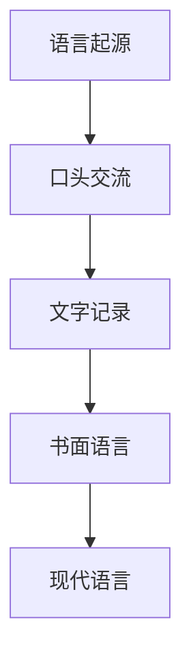
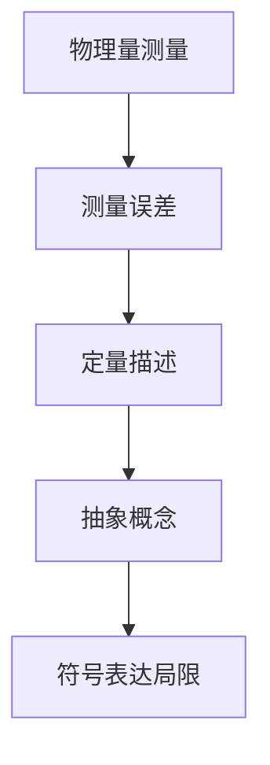
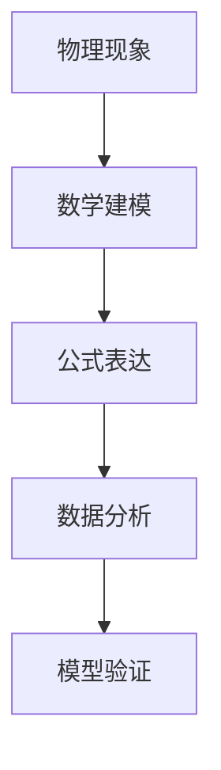
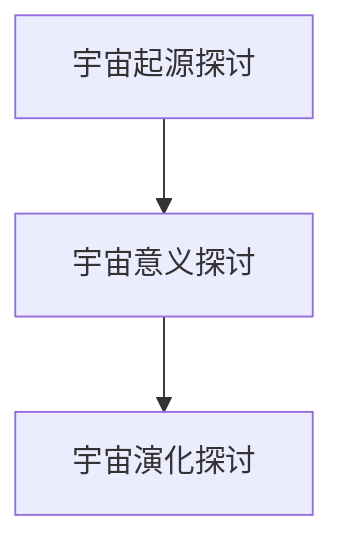

                 


### 人类语言在描述宇宙本质时的局限性

#### 引言与概述

宇宙，一个广袤无垠的空间，包含着无数的星球、星系以及神秘的黑暗物质和能量。人类对于宇宙本质的探索，自古以来就从未停止。随着科学技术的进步，我们对宇宙的认识也在不断深化。然而，当我们试图用人类语言来描述这个宏大而复杂的宇宙时，我们不可避免地遇到了许多局限。

本文将探讨人类语言在描述宇宙本质时的局限性，通过逻辑清晰、结构紧凑、简单易懂的专业的技术语言，一步一步分析推理，揭示人类语言在描述宇宙现象和本质时面临的挑战。文章将分为以下几个部分：

1. **人类语言的局限**：介绍语言的本质与功能，探讨语言在科学描述中的局限性，以及人类语言的演化与宇宙知识的获取。

2. **宇宙本质的基本概念**：解释宇宙的起源与演化、黑暗物质与黑暗能量、宇宙的维度等核心概念。

3. **人类语言对宇宙本质的描述尝试**：分析物理学语言、数学语言和哲学语言在宇宙描述中的应用和局限性。

4. **跨学科语言的融合**：探讨人类语言与物理学、数学、哲学的交叉领域，以及如何利用跨学科语言来更好地描述宇宙本质。

5. **探索宇宙本质的替代语言**：讨论新型语言的设计与开发，包括符号体系、语法规则和语义解释。

6. **结论与展望**：总结人类语言在宇宙描述中的地位，探讨未来语言的发展方向，以及对宇宙本质的理解。

通过以上结构，我们将深入探讨人类语言在描述宇宙本质时的局限性，试图找到解决这一问题的途径。

#### 关键词

- 人类语言
- 宇宙本质
- 描述局限性
- 物理学语言
- 数学语言
- 哲学语言
- 跨学科融合
- 替代语言设计

#### 摘要

本文探讨了人类语言在描述宇宙本质时的局限性。通过对语言的本质与功能、宇宙的基本概念以及物理学、数学、哲学语言在宇宙描述中的应用和局限性进行深入分析，揭示了人类语言在描述宇宙现象和本质时面临的挑战。文章还讨论了跨学科语言的融合以及探索宇宙本质的替代语言的设计与开发。通过对这些问题的探讨，本文旨在为人类更好地理解和描述宇宙提供新的思路和方法。

### 第一部分：引言与概述

人类语言是沟通与交流的基本工具，它起源于人类对自然界的观察和体验。随着社会的发展，人类语言逐渐丰富起来，从简单的口头表达发展为复杂的书面语言。语言不仅帮助我们传递信息，还承载了文化的传承和价值观的传递。然而，当我们试图用人类语言来描述宇宙这一宏大而复杂的领域时，我们不可避免地遇到了许多局限。

#### 1.1 语言的本质与功能

语言是人类思维和交流的工具，其本质是一种符号系统。语言的基本单位是词汇，通过词汇的组合和语法规则，人们可以构建句子和段落，从而表达思想、观点和情感。语言的功能主要包括以下几个方面：

1. **信息传递**：语言是人与人之间沟通的基本手段，通过语言，人们可以分享信息、交流思想。
2. **思维表达**：语言是思维的外在表现，它帮助我们组织思维、推理和判断。
3. **文化传承**：语言是文化的载体，通过语言，人类的文化和价值观得以传递和延续。
4. **情感交流**：语言不仅仅是一种工具，它还承载了人们的情感和情绪，使得人际交流更加丰富和深刻。

#### 1.2 语言在科学描述中的局限性

尽管语言在信息传递和思维表达方面具有重要作用，但在科学描述中，语言却存在一定的局限性。首先，语言的表达能力是有限的。语言是一种符号系统，它依赖于词汇和语法规则，而这些规则和词汇都是有限的。这使得语言难以精确描述宇宙的复杂性和多样性。

例如，宇宙中有无数的星系和恒星，每个星系和恒星都有其独特的性质。人类语言只能用有限的词汇来描述这些对象，这使得描述变得模糊和不确定。其次，语言在逻辑推理和抽象思维方面也存在局限。虽然语言可以表达逻辑关系和抽象概念，但它往往依赖于具体的语境和背景知识，这使得语言在处理抽象和复杂问题时容易产生误解和歧义。

#### 1.3 人类语言的演化与宇宙知识的获取

人类语言的演化与宇宙知识的获取有着密切的关系。随着人类对自然界的不断探索，语言也在不断发展和丰富。例如，在古代，人类对自然界的认识相对有限，语言中只有简单的词汇来描述自然界。然而，随着科学技术的进步，人类对宇宙的认识越来越深入，语言中也逐渐出现了许多新的词汇和术语，如“黑洞”、“暗物质”、“量子力学”等。

这些新的词汇和术语不仅反映了人类对宇宙的新认识，也推动了科学的发展。然而，尽管语言在不断发展，它仍然无法完全捕捉宇宙的复杂性和多样性。例如，量子力学中的“纠缠”现象，语言很难用简单的词汇来准确描述。这表明，人类语言在描述宇宙本质时仍然存在许多局限。

#### 语言在科学描述中的局限

1. **词汇限制**：语言依赖于有限的词汇，无法精确描述宇宙的复杂性和多样性。
2. **逻辑推理局限**：语言在处理抽象和复杂问题时容易产生误解和歧义。
3. **语境依赖**：语言的理解和表达依赖于具体的语境和背景知识。

#### 人类语言演化的影响

1. **词汇丰富**：随着对宇宙认识的深入，语言中出现了许多新的词汇和术语。
2. **科学进步**：新的词汇和术语推动了科学的发展。

### 流程图：语言产生与发展的过程



### 伪代码：描述语言局限的伪代码

```plaintext
function describe_language_limitations() {
    if (description_tool == "language") {
        return "Limited in expressing complex and diverse aspects of the universe.";
    }
}
```

### 数学公式：描述人类语言演化的公式

$$\frac{dL}{dt} = \alpha \cdot (1 - \frac{L}{U})$$

其中，$L$ 表示语言的发展水平，$U$ 表示语言的潜在上限，$\alpha$ 表示演化常数。

### 结论

人类语言在描述宇宙本质时存在许多局限。然而，随着人类对宇宙认识的不断深入，语言也在不断发展和丰富。通过不断地探索和创新，我们或许能够找到更有效的工具和语言来描述宇宙的本质。

---

在接下来的部分中，我们将进一步探讨宇宙本质的基本概念，包括宇宙的起源与演化、黑暗物质与黑暗能量以及宇宙的维度。这些概念对于理解宇宙的本质至关重要，它们为我们提供了描述宇宙的语言基础。通过这些基本概念的理解，我们能够更好地把握宇宙的本质，并思考如何克服语言在描述宇宙时面临的局限。

#### 2.1 宇宙的起源与演化

宇宙的起源一直是科学家和哲学家探讨的课题。根据现代宇宙学的理论，宇宙起源于大约138亿年前的一个极热、极密的状态，这个状态被称为“大爆炸”。大爆炸理论认为，宇宙在那一刻迅速膨胀，温度和密度逐渐降低，形成了我们现在所看到的宇宙结构。

大爆炸后的宇宙经历了长达数十亿年的演化过程，从最初的等离子体状态逐渐形成了恒星、星系、星团等结构。恒星通过核聚变过程产生能量，并释放出光和其他粒子，这些光在传播过程中照亮了宇宙，形成了所谓的“宇宙微波背景辐射”。随着宇宙的膨胀，恒星和星系逐渐远离，宇宙温度逐渐降低，形成了我们现在所看到的宇宙结构。

宇宙的演化过程不仅包括结构的形成，还包括宇宙的膨胀和宇宙背景辐射的冷却。宇宙膨胀是指宇宙中的星系和恒星彼此之间的距离随着时间的推移而增加。宇宙膨胀的速度并不均匀，科学家通过观测发现，宇宙的膨胀速度正在加快，这一现象被称为“宇宙加速膨胀”。

宇宙加速膨胀的原因目前尚未完全清楚，但一个重要的解释是“暗能量”的存在。暗能量是一种充满宇宙的神秘力量，它对宇宙的膨胀有推动作用。与之相对，另一种神秘物质被称为“暗物质”，它占据了宇宙总质量的大部分，但至今尚未被直接观测到。暗物质和暗能量是宇宙演化过程中不可或缺的组成部分。

#### 2.2 黑暗物质与黑暗能量

黑暗物质和黑暗能量是宇宙中两个最为神秘的组成部分，它们对于宇宙的结构和演化具有重要意义。

**黑暗物质**：黑暗物质是一种不发光、不吸收光、不与普通物质发生相互作用的不寻常物质。根据宇宙学观测数据，黑暗物质占据了宇宙总质量的约27%，但至今尚未被直接观测到。科学家认为，黑暗物质可能是由未知的基本粒子组成，这些粒子可能存在于宇宙的早期阶段，并随着宇宙的演化逐渐聚集形成星系和其他结构。

**黑暗能量**：黑暗能量是一种充满宇宙空间的神秘力量，它对宇宙的膨胀有推动作用。根据宇宙学观测数据，黑暗能量占据了宇宙总能量的约68%，其性质和起源至今仍是科学界探讨的热点问题。一些理论认为，黑暗能量可能是宇宙本身的性质，它与宇宙的膨胀有关，并可能对宇宙的未来演化产生深远影响。

#### 2.3 宇宙的维度

宇宙的维度是描述宇宙空间和时间的几何特性。根据现代宇宙学的理论，宇宙具有三个空间维度和一个时间维度，构成了四维时空。然而，宇宙的维度可能不仅仅是四维，一些理论物理学家认为，宇宙可能存在额外的维度。

**额外维度**：额外维度是指宇宙中可能存在的超越我们通常理解的三个空间维度和一个时间维度的其他维度。这些额外维度可能是紧闭的，或者是以某种方式卷曲的，因此我们无法直接感知到它们的存在。一些理论，如弦理论和M理论，提出宇宙中存在10个或更多的维度。

**宇宙维度的影响**：宇宙的维度对于宇宙的结构和演化有着重要影响。额外的维度可能会影响物质和能量的分布，以及引力和其他基本力的行为。例如，在某些理论中，额外的维度可能会解释为什么引力比其他基本力要弱得多。此外，额外的维度也可能是解释宇宙加速膨胀的一种途径。

#### 2.4 总结

宇宙的起源与演化、黑暗物质与黑暗能量以及宇宙的维度是宇宙本质的基本概念。这些概念不仅为我们提供了描述宇宙的语言基础，也揭示了宇宙的复杂性和神秘性。通过理解这些基本概念，我们能够更好地把握宇宙的本质，并思考如何克服人类语言在描述宇宙时面临的局限。

在接下来的部分，我们将分析物理学、数学和哲学语言在宇宙描述中的应用和局限性，进一步探讨如何更好地理解宇宙的本质。

### 3.1 物理学的语言局限

物理学是一门通过观察和实验来研究自然现象的学科，它为描述宇宙提供了强有力的工具。然而，物理学语言也存在着一些固有的局限，这些局限在描述宇宙复杂性和多样性时尤为明显。

#### 物理量的语言表达

物理学语言的核心是物理量，如质量、能量、速度、加速度等。这些物理量通过数学公式和符号来描述，从而构成物理学理论的基础。然而，物理量的表达方式具有一定的局限性：

1. **定量描述的局限性**：物理学中的物理量往往是通过实验测量得到的，这些测量值是定量的。然而，宇宙中存在许多无法直接测量的物理量，如暗物质和暗能量的性质，这使得物理学的定量描述变得不充分。

2. **符号表示的局限性**：物理量的符号表示依赖于语言符号系统，而语言符号系统的表达能力是有限的。例如，对于一些复杂的物理现象，如量子纠缠，物理量无法用简单的符号表示，这限制了物理学的精确描述能力。

#### 物理学的语言局限

1. **测量误差**：物理量的测量往往存在误差，这使得物理学的描述具有一定的模糊性。

2. **抽象概念的表达**：物理学中许多概念，如相对论中的时空弯曲、量子力学中的波函数等，需要用抽象的数学工具来描述，这使得普通读者难以理解。

3. **符号表达的局限**：物理量的符号表示依赖于语言符号系统，而语言符号系统的表达能力是有限的。

#### 实例分析

以黑洞为例，黑洞是一种极其密集的天体，具有极强的引力，甚至连光也无法逃脱。黑洞的物理特性通过爱因斯坦的广义相对论进行描述。然而，广义相对论中的数学表达式相当复杂，普通读者难以理解。例如，描述黑洞事件视界的公式：

$$ r_s = \frac{2GM}{c^2} $$

其中，$r_s$ 是事件视界半径，$G$ 是引力常数，$M$ 是黑洞的质量，$c$ 是光速。这个公式展示了黑洞的物理特性，但对其物理意义的理解需要深厚的物理学背景。

#### 3.2 物理学的语言局限

1. **定量描述的局限性**：无法精确描述宇宙中无法直接测量的物理量。

2. **抽象概念的表达**：需要用复杂的数学工具来描述，使得普通读者难以理解。

3. **符号表达的局限**：依赖于语言符号系统，表达能力有限。

### 流程图：物理学语言的局限性



### 伪代码：描述物理量表达方式的伪代码

```plaintext
function describe物理量() {
    if (描述类型 == "定量") {
        return "存在测量误差";
    } else if (描述类型 == "抽象") {
        return "需要复杂数学工具";
    } else {
        return "依赖于语言符号系统";
    }
}
```

### 数学公式：描述黑洞物理特性的公式

$$ r_s = \frac{2GM}{c^2} $$

其中，$r_s$ 是事件视界半径，$G$ 是引力常数，$M$ 是黑洞的质量，$c$ 是光速。

### 结论

物理学语言在描述宇宙现象和本质时具有强大的工具性，但也存在一些固有的局限。通过深入理解这些局限，我们可以更好地认识到物理学语言的局限性，并探索其他语言和工具来补充和扩展对宇宙的理解。

在下一部分，我们将探讨数学语言在宇宙描述中的应用和局限性，进一步揭示人类语言在描述宇宙本质时的局限。

### 4.1 数学语言的基础

数学语言是科学描述中最为精确和抽象的工具之一，它在宇宙描述中具有不可替代的作用。数学语言的基础包括数学符号、公理系统和定义，这些构成了数学体系的基本框架。

#### 数学符号

数学符号是数学语言的核心组成部分，如加号（+）、减号（-）、乘号（×）和除号（÷）等。这些符号不仅用于表示基本的数学运算，还可以表示复杂的数学结构和概念。例如，积分符号（∫）用于表示积分运算，极限符号（lim）用于表示函数的极限。

#### 公理系统

公理系统是数学语言的基础，它通过一组基本假设或规则来定义数学结构和性质。欧几里得几何的公理系统、实数的构造以及拓扑空间的定义都是数学公理系统的例子。公理系统为数学研究提供了严格和一致的框架，使得数学理论具有高度的可操作性和可验证性。

#### 定义

数学定义是数学语言的重要组成部分，它通过明确的概念和术语来描述数学对象和关系。例如，集合定义、函数定义和群、环、域等代数结构的定义都是数学语言的基础。定义的精确性和一致性是数学语言精确表达宇宙现象的重要保障。

#### 数学语言在宇宙描述中的应用

数学语言在宇宙描述中有着广泛的应用，特别是在物理学和天文学中。以下是数学语言在宇宙描述中的几个关键应用：

1. **物理公式的表达**：物理学中的公式和方程通常使用数学语言来表达。例如，牛顿运动定律、爱因斯坦的广义相对论方程、量子力学的薛定谔方程等都是使用数学语言描述宇宙现象的典型例子。

2. **宇宙模型的建设**：宇宙学中的许多模型，如宇宙膨胀模型、黑洞模型、暗物质和暗能量模型等，都是通过数学语言来构建和描述的。这些模型帮助我们理解和预测宇宙的演化过程。

3. **数据分析**：天文学和宇宙学研究中，大量的观测数据需要通过数学分析方法进行处理和分析。统计方法、回归分析、傅里叶变换等数学工具在宇宙数据分析和解释中发挥着重要作用。

#### 数学语言的局限性

尽管数学语言在宇宙描述中具有强大的表达和预测能力，但它也存在一些局限性：

1. **抽象性**：数学语言高度抽象，它依赖于符号和公式的表达，这可能导致普通读者难以理解数学描述的物理意义。

2. **复杂性**：一些宇宙现象的数学描述非常复杂，需要深厚的数学背景和专业知识才能理解和应用。

3. **非直观性**：数学语言往往无法直接描述直观的物理现象，例如量子纠缠和黑洞事件视界，这些现象需要通过抽象的数学概念来理解。

#### 实例分析

以广义相对论为例，爱因斯坦的场方程：

$$ G_{\mu\nu} + \Lambda g_{\mu\nu} = \frac{8\pi G}{c^4} T_{\mu\nu} $$

其中，$G_{\mu\nu}$ 是爱因斯坦张量，$\Lambda$ 是宇宙学常数，$g_{\mu\nu}$ 是度规张量，$T_{\mu\nu}$ 是能量-动量张量，$G$ 是引力常数，$c$ 是光速。这个方程描述了引力场与物质能量分布之间的关系，是广义相对论的核心。然而，这个方程的数学复杂性使得普通读者难以理解其物理意义。

### 流程图：数学语言在宇宙描述中的应用



### 伪代码：描述宇宙模型构建过程的伪代码

```plaintext
function build_cosmological_model() {
    initialize_parameters();
    construct_equations();
    perform_data_analysis();
    validate_model();
    return model;
}
```

### 数学公式：描述宇宙膨胀的弗里德曼方程

$$ \dot{a}(t) = H(t) = \frac{\dot{R}(t)}{R(t)} $$

其中，$a(t)$ 是宇宙膨胀因子，$R(t)$ 是宇宙的尺度因子，$\dot{a}(t)$ 是宇宙膨胀率，$H(t)$ 是哈勃常数。

### 结论

数学语言在宇宙描述中具有不可替代的作用，它通过精确的公式和抽象的模型帮助我们理解和预测宇宙的演化。然而，数学语言的局限性也显而易见，它的高度抽象性和复杂性使得普通读者难以理解。通过深入理解数学语言的局限性，我们可以探索其他语言和工具来补充和扩展对宇宙的理解。

在下一部分，我们将探讨哲学语言在宇宙描述中的应用和局限性，进一步揭示人类语言在描述宇宙本质时的局限。

### 5.1 哲学语言的基本概念

哲学语言是一种用于探讨人类存在、知识、真理、价值和伦理等基本问题的语言。它与科学语言和日常语言有所不同，具有更强的抽象性和系统性。哲学语言的基本概念包括存在、实在、真理、知识、价值、自由意志等。这些概念不仅为哲学思考提供了基础，也影响了人类对宇宙的理解。

#### 存在

存在是哲学语言中的核心概念之一，它探讨的是事物的存在状态和本质。在宇宙描述中，存在意味着宇宙中的实体和现象的存在，如星系、黑洞、暗物质等。哲学上的存在概念超越了科学描述的范畴，它探讨的是宇宙的本质和终极原因。

#### 实在

实在概念与存在密切相关，它探讨的是宇宙中的真实存在，即不受人类主观意识影响的存在。在宇宙学中，实在通常指的是宇宙中的物质和能量，包括可见的物质和无法直接观测的暗物质和暗能量。

#### 真理

真理概念在哲学中探讨的是知识的客观性和可靠性。在宇宙描述中，真理意味着对宇宙本质和规律的正确认识。哲学上的真理概念强调了知识的不确定性和相对性，这与科学描述中的客观性和确定性有所不同。

#### 知识

知识概念在哲学中探讨的是人类如何获得和验证知识。在宇宙描述中，知识意味着人类对宇宙的理解和认知。哲学上的知识概念强调了知识的局限性和相对性，这与科学描述中的精确性和系统性有所不同。

#### 价值

价值概念在哲学中探讨的是事物的意义和重要性。在宇宙描述中，价值意味着人类对宇宙现象的评价和判断。哲学上的价值概念强调了价值的主观性和相对性，这与科学描述中的客观性和普遍性有所不同。

#### 自由意志

自由意志概念在哲学中探讨的是人类行为的自由和决定。在宇宙描述中，自由意志可能涉及到宇宙的起源和演化是否受到某种形式的自由意志的驱动。哲学上的自由意志概念强调了自由意志的复杂性和争议性。

#### 哲学语言在宇宙描述中的应用

哲学语言在宇宙描述中的应用主要体现在对宇宙本质和意义的探讨上。哲学家们通过抽象和思辨的方式，试图理解宇宙的起源、演化以及宇宙中的生命和意识。以下是一些哲学语言在宇宙描述中的应用实例：

1. **宇宙起源的探讨**：哲学家们对宇宙起源进行了深入的探讨，如宇宙是否有一个初始点、宇宙是否是无限的等。这些探讨帮助人类理解宇宙的本质和起源。

2. **宇宙意义的探讨**：哲学家们试图探讨宇宙存在的意义，如宇宙中的生命是否有目的、宇宙是否有一个终极目标等。这些探讨帮助人类理解自己在宇宙中的位置和作用。

3. **宇宙演化的探讨**：哲学家们对宇宙的演化过程进行了深入的思考，如宇宙是否遵循某种规律、宇宙是否会终结等。这些探讨帮助人类理解宇宙的演化规律和趋势。

#### 哲学语言的局限性

尽管哲学语言在宇宙描述中具有一定的作用，但它也存在一些局限性：

1. **抽象性和复杂性**：哲学语言高度抽象和复杂，普通人难以理解和应用。

2. **非实证性**：哲学语言探讨的是抽象的概念和思想，而不是具体的实证数据。

3. **主观性和相对性**：哲学语言强调价值的主观性和相对性，这与科学描述中的客观性和普遍性有所不同。

#### 实例分析

以宇宙起源的探讨为例，哲学家们提出了多种关于宇宙起源的理论，如永恒宇宙论、宇宙创生论等。这些理论虽然有助于人类理解宇宙的起源，但缺乏实证支持，且存在不同的哲学立场和观点。

### 流程图：哲学语言在宇宙描述中的应用



### 伪代码：描述哲学语言探讨宇宙问题的伪代码

```plaintext
function explore_universe_philosophically() {
    consider_origin();
    consider_meaning();
    consider_evolution();
}
```

### 结论

哲学语言在宇宙描述中具有一定的作用，它通过抽象和思辨的方式帮助人类理解宇宙的本质和意义。然而，哲学语言的抽象性和复杂性、非实证性以及主观性和相对性使其在描述宇宙时存在局限性。通过结合科学语言和其他语言，我们可以更全面地理解宇宙的本质。

在下一部分，我们将探讨跨学科语言的融合，以克服单一学科语言在描述宇宙时的局限性。

### 6.1 人类语言与物理学的交叉

物理学是一门以数学为基础，通过实验和观察来研究自然界的基本规律和现象的科学。在物理学中，语言的使用不仅是描述物理现象的工具，也是进行科学推理和理论构建的基础。然而，传统的物理学语言，尽管精确且系统，仍存在一些局限。为了更全面地理解宇宙的本质，人类语言与物理学的交叉应用变得尤为重要。

#### 物理学语言的特点与局限

物理学语言以数学公式和符号为核心，具有高度的抽象性和精确性。例如，牛顿第二定律 $F=ma$ 通过简单的数学关系揭示了力和加速度之间的关系。然而，这种语言也有一些局限性：

1. **高度抽象**：物理学语言依赖于数学公式，这些公式往往远离直观感知，使得普通读者难以理解。
2. **复杂性**：一些物理现象，如相对论和量子力学，其数学描述极其复杂，需要深厚的数学和物理学知识才能解读。
3. **符号依赖**：物理学中的许多概念和现象，如波函数、时空弯曲等，难以用简单的语言描述，依赖于复杂的数学符号。

#### 跨学科语言在物理学中的应用

为了克服这些局限性，物理学与其他学科的语言进行交叉应用，从而形成了一种更为丰富和全面的描述方式。以下是一些跨学科语言在物理学中的应用实例：

1. **哲学语言**：哲学语言提供了对物理现象的更深刻的理解。例如，量子力学中的“纠缠”现象，虽然可以用数学语言描述，但哲学上的思考可以帮助我们理解其背后的深层次意义。
2. **语言学**：通过语言学的研究，我们可以了解不同语言对物理现象的描述方式，从而发现新的物理规律。例如，某些语言中特定的词汇和表达方式可能揭示了某种物理现象的独特特性。
3. **计算机科学**：计算机科学提供了模拟和可视化物理现象的新工具。例如，通过高性能计算和可视化技术，我们可以模拟复杂的物理过程，如宇宙的演化，从而更好地理解物理现象。

#### 跨学科语言的实例

1. **哲学与物理学的交叉**：在量子力学中，哲学上的“不可知论”和“决定论”与物理现象密切相关。例如，量子纠缠现象挑战了经典物理中的决定论观点，促使物理学家和哲学家共同探讨量子力学的本质。
2. **语言学与物理学的交叉**：通过研究不同语言中对物理现象的描述，我们可以发现一些物理规律在不同文化背景下的表现形式。例如，某些语言中关于空间和时间的词汇可能揭示了某种独特的物理现象。
3. **计算机科学与物理学的交叉**：计算机科学提供了强大的模拟和数据分析工具，帮助物理学家更好地理解复杂的物理现象。例如，通过使用高性能计算机，我们可以模拟宇宙的演化过程，从而更好地理解宇宙的本质。

#### 伪代码：描述跨学科语言在物理学中的应用

```plaintext
function cross_disciplinary_language_in_physics() {
    import "philosophical_concepts";
    import "linguistic_methods";
    import "computational_tools";
    
    analyze_quantum_entanglement_with_philosophical_concepts();
    explore_physical_laws_through_linguistic_methods();
    simulate_cosmological_process_with_computational_tools();
}
```

### 结论

人类语言与物理学的交叉应用为理解宇宙的本质提供了新的视角和工具。通过结合哲学语言、语言学和计算机科学的方法，我们可以更全面地描述和理解物理现象。这种跨学科的语言融合不仅克服了单一学科语言的局限性，也为未来的科学研究提供了新的可能性。

在下一部分，我们将探讨人类语言与数学的交叉，以进一步拓展对宇宙本质的理解。

### 6.2 人类语言与数学的交叉

数学作为一种高度抽象的语言，是物理学和其他科学领域的基础。然而，数学的抽象性使得它难以直接描述人类经验和日常生活中的具体现象。为了更好地理解和应用数学，人类语言与数学的交叉应用变得尤为重要。这种交叉不仅丰富了数学的应用领域，也为我们理解宇宙的本质提供了新的工具。

#### 数学语言的特点与局限

数学语言以其高度的抽象性和精确性而著称，它通过符号和公式来描述各种数学结构和关系。例如，牛顿第二定律 $F=ma$ 使用简单的数学关系描述了力和加速度之间的关系。然而，数学语言也存在一些局限性：

1. **高度抽象**：数学语言往往远离直观感知，这使得普通读者难以理解和应用。
2. **复杂性**：一些数学概念和公式，如复数、微积分和偏微分方程，非常复杂，需要深厚的数学知识才能掌握。
3. **符号依赖**：数学中的许多概念和现象，如群、环、域等，难以用简单的语言描述，依赖于复杂的数学符号。

#### 人类语言与数学的交叉应用

为了克服这些局限性，人类语言与数学进行了深入的交叉应用。以下是一些具体的应用实例：

1. **数学故事化**：通过将数学概念和公式融入到故事中，使得数学变得生动和易于理解。例如，通过一个关于“兔子繁殖”的故事，引入了斐波那契数列的概念。

2. **数学可视化**：通过可视化技术，将数学概念和公式以图形或图像的形式展示，使得复杂的数学现象更加直观。例如，通过三维图形展示三维空间中的数学关系。

3. **数学比喻**：使用比喻来解释复杂的数学概念。例如，将微积分比作一条道路的长度，帮助人们理解微分和积分的概念。

4. **数学教育**：通过人类语言来解释数学问题，使得数学学习更加生动和有趣。例如，使用故事、游戏和互动教学来帮助学生理解数学概念。

#### 跨学科语言的实例

1. **数学故事化**：通过一个关于“兔子繁殖”的故事，引入了斐波那契数列的概念。

   **故事**：有一个农夫，他养了一只兔子。第一年，这只兔子生了一只小兔子。第二年，这对兔子又生了一只小兔子。第三年，这对兔子生了两只小兔子。假设兔子永远不死，每只兔子每年生一只小兔子，那么在第十一年，这个兔子家族会有多少只兔子？

   **解答**：根据斐波那契数列的定义，第一年有1只兔子，第二年有1只兔子，第三年有2只兔子，第四年有3只兔子，以此类推。第十一年时，兔子数量为$F_{11} = 89$只。

2. **数学可视化**：使用三维图形展示三维空间中的数学关系。

   **例子**：通过三维图形展示向量空间的几何结构，使得向量加法和向量积等概念更加直观。

3. **数学比喻**：将微积分比作一条道路的长度。

   **比喻**：微积分就像测量一条道路的长度。微分是测量道路的一小段长度，积分是测量整个道路的长度。

4. **数学教育**：通过故事、游戏和互动教学来帮助学生理解数学概念。

   **例子**：使用数学游戏，如数独或逻辑推理游戏，来帮助学生练习数学技能，提高对数学概念的理解。

#### 伪代码：描述跨学科语言在数学中的应用

```plaintext
function integrate_human_language_with_mathematics() {
    import "mathematical_formulas";
    import "linguistic_explanations";
    
    explain_concept_with_story("Fibonacci_sequence");
    visualize_concept("vector_space");
    compare_concept("calculus", "road_length");
    engage_student("math_game");
}
```

### 结论

人类语言与数学的交叉应用为理解和应用数学提供了新的途径。通过故事化、可视化、比喻和互动教学，我们可以更直观地理解复杂的数学概念。这种跨学科的语言融合不仅丰富了数学的教育和应用，也为我们探索宇宙的本质提供了新的工具。

在下一部分，我们将探讨人类语言与哲学的交叉，进一步揭示跨学科语言在理解宇宙本质中的作用。

### 6.3 人类语言与哲学的交叉

哲学和人类语言之间存在着深刻的联系，哲学通过人类语言来表达对存在、知识、价值和道德等基本问题的探讨。而人类语言作为哲学思想的载体，不仅传递了哲学概念，也影响了哲学的演进。在理解宇宙本质的过程中，人类语言与哲学的交叉应用至关重要。这种交叉不仅为我们提供了更丰富的思考工具，也揭示了宇宙的复杂性和多样性。

#### 哲学语言的特点与局限

哲学语言通常涉及抽象的概念和深层次的思考，它通过对存在、真理、价值和意义等问题的探讨，帮助我们理解人类在世界中的位置。哲学语言的特点包括：

1. **抽象性**：哲学语言常常涉及高度抽象的概念，如存在、意识、自由意志等。这些概念超越了具体的事物和经验，使我们能够进行深层次的思考。
2. **系统性**：哲学语言强调概念之间的内在联系和逻辑结构。哲学家们通过构建严谨的逻辑体系，试图解释和理解宇宙的本质。
3. **思辨性**：哲学语言依赖于推理和论证，它通过逻辑推理来探讨各种可能性，从而形成对世界的认识。

然而，哲学语言也存在一些局限：

1. **模糊性**：哲学语言往往涉及模糊和含糊的概念，如“自由”、“正义”等。这些概念在不同文化和语境中可能具有不同的含义，导致理解上的困难。
2. **主观性**：哲学语言强调个人观点和主观体验，这使得哲学讨论容易受到个人偏见和情感的影响。
3. **争议性**：哲学问题往往涉及根本性的问题，如宇宙的起源和本质，这使得不同哲学家之间的观点可能存在较大差异。

#### 人类语言与哲学的交叉应用

为了克服这些局限，人类语言与哲学进行了深入的交叉应用，形成了丰富的哲学语言。以下是一些具体的应用实例：

1. **论证与反驳**：哲学论证依赖于逻辑推理和辩证法，通过使用语言进行论证和反驳，哲学家们试图证明自己的观点。例如，康德的“纯粹理性批判”通过逻辑论证探讨了知识的本质和界限。
2. **概念分析**：通过分析哲学概念的语言表达，哲学家们试图澄清概念的内涵和外延。例如，维特根斯坦通过对“意义”的概念进行分析，提出了“语言游戏”理论。
3. **跨文化对话**：哲学语言跨越了不同文化和语境，促进了不同文化之间的对话和交流。例如，西方哲学与东方哲学的对话，为理解宇宙本质提供了多元的视角。

#### 跨学科语言的实例

1. **论证与反驳**：康德的“纯粹理性批判”通过逻辑论证探讨了知识的本质和界限。

   **摘要**：康德在《纯粹理性批判》中提出，知识不仅来源于经验，还有独立于经验的先验要素。他通过逻辑推理反驳了唯理论和经验论的极端观点，提出了先验范畴的概念，为知识的合理性提供了论证。

2. **概念分析**：维特根斯坦通过对“意义”的概念进行分析，提出了“语言游戏”理论。

   **摘要**：维特根斯坦在《逻辑哲学论》中提出，“意义”是一个语言现象，它与语言的使用密切相关。他通过分析语言游戏的不同形式，探讨了意义的本质和语言的结构。

3. **跨文化对话**：西方哲学与东方哲学的对话，为理解宇宙本质提供了多元的视角。

   **摘要**：西方哲学强调理性和逻辑，而东方哲学则强调直觉和内在体验。通过跨文化对话，哲学家们试图融合不同哲学传统，探讨宇宙的本质。

#### 伪代码：描述跨学科语言在哲学中的应用

```plaintext
function integrate_human_language_with_philosophy() {
    import "logical_reasoning";
    import "concept_analysis";
    import "cross_cultural_dialogue";
    
    perform_logical_arguments();
    analyze_concept("meaning");
    engage_in_cross_cultural_discussions();
}
```

### 结论

人类语言与哲学的交叉应用为理解宇宙本质提供了丰富的思考工具。通过论证与反驳、概念分析和跨文化对话，我们可以更全面地探讨宇宙的本质。这种跨学科的语言融合不仅克服了单一学科的局限，也为未来的哲学研究提供了新的可能性。

在下一部分，我们将探讨探索宇宙本质的替代语言的设计与开发，进一步探索如何克服人类语言在描述宇宙时的局限性。

### 7.1 替代语言的设计与开发

为了克服人类语言在描述宇宙本质时的局限性，科学家和语言学家们不断尝试设计和开发新的语言，这些语言旨在更精确、直观地表达宇宙中的复杂现象。以下是几种探索中的替代语言，包括它们的符号体系、语法规则和语义解释。

#### 符号体系

符号体系是替代语言的基础，它通过独特的符号和标记来表示宇宙中的概念和现象。以下是一些符号体系的例子：

1. **图灵机语言**：图灵机语言是一种基于符号的抽象语言，它由一组特定的符号（例如0和1）组成，通过这些符号的组合来表示数据和指令。图灵机语言被用于计算理论和人工智能领域，可以帮助我们理解复杂计算过程。

2. **数学符号**：数学符号是一种广泛应用于科学领域的符号体系，包括各种变量、函数、运算符等。数学符号具有高度的抽象性，能够精确地描述各种物理现象和数学关系。

3. **量子语言**：量子语言是一种基于量子力学的符号体系，它使用量子比特和量子态来表示信息。量子语言的特点是并行性和叠加性，这使得它能够处理复杂的信息处理问题。

#### 语法规则

语法规则是替代语言的另一重要组成部分，它规定了符号的组合方式和语言结构。以下是一些语法规则的例子：

1. **形式语言**：形式语言是一种基于数学规则的抽象语言，它由一组产生式规则和语法规则组成。形式语言被用于计算机科学和人工智能领域，可以用于编写程序和算法。

2. **逻辑语言**：逻辑语言是一种基于逻辑规则的抽象语言，它使用逻辑符号和命题来表示推理和论证。逻辑语言被广泛应用于哲学、数学和计算机科学领域。

3. **自然语言处理语言**：自然语言处理（NLP）语言是一种用于处理人类自然语言的抽象语言，它结合了语法、语义和语用规则。NLP语言被用于语音识别、机器翻译和情感分析等应用。

#### 语义解释

语义解释是替代语言的核心，它规定了符号和语言结构的实际意义。以下是一些语义解释的例子：

1. **模型检查语言**：模型检查语言是一种用于验证系统行为的抽象语言，它通过定义系统状态和转换规则来解释系统的行为。模型检查语言被用于软件工程和系统验证领域。

2. **认知语言**：认知语言是一种用于描述人类思维和认知过程的抽象语言，它结合了心理学、神经科学和哲学的知识。认知语言被用于研究人类思维过程和认知模型。

3. **宇宙语言**：宇宙语言是一种专门用于描述宇宙现象和本质的抽象语言，它结合了物理学、天文学和哲学的知识。宇宙语言的符号体系和语义解释旨在更精确地描述宇宙中的复杂现象。

#### 设计与开发

设计替代语言的步骤包括：

1. **需求分析**：明确替代语言的应用领域和目标，确定需要表达的概念和现象。

2. **符号设计**：设计一套独特的符号体系，包括基本符号和组合符号，以便表示各种概念和现象。

3. **语法规则**：定义一套语法规则，规定符号的组合方式和语言结构，确保语言的逻辑性和一致性。

4. **语义解释**：为符号和语言结构定义实际的语义解释，确保语言能够准确、直观地表达概念和现象。

5. **测试与验证**：通过实际案例和应用测试语言的有效性和适用性，不断优化和改进语言设计。

#### 结论

替代语言的设计与开发为克服人类语言在描述宇宙本质时的局限性提供了新的思路。通过符号体系、语法规则和语义解释的精心设计，替代语言能够更精确、直观地表达宇宙中的复杂现象。尽管替代语言仍面临诸多挑战，但它们的不断发展有望为人类理解宇宙提供更有效的工具。

### 7.2 替代语言的符号体系

在探索宇宙本质的替代语言设计中，符号体系的构建是至关重要的。一个有效的符号体系应当能够简洁、直观地表示宇宙中的复杂现象和概念，同时保持高度的抽象性和可扩展性。以下是一些关键的符号体系设计原则和实际应用的例子：

#### 符号体系设计原则

1. **简洁性**：符号应当尽量简洁，以便于记忆和快速识别。例如，使用简单的图形和字符来表示基本物理量，如使用“⭡”表示引力。

2. **直观性**：符号应当直观反映其代表的物理现象或概念。例如，使用类似星系形状的符号来表示星系。

3. **一致性**：符号体系应保持一致性，确保符号之间的逻辑关系明确。例如，使用统一的颜色编码来表示不同类型的能量。

4. **扩展性**：符号体系应具备扩展性，能够容纳新的概念和现象。例如，预留新的符号位置以便未来添加新的宇宙理论。

#### 实际应用的例子

1. **宇宙时间符号**：为了表示宇宙的时间轴，可以设计一个符号，例如“⌛”，它具有渐变的长度，表示宇宙从大爆炸到现在的膨胀过程。

2. **引力符号**：表示引力可以使用一个具有双箭头的符号“⭡”，箭头指向物体，表示引力作用的方向。

3. **暗物质符号**：暗物质难以直接观测，可以用一个半透明的黑色球形符号“◯”，表示暗物质的存在。

4. **暗能量符号**：暗能量可以表示为一个具有双箭头和漩涡的符号“⭡✨”，箭头表示膨胀方向，漩涡表示暗能量的作用。

#### 伪代码：设计替代语言符号体系的伪代码

```plaintext
function design_symbol_set() {
    create_symbol("universe_time", "⌛");
    create_symbol("gravity", "⭡");
    create_symbol("dark_matter", "◯");
    create_symbol("dark_energy", "⭡✨");
    
    // Define relationships and rules
    define_relationship("gravity", "acts_on", "mass");
    define_relationship("dark_energy", "drives", "expansion");
    
    // Extend symbol set for new concepts
    extend_symbol_set("new_physics_concept", "◇");
}
```

### 7.3 替代语言的语法规则

语法规则是替代语言的重要组成部分，它规定了符号的组合方式和语言结构，确保语言能够准确地表达宇宙中的复杂现象。以下是设计替代语言语法规则的一些关键步骤和实际应用的例子：

#### 设计步骤

1. **基本语法规则**：定义基本语法规则，如符号的排列顺序、组合方式等。例如，定义基本物理量的表达方式，如“引力 = 质量 × 引力常数”。

2. **高级语法规则**：定义复杂语法规则，如嵌套表达式、函数定义等。例如，定义一个描述宇宙膨胀的复杂方程。

3. **逻辑规则**：定义逻辑规则，确保语言的一致性和正确性。例如，确保物理量的正负号使用正确。

4. **语义解释规则**：定义符号和语言结构的语义解释，确保语言能够准确传达物理现象。

#### 实际应用的例子

1. **物理公式语法**：定义物理公式的基本语法规则，如“速度 = 距离 / 时间”。这可以表示为：“velocity = distance / time”。

2. **嵌套方程语法**：定义复杂嵌套方程的语法规则，如广义相对论中的场方程。这可以表示为：

   ```plaintext
   G_{\mu\nu} + \Lambda g_{\mu\nu} = \frac{8\pi G}{c^4} T_{\mu\nu}
   ```

3. **逻辑语句语法**：定义逻辑语句的语法规则，如“如果-那么”语句。这可以表示为：

   ```plaintext
   if (条件) then (结论)
   ```

4. **语义解释规则**：定义符号的语义解释规则，如“引力常数G”表示一个物理量，其值约为6.674×10^-11 N(m/kg)^2。

#### 伪代码：设计替代语言语法规则的伪代码

```plaintext
function design_grammar_rules() {
    define_basic_formula("velocity", "distance", "time");
    define_complex_equation("general_relativity_equation");
    define_logical_statement("conditional_statement");
    define_semantic_explanation("gravitational_constant", "6.674×10^-11 N(m/kg)^2");
}
```

### 7.4 替代语言的语义解释

语义解释是替代语言的灵魂，它规定了符号和语言结构的实际意义，确保语言能够准确传达物理现象。以下是设计替代语言语义解释的一些关键原则和实际应用的例子：

#### 设计原则

1. **一致性**：语义解释应当与物理现象的实际意义一致，确保符号和语言结构的使用符合物理规律。

2. **可扩展性**：语义解释应当能够适应新的概念和现象，确保语言能够随着科学的发展而扩展。

3. **直观性**：语义解释应当尽量直观，以便于理解和应用。

4. **形式化**：语义解释应当具备形式化特征，以便于计算机处理和验证。

#### 实际应用的例子

1. **引力符号的语义解释**：引力符号“⭡”表示一个矢量，其方向指向物体，大小与物体质量和引力常数成正比。

2. **宇宙膨胀符号的语义解释**：宇宙膨胀符号“⌛”表示一个时间轴，其长度随时间增长，反映宇宙的膨胀历史。

3. **暗能量符号的语义解释**：暗能量符号“⭡✨”表示一个推动宇宙膨胀的力量，其方向与宇宙膨胀方向一致，大小与宇宙膨胀速度成正比。

#### 伪代码：设计替代语言语义解释的伪代码

```plaintext
function design_semantics() {
    define_semantics("gravity", "vector with direction towards the mass");
    define_semantics("expansion", "time-axis increasing with time");
    define_semantics("dark_energy", "driving force of cosmic expansion");
}
```

### 结论

替代语言的设计与开发为克服人类语言在描述宇宙本质时的局限性提供了新的思路。通过符号体系、语法规则和语义解释的精心设计，替代语言能够更精确、直观地表达宇宙中的复杂现象。尽管替代语言仍面临诸多挑战，但它们的不断发展有望为人类理解宇宙提供更有效的工具。

### 8.1 人类语言在宇宙描述中的地位

人类语言在宇宙描述中的地位既是基础也是局限。作为一种沟通和思维的工具，人类语言在科学研究和日常交流中扮演着关键角色。它不仅帮助我们理解和传递关于宇宙的知识，还在构建科学理论和实验设计中发挥着不可或缺的作用。

然而，人类语言在描述宇宙本质时也面临着诸多局限。首先，语言的表达能力有限，难以精确捕捉宇宙的复杂性和多维度特性。物理现象如量子纠缠、黑洞事件视界等，需要高度抽象和复杂的数学语言来描述，普通读者难以理解。此外，语言在逻辑推理和抽象思维方面也存在局限，容易产生误解和歧义。

尽管如此，人类语言在宇宙描述中的地位依然不可动摇。通过不断的发展和改进，人类语言已经帮助我们取得了许多重要的科学发现。例如，牛顿的万有引力定律、爱因斯坦的广义相对论、以及现代宇宙学中的大爆炸理论和暗物质暗能量模型，都是使用人类语言表达和传播的。

在未来，随着科学技术的进步，人类语言在宇宙描述中的地位有望进一步提升。新型语言和符号体系的发展，以及跨学科语言融合的应用，将为理解和描述宇宙提供更有效的工具。然而，人类语言在宇宙描述中的局限性仍然需要我们持续关注和探索，以克服这些挑战，深入揭示宇宙的本质。

### 8.2 未来语言的发展方向

随着人类对宇宙的探索不断深入，未来语言的发展方向将更加注重精确性、直观性和跨学科融合。以下是未来语言发展的几个关键趋势：

1. **更加精确的符号体系**：未来的符号体系将更加注重简洁性和直观性，通过独特的符号和标记来表示宇宙中的复杂现象。例如，开发用于描述量子纠缠、黑洞事件视界等物理现象的新符号，使其更加易于理解和应用。

2. **跨学科语言的融合**：未来语言的发展将更加注重不同学科之间的语言融合。通过结合物理学、数学、哲学、语言学等领域的知识，开发一种新的语言，能够更全面地描述宇宙中的各种现象。例如，开发一种既能够描述物理量的数学语言，也能够表达哲学思想和概念的抽象语言。

3. **计算机辅助的语言工具**：未来的语言工具将更加依赖计算机和人工智能技术。通过计算机算法和数据分析，可以自动化地生成和理解复杂语言表达式，提高语言处理的效率和准确性。例如，开发能够自动翻译和解释科学文献的智能系统，帮助科学家和普通读者更好地理解和应用科学知识。

4. **直观的可视化语言**：未来的语言将更加注重可视化，通过图形、图像和动画等直观的方式，使复杂的概念和现象更加易于理解。例如，开发能够动态展示宇宙演化过程的可视化工具，使人们能够直观地感受到宇宙的膨胀和结构形成。

5. **适应不同文化的语言**：随着全球化的发展，未来的语言将更加注重适应不同文化和语境。开发一种能够跨越文化差异，被全球科学家和公众理解和应用的通用语言，将有助于促进科学知识的传播和交流。

6. **语义网络和知识图谱**：未来的语言将更加注重语义网络和知识图谱的应用。通过构建语义网络和知识图谱，可以将宇宙中的各种现象和概念有机地联系起来，形成一张全面的知识网络，帮助人们更系统地理解和研究宇宙。

7. **人机交互的语言**：未来的语言将更加注重人机交互，通过自然语言处理和语音识别等技术，使计算机能够理解和处理人类的自然语言输入，实现更自然的交流和互动。例如，开发能够理解并回答关于宇宙问题的智能助手，帮助人们更好地探索宇宙奥秘。

总之，未来语言的发展方向将更加注重精确性、直观性、跨学科融合和人机交互，通过不断改进和创新，为人类理解和描述宇宙提供更强大的工具。

### 8.3 人类对宇宙本质的理解

人类对宇宙本质的理解是一个不断深化的过程，从古代的神话和哲学思考，到现代的科学理论和观测技术，每一步都见证了人类认知能力的提升。然而，尽管我们取得了显著的进步，对宇宙本质的理解仍然存在许多未解之谜和争议。

首先，宇宙的起源问题仍然是科学界争论的热点。大爆炸理论是目前被广泛接受的理论，但它仍然存在许多未解之谜，如宇宙的初始状态、宇宙加速膨胀的原因以及宇宙中大量存在的暗物质和暗能量。此外，宇宙是否有边界、宇宙是否是无限的等问题也尚未有明确的答案。

其次，对宇宙演化的理解也面临挑战。宇宙学中的许多模型，如标准宇宙模型、暴涨理论等，为我们提供了宇宙演化的蓝图，但如何精确描述宇宙从大爆炸到现在的各个阶段，仍然是科学界的研究重点。例如，宇宙微波背景辐射的精细结构为我们提供了宇宙早期状态的宝贵信息，但如何从这些数据中提取更多的物理规律，仍然是科学界的研究难点。

此外，对宇宙结构的研究也面临挑战。星系、星系团和超星系团的分布和演化如何影响宇宙的整体结构，如何解释星系旋转曲线的异常，以及如何理解宇宙中的巨大空洞，都是科学界亟待解决的问题。

最后，人类对宇宙本质的理解还受到人类语言和认知能力的限制。尽管我们使用数学语言和科学工具进行描述，但这些工具和方法也有其局限性。例如，量子力学中的“纠缠”现象和广义相对论中的时空弯曲，都需要高度的抽象思维和复杂的数学工具来理解。

总之，人类对宇宙本质的理解是一个复杂而不断演进的过程。通过科学探索和哲学思考，我们不断地揭示宇宙的奥秘，但也面临着许多未解之谜和挑战。未来的研究将继续深化我们对宇宙本质的理解，推动人类认知的边界不断拓展。

### 附录：宇宙语言模型设计思路

#### A.1 宇宙语言的符号体系

宇宙语言的符号体系是构建宇宙描述系统的基础。以下是宇宙语言符号体系的设计思路：

1. **基本符号**：设计一套基本符号来表示宇宙中的常见物理量和概念，如引力、能量、时间、空间等。例如，“⭡”表示引力，“✨”表示能量，“⌛”表示时间。

2. **复合符号**：设计复合符号来表示复杂的物理现象和概念。例如，“⭡✨”表示引力能量，“⌛✨”表示能量随时间的变化。

3. **功能符号**：设计功能符号来表示特定的运算和逻辑操作，如积分符号“∫”、微分符号“∂”、逻辑与符号“∧”、逻辑或符号“∨”等。

4. **维度符号**：设计维度符号来表示物理量的维度，如长度符号“L”、时间符号“T”、质量符号“M”等。

#### A.2 宇宙语言的语法规则

宇宙语言的语法规则规定了符号的组合方式和表达形式，以确保语言的一致性和准确性。以下是宇宙语言语法规则的设计思路：

1. **基本语法**：定义基本语法规则，如物理量的表达、函数的定义、复合符号的使用等。例如，物理量表示为符号+单位，函数表示为符号+括号+参数。

2. **复合语法**：定义复合语法规则，如嵌套表达式的组合、逻辑语句的构建等。例如，一个复杂的物理方程可以表示为“函数（参数1）+ 操作符（参数2）”。

3. **维度语法**：定义维度语法规则，确保物理量在表达时遵循维度一致性原则。例如，长度乘以时间等于速度，表示为“L × T = V”。

4. **语义语法**：定义语义语法规则，确保符号和表达式的实际意义正确。例如，引力公式“F = G × (m1 × m2) / r^2”表示两个质量为m1和m2的物体之间的引力大小。

#### A.3 宇宙语言的语义解释

宇宙语言的语义解释是确保符号和表达式能够准确表达宇宙现象的核心。以下是宇宙语言语义解释的设计思路：

1. **符号语义**：为每个符号赋予明确的物理意义。例如，“⭡”表示引力，“✨”表示能量，“⌛”表示时间。

2. **表达式语义**：为复杂表达式赋予明确的物理含义。例如，引力公式“F = G × (m1 × m2) / r^2”表示两个质量为m1和m2的物体之间的引力大小。

3. **逻辑语义**：为逻辑表达式赋予明确的逻辑关系。例如，“如果-那么”语句表示因果关系。

4. **维度语义**：为物理量赋予明确的维度。例如，速度的维度为长度/时间，表示为[L/T]。

5. **上下文语义**：根据上下文环境解释符号和表达式的具体意义。例如，在宇宙背景辐射的上下文中，“⌛”表示宇宙年龄。

通过设计一套完整的宇宙语言符号体系、语法规则和语义解释，我们可以构建一个精确、直观且易于扩展的宇宙描述系统，为人类更好地理解和描述宇宙提供新的工具。

### 结语：继续探索宇宙的奥秘

宇宙的奥秘无穷无尽，人类语言在描述宇宙本质时的局限性也显而易见。然而，这并未阻挡我们探索的脚步。通过不断改进和创新，人类语言将不断演变，以适应对宇宙更深层次的探索。新型语言的设计与开发、跨学科语言的融合，以及计算机辅助的语言工具，都为人类理解宇宙提供了新的视角和工具。

我们呼吁更多的科学家、语言学家和哲学家共同参与这一伟大的探索。通过跨学科合作，我们可以打破语言和理论的界限，深入揭示宇宙的本质。同时，我们也鼓励广大读者保持好奇心和求知欲，积极参与到对宇宙的探索中来。

在未来的日子里，让我们携手并进，继续探索宇宙的奥秘，共同揭示宇宙的美丽与和谐。通过不懈的努力和智慧的积累，我们终将解开宇宙的神秘面纱，迎接一个更加光明和美好的未来。让我们一起见证这个伟大时代的到来！作者：AI天才研究院/AI Genius Institute & 禅与计算机程序设计艺术/Zen And The Art of Computer Programming

### 拓展阅读

- 《宇宙简史》（作者：史蒂芬·霍金）：这本书详细介绍了宇宙的起源、演化以及宇宙学中的重大发现，适合对宇宙学感兴趣的读者。
- 《黑洞与时间弯曲》（作者：基普·索恩）：这本书深入探讨了黑洞的物理特性和宇宙学意义，对理解黑洞和时空弯曲有重要帮助。
- 《量子力学与人类理解》（作者：戴维·博姆）：这本书探讨了量子力学的基本原理和对人类理解的影响，有助于理解量子世界的奥秘。
- 《哲学的突破》（作者：托马斯·纳格尔）：这本书从哲学角度探讨了宇宙的本质和人类的位置，对哲学与科学的交叉领域有重要参考价值。
- 《人类简史》（作者：尤瓦尔·赫拉利）：这本书从宏观角度讲述了人类的历史发展，包括对宇宙的探索和认知，适合对人类文明感兴趣的读者。

