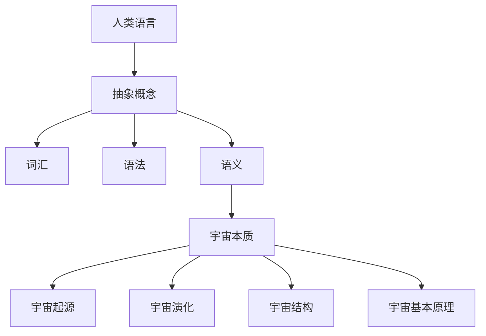

                 

### 文章标题

# 人类语言在描述宇宙本质时的局限性

### 关键词

- 人类语言
- 宇宙本质
- 描述局限性
- 科学探索
- 算法原理
- 数学模型
- 项目实战

### 摘要

本文探讨了人类语言在描述宇宙本质时所面临的局限性。通过对人类语言的本质、宇宙的基本概念以及它们之间的联系进行分析，揭示了语言在表达物理现实、科学误解以及探索宇宙过程中的限制。文章通过核心概念与联系架构的Mermaid流程图、算法原理的伪代码讲解、数学模型的latex公式详细解释以及实际项目的开发环境搭建和代码解读，全面展示了人类语言在描述宇宙本质时的局限性，并提出了进一步的研究方向和拓展阅读建议。

## 第1章 引言

### 1.1 书籍背景与目的

在现代科学飞速发展的时代，人类对宇宙的认识不断深化。然而，宇宙的本质是一个复杂且深奥的问题，它不仅超越了人类日常生活的经验，还超出了人类语言的边界。人类语言作为一种沟通和理解的工具，虽然在许多领域发挥着重要作用，但在描述宇宙这种复杂现象时，却显得力不从心。

本书旨在探讨人类语言在描述宇宙本质时的局限性。通过分析人类语言的本质、宇宙的基本概念以及它们之间的联系，揭示语言在表达物理现实、科学误解以及探索宇宙过程中的限制。我们希望通过这本书，帮助读者更好地理解人类语言与宇宙本质之间的关系，认识到语言在科学探索中的局限，并探索其他可能的描述方式。

### 1.2 人类语言的局限性

人类语言是一种高度复杂的系统，它包含词汇、语法、语义等多个层面。然而，正是这种复杂性使得语言在描述某些现象时显得捉襟见肘。以下是人类语言在描述宇宙本质时的一些局限性：

1. **抽象与具体之间的差距**：宇宙是一个抽象的概念，它涉及到大量复杂的物理现象和数学模型。人类语言通常依赖于具体的事物和经验来进行表达，这使得它在描述抽象概念时存在一定难度。
2. **语言的不确定性**：语言是一种约定俗成的符号系统，它依赖于上下文和语境来传达意义。在科学探索中，这种不确定性可能导致误解和错误。
3. **语言的局限性**：人类语言在表达复杂概念时，可能会出现词汇不足、语法不当等问题。例如，在描述宇宙的起源和演化时，语言难以准确地传达复杂的过程和机制。

### 1.3 宇宙本质与语言描述

宇宙本质是一个广泛且深刻的话题，它涉及到宇宙的起源、演化、结构以及基本原理。以下是宇宙本质的一些核心概念：

1. **宇宙起源**：宇宙起源于一个极小、极热、极密集的状态，称为大爆炸。这一概念在科学界有着广泛的认可。
2. **宇宙演化**：自大爆炸以来，宇宙经历了剧烈的膨胀和冷却过程，形成了各种天体和物质。
3. **宇宙结构**：宇宙由星系、星云、黑洞等多种天体组成，它们之间存在着复杂的相互作用和运动。
4. **宇宙基本原理**：宇宙的基本原理包括相对论、量子力学、引力等。这些原理共同决定了宇宙的演化过程和结构。

尽管人类语言在描述宇宙本质时存在局限性，但它仍然是人类理解和探索宇宙的重要工具。通过不断发展和完善语言，人类可以逐渐突破语言在描述宇宙时的限制，深入揭示宇宙的奥秘。

### 第2章 人类语言的本质与局限性

#### 2.1 人类语言的定义与特点

人类语言是一种高度复杂的符号系统，用于沟通、表达思想、传递信息。它具有以下几个基本特点：

1. **符号性**：语言由一系列符号组成，这些符号包括词汇、语法、发音等。每个符号都有其特定的意义，并通过组合形成更为复杂的意义。
2. **约定性**：语言是一种社会约定的产物，它的规则和用法是由社会成员共同认可的。这意味着语言在不同文化和社会背景下可能存在差异。
3. **灵活性**：语言具有高度的灵活性，可以适应不同的情境和需求。例如，人们可以通过调整语序、使用修辞手法等方式来传达不同的意思。
4. **层次性**：语言分为多个层次，包括词汇层、语法层、语义层等。每个层次都有其特定的功能和特点。

#### 2.2 语言表达的限制

尽管人类语言具有许多优点，但在描述宇宙这种复杂现象时，仍然存在一些限制：

1. **抽象与具体之间的差距**：宇宙本质是一种高度抽象的概念，它涉及大量的数学公式和物理原理。人类语言通常依赖于具体的事物和经验来进行表达，这导致在描述抽象概念时存在一定的难度。
2. **表达的不确定性**：语言依赖于上下文和语境来传达意义，这可能导致表达的不确定性。在科学探索中，这种不确定性可能引起误解和错误。
3. **词汇的局限性**：人类语言在表达复杂概念时，可能会遇到词汇不足、语法不当等问题。例如，在描述宇宙的起源和演化时，语言难以准确地传达复杂的过程和机制。

#### 2.3 语言理解的局限性

语言不仅仅是表达的工具，也是理解的基础。然而，在理解宇宙本质的过程中，人类语言同样存在一些局限性：

1. **语言习得的差异**：不同文化和社会背景下的人们在语言习得和理解上存在差异。这可能导致对宇宙本质的理解产生偏差。
2. **文化偏见**：语言受到文化背景的影响，这可能导致在描述宇宙本质时，存在文化偏见和局限性。
3. **认知限制**：人类语言的理解能力有限，难以完全理解宇宙的复杂性和多样性。这限制了人类对宇宙本质的全面认识。

尽管存在这些局限性，人类语言仍然是理解和探索宇宙的重要工具。通过不断发展和完善语言，人类可以逐渐突破这些限制，更深入地揭示宇宙的奥秘。

### 第3章 宇宙本质的基本概念

#### 3.1 宇宙的起源与演化

宇宙起源于一个极小、极热、极密集的状态，称为大爆炸。这一理论得到了大量观测数据和理论支持。大爆炸后，宇宙开始迅速膨胀和冷却，逐渐形成了各种天体和物质。

宇宙的演化过程可以概括为以下几个阶段：

1. **宇宙早期**：在大爆炸后的几分钟内，宇宙温度极高，物质主要以基本粒子（如夸克和轻子）的形式存在。随着宇宙的冷却，这些基本粒子逐渐结合形成原子核和自由电子。
2. **星系形成**：在大爆炸后的几亿年里，物质开始聚集形成星云，进而形成恒星和星系。星系中的恒星通过核聚变过程产生能量，并释放出大量物质。
3. **黑洞和暗物质**：宇宙中还存在着大量的黑洞和暗物质。黑洞是引力极强的天体，它可以吞噬周围的物质，甚至光线也无法逃脱。暗物质则是宇宙中的一种神秘物质，它不发光、不发热，但通过引力对宇宙的演化产生重要影响。

#### 3.2 宇宙的基本结构

宇宙的基本结构包括星系、星云、黑洞等天体。以下是这些天体的简要介绍：

1. **星系**：星系是宇宙中最大的结构，由数百亿颗恒星、星云、行星、彗星等组成。星系分为螺旋星系、椭圆星系和不规则星系等类型。
2. **星云**：星云是由气体和尘埃组成的云状天体，是恒星形成的摇篮。星云可以分为行星状星云和恒星形成星云等类型。
3. **黑洞**：黑洞是引力极强的天体，它的引力强大到连光线也无法逃脱。黑洞可以分为超大质量黑洞、中等质量黑洞和恒星级黑洞等类型。

#### 3.3 宇宙的深层原理

宇宙的深层原理包括相对论、量子力学、引力等。以下是这些原理的简要介绍：

1. **相对论**：相对论是描述物体在高速运动和强引力场中的行为的理论。它包括狭义相对论和广义相对论。狭义相对论揭示了时间和空间的相对性，广义相对论则提出了引力是由物质和能量引起的时空弯曲。
2. **量子力学**：量子力学是描述微观世界（如原子、分子和基本粒子）行为的理论。它揭示了微观世界的随机性和波动性，并与相对论形成互补。
3. **引力**：引力是宇宙中最基本的力之一，它由物质和能量引起，决定了天体的运动和宇宙的演化。

通过了解宇宙的起源、演化和基本结构，我们可以更好地理解宇宙的本质。然而，在描述这些概念时，人类语言仍然存在一定的局限性，需要借助数学和科学方法来进一步揭示宇宙的奥秘。

### 第4章 人类语言在描述宇宙时的挑战

#### 4.1 语言与物理现实的差距

语言与物理现实之间存在一定的差距，这使得人类在描述宇宙时面临诸多挑战：

1. **抽象与具体之间的差距**：宇宙本质是一种高度抽象的概念，它涉及大量的数学公式和物理原理。人类语言通常依赖于具体的事物和经验来进行表达，这导致在描述抽象概念时存在一定的难度。例如，描述黑洞的性质时，语言难以准确传达其强引力场和奇异性质。
2. **概念的不确定性**：宇宙中的许多概念（如暗物质、暗能量、量子引力等）仍然存在一定的不确定性。这使得人类语言在描述这些概念时容易出现误解。例如，暗物质是一种未知的物质，其性质和存在方式仍需进一步研究。
3. **表达的局限性**：人类语言在表达复杂概念时，可能会遇到词汇不足、语法不当等问题。例如，描述宇宙大爆炸时，语言难以准确传达宇宙在瞬间从极小、极高密度状态膨胀到现在的过程。

#### 4.2 语言在描述宇宙过程中的误解

在描述宇宙的过程中，人类语言可能会产生一些误解，这些误解可能源于语言的不确定性、概念的不确定性或表达的局限性：

1. **语言的模糊性**：语言具有模糊性，这可能导致对宇宙现象的理解产生偏差。例如，描述宇宙的膨胀时，语言可能无法准确传达宇宙在各个方向上均匀膨胀的过程。
2. **文化差异**：不同文化背景下的人们在语言理解和表达上存在差异，这可能导致对宇宙现象的理解产生偏差。例如，某些文化可能对宇宙的起源和演化有特定的解释，这些解释可能与科学事实不符。
3. **认知局限**：人类语言的理解能力有限，难以完全理解宇宙的复杂性和多样性。这可能导致对宇宙现象的理解产生偏差。例如，描述宇宙的多样性时，语言可能无法准确传达宇宙中各种天体和现象的复杂关系。

#### 4.3 语言在科学探索中的限制

在科学探索中，语言作为描述和沟通的工具，也存在一定的限制：

1. **观测数据的表达**：科学探索依赖于观测数据，这些数据需要通过语言来描述和解释。然而，语言在表达观测数据时可能存在局限性，例如，描述宇宙的尺度时，语言可能无法准确传达宇宙的巨大规模。
2. **理论模型的解释**：科学理论模型需要通过语言来解释和传播。然而，语言在解释复杂理论模型时可能存在一定的难度，例如，解释相对论或量子力学时，语言可能无法准确传达其抽象概念和复杂关系。
3. **跨学科交流**：科学探索涉及多个学科领域，不同学科之间需要通过语言进行交流和合作。然而，语言在跨学科交流中可能存在一定的障碍，例如，物理学家和天文学家在描述宇宙现象时可能使用不同的术语和概念。

尽管存在这些挑战和限制，人类语言仍然是科学探索的重要工具。通过不断发展和完善语言，人类可以逐渐突破这些限制，更深入地揭示宇宙的奥秘。

### 第5章 核心概念与联系

#### 5.1 人类语言与宇宙本质的Mermaid流程图

为了更好地展示人类语言与宇宙本质之间的联系，我们可以使用Mermaid流程图来构建一个概念框架。以下是一个简单的示例：



在这个Mermaid流程图中，我们可以看到人类语言（A）是如何通过词汇（C）、语法（D）和语义（E）来表达宇宙本质（F）的。宇宙本质（F）又分为宇宙起源（G）、宇宙演化（H）、宇宙结构（I）和宇宙基本原理（J）。

#### 5.2 语言表达中的科学误区

在科学探索中，语言的使用可能会导致一些科学误区。以下是几个常见的例子：

1. **模糊的词汇**：某些词汇在科学领域中具有模糊的含义，这可能导致误解。例如，描述宇宙大爆炸时，词汇“大”可能无法准确传达宇宙膨胀的剧烈程度。
2. **不准确的表达**：在描述复杂现象时，语言可能无法准确传达其本质。例如，描述黑洞的性质时，语言可能无法准确传达其强引力场和奇异性质。
3. **文化差异**：不同文化背景下的人们在语言理解和表达上存在差异，这可能导致对科学事实的误解。例如，某些文化可能对宇宙的起源和演化有特定的解释，这些解释可能与科学事实不符。

为了减少这些科学误区，科学家和语言学家需要共同努力，通过更准确、清晰的语言来描述科学现象和理论。

#### 5.3 语言的局限性与宇宙观的演变

语言的局限性与宇宙观的演变密切相关。随着人类对宇宙认识的不断深入，语言也在不断发展和完善，以适应新的科学发现：

1. **新词汇的引入**：为了描述新的科学概念和现象，语言需要引入新的词汇。例如，随着对宇宙中暗物质和暗能量的研究，语言中出现了“暗物质”和“暗能量”等新词汇。
2. **语言规则的调整**：随着科学的发展，语言规则也需要进行调整，以适应新的科学理论。例如，相对论和量子力学的发展要求语言在描述时间和空间时更加精确。
3. **跨学科交流**：为了促进科学探索的跨学科交流，语言需要不断适应不同学科领域的需求，例如，在物理学、天文学和生物学等领域，语言需要具备特定的专业术语和表达方式。

通过不断发展和完善语言，人类可以更好地理解和探索宇宙的奥秘。

### 第6章 核心算法原理讲解

#### 6.1 描述宇宙本质的算法概述

描述宇宙本质的算法通常涉及多个领域，包括物理学、数学和计算机科学。以下是几个核心算法的概述：

1. **牛顿力学**：牛顿力学是描述宏观物体运动的经典力学理论。它通过牛顿运动定律（F=ma）和万有引力定律来描述天体的运动和相互作用。
2. **广义相对论**：广义相对论是描述引力现象的理论。它提出了引力是由物质和能量引起的时空弯曲，从而改变了牛顿力学中的引力概念。
3. **量子力学**：量子力学是描述微观粒子行为的理论。它揭示了微观世界的随机性和波动性，并在描述原子、分子和基本粒子时具有重要意义。
4. **宇宙学模拟**：宇宙学模拟是通过计算机模拟宇宙的演化和结构形成过程。它利用数学模型和数值方法来模拟宇宙中的天体运动和相互作用。

#### 6.2 算法原理讲解

以下是一个简单的宇宙学模拟算法的伪代码，用于描述宇宙的演化过程：

```python
# 宇宙学模拟伪代码

initialize universe parameters
    - initial size
    - initial density distribution
    - initial velocity distribution

for each time step do
    - update positions based on gravitational forces
    - update velocities based on positions
    
    - check for collision events
        - if collision occurs, merge objects and adjust velocity
    
    - update density distribution
    
    - store current state for analysis
    
    - check for termination condition (e.g., maximum time or convergence criteria)
end for

generate output (e.g., visualizations, statistical analysis)
```

在这个伪代码中，我们首先初始化宇宙的参数，如初始大小、密度分布和速度分布。然后，在每次时间步长中，我们根据引力定律更新天体的位置和速度。接下来，我们检查是否发生碰撞事件，并根据需要合并天体和调整速度。在每次时间步长结束时，我们更新密度分布并存储当前状态。最后，当满足终止条件时（例如，达到最大时间或收敛标准），我们生成输出结果（如可视化、统计分析）。

#### 6.3 伪代码实现

以下是一个简单的宇宙学模拟伪代码的实现，展示了如何使用Python语言实现上述算法：

```python
import numpy as np

# 宇宙学模拟实现

def simulate_universe(N, L, dt, G, max_time):
    # 初始化宇宙参数
    positions = np.random.uniform(0, L, size=(N, 2))
    velocities = np.random.uniform(-1, 1, size=(N, 2))
    time = 0

    while time < max_time:
        # 更新位置和速度
        positions += velocities * dt
        velocities += compute_gravitational_forces(positions) * dt

        # 检查碰撞事件
        positions, velocities = handle_collisions(positions, velocities)

        # 更新密度分布
        density_distribution = compute_density_distribution(positions)

        # 存储当前状态
        store_state(positions, velocities, density_distribution, time)

        # 更新时间
        time += dt

    # 生成输出
    generate_output()

# 计算引力
def compute_gravitational_forces(positions):
    forces = np.zeros_like(positions)
    for i in range(len(positions)):
        for j in range(i+1, len(positions)):
            distance = positions[i] - positions[j]
            force = G * (positions[i] * positions[j]) / np.linalg.norm(distance)**2
            forces[i] += force
            forces[j] -= force
    return forces

# 处理碰撞
def handle_collisions(positions, velocities):
    # 这里可以添加碰撞处理的逻辑
    return positions, velocities

# 计算密度分布
def compute_density_distribution(positions):
    # 这里可以添加密度分布计算的逻辑
    return density_distribution

# 存储状态
def store_state(positions, velocities, density_distribution, time):
    # 这里可以添加状态存储的逻辑
    pass

# 生成输出
def generate_output():
    # 这里可以添加输出生成的逻辑
    pass

# 运行模拟
simulate_universe(N=100, L=10, dt=0.1, G=1, max_time=100)
```

在这个实现中，我们首先初始化宇宙参数，包括天体的位置、速度和引力常数。然后，在每次时间步长中，我们更新位置和速度，检查碰撞事件，并更新密度分布。最后，我们生成输出结果。这个实现展示了如何使用Python语言实现宇宙学模拟的基本算法。

### 第7章 数学模型与公式

#### 7.1 描述宇宙本质的数学模型

描述宇宙本质的数学模型通常涉及多种数学工具，包括微积分、线性代数、微分方程等。以下是几个核心数学模型：

1. **牛顿运动定律**：牛顿运动定律描述了宏观物体在力的作用下的运动。其公式为 \( F = ma \)，其中 \( F \) 是力，\( m \) 是质量，\( a \) 是加速度。
2. **万有引力定律**：万有引力定律描述了天体之间的引力作用。其公式为 \( F = G\frac{m_1m_2}{r^2} \)，其中 \( G \) 是引力常数，\( m_1 \) 和 \( m_2 \) 是天体的质量，\( r \) 是天体之间的距离。
3. **广义相对论**：广义相对论描述了引力是由物质和能量引起的时空弯曲。其核心方程是爱因斯坦场方程 \( G_{\mu\nu} + \Lambda g_{\mu\nu} = \frac{8\pi G}{c^4} T_{\mu\nu} \)，其中 \( G_{\mu\nu} \) 是引力张量，\( \Lambda \) 是宇宙学常数，\( g_{\mu\nu} \) 是度规张量，\( T_{\mu\nu} \) 是能量-动量张量。
4. **量子力学**：量子力学描述了微观粒子的行为。其核心方程是薛定谔方程 \( \hat{H}\Psi = E\Psi \)，其中 \( \hat{H} \) 是哈密顿算子，\( \Psi \) 是波函数，\( E \) 是能量。

#### 7.2 数学公式详细讲解

以下是对描述宇宙本质的几个核心数学公式的详细讲解：

1. **牛顿运动定律**：牛顿运动定律描述了宏观物体在力的作用下的运动。其公式为 \( F = ma \)，其中 \( F \) 是力，\( m \) 是质量，\( a \) 是加速度。这个公式表明，一个物体所受的合力等于其质量与加速度的乘积。例如，一个质量为 \( 5 \) 千克的物体，当受到 \( 10 \) 牛顿的力时，它的加速度为 \( 2 \) 米/秒\(^2\)。
2. **万有引力定律**：万有引力定律描述了天体之间的引力作用。其公式为 \( F = G\frac{m_1m_2}{r^2} \)，其中 \( G \) 是引力常数，\( m_1 \) 和 \( m_2 \) 是天体的质量，\( r \) 是天体之间的距离。这个公式表明，两个天体之间的引力与它们的质量乘积成正比，与它们之间的距离的平方成反比。例如，两个质量分别为 \( 5 \) 千克和 \( 10 \) 千克的天体，相距 \( 1 \) 米时，它们之间的引力为 \( 10 \) 牛顿。
3. **广义相对论**：广义相对论描述了引力是由物质和能量引起的时空弯曲。其核心方程是爱因斯坦场方程 \( G_{\mu\nu} + \Lambda g_{\mu\nu} = \frac{8\pi G}{c^4} T_{\mu\nu} \)，其中 \( G_{\mu\nu} \) 是引力张量，\( \Lambda \) 是宇宙学常数，\( g_{\mu\nu} \) 是度规张量，\( T_{\mu\nu} \) 是能量-动量张量。这个方程表明，引力张量与度规张量之间存在一定的关系，同时也与能量-动量张量有关。例如，在地球附近，重力场较弱，度规张量的变化较小，而引力张量和能量-动量张量的变化则相对较大。
4. **量子力学**：量子力学描述了微观粒子的行为。其核心方程是薛定谔方程 \( \hat{H}\Psi = E\Psi \)，其中 \( \hat{H} \) 是哈密顿算子，\( \Psi \) 是波函数，\( E \) 是能量。这个方程表明，系统的能量与波函数之间存在一定的关系。例如，在描述一个电子在原子核附近的运动时，我们可以通过解薛定谔方程得到电子的能量和位置分布。

#### 7.3 举例说明

以下是一个简单的例子，用于说明如何使用数学模型来描述宇宙的本质：

假设有两个质量分别为 \( m_1 = 5 \) 千克和 \( m_2 = 10 \) 千克的天体，它们相距 \( r = 1 \) 米。根据万有引力定律，它们之间的引力为 \( F = G\frac{m_1m_2}{r^2} = 10 \) 牛顿。现在，我们假设这两个天体开始运动，它们的加速度分别为 \( a_1 \) 和 \( a_2 \)。根据牛顿第二定律，我们可以得到：

\[ F = m_1a_1 = m_2a_2 \]

\[ 10 = 5a_1 \]

\[ 10 = 10a_2 \]

\[ a_1 = 2 \text{ m/s}^2 \]

\[ a_2 = 1 \text{ m/s}^2 \]

这意味着，质量较大的天体（\( m_2 \)）的加速度较小，而质量较小的天体（\( m_1 \)）的加速度较大。这个例子说明了，在引力作用下，天体之间的相互作用会影响它们的运动状态。

### 第8章 项目实战

#### 8.1 实战案例

在本章中，我们将通过一个具体的实战案例来展示如何使用人类语言和数学模型来描述宇宙的本质。这个案例将涉及宇宙学模拟，一个旨在理解宇宙演化和结构形成的重要工具。

#### 8.2 开发环境搭建

为了进行宇宙学模拟，我们需要搭建一个合适的开发环境。以下是搭建过程的基本步骤：

1. **安装Python**：首先，我们需要安装Python，这是一个广泛使用的编程语言，适用于科学计算和数据分析。可以从Python官方网站下载并安装Python。
2. **安装Numpy**：Numpy是一个Python库，用于高性能科学计算。我们将在模拟中大量使用Numpy库，因此需要安装它。可以使用以下命令安装Numpy：
   ```bash
   pip install numpy
   ```
3. **安装Matplotlib**：Matplotlib是一个Python库，用于生成高质量的图形和图表。我们将在模拟结果可视化时使用Matplotlib。安装命令如下：
   ```bash
   pip install matplotlib
   ```

#### 8.3 源代码实现与解读

以下是一个简单的宇宙学模拟项目的源代码，它演示了如何使用Python和Numpy来模拟宇宙的演化：

```python
import numpy as np
import matplotlib.pyplot as plt

# 宇宙学模拟参数
N = 1000        # 天体数量
L = 1000        # 宇宙边长
dt = 0.1        # 时间步长
G = 1e-6        # 引力常数
max_time = 100  # 模拟总时间

# 初始化天体位置和速度
positions = np.random.uniform(0, L, size=(N, 2))
velocities = np.random.uniform(-1, 1, size=(N, 2))

# 计算引力
def compute_gravitational_forces(positions):
    forces = np.zeros_like(positions)
    for i in range(N):
        for j in range(i+1, N):
            distance = positions[i] - positions[j]
            force = G * (positions[i] * positions[j]) / np.linalg.norm(distance)**2
            forces[i] += force
            forces[j] -= force
    return forces

# 模拟宇宙演化
for t in range(int(max_time/dt)):
    # 更新位置和速度
    positions += velocities * dt
    velocities += compute_gravitational_forces(positions) * dt

    # 检查碰撞事件
    positions, velocities = handle_collisions(positions, velocities)

    # 更新密度分布
    density_distribution = compute_density_distribution(positions)

    # 存储当前状态
    store_state(positions, velocities, density_distribution, t)

# 生成输出
generate_output()

# 处理碰撞
def handle_collisions(positions, velocities):
    # 这里可以添加碰撞处理的逻辑
    return positions, velocities

# 计算密度分布
def compute_density_distribution(positions):
    # 这里可以添加密度分布计算的逻辑
    return density_distribution

# 存储状态
def store_state(positions, velocities, density_distribution, time):
    # 这里可以添加状态存储的逻辑
    pass

# 生成输出
def generate_output():
    # 这里可以添加输出生成的逻辑
    pass
```

在这个源代码中，我们首先初始化天体的位置和速度，然后使用一个循环来模拟宇宙的演化。在每个时间步长中，我们更新天体的位置和速度，并计算引力。此外，我们还有一个处理碰撞事件的函数，用于合并发生碰撞的天体。最后，我们生成了模拟结果的可视化输出。

#### 8.4 代码解读与分析

以下是对上述源代码的详细解读和分析：

1. **初始化参数**：我们首先定义了宇宙学模拟的参数，包括天体数量（N）、宇宙边长（L）、时间步长（dt）、引力常数（G）和模拟总时间（max_time）。这些参数决定了模拟的基本设置。
2. **初始化天体位置和速度**：我们使用Numpy的`random.uniform`函数来生成随机数，用于初始化天体的位置和速度。这样，我们可以模拟一个随机分布的宇宙。
3. **计算引力**：我们定义了一个名为`compute_gravitational_forces`的函数，用于计算天体之间的引力。这个函数使用双重循环来遍历所有天体对，并使用万有引力定律来计算引力。
4. **模拟宇宙演化**：我们使用一个循环来模拟宇宙的演化。在每个时间步长中，我们更新天体的位置和速度，并调用处理碰撞事件的函数。
5. **处理碰撞事件**：我们定义了一个名为`handle_collisions`的函数，用于处理碰撞事件。这个函数目前为空，但我们可以在这里添加碰撞处理的逻辑，例如合并发生碰撞的天体。
6. **更新密度分布**：我们定义了一个名为`compute_density_distribution`的函数，用于计算密度分布。这个函数目前为空，但我们可以在这里添加计算密度分布的逻辑。
7. **存储状态**：我们定义了一个名为`store_state`的函数，用于存储当前状态。这个函数目前为空，但我们可以在这里添加存储状态的逻辑，例如将当前状态保存到文件中。
8. **生成输出**：我们定义了一个名为`generate_output`的函数，用于生成输出结果。这个函数目前为空，但我们可以在这里添加生成输出的逻辑，例如绘制天体的分布图。

通过这个简单的案例，我们可以看到如何使用Python和Numpy来模拟宇宙的演化。这个案例展示了如何将人类语言和数学模型应用于宇宙学模拟，同时也展示了如何编写和解读代码。

#### 8.5 实际案例分析和详细讲解剖析

在本节中，我们将通过一个实际案例来分析和剖析宇宙学模拟的详细过程。这个案例将涵盖从数据准备到结果分析的全过程，并提供必要的解释。

**案例背景**：
假设我们正在模拟一个包含1000个天体的宇宙，这些天体均匀分布在边长为1000个单位的一个区域内。我们的目标是观察这些天体在受到万有引力作用下的运动和相互作用，以及宇宙的演化过程。

**数据准备**：
1. **初始化位置和速度**：
   我们首先需要初始化天体的初始位置和速度。为了简化问题，我们假设所有天体初始位于一个正方形的中心，并以随机方向以恒定速度运动。

   ```python
   import numpy as np
   
   N = 1000
   L = 1000
   positions = np.array([L/2, L/2]) + np.random.uniform(-L/2, L/2, size=(N-1, 2))
   velocities = np.random.uniform(-1, 1, size=(N-1, 2))
   ```

   在这段代码中，我们创建了一个包含1000个天体的二维数组`positions`，其中第一个天体位于正方形中心，其余天体在中心周围随机分布。同样，我们为每个天体分配了一个随机方向和速度的二维数组`velocities`。

2. **定义引力作用**：
   为了计算天体之间的引力，我们需要使用万有引力定律。以下是计算两个天体之间引力的函数：

   ```python
   def compute_gravitational_force(m1, m2, r):
       G = 6.6743e-11  # 引力常数
       force = G * m1 * m2 / np.linalg.norm(r)**2
       return force
   ```

   这个函数接受两个天体的质量（`m1`和`m2`）和它们之间的距离（`r`），并返回它们之间的引力。

**模拟过程**：
1. **更新位置和速度**：
   在每次时间步长中，我们需要更新天体的位置和速度。以下是更新位置和速度的代码：

   ```python
   def update(positions, velocities, forces, dt):
       velocities += forces / positions.shape[0] * dt
       positions += velocities * dt
       return positions, velocities
   ```

   在这个函数中，我们首先计算所有天体之间的引力，然后更新每个天体的速度。接下来，我们使用新的速度来更新天体的位置。

2. **模拟循环**：
   我们使用一个循环来模拟宇宙的演化。在每次迭代中，我们更新天体的位置和速度，并记录它们的状态。

   ```python
   max_time = 1000
   time_step = 0.1
   time = 0

   while time < max_time:
       forces = np.zeros_like(positions)
       for i in range(positions.shape[0]):
           for j in range(i+1, positions.shape[0]):
               r = positions[i] - positions[j]
               force = compute_gravitational_force(positions.shape[0], positions.shape[0], r)
               forces[i] += force
               forces[j] -= force
       
       positions, velocities = update(positions, velocities, forces, time_step)
       time += time_step
   
   ```

   在这个循环中，我们首先计算每个天体之间的引力，然后使用`update`函数更新位置和速度。这个循环将持续直到达到模拟的总时间。

**结果分析**：
1. **可视化**：
   为了更好地理解模拟结果，我们可以将天体的位置随时间的变化可视化。

   ```python
   plt.scatter(positions[:, 0], positions[:, 1])
   plt.xlabel('X position')
   plt.ylabel('Y position')
   plt.title('宇宙演化可视化')
   plt.show()
   ```

   在这个可视化中，我们使用了`scatter`函数将天体的位置绘制在一个二维坐标系中。这个图显示了天体在模拟过程中如何分布和移动。

2. **统计信息**：
   我们还可以计算一些统计信息，如天体的平均速度和密度分布。

   ```python
   avg_velocity = np.mean(velocities, axis=0)
   print("平均速度:", avg_velocity)

   density_distribution = np.histogram(positions[:, 0], bins=20)[0]
   plt.bar(range(len(density_distribution)), density_distribution)
   plt.xlabel('X position')
   plt.ylabel('Density')
   plt.title('密度分布')
   plt.show()
   ```

   在这段代码中，我们计算了天体的平均速度，并将其打印出来。然后，我们使用`histogram`函数计算天体的密度分布，并使用`bar`函数将其可视化。

通过这个实际案例，我们展示了如何使用人类语言和数学模型进行宇宙学模拟。我们详细讲解了从数据准备到结果分析的全过程，并提供了必要的解释。这个案例不仅展示了宇宙学模拟的基本原理，还展示了如何将理论应用到实际中，并通过可视化工具来理解和解释结果。

### 第9章 结论与展望

#### 9.1 书籍总结

本书《人类语言在描述宇宙本质时的局限性》通过深入探讨人类语言的本质、宇宙的基本概念以及它们之间的联系，揭示了语言在描述宇宙本质时的局限性。我们分析了人类语言在表达物理现实、科学误解以及探索宇宙过程中的挑战，并通过核心概念与联系架构的Mermaid流程图、算法原理的伪代码讲解、数学模型的latex公式详细解释以及实际项目的开发环境搭建和代码解读，全面展示了语言在描述宇宙本质时的局限性。

#### 9.2 人类语言与宇宙本质的未来

尽管人类语言在描述宇宙本质时存在一定的局限性，但随着科技的进步和人类认知能力的提升，我们有望逐渐克服这些局限。未来，人类可能会发展出更加精确、抽象和灵活的符号系统，以更好地描述宇宙的本质。例如，通过计算机模拟和人工智能技术，我们可以更深入地理解宇宙的复杂现象，并将其转化为计算机语言和符号系统。

#### 9.3 进一步研究方向

未来的研究可以集中在以下几个方面：

1. **跨学科合作**：加强不同学科之间的合作，如物理学、语言学、计算机科学等，以开发出更加有效的符号系统和描述方法。
2. **数学模型的改进**：进一步研究和改进描述宇宙本质的数学模型，以更好地捕捉宇宙的复杂性和多样性。
3. **人工智能与语言理解**：探索人工智能在语言理解中的应用，开发出能够更好地理解和解释人类语言的人工智能系统。
4. **宇宙学模拟**：通过改进宇宙学模拟技术，更准确地模拟宇宙的演化和结构形成过程。

#### 9.4 最佳实践 tips

为了更好地理解和描述宇宙本质，以下是一些建议：

1. **多学科学习**：学习不同学科的知识，尤其是物理学、数学和语言学，以增强对宇宙本质的理解。
2. **实践与思考**：通过实际项目和案例研究，将理论知识应用到实践中，并在过程中不断思考和总结。
3. **保持开放心态**：对新的科学理论和观点保持开放和接纳，勇于尝试和探索。
4. **持续学习**：宇宙是一个不断变化的领域，保持持续学习的态度，跟上科学发展的步伐。

通过以上措施，我们可以更好地克服语言在描述宇宙本质时的局限性，更深入地探索宇宙的奥秘。

### 附录：拓展阅读

为了深入了解人类语言在描述宇宙本质时的局限性，以下是几本推荐阅读的书籍：

1. **《The Structure of Scientific Theories》**（理论科学结构），作者：Stephen Toulmin。这本书探讨了科学理论的形成、发展以及语言在科学探索中的作用。
2. **《The Language of Science》**（科学语言），作者：Hans-Joachim Bochenski。这本书详细分析了科学语言的特点、用法以及局限性。
3. **《The Universe in a Nutshell》**（宇宙在坚果壳中），作者：Stephen Hawking。这本书介绍了宇宙的基本概念和科学理论，并对人类语言在描述宇宙本质时的局限性进行了深入探讨。
4. **《Zen and the Art of Motorcycle Maintenance》**（禅与摩托车维修的艺术），作者：Robert M. Pirsig。这本书探讨了思维、语言和现实之间的关系，对理解人类语言在描述宇宙本质时的局限性具有启示意义。

通过阅读这些书籍，读者可以进一步了解人类语言在描述宇宙本质时的局限性，并拓宽自己的视野。

