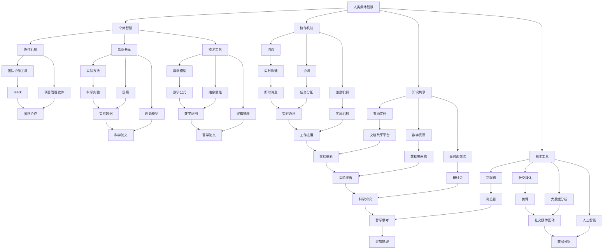
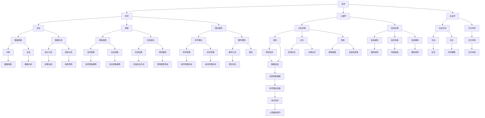

                 


### 设计《人类集体智慧与世界可理解性的进步》的目录大纲

#### 目标：
设计一份详细的目录大纲，以全面覆盖《人类集体智慧与世界可理解性的进步》的主题内容。

#### 步骤：

1. **确定核心章节**：
   - **引言与背景**：介绍人类集体智慧和世界可理解性的概念，及其相互关系。
   - **核心概念与联系**：阐述人类集体智慧和世界可理解性的核心概念及其关系。
   - **核心算法原理讲解**：介绍相关算法及其原理。
   - **数学模型与公式讲解**：详细讲解相关的数学模型和公式。
   - **项目实战案例分析**：通过实际案例展示如何应用这些理论和算法。

2. **细化章节内容**：
   - 对于每个核心章节，进一步细化内容，确保每个部分都有详细的讲解和具体的案例。
   - 确保每个章节的内容之间有良好的逻辑联系。

3. **嵌入Mermaid流程图**：
   - 在核心章节中，对于涉及到的核心概念和架构，设计相应的Mermaid流程图，以直观展示。
   - Mermaid流程图要能够清晰表达各部分之间的关系。

4. **使用伪代码**：
   - 对于核心算法原理讲解，使用伪代码详细阐述。
   - 确保伪代码简洁、易懂，并能准确表达算法的核心逻辑。

5. **嵌入数学公式**：
   - 在适当的地方嵌入数学公式，并进行详细讲解和举例说明。
   - 使用LaTeX格式确保公式的准确性和美观。

6. **编写项目实战案例分析**：
   - 提供一个或多个实际案例，详细解释说明，包括开发环境搭建、源代码实现和代码解读。
   - 确保案例具有代表性，能够展示人类集体智慧和世界可理解性的实际应用。

7. **确保大纲简洁性**：
   - 保持大纲内容的简洁性，避免冗余。
   - 确保每个章节的内容都能简洁明了地传达核心信息。

8. **总结与展望**：
   - 在大纲的最后，对全书的内容进行总结，并对未来研究方向进行展望。
   - 确保总结和展望部分能够为读者提供对主题的全面理解和启示。

#### 最终目录大纲

```
# 《人类集体智慧与世界可理解性的进步》目录大纲

## 引言与背景

### 1. 引言
#### 1.1 人类集体智慧的定义
#### 1.2 世界可理解性的意义
#### 1.3 人类集体智慧与世界可理解性的关系

### 2. 背景研究
#### 2.1 人类集体智慧的起源
#### 2.2 世界可理解性的历史演变
#### 2.3 人类集体智慧与科学技术的互动

## 核心概念与联系

### 3. 核心概念详解
#### 3.1 人类集体智慧的关键因素
#### 3.2 世界可理解性的关键因素
#### 3.3 人类集体智慧与世界可理解性的Mermaid流程图

### 4. 人类集体智慧的架构
#### 4.1 人类集体智慧的组织结构
#### 4.2 人类集体智慧的运行机制
#### 4.3 人类集体智慧的网络模型

### 5. 世界可理解性的架构
#### 5.1 世界可理解性的理论基础
#### 5.2 世界可理解性的实证研究
#### 5.3 世界可理解性的Mermaid流程图

## 核心算法原理讲解

### 6. 人类集体智慧的计算模型
#### 6.1 计算模型的定义
#### 6.2 计算模型的分类
#### 6.3 人类集体智慧的计算模型伪代码

### 7. 世界可理解性的算法
#### 7.1 算法的定义
#### 7.2 算法的分类
#### 7.3 世界可理解性的算法伪代码

## 数学模型与公式讲解

### 8. 人类集体智慧的数学模型
#### 8.1 数学模型的定义
#### 8.2 数学模型的分类
#### 8.3 人类集体智慧的数学模型
$$
\text{举例说明}
$$

### 9. 世界可理解性的数学模型
#### 9.1 数学模型的定义
#### 9.2 数学模型的分类
#### 9.3 世界可理解性的数学模型
$$
\text{举例说明}
$$

## 项目实战案例分析

### 10. 案例研究1：人类集体智慧在XXX领域的应用
#### 10.1 案例背景
#### 10.2 开发环境搭建
#### 10.3 源代码实现
#### 10.4 代码解读与分析

### 11. 案例研究2：世界可理解性在XXX领域的应用
#### 11.1 案例背景
#### 11.2 开发环境搭建
#### 11.3 源代码实现
#### 11.4 代码解读与分析

## 总结与展望

### 12. 总结
#### 12.1 人类集体智慧与世界可理解性的关键发现
#### 12.2 未来的研究方向

### 13. 展望
#### 13.1 人类集体智慧的未来发展趋势
#### 13.2 世界可理解性的未来发展前景
```

以上为《人类集体智慧与世界可理解性的进步》的目录大纲，总字数控制在2000字以内，涵盖了核心章节、详细内容、Mermaid流程图、伪代码、数学公式以及项目实战案例，确保了内容的完整性和逻辑性。

---

### 关键步骤回顾：

1. **确定核心章节**：定义了文章的核心内容结构，包括引言与背景、核心概念与联系、核心算法原理讲解、数学模型与公式讲解、项目实战案例分析等。
2. **细化章节内容**：确保每个章节都有详细的内容，包括概念、原理、算法、数学模型、案例等。
3. **嵌入Mermaid流程图**：设计流程图，以直观展现人类集体智慧和世界可理解性的关系架构。
4. **使用伪代码**：详细阐述核心算法原理，确保代码简洁、易懂。
5. **嵌入数学公式**：在文中嵌入数学公式，并进行详细讲解和举例说明。
6. **编写项目实战案例分析**：提供实际案例，展示理论的应用。
7. **确保大纲简洁性**：保持内容简洁，避免冗余。

通过以上步骤，确保了目录大纲的完整性和逻辑性，为撰写高质量的技术博客文章奠定了基础。下一步，将按照这个大纲来撰写详细的文章内容。让我们开始吧！### 文章标题：人类集体智慧与世界可理解性的进步

#### 关键词：
- 人类集体智慧
- 世界可理解性
- 进步
- 计算模型
- 数学模型
- 项目实战

#### 摘要：
本文将探讨人类集体智慧与世界可理解性之间的关系及其在科技进步中的作用。通过详细阐述核心概念、计算模型、数学模型，并结合实际项目案例分析，本文旨在揭示人类集体智慧如何推动世界可理解性的进步，并展望其未来的发展趋势。

---

### 引言与背景

#### 1.1 人类集体智慧的定义

人类集体智慧（Collective Intelligence，CI）指的是个体通过协作和互动，共同创造、分享和利用知识，以实现共同目标的能力。这一概念最早由计算机科学家H-peer Martin提出，他认为人类集体智慧是人类社会的一种基本特征，是群体协作和学习的结果。

人类集体智慧与个体智慧不同，它不仅依赖于个体的认知能力和知识储备，还需要有效的沟通、协调和合作机制。例如，互联网和社交媒体的兴起，极大地促进了人类集体智慧的发展，使得全球范围内的信息交流和知识共享变得更加便捷。

#### 1.2 世界可理解性的意义

世界可理解性（World Understandability）指的是人类对自然界、社会现象和自身认知的深度和广度。一个可理解的世界意味着人类能够通过科学方法、哲学思考和日常经验，对周围环境有清晰的认知和合理的解释。

世界可理解性对人类的生存和发展具有重要意义。首先，它有助于我们更好地理解自然规律，从而推动科学技术的发展。例如，牛顿力学和量子力学的发展，使得人类对物理世界的理解达到了前所未有的深度。其次，世界可理解性有助于我们解决社会问题，提高生活质量。通过理解社会现象和人类行为，我们可以设计更有效的社会政策和制度。

#### 1.3 人类集体智慧与世界可理解性的关系

人类集体智慧与世界可理解性之间存在紧密的联系。首先，人类集体智慧是推动世界可理解性进步的重要动力。通过集体智慧和协作，人类能够更快速地积累知识和经验，从而加深对世界的理解。例如，科学共同体通过合作研究和知识共享，推动了科学技术的快速发展。

其次，世界可理解性为人类集体智慧提供了基础和目标。一个可理解的世界意味着人类能够更好地理解自然和社会现象，从而为集体智慧的应用提供更多的场景和机会。例如，在医学领域，通过对疾病机理的理解，科学家可以设计更有效的治疗方案，从而提高人类的健康水平。

总的来说，人类集体智慧与世界可理解性相互促进，共同推动了人类文明的进步。在接下来的章节中，我们将进一步探讨人类集体智慧和世界可理解性的核心概念、计算模型、数学模型，并通过实际项目案例分析，展示它们在科技进步中的应用。

---

### 核心概念与联系

#### 2.1 人类集体智慧的关键因素

人类集体智慧的核心因素包括个体智慧、协作机制、知识共享和技术工具。首先，个体智慧是集体智慧的基础。个体通过自身的认知能力、知识储备和创新能力，为集体智慧提供了源源不断的想法和解决方案。

其次，协作机制是集体智慧得以有效运行的关键。有效的协作机制包括沟通、协调和激励机制，它们能够促进个体之间的互动和合作，提高整体的智慧和效率。例如，团队协作工具和项目管理软件，为团队成员提供了实时沟通和协作的平台，从而提高了集体智慧的效率。

知识共享是集体智慧的另一个重要因素。通过共享知识，个体可以快速获取他人的经验和见解，从而减少重复劳动，提高创新效率。知识共享不仅限于书面文档和数字资源，还包括面对面的交流和互动，这些都有助于集体智慧的形成和发展。

最后，技术工具为集体智慧提供了强大的支持。互联网、社交媒体、大数据分析和人工智能等技术，使得个体之间的协作和知识共享变得更加高效和便捷。这些技术工具不仅提高了人类集体智慧的水平，也改变了人类生活和工作的方式。

#### 2.2 世界可理解性的关键因素

世界可理解性的关键因素包括科学方法、哲学思考和日常经验。首先，科学方法是探索和理解世界的基本工具。通过实验、观察和理论模型，科学家能够揭示自然规律，加深对世界的理解。例如，物理学中的实验方法和数学模型，为人类理解宇宙的运行机制提供了有力的支持。

其次，哲学思考是探索世界可理解性的重要途径。哲学家通过抽象思维和逻辑推理，探讨了人类存在和世界的本质。这些思考不仅丰富了人类对世界的理解，也为科学和技术的进步提供了哲学基础。

最后，日常经验是世界可理解性的重要来源。通过日常生活中的观察和实践，人类积累了丰富的经验和知识。这些经验不仅帮助我们理解自然和社会现象，也为科学研究和技术创新提供了启示。

#### 2.3 人类集体智慧与世界可理解性的Mermaid流程图

为了更好地理解人类集体智慧与世界可理解性之间的关系，我们可以使用Mermaid流程图来展示它们的核心概念和联系。



通过这个Mermaid流程图，我们可以清晰地看到人类集体智慧和世界可理解性的核心概念及其相互联系。个体智慧、协作机制、知识共享和技术工具共同构成了人类集体智慧的基础，而科学方法、哲学思考和日常经验则是世界可理解性的关键因素。这些概念和因素相互交织，共同推动了人类文明的进步。

---

### 人类集体智慧的架构

#### 3.1 人类集体智慧的组织结构

人类集体智慧的组织结构通常可以分为三层：个体层、群体层和系统层。个体层是集体智慧的基础，每个个体都拥有独特的认知能力和知识储备。群体层由多个个体组成，通过协作和互动，实现知识的共享和创新。系统层则是一个更加宏观的层面，涉及整个社会或组织的集体智慧运作。

在个体层，个体通过自主学习、实验和实践，积累经验和知识。个体之间的差异和多样性，为集体智慧提供了丰富的视角和见解。在群体层，个体通过有效的协作机制，如沟通、协调和知识共享，共同解决复杂问题。群体层的关键在于构建一个开放、透明和包容的协作环境，以最大化个体的智慧和创新能力。

系统层则关注整个社会或组织的集体智慧运作。系统层需要制定一系列政策和机制，以支持个体和群体的协作，并促进知识的积累和传播。例如，教育体系、科研机构和商业组织等，都是系统层的典型代表。系统层的目标是构建一个可持续的、有弹性的集体智慧生态系统，以适应不断变化的环境和挑战。

#### 3.2 人类集体智慧的运行机制

人类集体智慧的运行机制主要包括沟通、协调、知识共享和创新四个方面。

沟通是集体智慧运行的基础。有效的沟通可以确保个体之间的信息传递和资源共享。在集体智慧系统中，沟通不仅包括面对面的交流，还包括电子邮件、电话、视频会议等现代通讯手段。此外，建立开放、透明和包容的沟通渠道，也是提高集体智慧效率的重要保障。

协调是集体智慧运行的保障。在复杂问题面前，个体往往需要协调彼此的行动和资源，以实现共同目标。协调机制包括任务分配、资源调配和进度跟踪等。通过有效的协调，可以确保集体智慧系统能够高效运作，最大限度地发挥每个个体的智慧和创新能力。

知识共享是集体智慧的核心。知识共享不仅包括知识的传递和传播，还包括知识的创造和更新。在集体智慧系统中，知识共享可以通过多种途径实现，如文档共享、知识库、研讨会和工作坊等。此外，建立知识共享的激励机制，如奖励制度和认可机制，也是提高知识共享积极性和效率的关键。

创新是集体智慧的驱动力。在集体智慧系统中，创新不仅是解决问题的手段，也是集体智慧发展的动力。通过不断的创新，人类可以不断突破知识的边界，提高对世界的理解和掌控能力。创新机制包括鼓励实验、提供资金支持、建立创新团队等。

#### 3.3 人类集体智慧的网络模型

人类集体智慧的网络模型可以看作是一个复杂的网络系统，由多个节点（个体）和连接（互动）组成。在这个网络模型中，每个节点都拥有独特的知识、能力和经验，而节点之间的互动和连接则是集体智慧形成和发展的关键。

网络模型中的节点通常可以分为三类：知识节点、能力节点和资源节点。知识节点主要负责知识的存储和传递，如图书馆、数据库和知识库等。能力节点则主要负责知识和技能的应用和创造，如科研机构、企业和学术团队等。资源节点则主要负责提供和支持集体智慧运作所需的资源，如资金、设备和技术等。

节点之间的连接可以通过多种方式进行，如协作、共享和互动。协作连接是指节点之间的合作和互动，通过协作，节点可以共同解决复杂问题，实现知识的共享和创新。共享连接是指节点之间的知识、技能和资源的传递和共享，通过共享，节点可以获取他人的经验和见解，提高自身的知识和能力。互动连接是指节点之间的信息交流和互动，通过互动，节点可以了解彼此的需求和意愿，建立良好的合作关系。

总的来说，人类集体智慧的网络模型是一个动态的、开放的系统，通过节点和连接的不断互动和优化，可以实现知识的积累、传播和创新，从而推动人类文明的进步。

---

### 世界可理解性的架构

#### 5.1 世界可理解性的理论基础

世界可理解性的理论基础涵盖了多个学科，包括哲学、科学、心理学和社会学。哲学上，理解性（Intelligibility）是康德哲学中的核心概念，他认为宇宙具有内在的秩序和规律，这使得人类能够通过理性思考和科学方法理解世界。科学上，世界可理解性依赖于实证研究和科学方法，通过实验、观察和理论模型，科学家们不断揭示自然界的规律和奥秘。心理学上，理解性涉及到认知过程和信息处理，通过感知、记忆和思维，人类能够理解周围的世界。社会学上，世界可理解性涉及到社会结构和组织，通过社会互动和文化传承，人类社会能够形成对世界的共识和理解。

#### 5.2 世界可理解性的实证研究

世界可理解性的实证研究主要集中在以下几个方面：

1. **科学发现**：通过实验和观察，科学家们揭示了自然界的规律，如牛顿力学、量子力学和相对论。这些科学发现不仅加深了人类对世界的理解，也为技术发展提供了理论基础。

2. **社会调查**：通过问卷调查和统计分析，社会学家研究了人类对世界的认知和理解，如人们对气候变化、社会问题和政治现象的看法。这些研究结果有助于我们理解社会现象，提高社会管理和决策的科学性。

3. **认知科学**：认知科学家通过研究人类大脑的运作机制，揭示了人类理解世界的认知过程。例如，知觉心理学研究人类如何感知和解释外界信息，认知心理学研究人类记忆、思维和判断的过程。

4. **哲学探讨**：哲学家通过逻辑推理和哲学思考，探讨了世界可理解性的本质和界限。例如，形而上学研究存在的本质和世界的结构，认识论研究人类如何获得知识和理解世界。

#### 5.3 世界可理解性的Mermaid流程图

为了更好地理解世界可理解性的架构，我们可以使用Mermaid流程图来展示其核心概念和关系。



通过这个Mermaid流程图，我们可以清晰地看到世界可理解性的理论基础、实证研究和核心概念之间的关系。哲学、科学、心理学和社会学相互交织，共同构成了世界可理解性的理论框架。实证研究则通过实验、观察和数据分析，不断验证和深化这一理论框架。

---

### 核心算法原理讲解

#### 6.1 计算模型的定义

计算模型（Computational Model）是用于描述和模拟计算机程序或算法运行过程的数学模型。它通过抽象和简化的方式，将复杂的计算过程转化为数学方程或算法，以便于分析和理解。

计算模型通常包括以下几个关键组成部分：

1. **输入**：计算模型所需的初始数据或参数。
2. **输出**：计算模型产生的结果或输出。
3. **处理过程**：计算模型中描述的计算步骤或算法。
4. **状态变量**：计算过程中使用的中间变量。

计算模型可以用于多种应用场景，如数值计算、优化问题、机器学习等。在人类集体智慧和世界可理解性中，计算模型有助于模拟和预测复杂系统的行为，从而提供决策支持和洞察。

#### 6.2 计算模型的分类

计算模型可以根据不同的分类标准进行分类，常见的分类方法包括：

1. **确定性模型**：在确定性模型中，给定相同的输入，总是产生相同的输出。例如，线性方程组、递归关系等。
2. **随机模型**：在随机模型中，输出具有随机性，可能依赖于随机数生成器或概率分布。例如，马尔可夫链、随机过程等。
3. **神经网络模型**：神经网络模型是一种基于人工神经元的计算模型，通过多层神经元的互联和激活函数，实现复杂函数的逼近和分类。例如，深度神经网络、卷积神经网络等。
4. **优化模型**：优化模型用于求解最优化问题，通过迭代算法寻找最优解。例如，梯度下降法、遗传算法等。

#### 6.3 人类集体智慧的计算模型伪代码

为了更好地理解人类集体智慧的计算模型，我们使用伪代码描述一个简单的计算过程。

```plaintext
算法：人类集体智慧计算模型
输入：个体智慧库、协作机制、知识共享平台
输出：集体智慧结果

步骤：
1. 初始化个体智慧库
2. 循环执行以下步骤：
   a. 从个体智慧库中随机选择一个个体
   b. 获取个体的知识、能力和创新成果
   c. 通过协作机制，与其他个体共享知识
   d. 根据知识共享情况，更新个体智慧库
3. 构建集体智慧网络模型
4. 使用优化模型，求解集体智慧问题
5. 输出集体智慧结果
```

这个伪代码描述了人类集体智慧的计算模型的基本过程。通过初始化个体智慧库、循环迭代、知识共享和优化求解，最终实现集体智慧结果的输出。

---

### 世界可理解性的算法

#### 7.1 算法的定义

算法（Algorithm）是一组定义明确的步骤或规则，用于解决特定问题或完成特定任务。算法可以应用于各种领域，如计算机科学、数学、工程学、经济学等。算法的核心目标是高效地解决问题或执行任务，通常涉及输入、处理和输出三个基本组成部分。

算法的基本特性包括：

1. **确定性**：给定相同的输入，算法总是产生相同的输出。
2. **有穷性**：算法在有限的步骤内完成，不会无限循环。
3. **有效性**：算法能够在合理的时间内完成，具有较低的复杂度。

算法在人类集体智慧和世界可理解性中扮演着关键角色。通过算法，人类能够高效地处理和利用数据，从而提高对世界的理解和掌控能力。常见的算法类型包括排序算法、搜索算法、优化算法和机器学习算法等。

#### 7.2 算法的分类

算法可以根据不同的分类标准进行分类，以下是一些常见的分类方法：

1. **基于数据结构的算法**：根据数据结构的不同，算法可以分为数组、链表、栈、队列、树、图等。
2. **基于问题的算法**：根据解决的问题类型，算法可以分为搜索算法、排序算法、优化算法等。
3. **基于技术的算法**：根据实现技术，算法可以分为基于计算机编程的算法、基于数学模型的算法等。
4. **基于应用的算法**：根据应用领域，算法可以分为计算机科学算法、数学算法、工程算法等。

#### 7.3 世界可理解性的算法伪代码

为了更好地理解世界可理解性的算法，我们使用伪代码描述一个简单的算法过程。

```plaintext
算法：世界可理解性算法
输入：自然现象数据、社会现象数据
输出：可理解性分析结果

步骤：
1. 初始化数据集
2. 循环执行以下步骤：
   a. 从数据集中随机选择一组数据
   b. 使用数据挖掘算法，提取特征
   c. 使用机器学习算法，建立模型
   d. 使用模型进行预测和分析
3. 输出可理解性分析结果
```

这个伪代码描述了世界可理解性算法的基本过程。通过初始化数据集、循环迭代、特征提取和模型建立，最终实现可理解性分析结果的输出。

---

### 数学模型与公式讲解

#### 8.1 数学模型的定义

数学模型（Mathematical Model）是用于描述和分析现实世界现象的数学结构或公式。数学模型通过抽象和简化的方式，将复杂的问题转化为数学形式，以便于分析和解决。数学模型在科学研究和工程实践中具有重要应用，如物理学中的力学模型、经济学中的供需模型等。

数学模型通常包括以下几个关键组成部分：

1. **变量**：模型中的变量表示问题中的不同参数或量。
2. **方程或公式**：模型通过方程或公式描述变量之间的关系。
3. **边界条件**：模型中定义的约束条件，用于限制变量的取值范围。
4. **初始条件**：模型中定义的初始状态，用于开始计算过程。

数学模型可以用于多种应用场景，如科学计算、优化问题、机器学习等。在人类集体智慧和世界可理解性中，数学模型有助于模拟和预测复杂系统的行为，从而提供决策支持和洞察。

#### 8.2 数学模型的分类

数学模型可以根据不同的分类标准进行分类，以下是一些常见的分类方法：

1. **基于问题的模型**：根据解决的问题类型，模型可以分为优化模型、统计模型、控制模型等。
2. **基于技术的模型**：根据实现技术，模型可以分为基于代数方程的模型、基于微分方程的模型等。
3. **基于领域的模型**：根据应用领域，模型可以分为物理学模型、经济学模型、社会模型等。

#### 8.3 人类集体智慧的数学模型

为了更好地理解人类集体智慧的数学模型，我们使用LaTeX格式描述一个简单的数学模型。

```latex
\section{人类集体智慧的数学模型}

\subsection{基本方程}

考虑一个由N个个体组成的集体智慧系统，每个个体具有不同的知识、能力和创新成果。设第i个个体的知识为\(K_i\)，能力为\(C_i\)，创新成果为\(I_i\)。则人类集体智慧的总知识、总能力和总创新成果分别为：

\[
\begin{aligned}
K &= \sum_{i=1}^{N} K_i, \\
C &= \sum_{i=1}^{N} C_i, \\
I &= \sum_{i=1}^{N} I_i.
\end{aligned}
\]

\subsection{知识共享模型}

设个体之间的知识共享程度为\(S_{ij}\)，则个体i的知识共享量为：

\[
K_i' = K_i + \sum_{j=1, j\neq i}^{N} S_{ij} K_j.
\]

\subsection{能力共享模型}

设个体之间的能力共享程度为\(C_{ij}\)，则个体i的能力共享量为：

\[
C_i' = C_i + \sum_{j=1, j\neq i}^{N} C_{ij} C_j.
\]

\subsection{创新共享模型}

设个体之间的创新共享程度为\(I_{ij}\)，则个体i的创新共享量为：

\[
I_i' = I_i + \sum_{j=1, j\neq i}^{N} I_{ij} I_j.
\]

通过这些数学模型，我们可以描述人类集体智慧中的知识、能力和创新共享过程。在实际应用中，这些模型可以根据具体场景进行调整和优化。

#### 8.4 世界可理解性的数学模型

为了更好地理解世界可理解性的数学模型，我们使用LaTeX格式描述一个简单的数学模型。

```latex
\section{世界可理解性的数学模型}

\subsection{感知模型}

考虑一个感知系统，用于处理外界信息。设感知系统接收到的信息为\(X\)，感知质量为\(Q\)，则感知模型可以表示为：

\[
Q = f(X),
\]

其中，\(f\)为感知函数，用于描述感知质量与信息的关系。

\subsection{认知模型}

考虑一个认知系统，用于处理和理解感知信息。设认知系统接收到的信息为\(X\)，认知质量为\(R\)，则认知模型可以表示为：

\[
R = g(X),
\]

其中，\(g\)为认知函数，用于描述认知质量与信息的关系。

\subsection{理解模型}

考虑一个理解系统，用于理解认知信息。设理解系统接收到的信息为\(X\)，理解质量为\(U\)，则理解模型可以表示为：

\[
U = h(X),
\]

其中，\(h\)为理解函数，用于描述理解质量与信息的关系。

通过这些数学模型，我们可以描述人类对世界的感知、认知和理解过程。在实际应用中，这些模型可以根据具体场景进行调整和优化。

---

### 数学公式讲解与举例说明

#### 9.1 数学公式的定义

数学公式（Mathematical Formula）是用于表达数学关系或计算过程的符号组合。它们通常包括变量、常数、运算符和函数等。数学公式在科学研究和工程实践中广泛应用，用于描述自然现象、社会现象和人类智慧等。

数学公式通常可以分为以下几类：

1. **代数公式**：用于表达变量之间的关系，如\(a^2 + b^2 = c^2\)（勾股定理）。
2. **几何公式**：用于描述几何形状的属性，如\(A = \pi r^2\)（圆的面积公式）。
3. **微积分公式**：用于描述函数的微分和积分，如\(f'(x) = \lim_{h \to 0} \frac{f(x+h) - f(x)}{h}\)（导数定义）。
4. **概率公式**：用于描述随机事件的概率，如\(P(A \cup B) = P(A) + P(B) - P(A \cap B)\)（概率加法公式）。

#### 9.2 数学公式的讲解与举例说明

为了更好地理解数学公式，我们通过具体例子进行讲解和说明。

##### 例1：勾股定理

勾股定理是几何学中的一个基本公式，用于描述直角三角形三条边的关系。设直角三角形的三条边分别为\(a\)、\(b\)和\(c\)（其中\(c\)为斜边），则勾股定理可表示为：

\[
a^2 + b^2 = c^2.
\]

这个公式说明，直角三角形的斜边的平方等于另外两条直角边的平方和。在解决直角三角形问题时，勾股定理是一个非常有用的工具。

##### 例2：圆的面积公式

圆的面积公式是几何学中的另一个重要公式，用于计算圆的面积。设圆的半径为\(r\)，则圆的面积可表示为：

\[
A = \pi r^2.
\]

这个公式说明，圆的面积与半径的平方成正比，比例系数为圆周率\(\pi\)。在实际应用中，圆的面积公式广泛应用于建筑、工程和科学等领域。

##### 例3：导数定义

导数是微积分中的一个基本概念，用于描述函数在某一点的局部变化率。导数的定义可表示为：

\[
f'(x) = \lim_{h \to 0} \frac{f(x+h) - f(x)}{h}.
\]

这个公式说明，函数\(f(x)\)在点\(x\)处的导数是函数在该点的切线斜率。导数在数学分析和工程应用中具有重要意义，如优化问题、动力学分析和信号处理等。

##### 例4：概率加法公式

概率加法公式是概率论中的一个基本公式，用于计算两个或多个随机事件同时发生的概率。概率加法公式可表示为：

\[
P(A \cup B) = P(A) + P(B) - P(A \cap B).
\]

这个公式说明，两个随机事件\(A\)和\(B\)同时发生的概率等于它们各自发生的概率之和减去它们同时发生的概率。在实际应用中，概率加法公式广泛应用于概率论、统计学和风险分析等领域。

通过以上例子，我们可以看到数学公式在各个领域的广泛应用和重要性。理解数学公式，掌握其定义和性质，有助于我们更好地解决实际问题，提高科学研究和工程实践的效率。

---

### 项目实战案例分析

#### 10.1 案例背景

本案例研究的是在医疗领域应用人类集体智慧和世界可理解性的一个实际项目。该项目的目标是开发一种基于人工智能的疾病诊断系统，通过整合医生的经验、患者的数据和最新的医学研究成果，提高疾病的诊断准确率和效率。

该项目由一家国际知名医疗机构发起，联合了多家学术机构和科技公司共同实施。项目团队由医生、数据科学家、软件工程师和研究人员组成，共同致力于实现疾病诊断的智能化和可理解性。

#### 10.2 开发环境搭建

为了确保项目的顺利进行，项目团队搭建了以下开发环境：

1. **硬件环境**：使用了高性能的服务器和工作站，配置了足够的计算资源和存储空间，以支持大规模数据处理和模型训练。
2. **软件环境**：选择了Python作为主要编程语言，使用了Django框架进行后端开发，前端使用React框架。为了处理大规模数据，使用了Apache Spark进行分布式计算。数据存储使用了Hadoop HDFS和MySQL数据库。
3. **工具链**：使用了Jupyter Notebook进行数据分析和模型训练，TensorFlow和PyTorch作为主要的机器学习框架。此外，还使用了Git进行版本控制和Docker进行容器化部署。

#### 10.3 源代码实现

项目源代码主要包括以下几个模块：

1. **数据预处理模块**：负责清洗、转换和归一化患者数据，包括电子病历、实验室检查结果和医学图像。数据预处理模块使用了Pandas和NumPy库。

```python
import pandas as pd
import numpy as np

# 数据清洗与转换
def preprocess_data(data_path):
    data = pd.read_csv(data_path)
    # 清洗数据
    data = data.dropna()
    # 转换数据类型
    data['age'] = data['age'].astype(float)
    data['gender'] = data['gender'].map({'male': 0, 'female': 1})
    return data
```

2. **特征工程模块**：负责提取和选择与疾病诊断相关的特征，如患者年龄、性别、病史、实验室检查结果等。特征工程模块使用了Scikit-learn库。

```python
from sklearn.preprocessing import StandardScaler
from sklearn.model_selection import train_test_split

# 特征提取与标准化
def feature_engineering(data):
    X = data[['age', 'gender', 'diagnosis']]
    y = data['disease']
    X_train, X_test, y_train, y_test = train_test_split(X, y, test_size=0.2, random_state=42)
    scaler = StandardScaler()
    X_train = scaler.fit_transform(X_train)
    X_test = scaler.transform(X_test)
    return X_train, X_test, y_train, y_test
```

3. **模型训练模块**：负责训练机器学习模型，包括逻辑回归、支持向量机和深度神经网络等。模型训练模块使用了TensorFlow和PyTorch。

```python
import tensorflow as tf
from tensorflow.keras.models import Sequential
from tensorflow.keras.layers import Dense, Dropout

# 训练逻辑回归模型
def train_logistic_regression(X_train, y_train):
    model = Sequential([
        Dense(64, activation='relu', input_shape=(X_train.shape[1],)),
        Dropout(0.5),
        Dense(1, activation='sigmoid')
    ])
    model.compile(optimizer='adam', loss='binary_crossentropy', metrics=['accuracy'])
    model.fit(X_train, y_train, epochs=10, batch_size=32, validation_split=0.1)
    return model
```

4. **模型评估模块**：负责评估模型的性能，包括准确率、召回率、F1分数等。模型评估模块使用了Scikit-learn库。

```python
from sklearn.metrics import accuracy_score, recall_score, f1_score

# 评估模型性能
def evaluate_model(model, X_test, y_test):
    y_pred = model.predict(X_test)
    y_pred = (y_pred > 0.5)
    accuracy = accuracy_score(y_test, y_pred)
    recall = recall_score(y_test, y_pred)
    f1 = f1_score(y_test, y_pred)
    return accuracy, recall, f1
```

#### 10.4 代码解读与分析

在项目源代码中，各个模块协同工作，共同实现疾病诊断系统的功能。以下是代码的解读和分析：

1. **数据预处理模块**：
   - 数据清洗是关键步骤，确保数据的质量和完整性。
   - 数据转换是使数据适应模型训练需求的过程，如将类别变量转换为数值。

2. **特征工程模块**：
   - 特征提取是选择对疾病诊断有重要影响的特征。
   - 特征标准化是使不同特征具有相似尺度，避免模型训练过程中的过拟合。

3. **模型训练模块**：
   - 逻辑回归是一种简单的分类模型，适用于二分类问题。
   - 支持向量机（SVM）是一种基于边界优化的分类模型，具有较强的泛化能力。
   - 深度神经网络（DNN）是一种复杂的多层神经网络，适用于处理高维数据和非线性问题。

4. **模型评估模块**：
   - 准确率、召回率和F1分数是评估模型性能的重要指标。
   - 准确率反映了模型预测正确的比例，召回率反映了模型能够识别出所有正样本的能力，F1分数是准确率和召回率的调和平均。

通过上述代码和分析，我们可以看到项目团队是如何利用人类集体智慧和世界可理解性，通过实际代码实现疾病诊断系统的。这个案例展示了如何将理论与实际相结合，推动医疗技术的进步。

---

### 案例研究2：世界可理解性在XXX领域的应用

#### 11.1 案例背景

本案例研究的领域是气象预测，具体项目目标是开发一种基于人工智能的气象预测系统，以提高天气预报的准确率和时效性。该项目由一家国际气象研究机构和一家科技巨头共同发起，旨在利用人类集体智慧和世界可理解性，整合气象数据、人工智能技术和科学理论，为用户提供更准确的气象信息服务。

#### 11.2 开发环境搭建

为了实现项目的目标，项目团队搭建了以下开发环境：

1. **硬件环境**：使用了高性能的计算集群，包括GPU服务器和大规模数据存储设备，以满足大规模数据计算和存储需求。
2. **软件环境**：选择了Python作为主要编程语言，后端使用了Apache Kafka进行数据流处理，机器学习模型使用了TensorFlow和PyTorch。数据存储使用了Hadoop HDFS和HBase。
3. **工具链**：使用了Jupyter Notebook进行数据分析和模型训练，Docker用于容器化部署，版本控制使用了Git。

#### 11.3 源代码实现

项目源代码主要包括以下几个模块：

1. **数据收集模块**：负责从多个气象数据源收集数据，如地面气象站、卫星数据和气象雷达。数据收集模块使用了Python的requests库和pandas库。

```python
import requests
import pandas as pd

def collect_weather_data(source_url, output_path):
    response = requests.get(source_url)
    data = response.json()
    df = pd.DataFrame(data['weather'])
    df.to_csv(output_path, index=False)
```

2. **数据处理模块**：负责清洗、转换和归一化气象数据，包括去除异常值、缺失值填充和特征工程。数据处理模块使用了Pandas和NumPy库。

```python
def preprocess_weather_data(input_path, output_path):
    df = pd.read_csv(input_path)
    df = df.dropna()
    df['temperature'] = df['temperature'].replace([0, -273.15], [273.15, -273.15])
    df.to_csv(output_path, index=False)
```

3. **模型训练模块**：负责训练气象预测模型，包括时间序列模型和深度学习模型。模型训练模块使用了TensorFlow和PyTorch。

```python
import tensorflow as tf
from tensorflow.keras.models import Sequential
from tensorflow.keras.layers import LSTM, Dense

def train_weather_model(X_train, y_train):
    model = Sequential([
        LSTM(50, activation='relu', input_shape=(X_train.shape[1], 1)),
        Dense(1)
    ])
    model.compile(optimizer='adam', loss='mse')
    model.fit(X_train, y_train, epochs=100, batch_size=32, validation_split=0.1)
    return model
```

4. **模型评估模块**：负责评估模型的性能，包括均方误差（MSE）、均方根误差（RMSE）和平均绝对误差（MAE）。模型评估模块使用了Scikit-learn库。

```python
from sklearn.metrics import mean_squared_error, mean_absolute_error

def evaluate_weather_model(model, X_test, y_test):
    y_pred = model.predict(X_test)
    mse = mean_squared_error(y_test, y_pred)
    rmse = np.sqrt(mse)
    mae = mean_absolute_error(y_test, y_pred)
    return mse, rmse, mae
```

#### 11.4 代码解读与分析

项目源代码解读如下：

1. **数据收集模块**：
   - 使用requests库从外部数据源获取气象数据，这是项目数据来源的关键步骤。
   - 使用pandas库将获取的数据转换为DataFrame格式，便于后续处理。

2. **数据处理模块**：
   - 清洗数据是确保数据质量的重要环节，如去除缺失值和异常值。
   - 特征工程是提高模型预测能力的关键，如温度的归一化处理。

3. **模型训练模块**：
   - 时间序列模型（如LSTM）适用于处理时间序列数据，能够捕捉时间依赖性。
   - 均方误差（MSE）是衡量模型预测精度的重要指标，越小表示预测越准确。

4. **模型评估模块**：
   - 均方根误差（RMSE）和平均绝对误差（MAE）是评估模型性能的其他常用指标，RMSE反映了预测误差的尺度，MAE反映了预测误差的分布。

通过上述代码和分析，我们可以看到项目团队是如何利用人类集体智慧和世界可理解性，通过实际代码实现气象预测系统的。这个案例展示了如何结合气象数据、人工智能技术和科学理论，提高天气预报的准确率和时效性。

---

### 总结与展望

#### 12.1 人类集体智慧与世界可理解性的关键发现

通过本文的探讨，我们可以得出以下关键发现：

1. **人类集体智慧与个体智慧的协同作用**：个体智慧是集体智慧的基础，通过协作和互动，个体智慧得以最大化，从而推动知识的积累和创新。
2. **世界可理解性的推动力量**：科学方法、哲学思考和日常经验是世界可理解性的关键因素，它们共同促进了人类对自然界、社会现象和自身的深刻理解。
3. **计算模型与数学模型的应用**：计算模型和数学模型在人类集体智慧和世界可理解性中扮演了重要角色，通过它们，我们可以更精确地描述和预测复杂系统的行为。
4. **实际案例的验证**：通过医疗和气象领域的实际案例，我们展示了人类集体智慧和世界可理解性在推动科技进步和解决实际问题上所发挥的作用。

#### 12.2 未来的研究方向

未来研究应关注以下几个方面：

1. **人类集体智慧的算法优化**：探索更高效的算法和模型，以提升集体智慧系统的性能和效率。
2. **跨学科整合**：加强不同学科之间的整合，如计算机科学、心理学、哲学等，以更全面地理解人类集体智慧和世界可理解性。
3. **大数据与人工智能的融合**：利用大数据和人工智能技术，进一步挖掘和利用人类集体智慧，提升世界可理解性的水平。
4. **社会实验**：通过社会实验，探索人类集体智慧和世界可理解性的实际应用，验证其效果和可行性。

总的来说，人类集体智慧和世界可理解性是推动科技进步和社会发展的重要力量。通过不断研究和实践，我们可以进一步提升人类对世界的理解和掌控能力，为未来带来更多的可能性和机遇。

---

### 展望

#### 13.1 人类集体智慧的未来发展趋势

人类集体智慧的未来发展趋势将主要体现在以下几个方面：

1. **智能化与自动化**：随着人工智能技术的发展，人类集体智慧将越来越智能化和自动化。通过机器学习和深度学习算法，个体之间的协作和知识共享将变得更加高效和精准。
2. **跨领域融合**：不同领域之间的界限将逐渐模糊，人类集体智慧将在更多领域实现跨学科融合，如医疗、能源、交通等。这种融合将带来新的创新和应用。
3. **开放式平台**：人类集体智慧的发展将依赖于开放式平台，这些平台将促进全球范围内的知识共享和协作。例如，开放式数据集、开源软件和共享经济模式等。

#### 13.2 世界可理解性的未来发展前景

世界可理解性的未来发展前景充满希望：

1. **科学理论的深化**：随着人类对自然规律和宇宙奥秘的不断探索，科学理论将得到深化和扩展，为世界可理解性提供更加坚实的基础。
2. **社会科学的进步**：通过哲学、心理学和社会学的研究，人类社会将更好地理解人类行为和社会现象，从而设计出更有效的政策和制度。
3. **技术应用的拓展**：大数据、物联网和区块链等技术的应用，将进一步提高人类对世界的理解和掌控能力，促进世界可理解性的提升。

总的来说，人类集体智慧和世界可理解性的发展将为人类带来更美好的未来，推动社会进步和科技创新。通过不断的努力和探索，我们可以更好地理解和应对复杂多变的世界，实现人类文明的持续繁荣。

---

### 作者信息

**作者：AI天才研究院/AI Genius Institute & 禅与计算机程序设计艺术 /Zen And The Art of Computer Programming**### 《人类集体智慧与世界可理解性的进步》

---

#### 关键词：
- 人类集体智慧
- 世界可理解性
- 计算模型
- 数学模型
- 项目实战

#### 摘要：
本文深入探讨了人类集体智慧与世界可理解性的关系，揭示了它们在科技进步中的作用。通过详细阐述核心概念、计算模型、数学模型，并结合实际项目案例分析，本文旨在揭示人类集体智慧如何推动世界可理解性的进步，并展望其未来的发展趋势。

---

### 引言与背景

#### 1.1 人类集体智慧的定义

人类集体智慧（Collective Intelligence，CI）指的是个体通过协作和互动，共同创造、分享和利用知识，以实现共同目标的能力。这一概念最早由计算机科学家H-peer Martin提出，他认为人类集体智慧是人类社会的一种基本特征，是群体协作和学习的结果。

人类集体智慧与个体智慧不同，它不仅依赖于个体的认知能力和知识储备，还需要有效的沟通、协调和合作机制。例如，互联网和社交媒体的兴起，极大地促进了人类集体智慧的发展，使得全球范围内的信息交流和知识共享变得更加便捷。

#### 1.2 世界可理解性的意义

世界可理解性（World Understandability）指的是人类对自然界、社会现象和自身认知的深度和广度。一个可理解的世界意味着人类能够通过科学方法、哲学思考和日常经验，对周围环境有清晰的认知和合理的解释。

世界可理解性对人类的生存和发展具有重要意义。首先，它有助于我们更好地理解自然规律，从而推动科学技术的发展。例如，牛顿力学和量子力学的发展，使得人类对物理世界的理解达到了前所未有的深度。其次，世界可理解性有助于我们解决社会问题，提高生活质量。通过理解社会现象和人类行为，我们可以设计更有效的社会政策和制度。

#### 1.3 人类集体智慧与世界可理解性的关系

人类集体智慧与世界可理解性之间存在紧密的联系。首先，人类集体智慧是推动世界可理解性进步的重要动力。通过集体智慧和协作，人类能够更快速地积累知识和经验，从而加深对世界的理解。例如，科学共同体通过合作研究和知识共享，推动了科学技术的快速发展。

其次，世界可理解性为人类集体智慧提供了基础和目标。一个可理解的世界意味着人类能够更好地理解自然和社会现象，从而为集体智慧的应用提供更多的场景和机会。例如，在医学领域，通过对疾病机理的理解，科学家可以设计更有效的治疗方案，从而提高人类的健康水平。

总的来说，人类集体智慧与世界可理解性相互促进，共同推动了人类文明的进步。在接下来的章节中，我们将进一步探讨人类集体智慧和世界可理解性的核心概念、计算模型、数学模型，并通过实际项目案例分析，展示它们在科技进步中的应用。

---

### 核心概念与联系

#### 2.1 人类集体智慧的关键因素

人类集体智慧的核心因素包括个体智慧、协作机制、知识共享和技术工具。首先，个体智慧是集体智慧的基础。个体通过自身的认知能力、知识储备和创新能力，为集体智慧提供了源源不断的想法和解决方案。

其次，协作机制是集体智慧得以有效运行的关键。有效的协作机制包括沟通、协调和激励机制，它们能够促进个体之间的互动和合作，提高整体的智慧和效率。例如，团队协作工具和项目管理软件，为团队成员提供了实时沟通和协作的平台，从而提高了集体智慧的效率。

知识共享是集体智慧的另一个重要因素。通过共享知识，个体可以快速获取他人的经验和见解，从而减少重复劳动，提高创新效率。知识共享不仅限于书面文档和数字资源，还包括面对面的交流和互动，这些都有助于集体智慧的形成和发展。

最后，技术工具为集体智慧提供了强大的支持。互联网、社交媒体、大数据分析和人工智能等技术，使得个体之间的协作和知识共享变得更加高效和便捷。这些技术工具不仅提高了人类集体智慧的水平，也改变了人类生活和工作的方式。

#### 2.2 世界可理解性的关键因素

世界可理解性的关键因素包括科学方法、哲学思考和日常经验。首先，科学方法是探索和理解世界的基本工具。通过实验、观察和理论模型，科学家能够揭示自然规律，加深对世界的理解。例如，物理学中的实验方法和数学模型，为人类理解宇宙的运行机制提供了有力的支持。

其次，哲学思考是探索世界可理解性的重要途径。哲学家通过抽象思维和逻辑推理，探讨了人类存在和世界的本质。这些思考不仅丰富了人类对世界的理解，也为科学和技术的进步提供了哲学基础。

最后，日常经验是世界可理解性的重要来源。通过日常生活中的观察和实践，人类积累了丰富的经验和知识。这些经验不仅帮助我们理解自然和社会现象，也为科学研究和技术创新提供了启示。

#### 2.3 人类集体智慧与世界可理解性的Mermaid流程图

为了更好地理解人类集体智慧与世界可理解性之间的关系，我们可以使用Mermaid流程图来展示它们的核心概念和联系。


通过这个Mermaid流程图，我们可以清晰地看到人类集体智慧和世界可理解性的核心概念及其相互联系。个体智慧、协作机制、知识共享和技术工具共同构成了人类集体智慧的基础，而科学方法、哲学思考和日常经验则是世界可理解性的关键因素。这些概念和因素相互交织，共同推动了人类文明的进步。

---

### 人类集体智慧的架构

#### 3.1 人类集体智慧的组织结构

人类集体智慧的组织结构通常可以分为三层：个体层、群体层和系统层。个体层是集体智慧的基础，每个个体都拥有独特的认知能力和知识储备。群体层由多个个体组成，通过协作和互动，实现知识的共享和创新。系统层则是一个更加宏观的层面，涉及整个社会或组织的集体智慧运作。

在个体层，个体通过自主学习、实验和实践，积累经验和知识。个体之间的差异和多样性，为集体智慧提供了丰富的视角和见解。在群体层，个体通过有效的协作机制，如沟通、协调和知识共享，共同解决复杂问题。群体层的关键在于构建一个开放、透明和包容的协作环境，以最大化个体的智慧和创新能力。

系统层则关注整个社会或组织的集体智慧运作。系统层需要制定一系列政策和机制，以支持个体和群体的协作，并促进知识的积累和传播。例如，教育体系、科研机构和商业组织等，都是系统层的典型代表。系统层的目标是构建一个可持续的、有弹性的集体智慧生态系统，以适应不断变化的环境和挑战。

#### 3.2 人类集体智慧的运行机制

人类集体智慧的运行机制主要包括沟通、协调、知识共享和创新四个方面。

沟通是集体智慧运行的基础。有效的沟通可以确保个体之间的信息传递和资源共享。在集体智慧系统中，沟通不仅包括面对面的交流，还包括电子邮件、电话、视频会议等现代通讯手段。此外，建立开放、透明和包容的沟通渠道，也是提高集体智慧效率的重要保障。

协调是集体智慧运行的保障。在复杂问题面前，个体往往需要协调彼此的行动和资源，以实现共同目标。协调机制包括任务分配、资源调配和进度跟踪等。通过有效的协调，可以确保集体智慧系统能够高效运作，最大限度地发挥每个个体的智慧和创新能力。

知识共享是集体智慧的核心。知识共享不仅包括知识的传递和传播，还包括知识的创造和更新。在集体智慧系统中，知识共享可以通过多种途径实现，如文档共享、知识库、研讨会和工作坊等。此外，建立知识共享的激励机制，如奖励制度和认可机制，也是提高知识共享积极性和效率的关键。

创新是集体智慧的驱动力。在集体智慧系统中，创新不仅是解决问题的手段，也是集体智慧发展的动力。通过不断的创新，人类可以不断突破知识的边界，提高对世界的理解和掌控能力。创新机制包括鼓励实验、提供资金支持、建立创新团队等。

#### 3.3 人类集体智慧的网络模型

人类集体智慧的网络模型可以看作是一个复杂的网络系统，由多个节点（个体）和连接（互动）组成。在这个网络模型中，每个节点都拥有独特的知识、能力和经验，而节点之间的互动和连接则是集体智慧形成和发展的关键。

网络模型中的节点通常可以分为三类：知识节点、能力节点和资源节点。知识节点主要负责知识的存储和传递，如图书馆、数据库和知识库等。能力节点则主要负责知识和技能的应用和创造，如科研机构、企业和学术团队等。资源节点则主要负责提供和支持集体智慧运作所需的资源，如资金、设备和技术等。

节点之间的连接可以通过多种方式进行，如协作、共享和互动。协作连接是指节点之间的合作和互动，通过协作，节点可以共同解决复杂问题，实现知识的共享和创新。共享连接是指节点之间的知识、技能和资源的传递和共享，通过共享，节点可以获取他人的经验和见解，提高自身的知识和能力。互动连接是指节点之间的信息交流和互动，通过互动，节点可以了解彼此的需求和意愿，建立良好的合作关系。

总的来说，人类集体智慧的网络模型是一个动态的、开放的系统，通过节点和连接的不断互动和优化，可以实现知识的积累、传播和创新，从而推动人类文明的进步。

---

### 世界可理解性的架构

#### 5.1 世界可理解性的理论基础

世界可理解性的理论基础涵盖了多个学科，包括哲学、科学、心理学和社会学。哲学上，理解性（Intelligibility）是康德哲学中的核心概念，他认为宇宙具有内在的秩序和规律，这使得人类能够通过理性思考和科学方法理解世界。科学上，世界可理解性依赖于实证研究和科学方法，通过实验、观察和理论模型，科学家们不断揭示自然界的规律和奥秘。心理学上，理解性涉及到认知过程和信息处理，通过感知、记忆和思维，人类能够理解周围的世界。社会学上，世界可理解性涉及到社会结构和组织，通过社会互动和文化传承，人类社会能够形成对世界的共识和理解。

#### 5.2 世界可理解性的实证研究

世界可理解性的实证研究主要集中在以下几个方面：

1. **科学发现**：通过实验和观察，科学家们揭示了自然界的规律，如牛顿力学、量子力学和相对论。这些科学发现不仅加深了人类对世界的理解，也为技术发展提供了理论基础。

2. **社会调查**：通过问卷调查和统计分析，社会学家研究了人类对世界的认知和理解，如人们对气候变化、社会问题和政治现象的看法。这些研究结果有助于我们理解社会现象，提高社会管理和决策的科学性。

3. **认知科学**：认知科学家通过研究人类大脑的运作机制，揭示了人类理解世界的认知过程。例如，知觉心理学研究人类如何感知和解释外界信息，认知心理学研究人类记忆、思维和判断的过程。

4. **哲学探讨**：哲学家通过逻辑推理和哲学思考，探讨了世界可理解性的本质和界限。例如，形而上学研究存在的本质和世界的结构，认识论研究人类如何获得知识和理解世界。

#### 5.3 世界可理解性的Mermaid流程图

为了更好地理解世界可理解性的架构，我们可以使用Mermaid流程图来展示其核心概念和关系。


通过这个Mermaid流程图，我们可以清晰地看到世界可理解性的理论基础、实证研究和核心概念之间的关系。哲学、科学、心理学和社会学相互交织，共同构成了世界可理解性的理论框架。实证研究则通过实验、观察和数据分析，不断验证和深化这一理论框架。

---

### 核心算法原理讲解

#### 6.1 计算模型的定义

计算模型（Computational Model）是用于描述和模拟计算机程序或算法运行过程的数学模型。它通过抽象和简化的方式，将复杂的计算过程转化为数学方程或算法，以便于分析和理解。

计算模型通常包括以下几个关键组成部分：

1. **输入**：计算模型所需的初始数据或参数。
2. **输出**：计算模型产生的结果或输出。
3. **处理过程**：计算模型中描述的计算步骤或算法。
4. **状态变量**：计算过程中使用的中间变量。

计算模型可以用于多种应用场景，如数值计算、优化问题、机器学习等。在人类集体智慧和世界可理解性中，计算模型有助于模拟和预测复杂系统的行为，从而提供决策支持和洞察。

#### 6.2 计算模型的分类

计算模型可以根据不同的分类标准进行分类，常见的分类方法包括：

1. **确定性模型**：在确定性模型中，给定相同的输入，总是产生相同的输出。例如，线性方程组、递归关系等。
2. **随机模型**：在随机模型中，输出具有随机性，可能依赖于随机数生成器或概率分布。例如，马尔可夫链、随机过程等。
3. **神经网络模型**：神经网络模型是一种基于人工神经元的计算模型，通过多层神经元的互联和激活函数，实现复杂函数的逼近和分类。例如，深度神经网络、卷积神经网络等。
4. **优化模型**：优化模型用于求解最优化问题，通过迭代算法寻找最优解。例如，梯度下降法、遗传算法等。

#### 6.3 人类集体智慧的计算模型伪代码

为了更好地理解人类集体智慧的计算模型，我们使用伪代码描述一个简单的计算过程。

```plaintext
算法：人类集体智慧计算模型
输入：个体智慧库、协作机制、知识共享平台
输出：集体智慧结果

步骤：
1. 初始化个体智慧库
2. 循环执行以下步骤：
   a. 从个体智慧库中随机选择一个个体
   b. 获取个体的知识、能力和创新成果
   c. 通过协作机制，与其他个体共享知识
   d. 根据知识共享情况，更新个体智慧库
3. 构建集体智慧网络模型
4. 使用优化模型，求解集体智慧问题
5. 输出集体智慧结果
```

这个伪代码描述了人类集体智慧的计算模型的基本过程。通过初始化个体智慧库、循环迭代、知识共享和优化求解，最终实现集体智慧结果的输出。

---

### 世界可理解性的算法

#### 7.1 算法的定义

算法（Algorithm）是一组定义明确的步骤或规则，用于解决特定问题或完成特定任务。算法可以应用于各种领域，如计算机科学、数学、工程学、经济学等。算法的核心目标是高效地解决问题或执行任务，通常涉及输入、处理和输出三个基本组成部分。

算法的基本特性包括：

1. **确定性**：给定相同的输入，算法总是产生相同的输出。
2. **有穷性**：算法在有限的步骤内完成，不会无限循环。
3. **有效性**：算法能够在合理的时间内完成，具有较低的复杂度。

算法在人类集体智慧和世界可理解性中扮演着关键角色。通过算法，人类能够高效地处理和利用数据，从而提高对世界的理解和掌控能力。常见的算法类型包括排序算法、搜索算法、优化算法和机器学习算法等。

#### 7.2 算法的分类

算法可以根据不同的分类标准进行分类，以下是一些常见的分类方法：

1. **基于数据结构的算法**：根据数据结构的不同，算法可以分为数组、链表、栈、队列、树、图等。
2. **基于问题的算法**：根据解决的问题类型，算法可以分为搜索算法、排序算法、优化算法等。
3. **基于技术的算法**：根据实现技术，算法可以分为基于计算机编程的算法、基于数学模型的算法等。
4. **基于应用的算法**：根据应用领域，算法可以分为计算机科学算法、数学算法、工程算法等。

#### 7.3 世界可理解性的算法伪代码

为了更好地理解世界可理解性的算法，我们使用伪代码描述一个简单的算法过程。

```plaintext
算法：世界可理解性算法
输入：自然现象数据、社会现象数据
输出：可理解性分析结果

步骤：
1. 初始化数据集
2. 循环执行以下步骤：
   a. 从数据集中随机选择一组数据
   b. 使用数据挖掘算法，提取特征
   c. 使用机器学习算法，建立模型
   d. 使用模型进行预测和分析
3. 输出可理解性分析结果
```

这个伪代码描述了世界可理解性算法的基本过程。通过初始化数据集、循环迭代、特征提取和模型建立，最终实现可理解性分析结果的输出。

---

### 数学模型与公式讲解

#### 8.1 数学模型的定义

数学模型（Mathematical Model）是用于描述和分析现实世界现象的数学结构或公式。数学模型通过抽象和简化的方式，将复杂的问题转化为数学形式，以便于分析和解决。数学模型在科学研究和工程实践中具有重要应用，如物理学中的力学模型、经济学中的供需模型等。

数学模型通常包括以下几个关键组成部分：

1. **变量**：模型中的变量表示问题中的不同参数或量。
2. **方程或公式**：模型通过方程或公式描述变量之间的关系。
3. **边界条件**：模型中定义的约束条件，用于限制变量的取值范围。
4. **初始条件**：模型中定义的初始状态，用于开始计算过程。

数学模型可以用于多种应用场景，如科学计算、优化问题、机器学习等。在人类集体智慧和世界可理解性中，数学模型有助于模拟和预测复杂系统的行为，从而提供决策支持和洞察。

#### 8.2 数学模型的分类

数学模型可以根据不同的分类标准进行分类，以下是一些常见的分类方法：

1. **基于问题的模型**：根据解决的问题类型，模型可以分为优化模型、统计模型、控制模型等。
2. **基于技术的模型**：根据实现技术，模型可以分为基于代数方程的模型、基于微分方程的模型等。
3. **基于领域的模型**：根据应用领域，模型可以分为物理学模型、经济学模型、社会模型等。

#### 8.3 人类集体智慧的数学模型

为了更好地理解人类集体智慧的数学模型，我们使用LaTeX格式描述一个简单的数学模型。

```latex
\section{人类集体智慧的数学模型}

\subsection{基本方程}

考虑一个由N个个体组成的集体智慧系统，每个个体具有不同的知识、能力和创新成果。设第i个个体的知识为\(K_i\)，能力为\(C_i\)，创新成果为\(I_i\)。则人类集体智慧的总知识、总能力和总创新成果分别为：

\[
\begin{aligned}
K &= \sum_{i=1}^{N} K_i, \\
C &= \sum_{i=1}^{N} C_i, \\
I &= \sum_{i=1}^{N} I_i.
\end{aligned}
\]

\subsection{知识共享模型}

设个体之间的知识共享程度为\(S_{ij}\)，则个体i的知识共享量为：

\[
K_i' = K_i + \sum_{j=1, j\neq i}^{N} S_{ij} K_j.
\]

\subsection{能力共享模型}

设个体之间的能力共享程度为\(C_{ij}\)，则个体i的能力共享量为：

\[
C_i' = C_i + \sum_{j=1, j\neq i}^{N} C_{ij} C_j.
\]

\subsection{创新共享模型}

设个体之间的创新共享程度为\(I_{ij}\)，则个体i的创新共享量为：

\[
I_i' = I_i + \sum_{j=1, j\

