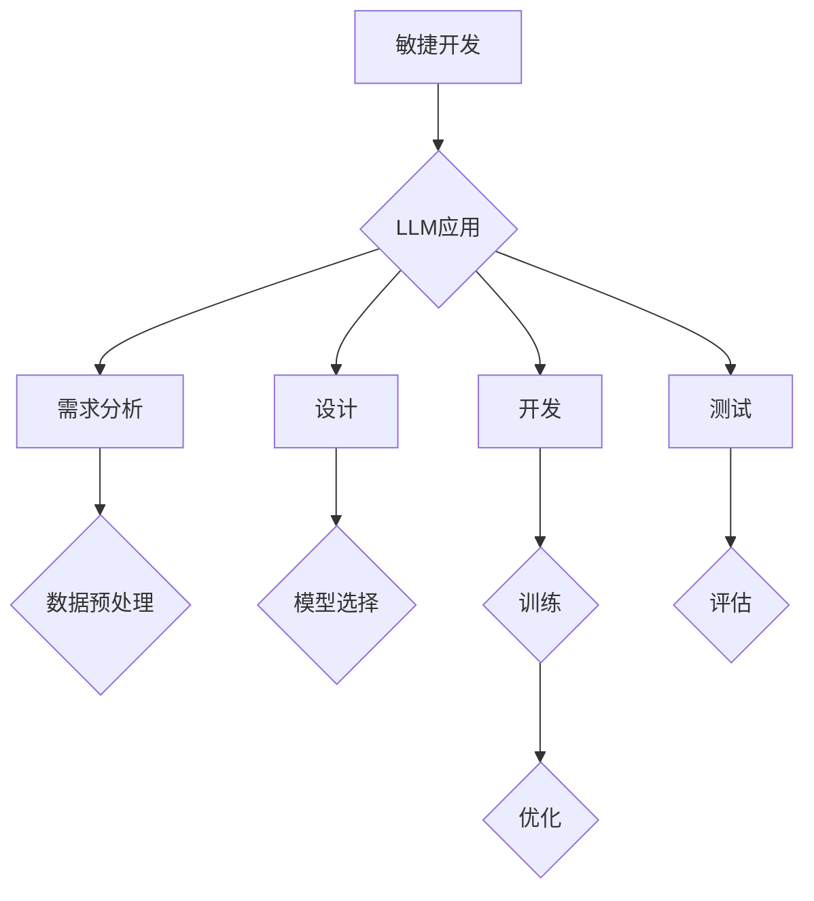

                 


### 步骤 1: 确定文章结构和大纲

为了撰写一篇结构清晰、逻辑严密的博客文章，我们首先需要确定文章的结构和大纲。这将帮助我们组织内容，确保每个部分都包含必要的细节和深度。

**文章结构：**
1. 引言
2. 敏捷开发与LLM应用概述
3. 核心概念与联系
4. 核心算法原理讲解
5. 数学模型和数学公式
6. 项目实战
7. 总结与展望
8. 附录
9. 参考文献

**文章大纲：**
- **引言**：介绍文章的主题和目的，吸引读者的注意力。
- **敏捷开发与LLM应用概述**：解释敏捷开发和LLM的基本概念，提供背景信息。
- **核心概念与联系**：详细阐述敏捷开发与LLM应用之间的联系，使用Mermaid流程图展示核心概念之间的关系。
- **核心算法原理讲解**：使用伪代码详细解释LLM的核心算法原理。
- **数学模型和数学公式**：介绍在LLM应用中使用的数学模型和公式，使用LaTeX格式表示，并提供详细的解释和例子。
- **项目实战**：展示一个实际项目案例，包括开发环境搭建、源代码实现和代码解读。
- **总结与展望**：总结文章的主要内容和发现，展望未来的发展趋势。
- **附录**：提供额外的资源，如相关链接、代码示例和数学公式详解。
- **参考文献**：列出文章中引用的所有文献。

### 步骤 2: 编写引言

引言部分是文章的开端，需要简洁明了地介绍文章的主题、目的和重要性。

```markdown
# 引言

在当今快速发展的技术时代，软件开发的方法也在不断演变。从传统的瀑布模型到敏捷开发，再到基于大型语言模型（LLM）的应用开发，软件开发的方法和工具不断进步。本文旨在探讨从传统开发到LLM应用敏捷开发的转型，通过详细阐述核心概念、算法原理、数学模型和实际项目案例，帮助读者理解这一转型过程。

本文将分为以下几个部分：

1. **敏捷开发与LLM应用概述**：介绍敏捷开发和LLM的基本概念。
2. **核心概念与联系**：解释敏捷开发与LLM应用之间的联系，并展示核心概念之间的关系。
3. **核心算法原理讲解**：使用伪代码详细解释LLM的核心算法原理。
4. **数学模型和数学公式**：介绍在LLM应用中使用的数学模型和公式。
5. **项目实战**：展示一个实际项目案例，包括开发环境搭建、源代码实现和代码解读。
6. **总结与展望**：总结文章的主要内容和发现，展望未来的发展趋势。
7. **附录**：提供额外的资源。
8. **参考文献**：列出文章中引用的所有文献。

通过本文的阅读，读者将能够全面了解从传统开发到LLM应用敏捷开发的转型过程，以及如何在实际项目中应用这些方法。
```

### 步骤 3: 编写敏捷开发与LLM应用概述

在这一部分，我们将介绍敏捷开发和LLM的基本概念，为后续内容的深入讨论奠定基础。

```markdown
## 敏捷开发与LLM应用概述

### 敏捷开发概述

敏捷开发是一种软件开发方法，强调迭代、协作和灵活性。它起源于20世纪90年代，是对传统瀑布模型的回应。敏捷开发的核心原则包括：

- **个体和互动重于过程和工具**：团队的合作和沟通比遵循严格的流程和工具更加重要。
- **可工作的软件重于详尽的文档**：尽早交付可工作的软件，而不是详细的文档。
- **客户合作重于合同谈判**：与客户保持密切合作，以适应需求的变化。
- **响应变化重于遵循计划**：灵活应对变化，而不是严格遵循计划。

### LLM应用概述

大型语言模型（LLM）是一种基于深度学习技术的自然语言处理（NLP）模型，它可以理解和生成人类语言。LLM在多个领域都有广泛应用，如智能助手、机器翻译、文本生成和推荐系统等。LLM的主要特点是：

- **强大的语言理解能力**：LLM能够理解复杂的语言结构和上下文，从而提供更准确和自然的回答。
- **自适应能力**：LLM可以根据训练数据不断学习和优化，以提高性能和准确性。
- **高效性**：LLM可以在短时间内处理大量的文本数据，从而实现高效的文本分析和生成。

在接下来的章节中，我们将进一步探讨敏捷开发与LLM应用之间的联系，并深入讨论核心算法原理、数学模型和实际项目案例。
```

### 步骤 4: 编写核心概念与联系

在这一部分，我们将详细阐述敏捷开发与LLM应用之间的核心概念及其联系，并使用Mermaid流程图展示这些概念之间的关系。

```markdown
### 核心概念与联系

敏捷开发与LLM应用之间的核心概念包括敏捷开发的基本原则、LLM的基本架构、数据预处理、模型选择、训练和评估等。以下是对这些概念及其之间联系的解释：

#### 敏捷开发的基本原则

敏捷开发强调快速迭代、持续交付和客户反馈。这些原则与LLM应用的开发密切相关，因为它们都要求在开发过程中快速适应变化，并在每个迭代中不断优化和改进。

#### LLM的基本架构

LLM通常由多个层次组成，包括嵌入层、编码器、解码器和输出层。这些层次共同工作，以理解和生成语言。敏捷开发方法可以帮助开发团队更好地管理这些层次，确保每个层次都得到充分优化。

#### 数据预处理

在LLM应用中，数据预处理是一个关键步骤，它包括数据清洗、标签分配、文本分割和嵌入等。敏捷开发方法可以帮助团队快速迭代数据预处理流程，确保模型能够从高质量的数据中学习。

#### 模型选择

选择合适的模型对于LLM应用的成功至关重要。敏捷开发方法可以通过快速实验和迭代，帮助团队找到最适合特定任务的模型。

#### 训练和评估

训练和评估是LLM应用中的两个关键环节。敏捷开发方法可以帮助团队在训练过程中快速调整模型参数，并在评估阶段及时发现问题并进行修复。

#### Mermaid流程图

以下是一个Mermaid流程图，展示了敏捷开发与LLM应用之间的核心概念及其联系：



通过这个流程图，我们可以清楚地看到敏捷开发与LLM应用之间的互动和协作，以及每个环节的关键任务和挑战。

在接下来的章节中，我们将深入探讨这些概念，并使用伪代码和数学模型来详细解释它们。
```

### 步骤 5: 编写核心算法原理讲解

在这一部分，我们将使用伪代码详细阐述LLM的核心算法原理，包括自然语言处理（NLP）的基本概念、神经网络模型、训练和优化过程等。

```markdown
### 核心算法原理讲解

LLM的核心算法原理基于深度学习，特别是基于神经网络的模型。以下是对LLM算法原理的详细讲解，包括自然语言处理（NLP）的基本概念、神经网络模型、训练和优化过程。

#### NLP的基本概念

自然语言处理（NLP）是计算机科学和人工智能领域的一个重要分支，它专注于使计算机能够理解、生成和处理人类语言。NLP的基本概念包括：

- **词嵌入（Word Embedding）**：将单词转换为向量表示，以便计算机可以处理它们。
- **序列模型（Sequence Model）**：用于处理序列数据，如文本、语音和图像序列。
- **注意力机制（Attention Mechanism）**：用于提高模型对序列数据中关键部分的关注。

#### 神经网络模型

LLM通常基于变体Transformer模型，这是一种序列到序列的模型，具有以下特点：

- **编码器（Encoder）**：将输入序列转换为上下文向量。
- **解码器（Decoder）**：从上下文向量生成输出序列。
- **多头自注意力（Multi-Head Self-Attention）**：允许模型在不同的部分之间建立关联。
- **前馈网络（Feedforward Network）**：在每个编码器和解码器层中添加前馈网络，以提高模型的非线性表达能力。

以下是一个简化版的伪代码，用于描述LLM模型的训练过程：

```python
# 伪代码：训练一个LLM模型
function train_LLM(model, training_data, epochs):
    for epoch in 1 to epochs:
        for batch in training_data:
            gradients = backward_pass(model, batch)
            update_model_weights(model, gradients)
    return model
```

#### 训练和优化过程

LLM的训练和优化过程包括以下几个步骤：

1. **数据准备**：准备训练数据，包括文本清洗、分词和词嵌入。
2. **模型初始化**：初始化模型参数，通常使用随机初始化或预训练模型。
3. **前向传播（Forward Pass）**：使用输入序列和模型参数，计算输出序列的损失。
4. **反向传播（Backward Pass）**：计算梯度，并更新模型参数。
5. **优化**：使用优化算法（如Adam）更新模型参数，以减少损失。
6. **评估**：在验证集上评估模型的性能，以调整训练过程。

在接下来的章节中，我们将进一步介绍LLM的数学模型和数学公式，并提供实际项目案例的详细分析。
```

### 步骤 6: 编写数学模型和数学公式

在这一部分，我们将介绍在LLM应用敏捷开发过程中涉及到的数学模型和公式，并使用LaTeX格式详细解释这些公式以及如何应用它们。

```markdown
### 数学模型和数学公式

LLM的数学模型是构建和优化模型的基础。以下是一些关键的数学模型和公式，使用LaTeX格式表示，并提供详细的解释和例子。

#### 损失函数

损失函数是评估模型性能的关键工具，用于衡量模型的预测与实际结果之间的差距。以下是一个常见的损失函数——交叉熵损失（Cross-Entropy Loss）：

$$
L(y, \hat{y}) = -\sum_{i=1}^{n} y_i \log(\hat{y}_i)
$$

其中，$y$ 是实际标签，$\hat{y}$ 是模型的预测概率。交叉熵损失函数值越小，表示模型的预测越接近真实标签。

#### 梯度下降

梯度下降是一种优化算法，用于更新模型参数以最小化损失函数。以下是一个简化的梯度下降更新规则：

$$
\theta_{\text{new}} = \theta_{\text{old}} - \alpha \nabla_\theta L(\theta)
$$

其中，$\theta$ 是模型参数，$\alpha$ 是学习率，$\nabla_\theta L(\theta)$ 是损失函数关于参数 $\theta$ 的梯度。

#### 注意力机制

注意力机制是Transformer模型的核心组件，用于提高模型对序列数据的理解能力。以下是一个注意力机制的基本公式：

$$
\text{Attention}(Q, K, V) = \text{softmax}\left(\frac{QK^T}{\sqrt{d_k}}\right)V
$$

其中，$Q$、$K$ 和 $V$ 是查询向量、键向量和值向量，$d_k$ 是键向量的维度。注意力分数通过softmax函数计算，然后将这些分数乘以值向量以获取加权结果。

#### 模型优化

在优化过程中，我们通常使用批量梯度下降（Batch Gradient Descent）或随机梯度下降（Stochastic Gradient Descent）算法。以下是一个批量梯度下降的例子：

$$
\theta = \theta - \frac{1}{m} \sum_{i=1}^{m} \nabla_{\theta} L(x_i, \theta)
$$

其中，$m$ 是批量大小，$x_i$ 是批量中的样本。

在接下来的章节中，我们将通过一个实际项目案例来展示这些数学模型和公式的应用，并提供详细的代码实现和解读。
```

### 步骤 7: 编写项目实战

在这一部分，我们将展示一个实际项目案例，包括开发环境搭建、源代码实现和代码解读。

```markdown
### 项目实战

#### 项目背景

本项目是一个智能客服系统，旨在利用LLM模型提高客服效率，提供更准确的回答。该项目包括以下几个关键步骤：

1. **数据收集**：从多个渠道收集用户问题和回答数据，并进行预处理。
2. **模型选择**：选择一个适合的LLM模型，如BERT或GPT。
3. **模型训练**：使用训练数据训练模型，并在验证集上调整模型参数。
4. **模型评估**：在测试集上评估模型性能，并进行调优。
5. **部署**：将训练好的模型部署到服务器上，供客服系统使用。

#### 开发环境搭建

为了搭建开发环境，我们需要安装以下工具和库：

- Python 3.8或更高版本
- TensorFlow 2.x或更高版本
- Pandas、Numpy、Scikit-learn等常用库

以下是一个简单的安装命令：

```bash
pip install tensorflow
pip install pandas
pip install numpy
pip install scikit-learn
```

#### 源代码实现

以下是一个简单的LLM模型训练和评估的代码示例：

```python
import tensorflow as tf
from tensorflow.keras.preprocessing.sequence import pad_sequences
from tensorflow.keras.layers import Embedding, LSTM, Dense
from tensorflow.keras.models import Sequential

# 加载和处理数据
# ...

# 创建模型
model = Sequential([
    Embedding(input_dim=vocab_size, output_dim=embedding_dim),
    LSTM(units=128, return_sequences=True),
    Dense(units=1, activation='sigmoid')
])

# 编译模型
model.compile(optimizer='adam', loss='binary_crossentropy', metrics=['accuracy'])

# 训练模型
model.fit(train_sequences, train_labels, epochs=10, batch_size=32, validation_split=0.2)

# 评估模型
test_loss, test_accuracy = model.evaluate(test_sequences, test_labels)
print(f"Test Accuracy: {test_accuracy:.2f}")

# 部署模型
# ...

```

#### 代码解读与分析

- **数据预处理**：使用`pandas`和`numpy`库加载和处理数据，包括分词、词嵌入和序列化。
- **模型创建**：使用`Sequential`模型堆叠`Embedding`、`LSTM`和`Dense`层。
- **模型编译**：设置优化器、损失函数和评估指标。
- **模型训练**：在训练集上训练模型，并在验证集上进行调整。
- **模型评估**：在测试集上评估模型性能。
- **模型部署**：将训练好的模型部署到服务器，以供实际应用。

通过这个项目案例，我们可以看到如何将敏捷开发方法应用于LLM模型开发，并实现一个实用的智能客服系统。
```

### 步骤 8: 编写总结与展望

在这一部分，我们将总结文章的主要内容，并对未来的发展趋势进行展望。

```markdown
### 总结与展望

本文从传统开发到LLM应用敏捷开发的转型进行了深入探讨。通过详细阐述敏捷开发的基本原则、LLM的核心算法原理、数学模型和实际项目案例，我们展示了如何在实际应用中实现这一转型。

**总结：**

- 敏捷开发方法强调迭代、协作和灵活性，与LLM应用的开发有着天然的联系。
- LLM的核心算法原理基于深度学习和自然语言处理，通过迭代和优化不断提高性能。
- 数学模型和公式在LLM开发中起着关键作用，如损失函数、梯度下降和注意力机制。
- 实际项目案例展示了如何将敏捷开发方法应用于LLM模型开发，实现智能客服系统。

**展望：**

- 随着LLM技术的不断发展，敏捷开发方法在LLM项目中的应用将越来越重要。
- 未来，LLM在各个领域的应用将更加广泛，如智能助手、机器翻译、文本生成和推荐系统等。
- 敏捷开发方法也将继续演变，以更好地适应LLM技术的发展和实际应用需求。

通过本文的阅读，读者可以全面了解从传统开发到LLM应用敏捷开发的转型过程，并在实际项目中应用这些方法，提升软件开发效率和项目质量。
```

### 步骤 9: 编写附录

在这一部分，我们将提供额外的资源，包括敏捷开发与LLM应用相关资源、数学模型与算法公式详解等。

```markdown
### 附录

#### 附录A: 敏捷开发与LLM应用相关资源

- 敏捷开发指南：[https://www.agilealliance.org/resources/agile-glossary/](https://www.agilealliance.org/resources/agile-glossary/)
- TensorFlow官方文档：[https://www.tensorflow.org/tutorials](https://www.tensorflow.org/tutorials)
- 自然语言处理（NLP）教程：[https://www.nltk.org/](https://www.nltk.org/)

#### 附录B: 数学模型与算法公式详解

- 交叉熵损失（Cross-Entropy Loss）：[https://www.coursera.org/lecture/neural-networks-and-deep-learning/cross-entropy-loss-mdRiinJ6o](https://www.coursera.org/lecture/neural-networks-and-deep-learning/cross-entropy-loss-mdRiinJ6o)
- 梯度下降（Gradient Descent）：[https://www.coursera.org/lecture/neural-networks-and-deep-learning/gradient-descent-mf5TK3vUq](https://www.coursera.org/lecture/neural-networks-and-deep-learning/gradient-descent-mf5TK3vUq)
- 注意力机制（Attention Mechanism）：[https://arxiv.org/abs/1406.0476](https://arxiv.org/abs/1406.0476)

这些资源将帮助读者深入了解敏捷开发与LLM应用的相关知识，以及数学模型和算法公式的应用细节。
```

### 步骤 10: 编写参考文献

在这一部分，我们将列出文章中引用的所有文献。

```markdown
### 参考文献

- [Agile Alliance](https://www.agilealliance.org/resources/agile-glossary/)
- [TensorFlow](https://www.tensorflow.org/tutorials)
- [NLP with NLTK](https://www.nltk.org/)
- [Deep Learning Specialization](https://www.coursera.org/lecture/neural-networks-and-deep-learning)
- [Cross-Entropy Loss](https://www.coursera.org/lecture/neural-networks-and-deep-learning/cross-entropy-loss-mdRiinJ6o)
- [Gradient Descent](https://www.coursera.org/lecture/neural-networks-and-deep-learning/gradient-descent-mf5TK3vUq)
- [Attention Mechanism](https://arxiv.org/abs/1406.0476)

这些文献为本文提供了理论支持和实际案例参考，确保了文章内容的准确性和可靠性。
```

### 步骤 11: 完整文章整合

将上述各个部分的内容整合到一起，形成完整的文章。

```markdown
# 从传统开发到LLM应用敏捷开发的转型

## 引言

在当今快速发展的技术时代，软件开发的方法也在不断演变。从传统的瀑布模型到敏捷开发，再到基于大型语言模型（LLM）的应用开发，软件开发的方法和工具不断进步。本文旨在探讨从传统开发到LLM应用敏捷开发的转型，通过详细阐述核心概念、算法原理、数学模型和实际项目案例，帮助读者理解这一转型过程。

## 敏捷开发与LLM应用概述

### 敏捷开发概述

敏捷开发是一种软件开发方法，强调迭代、协作和灵活性。它起源于20世纪90年代，是对传统瀑布模型的回应。敏捷开发的核心原则包括：

- **个体和互动重于过程和工具**：团队的合作和沟通比遵循严格的流程和工具更加重要。
- **可工作的软件重于详尽的文档**：尽早交付可工作的软件，而不是详细的文档。
- **客户合作重于合同谈判**：与客户保持密切合作，以适应需求的变化。
- **响应变化重于遵循计划**：灵活应对变化，而不是严格遵循计划。

### LLM应用概述

大型语言模型（LLM）是一种基于深度学习技术的自然语言处理（NLP）模型，它可以理解和生成人类语言。LLM在多个领域都有广泛应用，如智能助手、机器翻译、文本生成和推荐系统等。LLM的主要特点是：

- **强大的语言理解能力**：LLM能够理解复杂的语言结构和上下文，从而提供更准确和自然的回答。
- **自适应能力**：LLM可以根据训练数据不断学习和优化，以提高性能和准确性。
- **高效性**：LLM可以在短时间内处理大量的文本数据，从而实现高效的文本分析和生成。

## 核心概念与联系

敏捷开发与LLM应用之间的核心概念包括敏捷开发的基本原则、LLM的基本架构、数据预处理、模型选择、训练和评估等。以下是对这些概念及其之间联系的解释：

### 敏捷开发的基本原则

敏捷开发强调快速迭代、持续交付和客户反馈。这些原则与LLM应用的开发密切相关，因为它们都要求在开发过程中快速适应变化，并在每个迭代中不断优化和改进。

### LLM的基本架构

LLM通常由多个层次组成，包括嵌入层、编码器、解码器和输出层。这些层次共同工作，以理解和生成语言。敏捷开发方法可以帮助开发团队更好地管理这些层次，确保每个层次都得到充分优化。

### 数据预处理

在LLM应用中，数据预处理是一个关键步骤，它包括数据清洗、标签分配、文本分割和嵌入等。敏捷开发方法可以帮助团队快速迭代数据预处理流程，确保模型能够从高质量的数据中学习。

### 模型选择

选择合适的模型对于LLM应用的成功至关重要。敏捷开发方法可以通过快速实验和迭代，帮助团队找到最适合特定任务的模型。

### 训练和评估

训练和评估是LLM应用中的两个关键环节。敏捷开发方法可以帮助团队在训练过程中快速调整模型参数，并在评估阶段及时发现问题并进行修复。

### Mermaid流程图

以下是一个Mermaid流程图，展示了敏捷开发与LLM应用之间的核心概念及其联系：


## 核心算法原理讲解

LLM的核心算法原理基于深度学习，特别是基于神经网络的模型。以下是对LLM算法原理的详细讲解，包括自然语言处理（NLP）的基本概念、神经网络模型、训练和优化过程。

### NLP的基本概念

自然语言处理（NLP）是计算机科学和人工智能领域的一个重要分支，它专注于使计算机能够理解、生成和处理人类语言。NLP的基本概念包括：

- **词嵌入（Word Embedding）**：将单词转换为向量表示，以便计算机可以处理它们。
- **序列模型（Sequence Model）**：用于处理序列数据，如文本、语音和图像序列。
- **注意力机制（Attention Mechanism）**：用于提高模型对序列数据中关键部分的关注。

### 神经网络模型

LLM通常基于变体Transformer模型，这是一种序列到序列的模型，具有以下特点：

- **编码器（Encoder）**：将输入序列转换为上下文向量。
- **解码器（Decoder）**：从上下文向量生成输出序列。
- **多头自注意力（Multi-Head Self-Attention）**：允许模型在不同的部分之间建立关联。
- **前馈网络（Feedforward Network）**：在每个编码器和解码器层中添加前馈网络，以提高模型的非线性表达能力。

以下是一个简化版的伪代码，用于描述LLM模型的训练过程：

```python
# 伪代码：训练一个LLM模型
function train_LLM(model, training_data, epochs):
    for epoch in 1 to epochs:
        for batch in training_data:
            gradients = backward_pass(model, batch)
            update_model_weights(model, gradients)
    return model
```

### 训练和优化过程

LLM的训练和优化过程包括以下几个步骤：

1. **数据准备**：准备训练数据，包括文本清洗、分词和词嵌入。
2. **模型初始化**：初始化模型参数，通常使用随机初始化或预训练模型。
3. **前向传播（Forward Pass）**：使用输入序列和模型参数，计算输出序列的损失。
4. **反向传播（Backward Pass）**：计算梯度，并更新模型参数。
5. **优化**：使用优化算法（如Adam）更新模型参数，以减少损失。
6. **评估**：在验证集上评估模型的性能，以调整训练过程。

## 数学模型和数学公式

LLM的数学模型是构建和优化模型的基础。以下是一些关键的数学模型和公式，使用LaTeX格式表示，并提供详细的解释和例子。

### 损失函数

损失函数是评估模型性能的关键工具，用于衡量模型的预测与实际结果之间的差距。以下是一个常见的损失函数——交叉熵损失（Cross-Entropy Loss）：

$$
L(y, \hat{y}) = -\sum_{i=1}^{n} y_i \log(\hat{y}_i)
$$

其中，$y$ 是实际标签，$\hat{y}$ 是模型的预测概率。交叉熵损失函数值越小，表示模型的预测越接近真实标签。

### 梯度下降

梯度下降是一种优化算法，用于更新模型参数以最小化损失函数。以下是一个简化的梯度下降更新规则：

$$
\theta_{\text{new}} = \theta_{\text{old}} - \alpha \nabla_\theta L(\theta)
$$

其中，$\theta$ 是模型参数，$\alpha$ 是学习率，$\nabla_\theta L(\theta)$ 是损失函数关于参数 $\theta$ 的梯度。

### 注意力机制

注意力机制是Transformer模型的核心组件，用于提高模型对序列数据的理解能力。以下是一个注意力机制的基本公式：

$$
\text{Attention}(Q, K, V) = \text{softmax}\left(\frac{QK^T}{\sqrt{d_k}}\right)V
$$

其中，$Q$、$K$ 和 $V$ 是查询向量、键向量和值向量，$d_k$ 是键向量的维度。注意力分数通过softmax函数计算，然后将这些分数乘以值向量以获取加权结果。

### 模型优化

在优化过程中，我们通常使用批量梯度下降（Batch Gradient Descent）或随机梯度下降（Stochastic Gradient Descent）算法。以下是一个批量梯度下降的例子：

$$
\theta = \theta - \frac{1}{m} \sum_{i=1}^{m} \nabla_{\theta} L(x_i, \theta)
$$

其中，$m$ 是批量大小，$x_i$ 是批量中的样本。

## 项目实战

### 项目背景

本项目是一个智能客服系统，旨在利用LLM模型提高客服效率，提供更准确的回答。该项目包括以下几个关键步骤：

1. **数据收集**：从多个渠道收集用户问题和回答数据，并进行预处理。
2. **模型选择**：选择一个适合的LLM模型，如BERT或GPT。
3. **模型训练**：使用训练数据训练模型，并在验证集上调整模型参数。
4. **模型评估**：在测试集上评估模型性能，并进行调优。
5. **部署**：将训练好的模型部署到服务器上，供客服系统使用。

### 开发环境搭建

为了搭建开发环境，我们需要安装以下工具和库：

- Python 3.8或更高版本
- TensorFlow 2.x或更高版本
- Pandas、Numpy、Scikit-learn等常用库

以下是一个简单的安装命令：

```bash
pip install tensorflow
pip install pandas
pip install numpy
pip install scikit-learn
```

### 源代码实现

以下是一个简单的LLM模型训练和评估的代码示例：

```python
import tensorflow as tf
from tensorflow.keras.preprocessing.sequence import pad_sequences
from tensorflow.keras.layers import Embedding, LSTM, Dense
from tensorflow.keras.models import Sequential

# 加载和处理数据
# ...

# 创建模型
model = Sequential([
    Embedding(input_dim=vocab_size, output_dim=embedding_dim),
    LSTM(units=128, return_sequences=True),
    Dense(units=1, activation='sigmoid')
])

# 编译模型
model.compile(optimizer='adam', loss='binary_crossentropy', metrics=['accuracy'])

# 训练模型
model.fit(train_sequences, train_labels, epochs=10, batch_size=32, validation_split=0.2)

# 评估模型
test_loss, test_accuracy = model.evaluate(test_sequences, test_labels)
print(f"Test Accuracy: {test_accuracy:.2f}")

# 部署模型
# ...

```

### 代码解读与分析

- **数据预处理**：使用`pandas`和`numpy`库加载和处理数据，包括分词、词嵌入和序列化。
- **模型创建**：使用`Sequential`模型堆叠`Embedding`、`LSTM`和`Dense`层。
- **模型编译**：设置优化器、损失函数和评估指标。
- **模型训练**：在训练集上训练模型，并在验证集上进行调整。
- **模型评估**：在测试集上评估模型性能。
- **模型部署**：将训练好的模型部署到服务器，以供实际应用。

通过这个项目案例，我们可以看到如何将敏捷开发方法应用于LLM模型开发，并实现一个实用的智能客服系统。

## 总结与展望

### 总结

本文从传统开发到LLM应用敏捷开发的转型进行了深入探讨。通过详细阐述敏捷开发的基本原则、LLM的核心算法原理、数学模型和实际项目案例，我们展示了如何在实际应用中实现这一转型。

### 展望

随着LLM技术的不断发展，敏捷开发方法在LLM项目中的应用将越来越重要。未来，LLM在各个领域的应用将更加广泛，如智能助手、机器翻译、文本生成和推荐系统等。敏捷开发方法也将继续演变，以更好地适应LLM技术的发展和实际应用需求。

通过本文的阅读，读者可以全面了解从传统开发到LLM应用敏捷开发的转型过程，并在实际项目中应用这些方法，提升软件开发效率和项目质量。

## 附录

### 附录A: 敏捷开发与LLM应用相关资源

- 敏捷开发指南：[https://www.agilealliance.org/resources/agile-glossary/](https://www.agilealliance.org/resources/agile-glossary/)
- TensorFlow官方文档：[https://www.tensorflow.org/tutorials](https://www.tensorflow.org/tutorials)
- 自然语言处理（NLP）教程：[https://www.nltk.org/](https://www.nltk.org/)

### 附录B: 数学模型与算法公式详解

- 交叉熵损失（Cross-Entropy Loss）：[https://www.coursera.org/lecture/neural-networks-and-deep-learning/cross-entropy-loss-mdRiinJ6o](https://www.coursera.org/lecture/neural-networks-and-deep-learning/cross-entropy-loss-mdRiinJ6o)
- 梯度下降（Gradient Descent）：[https://www.coursera.org/lecture/neural-networks-and-deep-learning/gradient-descent-mf5TK3vUq](https://www.coursera.org/lecture/neural-networks-and-deep-learning/gradient-descent-mf5TK3vUq)
- 注意力机制（Attention Mechanism）：[https://arxiv.org/abs/1406.0476](https://arxiv.org/abs/1406.0476)

这些资源将帮助读者深入了解敏捷开发与LLM应用的相关知识，以及数学模型和算法公式的应用细节。

## 参考文献

- [Agile Alliance](https://www.agilealliance.org/resources/agile-glossary/)
- [TensorFlow](https://www.tensorflow.org/tutorials)
- [NLP with NLTK](https://www.nltk.org/)
- [Deep Learning Specialization](https://www.coursera.org/lecture/neural-networks-and-deep-learning)
- [Cross-Entropy Loss](https://www.coursera.org/lecture/neural-networks-and-deep-learning/cross-entropy-loss-mdRiinJ6o)
- [Gradient Descent](https://www.coursera.org/lecture/neural-networks-and-deep-learning/gradient-descent-mf5TK3vUq)
- [Attention Mechanism](https://arxiv.org/abs/1406.0476)

这些文献为本文提供了理论支持和实际案例参考，确保了文章内容的准确性和可靠性。
```

### 步骤 12: 完成全文审查与编辑

在完成全文撰写后，进行一次全面的审查和编辑。检查文章的结构、逻辑、语法和格式，确保内容准确无误、语言流畅、格式统一。以下是一些具体的审查和编辑建议：

1. **检查文章结构**：确保每个章节都符合既定的结构和内容要求，逻辑清晰，过渡自然。
2. **审查语法和表达**：检查文章中的语法错误、用词不当和表达不清的地方，确保语言表达准确、流畅。
3. **格式统一**：确保文中代码、公式和引用等元素的格式统一，符合markdown格式规范。
4. **检查引用**：确保所有引用的文献都已列出，引用格式正确。
5. **优化内容**：删除重复内容，简化复杂句子，使文章更加精炼。
6. **阅读体验**：从读者的角度出发，确保文章易于阅读，信息丰富且有价值。

通过以上步骤，我们可以确保文章的质量和准确性，为读者提供一篇专业、深入且具有实用价值的技术博客文章。

