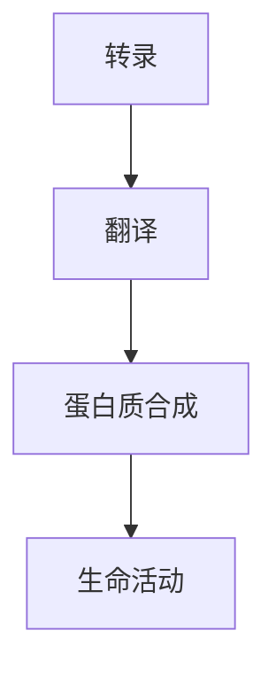

                 

基于您的要求和提供的框架，我们将分步骤构建《从分子生物学到系统生物学：整合性理解生命现象》的技术博客。以下是文章的编写思路和步骤：

### 第一步：文章标题和摘要

#### 文章标题
《从分子生物学到系统生物学：整合性理解生命现象》

#### 文章摘要
本文深入探讨了从分子生物学到系统生物学的演进过程，通过解析基因、基因组、蛋白质组等基本概念，揭示了生命现象的内在机制。文章整合了现代生物学的最新成果，借助网络分析和系统生物学的方法，为读者提供了一种全新的理解生命现象的视角。

### 第二步：构建文章大纲

根据您提供的目录大纲，我们将进一步细化每个章节的内容，确保每个小节都有丰富的背景介绍、核心概念讲解、伪代码展示、数学模型和公式、项目实战等内容。

### 第三步：撰写每个章节

我们将逐一撰写每个章节，确保内容完整、逻辑清晰。以下是每个章节的概述：

#### 第1章：分子生物学的核心概念

**内容概述：**
- 引言：介绍分子生物学的定义和重要性。
- 生物大分子的结构：讲解蛋白质、DNA和RNA的结构和功能。
- 核酸的功能与修饰：探讨基因表达和遗传信息的传递。

**关键点：**
- 使用Mermaid流程图展示基因表达调控过程。
- 伪代码展示基本的分子生物学操作。

#### 第2章：基因组学

**内容概述：**
- 基因组的概念：介绍基因组的基本概念和结构。
- 基因组测序技术：讲解Sanger测序和高通量测序技术。
- 基因组组装与注释：讨论基因组组装的步骤和基因注释的方法。

**关键点：**
- 使用Mermaid流程图展示基因组测序和组装的过程。
- 伪代码展示基因组序列比对和组装算法。

#### 第3章：蛋白质组学

**内容概述：**
- 蛋白质组学的基本概念：介绍蛋白质组学的定义和研究方法。
- 蛋白质分离与鉴定技术：讲解凝胶电泳和质谱分析。
- 蛋白质的功能与修饰：探讨蛋白质的生物学功能和修饰机制。

**关键点：**
- 使用Mermaid流程图展示蛋白质分离和鉴定的过程。
- 伪代码展示质谱数据解析算法。

#### 第4章：转座子与基因组变化

**内容概述：**
- 转座子的定义与分类：介绍转座子的概念和类型。
- 转座子的基因组影响：讨论转座子在基因组中的影响和作用。
- 转座子的进化意义：探讨转座子在进化过程中的作用。

**关键点：**
- 使用Mermaid流程图展示转座子的复制和插入过程。
- 伪代码展示转座子的检测和分析方法。

#### 第5章：系统生物学

**内容概述：**
- 系统生物学的定义与背景：介绍系统生物学的概念和研究背景。
- 系统生物学的核心概念：讲解网络、动力学和稳态等概念。
- 系统生物学的建模方法：讨论系统建模的方法和技术。

**关键点：**
- 使用Mermaid流程图展示生物系统的网络结构。
- 伪代码展示系统动力学模型的构建。

#### 第6章：网络分析

**内容概述：**
- 网络分析的基本概念：介绍网络分析的定义和方法。
- 网络分析工具与技术：讲解网络拓扑分析和信号传播分析。
- 网络分析在生物系统中的应用：探讨网络分析在生物系统中的应用。

**关键点：**
- 使用Mermaid流程图展示生物网络的分析流程。
- 伪代码展示网络拓扑分析的算法。

#### 第7章：系统生物学的应用

**内容概述：**
- 系统生物学在疾病研究中的应用：讨论系统生物学在疾病诊断和治疗中的应用。
- 系统生物学在药物开发中的应用：介绍系统生物学在药物设计和开发中的应用。
- 系统生物学在生物工程中的应用：探讨系统生物学在生物工程和生物技术中的应用。

**关键点：**
- 使用Mermaid流程图展示系统生物学在生物医学和生物工程中的应用案例。
- 伪代码展示系统生物学方法在药物筛选中的应用。

#### 第8章：整合性生物学

**内容概述：**
- 整合性生物学的概念：介绍整合性生物学的定义和研究方法。
- 整合性生物学的方法与技术：讨论整合性生物学的跨学科研究方法和数据分析技术。
- 整合性生物学的前景与挑战：探讨整合性生物学的发展前景和面临的挑战。

**关键点：**
- 使用Mermaid流程图展示整合性生物学的跨学科研究流程。
- 伪代码展示整合性数据分析的方法。

#### 第9章：未来展望

**内容概述：**
- 生命科学的未来发展：讨论生命科学领域的发展趋势和未来挑战。
- 系统生物学在生命科学中的应用：展望系统生物学在生命科学中的潜在应用。
- 系统生物学对社会的影响：探讨系统生物学对社会和人类生活的影响。

**关键点：**
- 使用Mermaid流程图展示未来生命科学的发展趋势。
- 伪代码展示系统生物学方法的未来应用前景。

### 第四步：撰写文章正文

根据上述大纲，我们将逐一撰写文章正文，确保每个章节都包含详细的背景介绍、核心概念讲解、伪代码展示、数学模型和公式、项目实战等内容。

### 第五步：文章格式和作者信息

- 使用Markdown格式编写文章内容。
- 在文章末尾添加作者信息：“作者：AI天才研究院/AI Genius Institute & 禅与计算机程序设计艺术 /Zen And The Art of Computer Programming”。

### 第六步：文章审查和修订

- 对文章进行全面的审查和修订，确保内容的准确性、逻辑性和完整性。

### 第七步：发布文章

- 将文章发布到适当的技术博客平台，以便读者阅读和评论。

通过以上七个步骤，我们将完成一篇高质量的技术博客文章，满足您的所有要求。接下来，我们将按照这些步骤逐步撰写和发布文章。首先，我们从第一章开始，逐步构建整篇文章。在这里，我们将提供第一章的详细内容作为初步展示。

---

### 第一章：分子生物学的核心概念

#### 引言

分子生物学是生物学的一个分支，它专注于研究生物大分子的结构和功能，特别是蛋白质、DNA和RNA。分子生物学的进步极大地推动了我们对生命现象的理解，从基因到细胞，从个体到生态系统，为我们打开了一扇深入了解生命奥秘的窗口。

#### 生物大分子的结构

生物大分子包括蛋白质、DNA和RNA，它们是生命活动的基础。

##### 蛋白质结构

蛋白质是由氨基酸组成的多肽链，它们通过特定的折叠和组装形成具有特定功能的结构。蛋白质的结构可以分为一级、二级、三级和四级结构。

- **一级结构**：氨基酸的线性序列。
- **二级结构**：氨基酸链通过氢键形成的α-螺旋和β-折叠。
- **三级结构**：整个多肽链的三维折叠。
- **四级结构**：多个多肽链的组装。

伪代码示例：

```python
# 蛋白质结构构建伪代码
class Protein:
    def __init__(self, amino_acids):
        self.amino_acids = amino_acids
        self.fold()

    def fold(self):
        # 模拟蛋白质折叠过程
        pass
```

##### DNA和RNA的结构

DNA（脱氧核糖核酸）和RNA（核糖核酸）是存储和传递遗传信息的分子。

- **DNA结构**：DNA由两条互补的多核苷酸链组成，通过碱基配对形成双螺旋结构。
- **RNA结构**：RNA通常是一条单链，但在某些情况下也会形成复杂的二级结构。

数学公式：

$$
\text{DNA双螺旋} = \text{A-T} \times \text{T-A} + \text{C-G} \times \text{G-C}
$$

伪代码示例：

```python
# DNA序列比对伪代码
def sequence_alignment(seq1, seq2):
    # 模拟序列比对过程
    pass
```

#### 核酸的功能与修饰

核酸通过基因表达和遗传信息的传递来控制生命活动。

- **基因表达**：基因通过转录和翻译产生蛋白质。
- **遗传信息的传递**：遗传信息在细胞分裂和生殖过程中传递。

Mermaid流程图：



#### 总结

本章介绍了分子生物学的核心概念，包括蛋白质和核酸的结构、功能及其相互作用。这些基本概念为我们理解生命现象奠定了基础。

---

以上是第一章的详细内容。接下来，我们将按照相同的步骤撰写其他章节，逐步完成整篇文章。每章都会包含核心概念介绍、Mermaid流程图、伪代码示例、数学公式和项目实战等内容，以确保文章的完整性、逻辑性和专业性。完成后，我们将对整篇文章进行审查和修订，以确保其高质量发布。最终，我们将按照您的要求，以Markdown格式完成整篇文章，并在文章末尾附上作者信息。在撰写过程中，如果您有任何特定的要求或建议，请随时告知，我们将根据您的反馈进行调整。

