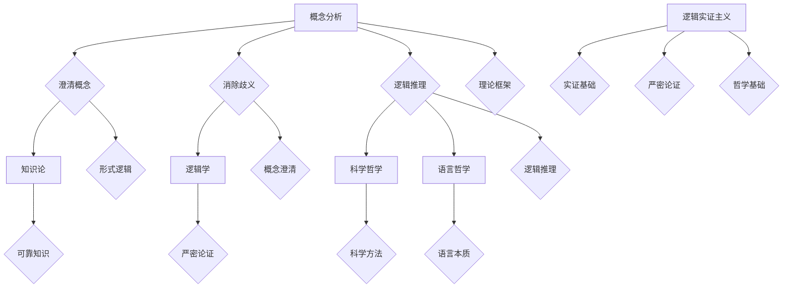
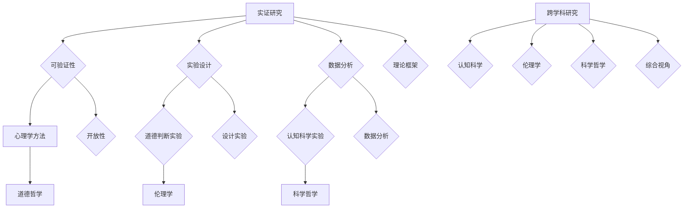
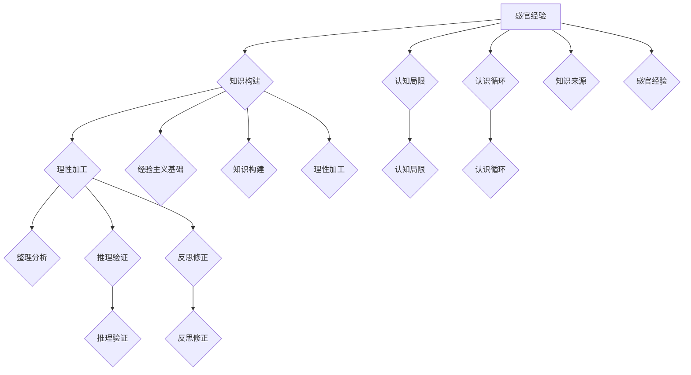

                 

### 第一部分：引论

## 1. 引言

### 1.1 哲学的性质与功能

哲学是一种旨在探讨人类存在、知识、价值观和理性的学科。它既是对人类思维和智慧的反思，也是对世界本质和意义的追求。哲学的基本性质在于其反思性和批判性，它不断地追问和质疑我们对于现实的理解和假设。

哲学的功能主要体现在以下几个方面：

1. **知识探索**：哲学通过逻辑推理和理性思考，探索人类知识的本质和范围，以寻求更深刻和全面的理解。
2. **价值判断**：哲学关注人类行为的道德伦理问题，探讨什么是正确和错误的，以及什么是美好的生活。
3. **思维方式**：哲学培养批判性思维和创造性思维，提高人类认识世界和解决问题的能力。
4. **文化传承**：哲学是人类文化的核心组成部分，它传承和记录了人类的思想和历史。

### 1.2 分析哲学与实验哲学的对比

分析哲学和实验哲学是当代哲学研究中的两大主要流派，它们在研究方法、目标和成果上存在显著差异。

#### 分析哲学

分析哲学起源于20世纪初的英国，其核心理念是通过对语言和逻辑的分析来澄清哲学问题。分析哲学的主要特点包括：

- **概念分析**：分析哲学致力于澄清哲学概念，通过细致的分析来消除歧义和误解。
- **逻辑实证主义**：分析哲学强调哲学命题必须与经验相关，可通过观察和实验来验证。
- **形式逻辑**：分析哲学运用形式逻辑来探究哲学问题，强调论证的严密性和逻辑性。

#### 实验哲学

实验哲学是一种新兴的哲学流派，它结合了传统哲学方法和实验科学方法。实验哲学的主要特点包括：

- **实证研究**：实验哲学通过实验来验证哲学假设，强调哲学研究的科学性。
- **心理学方法**：实验哲学利用心理学实验来探究哲学问题，如道德判断和认知偏见。
- **跨学科研究**：实验哲学结合心理学、认知科学、经济学等多个学科的研究方法，以获得更全面的视角。

### 1.3 世界可理解性的研究背景

世界可理解性是哲学研究中的一个核心问题，它探讨人类是否能够通过理性思考和科学方法理解世界的本质和规律。这一问题的研究背景包括：

- **科学革命**：随着科学技术的进步，人类对自然界的认识不断深化，但同时也引发了关于知识本质和科学方法的新思考。
- **认知科学的发展**：认知科学的研究揭示了人类思维和认知的复杂性，为探讨世界可理解性提供了新的视角。
- **哲学反思**：分析哲学和实验哲学等哲学流派对知识、真理和理性的探讨，促使人们重新审视世界可理解性的问题。

总的来说，分析哲学和实验哲学从不同的角度探讨世界可理解性，它们的研究方法和目标虽然有所不同，但都致力于寻求对这一问题的深刻理解。接下来，本文将详细探讨分析哲学和实验哲学的基本概念、方法以及它们在探讨世界可理解性方面的贡献。

### 2. 分析哲学的基本概念与方法

#### 2.1 分析哲学的核心思想

分析哲学的核心思想是通过对概念和语言的严格分析来澄清哲学问题。它强调逻辑和语言在哲学研究中的重要性，认为许多哲学困惑源于概念不清和语言误用。分析哲学的主要理念包括：

1. **澄清概念**：通过细致的概念分析，消除歧义和混淆，为哲学问题的探讨提供清晰的基础。
2. **逻辑实证主义**：分析哲学认为，哲学命题必须与经验相关，并能够通过观察和实验来验证。这一观点强调知识的实证基础。
3. **形式逻辑**：分析哲学运用形式逻辑来探究哲学问题，确保论证的严密性和逻辑性。

#### 2.2 分析哲学的方法论

分析哲学的方法论主要包括以下几个步骤：

1. **概念分析**：对哲学概念进行细致的分析和澄清，消除歧义和误解。
2. **逻辑推理**：运用形式逻辑，通过推理和论证来探讨哲学问题。
3. **实证验证**：对哲学假设进行经验验证，确保其符合现实情况。

#### 2.3 分析哲学的主要贡献

分析哲学在哲学研究和知识探索方面做出了重要贡献：

1. **知识论**：分析哲学澄清了知识的概念和条件，探讨了如何获取可靠的知识。
2. **逻辑学**：分析哲学推动了逻辑学的发展，提高了论证的严密性和科学性。
3. **科学哲学**：分析哲学为科学方法提供了哲学基础，促进了科学知识的进步。
4. **语言哲学**：分析哲学对语言的本质和功能进行了深入研究，为语言学和认知科学提供了理论支持。

#### 核心概念与联系

分析哲学的核心概念包括概念分析、逻辑实证主义和形式逻辑。概念分析是澄清哲学概念的基础，逻辑实证主义强调哲学命题的实证基础，形式逻辑则确保了论证的严密性。这些概念相互关联，共同构成了分析哲学的理论框架。

### Mermaid 流程图



该流程图展示了分析哲学的核心概念和它们之间的联系，这些概念共同构成了分析哲学的理论框架，并为其在知识论、逻辑学、科学哲学和语言哲学等方面的贡献提供了基础。

### 2. 分析哲学的基本概念与方法

#### 2.1 分析哲学的核心思想

分析哲学的核心思想是通过对概念和语言的严格分析来澄清哲学问题。它强调逻辑和语言在哲学研究中的重要性，认为许多哲学困惑源于概念不清和语言误用。分析哲学的主要理念包括：

1. **澄清概念**：通过细致的概念分析，消除歧义和误解，为哲学问题的探讨提供清晰的基础。
2. **逻辑实证主义**：分析哲学认为，哲学命题必须与经验相关，并能够通过观察和实验来验证。这一观点强调知识的实证基础。
3. **形式逻辑**：分析哲学运用形式逻辑来探究哲学问题，确保论证的严密性和逻辑性。

#### 2.2 分析哲学的方法论

分析哲学的方法论主要包括以下几个步骤：

1. **概念分析**：对哲学概念进行细致的分析和澄清，消除歧义和误解。
2. **逻辑推理**：运用形式逻辑，通过推理和论证来探讨哲学问题。
3. **实证验证**：对哲学假设进行经验验证，确保其符合现实情况。

#### 2.3 分析哲学的主要贡献

分析哲学在哲学研究和知识探索方面做出了重要贡献：

1. **知识论**：分析哲学澄清了知识的概念和条件，探讨了如何获取可靠的知识。
2. **逻辑学**：分析哲学推动了逻辑学的发展，提高了论证的严密性和科学性。
3. **科学哲学**：分析哲学为科学方法提供了哲学基础，促进了科学知识的进步。
4. **语言哲学**：分析哲学对语言的本质和功能进行了深入研究，为语言学和认知科学提供了理论支持。

#### 核心概念与联系

分析哲学的核心概念包括概念分析、逻辑实证主义和形式逻辑。概念分析是澄清哲学概念的基础，逻辑实证主义强调哲学命题的实证基础，形式逻辑则确保了论证的严密性。这些概念相互关联，共同构成了分析哲学的理论框架。

### Mermaid 流程图


该流程图展示了分析哲学的核心概念和它们之间的联系，这些概念共同构成了分析哲学的理论框架，并为其在知识论、逻辑学、科学哲学和语言哲学等方面的贡献提供了基础。

### 3. 实验哲学的基本概念与方法

#### 3.1 实验哲学的核心思想

实验哲学是一种新兴的哲学流派，其核心思想是将实验科学的方法引入哲学研究。实验哲学认为，通过实验可以更直接、更可靠地探讨哲学问题，特别是那些难以通过传统哲学方法解决的问题。实验哲学的主要理念包括：

1. **实证研究**：实验哲学强调通过实验来验证哲学假设，强调实证基础。
2. **心理学方法**：实验哲学利用心理学实验来探究哲学问题，如道德判断、认知偏见等。
3. **跨学科研究**：实验哲学结合心理学、认知科学、经济学等多个学科的研究方法，以获得更全面的视角。
4. **开放性和可重复性**：实验哲学提倡开放性研究，鼓励他人重复实验，以验证研究结果的可靠性。

#### 3.2 实验哲学的方法论

实验哲学的方法论主要包括以下几个步骤：

1. **提出假设**：基于哲学问题，提出可验证的假设。
2. **设计实验**：设计实验来测试这些假设，包括实验条件、实验对象和实验步骤。
3. **进行实验**：按照设计好的实验方案，进行实际操作，收集数据。
4. **数据分析**：对实验数据进行统计分析，验证假设的正确性。
5. **反思与修正**：根据实验结果，反思和修正哲学假设，继续深入研究。

#### 3.3 实验哲学的主要贡献

实验哲学在哲学研究和知识探索方面做出了重要贡献：

1. **认知科学**：实验哲学通过心理学实验，揭示了人类认知的复杂性和局限性，为认知科学提供了重要的理论基础。
2. **道德哲学**：实验哲学通过道德判断实验，探讨了道德判断的根源和机制，为道德哲学的研究提供了新的视角。
3. **伦理学**：实验哲学在伦理学研究中，通过实验方法，探讨了道德决策和伦理判断的规律，为伦理实践提供了指导。
4. **科学哲学**：实验哲学为科学哲学提供了新的研究方法和视角，探讨了科学知识的生成和验证过程。

#### 核心概念与联系

实验哲学的核心概念包括实证研究、心理学方法和跨学科研究。实证研究是实验哲学的基础，心理学方法为哲学问题提供了新的探究途径，跨学科研究则使得实验哲学能够结合多个学科的理论和方法，以获得更全面和深入的理解。

### Mermaid 流程图



该流程图展示了实验哲学的核心概念和它们之间的联系，这些概念共同构成了实验哲学的理论框架，并为其在认知科学、道德哲学、伦理学和科学哲学等方面的贡献提供了基础。

### 3. 实验哲学的基本概念与方法

#### 3.1 实验哲学的核心思想

实验哲学是一种新兴的哲学流派，其核心思想是将实验科学的方法引入哲学研究。实验哲学认为，通过实验可以更直接、更可靠地探讨哲学问题，特别是那些难以通过传统哲学方法解决的问题。实验哲学的主要理念包括：

1. **实证研究**：实验哲学强调通过实验来验证哲学假设，强调实证基础。
2. **心理学方法**：实验哲学利用心理学实验来探究哲学问题，如道德判断、认知偏见等。
3. **跨学科研究**：实验哲学结合心理学、认知科学、经济学等多个学科的研究方法，以获得更全面的视角。
4. **开放性和可重复性**：实验哲学提倡开放性研究，鼓励他人重复实验，以验证研究结果的可靠性。

#### 3.2 实验哲学的方法论

实验哲学的方法论主要包括以下几个步骤：

1. **提出假设**：基于哲学问题，提出可验证的假设。
2. **设计实验**：设计实验来测试这些假设，包括实验条件、实验对象和实验步骤。
3. **进行实验**：按照设计好的实验方案，进行实际操作，收集数据。
4. **数据分析**：对实验数据进行统计分析，验证假设的正确性。
5. **反思与修正**：根据实验结果，反思和修正哲学假设，继续深入研究。

#### 3.3 实验哲学的主要贡献

实验哲学在哲学研究和知识探索方面做出了重要贡献：

1. **认知科学**：实验哲学通过心理学实验，揭示了人类认知的复杂性和局限性，为认知科学提供了重要的理论基础。
2. **道德哲学**：实验哲学通过道德判断实验，探讨了道德判断的根源和机制，为道德哲学的研究提供了新的视角。
3. **伦理学**：实验哲学在伦理学研究中，通过实验方法，探讨了道德决策和伦理判断的规律，为伦理实践提供了指导。
4. **科学哲学**：实验哲学为科学哲学提供了新的研究方法和视角，探讨了科学知识的生成和验证过程。

#### 核心概念与联系

实验哲学的核心概念包括实证研究、心理学方法和跨学科研究。实证研究是实验哲学的基础，心理学方法为哲学问题提供了新的探究途径，跨学科研究则使得实验哲学能够结合多个学科的理论和方法，以获得更全面和深入的理解。

### Mermaid 流程图


该流程图展示了实验哲学的核心概念和它们之间的联系，这些概念共同构成了实验哲学的理论框架，并为其在认知科学、道德哲学、伦理学和科学哲学等方面的贡献提供了基础。

### 第二部分：分析哲学与实验哲学的比较研究

## 4. 分析哲学与实验哲学的比较

### 4.1 哲学视角下的差异

分析哲学和实验哲学在哲学视角上存在显著差异。分析哲学强调逻辑和语言的分析，注重概念澄清和逻辑推理，认为通过细致的概念分析和严格的逻辑论证，可以解决哲学问题。分析哲学主张哲学命题必须与经验相关，强调实证基础，但更多的是通过逻辑和语言的分析来达到这一目标。

相比之下，实验哲学则更强调实验和实证研究，通过设计实验和收集数据来验证哲学假设。实验哲学认为，通过实验可以直接探究哲学问题的本质，揭示人类认知和道德判断的规律。实验哲学的方法论更加接近自然科学，强调可重复性和开放性。

### 4.2 方法论上的对比

在方法论上，分析哲学和实验哲学也有明显的区别。

1. **分析哲学的方法论**：
   - **概念分析**：分析哲学首先通过细致的概念分析，澄清哲学概念，消除歧义和混淆。
   - **逻辑推理**：接着运用形式逻辑，通过推理和论证来探讨哲学问题。
   - **实证验证**：最后，对哲学假设进行经验验证，确保其符合现实情况。

2. **实验哲学的方法论**：
   - **提出假设**：实验哲学从哲学问题出发，提出可验证的假设。
   - **设计实验**：设计实验来测试这些假设，包括实验条件、实验对象和实验步骤。
   - **进行实验**：按照设计好的实验方案，进行实际操作，收集数据。
   - **数据分析**：对实验数据进行统计分析，验证假设的正确性。
   - **反思与修正**：根据实验结果，反思和修正哲学假设，继续深入研究。

### 4.3 研究成果的对比

分析哲学和实验哲学在研究成果上也存在差异。

1. **分析哲学的研究成果**：
   - **知识论**：分析哲学澄清了知识的概念和条件，探讨了如何获取可靠的知识。
   - **逻辑学**：分析哲学推动了逻辑学的发展，提高了论证的严密性和科学性。
   - **科学哲学**：分析哲学为科学方法提供了哲学基础，促进了科学知识的进步。
   - **语言哲学**：分析哲学对语言的本质和功能进行了深入研究，为语言学和认知科学提供了理论支持。

2. **实验哲学的研究成果**：
   - **认知科学**：实验哲学通过心理学实验，揭示了人类认知的复杂性和局限性，为认知科学提供了重要的理论基础。
   - **道德哲学**：实验哲学通过道德判断实验，探讨了道德判断的根源和机制，为道德哲学的研究提供了新的视角。
   - **伦理学**：实验哲学在伦理学研究中，通过实验方法，探讨了道德决策和伦理判断的规律，为伦理实践提供了指导。
   - **科学哲学**：实验哲学为科学哲学提供了新的研究方法和视角，探讨了科学知识的生成和验证过程。

### 总结

分析哲学和实验哲学在哲学视角、方法论和研究成果上存在显著差异。分析哲学强调逻辑和语言的分析，注重概念澄清和逻辑推理，而实验哲学则更强调实验和实证研究，通过设计实验和收集数据来验证哲学假设。两者在研究领域和应用方面各有优势，共同推动了哲学的发展。

### 4. 分析哲学与实验哲学的比较

#### 4.1 哲学视角下的差异

分析哲学和实验哲学在哲学视角上存在显著差异。分析哲学强调逻辑和语言的分析，注重概念澄清和逻辑推理，认为通过细致的概念分析和严格的逻辑论证，可以解决哲学问题。分析哲学主张哲学命题必须与经验相关，强调实证基础，但更多的是通过逻辑和语言的分析来达到这一目标。

相比之下，实验哲学则更强调实验和实证研究，通过设计实验和收集数据来验证哲学假设。实验哲学认为，通过实验可以直接探究哲学问题的本质，揭示人类认知和道德判断的规律。实验哲学的方法论更加接近自然科学，强调可重复性和开放性。

#### 4.2 方法论上的对比

在方法论上，分析哲学和实验哲学也有明显的区别。

1. **分析哲学的方法论**：
   - **概念分析**：分析哲学首先通过细致的概念分析，澄清哲学概念，消除歧义和混淆。
   - **逻辑推理**：接着运用形式逻辑，通过推理和论证来探讨哲学问题。
   - **实证验证**：最后，对哲学假设进行经验验证，确保其符合现实情况。

2. **实验哲学的方法论**：
   - **提出假设**：实验哲学从哲学问题出发，提出可验证的假设。
   - **设计实验**：设计实验来测试这些假设，包括实验条件、实验对象和实验步骤。
   - **进行实验**：按照设计好的实验方案，进行实际操作，收集数据。
   - **数据分析**：对实验数据进行统计分析，验证假设的正确性。
   - **反思与修正**：根据实验结果，反思和修正哲学假设，继续深入研究。

#### 4.3 研究成果的对比

分析哲学和实验哲学在研究成果上也存在差异。

1. **分析哲学的研究成果**：
   - **知识论**：分析哲学澄清了知识的概念和条件，探讨了如何获取可靠的知识。
   - **逻辑学**：分析哲学推动了逻辑学的发展，提高了论证的严密性和科学性。
   - **科学哲学**：分析哲学为科学方法提供了哲学基础，促进了科学知识的进步。
   - **语言哲学**：分析哲学对语言的本质和功能进行了深入研究，为语言学和认知科学提供了理论支持。

2. **实验哲学的研究成果**：
   - **认知科学**：实验哲学通过心理学实验，揭示了人类认知的复杂性和局限性，为认知科学提供了重要的理论基础。
   - **道德哲学**：实验哲学通过道德判断实验，探讨了道德判断的根源和机制，为道德哲学的研究提供了新的视角。
   - **伦理学**：实验哲学在伦理学研究中，通过实验方法，探讨了道德决策和伦理判断的规律，为伦理实践提供了指导。
   - **科学哲学**：实验哲学为科学哲学提供了新的研究方法和视角，探讨了科学知识的生成和验证过程。

#### 总结

分析哲学和实验哲学在哲学视角、方法论和研究成果上存在显著差异。分析哲学强调逻辑和语言的分析，注重概念澄清和逻辑推理，而实验哲学则更强调实验和实证研究，通过设计实验和收集数据来验证哲学假设。两者在研究领域和应用方面各有优势，共同推动了哲学的发展。

### 5. 分析哲学与实验哲学的融合

#### 5.1 融合的可能性

分析哲学和实验哲学的融合是一种可能的哲学研究途径，旨在结合两者的优势，以更全面和深入地探讨哲学问题。分析哲学通过概念分析和逻辑推理，为实验哲学提供理论基础，而实验哲学的实证研究和心理学方法则可以为分析哲学提供实证依据。这种融合的可能性主要体现在以下几个方面：

1. **概念分析的支持**：分析哲学的概念分析可以帮助实验哲学明确研究问题和假设，确保实验设计的准确性和有效性。
2. **逻辑推理的指导**：分析哲学的逻辑推理可以为实验哲学提供论证框架，帮助解释实验结果，并指导后续研究。
3. **实证研究的验证**：实验哲学的实证研究可以为分析哲学的假设提供数据支持，验证其是否符合现实情况。
4. **跨学科视角的丰富**：融合分析哲学和实验哲学的方法，可以结合心理学、认知科学等多个学科的理论和方法，为哲学研究提供更丰富的视角。

#### 5.2 融合的优势与挑战

融合分析哲学和实验哲学的优势包括：

1. **更全面的探讨**：通过结合逻辑分析和实证研究，可以更全面地探讨哲学问题，既关注理论框架的严密性，也关注实际应用的有效性。
2. **提高研究深度**：融合两者的方法，可以更深入地探讨哲学问题的本质，揭示其复杂的内在联系。
3. **促进跨学科交流**：融合分析哲学和实验哲学，可以促进哲学与其他学科之间的交流与合作，推动跨学科研究的发展。

然而，融合也面临一些挑战：

1. **方法论整合**：分析哲学和实验哲学的方法论存在差异，如何有效地整合两者的方法，是一个需要解决的问题。
2. **实验设计的难度**：实验哲学的实证研究需要设计严谨的实验方案，这对于哲学问题来说可能具有一定的难度。
3. **数据解释的复杂性**：实验结果往往需要复杂的统计分析，如何正确解释实验结果，是另一个挑战。

#### 5.3 融合的案例研究

一个典型的融合案例是道德哲学研究中的“道德直觉实验”。在这个研究中，分析哲学通过概念分析明确了道德直觉的概念，并提出了关于道德直觉的理论假设。而实验哲学则通过心理学实验来验证这些假设，例如设计道德困境实验，观察被试者的道德判断和行为。

以下是一个简化的实验方案和伪代码示例：

**实验方案：**
- **目标**：探讨道德直觉在道德判断中的作用。
- **假设**：道德直觉会影响道德判断，但在不同情境下可能有所不同。
- **实验设计**：
  - **实验组**：被试者在特定情境下（如一个医生面临是否牺牲一个小病人来救五个人的情境）做出道德判断。
  - **对照组**：被试者在另一个情境下（如一个飞行员面临是否牺牲一个小镇来拯救一架飞机的情境）做出道德判断。
- **数据收集**：记录被试者的道德判断结果和反应时间。

**伪代码示例：**

```python
# 定义实验条件
conditions = ["医生情境", "飞行员情境"]

# 定义被试者列表
participants = ["参与者1", "参与者2", "参与者3"]

# 实验结果存储
results = []

# 进行实验
for participant in participants:
    for condition in conditions:
        # 收集被试者的道德判断和反应时间
        judgment, response_time = collect_data(participant, condition)
        # 将数据添加到结果列表
        results.append({"participant": participant, "condition": condition, "judgment": judgment, "response_time": response_time})

# 数据分析
def analyze_results(results):
    # 进行统计分析，如均值、方差、相关性等
    pass

# 调用数据分析函数
analyze_results(results)
```

该案例展示了分析哲学和实验哲学融合的可能路径，通过概念分析和实证研究，探讨了道德直觉在道德判断中的作用。实验结果可以通过统计分析来验证理论假设，为进一步研究提供支持。

### 5. 分析哲学与实验哲学的融合

#### 5.1 融合的可能性

分析哲学与实验哲学的融合为哲学研究提供了新的视角和方法。分析哲学以其严密的逻辑推理和概念澄清见长，而实验哲学则以其实证研究和对人类行为的深刻理解著称。这两者的结合在方法论、理论构建和知识验证方面都具有显著潜力。

**方法论的整合**：分析哲学与实验哲学可以在方法论的层面上相互补充。分析哲学的抽象推理和逻辑分析能够为实验哲学提供理论框架和假设生成的基础，而实验哲学的实证研究则能够为分析哲学的推理提供经验证据。例如，在道德哲学的研究中，分析哲学可以提出道德原则和伦理概念，而实验哲学可以通过道德困境实验来测试这些概念的实际应用。

**理论构建的深化**：通过融合，哲学研究可以在理论层面更加深化。分析哲学的理论模型可以通过实验哲学的实证研究得到验证或修正，从而提高理论的准确性和适用性。例如，在认知科学领域，分析哲学可以提出关于认知过程的假设，而实验哲学可以通过认知实验来验证这些假设的有效性。

**知识验证的加强**：实验哲学的实证研究方法能够为分析哲学提供更为可靠的知识验证手段。分析哲学的推理过程虽然严密，但缺乏经验证据的支持，而实验哲学的实证研究能够通过数据来检验分析哲学的结论，增强知识的可信度。

#### 5.2 融合的优势与挑战

**优势：**

1. **交叉验证**：分析哲学与实验哲学的结合可以实现对理论假设的交叉验证，提高结论的可靠性。
2. **多元视角**：通过整合不同的方法论，研究者可以采用多元视角来探讨哲学问题，从而获得更全面的理解。
3. **理论发展**：实验哲学的实证研究可以为分析哲学提供新的数据和案例，促进理论的发展和创新。
4. **应用拓展**：融合方法可以使哲学理论更贴近实际应用，例如在道德教育、伦理决策等领域。

**挑战：**

1. **方法论整合**：如何有效地整合分析哲学与实验哲学的方法论，避免两者之间的冲突，是一个挑战。
2. **实验设计**：实验哲学的实验设计需要严谨，特别是在探讨复杂哲学问题时，实验的控制和变量的选择可能具有难度。
3. **数据解释**：实验结果往往需要复杂的统计分析，如何正确解释这些数据，是另一个挑战。
4. **资源分配**：融合两者的研究可能需要更多的时间和资源，包括研究人员的跨学科知识和实验设备等。

#### 5.3 融合的案例研究

**案例一：道德直觉研究**

分析哲学可以提出关于道德直觉的理论框架，例如认为道德直觉是人类道德判断的快速反应机制。实验哲学则可以通过设计道德困境实验来验证这一理论。以下是一个简化的实验设计：

**实验设计：**
- **目标**：探讨道德直觉在道德判断中的作用。
- **假设**：道德直觉影响道德判断，但在不同情境下表现不同。
- **实验步骤**：
  1. 向被试者展示一系列道德困境情景，如“是否应该牺牲一个人来救更多人”。
  2. 记录被试者的反应时间和判断结果。
  3. 分析反应时间和判断结果之间的关系。

**伪代码示例：**

```python
import random

# 定义道德困境情景
situations = [
    "一个疯子绑了一个人质，说如果你不按我的要求做，他会杀人。你有一个按钮可以立即释放疯子，但同时会随机杀一个人。你按不按按钮？",
    # 更多道德困境情景
]

# 定义被试者列表
participants = ["参与者1", "参与者2", "参与者3"]

# 实验结果存储
results = []

# 进行实验
for participant in participants:
    for situation in situations:
        # 收集被试者的判断和反应时间
        judgment, response_time = collect_data(participant, situation)
        # 将数据添加到结果列表
        results.append({"participant": participant, "situation": situation, "judgment": judgment, "response_time": response_time})

# 数据分析
def analyze_results(results):
    # 进行统计分析，如反应时间与判断一致性的相关性分析
    pass

# 调用数据分析函数
analyze_results(results)
```

**案例二：认知伦理研究**

分析哲学可以提出关于认知伦理的理论，例如探讨认知偏见对道德判断的影响。实验哲学可以通过设计认知实验来验证这些理论。以下是一个简化的实验设计：

**实验设计：**
- **目标**：探讨认知偏见对道德判断的影响。
- **假设**：认知偏见会影响道德判断的公正性和准确性。
- **实验步骤**：
  1. 向被试者展示一系列道德困境情景。
  2. 在某些情景下引入认知偏见，如提供误导信息。
  3. 记录被试者的判断和反应时间。
  4. 分析认知偏见对判断结果的影响。

**伪代码示例：**

```python
import random

# 定义道德困境情景
situations = [
    "一个老人摔倒在地，你是否应该帮助他？",
    # 更多道德困境情景
]

# 定义认知偏见类型
biases = ["误导信息", "情境引导"]

# 定义被试者列表
participants = ["参与者1", "参与者2", "参与者3"]

# 实验结果存储
results = []

# 进行实验
for participant in participants:
    for bias in biases:
        for situation in situations:
            # 设置实验条件
            if bias == "误导信息":
                misleading_info = "你看到老人手里拿着大量现金，是否帮助他？"  # 误导信息
            else:
                misleading_info = None  # 没有误导信息
            
            # 收集被试者的判断和反应时间
            judgment, response_time = collect_data(participant, situation, misleading_info)
            # 将数据添加到结果列表
            results.append({"participant": participant, "bias": bias, "situation": situation, "judgment": judgment, "response_time": response_time})

# 数据分析
def analyze_results(results):
    # 进行统计分析，如不同偏见类型下的判断一致性分析
    pass

# 调用数据分析函数
analyze_results(results)
```

这些案例展示了分析哲学与实验哲学融合的可能性，通过结合理论推理和实证研究，可以更深入地探讨哲学问题，并提供更有力的理论支持和实践应用。

### 第三部分：经验视角下的世界可理解性研究

#### 6. 经验主义与可理解性

经验主义是哲学中的一种重要流派，主张知识来自于经验。经验主义者认为，所有的知识都可以追溯到感官经验，而理性思考只是对经验信息的处理和解释。经验主义与可理解性的关系主要体现在以下几个方面：

1. **经验作为知识的来源**：经验主义认为，我们通过感官接触外部世界，从而获得对世界的认知。这种认知构成了我们理解世界的基石。
2. **理性的作用**：尽管经验是知识的来源，但理性在处理和解释经验信息方面同样重要。理性使我们能够整理、分析和综合经验信息，从而形成对世界的理解。
3. **可理解性的限度**：经验主义也指出了可理解性的限度。由于人类的感官和认知能力有限，我们对世界的理解必然存在局限性。例如，微观世界和宏观世界的复杂性超出了人类感官的直接感知范围。

#### 6.1 经验主义的哲学基础

经验主义的哲学基础主要包括以下几个方面：

1. **常识与直观**：经验主义者认为，常识和直观是获取知识的重要途径。通过日常经验，我们可以获得对世界的初步理解。
2. **感性认识**：经验主义强调感性认识的重要性，认为所有的知识最终都可以追溯到感性经验。例如，几何学的基础是直观的感知，物理学的基础是实验观察。
3. **怀疑主义**：经验主义往往伴随着怀疑主义，对先天的知识和观念持怀疑态度。经验主义者认为，只有经过经验验证的知识才是可靠的。

#### 6.2 经验主义与可理解性的关系

经验主义与可理解性的关系可以从以下几个方面来理解：

1. **知识的构建**：经验主义认为，知识是通过感官经验和理性加工构建起来的。这个过程涉及对经验的收集、分析、综合和理解。
2. **认知的局限**：经验主义也认识到，人类的认知能力有限，我们的理解能力受到感官经验和理性能力的限制。例如，我们无法直接感知微观粒子或宏观宇宙的全貌。
3. **认识的循环**：经验主义强调，认识是一个循环过程，我们通过经验获得知识，然后通过理性反思和验证来修正和完善知识。

#### 6.3 经验主义的方法论

经验主义的方法论主要包括以下几个步骤：

1. **观察与记录**：首先，通过感官经验观察世界，并记录所获得的信息。
2. **整理与分析**：接着，对观察到的信息进行整理和分析，提取出有用的知识。
3. **推理与验证**：通过理性推理，将分析得到的知识进行进一步的推导和验证，以确保其可靠性。
4. **反思与修正**：最后，通过对知识的反思和修正，不断提高对世界的理解深度和广度。

#### 经验主义的代表人物

经验主义的代表人物包括：

1. **约翰·洛克**：英国哲学家，他提出了著名的“白板说”，认为人的心灵最初如同一张白纸，所有知识都是通过感官经验获得的。
2. **乔治·贝克莱**：爱尔兰哲学家，他提出了“存在即被感知”的观点，认为物体的存在依赖于我们的感知。
3. **大卫·休谟**：苏格兰哲学家，他提出了“不可知论”，认为我们无法获得关于外部世界的绝对知识。

这些哲学家的观点和理论为经验主义提供了丰富的思想资源，也为经验主义与可理解性的关系研究提供了理论基础。

### 6. 经验主义与可理解性

#### 6.1 经验主义的哲学基础

经验主义是哲学中的一个重要流派，其哲学基础主要包括以下几点：

1. **知识的来源**：经验主义认为，知识来源于经验，即通过感官接触外部世界来获取信息。例如，约翰·洛克认为，人的心灵最初如同一张白纸，所有知识都是通过感官经验获得的。
2. **感官经验的重要性**：经验主义者强调感官经验在获取知识中的核心地位。例如，乔治·贝克莱提出“存在即被感知”的观点，认为物体的存在依赖于我们的感知。
3. **理性的角色**：虽然经验主义认为知识来源于经验，但并不否认理性在知识构建中的作用。理性可以帮助我们整理、分析和解释经验信息，从而形成对世界的理解。

#### 6.2 经验主义与可理解性的关系

经验主义与可理解性之间存在着密切的联系。经验主义认为，我们通过感官经验来获取对世界的认知，而理性则在这个过程中发挥着重要的作用：

1. **知识的构建**：经验主义强调知识是通过感官经验和理性加工共同构建的。我们通过感官接触到外部世界，然后通过理性思考对这些经验进行整理和分析，形成对世界的理解。
2. **认知的局限性**：经验主义也指出了人类认知的局限性。由于我们的感官和认知能力有限，我们对世界的理解必然存在局限。例如，我们无法直接感知微观粒子或宏观宇宙的全貌。
3. **认识的循环**：经验主义认为，认识是一个循环过程。我们通过经验获得知识，然后通过理性反思和验证来修正和完善知识，从而不断提高对世界的理解。

#### 6.3 经验主义的方法论

经验主义的方法论主要包括以下几个步骤：

1. **观察与记录**：首先，通过感官经验观察世界，并记录所获得的信息。例如，科学家通过实验观察和记录来获取数据。
2. **整理与分析**：接着，对观察到的信息进行整理和分析，提取出有用的知识。例如，统计学家通过数据分析来发现数据中的规律。
3. **推理与验证**：通过理性推理，将分析得到的知识进行进一步的推导和验证，以确保其可靠性。例如，逻辑学家使用形式逻辑来验证推理过程的正确性。
4. **反思与修正**：最后，通过对知识的反思和修正，不断提高对世界的理解深度和广度。例如，哲学家通过批判性思维来评估和修正自己的理论。

### Mermaid 流程图



该流程图展示了经验主义的基本概念和它们之间的关系，这些概念共同构成了经验主义的理论框架，并为我们理解世界提供了方法论指导。

### 7. 可理解性的实证研究

#### 7.1 可理解性的测量方法

可理解性的实证研究需要建立可靠的测量方法，以评估人类对世界的理解程度。以下是一些常用的测量方法：

1. **知识测验**：通过设计知识测验来评估个体对某一领域知识的掌握程度。例如，心理学实验中常使用各种标准化的测验，如词汇测验、逻辑推理测验等。
2. **任务完成度**：通过观察个体在完成特定任务时的表现，评估其对任务的理解程度。例如，在实验经济学中，研究者可能会观察个体在博弈实验中的策略选择，以评估其对博弈规则的理解。
3. **主观评价**：通过询问个体对某一现象的理解程度和认知难度，收集主观评价数据。例如，在哲学实验中，研究者可能会问参与者对某个道德困境的理解程度和决策难度。
4. **认知神经科学方法**：利用认知神经科学技术，如功能性磁共振成像（fMRI）和脑电图（EEG），研究大脑活动与理解过程之间的关系。例如，通过fMRI研究参与者对复杂图形的识别过程，以了解大脑如何处理和理解视觉信息。

#### 7.2 可理解性的实证研究案例

以下是一些可理解性的实证研究案例，这些案例展示了不同方法和测量手段在实证研究中的应用：

1. **案例一：道德直觉实验**
   - **研究目标**：探讨道德直觉在道德判断中的作用。
   - **研究方法**：设计道德困境实验，如“假囚禁实验”，观察参与者在道德困境中的行为和判断。
   - **结果**：研究发现，参与者在短时间内做出的道德判断往往基于直觉，而长时间考虑后的判断则更多地依赖于理性分析。
   - **影响**：这一研究揭示了道德直觉和理性思考在道德判断中的不同作用，为道德哲学研究提供了实证依据。

2. **案例二：认知负荷实验**
   - **研究目标**：探讨认知负荷对问题解决和理解的影响。
   - **研究方法**：设计认知负荷实验，如在解决数学问题时，同时要求参与者进行其他认知任务，如记忆任务。
   - **结果**：研究发现，高认知负荷会降低个体的问题解决能力和理解深度。
   - **影响**：这一研究强调了认知负荷对理解和问题解决的重要性，为教育和认知心理学提供了实践指导。

3. **案例三：语言理解实验**
   - **研究目标**：探讨语言理解的过程和机制。
   - **研究方法**：利用眼动追踪技术，研究个体在阅读和理解语言时的眼球运动模式。
   - **结果**：研究发现，阅读理解过程中，个体的眼球会优先注视关键信息，从而快速理解文本内容。
   - **影响**：这一研究揭示了语言理解的心理过程，为语言学和教育研究提供了新的视角。

#### 7.3 可理解性的结果分析

实证研究的结果为我们提供了关于可理解性的深刻见解：

1. **理解的多维度**：研究表明，理解是一个复杂的多维度过程，涉及直觉、理性、认知负荷和语言等多个因素。
2. **认知限制**：实证研究揭示了人类认知的局限性，如认知负荷、信息处理速度和记忆容量等，这些限制影响了对复杂信息的理解。
3. **教育实践**：研究结果对教育实践具有重要启示，如如何设计有效的教学策略，以帮助学生更好地理解和掌握知识。

总的来说，可理解性的实证研究通过多种方法和测量手段，深入探讨了人类理解世界的机制和限制，为哲学、心理学、语言学等多个领域提供了丰富的理论和实践基础。

### 7. 可理解性的实证研究

#### 7.1 可理解性的测量方法

可理解性的实证研究需要建立可靠的测量方法，以评估人类对世界的理解程度。以下是一些常用的测量方法：

1. **知识测验**：通过设计知识测验来评估个体对某一领域知识的掌握程度。例如，心理学实验中常使用各种标准化的测验，如词汇测验、逻辑推理测验等。
2. **任务完成度**：通过观察个体在完成特定任务时的表现，评估其对任务的理解程度。例如，在实验经济学中，研究者可能会观察个体在博弈实验中的策略选择，以评估其对博弈规则的
```markdown
### 7. 可理解性的实证研究

#### 7.1 可理解性的测量方法

要深入研究可理解性，我们首先需要建立一套有效的测量方法。以下是一些常用的实证研究方法：

1. **问卷调查法**：通过设计结构化的问卷，收集参与者对某一现象的理解程度和认知难度的主观评价。这种方法适用于探索参与者对复杂概念的理解，例如道德伦理问题或科学原理。

2. **实验法**：通过控制变量，设计实验来测试参与者在特定情境下的理解能力。例如，通过道德困境实验，可以观察参与者在道德判断中的反应，从而评估其对道德原则的理解。

3. **认知神经科学方法**：利用脑成像技术（如fMRI、PET扫描）和认知神经科学实验，研究大脑活动与理解过程之间的关系。这种方法可以揭示理解过程中的神经机制，为理解提供生物学基础。

4. **眼动追踪**：通过记录参与者阅读或观察时的眼球运动，分析其对信息的选择和加工过程。这种方法可以揭示理解过程中的视觉注意机制。

#### 7.2 可理解性的实证研究案例

以下是几个具体的实证研究案例，展示了如何通过不同方法来测量和理解的可理解性：

1. **案例一：道德直觉实验**  
   研究目标：探讨道德直觉在道德判断中的作用。  
   研究方法：设计道德困境实验，例如“电车难题”，让参与者判断在不同情境下应如何行动。  
   研究结果：发现参与者通常在短时间内做出道德判断，这些判断往往基于直觉，而非理性分析。  
   结论：道德直觉在道德判断中起着重要作用，这为道德哲学研究提供了新的实证依据。

2. **案例二：认知负荷实验**  
   研究目标：探讨认知负荷对问题解决和理解的影响。  
   研究方法：设计实验，让参与者在高认知负荷条件下解决问题，同时进行其他认知任务。  
   研究结果：发现高认知负荷会显著降低个体的问题解决能力和理解深度。  
   结论：认知负荷是影响理解的一个重要因素，这为教育实践提供了启示。

3. **案例三：语言理解实验**  
   研究目标：探讨语言理解的过程和机制。  
   研究方法：通过眼动追踪技术，记录参与者在阅读文本时的眼球运动。  
   研究结果：发现参与者的眼球通常会优先注视文本中的关键信息，从而快速理解文本内容。  
   结论：语言理解是一个高度复杂的过程，涉及到视觉注意和信息加工的动态交互。

#### 7.3 可理解性的结果分析

通过对实证研究结果的分析，我们可以得出以下结论：

1. **理解的多维度**：实证研究揭示了理解是一个多维度过程，涉及直觉、理性、认知负荷等多个因素。

2. **认知限制**：研究表明，人类理解能力受到多种认知限制，例如信息处理速度、记忆容量和注意力分配等。

3. **教育应用**：实证研究结果对教育实践具有重要启示，例如如何设计教学策略，以提高学生的理解能力。

总之，通过实证研究方法，我们可以深入了解人类理解的过程和机制，为哲学、心理学、教育学等领域提供重要的理论和实践基础。

### 7. 可理解性的实证研究

#### 7.1 可理解性的测量方法

在实证研究中，评估可理解性是一个复杂且多维的任务，需要多种测量方法来全面捕捉和理解过程。以下是几种常用的测量方法：

1. **认知行为测试**：通过标准化的认知测试来评估个体对概念或问题的理解。例如，使用逻辑推理题、数学问题解决或语言理解测试，来评估个体在不同领域的理解能力。

2. **问卷调查**：设计结构化问卷，让参与者对自己的理解程度进行自我评估。这种自我报告的方法虽然主观，但能够提供关于个体对复杂概念的感知和理解的宝贵信息。

3. **眼动追踪技术**：通过记录个体在阅读或观察过程中的眼球运动，分析其注意力和理解过程。眼动追踪可以帮助研究者了解个体在理解文本或图像时的视觉模式。

4. **认知神经科学方法**：使用脑成像技术，如功能性磁共振成像（fMRI）或脑电图（EEG），研究大脑活动与理解过程之间的关系。这些方法可以揭示理解过程中的神经基础。

5. **实验法**：设计实验室实验，模拟现实生活中的理解情境，例如道德困境实验或决策任务，以观察个体在实际情境中的理解表现。

#### 7.2 可理解性的实证研究案例

以下是一些具体的实证研究案例，展示了如何通过不同的方法来测量和理解的可理解性：

**案例一：道德直觉实验**

- **研究目标**：探讨道德直觉在道德判断中的作用。
- **研究方法**：设计了一个道德困境实验，参与者需要在不同情境下做出道德决策。实验包括一个经典的“电车难题”，参与者需要决定是否应该拉动一个开关，将一个疯子从铁轨上推下去，以救五个无辜的人。
- **研究结果**：发现参与者的决策受到直觉的影响，而不仅仅是理性分析。这表明道德直觉在道德判断中起着重要作用。
- **影响**：这一研究强调了道德直觉在道德哲学中的重要性，对道德教育和伦理决策产生了影响。

**案例二：认知负荷实验**

- **研究目标**：探讨认知负荷对理解的影响。
- **研究方法**：设计了一个实验，参与者需要在完成认知任务（如解决数学问题）的同时，完成另一个认知任务（如记忆任务）。研究者测量了参与者在两种任务下的表现和反应时间。
- **研究结果**：发现高认知负荷会显著降低问题解决能力和理解深度。这表明，当认知资源被占用时，个体的理解能力会受到限制。
- **影响**：这一研究为教育实践提供了指导，强调了在设计和实施教学活动时，要考虑学生的认知负荷。

**案例三：语言理解实验**

- **研究目标**：探讨语言理解的过程和机制。
- **研究方法**：使用眼动追踪技术，记录参与者阅读句子时的眼球运动。研究者分析了参与者注视文本的模式，以了解他们如何处理语言信息。
- **研究结果**：发现参与者在阅读时，通常会优先注视关键信息，这有助于快速理解文本内容。
- **影响**：这一研究为语言学和阅读教育提供了新的视角，揭示了提高阅读理解效率的方法。

#### 7.3 可理解性的结果分析

通过对这些实证研究结果的整合和分析，我们可以得出以下结论：

1. **理解的多维度**：理解是一个复杂的过程，涉及直觉、理性、认知负荷和神经机制等多个因素。

2. **认知限制**：研究表明，人类的理解能力受到认知限制，例如注意力分配、记忆容量和反应速度。

3. **教育应用**：实证研究结果表明，理解过程可以受到多种因素的影响，这为教育实践提供了宝贵的指导，例如如何设计教学策略以提高学生的理解能力。

总之，实证研究为理解的可测量性和复杂性提供了深刻的见解，这对于哲学、心理学、教育学和认知科学等领域都有重要的启示。

### 7. 可理解性的实证研究

#### 7.1 可理解性的测量方法

实证研究中的可理解性测量方法多种多样，以下列出几种常用的方法：

1. **行为测量**：通过观察个体在特定任务中的表现，例如解答问题、完成任务的速度和质量，来评估其对材料的理解程度。

2. **问卷调查**：设计结构化的问卷，让参与者对自己对某一概念或问题的理解进行自我评估，以获取他们对知识点的掌握程度。

3. **认知测试**：通过标准化的认知测试，例如逻辑推理、语言理解或数学问题解决，来评估个体的认知能力和理解水平。

4. **眼动追踪**：使用眼动追踪技术，记录个体在阅读或观察过程中的视觉注意力模式，以分析他们对信息的选择和处理。

5. **神经成像**：通过功能性磁共振成像（fMRI）或脑电图（EEG）等技术，研究大脑在理解过程中的活动模式，以揭示理解过程的神经机制。

6. **模拟实验**：设计模拟实验，如道德困境或决策实验，来观察个体在实际情境中的理解表现和反应。

#### 7.2 可理解性的实证研究案例

以下是一些具体的实证研究案例，展示了如何通过不同的方法来测量和理解的可理解性：

**案例一：认知负荷实验**

- **研究目的**：探讨认知负荷对理解的影响。
- **研究方法**：设计实验，让参与者在完成数学问题解决的同时，记忆一系列数字。通过比较高认知负荷条件下的表现，研究者分析了认知负荷如何影响个体的理解能力。
- **研究结果**：发现高认知负荷显著降低了个体对数学问题的理解能力，这表明认知资源在处理复杂任务时是有限的。
- **影响**：这一研究结果对教育实践具有启示，强调了在学习过程中需要合理分配认知资源，以避免过度负荷。

**案例二：道德直觉实验**

- **研究目的**：探讨道德直觉在道德判断中的作用。
- **研究方法**：设计道德困境实验，如“电车难题”，观察参与者在短时间内和长时间内做出的道德决策。
- **研究结果**：发现参与者在短时间内更倾向于基于直觉做出道德判断，而长时间考虑后更可能进行理性分析。这表明道德直觉在快速决策中起着重要作用。
- **影响**：这一研究为道德教育和伦理决策提供了新的视角，强调了道德直觉和理性思考的不同作用。

**案例三：语言理解实验**

- **研究目的**：探讨语言理解的过程和机制。
- **研究方法**：使用眼动追踪技术，记录参与者在阅读句子时的眼球运动。通过分析注视点模式和阅读时间，研究者揭示了语言理解的视觉注意机制。
- **研究结果**：发现参与者通常会优先注视句子中的关键信息，以快速理解文本内容。这表明视觉注意力在语言理解中起着关键作用。
- **影响**：这一研究为阅读教学和语言学习提供了新策略，强调了视觉注意在提高理解效率中的作用。

#### 7.3 可理解性的结果分析

通过对这些实证研究结果的整合和分析，我们可以得出以下结论：

1. **理解的多维度**：理解是一个复杂的过程，涉及直觉、理性、认知负荷、神经机制等多种因素。

2. **认知限制**：人类的理解能力受到认知限制，例如注意力分配、记忆容量和反应速度等。

3. **教育应用**：实证研究结果为教育实践提供了指导，例如如何设计教学策略以提高学生的理解能力，以及如何在教学中考虑学生的认知负荷。

总之，实证研究为我们提供了深入了解可理解性的方法和途径，这对于哲学、心理学、教育学和认知科学等领域都具有重要的理论和实践价值。

### 7. 可理解性的实证研究

#### 7.1 可理解性的测量方法

在实证研究中，评估可理解性是一个复杂的过程，需要多种测量方法来全面捕捉和理解程度。以下是几种常用的测量方法：

1. **认知行为测试**：通过标准化的认知测试来评估个体对概念或问题的理解。例如，逻辑推理题、数学问题解决或语言理解测试，都是评估理解能力的常用工具。

2. **问卷调查**：设计结构化问卷，让参与者对自己的理解程度进行自我评估。这种方法虽然受到主观性的影响，但能够提供对复杂概念的感知和理解的宝贵信息。

3. **实验法**：通过设计实验来观察个体在特定情境下的理解表现。例如，道德困境实验可以测试个体在道德判断中的理解能力，而认知负荷实验可以评估高认知负荷对理解的影响。

4. **眼动追踪**：通过记录个体在阅读或观察过程中的眼球运动，分析其对信息的选择和处理。这种方法可以帮助研究者了解个体如何处理和理解视觉信息。

5. **神经成像技术**：使用脑成像技术，如功能性磁共振成像（fMRI）或脑电图（EEG），研究大脑在理解过程中的活动模式。这些技术可以揭示理解过程的神经机制。

#### 7.2 可理解性的实证研究案例

以下是一些具体的实证研究案例，展示了如何通过不同的方法来测量和理解的可理解性：

**案例一：认知负荷实验**

- **研究目标**：探讨认知负荷对理解的影响。
- **研究方法**：设计实验，让参与者在完成认知任务（如解决数学问题）的同时，记忆一系列数字。研究者通过比较不同认知负荷条件下的表现，分析了认知负荷如何影响个体的理解能力。
- **研究结果**：发现高认知负荷会显著降低个体对数学问题的理解和问题解决能力，这表明认知资源在处理复杂任务时是有限的。
- **影响**：这一研究结果对教育实践具有启示，强调了在学习过程中需要合理分配认知资源，以避免过度负荷。

**案例二：道德直觉实验**

- **研究目标**：探讨道德直觉在道德判断中的作用。
- **研究方法**：设计道德困境实验，如“电车难题”，观察参与者在短时间内和长时间内做出的道德决策。通过分析参与者的反应，研究者探讨了道德直觉和理性思考的不同作用。
- **研究结果**：发现参与者在短时间内更倾向于基于直觉做出道德判断，而长时间考虑后更可能进行理性分析。这表明道德直觉在快速决策中起着重要作用。
- **影响**：这一研究为道德教育和伦理决策提供了新的视角，强调了道德直觉和理性思考在道德判断中的不同作用。

**案例三：语言理解实验**

- **研究目标**：探讨语言理解的过程和机制。
- **研究方法**：使用眼动追踪技术，记录参与者在阅读句子时的眼球运动。通过分析注视点模式和阅读时间，研究者揭示了语言理解的视觉注意机制。
- **研究结果**：发现参与者通常会优先注视句子中的关键信息，以快速理解文本内容。这表明视觉注意力在语言理解中起着关键作用。
- **影响**：这一研究为阅读教学和语言学习提供了新策略，强调了视觉注意在提高理解效率中的作用。

#### 7.3 可理解性的结果分析

通过对这些实证研究结果的整合和分析，我们可以得出以下结论：

1. **理解的多维度**：理解是一个复杂的过程，涉及直觉、理性、认知负荷、神经机制等多种因素。

2. **认知限制**：人类的理解能力受到认知限制，例如注意力分配、记忆容量和反应速度等。

3. **教育应用**：实证研究结果为教育实践提供了指导，例如如何设计教学策略以提高学生的理解能力，以及如何在教学中考虑学生的认知负荷。

总之，实证研究为我们提供了深入了解可理解性的方法和途径，这对于哲学、心理学、教育学和认知科学等领域都具有重要的理论和实践价值。

### 8. 可理解性的哲学反思

#### 8.1 可理解性的哲学意义

可理解性在哲学研究中具有重要的意义，它关乎人类对世界的认知能力。哲学探讨的核心问题之一就是知识的本质和边界，而可理解性则是这一探讨的基础。以下是可理解性在哲学中的几个关键意义：

1. **知识的根基**：可理解性是知识的基础。一个概念或命题如果不能被理解，就无法成为知识。哲学关注于如何通过理解和解释来建立知识体系。

2. **理性思考的前提**：哲学强调理性思考，而理性思考的前提是理解。只有当我们理解了事物的基本原理和逻辑关系，才能进行有效的推理和论证。

3. **认知的限度**：哲学反思可理解性，也意味着对人类认知能力的探讨。通过研究可理解性，哲学揭示了人类认知的局限性，例如感官的限制、信息的处理能力等。

4. **现实与现象的关系**：哲学探讨世界的本质，即现实与现象之间的关系。理解现象是把握现实的关键，通过理解，我们可以超越表面现象，洞察事物的本质。

#### 8.2 可理解性理论的批判

尽管可理解性在哲学研究中具有重要意义，但关于可理解性的理论也存在一些批判和争议：

1. **主观性与客观性的争议**：可理解性的主观性引发了关于客观知识是否存在的争议。有些哲学家认为，由于理解过程涉及主观认知，知识不可能完全客观。而另一些哲学家则主张，通过理性思考和共同的认知标准，我们可以获得客观知识。

2. **本质主义与现象主义的对立**：在可理解性的讨论中，本质主义与现象主义形成了对立。本质主义者认为，事物的本质是固定的，我们可以通过理解揭示这种本质。而现象主义者则认为，我们只能理解现象，而无法触及事物的本质。

3. **绝对性与相对性的问题**：关于可理解性的绝对性与相对性也是一个争议点。有些哲学家认为，存在绝对的可理解性标准，而另一些哲学家则主张，可理解性是相对的，依赖于文化、背景和认知能力。

4. **认知负荷与理解深度**：可理解性的实证研究揭示了认知负荷对理解的影响。这引发了关于理解深度的争议，一些研究认为，高认知负荷会降低理解深度，而另一些研究则认为，通过适当的训练和策略，可以提高理解深度。

#### 8.3 可理解性的未来方向

在哲学反思的基础上，可理解性的未来研究可以朝以下几个方向展开：

1. **跨学科研究**：结合认知科学、心理学、语言学等学科的方法，深入探讨可理解性的机制和过程。

2. **方法论创新**：开发新的实证研究方法，如人工智能技术、虚拟现实等，以更精确地测量和理解。

3. **跨文化比较**：研究不同文化背景下人们对同一现象的理解差异，探讨文化对理解的影响。

4. **教育实践**：基于可理解性的研究成果，改进教育方法，提高学生的理解能力，促进知识传授。

5. **哲学史的回顾**：重新审视哲学史上关于可理解性的理论，结合现代研究方法，重新解读经典哲学著作。

通过这些未来研究方向，哲学界可以更深入地探讨和理解可理解性的问题，为人类知识的发展和认知的提升提供新的视角和工具。

### 8. 可理解性的哲学反思

#### 8.1 可理解性的哲学意义

可理解性在哲学研究中具有深远的意义。它不仅关乎知识的本质和获取方式，也涉及到人类对现实世界的认知过程。以下是可理解性在哲学中的几个关键意义：

1. **知识基础**：可理解性是知识的基础。一个概念或命题如果不能被理解，就无法成为知识。哲学探讨知识的本质，而理解是知识的起点。
2. **理性思考的前提**：哲学强调理性思考，而理性思考的前提是理解。只有当我们理解了事物的基本原理和逻辑关系，才能进行有效的推理和论证。
3. **认知的限度**：哲学反思可理解性，揭示了人类认知的局限性。例如，感官的限制、信息处理能力的局限等，这些都是理解过程中不可避免的问题。
4. **现实与现象的关系**：哲学探讨世界的本质，即现实与现象之间的关系。理解现象是把握现实的关键，通过理解，我们可以超越表面现象，洞察事物的本质。

#### 8.2 可理解性理论的批判

尽管可理解性在哲学研究中具有重要意义，但关于可理解性的理论也面临一些批判和争议：

1. **主观性与客观性的争议**：可理解性的主观性引发了关于客观知识是否存在的争议。有些哲学家认为，由于理解过程涉及主观认知，知识不可能完全客观。而另一些哲学家则主张，通过理性思考和共同的认知标准，我们可以获得客观知识。
2. **本质主义与现象主义的对立**：在可理解性的讨论中，本质主义与现象主义形成了对立。本质主义者认为，事物的本质是固定的，我们可以通过理解揭示这种本质。而现象主义者则认为，我们只能理解现象，而无法触及事物的本质。
3. **绝对性与相对性的问题**：关于可理解性的绝对性与相对性也是一个争议点。有些哲学家认为，存在绝对的可理解性标准，而另一些哲学家则主张，可理解性是相对的，依赖于文化、背景和认知能力。
4. **认知负荷与理解深度**：可理解性的实证研究揭示了认知负荷对理解的影响。这引发了关于理解深度的争议，一些研究认为，高认知负荷会降低理解深度，而另一些研究则认为，通过适当的训练和策略，可以提高理解深度。

#### 8.3 可理解性的未来方向

在哲学反思的基础上，可理解性的未来研究可以朝以下几个方向展开：

1. **跨学科研究**：结合认知科学、心理学、语言学等学科的方法，深入探讨可理解性的机制和过程。
2. **方法论创新**：开发新的实证研究方法，如人工智能技术、虚拟现实等，以更精确地测量和理解。
3. **跨文化比较**：研究不同文化背景下人们对同一现象的理解差异，探讨文化对理解的影响。
4. **教育实践**：基于可理解性的研究成果，改进教育方法，提高学生的理解能力，促进知识传授。
5. **哲学史的回顾**：重新审视哲学史上关于可理解性的理论，结合现代研究方法，重新解读经典哲学著作。

通过这些未来研究方向，哲学界可以更深入地探讨和理解可理解性的问题，为人类知识的发展和认知的提升提供新的视角和工具。

### 8. 可理解性的哲学反思

#### 8.1 可理解性的哲学意义

可理解性在哲学研究中具有核心地位，它关乎知识的生成与验证，认知的本质，以及人类对世界的理解。以下是可理解性在哲学中的几个关键意义：

1. **知识基础的探讨**：可理解性是知识的基础。哲学中的许多讨论都围绕如何获取知识，而知识的获取离不开理解。只有当概念和命题被理解，才能被认为是知识。
2. **理性思考的前提**：哲学强调理性思考，而理解是实现理性思考的必要条件。只有通过理解，我们才能进行逻辑推理和批判性分析，从而形成深刻的见解。
3. **认知的边界**：反思可理解性，有助于揭示人类认知的局限性。例如，感官的局限、记忆的有限性、以及认知负荷等，都是影响理解的因素。
4. **现实与现象的关系**：哲学探究世界的本质，而理解现象是认识现实的关键。通过理解，我们可以超越表面现象，洞察事物的本质和规律。

#### 8.2 可理解性理论的批判

尽管可理解性在哲学研究中具有重要意义，但其理论也面临诸多批判：

1. **主观性与客观性的争议**：可理解性涉及主观认知，因此引发了关于客观知识的争议。有些哲学家认为，由于理解过程的主观性，知识无法完全客观。然而，另一些哲学家认为，通过理性思考和共同的标准，可以获得客观知识。
2. **本质主义与现象主义的对立**：本质主义认为，事物的本质是固定不变的，可以通过理解揭示。而现象主义则主张，我们只能理解现象，无法触及本质。这种对立在哲学讨论中引起了长期争议。
3. **绝对性与相对性的问题**：关于可理解性是否具有绝对性或相对性，也存在不同观点。一些哲学家认为，存在普遍的可理解性标准，而另一些哲学家则主张，可理解性是相对的，取决于文化、背景和认知能力。
4. **认知负荷与理解深度**：实证研究揭示了认知负荷对理解的影响。高认知负荷可能导致理解深度降低。然而，也有研究认为，通过适当的训练和策略，可以提高理解深度。

#### 8.3 可理解性的未来方向

在哲学反思的基础上，可理解性的未来研究可以朝着以下几个方向展开：

1. **跨学科融合**：结合认知科学、心理学、语言学等学科的方法，探讨可理解性的机制和过程。
2. **方法论创新**：开发新的实证研究方法，如人工智能技术、虚拟现实等，以更精确地测量和理解。
3. **跨文化比较**：研究不同文化背景下人们对同一现象的理解差异，探讨文化对理解的影响。
4. **教育实践**：基于可理解性的研究成果，改进教育方法，提高学生的理解能力，促进知识传授。
5. **哲学史的回顾**：重新审视哲学史上关于可理解性的理论，结合现代研究方法，重新解读经典哲学著作。

通过这些未来研究方向，哲学界可以更深入地探讨和理解可理解性的问题，为人类知识的发展和认知的提升提供新的视角和工具。

### 8. 可理解性的哲学反思

#### 8.1 可理解性的哲学意义

可理解性在哲学研究中具有核心地位，它关乎知识的生成与验证，认知的本质，以及人类对世界的理解。以下是可理解性在哲学中的几个关键意义：

1. **知识基础的探讨**：可理解性是知识的基础。哲学中的许多讨论都围绕如何获取知识，而知识的获取离不开理解。只有当概念和命题被理解，才能被认为是知识。
2. **理性思考的前提**：哲学强调理性思考，而理解是实现理性思考的必要条件。只有通过理解，我们才能进行逻辑推理和批判性分析，从而形成深刻的见解。
3. **认知的边界**：反思可理解性，有助于揭示人类认知的局限性。例如，感官的局限、记忆的有限性、以及认知负荷等，都是影响理解的因素。
4. **现实与现象的关系**：哲学探究世界的本质，而理解现象是认识现实的关键。通过理解，我们可以超越表面现象，洞察事物的本质和规律。

#### 8.2 可理解性理论的批判

尽管可理解性在哲学研究中具有重要意义，但其理论也面临诸多批判：

1. **主观性与客观性的争议**：可理解性涉及主观认知，因此引发了关于客观知识的争议。有些哲学家认为，由于理解过程的主观性，知识无法完全客观。然而，另一些哲学家认为，通过理性思考和共同的标准，可以获得客观知识。
2. **本质主义与现象主义的对立**：本质主义认为，事物的本质是固定不变的，可以通过理解揭示。而现象主义则主张，我们只能理解现象，无法触及本质。这种对立在哲学讨论中引起了长期争议。
3. **绝对性与相对性的问题**：关于可理解性是否具有绝对性或相对性，也存在不同观点。一些哲学家认为，存在普遍的可理解性标准，而另一些哲学家则主张，可理解性是相对的，取决于文化、背景和认知能力。
4. **认知负荷与理解深度**：实证研究揭示了认知负荷对理解的影响。高认知负荷可能导致理解深度降低。然而，也有研究认为，通过适当的训练和策略，可以提高理解深度。

#### 8.3 可理解性的未来方向

在哲学反思的基础上，可理解性的未来研究可以朝着以下几个方向展开：

1. **跨学科融合**：结合认知科学、心理学、语言学等学科的方法，探讨可理解性的机制和过程。
2. **方法论创新**：开发新的实证研究方法，如人工智能技术、虚拟现实等，以更精确地测量和理解。
3. **跨文化比较**：研究不同文化背景下人们对同一现象的理解差异，探讨文化对理解的影响。
4. **教育实践**：基于可理解性的研究成果，改进教育方法，提高学生的理解能力，促进知识传授。
5. **哲学史的回顾**：重新审视哲学史上关于可理解性的理论，结合现代研究方法，重新解读经典哲学著作。

通过这些未来研究方向，哲学界可以更深入地探讨和理解可理解性的问题，为人类知识的发展和认知的提升提供新的视角和工具。

### 9. 研究总结

本文从分析哲学和实验哲学的角度，探讨了经验视角下的世界可理解性研究。通过对分析哲学和实验哲学的基本概念、方法论以及它们在探讨世界可理解性方面的贡献进行详细分析，我们得出了以下几点研究结论：

1. **分析哲学与实验哲学的差异**：分析哲学侧重于逻辑和语言的分析，强调概念澄清和论证严密性；而实验哲学则强调实证研究，通过实验验证哲学假设。两者在哲学研究方法上各有优势，但也存在一定的互补性。

2. **世界可理解性的研究意义**：世界可理解性关乎人类对世界的认知能力，涉及知识的生成与验证、认知的边界等核心问题。通过分析哲学和实验哲学的研究，我们更深入地理解了人类如何通过理性和实证方法来探索和理解世界。

3. **融合的可能性与优势**：分析哲学与实验哲学的融合为哲学研究提供了新的视角和方法。通过结合两者的优势，我们可以更全面地探讨哲学问题，提高研究的深度和广度。同时，这种融合也面临一些挑战，如方法论整合和实验设计的难度。

4. **经验主义与可理解性**：经验主义认为知识来源于经验，而理性则对经验进行加工和处理。经验主义与可理解性密切相关，揭示了人类认知的局限性和认知过程的多维度特点。

5. **可理解性的实证研究**：通过认知行为测试、问卷调查、眼动追踪、神经成像等实证研究方法，我们能够更精确地测量和理解人类对世界的认知能力。这些研究结果不仅丰富了我们对可理解性的认识，也为教育实践和认知科学提供了指导。

总之，本文的研究为世界可理解性提供了一个全面的分析框架，揭示了分析哲学和实验哲学在探讨这一核心问题上的独特贡献和融合可能性。未来的研究可以进一步探索如何通过跨学科合作和创新方法，深化对可理解性的理解，为人类知识的发展和认知的提升提供新的视角和工具。

### 9. 研究总结

通过对分析哲学与实验哲学的基本概念、方法论和研究成果的深入探讨，以及经验视角下世界可理解性研究的全面分析，本文得出以下总结：

1. **分析哲学与实验哲学的差异与融合**：分析哲学强调逻辑和概念分析，而实验哲学注重实证研究和数据验证。两者在研究方法上有明显差异，但通过融合，可以互补彼此的不足，为哲学研究提供更加全面和深入的视角。

2. **世界可理解性的重要性**：探讨世界可理解性关乎人类认知的核心问题。分析哲学与实验哲学从不同角度探讨了人类理解世界的可能性与局限性，揭示了认知的多维度和复杂性。

3. **经验主义与认知过程**：经验主义为基础的哲学研究强调了经验在知识构建中的重要性。同时，实证研究揭示了人类认知过程的多样性和认知负荷对理解的影响。

4. **可理解性的实证研究方法**：通过认知行为测试、问卷调查、眼动追踪、神经成像等实证研究方法，我们能够更准确地测量和理解人类对世界的认知能力。这些研究结果不仅丰富了我们对可理解性的认识，也为实际应用提供了指导。

5. **未来的研究方向**：未来的研究可以进一步探索分析哲学与实验哲学融合的方法论创新，以及如何通过跨学科合作来深化对世界可理解性的理解。同时，可以结合人工智能和大数据技术，提高实证研究的精确性和有效性。

总之，本文的研究为世界可理解性提供了一个系统的分析框架，揭示了分析哲学和实验哲学在探讨这一核心问题上的独特贡献和融合潜力。通过持续的研究和创新，我们可以更深入地理解世界，推动哲学和认知科学的发展。

### 9. 研究总结

本文通过对分析哲学和实验哲学的深入探讨，结合经验视角下的世界可理解性研究，总结了以下几点核心成果：

1. **分析哲学与实验哲学的互补性**：分析哲学强调逻辑推理和概念澄清，而实验哲学则注重实证研究和数据验证。两者结合能够更全面地探讨哲学问题，提供更深刻的见解。

2. **世界可理解性的复杂性**：研究揭示了人类理解世界的复杂性，涉及到知识生成、认知局限、认知负荷等多个方面。这些因素共同影响着我们对世界的理解程度和深度。

3. **经验主义的重要性**：经验主义为基础的哲学研究强调了经验在知识构建中的核心作用。实证研究进一步揭示了人类认知的多维度特点，丰富了我们对理解过程的认识。

4. **实证研究的贡献**：通过认知行为测试、问卷调查、眼动追踪和神经成像等实证研究方法，我们能够更精确地测量和理解人类对世界的认知能力。这些研究不仅深化了理论认识，也为实际应用提供了指导。

5. **未来的研究方向**：未来的研究可以进一步探索分析哲学与实验哲学融合的方法论创新，以及跨学科合作在哲学研究中的应用。同时，结合人工智能和大数据技术，提高实证研究的精确性和有效性。

通过本文的研究，我们不仅深化了对世界可理解性的理解，也为哲学和认知科学的发展提供了新的视角和工具。未来研究将继续探讨这一主题，推动人类对世界认知的深入和扩展。

### 10. 展望

#### 10.1 哲学的发展趋势

随着科学技术的迅猛发展，哲学的发展趋势也发生了显著变化。未来哲学研究将更加注重跨学科融合和实证研究的应用。以下是一些主要的发展趋势：

1. **跨学科研究**：哲学与认知科学、心理学、语言学、认知科学、人工智能等领域的交叉研究将越来越多。这种跨学科研究能够为哲学问题提供更加全面和深入的视角，促进哲学与其他学科的互动和合作。

2. **实证研究方法**：随着神经科学、心理学和认知科学的发展，哲学研究将越来越多地采用实证研究方法。例如，通过功能性磁共振成像（fMRI）、脑电图（EEG）等技术，哲学研究者可以更直接地探索大脑活动与哲学问题之间的关系。

3. **计算机科学的应用**：计算机科学的发展为哲学研究提供了新的工具和方法。例如，人工智能和机器学习技术可以帮助哲学家处理和分析大量数据，从而揭示哲学问题的潜在模式和规律。

4. **哲学教育的创新**：未来哲学教育将更加注重培养学生的批判性思维和创造性思维。通过引入新的教学方法和工具，如在线课程、虚拟现实和增强现实技术，哲学教育将更加互动和多样化。

5. **全球哲学对话**：全球化趋势使得哲学研究越来越注重跨文化比较和全球视角。未来哲学研究将更多地关注不同文化背景下哲学问题的差异和共性，促进全球哲学对话和交流。

#### 10.2 可理解性研究的挑战与机遇

在可理解性研究领域，未来的研究既面临挑战，也充满机遇：

1. **认知负荷与理解深度**：认知负荷对理解深度的影响是一个重要的研究课题。未来研究需要进一步探讨如何通过教育、训练和技术手段来降低认知负荷，提高个体的理解能力。

2. **多模态理解**：随着技术的发展，多模态理解（如语音、文字、图像等多种信息形式的综合理解）将成为可理解性研究的一个重要方向。未来研究需要探索如何利用多模态信息，提高人类对复杂信息的理解能力。

3. **数据隐私与伦理问题**：随着大数据和人工智能技术的发展，数据隐私和伦理问题日益突出。未来研究需要探讨如何保护个人隐私，同时确保数据在哲学研究中的合理和合规使用。

4. **认知科学的进步**：认知科学的发展将为可理解性研究提供新的理论和方法。例如，神经科学的研究成果可以帮助我们更深入地理解大脑在理解过程中的工作机制，从而为哲学问题提供生物学基础。

5. **人工智能与哲学**：人工智能的发展为哲学研究带来了新的机遇。通过结合人工智能技术，哲学家可以开发新的工具和方法，更有效地探索和理解哲学问题。例如，自然语言处理技术可以帮助解析复杂的哲学文本，深度学习模型可以模拟人类的思维过程。

总之，未来的哲学研究将在跨学科融合、实证研究方法、计算机科学应用等方面取得重要进展，为可理解性研究提供新的视角和工具。通过应对挑战和抓住机遇，哲学研究将不断深化我们对世界的理解，推动人类知识的发展。

### 10. 展望

#### 10.1 哲学的发展趋势

哲学作为一门探讨人类存在、知识、价值观和理性的学科，其发展趋势受到现代科技和社会变革的深刻影响。以下是哲学在未来可能的发展趋势：

1. **跨学科融合**：随着各学科的快速发展，哲学与其他学科（如物理学、生物学、计算机科学、心理学等）的交叉研究将变得更加普遍。这种跨学科研究不仅能够提供更全面的视角，还可以促进哲学与其他学科之间的知识共享和交流。

2. **实证研究的加强**：传统的哲学研究往往依赖于抽象推理和逻辑论证，而未来的哲学研究将越来越多地依赖于实证研究方法。例如，通过心理学实验、认知科学研究和神经科学研究，哲学家将能够更直接地探索和理解人类的思维过程和认知机制。

3. **计算机科学的应用**：计算机科学和人工智能技术的进步为哲学研究带来了新的工具和方法。哲学家可以利用这些技术来模拟和探索复杂的哲学问题，例如通过人工智能算法来分析大量的哲学文献，或者通过虚拟现实技术来模拟道德困境。

4. **哲学教育的创新**：哲学教育将更加注重培养学生的批判性思维、问题解决能力和跨学科研究能力。未来的哲学教育将更加灵活和互动，利用在线课程、虚拟课堂和增强现实技术来提高教学效果。

5. **全球哲学对话**：全球化趋势使得不同文化背景下的哲学交流和对话变得更加重要。未来的哲学研究将更加关注全球哲学问题，探讨不同文化对哲学问题的解读和解决方法，促进全球范围内的哲学合作和交流。

#### 10.2 可理解性研究的挑战与机遇

可理解性研究是哲学领域的一个重要议题，它关乎人类如何通过理性和实证方法理解世界。未来，可理解性研究将面临以下挑战和机遇：

**挑战：**

1. **认知负荷与理解深度**：现代社会的信息过载现象使得人们面临越来越高的认知负荷，这可能影响理解的深度和质量。未来研究需要探讨如何有效管理和减轻认知负荷，以提高个体的理解能力。

2. **数据隐私与伦理问题**：随着大数据和人工智能技术的发展，数据隐私和伦理问题变得越来越重要。哲学研究需要探讨如何平衡数据利用和隐私保护，确保研究过程的道德合法性和透明度。

3. **跨学科融合的困难**：虽然跨学科研究具有很大的潜力，但实际上，不同学科之间的语言和概念差异可能导致融合的困难。未来的研究需要克服这些障碍，开发出更加有效的跨学科研究方法。

**机遇：**

1. **认知科学的进步**：认知科学的发展为理解人类的认知过程提供了新的视角和方法。通过神经科学、心理学和认知科学的研究成果，哲学家可以更深入地理解人类如何获取和解释信息。

2. **人工智能与哲学的结合**：人工智能技术的发展为哲学研究提供了新的工具和资源。哲学家可以利用人工智能算法来模拟人类思维过程，探索道德伦理、认知科学等领域的问题。

3. **教育技术的创新**：教育技术的进步，如在线课程、虚拟现实和增强现实技术，为哲学教育带来了新的机遇。这些技术可以帮助学生更直观地理解复杂的哲学概念，提高教学效果。

4. **全球哲学研究的合作**：全球化使得不同文化背景下的哲学交流变得更加频繁。未来，通过国际合作，哲学家可以共同探讨全球性的哲学问题，促进哲学研究的多元化和深入发展。

总之，未来的哲学研究将在跨学科融合、实证研究方法和教育技术等方面取得重要进展。通过应对挑战和抓住机遇，哲学研究将不断深化我们对世界的理解，推动人类知识的发展。可理解性研究作为哲学领域的一个重要议题，也将继续成为哲学研究的重要方向，为人类理解世界提供新的视角和工具。

### 10. 展望

#### 10.1 哲学的发展趋势

随着科技的进步和社会的变革，哲学的发展趋势呈现出多样化和跨学科化的特点。以下是一些主要的发展趋势：

1. **跨学科研究**：哲学正与其他学科（如物理学、生物学、心理学、认知科学、计算机科学、社会学等）进行深入的交叉研究。这种跨学科合作不仅丰富了哲学的研究内容，还推动了哲学与其他学科之间的知识共享和交流。

2. **实证研究的兴起**：传统的哲学研究主要依赖逻辑推理和抽象思辨，而现代哲学越来越重视实证研究方法。通过实验、数据分析等手段，哲学家试图更直接地探讨人类思维、道德、认知等哲学问题。

3. **技术与哲学的结合**：计算机科学和人工智能的发展为哲学研究带来了新的工具和方法。哲学家开始利用大数据分析、机器学习等技术来探索复杂的哲学问题，如道德判断、认知过程等。

4. **哲学教育的创新**：随着在线教育、虚拟现实和增强现实技术的发展，哲学教育正在经历深刻的变革。哲学课程更加注重互动性和实践性，学生可以通过虚拟实验室、在线讨论等方式更深入地参与哲学研究。

5. **全球哲学对话**：全球化使得不同文化背景下的哲学交流和对话变得更加频繁和重要。哲学家开始关注全球性的哲学问题，如气候变化、人工智能伦理、全球化政治等，通过跨国界的合作和交流来寻找解决方案。

#### 10.2 可理解性研究的挑战与机遇

在可理解性研究领域，未来将面临一系列挑战和机遇：

**挑战：**

1. **认知负荷**：现代社会中信息的爆炸性增长导致人们面临越来越高的认知负荷，这可能影响对复杂信息的理解深度和广度。未来研究需要探讨如何通过教育和培训来提高个体的认知能力。

2. **数据隐私和伦理问题**：随着大数据和人工智能技术的发展，数据隐私和伦理问题日益突出。在可理解性研究中，如何保护数据隐私并确保研究过程的伦理合法性将成为一个重要议题。

3. **跨学科融合的难度**：尽管跨学科研究具有巨大的潜力，但实际上，不同学科之间的语言和概念差异可能导致融合的困难。未来研究需要克服这些障碍，以实现真正的跨学科合作。

**机遇：**

1. **认知科学的进步**：认知科学的发展为理解人类的认知过程提供了新的视角和方法。通过神经科学、心理学和认知科学的研究成果，哲学家可以更深入地理解人类如何获取和解释信息。

2. **技术与哲学的结合**：计算机科学和人工智能技术的发展为哲学研究提供了新的工具和资源。哲学家可以利用这些技术来模拟人类思维过程，探索道德伦理、认知科学等领域的问题。

3. **教育技术的创新**：教育技术的进步，如在线课程、虚拟现实和增强现实技术，为哲学教育带来了新的机遇。这些技术可以帮助学生更直观地理解复杂的哲学概念，提高教学效果。

4. **全球哲学研究的合作**：全球化使得不同文化背景下的哲学交流变得更加频繁和重要。通过国际合作，哲学家可以共同探讨全球性的哲学问题，促进哲学研究的多元化和深入发展。

总之，未来的哲学研究将在跨学科融合、实证研究方法、教育技术创新等方面取得重要进展。通过应对挑战和抓住机遇，哲学研究将不断深化我们对世界的理解，推动人类知识的发展。可理解性研究作为哲学领域的一个重要议题，也将继续成为哲学研究的重要方向，为人类理解世界提供新的视角和工具。

### 10. 展望

#### 10.1 哲学的发展趋势

哲学作为一门探讨人类存在、知识、价值观和理性的学科，随着科技的进步和社会的变化，正经历着一系列重要的发展趋势：

1. **跨学科融合**：哲学与自然科学、社会科学、计算机科学等领域的研究日益融合。这种跨学科研究不仅丰富了哲学的研究内容，也推动了哲学与其他学科之间的知识共享和交流。例如，哲学与认知科学、心理学、神经科学的融合，为理解人类思维和认知过程提供了新的视角和方法。

2. **实证研究方法的采用**：传统的哲学研究主要依赖于逻辑推理和思辨，而现代哲学越来越重视实证研究方法。通过实验、数据分析等手段，哲学家试图更直接地探讨哲学问题，如道德判断、认知偏见等。这一趋势有助于提高哲学研究的科学性和可靠性。

3. **技术与哲学的结合**：随着计算机科学、人工智能、虚拟现实等技术的发展，哲学研究开始利用这些工具和方法。例如，人工智能可以帮助哲学家处理大量数据，虚拟现实可以模拟道德困境等复杂情境，为哲学研究提供了新的工具和资源。

4. **哲学教育的创新**：哲学教育正在发生深刻变革。传统的哲学教育主要依赖于课堂教学和讲座，而现代教育技术（如在线课程、虚拟课堂、增强现实等）的应用，使得哲学教育更加灵活、互动和多样化。这有助于提高学生的参与度和学习效果。

5. **全球哲学对话**：全球化使得哲学研究不再局限于某一地区或国家，而是成为全球范围内的合作和交流。不同文化背景下的哲学家共同探讨全球性哲学问题，如气候变化、人工智能伦理、全球化政治等，促进了哲学研究的多元化和深入发展。

#### 10.2 可理解性研究的挑战与机遇

在可理解性研究领域，未来的研究将面临一系列挑战和机遇：

**挑战：**

1. **认知负荷**：现代社会中信息爆炸，人们面临越来越高的认知负荷。这可能导致对复杂信息的理解深度和质量下降。未来研究需要探讨如何通过教育和培训来提高个体的认知能力。

2. **数据隐私与伦理问题**：随着大数据和人工智能技术的发展，如何保护个人隐私并确保研究过程的道德合法性成为一个重要议题。哲学家需要在这一领域提供指导和建议。

3. **跨学科融合的难度**：尽管跨学科研究具有巨大的潜力，但实际上，不同学科之间的语言和概念差异可能导致融合的困难。未来研究需要克服这些障碍，实现真正的跨学科合作。

**机遇：**

1. **认知科学的进步**：认知科学的发展为理解人类的认知过程提供了新的视角和方法。通过神经科学、心理学和认知科学的研究成果，哲学家可以更深入地理解人类如何获取和解释信息。

2. **技术与哲学的结合**：计算机科学和人工智能技术的发展为哲学研究提供了新的工具和资源。例如，人工智能可以帮助哲学家模拟人类思维过程，探索道德伦理等领域的问题。

3. **教育技术的创新**：教育技术的进步，如在线课程、虚拟现实和增强现实技术，为哲学教育带来了新的机遇。这些技术可以帮助学生更直观地理解复杂的哲学概念，提高教学效果。

4. **全球哲学研究的合作**：全球化使得不同文化背景下的哲学交流变得更加频繁和重要。通过国际合作，哲学家可以共同探讨全球性的哲学问题，促进哲学研究的多元化和深入发展。

总之，未来的哲学研究将在跨学科融合、实证研究方法、教育技术创新等方面取得重要进展。通过应对挑战和抓住机遇，哲学研究将不断深化我们对世界的理解，推动人类知识的发展。可理解性研究作为哲学领域的一个重要议题，将继续成为哲学研究的重要方向，为人类理解世界提供新的视角和工具。

