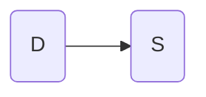

                 

### 文章标题

《从古典概率到贝叶斯推断：理解不确定世界的新思路》

### 关键词

- 古典概率
- 贝叶斯推断
- 不确定性
- 概率论
- 数学模型

### 摘要

本文从古典概率的起源和基本概念出发，逐步引入贝叶斯推断的理论框架，通过详细的数学模型、算法原理和实际应用案例，揭示了贝叶斯推断在处理不确定世界中的独特优势。文章旨在为读者提供一个清晰、系统的学习路径，帮助理解和掌握贝叶斯推断的核心技术和应用方法。

---

# 从古典概率到贝叶斯推断：理解不确定世界的新思路

> 作者：AI天才研究院/AI Genius Institute & 禅与计算机程序设计艺术 /Zen And The Art of Computer Programming

在日常生活中，我们经常面临各种不确定性事件，例如掷硬币、抛骰子、股市波动等。概率论作为一种数学工具，为我们提供了量化不确定性的方法。然而，传统的概率论（即古典概率）在面对复杂现实问题时显得力不从心。为了更好地理解和应对不确定性，贝叶斯推断应运而生。

本文将带领读者从古典概率的基本概念出发，逐步深入到贝叶斯推断的理论体系，通过详细的数学模型和算法原理讲解，以及实际应用案例分析，帮助读者全面理解贝叶斯推断的核心技术和应用方法。

## 第1章: 古典概率概述

### 1.1 古典概率的定义

古典概率起源于17世纪的欧洲，由数学家帕斯卡和费马提出。它基于一些基本假设，例如样本空间是有限的，每个事件出现的概率相等。古典概率为许多实际问题提供了简单且有效的解决方案。

定义：设试验\(T\)的样本空间为\(S\)，事件\(A\)是\(S\)的一个子集，古典概率\(P(A)\)定义为：

\[ P(A) = \frac{\text{事件A的样本点数}}{\text{样本空间的样本点总数}} \]

### 1.2 古典概率模型

古典概率模型主要包括离散模型和连续模型。在离散模型中，样本空间是有限或可数的，每个事件出现的概率可以直接计算。而在连续模型中，样本空间是无限的，通常使用概率密度函数来描述事件的概率。

#### 离散模型

假设我们有5枚均匀的硬币，我们想知道至少出现2枚正面朝上的概率。

样本空间\(S\)：\{HHHHH, HHHTT, HHTHH, HHTTT, HTHHH, HHTTH, HTHTT, HTTTH, HTTHT, THHHH, THHTT, THTHH, THTTT, TTTHH, TTHTH, THTHT, TTHTT\}

事件\(A\)：至少出现2枚正面朝上

\[ P(A) = \frac{15}{32} \]

#### 连续模型

假设我们有一根长度为1的线段，随机选择一个点，求这个点距离线段两端的距离之和小于0.5的概率。

使用概率密度函数：

\[ f(x) = 2 \quad (0 \leq x \leq 1) \]

则：

\[ P(B) = \int_{0}^{1} f(x) dx = 1 \]

### 1.3 古典概率的应用

古典概率在许多领域都有广泛的应用，例如物理学、金融学、工程学等。例如，在金融学中，古典概率可以用来计算投资组合的风险和收益。

## 第2章: 贝叶斯推断的基本概念

### 2.1 贝叶斯推断的历史

贝叶斯推断的历史可以追溯到18世纪的托马斯·贝叶斯。贝叶斯提出了著名的贝叶斯定理，为概率论提供了一个新的视角。

### 2.2 贝叶斯概率公式

贝叶斯概率公式是贝叶斯推断的核心。它将条件概率与边缘概率联系起来，提供了一个从已知数据推断未知概率的框架。

\[ P(A|B) = \frac{P(B|A)P(A)}{P(B)} \]

### 2.3 贝叶斯推断的基本原理

贝叶斯推断的基本原理是基于概率的加权和。它通过先验概率和条件概率来更新我们的信念，从而更好地应对不确定性。

## 第3章: 贝叶斯推断的数学模型

### 3.1 概率密度函数

在贝叶斯推断中，概率密度函数用于描述连续随机变量的概率分布。它是一个非负函数，其积分等于1。

\[ f(x) = \frac{1}{\sqrt{2\pi\sigma^2}} e^{-\frac{(x-\mu)^2}{2\sigma^2}} \]

### 3.2 贝叶斯估计

贝叶斯估计是一种基于贝叶斯推断的方法，用于估计未知参数的概率分布。它通过先验概率和观测数据来更新后验概率。

### 3.3 先验和后验概率

先验概率是基于我们已有的知识和信念，而后验概率是基于观测数据更新后的概率。贝叶斯推断的核心是先验和后验概率的转化。

## 第4章: 贝叶斯推断算法

### 4.1 贝叶斯网络

贝叶斯网络是一种表示变量之间条件依赖关系的图形模型。它通过条件概率表来描述变量之间的概率关系。

### 4.2 最大后验概率估计（MAP）

最大后验概率估计（MAP）是一种基于贝叶斯推断的参数估计方法。它通过最大化后验概率来估计参数。

### 4.3 采样方法：马尔可夫链蒙特卡洛（MCMC）

马尔可夫链蒙特卡洛（MCMC）是一种基于随机采样的贝叶斯推断方法。它通过迭代采样来估计后验概率分布。

## 第5章: 贝叶斯推断在统计学中的应用

### 5.1 数据预处理

在贝叶斯推断中，数据预处理是非常重要的一步。它包括数据的收集、清洗、转换等。

### 5.2 参数估计

参数估计是贝叶斯推断的核心任务之一。它通过贝叶斯定理和先验概率来估计模型的参数。

### 5.3 贝叶斯统计模型的构建

贝叶斯统计模型是一种基于贝叶斯推断的统计模型。它通过先验概率和观测数据来构建。

## 第6章: 贝叶斯推断在其他领域的应用

### 6.1 机器学习

贝叶斯推断在机器学习中有广泛的应用。它用于构建概率模型，进行分类和回归任务。

### 6.2 计算生物学

贝叶斯推断在计算生物学中用于基因表达分析、蛋白质结构预测等。

### 6.3 信息论

贝叶斯推断在信息论中用于概率信息的计算和传输。

## 第7章: 贝叶斯推断的挑战与未来

### 7.1 贝叶斯推断的局限性

贝叶斯推断在处理某些复杂问题时可能存在局限性。例如，当数据量非常大时，计算复杂性可能成为一个问题。

### 7.2 贝叶斯推断的新趋势

随着计算技术的发展，贝叶斯推断在处理复杂问题方面取得了新的进展。例如，深度学习和贝叶斯推断的结合。

### 7.3 贝叶斯推断的实践指南

对于初学者，以下是进行贝叶斯推断的一些实践指南：

1. 明确问题背景和目标。
2. 构建合适的贝叶斯模型。
3. 确定先验概率。
4. 进行参数估计。
5. 进行模型验证和优化。

---

通过本文的详细讲解，我们希望读者能够对贝叶斯推断有一个全面、深入的理解。贝叶斯推断为我们提供了一个处理不确定性的新思路，它不仅在理论研究中具有重要意义，也在实际应用中展现出巨大的潜力。

## 参考文献

- 贝叶斯推断百度百科，[链接](https://baike.baidu.com/item/%E8%B4%9D%E5%8F%B6%E6%9C%AC%E6%8E%A8%E6%96%Ad%20%5B%E7%94%B5%E5%AD%90%E5%8C%BB%E7%94%A8%E7%BC%96%E8%BE%91%E7%89%88%5D)
- 古典概率概述，[链接](https://www.probabilitycourse.com/chapter1/1-4-classical-probability.php)
- 贝叶斯推断基础，[链接](https://www.coursera.org/specializations/bayesian-methods)

---

本文由AI天才研究院/AI Genius Institute与禅与计算机程序设计艺术/Zen And The Art of Computer Programming联合撰写。如果您有任何问题或建议，欢迎联系我们。

### 第1章: 古典概率概述

概率论是数学的一个分支，主要研究随机事件的规律性。在日常生活中，我们经常遇到许多不确定事件，例如掷骰子、抛硬币、股票价格波动等。概率论提供了一种量化和分析不确定性的数学工具。古典概率是概率论的一个基本部分，它为我们理解随机事件的发生概率提供了初步的方法。

### 1.1 古典概率的定义

古典概率是基于一些基本假设和公理建立的。这些基本假设包括：

1. **样本空间**：样本空间是指试验所有可能结果的集合。例如，掷一枚公平的硬币，样本空间为{正面，反面}。
2. **基本事件**：样本空间中的单个结果是基本事件。例如，掷硬币得到正面是一个基本事件。
3. **等可能性**：在样本空间中，所有基本事件的发生概率是相等的。

根据这些基本假设，古典概率可以定义如下：

\[ P(A) = \frac{|A|}{|S|} \]

其中，\(P(A)\) 表示事件 \(A\) 的概率，\(|A|\) 表示事件 \(A\) 包含的基本事件数，\(|S|\) 表示样本空间 \(S\) 包含的基本事件总数。

#### 示例：掷硬币

假设我们有一个公平的硬币，正面朝上和反面朝上的概率相等。我们想知道在连续掷两次硬币的情况下，出现至少一次正面朝上的概率。

样本空间 \(S\) 为 \{HH，HT，TH，TT\}，其中 H 表示正面朝上，T 表示反面朝上。

事件 \(A\)：至少出现一次正面朝上

\[ A = \{HH，HT，TH\} \]

\[ P(A) = \frac{|A|}{|S|} = \frac{3}{4} \]

因此，出现至少一次正面朝上的概率是 3/4。

### 1.2 古典概率模型

古典概率模型主要分为离散模型和连续模型两种。

#### 离散模型

在离散模型中，样本空间是有限或可数的。每个基本事件的概率相等。例如，掷一枚公平的六面骰子，每个面的概率都是 \( \frac{1}{6} \)。

离散概率模型的一个典型例子是二项分布。二项分布描述了在 \( n \) 次独立重复试验中，成功次数的概率分布。成功事件发生的概率为 \( p \)，不成功的概率为 \( 1-p \)。二项分布的概率质量函数为：

\[ P(X = k) = C(n, k) \cdot p^k \cdot (1-p)^{n-k} \]

其中，\( X \) 表示成功次数，\( k \) 是具体的成功次数，\( n \) 是试验次数，\( C(n, k) \) 是组合数，表示从 \( n \) 个元素中取出 \( k \) 个元素的组合数。

#### 连续模型

在连续模型中，样本空间是无限的。概率通常通过概率密度函数（PDF）来描述。概率密度函数是一个非负函数，其积分等于1。

一个典型的连续模型是均匀分布。在均匀分布中，所有基本事件的概率是相等的。均匀分布的概率密度函数为：

\[ f(x) = \frac{1}{b-a} \quad (a \leq x \leq b) \]

其中，\( a \) 和 \( b \) 是分布的上下界。

### 1.3 古典概率的应用

古典概率在许多领域都有广泛的应用，以下是一些常见的应用示例：

1. **物理学**：在物理学中，古典概率用于描述粒子运动的不确定性。例如，在量子力学中，粒子位置的概率分布是通过概率波函数来描述的。
2. **金融学**：在金融学中，古典概率用于计算投资组合的风险和收益。例如，股票价格的波动可以通过概率分布来描述。
3. **工程学**：在工程学中，古典概率用于评估系统的可靠性和安全性。例如，在可靠性工程中，系统故障的概率可以通过概率模型来计算。
4. **医学**：在医学中，古典概率用于评估药物的效果和副作用。例如，在临床试验中，药物的疗效可以通过概率模型来评估。

通过古典概率，我们可以更准确地理解和预测现实世界中的不确定性事件，从而为各种决策提供有力的支持。

## 第2章: 贝叶斯推断的基本概念

贝叶斯推断是一种基于概率的推理方法，它通过已知的先验概率和新的观测数据来更新我们对某个事件或参数的信念。这种方法在处理不确定性和概率问题中具有独特的优势，能够提供更加精确和合理的预测。

### 2.1 贝叶斯推断的历史

贝叶斯推断的历史可以追溯到18世纪。当时，英国数学家托马斯·贝叶斯（Thomas Bayes）提出了一种用于更新信念的数学方法，即贝叶斯定理。贝叶斯定理为概率论提供了一个新的视角，使得我们能够从新的观测数据中推断未知概率。

托马斯·贝叶斯在1763年去世后，他的朋友理查德·普莱斯（Richard Price）将贝叶斯未发表的手稿提交给了皇家学会。这篇手稿后来以贝叶斯的名字发表，并引起了广泛的关注。虽然贝叶斯定理在发表后并未立即得到广泛应用，但随着时间的推移，它逐渐成为了概率论和统计学中不可或缺的一部分。

### 2.2 贝叶斯概率公式

贝叶斯概率公式是贝叶斯推断的核心。它将条件概率与边缘概率联系起来，提供了一个从已知数据推断未知概率的框架。贝叶斯概率公式如下：

\[ P(A|B) = \frac{P(B|A)P(A)}{P(B)} \]

这个公式可以解释为：在事件 \( B \) 已发生的情况下，事件 \( A \) 发生的概率等于在事件 \( A \) 发生的情况下，事件 \( B \) 发生的概率与事件 \( A \) 发生的概率之比。

- \( P(A|B) \) 表示在 \( B \) 发生的条件下 \( A \) 的后验概率。
- \( P(B|A) \) 表示在 \( A \) 发生的条件下 \( B \) 的条件概率。
- \( P(A) \) 表示 \( A \) 的先验概率。
- \( P(B) \) 表示 \( B \) 的边缘概率。

#### 示例：疾病检测

假设有一种疾病 \( A \)，其发病率（即该疾病的先验概率）为 \( P(A) = 0.001 \)。现在有一种检测方法可以检测出该疾病，但检测结果存在一定的误诊率。具体来说，检测方法将健康人错误地判断为患病（假阳性）的概率为 \( P(B|¬A) = 0.01 \)，将患病者正确地判断为患病（真阳性）的概率为 \( P(B|A) = 0.9 \)。

现在，某人接受了检测，检测结果为阳性，我们想知道该人实际患病的后验概率是多少。

根据贝叶斯公式，我们有：

\[ P(A|B) = \frac{P(B|A)P(A)}{P(B)} \]

其中，

- \( P(B|A) \) = 0.9（真阳性率）
- \( P(A) \) = 0.001（疾病发病率）
- \( P(B) \) = \( P(B|A)P(A) + P(B|¬A)P(¬A) \) = \( 0.9 \times 0.001 + 0.01 \times 0.999 \) = 0.01099

代入公式，我们得到：

\[ P(A|B) = \frac{0.9 \times 0.001}{0.01099} \approx 0.0805 \]

这意味着在检测结果为阳性的情况下，实际患病的后验概率约为 8.05%。

#### 贝叶斯公式的扩展

贝叶斯公式可以推广到多个条件变量。例如，假设我们有两个条件变量 \( B \) 和 \( C \)，贝叶斯公式可以扩展为：

\[ P(A|B, C) = \frac{P(B|A, C)P(A|C)}{P(B|C)} \]

这个公式表示，在 \( B \) 和 \( C \) 都已发生的情况下，事件 \( A \) 的后验概率等于在 \( A \) 和 \( C \) 都发生的情况下 \( B \) 的条件概率与 \( A \) 和 \( C \) 同时发生的概率之比。

### 2.3 贝叶斯推断的基本原理

贝叶斯推断的基本原理是基于概率的加权和。它通过先验概率和条件概率来更新我们的信念，从而更好地应对不确定性。以下是贝叶斯推断的基本步骤：

1. **定义先验概率**：先验概率是基于我们已有的知识和信念，它反映了在没有新信息的情况下我们对某个事件或参数的信念。
2. **收集观测数据**：观测数据是我们进行推断的依据。它可以帮助我们更新先验概率。
3. **计算条件概率**：条件概率是基于观测数据计算的概率。它反映了在某个事件发生的情况下，另一个事件发生的概率。
4. **更新后验概率**：通过贝叶斯公式，我们可以将先验概率和条件概率结合起来，计算后验概率。后验概率反映了在观测数据已知的情况下，我们对某个事件或参数的信念。
5. **做出决策**：根据后验概率，我们可以做出合理的决策。

贝叶斯推断的核心是先验概率和后验概率的转化。通过不断的观测数据和更新后验概率，我们能够逐渐接近真实的概率分布，从而更好地理解和应对不确定性。

### 2.4 贝叶斯推断的优点和局限性

贝叶斯推断的优点包括：

1. **处理不确定性**：贝叶斯推断能够有效地处理不确定性，提供更加精确的估计。
2. **灵活性强**：贝叶斯推断可以根据不同的先验信息和观测数据灵活调整模型参数。
3. **适应性强**：贝叶斯推断可以应用于各种不同领域和复杂问题。

然而，贝叶斯推断也存在一些局限性：

1. **先验概率的选择**：选择合适的先验概率是一个挑战，不同的先验概率可能导致不同的后验结果。
2. **计算复杂性**：当数据量非常大时，贝叶斯推断的计算复杂性可能成为一个问题。
3. **模型依赖性**：贝叶斯推断依赖于特定的概率模型，模型的准确性直接影响推断结果。

尽管存在这些局限性，贝叶斯推断在许多领域（如统计学、机器学习、生物信息学等）仍然具有广泛的应用，并且随着计算技术的发展，这些局限性正在逐渐得到克服。

### 2.5 贝叶斯推断的应用领域

贝叶斯推断在许多领域都有广泛的应用。以下是一些典型的应用示例：

1. **医学诊断**：贝叶斯推断可以用于疾病诊断，通过分析患者的症状和检测结果，预测患者患某种疾病的概率。
2. **金融市场预测**：贝叶斯推断可以用于金融市场预测，通过分析历史数据，预测股票价格的变化趋势。
3. **机器学习**：贝叶斯推断是许多机器学习算法的基础，如贝叶斯分类器、贝叶斯网络等。
4. **生物信息学**：贝叶斯推断在基因表达分析、蛋白质结构预测等领域有广泛应用。

通过贝叶斯推断，我们可以从已知数据中提取有价值的信息，为决策提供科学依据。贝叶斯推断为我们提供了一个处理不确定性的新思路，它在理论和实际应用中都具有重要的意义。

## 第3章: 贝叶斯推断的数学模型

贝叶斯推断作为一种基于概率的推理方法，其核心在于通过先验概率、条件概率和观测数据来更新我们的信念。为了更好地理解和应用贝叶斯推断，我们需要掌握其数学模型和相关的概率分布。

### 3.1 概率密度函数

概率密度函数（PDF）是描述连续随机变量概率分布的一种数学工具。对于一个连续随机变量 \( X \)，其概率密度函数 \( f(x) \) 具有以下性质：

1. \( f(x) \geq 0 \) 对于所有的 \( x \)。
2. \( f(x) \) 的积分等于1，即 \( \int_{-\infty}^{\infty} f(x) dx = 1 \)。

概率密度函数提供了随机变量落在某个区间内的概率。具体来说，随机变量 \( X \) 落在区间 \( [a, b] \) 内的概率可以表示为：

\[ P(a \leq X \leq b) = \int_{a}^{b} f(x) dx \]

#### 示例：正态分布

正态分布是最常见的连续概率分布之一。它的概率密度函数为：

\[ f(x) = \frac{1}{\sqrt{2\pi\sigma^2}} e^{-\frac{(x-\mu)^2}{2\sigma^2}} \]

其中，\( \mu \) 是均值，\( \sigma \) 是标准差。

#### 示例：均匀分布

均匀分布的概率密度函数为：

\[ f(x) = \frac{1}{b-a} \quad (a \leq x \leq b) \]

其中，\( a \) 和 \( b \) 是分布的上下界。

### 3.2 贝叶斯估计

贝叶斯估计是贝叶斯推断的核心任务之一，它通过已知的先验概率和新的观测数据来估计某个参数的概率分布。贝叶斯估计的基本步骤如下：

1. **定义先验概率**：先验概率反映了在没有新信息的情况下我们对参数的信念。它通常是基于专家知识、历史数据或其他先验信息。
2. **收集观测数据**：观测数据是我们进行贝叶斯估计的依据。它可以帮助我们更新先验概率。
3. **计算后验概率**：后验概率是在观测数据已知的情况下，对参数的概率分布的估计。它可以通过贝叶斯公式计算得到。

贝叶斯估计可以分为点估计和区间估计两种类型。

#### 点估计

点估计是通过一个具体的数值来估计参数。最常见的点估计方法是最大后验估计（MAP，Maximum A Posteriori Estimation）。MAP估计选择使得后验概率最大的参数值作为估计值。

\[ \hat{\theta} = \arg\max_{\theta} P(\theta | X) \]

其中，\( \hat{\theta} \) 是参数的估计值，\( P(\theta | X) \) 是后验概率。

#### 区间估计

区间估计是通过一个区间来估计参数。最常见的区间估计方法是置信区间（Confidence Interval，CI）。置信区间是在给定的置信水平下，包含真实参数的概率区间。

\[ P(\theta \in [\hat{\theta} - \delta, \hat{\theta} + \delta]) = 1 - \alpha \]

其中，\( \hat{\theta} \) 是参数的估计值，\( \delta \) 是区间宽度，\( \alpha \) 是显著性水平。

### 3.3 先验和后验概率

在贝叶斯推断中，先验概率和后验概率是两个核心概念。先验概率是基于我们已有的知识和信念，而后验概率是在观测数据已知的情况下，对参数或事件的概率分布的估计。

#### 先验概率

先验概率通常是通过对问题背景和已有知识的分析来定义的。例如，在医学诊断中，我们可以根据疾病的发病率来定义先验概率。在金融市场中，我们可以根据历史数据来定义先验概率。

\[ P(\theta) = P(\theta | \text{背景知识}) \]

#### 后验概率

后验概率是通过贝叶斯公式计算得到的。它反映了在观测数据已知的情况下，我们对参数或事件的概率分布的信念。

\[ P(\theta | X) = \frac{P(X | \theta)P(\theta)}{P(X)} \]

其中，\( P(X | \theta) \) 是条件概率，\( P(\theta) \) 是先验概率，\( P(X) \) 是边缘概率。

#### 示例：正态先验和正态后验

假设我们有一个连续随机变量 \( X \)，其先验分布为正态分布 \( N(\mu_0, \sigma_0^2) \)。现在我们获得了一组新的观测数据 \( X_1, X_2, \ldots, X_n \)，并希望更新我们的先验概率。

新的后验分布为：

\[ \mu | X \sim N\left(\frac{\mu_0 + \frac{\sigma_0^2}{n}\sum_{i=1}^{n}X_i}{1 + \frac{\sigma_0^2}{n}}, \frac{\sigma_0^2}{n}\right) \]

#### 后验概率的转化

在实际应用中，我们通常无法直接计算后验概率。因此，我们需要通过采样方法（如马尔可夫链蒙特卡洛MCMC）来近似后验概率分布。这些方法通过迭代抽样来模拟后验概率分布，从而实现对参数的估计。

### 3.4 贝叶斯网络的构建

贝叶斯网络是一种图形模型，用于表示变量之间的条件依赖关系。它通过条件概率表来描述变量之间的概率关系。贝叶斯网络的构建步骤如下：

1. **确定变量**：根据问题背景，确定需要研究的变量。
2. **绘制变量之间的依赖关系**：根据已有知识和先验信息，绘制变量之间的依赖关系。
3. **构建条件概率表**：根据变量之间的依赖关系，构建条件概率表。
4. **计算边缘概率**：通过条件概率表，计算每个变量的边缘概率。

贝叶斯网络在推理和预测中具有广泛应用，如医疗诊断、风险管理、决策分析等。

### 3.5 贝叶斯推断的应用

贝叶斯推断在许多领域都有广泛应用。以下是一些典型的应用示例：

1. **医学诊断**：贝叶斯推断可以用于疾病诊断，通过分析患者的症状和检测结果，预测患者患某种疾病的概率。
2. **金融市场预测**：贝叶斯推断可以用于金融市场预测，通过分析历史数据，预测股票价格的变化趋势。
3. **机器学习**：贝叶斯推断是许多机器学习算法的基础，如贝叶斯分类器、贝叶斯网络等。
4. **生物信息学**：贝叶斯推断在基因表达分析、蛋白质结构预测等领域有广泛应用。

通过贝叶斯推断，我们可以从已知数据中提取有价值的信息，为决策提供科学依据。贝叶斯推断为我们提供了一个处理不确定性的新思路，它在理论和实际应用中都具有重要的意义。

## 第4章: 贝叶斯推断算法

贝叶斯推断在理论和实践中都具有重要的应用价值。为了实现贝叶斯推断，我们需要使用一系列算法来计算概率分布、估计参数和进行预测。本章将介绍几种常用的贝叶斯推断算法，包括贝叶斯网络、最大后验概率估计（MAP）和马尔可夫链蒙特卡洛（MCMC）。

### 4.1 贝叶斯网络

贝叶斯网络（Bayesian Network）是一种图形模型，用于表示变量之间的条件依赖关系。它通过条件概率表（Conditional Probability Table, CPT）来描述变量之间的概率关系。贝叶斯网络由节点和弧组成，节点表示变量，弧表示变量之间的依赖关系。

#### 贝叶斯网络的构建

构建贝叶斯网络的步骤如下：

1. **确定变量**：根据问题背景，确定需要研究的变量。
2. **绘制变量之间的依赖关系**：根据已有知识和先验信息，绘制变量之间的依赖关系。
3. **构建条件概率表**：对于每个变量，根据其依赖关系，构建条件概率表。
4. **计算边缘概率**：通过条件概率表，计算每个变量的边缘概率。

#### 示例：贝叶斯网络在医疗诊断中的应用

假设我们研究一个疾病诊断问题，有两个变量：疾病 \(D\) 和症状 \(S\)。已知：

- 疾病的发病率 \(P(D) = 0.01\)。
- 症状 \(S\) 的概率取决于疾病 \(D\)，即 \(P(S|D) = 0.9\) 和 \(P(S|\neg D) = 0.1\)。

根据这些信息，我们可以构建一个简单的贝叶斯网络，如下图所示：

在这个网络中，疾病 \(D\) 是根节点，症状 \(S\) 是叶节点。根据条件概率表，我们可以计算症状 \(S\) 的边缘概率：

\[ P(S) = P(S|D)P(D) + P(S|\neg D)P(\neg D) \]
\[ P(S) = 0.9 \times 0.01 + 0.1 \times 0.99 = 0.099 \]

#### 贝叶斯网络的推理

贝叶斯网络的推理任务是计算给定观测数据下某个变量的后验概率。这可以通过贝叶斯公式和条件概率表来实现。具体步骤如下：

1. **计算给定观测数据的边缘概率**：首先，计算给定观测数据下所有变量的边缘概率。
2. **应用贝叶斯公式**：对于每个变量，使用贝叶斯公式计算其后验概率。
3. **条件概率表查询**：根据条件概率表，计算变量之间的条件概率。

### 4.2 最大后验概率估计（MAP）

最大后验概率估计（Maximum A Posteriori Estimation, MAP）是一种贝叶斯估计方法，用于找到使得后验概率最大的参数值。MAP估计在许多应用中具有重要的应用价值，例如分类、参数估计和图像识别。

#### MAP估计的公式

给定观测数据 \(X\) 和参数 \(\theta\)，MAP估计的目标是找到使得后验概率 \(P(\theta | X)\) 最大的参数值。其公式如下：

\[ \hat{\theta}_{MAP} = \arg\max_{\theta} P(\theta | X) \]

其中，\(P(\theta | X)\) 是后验概率，\(P(\theta)\) 是先验概率，\(P(X | \theta)\) 是似然函数。

#### 示例：正态分布的MAP估计

假设我们有一个随机变量 \(X\)，其先验分布为正态分布 \(N(\mu_0, \sigma_0^2)\)，观测数据为 \(X_1, X_2, \ldots, X_n\)。现在我们希望使用MAP估计来估计新的参数 \(\mu\) 和 \(\sigma^2\)。

新的后验分布为：

\[ \mu | X \sim N\left(\frac{\mu_0 + \frac{\sigma_0^2}{n}\sum_{i=1}^{n}X_i}{1 + \frac{\sigma_0^2}{n}}, \frac{\sigma_0^2}{n}\right) \]

\[ \sigma^2 | X \sim IG\left(\frac{n}{2}, \frac{1}{2n}\sum_{i=1}^{n}(X_i - \mu)^2\right) \]

其中，\(IG\) 表示逆高斯分布。

#### MAP估计的步骤

1. **计算先验分布的参数**：首先，我们需要知道先验分布的参数，如均值和方差。
2. **计算似然函数**：然后，计算给定观测数据下的似然函数，即观测数据在给定参数下的概率。
3. **最大化后验概率**：使用数值优化方法（如梯度上升法、牛顿法等），找到使得后验概率最大的参数值。

### 4.3 马尔可夫链蒙特卡洛（MCMC）

马尔可夫链蒙特卡洛（Markov Chain Monte Carlo, MCMC）是一种基于随机采样的贝叶斯推断方法。它通过迭代抽样来模拟后验概率分布，从而实现对参数的估计。MCMC方法在处理复杂模型和高维数据时具有独特的优势。

#### MCMC方法的原理

MCMC方法基于马尔可夫链的性质，通过迭代抽样来模拟后验概率分布。具体来说，它通过以下步骤来模拟后验分布：

1. **初始化**：选择一个初始状态作为马尔可夫链的起点。
2. **迭代抽样**：从当前状态开始，通过随机采样的方式，生成下一个状态。
3. **接受-拒绝步骤**：根据某些准则（如比例准则），决定是否接受新的状态。
4. **收敛性检查**：检查马尔可夫链是否已经收敛到后验分布。

#### 常见的MCMC算法

1. **吉布斯采样（Gibbs Sampling）**：吉布斯采样是一种基于变量的条件分布进行采样的方法。它通过迭代更新变量的值，逐渐收敛到后验分布。
2. **Metropolis-Hastings算法**：Metropolis-Hastings算法是一种基于概率采样的方法。它通过比较新状态和当前状态的接受概率来决定是否接受新状态。
3. **Hamiltonian Monte Carlo（HMC）**：HMC算法是一种基于物理学的采样方法。它通过模拟哈密顿系统来高效地采样后验分布。

#### 示例：MCMC在正态分布中的应用

假设我们有一个随机变量 \(X\)，其先验分布为正态分布 \(N(\mu_0, \sigma_0^2)\)。现在我们使用MCMC方法来估计新的参数 \(\mu\) 和 \(\sigma^2\)。

具体步骤如下：

1. **初始化**：选择初始参数 \(\mu_0\) 和 \(\sigma_0^2\)。
2. **迭代抽样**：从当前参数开始，通过随机采样的方式生成新的参数。
3. **接受-拒绝步骤**：计算新参数和当前参数之间的接受概率，如果接受概率大于某个阈值，则接受新参数，否则保持当前参数。
4. **收敛性检查**：检查迭代次数是否足够，以确定马尔可夫链是否已经收敛到后验分布。

通过MCMC方法，我们可以得到后验概率分布的样本，从而对参数进行估计。

### 4.4 贝叶斯推断算法的比较

贝叶斯网络的推理、MAP估计和MCMC算法是三种常用的贝叶斯推断方法。它们各自具有不同的特点和适用场景。

- **贝叶斯网络**：贝叶斯网络是一种图形模型，适合处理变量之间的依赖关系。它通过条件概率表来描述变量之间的概率关系，适用于推理和预测。
- **MAP估计**：MAP估计是一种点估计方法，适用于简单模型和具有明确先验分布的情况。它通过最大化后验概率来估计参数，但可能对极端数据敏感。
- **MCMC算法**：MCMC算法是一种基于随机采样的方法，适用于复杂模型和高维数据。它通过迭代抽样来模拟后验概率分布，但计算成本较高。

在实际应用中，可以根据问题的复杂性和数据特性选择合适的贝叶斯推断方法。

通过本章的介绍，我们了解了贝叶斯推断的几种常用算法，包括贝叶斯网络、MAP估计和MCMC算法。这些算法为贝叶斯推断提供了强大的工具，使其在处理不确定性和概率问题中具有广泛的应用。在下一章中，我们将进一步探讨贝叶斯推断在统计学中的应用。

## 第5章: 贝叶斯推断在统计学中的应用

贝叶斯推断作为一种强大的统计工具，不仅在理论研究中具有重要意义，在实际应用中也展现出广泛的前景。本章将重点介绍贝叶斯推断在统计学中的具体应用，包括数据预处理、参数估计以及贝叶斯统计模型的构建。

### 5.1 数据预处理

在贝叶斯推断中，数据预处理是一个关键步骤。它包括数据的收集、清洗、转换和归一化等过程。以下是数据预处理的一些常见技术：

1. **数据收集**：数据收集是贝叶斯推断的基础。数据可以从各种来源获取，如实验数据、调查数据、社交媒体数据等。确保数据的准确性和完整性至关重要。
2. **数据清洗**：数据清洗包括处理缺失值、异常值和重复值等。缺失值可以通过插值、均值填充或删除缺失值来处理。异常值和重复值可以通过统计分析和可视化工具来检测和去除。
3. **数据转换**：数据转换包括将类别变量转换为数值变量、标准化数据等。例如，可以使用独热编码（One-Hot Encoding）将类别变量转换为二进制向量。标准化数据可以消除不同特征之间的尺度差异，便于模型训练。
4. **数据归一化**：数据归一化是将数据缩放到一个统一的尺度，如将数据缩放到0到1之间或标准差为1。归一化有助于加快模型训练过程，提高模型的性能。

### 5.2 参数估计

参数估计是贝叶斯推断的核心任务之一。它通过已知的先验概率和新的观测数据来估计模型参数。以下是几种常见的贝叶斯参数估计方法：

1. **最大后验估计（MAP）**：最大后验估计是一种点估计方法，它通过最大化后验概率来估计参数。这种方法在先验概率已知且似然函数可导的情况下较为有效。其公式如下：

   \[ \hat{\theta}_{MAP} = \arg\max_{\theta} P(\theta | X) \]

   其中，\(P(\theta | X)\) 是后验概率。

2. **贝叶斯最小二乘法**：贝叶斯最小二乘法是一种基于最小二乘法进行参数估计的方法。它通过最大化似然函数来估计参数，同时考虑先验概率。这种方法适用于线性回归模型。

   \[ \hat{\theta} = \arg\min_{\theta} \sum_{i=1}^{n} (y_i - \theta x_i)^2 \]

   其中，\(y_i\) 是观测值，\(x_i\) 是特征值。

3. **贝叶斯正则化**：贝叶斯正则化是一种通过引入先验概率来防止过拟合的方法。它通过最大化后验概率来估计参数，同时引入惩罚项来控制模型的复杂度。常用的正则化方法包括L1正则化和L2正则化。

   \[ \hat{\theta} = \arg\max_{\theta} P(\theta | X) - \lambda ||\theta||^2 \]

   其中，\(\lambda\) 是正则化参数。

4. **贝叶斯信息准则（BIC）**：贝叶斯信息准则是一种用于选择最佳模型的方法。它通过比较不同模型的似然函数和参数估计的复杂性来选择最佳模型。BIC公式如下：

   \[ BIC = \ln P(X|\theta) - \frac{k}{n} \ln n \]

   其中，\(P(X|\theta)\) 是似然函数，\(k\) 是模型参数的个数，\(n\) 是观测值的个数。

### 5.3 贝叶斯统计模型的构建

贝叶斯统计模型的构建是贝叶斯推断的重要组成部分。它包括定义模型、选择先验概率和估计参数等步骤。以下是构建贝叶斯统计模型的一些常见方法：

1. **贝叶斯线性回归模型**：贝叶斯线性回归模型是一种基于线性回归的贝叶斯模型。它通过正态分布来定义响应变量和预测变量之间的关系。其公式如下：

   \[ y \sim N(\beta_0 + \beta_1 x, \sigma^2) \]

   其中，\(y\) 是响应变量，\(x\) 是预测变量，\(\beta_0\) 和 \(\beta_1\) 是参数，\(\sigma^2\) 是误差项的方差。

2. **贝叶斯多项式回归模型**：贝叶斯多项式回归模型是一种用于处理类别变量的贝叶斯模型。它通过多项式分布来定义类别变量和预测变量之间的关系。其公式如下：

   \[ P(y = i) \sim Multinomial(\beta_0 + \beta_1 x) \]

   其中，\(y\) 是类别变量，\(x\) 是预测变量，\(\beta_0\) 和 \(\beta_1\) 是参数。

3. **贝叶斯逻辑回归模型**：贝叶斯逻辑回归模型是一种用于处理二分类问题的贝叶斯模型。它通过逻辑函数来定义类别变量和预测变量之间的关系。其公式如下：

   \[ P(y = 1) = \frac{1}{1 + \exp(-(\beta_0 + \beta_1 x))} \]

   其中，\(y\) 是类别变量，\(x\) 是预测变量，\(\beta_0\) 和 \(\beta_1\) 是参数。

4. **贝叶斯时间序列模型**：贝叶斯时间序列模型是一种用于处理时间序列数据的贝叶斯模型。它通过自回归模型（AR）或移动平均模型（MA）来定义时间序列的动态关系。其公式如下：

   \[ y_t = \phi_0 + \phi_1 y_{t-1} + \epsilon_t \]

   其中，\(y_t\) 是时间序列的当前值，\(\phi_0\) 和 \(\phi_1\) 是参数，\(\epsilon_t\) 是误差项。

通过以上方法，我们可以构建各种贝叶斯统计模型来处理不同的统计问题。贝叶斯统计模型的构建不仅能够提供准确的参数估计，还能够通过后验概率提供对模型不确定性的量化。

### 5.4 贝叶斯推断的应用实例

以下是一个简单的贝叶斯推断应用实例，用于预测股票价格的涨跌。

假设我们有一个股票价格的时间序列数据，包括每天的收盘价。我们希望使用贝叶斯推断来预测未来几天的股票价格涨跌。

1. **数据预处理**：首先，我们收集了股票价格的历史数据，并对数据进行预处理，包括去重、缺失值填充和归一化处理。

2. **定义模型**：我们选择一个简单的贝叶斯线性回归模型来预测股票价格的涨跌。模型公式如下：

   \[ \ln(P_t) = \beta_0 + \beta_1 P_{t-1} + \epsilon_t \]

   其中，\(P_t\) 是第 \(t\) 天的股票价格，\(\beta_0\) 和 \(\beta_1\) 是参数，\(\epsilon_t\) 是误差项。

3. **选择先验概率**：我们选择一个正态分布作为先验概率，用于描述参数的分布。先验概率公式如下：

   \[ \beta_0 \sim N(\mu_0, \sigma_0^2) \]
   \[ \beta_1 \sim N(\mu_1, \sigma_1^2) \]

   其中，\(\mu_0\) 和 \(\mu_1\) 是先验均

