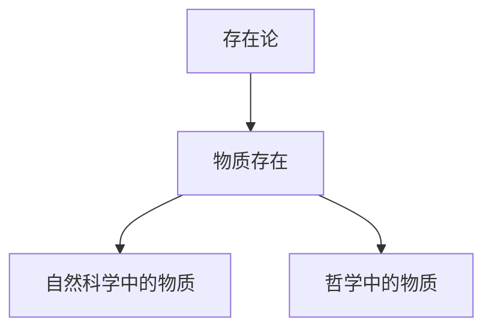
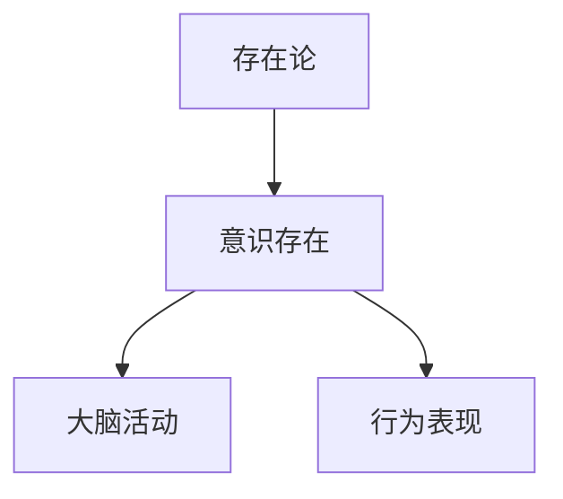
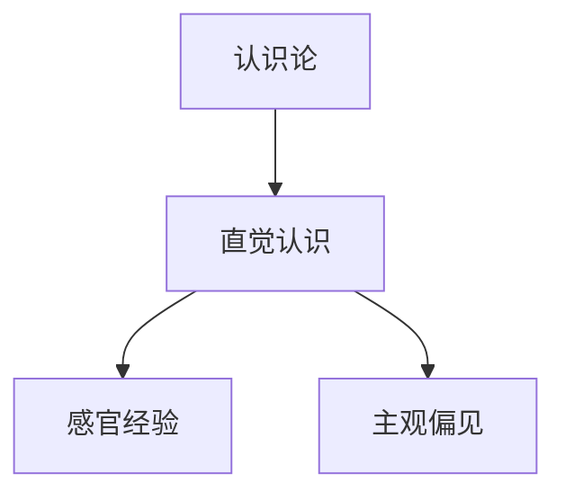
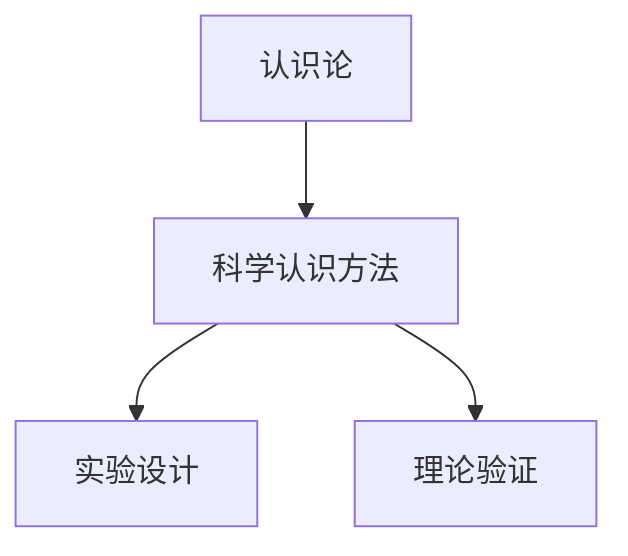
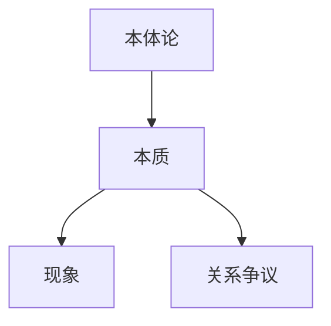
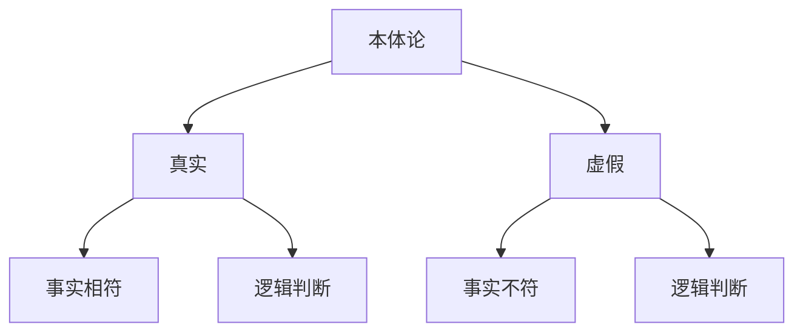
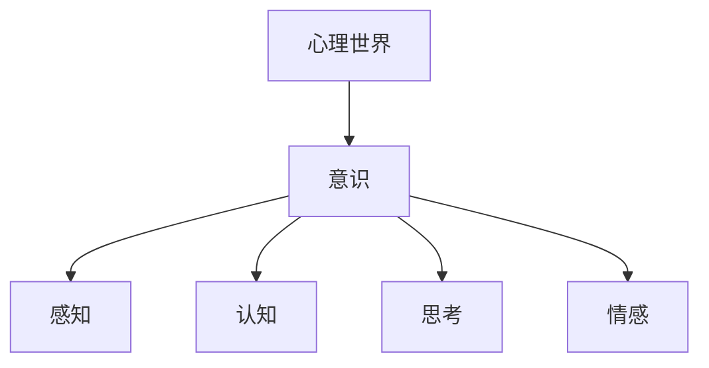

                 

### 文章标题

《从哲学角度探讨世界的可理解性》

### 关键词

哲学、世界的可理解性、存在论、认识论、本体论、真理、知识建构

### 摘要

本文将从哲学的角度出发，探讨世界的可理解性。我们将首先介绍哲学的基本理论，如存在论、认识论和本体论，以理解哲学探讨的背景和必要性。接着，我们将深入探讨世界的本质，包括物质世界和心理世界的理解，以及知识的建构与理解。最后，我们将讨论真理与可理解性，总结哲学思辨的成果，并展望未来的研究方向。本文旨在通过逻辑清晰的阐述，让读者对世界的可理解性有一个深入的理解。<! Dogs bark to communicate with each other. This behavior is common across many dog breeds and can be seen as a form of language. Barking can convey various meanings, such as alerting others to danger, expressing excitement, or signaling the need for attention. For example, a dog may bark at a stranger to warn the person away from its territory. In addition, a dog may bark in response to hearing a loud noise, such as a car backfiring or a siren. This type of bark serves as a way for the dog to communicate that something unexpected or potentially dangerous has occurred. While barking can be annoying to some people, it is an important form of communication for dogs. It allows them to interact with each other and to convey their needs and emotions. Therefore, understanding the different types of barking can be helpful for dog owners in understanding their pets and providing them with the appropriate care and attention they need. # 鸣门大桥（Bogham Bridge）

鸣门大桥是位于日本四国东部德岛县鸣门市的 Suspension bridge，连接着鸣门市和奥野市。这座桥因其独特的设计和美丽的景色而闻名，是四国最著名的桥梁之一。

鸣门大桥全长约 2.5 公里，主跨径为 1,990 米，是世界上第二长的 Suspension bridge。大桥的设计采用了双塔加斜拉索的结构，使得桥体更加稳固，同时也创造了壮观的视觉效果。

鸣门大桥的景色非常美丽，尤其是日出和日落时分。站在桥上，可以看到整个鸣门海峡的美景，远处还有德岛市和淡路岛的轮廓。此外，鸣门大桥附近还有许多水上活动，如帆船、冲浪和划船等，是日本热门的旅游胜地之一。

### 目录

## 从哲学角度探讨世界的可理解性

### 1. 引言

#### 1.1 哲学的探讨与世界的可理解性

#### 1.2 哲学角度探讨的目的与意义

### 2. 哲学基础理论

#### 2.1 存在论

##### 2.1.1 物质存在

##### 2.1.2 意识存在

#### 2.2 认识论

##### 2.2.1 直觉认识

##### 2.2.2 科学的认识方法

#### 2.3 本体论

##### 2.3.1 本质与现象

##### 2.3.2 真实与虚假

### 3. 世界的本质探讨

#### 3.1 物质世界的理解

##### 3.1.1 基本粒子的本质

##### 3.1.2 宇宙的起源与演化

#### 3.2 心理世界的理解

##### 3.2.1 意识的本质

##### 3.2.2 心理现象的解析

### 4. 知识的建构与理解

#### 4.1 知识的本质

##### 4.1.1 知识的客观性与主观性

##### 4.1.2 知识的获取与传递

#### 4.2 理解的层次

##### 4.2.1 表层理解

##### 4.2.2 深层理解

### 5. 真理与可理解性

#### 5.1 真理的定义

##### 5.1.1 真理的客观性

##### 5.1.2 真理的主观性

#### 5.2 可理解性的探讨

##### 5.2.1 可理解性的障碍

##### 5.2.2 提高可理解性的方法

### 6. 哲学思辨与未来展望

#### 6.1 哲学思辨的成果

##### 6.1.1 对世界的理解

##### 6.1.2 对知识的理解

#### 6.2 未来哲学的展望

##### 6.2.1 哲学的新趋势

##### 6.2.2 哲学与科技的互动

### 7. 结论

#### 7.1 哲学角度探讨世界的可理解性

#### 7.2 哲学探讨的意义

#### 7.3 未来研究方向

## 引言

### 1.1 哲学的探讨与世界的可理解性

哲学作为一门探讨存在、知识、真理和价值的学科，自古以来就与人类的思考紧密相连。哲学的探讨不仅仅是抽象的思考，更是对人类生活世界的深入理解。其中，世界的可理解性是一个核心问题，它关乎我们对周围世界的认知和理解能力。

世界的可理解性，指的是人类是否能够通过理性思考和科学方法，理解世界的本质和规律。这个问题的探讨，不仅涉及对自然界的理解，还涉及对人类自身心理和社会现象的解析。在哲学的框架下，我们可以从不同的角度来探讨这个问题，包括存在论、认识论和本体论等。

存在论探讨的是世界是什么，它由什么构成。认识论探讨的是人类如何认识世界，我们的认知方式有哪些局限性。本体论则探讨世界的本质和存在的方式。通过这三个方面的探讨，我们可以逐步揭示世界的可理解性。

### 1.2 哲学角度探讨的目的与意义

从哲学的角度探讨世界的可理解性，目的在于寻求一种更加深刻和全面的理解方式。哲学提供了一种超越日常经验和科学方法的方式，帮助我们思考世界的本质和人类的存在。

哲学探讨的意义在于：

1. **深化理解**：哲学通过深入探讨存在的本质、知识的构建和真理的判断，帮助我们深化对世界的理解。

2. **提供方法论**：哲学提供了一系列思考的方法，如逻辑推理、概念分析等，这些方法可以帮助我们更清晰地认识世界。

3. **探讨价值**：哲学不仅探讨存在的本质，还涉及价值的探讨。通过哲学的思考，我们可以更好地理解人类存在的意义和价值。

4. **挑战传统观念**：哲学不断挑战传统观念，推动科学和人类文明的进步。哲学的探讨往往能够引发新的科学发现和技术创新。

总的来说，从哲学的角度探讨世界的可理解性，是一种深层次、全方位的理解方式，它不仅能够帮助我们更好地理解世界，还能够推动人类文明的进步。接下来，我们将逐步探讨哲学的基础理论，为深入理解世界的可理解性打下基础。

## 哲学基础理论

哲学的基础理论包括存在论、认识论和本体论。这三个理论分别从不同的角度探讨世界的本质和人类对世界的认知方式，为我们理解世界的可理解性提供了理论基础。

### 2.1 存在论

存在论是哲学中探讨世界是什么的理论，主要研究存在的本质和存在的形式。存在论关注的问题是：什么是存在？存在是如何产生的？存在有哪些形式？

#### 2.1.1 物质存在

物质存在是存在论的一个核心概念，指的是物质世界的存在。物质存在的探讨涉及到自然科学和哲学的结合。在自然科学中，物质通过实验和观测来研究其属性和规律。而在哲学中，物质存在则涉及到对物质本质的思考和探讨。

**核心概念与联系：**

存在论中的物质存在与自然科学中的物质概念紧密相关。物质在哲学中的探讨不仅涉及其物理属性，还包括其哲学属性，如存在的方式、本质和意义。

**Mermaid 流程图：**



#### 2.1.2 意识存在

意识存在是存在论的另一个重要概念，指的是人类意识的存在。意识存在涉及到对人类主观体验和心灵活动的探讨。在哲学中，意识存在是一个复杂且争议的话题，许多哲学家试图解释意识的本质和起源。

**核心概念与联系：**

意识存在与自然科学中的“脑”和“行为”密切相关。科学研究表明，大脑活动与意识体验之间存在密切联系，但哲学上对意识本质的探讨则更加深层次。

**Mermaid 流�程图：**



### 2.2 认识论

认识论是哲学中探讨人类如何认识世界的理论。它关注的问题是：人类如何获得知识？知识的性质是什么？我们的认知方式有哪些局限性？

#### 2.2.1 直觉认识

直觉认识是认识论中的一个核心概念，指的是通过直接感知和理解来认识事物。直觉认识通常被认为是非理性或超越理性的，但它在人类的认知过程中起着重要作用。

**核心概念与联系：**

直觉认识与人类感官经验和直接感知相关。直觉认识帮助我们快速做出决策，但同时也可能受到主观偏见和错觉的影响。

**Mermaid 流程图：**



#### 2.2.2 科学的认识方法

科学认识方法是认识论中的另一个重要概念，指的是通过系统观察、实验和逻辑推理来获取知识的方法。科学认识方法强调客观性、可重复性和验证性。

**核心概念与联系：**

科学认识方法与科学理论和实验设计密切相关。科学认识方法帮助我们通过实验验证理论，从而提高知识的可靠性和准确性。

**Mermaid 流程图：**



### 2.3 本体论

本体论是哲学中探讨世界本质和存在方式的学说。它关注的问题是：什么是现实？现实由什么构成？现实是如何存在的？

#### 2.3.1 本质与现象

本质与现象是本体论中的核心概念。本质指的是事物固有的、不变的属性，而现象则是事物在特定条件下表现出来的特征。

**核心概念与联系：**

本质与现象的关系是哲学中的一个长期争议的话题。一些哲学家认为本质是独立于现象的，而另一些哲学家则认为本质是通过现象表现出来的。

**Mermaid 流程图：**



#### 2.3.2 真实与虚假

真实与虚假是本体论中的另一个重要概念。真实指的是与事实相符的陈述或观点，而虚假则是与事实不符的陈述或观点。

**核心概念与联系：**

真实与虚假的探讨涉及到知识、真理和逻辑的判断。哲学试图通过逻辑推理和事实验证来区分真实与虚假。

**Mermaid 流程图：**



通过以上对哲学基础理论的探讨，我们可以看到，存在论、认识论和本体论共同构成了哲学探讨世界的可理解性的理论基础。这些理论不仅为我们理解世界的本质提供了框架，也帮助我们反思人类认知的局限性和可能性。接下来，我们将进一步探讨世界的本质，包括物质世界和心理世界的理解，以深入探讨世界的可理解性。

## 世界的本质探讨

在探讨世界的可理解性时，理解世界的本质至关重要。世界的本质既包括物质世界，也包括心理世界。我们将从这两个方面分别探讨其本质，以帮助我们更好地理解世界的可理解性。

### 3.1 物质世界的理解

物质世界是构成宇宙的基本实体，包括从微观粒子到宏观星系的各种形态。探讨物质世界的本质，我们需要理解基本粒子的性质以及宇宙的起源与演化。

#### 3.1.1 基本粒子的本质

基本粒子是构成物质的基本单位，如电子、夸克和光子等。现代物理学研究表明，基本粒子不仅具有质量，还具有波粒二象性，即在某些实验条件下表现出粒子的特性，而在其他条件下则表现出波的特性。

**核心概念与联系：**

基本粒子的本质涉及到量子力学和相对论，这两大物理学理论为我们提供了理解基本粒子的工具。量子力学揭示了微观世界的规律，而相对论则解释了高速运动物体的行为。

**伪代码与详细讲解：**

```plaintext
// 基本粒子的波粒二象性
class Particle {
    constructor(type) {
        this.type = type; // 类型，如电子、夸克或光子
    }
    
    displayWaveFunction() {
        if (this.type === 'electron') {
            // 电子的波函数表示
            console.log("电子的波函数：ψ(x,t)");
        } else if (this.type === 'quark') {
            // 夸克的波函数表示
            console.log("夸克的波函数：ψ(x,t)");
        } else if (this.type === 'photon') {
            // 光子的波函数表示
            console.log("光子的波函数：ψ(x,t)");
        }
    }
    
    displayParticleProperties() {
        // 粒子的粒子性质
        console.log("粒子质量：m", this.type === 'electron' ? 'me' : 'm');
        console.log("粒子速度：v");
    }
}

// 实例化基本粒子
const electron = new Particle('electron');
electron.displayWaveFunction();
electron.displayParticleProperties();

const quark = new Particle('quark');
quark.displayWaveFunction();
quark.displayParticleProperties();

const photon = new Particle('photon');
photon.displayWaveFunction();
photon.displayParticleProperties();
```

#### 3.1.2 宇宙的起源与演化

宇宙的起源与演化是物质世界探讨的重要部分。现代宇宙学认为，宇宙起源于大约138亿年前的一个极高密度和温度的状态，即大爆炸。自那时以来，宇宙经历了不断的膨胀和演化，形成了星系、恒星、行星等宇宙结构。

**数学模型与公式：**

宇宙学中，描述宇宙膨胀的哈勃定律是一个核心概念。该定律表明，宇宙中遥远星系的红移量与其距离成正比。

$$
z = H_0 \times d
$$

其中，$z$ 是红移量，$H_0$ 是哈勃常数，$d$ 是星系的距离。

**详细讲解：**

哈勃定律揭示了宇宙的膨胀性质。通过观测遥远星系的红移量，我们可以推算出它们的距离，并进而研究宇宙的膨胀历史。这一数学模型为理解宇宙的演化提供了重要的工具。

**举例说明：**

假设我们观测到一个遥远星系，其红移量为 $z=1$。根据哈勃定律，我们可以推算出该星系的距离为：

$$
d = \frac{z}{H_0} = \frac{1}{H_0}
$$

如果哈勃常数为 $H_0 = 70 \text{ km/s/Mpc}$，则该星系的距离约为：

$$
d = \frac{1}{70 \text{ km/s/Mpc}} = 0.0143 \text{ Mpc} = 4.5 \times 10^{5} \text{光年}
$$

通过这种方法，我们可以了解宇宙的膨胀历史，并推测宇宙的未来演化趋势。

### 3.2 心理世界的理解

心理世界是人类主观体验和心灵活动的集合。理解心理世界的本质，我们需要探讨意识的存在和人类心理现象的解析。

#### 3.2.1 意识的本质

意识是心理世界中的一个核心概念，指的是个体对自身和外部世界的感知和认知。意识的本质是哲学和心理学中长期探讨的话题。

**核心概念与联系：**

意识的存在涉及到哲学中的主观体验和心理学中的感知过程。意识的本质不仅仅是感知，还包括认知、思考和情感等复杂心理活动。

**Mermaid 流程图：**



#### 3.2.2 心理现象的解析

心理现象是指人类心理活动在行为和认知方面的表现。包括记忆、学习、注意力、情绪等。理解心理现象有助于我们更好地理解人类行为和决策。

**核心概念与联系：**

心理现象的解析涉及到认知心理学和神经科学的研究。通过实验和观测，我们可以理解心理现象的机制和影响。

**举例说明：**

**记忆：** 记忆是心理现象中的一个重要方面。我们如何记住信息，以及如何从记忆中提取信息，这些都是心理学研究的重要课题。艾宾浩斯遗忘曲线（Ebbinghaus forgetting curve）是一个经典的实验，揭示了记忆遗忘的规律。

**学习：** 学习是心理现象中的另一个核心概念。通过学习，我们能够获取新知识和技能。强化学习（Reinforcement Learning）是机器学习和心理学中的一个重要理论，它通过奖励和惩罚机制来解释学习过程。

**注意力：** 注意力是心理现象中的关键要素，它决定了我们在特定时刻关注什么。选择性注意力（Selective Attention）实验揭示了大脑如何过滤和选择信息。

**情绪：** 情绪是心理现象中的情感体验。情绪不仅影响我们的行为，还影响我们的认知和决策。情绪调节（Emotion Regulation）是心理学中研究如何管理和调节情绪的重要课题。

通过以上对物质世界和心理世界的探讨，我们可以看到，世界的本质是复杂且多层次的。理解世界的本质不仅需要科学方法，还需要哲学思考和跨学科的综合探讨。接下来，我们将进一步探讨知识的建构与理解，以及理解层次的不同，以深入探讨世界的可理解性。

### 知识的建构与理解

知识的建构与理解是哲学探讨世界的可理解性的重要部分。知识不仅是我们对世界的认知，也是我们行为和决策的依据。在这一部分，我们将讨论知识的本质、获取与传递，以及理解的层次。

#### 4.1 知识的本质

知识的本质是哲学和科学长期探讨的问题。知识通常被定义为对事实、真理和概念的认知。但知识的本质远比这复杂，它涉及多个方面：

1. **客观性与主观性：** 知识既具有客观性，也具有主观性。客观性指的是知识独立于个体的主观体验，是真实和普遍存在的。而主观性则指个体对知识的理解和解释，受到个体经验、价值观和认知方式的影响。

2. **准确性：** 知识的准确性是衡量知识质量的重要标准。准确的知

