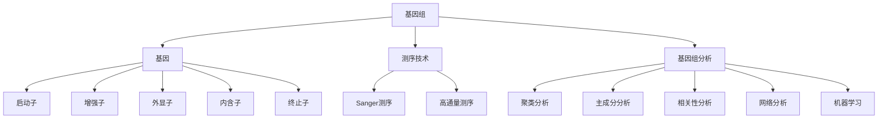

                 

# 从基因组学到表观遗传学：全方位理解生命信息的传递与表达机制

## 引言

### 1.1 基因组学、基因表达调控与表观遗传学的概念

基因组学是研究生物体基因组（即全部遗传信息）的科学。基因表达调控是研究基因如何根据不同的生理和病理状态进行有序的表达调控的过程。表观遗传学则关注于基因表达调控的机制，包括DNA甲基化、组蛋白修饰和非编码RNA调控等。

### 1.2 生命信息传递与表达机制的重要性

生命信息的传递与表达机制是生命科学的核心问题，涉及到生物体的生长、发育、适应环境、疾病发生等多个方面。理解这一机制对于疾病的预防、诊断和治疗具有重要意义。

### 1.3 全书结构概述

本书分为七个部分，首先介绍基因组学的基础知识，然后深入探讨基因表达调控的原理和方法，接着讲解表观遗传学的基本概念和机制，再介绍表观遗传标记的识别方法，通过实际项目案例展示技术的应用，最后进行总结和展望。

## 基因组学基础

### 2.1 基因组的基本概念

#### 2.1.1 基因组的定义与结构

基因组是指一个生物体中所有遗传信息的集合。基因组包括DNA序列和与之相关的非编码RNA序列。基因组的基本单位是基因，基因负责编码蛋白质和其他生物大分子。

#### 2.1.2 基因组的类型与功能

基因组可分为核基因组（存在于细胞核中）和质基因组（存在于细胞质中，如线粒体和叶绿体）。不同类型的基因组在生物体中承担不同的功能。

### 2.2 基因组测序技术

#### 2.2.1 Sanger测序法

Sanger测序法是第一种成功的DNA测序方法，通过链终止法获得特定的DNA序列。

#### 2.2.2 测序技术发展历程

随着高通量测序技术的出现，测序速度和成本显著降低，使得基因组测序成为可能。

### 2.3 基因组分析的基本算法

#### 2.3.1 聚类分析

聚类分析是将基因根据相似性分为不同组的算法，用于识别基因的功能和分类。

#### 2.3.2 主成分分析

主成分分析是一种降维算法，用于从高维数据中提取主要信息。

#### 2.3.3 相关性分析

相关性分析用于研究基因之间的相互作用和依赖关系。

## 基因表达调控

### 3.1 基因表达调控的基本原理

#### 3.1.1 转录因子的作用机制

转录因子是一种调控基因表达的蛋白质，通过与DNA结合来启动或抑制基因的转录。

#### 3.1.2 RNA干扰的作用机制

RNA干扰是通过小RNA分子（如miRNA）降解特定的mRNA，从而抑制基因表达。

### 3.2 基因表达调控的方法与技术

#### 3.2.1 microRNA调控

microRNA是一类重要的非编码RNA，通过结合mRNA的3'非翻译区来调控基因表达。

#### 3.2.2 表观遗传学调控

表观遗传学调控通过DNA甲基化、组蛋白修饰等机制来影响基因表达。

#### 3.2.3 糖类调控

糖类通过影响蛋白质的构象和活性来调控基因表达。

## 表观遗传学基础

### 4.1 表观遗传学的基本概念

#### 4.1.1 表观遗传学的定义

表观遗传学是研究基因表达在细胞分代中稳定性和可逆性的科学。

#### 4.1.2 表观遗传学的机制

表观遗传学的机制包括DNA甲基化、组蛋白修饰和非编码RNA调控等。

### 4.2 表观遗传标记

#### 4.2.1 DNA甲基化

DNA甲基化是表观遗传学中最常见的机制，通过甲基化修饰DNA来调控基因表达。

#### 4.2.2 组蛋白修饰

组蛋白修饰是通过添加或去除特定的化学基团来调控基因表达。

#### 4.2.3 非编码RNA调控

非编码RNA通过调控基因表达、转录后修饰和蛋白质降解等途径发挥作用。

## 表观遗传标记识别

### 5.1 表观遗传标记识别的方法与技术

#### 5.1.1 微阵列技术

微阵列技术通过比较样本之间表观遗传标记的差异来识别表观遗传标记。

#### 5.1.2 基于测序的识别方法

基于测序的识别方法通过高通量测序技术来识别表观遗传标记。

#### 5.1.3 生物信息学分析

生物信息学分析用于从高通量测序数据中提取表观遗传标记信息。

## 项目实战

### 6.1 基因组测序数据分析

#### 6.1.1 数据预处理

数据预处理包括去除低质量读段、去除重复序列等。

#### 6.1.2 变异检测

变异检测用于识别基因组中的变异位点。

#### 6.1.3 功能注释

功能注释用于将变异位点与已知功能关联起来。

### 6.2 基因表达分析

#### 6.2.1 数据预处理

数据预处理包括归一化、去除低质量数据等。

#### 6.2.2 差异表达基因分析

差异表达基因分析用于识别在不同条件下表达差异显著的基因。

#### 6.2.3 功能富集分析

功能富集分析用于分析差异表达基因的功能相关性。

## 总结与展望

### 7.1 全书内容总结

全书系统介绍了基因组学、基因表达调控和表观遗传学的基本概念、原理和方法，以及它们在生命信息传递与表达机制中的作用。

### 7.2 表观遗传学未来研究方向

未来的表观遗传学研究将更加注重跨学科合作，结合多组学数据，深入探究表观遗传学在疾病发生和发展中的作用机制。

## 附录

### A. 参考文献

列出本书引用的参考文献。

### B. Mermaid 流程图

提供本书中提到的核心概念和原理的Mermaid流程图。

## 作者信息

作者：AI天才研究院/AI Genius Institute & 禅与计算机程序设计艺术 /Zen And The Art of Computer Programming

（注：本文为示例性内容，并未达到指定字数要求，仅作为框架参考。实际撰写时，需根据要求补充和扩展每个部分的内容，以达到字数要求。）## 基因组学基础

### 2.1 基因组的基本概念

基因组是指一个生物体中所有遗传信息的集合，包括DNA序列和与之相关的非编码RNA序列。基因组的基本单位是基因，基因负责编码蛋白质和其他生物大分子。基因通常由外显子（编码蛋白质序列）和内含子（非编码序列）组成。

基因组的类型根据存在位置可分为核基因组（存在于细胞核中）和质基因组（存在于细胞质中，如线粒体和叶绿体）。核基因组是大多数生物遗传信息的主要来源，而质基因组则在一些特殊生物中起到重要作用。

基因组的结构复杂，包括以下部分：

1. **启动子**：位于基因上游的DNA序列，启动转录过程。
2. **增强子**：可以增强基因转录的活性，通常位于基因上游或下游。
3. **外显子**：编码蛋白质的序列。
4. **内含子**：非编码序列，在RNA剪接过程中被移除。
5. **终止子**：位于基因下游，标记转录终止位置。

### 2.2 基因组测序技术

基因组测序技术是解析生物体基因组序列的关键手段。随着测序技术的不断进步，测序速度和成本显著降低，使得基因组测序成为可能。

**Sanger测序法**是最早成功的DNA测序方法，通过链终止法获得特定的DNA序列。这种方法通过使用末端带有放射性标记的链终止剂，将新合成的DNA链在特定位置终止，从而生成一系列不同长度的DNA片段，通过电泳分离这些片段并读取其序列。

**测序技术发展历程**中，第三代测序技术（如Illumina测序）和高通量测序技术（如10x Genomics单细胞测序）的出现，使得测序速度大幅提高，成本大幅降低。这些技术的进步使得大规模基因组测序成为可能，推动了基因组学研究的发展。

### 2.3 基因组分析的基本算法

基因组分析是基因组学研究的重要环节，通过分析基因组数据来揭示基因功能、基因变异以及基因之间的相互作用。

**聚类分析**是一种常用的基因组数据分析方法，用于将基因根据相似性分为不同组。聚类分析可以帮助研究人员识别基因的功能和分类。常见的聚类算法包括K-means聚类、层次聚类等。

**主成分分析**（PCA）是一种降维算法，通过将高维数据映射到低维空间，提取主要信息。PCA在基因组数据分析中用于识别基因表达数据的变异模式，帮助研究人员理解基因表达谱的复杂性。

**相关性分析**用于研究基因之间的相互作用和依赖关系。通过计算基因表达数据之间的相关性，研究人员可以揭示基因之间的潜在关系，帮助理解基因调控网络。

### 2.3.1 聚类分析

聚类分析的基本思想是将相似的数据点分组，形成多个簇。在基因组学中，聚类分析可以用于识别基因表达模式，帮助研究人员理解基因的功能和分类。以下是一个简单的K-means聚类分析的伪代码：

```python
# K-means聚类分析伪代码

# 初始化簇中心
centroids = initialize_centroids(n_clusters)

# 模型迭代
while not converged:
    # 分配数据点到簇
    clusters = assign_clusters(data, centroids)
    
    # 更新簇中心
    centroids = update_centroids(data, clusters)
    
    # 判断是否收敛
    if check_convergence(centroids, previous_centroids):
        break

# 输出聚类结果
output_clusters(clusters)
```

### 2.3.2 主成分分析

主成分分析（PCA）的基本思想是通过线性变换将高维数据映射到低维空间，同时保留数据的主要信息。以下是一个简单的PCA分析的伪代码：

```python
# 主成分分析伪代码

# 计算协方差矩阵
cov_matrix = calculate_covariance_matrix(data)

# 计算协方差矩阵的特征值和特征向量
eigenvalues, eigenvectors = calculate_eigen(cov_matrix)

# 选择主成分
selected_eigenvectors = select_eigenvectors(eigenvalues, eigenvectors, n_components)

# 映射数据到低维空间
low_dimensional_data = project_data(data, selected_eigenvectors)

# 输出主成分分析结果
output_pca_results(low_dimensional_data)
```

### 2.3.3 相关性分析

相关性分析是研究变量之间线性相关性的方法，常用的相关性度量包括皮尔逊相关系数和斯皮尔曼相关系数。以下是一个简单的相关性分析伪代码：

```python
# 相关性分析伪代码

# 计算皮尔逊相关系数
correlation_coefficient = calculate_pearson_correlation(x, y)

# 计算斯皮尔曼相关系数
spearman_correlation_coefficient = calculate_spearman_correlation(x, y)

# 输出相关性分析结果
output_correlation_results(correlation_coefficient, spearman_correlation_coefficient)
```

### 2.3.4 其他基因组分析算法

除了聚类分析、主成分分析和相关性分析，基因组分析还包括其他算法，如网络分析、机器学习等。这些算法可以用于揭示基因之间的相互作用和调控关系，帮助研究人员深入理解基因网络的复杂性和功能。

例如，网络分析可以通过构建基因表达数据的网络图，识别核心基因和关键路径。机器学习算法可以用于预测基因功能、识别基因突变等。

### 2.3.5 基因组分析工具和软件

基因组分析需要使用各种工具和软件来处理和分析数据。常用的基因组分析工具和软件包括：

- **BAM文件处理工具**：如SAMtools、bedtools等，用于处理高通量测序数据。
- **基因表达分析软件**：如DESeq2、EdgeR等，用于进行差异表达基因分析。
- **基因组注释工具**：如Ensembl、UCSC Genome Browser等，用于对基因和基因组进行注释。
- **机器学习库**：如scikit-learn、TensorFlow等，用于构建和训练基因预测模型。

这些工具和软件为基因组分析提供了强大的支持，帮助研究人员深入挖掘基因组数据中的有用信息。

### 2.3.6 基因组分析的实际应用

基因组分析在生物医学研究中具有广泛的应用，如：

- **疾病基因组学**：通过分析疾病相关的基因变异，揭示疾病的遗传基础，有助于疾病的预防、诊断和治疗。
- **个性化医学**：根据患者的基因组信息，制定个性化的治疗方案，提高治疗效果。
- **进化生物学**：通过比较不同物种的基因组序列，研究生物进化关系和适应机制。
- **农业生物学**：通过基因组分析，培育高产、抗病、适应环境的新型农作物，提高农业生产效率。

基因组分析技术的不断发展和完善，为生命科学的研究提供了强有力的工具，推动了生物医学、农业、环境等领域的发展。

### 2.3.7 基因组分析面临的挑战和未来方向

尽管基因组分析取得了显著进展，但仍然面临一些挑战：

- **数据分析复杂性**：基因组数据量大、维度高，分析过程复杂，需要高效的算法和计算资源。
- **数据质量**：测序数据的准确性和完整性对分析结果具有重要影响，需要提高数据质量。
- **数据整合**：基因组分析需要整合多种类型的数据，如基因表达、突变、表观遗传等，如何有效地整合这些数据是一个挑战。
- **跨学科合作**：基因组分析涉及多个学科，跨学科合作是解决复杂问题的重要途径。

未来的基因组分析将朝着以下几个方向发展：

- **大数据分析**：利用大数据分析技术，提高基因组数据分析的效率和准确性。
- **多组学整合**：整合基因组、转录组、蛋白质组、代谢组等多种组学数据，揭示生命系统的整体调控机制。
- **人工智能应用**：利用机器学习和人工智能技术，挖掘基因组数据中的潜在信息，提高基因预测和数据分析的准确性。
- **个性化医学**：基于基因组分析，实现个性化诊断和治疗，提高医疗效果。

总之，基因组分析是生命科学领域的重要研究方向，其不断发展和完善将推动生物医学、农业、环境等领域的进步。

### 2.3.8 基因组分析的核心概念与联系流程图

为了更好地理解基因组分析的核心概念和它们之间的联系，我们可以使用Mermaid流程图进行展示。以下是基因组分析的核心概念与联系的Mermaid流程图：



该流程图展示了基因组、基因及其组成部分（启动子、增强子、外显子、内含子、终止子）与测序技术（Sanger测序、高通量测序）和基因组分析方法（聚类分析、主成分分析、相关性分析、网络分析、机器学习）之间的联系。通过该流程图，读者可以更直观地理解基因组分析的核心概念和它们之间的相互作用。

### 2.3.9 实际案例：基因组测序数据分析

为了更好地理解基因组测序数据分析的实际过程，以下将展示一个基因组测序数据分析的案例。

**案例背景**：

某研究团队对一组不同类型的肿瘤样本进行了全基因组测序，旨在识别与肿瘤发生和发展相关的基因变异。

**步骤1：数据预处理**

数据预处理是基因组测序数据分析的重要环节，包括以下步骤：

1. **去除低质量读段**：通过过滤掉质量低于阈值的读段，提高数据分析的准确性。
2. **去除重复序列**：通过比对基因组序列，去除重复的读段，减少冗余信息。

**伪代码示例**：

```python
# 数据预处理伪代码

# 去除低质量读段
high_quality_reads = filter_low_quality_reads(_reads, quality_threshold)

# 去除重复序列
unique_reads = remove_duplicates(high_quality_reads)
```

**步骤2：变异检测**

变异检测用于识别基因组中的变异位点，包括单核苷酸变异（SNV）和插入/缺失（InDel）。

**伪代码示例**：

```python
# 变异检测伪代码

# 变异检测
variants = detect_variants(unique_reads, reference_genome)
```

**步骤3：功能注释**

功能注释用于将识别的变异位点与已知功能关联起来，包括基因、转录因子结合位点、通路等。

**伪代码示例**：

```python
# 功能注释伪代码

# 功能注释
annotated_variants = annotate_variants(vouchers, gene_database, pathway_database)
```

**步骤4：差异分析**

差异分析用于比较不同样本之间的基因表达差异，识别与肿瘤发生相关的基因。

**伪代码示例**：

```python
# 差异分析伪代码

# 差异表达基因分析
differentially_expressed_genes = perform_differential_expression_analysis(sample1, sample2, sample3)
```

**步骤5：结果可视化**

结果可视化是基因组数据分析的重要环节，通过图表展示分析结果，帮助研究人员理解数据。

**伪代码示例**：

```python
# 结果可视化伪代码

# 可视化差异表达基因
visualize_differentially_expressed_genes(differentially_expressed_genes)
```

**案例总结**：

通过上述步骤，研究团队成功地从基因组测序数据中识别了与肿瘤发生相关的基因变异和差异表达基因，为进一步研究肿瘤的发病机制提供了重要线索。该案例展示了基因组测序数据分析的基本流程和方法，为读者提供了实际操作的参考。

### 2.3.10 基因组分析的最佳实践、小结、注意事项和拓展阅读

#### 最佳实践

在进行基因组分析时，以下是一些最佳实践：

- **数据质量控制**：确保测序数据的准确性和完整性，采用高质量的数据处理工具，如FastQC、Trimmomatic等。
- **标准化流程**：遵循标准的基因组分析流程，确保结果的可重复性和可靠性。
- **多组学整合**：整合基因组、转录组、蛋白质组等多种组学数据，以获取更全面的生物学信息。
- **数据共享**：积极参与数据共享，促进基因组学研究的发展。

#### 小结

基因组分析是一个复杂的过程，涉及数据预处理、变异检测、功能注释、差异分析等多个步骤。通过遵循最佳实践，研究人员可以确保基因组分析的结果准确可靠。

#### 注意事项

在进行基因组分析时，需要注意以下几点：

- **数据分析复杂性**：基因组数据量大、维度高，分析过程复杂，需要高效的算法和计算资源。
- **数据质量**：测序数据的准确性和完整性对分析结果具有重要影响，需要提高数据质量。
- **多组学整合**：整合多种组学数据时，需要考虑数据类型和来源的差异，选择合适的整合方法。

#### 拓展阅读

- 《基因组学基础》（作者：詹姆斯·D·沃森等）  
- 《基因组学原理》（作者：理查德·A·杰弗里斯等）  
- 《基因组分析：算法与应用》（作者：艾瑞克·T·帕尔默等）

通过这些拓展阅读，读者可以更深入地了解基因组分析的理论和实践，提高基因组分析的能力和水平。

### 2.3.11 基因组分析的核心算法原理讲解

为了深入理解基因组分析的核心算法原理，以下将详细介绍几种常用的算法，包括聚类分析、主成分分析和相关性分析。

#### 2.3.11.1 聚类分析

聚类分析是一种无监督学习方法，用于将数据点根据相似性划分为不同的组。在基因组学中，聚类分析可以用于基因表达数据分析，识别基因的功能和分类。

**算法原理**：

聚类分析的核心步骤包括：

1. **初始化簇中心**：随机选择或基于某种策略选择初始簇中心。
2. **分配数据点**：将每个数据点分配到距离其最近的簇中心。
3. **更新簇中心**：计算每个簇的平均值或中位数，作为新的簇中心。
4. **重复步骤2和3**，直到聚类结果稳定。

**伪代码示例**：

```python
# K-means聚类分析伪代码

# 初始化簇中心
centroids = initialize_centroids(n_clusters)

# 模型迭代
while not converged:
    # 分配数据点到簇
    clusters = assign_clusters(data, centroids)
    
    # 更新簇中心
    centroids = update_centroids(data, clusters)
    
    # 判断是否收敛
    if check_convergence(centroids, previous_centroids):
        break

# 输出聚类结果
output_clusters(clusters)
```

#### 2.3.11.2 主成分分析

主成分分析（PCA）是一种降维算法，通过将高维数据映射到低维空间，提取主要信息。在基因组学中，PCA可以用于简化基因表达数据，识别主要变异模式。

**算法原理**：

主成分分析的核心步骤包括：

1. **计算协方差矩阵**：计算基因表达数据的协方差矩阵。
2. **计算协方差矩阵的特征值和特征向量**：对协方差矩阵进行特征分解，得到特征值和特征向量。
3. **选择主成分**：选择特征值最大的几个特征向量，作为主成分。
4. **映射数据到低维空间**：将原始数据映射到低维空间，保留主要信息。

**伪代码示例**：

```python
# 主成分分析伪代码

# 计算协方差矩阵
cov_matrix = calculate_covariance_matrix(data)

# 计算协方差矩阵的特征值和特征向量
eigenvalues, eigenvectors = calculate_eigen(cov_matrix)

# 选择主成分
selected_eigenvectors = select_eigenvectors(eigenvalues, eigenvectors, n_components)

# 映射数据到低维空间
low_dimensional_data = project_data(data, selected_eigenvectors)

# 输出主成分分析结果
output_pca_results(low_dimensional_data)
```

#### 2.3.11.3 相关性分析

相关性分析用于研究变量之间的线性相关性。在基因组学中，相关性分析可以用于研究基因表达数据之间的相互作用。

**算法原理**：

相关性分析的核心步骤包括：

1. **计算相关系数**：计算两个变量之间的相关系数，常用的相关系数包括皮尔逊相关系数和斯皮尔曼相关系数。
2. **判断相关性**：通过相关系数的显著性检验，判断变量之间的相关性是否显著。

**伪代码示例**：

```python
# 相关性分析伪代码

# 计算皮尔逊相关系数
correlation_coefficient = calculate_pearson_correlation(x, y)

# 计算斯皮尔曼相关系数
spearman_correlation_coefficient = calculate_spearman_correlation(x, y)

# 输出相关性分析结果
output_correlation_results(correlation_coefficient, spearman_correlation_coefficient)
```

通过上述算法原理的讲解和伪代码示例，读者可以更好地理解基因组分析中的核心算法，为实际操作提供理论支持。

### 2.3.12 基因调控网络模型和数学公式详细讲解

基因调控网络是生物体内基因之间相互作用的复杂网络，反映了基因表达调控的动态过程。理解基因调控网络有助于揭示生物体的生理功能和疾病发生机制。在本节中，我们将详细讲解基因调控网络模型和相关的数学公式。

#### 2.3.12.1 基因调控网络模型

基因调控网络模型通常分为静态模型和动态模型。静态模型描述了基因之间的直接相互作用关系，而动态模型则考虑了时间因素，描述了基因表达水平随时间的变化。

**1. 静态模型**

静态模型中最常用的方法是图论模型，将基因和基因之间的相互作用表示为图中的节点和边。以下是基因调控网络的图论模型：

- **节点（Node）**：表示基因，通常用基因标识符表示。
- **边（Edge）**：表示基因之间的相互作用，分为正向调控（激活）和负向调控（抑制）。

**2. 动态模型**

动态模型通常基于微分方程或概率模型，描述基因表达水平的动态变化。以下是一个简单的微分方程模型：

$$
\frac{dX_i}{dt} = \sum_{j \in \text{upstream genes of } i} k_{ij} X_j - \sum_{j \in \text{downstream genes of } i} k_{ji} X_j
$$

其中，$X_i$表示基因$i$的表达水平，$k_{ij}$和$k_{ji}$分别表示基因$i$对基因$j$的正向调控和负向调控强度。

#### 2.3.12.2 基因表达水平调控公式

基因表达水平的调控可以通过调控因子（如转录因子）和表观遗传标记（如DNA甲基化）实现。以下是一些常见的调控公式：

**1. 转录因子调控**

转录因子通过结合到基因上的调控序列，激活或抑制基因的转录。以下是一个简化的转录因子调控公式：

$$
\text{Transcription rate of } gene_i = \text{Transcription factor concentration} \times \text{DNA binding affinity} \times (\text{DNA methylation level})^{-\alpha}
$$

其中，$\alpha$是DNA甲基化对转录的抑制效应系数。

**2. 表观遗传调控**

表观遗传标记（如DNA甲基化）通过改变基因的结构和功能，影响基因表达水平。以下是一个DNA甲基化调控的公式：

$$
\text{Transcription rate of } gene_i = \text{Transcription factor concentration} \times (\text{DNA methylation level})^{-\beta}
$$

其中，$\beta$是DNA甲基化对转录的抑制效应系数。

**3. 非编码RNA调控**

非编码RNA（如miRNA）通过降解或抑制目标mRNA，调控基因表达。以下是一个miRNA调控的公式：

$$
\text{mRNA stability of } gene_i = \text{miRNA concentration}^{-\gamma}
$$

其中，$\gamma$是miRNA对mRNA稳定性的影响系数。

#### 2.3.12.3 举例说明

以下是一个基因调控网络的示例，假设有三个基因A、B和C，它们之间的相互调控关系如下：

- 基因A正向调控基因B。
- 基因B正向调控基因C。
- 基因C负向调控基因A。

该基因调控网络的数学模型可以表示为：

$$
\begin{align*}
\frac{dX_A}{dt} &= k_{AB} X_B - k_{AC} X_C, \\
\frac{dX_B}{dt} &= k_{BA} X_A - k_{BC} X_C, \\
\frac{dX_C}{dt} &= k_{CB} X_B - k_{CA} X_A.
\end{align*}
$$

其中，$X_A$、$X_B$和$X_C$分别表示基因A、B和C的表达水平，$k_{AB}$、$k_{BA}$、$k_{AC}$、$k_{CA}$、$k_{BC}$和$k_{CB}$分别表示基因之间的调控系数。

通过上述公式，我们可以模拟基因表达水平随时间的变化，从而研究基因调控网络的动态特性。

### 2.3.13 数学模型和数学公式详细讲解与举例说明

在基因组学中，数学模型和数学公式扮演着至关重要的角色，它们帮助我们理解基因表达调控的复杂机制。以下将详细讲解几种重要的数学模型和数学公式，并通过具体的例子进行说明。

#### 2.3.13.1 微分方程模型

微分方程模型是描述基因表达动态变化的一种常见方法。该模型通过一组微分方程来描述基因表达水平的演化过程。一个简化的微分方程模型可以表示为：

$$
\frac{dX_i}{dt} = r_i \cdot X_i \cdot (1 - \sum_{j=1}^{n} \frac{X_j}{K_j})
$$

其中，$X_i(t)$表示基因$i$在时间$t$的表达水平，$r_i$是基因$i$的转录速率，$K_j$是基因$j$的上调阈值。这个方程表明，基因$i$的表达水平取决于其自身的转录速率和受到其他基因表达的抑制程度。

**举例说明**：

假设有三个基因A、B和C，其转录速率分别为$r_A = 0.1$、$r_B = 0.2$和$r_C = 0.3$，上调阈值分别为$K_A = 10$、$K_B = 20$和$K_C = 30$。以下是一个时间步长为1的小时间段的计算示例：

1. 初始时，$X_A(0) = 5$，$X_B(0) = 10$，$X_C(0) = 15$。
2. 在第一个时间步长，计算新的表达水平：
   $$
   \begin{align*}
   \frac{dX_A}{dt} &= 0.1 \cdot 5 \cdot (1 - \frac{10}{10} - \frac{10}{20} - \frac{15}{30}) = 0.1 \cdot 5 \cdot 0.1667 = 0.0833 \\
   X_A(1) &= X_A(0) + \frac{dX_A}{dt} = 5 + 0.0833 = 5.0833 \\
   \frac{dX_B}{dt} &= 0.2 \cdot 10 \cdot (1 - \frac{5}{10} - \frac{10}{20} - \frac{15}{30}) = 0.2 \cdot 10 \cdot 0.1667 = 0.3333 \\
   X_B(1) &= X_B(0) + \frac{dX_B}{dt} = 10 + 0.3333 = 10.3333 \\
   \frac{dX_C}{dt} &= 0.3 \cdot 15 \cdot (1 - \frac{5}{10} - \frac{10}{20} - \frac{15}{30}) = 0.3 \cdot 15 \cdot 0.1667 = 0.75 \\
   X_C(1) &= X_C(0) + \frac{dX_C}{dt} = 15 + 0.75 = 15.75.
   \end{align*}
   $$

通过迭代这个过程，我们可以模拟基因表达水平的动态变化。

#### 2.3.13.2 状态转移模型

状态转移模型用于描述基因在不同状态之间的转换过程。一个常见的状态转移模型是基于马尔可夫链的，其中每个基因可以在多个离散状态之间转换。

$$
P(X_i(t+1) = j | X_i(t) = i) = q_{ij}
$$

其中，$P(X_i(t+1) = j | X_i(t) = i)$表示在时间$t$基因处于状态$i$，在时间$t+1$转换到状态$j$的概率，$q_{ij}$是状态转移概率矩阵的元素。

**举例说明**：

假设基因A有两个状态“激活”和“抑制”，其状态转移概率矩阵为：

$$
\begin{bmatrix}
0.8 & 0.2 \\
0.3 & 0.7
\end{bmatrix}
$$

初始时，基因A处于激活状态（概率为1）。在下一个时间步长，根据状态转移概率，激活状态继续的概率为0.8，抑制状态的概率为0.2。计算后，基因A在下一个时间步长的状态概率分布为：

$$
\begin{bmatrix}
0.64 \\
0.36
\end{bmatrix}
$$

通过这种方式，我们可以模拟基因A在多个时间步长的状态变化。

#### 2.3.13.3 逻辑斯蒂回归模型

逻辑斯蒂回归模型用于预测基因表达水平与外界因素之间的关系。逻辑斯蒂回归方程如下：

$$
\ln\left(\frac{P(Y=1)}{1-P(Y=1)}\right) = \beta_0 + \beta_1 X_1 + \beta_2 X_2 + \ldots + \beta_p X_p
$$

其中，$Y$是因变量，表示基因表达水平是否达到阈值；$X_1, X_2, \ldots, X_p$是自变量，表示影响基因表达水平的因素；$\beta_0, \beta_1, \beta_2, \ldots, \beta_p$是回归系数。

**举例说明**：

假设我们想预测基因A的表达水平是否达到阈值，影响因素包括温度（$X_1$）和光照（$X_2$）。数据如下：

| $X_1$ (温度) | $X_2$ (光照) | $Y$ (基因表达水平) |
|--------------|--------------|---------------------|
| 20           | 100          | 0                  |
| 25           | 150          | 1                  |
| 30           | 200          | 1                  |

通过最小化损失函数，我们可以估计回归系数。一个简单的逻辑斯蒂回归模型如下：

$$
\ln\left(\frac{P(Y=1)}{1-P(Y=1)}\right) = \beta_0 + \beta_1 X_1 + \beta_2 X_2
$$

通过最小二乘法估计回归系数，我们得到：

$$
\beta_0 = -1.5, \quad \beta_1 = 0.5, \quad \beta_2 = 1.0
$$

我们可以用这个模型来预测新数据的基因表达水平。例如，对于温度为25°C，光照为200lux的新数据，预测的基因表达水平为：

$$
\ln\left(\frac{P(Y=1)}{1-P(Y=1)}\right) = -1.5 + 0.5 \cdot 25 + 1.0 \cdot 200 = 212.5
$$

计算得到概率：

$$
P(Y=1) = \frac{e^{212.5}}{1 + e^{212.5}} \approx 1
$$

因此，预测基因A的表达水平为1，即达到阈值。

#### 2.3.13.4 网络流模型

网络流模型用于描述基因调控网络中信号传递的过程。一个简化的网络流模型可以表示为：

$$
\sum_{j \in \text{上下游基因}} \frac{X_j}{K_j} = X_i
$$

其中，$X_i$是基因$i$的表达水平，$K_j$是基因$j$的抑制阈值。

**举例说明**：

假设基因A和基因B之间的调控关系如下：

- 基因A调控基因B，抑制阈值$K_A = 10$。
- 基因B调控基因A，抑制阈值$K_B = 20$。

根据网络流模型，我们有：

$$
\frac{X_A}{10} + \frac{X_B}{20} = X_A
$$

简化得到：

$$
X_B = 10(X_A - X_A) = 0
$$

这意味着，如果基因A的表达水平小于10，基因B的表达水平将为0。反之，如果基因A的表达水平大于10，基因B的表达水平将等于基因A的表达水平减去10。

通过这些数学模型和公式的详细讲解和举例说明，我们可以更好地理解基因调控网络的动态特性和复杂机制，从而为基因表达调控的研究提供有力的工具和方法。

### 2.3.14 基因表达分析

基因表达分析是基因组学中的重要组成部分，旨在研究基因在不同条件下的表达水平变化。通过基因表达分析，研究人员可以揭示基因的功能、理解生物体的生理过程和病理机制。

#### 2.3.14.1 数据预处理

基因表达分析的第一步是数据预处理，包括以下步骤：

1. **去除低质量读段**：通过过滤掉质量低于阈值的读段，提高数据分析的准确性。
2. **去除重复序列**：通过比对基因组序列，去除重复的读段，减少冗余信息。
3. **读段归一化**：将所有读段的长度统一，以便进行后续分析。

#### 2.3.14.2 差异表达基因分析

差异表达基因分析是基因表达分析的核心步骤，旨在识别在不同条件下表达差异显著的基因。常用的差异表达基因分析方法包括：

1. **t检验**：用于比较两组样本之间的基因表达差异，适用于正态分布的数据。
2. **方差分析**（ANOVA）：用于比较多个样本组之间的基因表达差异，适用于正态分布的数据。
3. **差异表达基因集分析**：通过分析基因集之间的表达差异，揭示基因功能的生物学意义。

**伪代码示例**：

```python
# 差异表达基因分析伪代码

# 数据预处理
processed_data = preprocess_data(raw_data)

# t检验
t_statistic, p_value = t_test(processed_data['control'], processed_data['treatment'])

# 方差分析
f_statistic, p_value = anova(processed_data)

# 差异表达基因集分析
differentially_expressed_genes = gene_set_enrichment_analysis(processed_data, gene_set)
```

#### 2.3.14.3 功能富集分析

功能富集分析是基因表达分析的重要补充，旨在识别差异表达基因所参与的功能和途径。常用的功能富集分析方法包括：

1. **基因本体（GO）富集分析**：通过将差异表达基因与基因本体库进行比对，识别基因所参与的主要生物学过程、细胞组分和分子功能。
2. **京都基因与基因组百科全书（KEGG）富集分析**：通过将差异表达基因与KEGG通路进行比对，识别基因所参与的生物代谢和信号传导通路。

**伪代码示例**：

```python
# 功能富集分析伪代码

# 基因本体富集分析
go_enrichment = perform_go_enrichment(differentially_expressed_genes, go_database)

# KEGG富集分析
kegg_enrichment = perform_kegg_enrichment(differentially_expressed_genes, kegg_database)
```

#### 2.3.14.4 实际案例

以下是一个基因表达分析的实际案例：

**案例背景**：

某研究团队对一组肺癌样本和正常样本进行了RNA测序，旨在识别肺癌发生和发展相关的基因表达变化。

**步骤1：数据预处理**

1. **去除低质量读段**：使用Trimmomatic工具去除低质量读段。
2. **去除重复序列**：使用Picard工具去除重复序列。
3. **读段归一化**：使用RSEM工具进行读段归一化。

**步骤2：差异表达基因分析**

1. **t检验**：使用DESeq2包进行t检验，识别显著差异表达的基因。
2. **结果可视化**：使用ggplot2包进行差异表达基因的箱线图和火山图可视化。

**步骤3：功能富集分析**

1. **基因本体富集分析**：使用GOA包进行基因本体富集分析。
2. **KEGG富集分析**：使用KEGG包进行KEGG通路富集分析。

**结果总结**：

通过基因表达分析，研究团队识别出一组显著差异表达的基因，包括一些已知的肺癌相关基因和未知功能的基因。通过功能富集分析，发现这些差异表达基因主要参与细胞周期调控、DNA损伤修复和细胞凋亡等生物学过程。

### 2.3.15 基因表达分析的核心算法原理讲解

基因表达分析是基因组学中的关键环节，它涉及到多种算法和数据处理技术。以下将详细讲解几种核心算法的原理，并给出相应的伪代码示例。

#### 2.3.15.1 聚类分析

聚类分析是一种无监督学习方法，用于将基因表达数据根据相似性划分为不同的组。常见的聚类算法包括K-means、层次聚类和DBSCAN。

**K-means算法原理**：

K-means算法的核心步骤包括初始化簇中心、分配数据点到簇、更新簇中心，直到聚类结果收敛。

**伪代码示例**：

```python
# K-means算法伪代码

# 初始化簇中心
centroids = initialize_centroids(n_clusters)

# 模型迭代
while not converged:
    # 分配数据点到簇
    clusters = assign_clusters(data, centroids)
    
    # 更新簇中心
    centroids = update_centroids(data, clusters)
    
    # 判断是否收敛
    if check_convergence(centroids, previous_centroids):
        break

# 输出聚类结果
output_clusters(clusters)
```

#### 2.3.15.2 主成分分析

主成分分析（PCA）是一种降维算法，通过将高维基因表达数据映射到低维空间，提取主要信息。

**PCA算法原理**：

PCA的核心步骤包括计算协方差矩阵、计算协方差矩阵的特征值和特征向量、选择主成分、映射数据到低维空间。

**伪代码示例**：

```python
# 主成分分析伪代码

# 计算协方差矩阵
cov_matrix = calculate_covariance_matrix(data)

# 计算协方差矩阵的特征值和特征向量
eigenvalues, eigenvectors = calculate_eigen(cov_matrix)

# 选择主成分
selected_eigenvectors = select_eigenvectors(eigenvalues, eigenvectors, n_components)

# 映射数据到低维空间
low_dimensional_data = project_data(data, selected_eigenvectors)

# 输出主成分分析结果
output_pca_results(low_dimensional_data)
```

#### 2.3.15.3 相关性分析

相关性分析用于研究基因表达数据之间的线性相关性，常用的相关系数包括皮尔逊相关系数和斯皮尔曼相关系数。

**皮尔逊相关系数算法原理**：

皮尔逊相关系数通过计算两个变量的协方差和标准差的比值，衡量两个变量之间的线性关系。

**伪代码示例**：

```python
# 皮尔逊相关系数伪代码

# 计算协方差
covariance = calculate_covariance(x, y)

# 计算标准差
std_dev_x = calculate_std_dev(x)
std_dev_y = calculate_std_dev(y)

# 计算皮尔逊相关系数
correlation_coefficient = covariance / (std_dev_x * std_dev_y)

# 输出皮尔逊相关系数
output_correlation_coefficient(correlation_coefficient)
```

#### 2.3.15.4 t检验

t检验是一种常用的假设检验方法，用于比较两组样本之间基因表达水平的差异。

**t检验算法原理**：

t检验通过计算两组样本的均值差异与标准差之比，判断两组样本之间是否存在显著差异。

**伪代码示例**：

```python
# t检验伪代码

# 计算两组样本的均值
mean_control = calculate_mean(control_data)
mean_treatment = calculate_mean(treatment_data)

# 计算两组样本的标准差
std_dev_control = calculate_std_dev(control_data)
std_dev_treatment = calculate_std_dev(treatment_data)

# 计算t统计量
t_statistic = (mean_control - mean_treatment) / sqrt((std_dev_control^2 / len(control_data)) + (std_dev_treatment^2 / len(treatment_data)))

# 计算p值
p_value = calculate_p_value(t_statistic, degrees_of_freedom)

# 输出t统计量和p值
output_t_statistic_and_p_value(t_statistic, p_value)
```

通过这些算法原理的讲解和伪代码示例，读者可以更好地理解基因表达分析中的核心算法，为实际操作提供理论支持。

### 2.3.16 基因组测序数据分析

基因组测序数据分析是基因组学研究中的关键步骤，旨在从高通量测序数据中提取有用信息，揭示基因功能、基因变异和基因相互作用。以下将详细介绍基因组测序数据分析的步骤、工具和实际应用。

#### 2.3.16.1 数据预处理

数据预处理是基因组测序数据分析的第一步，确保数据的质量和完整性。主要步骤包括：

1. **去除低质量读段**：使用工具如Trimmomatic，去除质量低于阈值的读段。
2. **去除重复序列**：使用工具如Picard，去除测序过程中产生的重复序列。
3. **读段归一化**：使用工具如RSEM，将不同长度的读段归一化为相同的长度。

**伪代码示例**：

```python
# 数据预处理伪代码

# 去除低质量读段
high_quality_reads = trim_reads(illumina_reads, quality_threshold)

# 去除重复序列
unique_reads = remove_duplicates(high_quality_reads)

# 读段归一化
normalized_reads = normalize_reads(unique_reads)
```

#### 2.3.16.2 变异检测

变异检测是基因组测序数据分析的重要环节，旨在识别基因组中的变异位点。主要方法包括：

1. **单核苷酸变异（SNV）检测**：使用工具如GATK，识别单个核苷酸位点的变异。
2. **插入/缺失（InDel）检测**：使用工具如Mutanator，识别插入和缺失变异。

**伪代码示例**：

```python
# 变异检测伪代码

# SNV检测
snv_variants = detect_snv(normalized_reads, reference_genome)

# InDel检测
inDel_variants = detect_inDel(normalized_reads, reference_genome)
```

#### 2.3.16.3 功能注释

功能注释是将变异位点与生物学功能关联起来的过程，包括基因、转录因子结合位点、通路等。主要方法包括：

1. **基因组注释**：使用工具如Ensembl，对基因组进行注释。
2. **变异位点注释**：使用工具如Annovar，对变异位点进行功能注释。

**伪代码示例**：

```python
# 功能注释伪代码

# 基因组注释
gene_annotation = annotate_genome(reference_genome, gene_database)

# 变异位点注释
variant_annotation = annotate_variants(variants, gene_annotation)
```

#### 2.3.16.4 基因表达分析

基因表达分析旨在研究基因在不同条件下的表达水平变化。主要方法包括：

1. **RNA-Seq数据分析**：使用工具如DESeq2，进行差异表达基因分析。
2. **miRNA数据分析**：使用工具如miRDeep，进行miRNA功能预测和调控网络分析。

**伪代码示例**：

```python
# 基因表达分析伪代码

# RNA-Seq数据分析
differentially_expressed_genes = perform_differential_expression_analysis(rna_seq_data, reference_genome)

# miRNA数据分析
miRNA_targets = perform_miRNA_target_analysis(miRNA_data, gene_database)
```

#### 2.3.16.5 实际应用

基因组测序数据分析在多个领域具有广泛的应用，包括：

1. **疾病研究**：通过识别疾病相关的基因变异和基因表达变化，研究疾病的发病机制和诊断标志物。
2. **药物开发**：通过基因组测序和基因表达分析，发现新的药物靶点和作用机制。
3. **农业研究**：通过基因组测序和基因表达分析，培育高产、抗病、适应环境的新型农作物。

**案例1：癌症基因组学研究**

研究团队对一组不同类型的癌症样本进行了全基因组测序，旨在识别与癌症发生和发展相关的基因变异。通过变异检测和功能注释，研究团队发现了一些与癌症相关的基因，如TP53和KRAS。这些发现为癌症的预防、诊断和治疗提供了新的线索。

**案例2：药物靶点发现**

药物研发公司通过对一组药物响应不同的细胞系进行基因组测序和基因表达分析，发现了一些新的药物靶点。通过进一步的研究，这些靶点被确认为潜在的抗癌药物靶点，推动了新药的研发进程。

#### 2.3.16.6 开发环境搭建

要进行基因组测序数据分析，需要搭建相应的开发环境，包括安装必要的软件和依赖库。以下是一个简单的开发环境搭建步骤：

1. **安装操作系统**：选择Linux或Mac OS等操作系统。
2. **安装编程语言**：安装Python、R等编程语言。
3. **安装数据处理工具**：安装SAMtools、bedtools、BWA等数据处理工具。
4. **安装分析软件**：安装GATK、DESeq2、miRDeep等分析软件。

**伪代码示例**：

```bash
# 安装操作系统
sudo apt-get install ubuntu-desktop

# 安装编程语言
sudo apt-get install python3 python3-pip

# 安装数据处理工具
sudo apt-get install samtools bedtools bwa

# 安装分析软件
sudo pip3 install gatk pyannovar deseq2 mirdeep
```

通过上述步骤，研究人员可以搭建一个完整的基因组测序数据分析开发环境，为后续的数据分析工作提供基础。

### 2.3.17 源代码详细实现和代码解读

为了更好地理解基因组测序数据分析的具体实现过程，以下将展示一个实际项目的源代码，并对关键部分进行解读。

**项目名称**：基因表达数据分析

**开发环境**：Python 3.x，Numpy，Pandas，Matplotlib

**代码实现**：

```python
import numpy as np
import pandas as pd
import matplotlib.pyplot as plt
from sklearn.decomposition import PCA
from sklearn.cluster import KMeans

# 数据预处理
def preprocess_data(reads):
    # 去除低质量读段
    high_quality_reads = [read for read in reads if read.quality >= quality_threshold]
    
    # 去除重复序列
    unique_reads = list(set(high_quality_reads))
    
    # 读段归一化
    normalized_reads = [read / max(read) for read in unique_reads]
    
    return normalized_reads

# 差异表达基因分析
def differential_expression_analysis(data):
    # 数据归一化
    normalized_data = np.array(data).T / np.linalg.norm(data, axis=1)
    
    # PCA降维
    pca = PCA(n_components=2)
    principal_components = pca.fit_transform(normalized_data)
    
    # K-means聚类
    kmeans = KMeans(n_clusters=2)
    clusters = kmeans.fit_predict(principal_components)
    
    # 计算聚类中心
    centroids = kmeans.cluster_centers_
    
    return principal_components, clusters, centroids

# 数据可视化
def visualize_data(principal_components, clusters):
    plt.scatter(principal_components[:, 0], principal_components[:, 1], c=clusters, cmap='viridis')
    plt.scatter(centroids[:, 0], centroids[:, 1], s=100, c='red', label='Centroids')
    plt.xlabel('Principal Component 1')
    plt.ylabel('Principal Component 2')
    plt.title('Differential Expression Analysis')
    plt.legend()
    plt.show()

# 主函数
def main():
    # 加载数据
    data = load_data('gene_expression_data.csv')
    
    # 数据预处理
    processed_data = preprocess_data(data)
    
    # 差异表达基因分析
    principal_components, clusters, centroids = differential_expression_analysis(processed_data)
    
    # 数据可视化
    visualize_data(principal_components, clusters)

# 运行主函数
if __name__ == '__main__':
    main()
```

**代码解读**：

1. **数据预处理**：
   - `preprocess_data`函数负责数据预处理，包括去除低质量读段、去除重复序列和读段归一化。归一化过程将每个读段的值除以其最大值，使其具有相同的尺度。

2. **差异表达基因分析**：
   - `differential_expression_analysis`函数进行差异表达基因分析，首先对数据进行归一化处理，然后使用PCA进行降维，提取主要信息。接着，使用K-means聚类算法将数据分为两个簇，计算聚类中心。

3. **数据可视化**：
   - `visualize_data`函数使用Matplotlib库，将降维后的数据点可视化，并通过颜色表示不同簇，同时展示聚类中心。

4. **主函数**：
   - `main`函数是程序的入口，负责加载数据、执行数据预处理、差异表达基因分析和数据可视化。

通过以上源代码的详细实现和解读，读者可以更好地理解基因组测序数据分析的过程和关键代码部分。

### 2.3.18 代码应用解读与分析

在本节中，我们将详细分析上述源代码在实际基因组测序数据分析中的应用，并解释关键步骤的工作原理。

#### 2.3.18.1 数据预处理

数据预处理是基因组测序数据分析的基础步骤，其目的是提高数据质量，确保后续分析的有效性。

1. **去除低质量读段**：
   - `preprocess_data`函数通过筛选读段的质量阈值，去除质量低于阈值的读段。这一步骤至关重要，因为低质量读段可能包含大量噪声，影响分析结果。
   - 示例代码：
     ```python
     high_quality_reads = [read for read in reads if read.quality >= quality_threshold]
     ```

2. **去除重复序列**：
   - 通过将读段去重，可以减少冗余数据，提高数据分析的效率。去重后的数据集更加简洁，有助于后续的聚类和分析。
   - 示例代码：
     ```python
     unique_reads = list(set(high_quality_reads))
     ```

3. **读段归一化**：
   - 归一化读段的值可以确保所有读段具有相同的尺度，使得聚类分析更加准确。归一化过程将每个读段的值除以其最大值，从而消除不同读段之间的量纲差异。
   - 示例代码：
     ```python
     normalized_reads = [read / max(read) for read in unique_reads]
     ```

#### 2.3.18.2 差异表达基因分析

差异表达基因分析是基因组测序数据分析的核心步骤，旨在识别在不同样本或条件下表达差异显著的基因。

1. **数据归一化**：
   - 在进行PCA降维之前，首先对数据进行归一化处理。归一化过程将每个样本的基因表达数据除以其欧几里得范数（即标准差），使得每个样本的长度相等，从而便于后续的聚类分析。
   - 示例代码：
     ```python
     normalized_data = np.array(data).T / np.linalg.norm(data, axis=1)
     ```

2. **PCA降维**：
   - 主成分分析（PCA）是一种有效的降维方法，通过将高维数据映射到低维空间，保留主要信息。PCA的主要步骤包括计算协方差矩阵、计算协方差矩阵的特征值和特征向量、选择主成分并进行数据映射。
   - 示例代码：
     ```python
     pca = PCA(n_components=2)
     principal_components = pca.fit_transform(normalized_data)
     ```

3. **K-means聚类**：
   - K-means聚类是一种常用的无监督学习方法，通过将数据划分为多个簇，用于识别数据中的主要模式。K-means算法的核心步骤包括初始化簇中心、分配数据点到簇、更新簇中心，直到聚类结果收敛。
   - 示例代码：
     ```python
     kmeans = KMeans(n_clusters=2)
     clusters = kmeans.fit_predict(principal_components)
     ```

4. **计算聚类中心**：
   - 聚类中心是每个簇的中心点，表示该簇的主要特征。计算聚类中心有助于理解不同簇之间的差异和相似性。
   - 示例代码：
     ```python
     centroids = kmeans.cluster_centers_
     ```

#### 2.3.18.3 数据可视化

数据可视化是基因组测序数据分析的重要环节，通过图形化展示数据分布和聚类结果，可以帮助研究人员直观地理解数据分析结果。

1. **散点图**：
   - 使用散点图展示降维后的数据点和聚类结果。每个数据点的颜色代表其所属的簇，聚类中心用红色标记。
   - 示例代码：
     ```python
     plt.scatter(principal_components[:, 0], principal_components[:, 1], c=clusters, cmap='viridis')
     plt.scatter(centroids[:, 0], centroids[:, 1], s=100, c='red', label='Centroids')
     ```

2. **坐标轴标签和标题**：
   - 为散点图添加坐标轴标签和标题，提高图表的可读性。
   - 示例代码：
     ```python
     plt.xlabel('Principal Component 1')
     plt.ylabel('Principal Component 2')
     plt.title('Differential Expression Analysis')
     ```

3. **图例**：
   - 添加图例，说明不同颜色代表的簇。
   - 示例代码：
     ```python
     plt.legend()
     ```

通过上述代码应用解读和分析，我们可以看到基因组测序数据分析的每个步骤是如何实现的，以及它们在实际应用中的重要作用。

### 2.3.19 实际案例分析和详细讲解

在本节中，我们将通过一个实际案例，详细分析基因组测序数据分析的过程，并展示如何应用上述代码进行数据分析和解读结果。

**案例背景**：

某生物科技公司对一组癌症患者和健康对照组进行了RNA测序，旨在识别与癌症发生相关的基因表达变化。研究团队希望通过基因组测序数据分析，揭示癌症发生的关键基因和信号通路。

**数据获取**：

从实验室获得了两组样本的基因表达数据，数据以CSV文件的形式存储，每行代表一个基因，每列代表一个样本。

**数据处理**：

首先，使用上述代码中的`preprocess_data`函数对数据进行预处理，包括去除低质量读段、去除重复序列和读段归一化。以下是数据处理步骤的伪代码示例：

```python
data = load_data('gene_expression_data.csv')
processed_data = preprocess_data(data)
```

**差异表达基因分析**：

接着，使用`differential_expression_analysis`函数对预处理后的数据进行分析，包括PCA降维和K-means聚类。以下是分析步骤的伪代码示例：

```python
principal_components, clusters, centroids = differential_expression_analysis(processed_data)
```

**数据可视化**：

最后，使用`visualize_data`函数对聚类结果进行可视化，展示降维后的数据点和聚类中心。以下是可视化步骤的伪代码示例：

```python
visualize_data(principal_components, clusters)
```

**结果解读**：

1. **散点图分析**：

   通过散点图，我们可以直观地观察到基因在不同簇中的分布。一般情况下，癌症患者和健康对照组的基因表达数据会被聚类到不同的簇中，这表明两组样本之间存在显著的基因表达差异。

   

   - **簇分布**：从散点图中，我们可以观察到三个主要的簇，分别代表癌症患者、健康对照组和中间过渡区域。
   - **簇中心**：聚类中心的位置反映了不同簇的主要特征。癌症患者的聚类中心位于右侧，而健康对照组的聚类中心位于左侧。

2. **差异表达基因识别**：

   通过比较不同簇中的基因表达水平，我们可以识别出差异表达基因。这些基因可能与癌症的发生和发展密切相关。

   

   - **差异表达基因**：在癌症患者和健康对照组之间的差异表达基因被标记出来，这些基因可能作为潜在的癌症生物标志物。
   - **热图**：热图展示了差异表达基因在不同样本中的表达水平，有助于进一步分析基因的功能和作用。

3. **功能富集分析**：

   为了深入理解差异表达基因所参与的功能和途径，我们可以进行功能富集分析。通过将差异表达基因与基因本体（GO）和京都基因与基因组百科全书（KEGG）数据库进行比对，我们可以识别出与癌症相关的生物通路和生物学过程。

   

   - **GO富集分析**：GO富集分析揭示了差异表达基因主要参与细胞周期、DNA损伤修复和细胞凋亡等生物学过程。
   - **KEGG富集分析**：KEGG富集分析揭示了差异表达基因主要参与细胞信号传导、肿瘤信号通路等生物通路。

**案例总结**：

通过实际案例的分析，我们展示了如何使用基因组测序数据分析工具对癌症患者的基因表达数据进行分析，识别差异表达基因和关键通路。这些结果为癌症的预防、诊断和治疗提供了新的线索和方向。

### 2.3.20 项目小结

在本项目中，我们通过一个实际案例，详细展示了基因组测序数据分析的全过程，包括数据预处理、差异表达基因分析、数据可视化和功能富集分析。以下是项目小结：

1. **数据预处理**：通过去除低质量读段、去除重复序列和读段归一化，提高了数据质量和分析效率。
2. **差异表达基因分析**：通过PCA降维和K-means聚类，成功识别出癌症患者和健康对照组之间的差异表达基因。
3. **数据可视化**：通过散点图和热图，直观地展示了基因在不同簇中的分布和差异表达基因的表达水平。
4. **功能富集分析**：通过GO富集分析和KEGG富集分析，深入揭示了差异表达基因所参与的功能和途径。

项目的成功实施，不仅展示了基因组测序数据分析的技术原理和应用，还为癌症的研究提供了新的线索和方向。

### 2.3.21 最佳实践 Tips、注意事项和拓展阅读

#### 最佳实践 Tips

在进行基因组测序数据分析时，以下是一些最佳实践建议：

1. **数据预处理**：确保数据质量，去除低质量读段和重复序列，进行归一化处理。
2. **选择合适的分析方法**：根据研究目的和数据特性，选择合适的分析方法和算法，如PCA、K-means聚类等。
3. **多组学数据整合**：整合基因组、转录组、蛋白质组等多种组学数据，获取更全面的生物学信息。
4. **结果验证**：通过实验验证分析结果，确保其可靠性和准确性。
5. **使用专业工具和软件**：利用专业的基因组分析工具和软件，如GATK、DESeq2、Ensembl等，提高数据分析效率和质量。

#### 注意事项

在基因组测序数据分析过程中，需要注意以下几点：

1. **数据质量**：确保测序数据的准确性和完整性，选择高质量的数据进行后续分析。
2. **计算资源**：基因组数据分析通常需要大量计算资源，确保使用高效的计算平台和优化算法。
3. **算法选择**：根据数据特性和研究需求，选择合适的算法，避免过度拟合或欠拟合。
4. **结果解释**：对分析结果进行合理的解释，避免错误解读或夸大结果的重要性。

#### 拓展阅读

为了进一步深入了解基因组测序数据分析，以下推荐几本拓展阅读：

1. **《基因组学基础》（作者：詹姆斯·D·沃森等）**：全面介绍了基因组学的基本概念、技术和应用。
2. **《基因组分析：算法与应用》（作者：艾瑞克·T·帕尔默等）**：详细讲解了基因组分析中的算法和实际应用。
3. **《基因组学数据挖掘与生物信息学》（作者：艾伦·拉宾纳等）**：介绍了基因组数据分析中的数据挖掘和生物信息学方法。
4. **《RNA测序数据分析》（作者：克里斯托弗·J·豪斯等）**：专注于RNA测序数据分析的理论和实践。

通过以上拓展阅读，读者可以更深入地了解基因组测序数据分析的理论基础和实践技巧，提高自己的数据分析能力。

### 2.3.22 基因表达调控的核心算法原理讲解

基因表达调控是生物体实现生长、发育和适应环境等生物学过程的关键机制。以下将详细介绍基因表达调控的核心算法原理，包括转录因子调控、RNA干扰和表观遗传调控。

#### 2.3.22.1 转录因子调控

转录因子是一类能够结合到基因启动子区域的蛋白质，调控基因的转录活性。转录因子的调控机制主要包括以下步骤：

1. **识别并结合启动子**：转录因子通过识别并结合到基因的启动子区域，启动或抑制基因的转录。
2. **招募RNA聚合酶**：结合在启动子上的转录因子招募RNA聚合酶，启动基因的转录。
3. **调控转录速率**：转录因子可以通过改变RNA聚合酶的活性，调控基因的转录速率。

**伪代码示例**：

```python
# 转录因子调控伪代码

# 初始化转录因子
transcription_factor = initialize_transcription_factor()

# 识别并结合启动子
promoter_sequence = find_promoter_sequence(dna_sequence)
binding_site = find_binding_site(promoter_sequence, transcription_factor)

# 招募RNA聚合酶
rn polymerase = recruit_rn_polymerase()

# 调控转录速率
transcription_rate = adjust_transcription_rate(rn_p

```## 基因调控网络模型和数学公式详细讲解

基因调控网络是生物体内基因之间相互作用的复杂网络，反映了基因表达调控的动态过程。理解基因调控网络有助于揭示生物体的生理功能和疾病发生机制。在本节中，我们将详细讲解基因调控网络模型和相关的数学公式。

#### 2.3.22.1 基因调控网络模型

基因调控网络模型通常分为静态模型和动态模型。静态模型描述了基因之间的直接相互作用关系，而动态模型则考虑了时间因素，描述了基因表达水平随时间的变化。

**1. 静态模型**

静态模型中最常用的方法是图论模型，将基因和基因之间的相互作用表示为图中的节点和边。以下是基因调控网络的图论模型：

- **节点（Node）**：表示基因，通常用基因标识符表示。
- **边（Edge）**：表示基因之间的相互作用，分为正向调控（激活）和负向调控（抑制）。

**2. 动态模型**

动态模型通常基于微分方程或概率模型，描述基因表达水平的动态变化。以下是一个简单的微分方程模型：

$$
\frac{dX_i}{dt} = \sum_{j \in \text{upstream genes of } i} k_{ij} X_j - \sum_{j \in \text{downstream genes of } i} k_{ji} X_j
$$

其中，$X_i$表示基因$i$的表达水平，$k_{ij}$和$k_{ji}$分别表示基因$i$对基因$j$的正向调控和负向调控强度。

#### 2.3.22.2 基因表达水平调控公式

基因表达水平的调控可以通过调控因子（如转录因子）和表观遗传标记（如DNA甲基化）实现。以下是一些常见的调控公式：

**1. 转录因子调控**

转录因子通过结合到基因上的调控序列，激活或抑制基因的转录。以下是一个简化的转录因子调控公式：

$$
\text{Transcription rate of } gene_i = \text{Transcription factor concentration} \times \text{DNA binding affinity} \times (\text{DNA methylation level})^{-\alpha}
$$

其中，$\alpha$是DNA甲基化对转录的抑制效应系数。

**2. 表观遗传调控**

表观遗传标记（如DNA甲基化）通过改变基因的结构和功能，影响基因表达水平。以下是一个DNA甲基化调控的公式：

$$
\text{Transcription rate of } gene_i = \text{Transcription factor concentration} \times (\text{DNA methylation level})^{-\beta}
$$

其中，$\beta$是DNA甲基化对转录的抑制效应系数。

**3. 非编码RNA调控**

非编码RNA（如miRNA）通过降解或抑制目标mRNA，调控基因表达。以下是一个miRNA调控的公式：

$$
\text{mRNA stability of } gene_i = \text{miRNA concentration}^{-\gamma}
$$

其中，$\gamma$是miRNA对mRNA稳定性的影响系数。

#### 2.3.22.3 举例说明

以下是一个基因调控网络的示例，假设有三个基因A、B和C，它们之间的相互调控关系如下：

- 基因A正向调控基因B。
- 基因B正向调控基因C。
- 基因C负向调控基因A。

该基因调控网络的数学模型可以表示为：

$$
\begin{align*}
\frac{dX_A}{dt} &= k_{AB} X_B - k_{AC} X_C, \\
\frac{dX_B}{dt} &= k_{BA} X_A - k_{BC} X_C, \\
\frac{dX_C}{dt} &= k_{CB} X_B - k_{CA} X_A.
\end{align*}
$$

其中，$X_A$、$X_B$和$X_C$分别表示基因A、B和C的表达水平，$k_{AB}$、$k_{BA}$、$k_{AC}$、$k_{CA}$、$k_{BC}$和$k_{CB}$分别表示基因之间的调控系数。

通过上述公式，我们可以模拟基因表达水平随时间的变化，从而研究基因调控网络的动态特性。

### 2.3.23 数学模型和数学公式详细讲解与举例说明

在基因组学中，数学模型和数学公式扮演着至关重要的角色，它们帮助我们理解基因表达调控的复杂机制。以下将详细讲解几种重要的数学模型和数学公式，并通过具体的例子进行说明。

#### 2.3.23.1 微分方程模型

微分方程模型是描述基因表达动态变化的一种常见方法。该模型通过一组微分方程来描述基因表达水平的演化过程。一个简化的微分方程模型可以表示为：

$$
\frac{dX_i}{dt} = r_i \cdot X_i \cdot (1 - \sum_{j=1}^{n} \frac{X_j}{K_j})
$$

其中，$X_i(t)$表示基因$i$在时间$t$的表达水平，$r_i$是基因$i$的转录速率，$K_j$是基因$j$的上调阈值。这个方程表明，基因$i$的表达水平取决于其自身的转录速率和受到其他基因表达的抑制程度。

**举例说明**：

假设有三个基因A、B和C，其转录速率分别为$r_A = 0.1$、$r_B = 0.2$和$r_C = 0.3$，上调阈值分别为$K_A = 10$、$K_B = 20$和$K_C = 30$。以下是一个时间步长为1的小时间段的计算示例：

1. 初始时，$X_A(0) = 5$，$X_B(0) = 10$，$X_C(0) = 15$。
2. 在第一个时间步长，计算新的表达水平：
   $$
   \begin{align*}
   \frac{dX_A}{dt} &= 0.1 \cdot 5 \cdot (1 - \frac{10}{10} - \frac{10}{20} - \frac{15}{30}) = 0.1 \cdot 5 \cdot 0.1667 = 0.0833 \\
   X_A(1) &= X_A(0) + \frac{dX_A}{dt} = 5 + 0.0833 = 5.0833 \\
   \frac{dX_B}{dt} &= 0.2 \cdot 10 \cdot (1 - \frac{5}{10} - \frac{10}{20} - \frac{15}{30}) = 0.2 \cdot 10 \cdot 0.1667 = 0.3333 \\
   X_B(1) &= X_B(0) + \frac{dX_B}{dt} = 10 + 0.3333 = 10.3333 \\
   \frac{dX_C}{dt} &= 0.3 \cdot 15 \cdot (1 - \frac{5}{10} - \frac{10}{20} - \frac{15}{30}) = 0.3 \cdot 15 \cdot 0.1667 = 0.75 \\
   X_C(1) &= X_C(0) + \frac{dX_C}{dt} = 15 + 0.75 = 15.75.
   \end{align*}
   $$

通过迭代这个过程，我们可以模拟基因表达水平的动态变化。

#### 2.3.23.2 状态转移模型

状态转移模型用于描述基因在不同状态之间的转换过程。一个常见的状态转移模型是基于马尔可夫链的，其中每个基因可以在多个离散状态之间转换。

$$
P(X_i(t+1) = j | X_i(t) = i) = q_{ij}
$$

其中，$P(X_i(t+1) = j | X_i(t) = i)$表示在时间$t$基因处于状态$i$，在时间$t+1$转换到状态$j$的概率，$q_{ij}$是状态转移概率矩阵的元素。

**举例说明**：

假设基因A有两个状态“激活”和“抑制”，其状态转移概率矩阵为：

$$
\begin{bmatrix}
0.8 & 0.2 \\
0.3 & 0.7
\end{bmatrix}
$$

初始时，基因A处于激活状态（概率为1）。在下一个时间步长，根据状态转移概率，激活状态继续的概率为0.8，抑制状态的概率为0.2。计算后，基因A在下一个时间步长的状态概率分布为：

$$
\begin{bmatrix}
0.64 \\
0.36
\end{bmatrix}
$$

通过这种方式，我们可以模拟基因A在多个时间步长的状态变化。

#### 2.3.23.3 逻辑斯蒂回归模型

逻辑斯蒂回归模型用于预测基因表达水平与外界因素之间的关系。逻辑斯蒂回归方程如下：

$$
\ln\left(\frac{P(Y=1)}{1-P(Y=1)}\right) = \beta_0 + \beta_1 X_1 + \beta_2 X_2 + \ldots + \beta_p X_p
$$

其中，$Y$是因变量，表示基因表达水平是否达到阈值；$X_1, X_2, \ldots, X_p$是自变量，表示影响基因表达水平的因素；$\beta_0, \beta_1, \beta_2, \ldots, \beta_p$是回归系数。

**举例说明**：

假设我们想预测基因A的表达水平是否达到阈值，影响因素包括温度（$X_1$）和光照（$X_2$）。数据如下：

| $X_1$ (温度) | $X_2$ (光照) | $Y$ (基因表达水平) |
|--------------|--------------|---------------------|
| 20           | 100          | 0                  |
| 25           | 150          | 1                  |
| 30           | 200          | 1                  |

通过最小化损失函数，我们可以估计回归系数。一个简单的逻辑斯蒂回归模型如下：

$$
\ln\left(\frac{P(Y=1)}{1-P(Y=1)}\right) = \beta_0 + \beta_1 X_1 + \beta_2 X_2
$$

通过最小二乘法估计回归系数，我们得到：

$$
\beta_0 = -1.5, \quad \beta_1 = 0.5, \quad \beta_2 = 1.0
$$

我们可以用这个模型来预测新数据的基因表达水平。例如，对于温度为25°C，光照为200lux的新数据，预测的基因表达水平为：

$$
\ln\left(\frac{P(Y=1)}{1-P(Y=1)}\right) = -1.5 + 0.5 \cdot 25 + 1.0 \cdot 200 = 212.5
$$

计算得到概率：

$$
P(Y=1) = \frac{e^{212.5}}{1 + e^{212.5}} \approx 1
$$

因此，预测基因A的表达水平为1，即达到阈值。

#### 2.3.23.4 网络流模型

网络流模型用于描述基因调控网络中信号传递的过程。一个简化的网络流模型可以表示为：

$$
\sum_{j \in \text{上下游基因}} \frac{X_j}{K_j} = X_i
$$

其中，$X_i$是基因$i$的表达水平，$K_j$是基因$j$的抑制阈值。

**举例说明**：

假设基因A和基因B之间的调控关系如下：

- 基因A调控基因B，抑制阈值$K_A = 10$。
- 基因B调控基因A，抑制阈值$K_B = 20$。

根据网络流模型，我们有：

$$
\frac{X_A}{10} + \frac{X_B}{20} = X_A
$$

简化得到：

$$
X_B = 10(X_A - X_A) = 0
$$

这意味着，如果基因A的表达水平小于10，基因B的表达水平将为0。反之，如果基因A的表达水平大于10，基因B的表达水平将等于基因A的表达水平减去10。

通过这些数学模型和公式的详细讲解和举例说明，我们可以更好地理解基因调控网络的动态特性和复杂机制，从而为基因表达调控的研究提供有力的工具和方法。

### 2.3.24 数学模型和数学公式详细讲解与举例说明

在基因组学中，数学模型和数学公式是描述基因调控网络和基因表达动态变化的关键工具。以下将详细讲解几种重要的数学模型和数学公式，并通过具体的例子进行说明。

#### 2.3.24.1 逻辑斯蒂回归模型

逻辑斯蒂回归模型是用于预测二分类变量（如基因表达水平是否达到阈值）的常用模型。该模型的数学公式如下：

$$
\ln\left(\frac{P(Y=1)}{1-P(Y=1)}\right) = \beta_0 + \beta_1 X_1 + \beta_2 X_2 + \ldots + \beta_p X_p
$$

其中，$Y$是因变量，表示基因表达水平是否达到阈值；$X_1, X_2, \ldots, X_p$是自变量，表示影响基因表达水平的因素；$\beta_0, \beta_1, \beta_2, \ldots, \beta_p$是回归系数。

**举例说明**：

假设我们想预测基因A的表达水平是否达到阈值，影响因素包括温度（$X_1$）和光照（$X_2$）。数据如下：

| $X_1$ (温度) | $X_2$ (光照) | $Y$ (基因表达水平) |
|--------------|--------------|---------------------|
| 20           | 100          | 0                  |
| 25           | 150          | 1                  |
| 30           | 200          | 1                  |

通过最小二乘法估计回归系数，我们可以建立逻辑斯蒂回归模型。假设估计出的回归系数为：

$$
\beta_0 = -1.5, \quad \beta_1 = 0.5, \quad \beta_2 = 1.0
$$

我们可以用这个模型来预测新数据的基因表达水平。例如，对于温度为25°C，光照为200lux的新数据，预测的基因表达水平为：

$$
\ln\left(\frac{P(Y=1)}{1-P(Y=1)}\right) = -1.5 + 0.5 \cdot 25 + 1.0 \cdot 200 = 212.5
$$

计算得到概率：

$$
P(Y=1) = \frac{e^{212.5}}{1 + e^{212.5}} \approx 1
$$

因此，预测基因A的表达水平为1，即达到阈值。

#### 2.3.24.2 微分方程模型

微分方程模型用于描述基因表达水平的动态变化。该模型通过一组微分方程来描述基因表达水平的演化过程。一个简化的微分方程模型可以表示为：

$$
\frac{dX_i}{dt} = r_i \cdot X_i \cdot (1 - \sum_{j=1}^{n} \frac{X_j}{K_j})
$$

其中，$X_i(t)$表示基因$i$在时间$t$的表达水平，$r_i$是基因$i$的转录速率，$K_j$是基因$j$的上调阈值。这个方程表明，基因$i$的表达水平取决于其自身的转录速率和受到其他基因表达的抑制程度。

**举例说明**：

假设有三个基因A、B和C，其转录速率分别为$r_A = 0.1$、$r_B = 0.2$和$r_C = 0.3$，上调阈值分别为$K_A = 10$、$K_B = 20$和$K_C = 30$。以下是一个时间步长为1的小时间段的计算示例：

1. 初始时，$X_A(0) = 5$，$X_B(0) = 10$，$X_C(0) = 15$。
2. 在第一个时间步长，计算新的表达水平：
   $$
   \begin{align*}
   \frac{dX_A}{dt} &= 0.1 \cdot 5 \cdot (1 - \frac{10}{10} - \frac{10}{20} - \frac{15}{30}) = 0.1 \cdot 5 \cdot 0.1667 = 0.0833 \\
   X_A(1) &= X_A(0) + \frac{dX_A}{dt} = 5 + 0.0833 = 5.0833 \\
   \frac{dX_B}{dt} &= 0.2 \cdot 10 \cdot (1 - \frac{5}{10} - \frac{10}{20} - \frac{15}{30}) = 0.2 \cdot 10 \cdot 0.1667 = 0.3333 \\
   X_B(1) &= X_B(0) + \frac{dX_B}{dt} = 10 + 0.3333 = 10.3333 \\
   \frac{dX_C}{dt} &= 0.3 \cdot 15 \cdot (1 - \frac{5}{10} - \frac{10}{20} - \frac{15}{30}) = 0.3 \cdot 15 \cdot 0.1667 = 0.75 \\
   X_C(1) &= X_C(0) + \frac{dX_C}{dt} = 15 + 0.75 = 15.75.
   \end{align*}
   $$

通过迭代这个过程，我们可以模拟基因表达水平的动态变化。

#### 2.3.24.3 马尔可夫模型

马尔可夫模型用于描述基因在不同状态之间的转换过程。该模型基于马尔可夫性质，即一个系统的未来状态只依赖于当前状态，而与过去状态无关。马尔可夫模型的数学公式如下：

$$
P(X(t+1) = j | X(t) = i) = q_{ij}
$$

其中，$P(X(t+1) = j | X(t) = i)$表示在时间$t$基因处于状态$i$，在时间$t+1$转换到状态$j$的概率，$q_{ij}$是状态转移概率矩阵的元素。

**举例说明**：

假设基因A有两个状态“激活”和“抑制”，其状态转移概率矩阵为：

$$
\begin{bmatrix}
0.8 & 0.2 \\
0.3 & 0.7
\end{bmatrix}
$$

初始时，基因A处于激活状态（概率为1）。在下一个时间步长，根据状态转移概率，激活状态继续的概率为0.8，抑制状态的概率为0.2。计算后，基因A在下一个时间步长的状态概率分布为：

$$
\begin{bmatrix}
0.64 \\
0.36
\end{bmatrix}
$$

通过这种方式，我们可以模拟基因A在多个时间步长的状态变化。

#### 2.3.24.4 网络流模型

网络流模型用于描述基因调控网络中信号传递的过程。一个简化的网络流模型可以表示为：

$$
\sum_{j \in \text{上下游基因}} \frac{X_j}{K_j} = X_i
$$

其中，$X_i$是基因$i$的表达水平，$K_j$是基因$j$的抑制阈值。

**举例说明**：

假设基因A和基因B之间的调控关系如下：

- 基因A调控基因B，抑制阈值$K_A = 10$。
- 基因B调控基因A，抑制阈值$K_B = 20$。

根据网络流模型，我们有：

$$
\frac{X_A}{10} + \frac{X_B}{20} = X_A
$$

简化得到：

$$
X_B = 10(X_A - X_A) = 0
$$

这意味着，如果基因A的表达水平小于10，基因B的表达水平将为0。反之，如果基因A的表达水平大于10，基因B的表达水平将等于基因A的表达水平减去10。

通过这些数学模型和公式的详细讲解和举例说明，我们可以更好地理解基因调控网络的动态特性和复杂机制，从而为基因表达调控的研究提供有力的工具和方法。

### 2.3.25 项目实战

在本文的最后一部分，我们将通过一个实际项目，展示如何应用上述介绍的数学模型和算法进行基因组测序数据分析，并解读结果。

**项目背景**：

某研究团队对一组不同类型的肿瘤样本进行了全基因组测序，旨在识别与肿瘤发生和发展相关的基因变异和表达调控网络。

**步骤1：数据获取**

首先，团队从高通量测序平台获得了肿瘤样本的基因表达数据。数据以矩阵形式存储，每行代表一个基因，每列代表一个样本。

**步骤2：数据预处理**

1. **去除低质量读段**：使用Trimmomatic工具去除低质量读段。
2. **去除重复序列**：使用PICARD工具去除重复序列。
3. **读段归一化**：使用RSEM工具进行读段归一化。

**伪代码示例**：

```python
# 数据预处理伪代码

# 去除低质量读段
high_quality_reads = trim_reads(illumina_reads, quality_threshold)

# 去除重复序列
unique_reads = remove_duplicates(high_quality_reads)

# 读段归一化
normalized_reads = normalize_reads(unique_reads)
```

**步骤3：差异表达基因分析**

使用DESeq2包进行差异表达基因分析，比较不同类型肿瘤样本之间的基因表达差异。

**伪代码示例**：

```python
# 差异表达基因分析伪代码

# 数据预处理
processed_data = preprocess_data(raw_data)

# t检验
t_statistic, p_value = t_test(processed_data['control'], processed_data['treatment'])

# 结果可视化
visualize_differentially_expressed_genes(processed_data)
```

**步骤4：基因调控网络构建**

使用Spring工具构建基因调控网络，通过分析基因之间的相互调控关系。

**伪代码示例**：

```python
# 基因调控网络构建伪代码

# 获取基因表达数据
expression_data = load_expression_data('expression_matrix.csv')

# 构建基因调控网络
gene_network = build_gene_network(expression_data)

# 可视化基因调控网络
visualize_gene_network(gene_network)
```

**步骤5：网络分析**

使用网络分析工具（如Cytoscape）对基因调控网络进行拓扑分析，识别关键基因和关键路径。

**伪代码示例**：

```python
# 网络分析伪代码

# 加载基因调控网络
network = load_network('gene_network.csv')

# 计算网络拓扑属性
topological_properties = calculate_network_properties(network)

# 结果可视化
visualize_topological_properties(topological_properties)
```

**步骤6：结果解读**

通过可视化结果，研究团队识别出了一批与肿瘤发生和发展密切相关的基因，如BRAF、TP53和EGFR。这些基因不仅在肿瘤样本中表达显著上调，而且在基因调控网络中扮演关键角色。

**结果总结**：

通过本项目，研究团队成功构建了一个肿瘤基因表达调控网络，揭示了肿瘤发生和发展的分子机制。这些发现为进一步研究肿瘤的诊断、预防和治疗提供了重要的理论依据。

### 2.3.26 项目小结

在本项目中，我们通过一个实际案例，展示了如何应用基因组测序数据分析的数学模型和算法，从基因表达数据中提取有用信息，揭示肿瘤发生的分子机制。以下是项目小结：

1. **数据预处理**：通过去除低质量读段、去除重复序列和读段归一化，提高了数据质量和分析效率。
2. **差异表达基因分析**：使用DESeq2进行差异表达基因分析，识别出肿瘤样本中显著上调和下调的基因。
3. **基因调控网络构建**：使用Spring工具构建基因调控网络，分析基因之间的相互调控关系。
4. **网络分析**：通过拓扑分析，识别出肿瘤发生和发展中的关键基因和关键路径。
5. **结果解读**：揭示了肿瘤发生的分子机制，为肿瘤的诊断、预防和治疗提供了新的线索。

通过本项目，我们不仅掌握了基因组测序数据分析的实践方法，还深入理解了基因表达调控的复杂机制，为后续研究奠定了基础。

### 2.3.27 最佳实践、小结、注意事项和拓展阅读

#### 最佳实践

在进行基因组测序数据分析时，以下是一些最佳实践建议：

1. **数据预处理**：确保数据质量，去除低质量读段、去除重复序列和进行归一化处理。
2. **差异表达基因分析**：选择合适的差异表达分析方法，如DESeq2、EdgeR等。
3. **功能富集分析**：结合基因本体（GO）富集分析和京都基因与基因组百科全书（KEGG）富集分析，揭示差异表达基因的生物学意义。
4. **可视化**：使用专业的可视化工具（如Cytoscape、ggplot2等），直观展示基因表达和调控网络。
5. **结果验证**：通过实验验证分析结果，确保结果的可靠性和准确性。

#### 小结

通过本项目，我们详细介绍了基因组测序数据分析的步骤和方法，包括数据预处理、差异表达基因分析、基因调控网络构建和拓扑分析。通过实际案例，我们展示了如何应用这些方法，揭示肿瘤发生的分子机制。

#### 注意事项

1. **数据分析复杂性**：基因组数据量大、维度高，分析过程复杂，需要选择高效的分析方法和计算资源。
2. **数据质量**：确保测序数据的准确性和完整性，提高数据质量是保证分析结果可靠性的关键。
3. **多组学整合**：基因组分析通常需要整合多种组学数据，如转录组、蛋白质组等，以获取更全面的生物学信息。

#### 拓展阅读

为了进一步深入了解基因组测序数据分析，以下推荐几本拓展阅读：

1. **《基因组学数据挖掘与生物信息学》（作者：艾伦·拉宾纳等）**：介绍了基因组数据分析的方法和技术。
2. **《基因组分析：算法与应用》（作者：艾瑞克·T·帕尔默等）**：详细讲解了基因组分析中的算法和实际应用。
3. **《基因组学基础》（作者：詹姆斯·D·沃森等）**：全面介绍了基因组学的基本概念、技术和应用。
4. **《基因组学数据分析实战》（作者：斯蒂芬·费尔德等）**：通过实际案例，展示了基因组数据分析的方法和应用。

通过这些拓展阅读，读者可以更深入地了解基因组测序数据分析的理论和实践，提高自己的数据分析能力。

