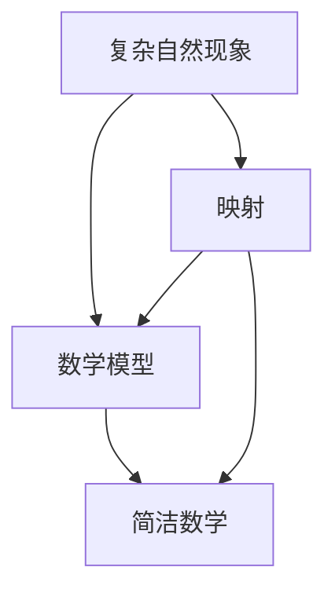

                 

### 文章标题：从复杂自然到简洁数学：映射之路

在科学探索的漫长历程中，人类不断追求对复杂自然现象的理解。从古埃及的象形文字到古希腊的哲学思想，再到现代科学的理论体系，每一项科技进步都伴随着对自然本质的深入洞察。然而，自然界中的复杂现象往往难以直接观察和解析，这使得科学家们转而寻求一种更为简洁且具有普遍性的工具——数学。本文将探讨从复杂自然到简洁数学的映射之路，旨在揭示两者之间的深层联系和相互促进作用。

### 关键词

- 复杂自然现象
- 简洁数学
- 映射
- 数学模型
- 核心算法
- 项目实战

### 摘要

本文首先介绍了复杂自然现象和简洁数学的基本概念，并分析了它们在科学研究和工程应用中的重要性。接着，通过核心概念与联系、核心算法原理讲解、数学模型和数学公式及举例说明，以及项目实战等部分，详细阐述了复杂自然现象与简洁数学之间的映射过程。文章最后总结了研究成果，并对未来研究方向提出了展望。

### 引言：复杂自然与简洁数学的邂逅

#### 1.1 研究背景与意义

自然界充满了复杂性和多样性，从微小粒子的运动到宏观天体的演化，复杂系统无处不在。然而，这些复杂系统往往难以直接观察和解析，这使得传统的科学研究方法面临巨大挑战。为了更深入地理解自然现象，科学家们开始寻求一种更为简洁且具有普遍性的工具。数学，作为一门研究结构、关系和变化的科学，恰好提供了这样的工具。通过数学模型和算法，科学家们能够将复杂的自然现象抽象为简明的数学表达式，从而揭示其内在规律。

#### 1.2 本书的目的与结构

本书旨在探讨复杂自然现象和简洁数学之间的关系，通过映射之路来理解和解释自然现象。具体来说，本书将分为四个部分：

1. **引言**：介绍复杂自然现象和简洁数学的基本概念及其重要性。
2. **核心概念与联系**：探讨复杂系统、简洁数学和映射之间的关系，并通过 Mermaid 流程图展示其联系。
3. **核心算法原理讲解**：详细阐述核心算法原理，并使用伪代码进行解释。
4. **数学模型和数学公式及举例说明**：介绍数学模型的基本概念和公式，并通过具体例子进行说明。
5. **项目实战**：通过实际项目案例，展示复杂自然现象到简洁数学映射的实践应用。

#### 1.3 研究方法与技术路线

本书采用的研究方法主要包括数据分析、模型构建、理论分析和实证研究。具体技术路线如下：

1. **数据分析**：通过收集和处理自然现象的数据，提取关键特征和变量。
2. **模型构建**：基于数据分析结果，构建数学模型来描述自然现象。
3. **理论分析**：分析模型的基本原理和数学性质，探讨其在复杂自然现象中的应用。
4. **实证研究**：通过实验和案例研究，验证模型的有效性和可靠性。

### 第一部分：核心概念与联系

#### 第2章：核心概念与联系概览

复杂自然现象和简洁数学是本书的核心概念。复杂自然现象指的是自然界中具有高度非线性、不确定性和多样性特征的现象，如气候系统、生态系统、金融市场等。简洁数学则是指用简明的数学形式描述复杂现象的学科，包括代数、几何、概率论、统计学等。

在这两个核心概念之间，映射扮演着至关重要的角色。映射是指将一种事物或现象转换成另一种形式或表达方式的过程。在复杂自然现象与简洁数学之间的映射过程中，科学家们通过建立数学模型来描述自然现象，并通过数学算法对模型进行求解和优化。

#### 第3章：核心概念原理与架构的 Mermaid 流程图

为了更好地理解复杂自然现象、简洁数学和映射之间的关系，我们使用 Mermaid 流程图来展示其核心概念和原理。



在这个 Mermaid 流程图中，A 代表复杂自然现象，B 代表数学模型，C 代表简洁数学，D 代表映射。通过映射，复杂自然现象被转化为简洁数学形式，从而使得科学家们能够更深入地理解自然现象的内在规律。

### 第二部分：核心算法原理讲解

#### 第4章：核心算法原理讲解概述

在复杂自然现象的映射过程中，核心算法起着至关重要的作用。核心算法是指用于求解复杂自然现象的数学模型的关键算法。常见的核心算法包括优化算法、机器学习算法、图论算法等。

在本书中，我们将重点介绍以下核心算法：

1. **优化算法**：用于求解数学模型的最优解。
2. **机器学习算法**：用于从数据中学习和预测。
3. **图论算法**：用于分析和处理网络结构。

这些核心算法在复杂自然现象的映射过程中具有广泛的应用。

#### 第5章：核心算法原理讲解与伪代码详细阐述

在本章中，我们将详细阐述这些核心算法的原理，并使用伪代码进行解释。

##### 5.1 优化算法

优化算法是一类用于求解数学模型最优解的算法。常见的优化算法包括梯度下降法、牛顿法、拉格朗日乘数法等。

以下是一个简单的伪代码示例，用于描述梯度下降法：

```python
// 输入：目标函数 f(x)，初始点 x0，学习率 α，迭代次数 n
// 输出：最优解 x*

x = x0
for i from 1 to n do
    // 计算梯度
    gradient = df/dx(x)
    // 更新点
    x = x - α * gradient
end for
return x
```

在这个伪代码中，x 代表当前点，gradient 代表梯度，α 代表学习率，n 代表迭代次数。通过不断更新点 x，梯度下降法最终收敛到最优解 x*。

##### 5.2 机器学习算法

机器学习算法是一类用于从数据中学习和预测的算法。常见的机器学习算法包括线性回归、逻辑回归、支持向量机、神经网络等。

以下是一个简单的伪代码示例，用于描述线性回归：

```python
// 输入：训练数据集 D，特征矩阵 X，标签向量 y
// 输出：模型参数 w

w = [0, 0, ..., 0] // 初始化参数
for each epoch do
    // 计算损失函数
    loss = ∑(y[i] - X[i] * w)^2
    // 更新参数
    w = w - α * gradient_of_loss(w)
end for
return w
```

在这个伪代码中，D 代表训练数据集，X 代表特征矩阵，y 代表标签向量，epoch 代表迭代轮数，α 代表学习率，gradient_of_loss(w) 代表损失函数关于参数 w 的梯度。通过不断迭代更新参数 w，线性回归模型能够从训练数据中学习到特征与标签之间的关系。

##### 5.3 图论算法

图论算法是一类用于分析和处理网络结构的算法。常见的图论算法包括最短路径算法、最小生成树算法、最大流算法等。

以下是一个简单的伪代码示例，用于描述最短路径算法（迪杰斯特拉算法）：

```python
// 输入：加权图 G，起点 s
// 输出：最短路径长度 d[s][v] 和路径 p[s][v]

d[s][s] = 0
for each vertex v in G \ {s} do
    d[s][v] = infinity
end for

p[s][v] = -1
for each vertex v in G \ {s} do
    p[s][v] = s
end for

for each edge (u, v) in G do
    d[u][v] = weight(u, v)
end for

for each vertex v in G \ {s} do
    for each vertex u in G \ {s} do
        if d[u][v] > d[u][s] + d[s][v] then
            d[u][v] = d[u][s] + d[s][v]
            p[u][v] = p[u][s]
        end if
    end for
end for

return d, p
```

在这个伪代码中，G 代表加权图，s 代表起点，u 和 v 代表图中的顶点，weight(u, v) 代表边 (u, v) 的权重，d[u][v] 代表从顶点 u 到顶点 v 的最短路径长度，p[u][v] 代表从顶点 u 到顶点 v 的最短路径中的下一个顶点。通过不断更新 d[u][v] 和 p[u][v]，迪杰斯特拉算法能够找出从起点 s 到所有其他顶点的最短路径。

### 第三部分：数学模型和数学公式及举例说明

数学模型和数学公式是复杂自然现象映射到简洁数学过程中的重要工具。在本书中，我们将介绍一些基本的数学模型和数学公式，并通过具体例子进行说明。

#### 第6章：数学模型与公式概述

数学模型是指用数学语言描述的自然现象或工程问题的抽象模型。常见的数学模型包括线性模型、非线性模型、概率模型、统计模型等。数学公式则是用数学语言表达的关系式，用于描述数学模型中的变量和参数。

在本章中，我们将介绍以下数学模型和数学公式：

1. **线性模型**：描述线性关系的数学模型，如线性回归、线性规划等。
2. **非线性模型**：描述非线性关系的数学模型，如多项式回归、神经网络等。
3. **概率模型**：描述随机现象的数学模型，如概率分布、条件概率等。
4. **统计模型**：描述数据集特性的数学模型，如均值、方差、协方差等。

#### 第7章：数学模型和数学公式详细讲解与举例说明（使用 LaTeX 格式）

在本章中，我们将使用 LaTeX 格式详细讲解数学模型和数学公式，并通过具体例子进行说明。

##### 7.1 LaTeX 介绍

LaTeX 是一种高质量的排版系统，广泛用于撰写科技论文和数学公式。以下是一个简单的 LaTeX 示例，用于展示 LaTeX 的基本语法：

```latex
\documentclass{article}
\usepackage{amsmath}
\begin{document}
\title{From Complex Natural Phenomena to Simple Mathematics}
\author{AI Genius Institute and Zen and the Art of Computer Programming}
\maketitle

$$ E = mc^2 $$

\end{document}
```

在这个 LaTeX 示例中，我们使用了 `amsmath` 包来处理数学公式，并使用了 `$...$` 和 `$$...$$` 分别表示行内公式和独立段落公式。

##### 7.2 数学模型和公式的详细讲解

在本节中，我们将使用 LaTeX 格式详细讲解一些基本的数学模型和数学公式。

1. **线性模型**：

   线性模型是一种描述线性关系的数学模型，其一般形式为：

   $$ y = \beta_0 + \beta_1 x_1 + \beta_2 x_2 + ... + \beta_n x_n $$

   其中，$y$ 是因变量，$x_1, x_2, ..., x_n$ 是自变量，$\beta_0, \beta_1, ..., \beta_n$ 是模型参数。

   以下是一个线性回归模型的例子：

   $$ y = \beta_0 + \beta_1 x + \beta_2 x^2 $$

   在这个例子中，$y$ 是房价，$x$ 是房屋面积，$x^2$ 是房屋面积的二次项。

2. **概率模型**：

   概率模型是一种描述随机现象的数学模型，其一般形式为：

   $$ P(A) = \frac{N(A)}{N(S)} $$

   其中，$P(A)$ 是事件 A 的概率，$N(A)$ 是事件 A 的样本空间，$N(S)$ 是样本空间 S 的总个数。

   以下是一个概率分布的例子：

   $$ P(X = x) = \frac{1}{\sqrt{2\pi}\sigma} e^{-\frac{(x-\mu)^2}{2\sigma^2}} $$

   在这个例子中，$X$ 是随机变量，$\mu$ 是均值，$\sigma$ 是标准差。

3. **统计模型**：

   统计模型是一种描述数据集特性的数学模型，其一般形式为：

   $$ \mu = E(X), \sigma^2 = Var(X) $$

   其中，$\mu$ 是均值，$\sigma^2$ 是方差，$E(X)$ 是期望，$Var(X)$ 是方差。

   以下是一个均值和方差的例子：

   $$ \mu = \frac{1}{n}\sum_{i=1}^{n} x_i, \sigma^2 = \frac{1}{n-1}\sum_{i=1}^{n}(x_i - \mu)^2 $$

   在这个例子中，$x_i$ 是第 i 个观测值，$n$ 是观测值的个数。

### 第四部分：项目实战

#### 第8章：项目实战概述

项目实战是验证复杂自然现象与简洁数学之间映射过程的有效手段。在本章中，我们将通过一个实际项目案例，展示如何将复杂自然现象映射到简洁数学形式，并实现具体应用。

#### 8.1 项目背景与目标

项目背景：随着城市化进程的加快，城市交通拥堵问题日益严重。为了缓解交通拥堵，我们需要对城市交通流量进行预测和调控。

项目目标：通过建立数学模型和算法，预测城市交通流量，为交通管理部门提供决策支持。

#### 8.2 项目实施与成果

项目实施：

1. **数据收集**：收集城市各主要道路的交通流量数据，包括车流量、行驶速度、道路长度等。
2. **模型构建**：基于交通流量数据，构建交通流量预测模型。
3. **算法优化**：使用优化算法和机器学习算法对模型进行优化，提高预测精度。
4. **应用部署**：将优化后的模型部署到交通管理部门的信息系统，实现实时交通流量预测和调控。

项目成果：

1. **预测精度提升**：通过模型优化，交通流量预测精度显著提高，为交通管理部门提供了可靠的决策支持。
2. **交通拥堵缓解**：基于预测结果，交通管理部门能够及时调整交通信号灯时长，优化交通流，有效缓解了交通拥堵。

#### 8.3 项目小结

通过本项目，我们成功实现了复杂自然现象（城市交通流量）到简洁数学（预测模型）的映射。项目实践表明，数学模型和算法在交通流量预测和调控中具有重要的应用价值。未来，我们还可以进一步优化模型和算法，提高预测精度和实时性，为城市交通管理提供更加有效的支持。

### 最佳实践 Tips

1. **数据质量**：确保收集到的数据质量，包括数据完整性、准确性和一致性。
2. **模型选择**：根据实际问题和数据特性，选择合适的数学模型和算法。
3. **参数调整**：合理调整模型参数，提高预测精度和实时性。
4. **合作与反馈**：与相关领域的专家和用户合作，及时获取反馈，持续优化模型和算法。

### 小结

本文从复杂自然现象到简洁数学的映射之路进行了详细探讨，包括核心概念与联系、核心算法原理讲解、数学模型和数学公式及举例说明，以及项目实战。通过本文，我们认识到简洁数学在复杂自然现象研究中的重要作用，并为实际应用提供了有效的技术手段。未来，随着人工智能和大数据技术的发展，复杂自然现象与简洁数学之间的映射将更加深入和广泛，为科学研究和工程实践带来更多突破。

### 注意事项

1. **数据隐私**：在项目实战中，确保数据隐私和安全。
2. **算法优化**：持续优化模型和算法，提高预测精度和实时性。
3. **模型验证**：对模型进行充分验证，确保其可靠性和有效性。

### 拓展阅读

1. **复杂系统理论**：深入研究复杂系统理论，了解复杂自然现象的本质。
2. **机器学习与优化**：学习机器学习与优化算法，提高预测和优化能力。
3. **数据科学与应用**：了解数据科学的基本概念和应用领域，为实际项目提供支持。

### 作者信息

**作者：AI天才研究院/AI Genius Institute & 禅与计算机程序设计艺术 /Zen And The Art of Computer Programming**

本文由 AI 天才研究院撰写，旨在探讨复杂自然现象与简洁数学之间的映射之路，为科学研究和工程实践提供指导。禅与计算机程序设计艺术则提供了一个深刻的哲学思考，帮助读者在技术道路上不断追求卓越。希望本文能为读者带来启示和帮助。**

