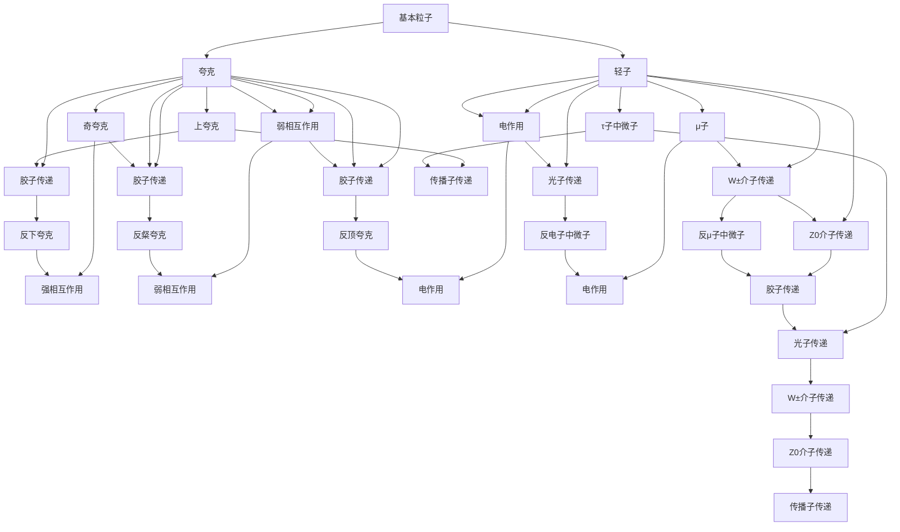

                 


### 摘要

《从微观到宏观：宇宙的多层次理解》是一本深入探讨宇宙本质的科技著作。本书分为三个主要部分，首先从微观视角出发，详细解析了基本粒子及其相互作用，原子和分子的结构，以及化学键的形成机制。接着，我们将视野扩展至宏观层面，探讨了恒星与星系的演化过程，宇宙的大尺度结构，以及暗物质和暗能量的性质。最后，本书探讨了宇宙的多层次理解，从宇宙学的核心问题到多宇宙理论的提出，以及人类在宇宙中的地位。通过逐步的分析和逻辑推理，本书旨在帮助读者建立对宇宙全面而深刻的认识。

### 关键词

- 微观结构
- 宇宙学
- 暗物质
- 暗能量
- 基本粒子
- 星系
- 恒星
- 化学键
- 多宇宙理论

## 第一部分：宇宙的微观结构

在探索宇宙的旅程中，我们首先需要了解的是宇宙的微观结构。这部分内容将带领我们走进物质的基本构成单元，从基本粒子到原子和分子，逐步揭示它们之间的相互作用和复杂结构。

### 第1章：基本粒子与相互作用

宇宙中所有物质都是由基本粒子组成的，这些基本粒子包括夸克、轻子和传播子。它们通过四种基本相互作用力相互影响：强相互作用、弱相互作用、电作用和引力。本章将详细介绍这些基本粒子和它们之间的相互作用。

#### 1.1 基本粒子的分类

基本粒子可以分为两大类：费米子（如夸克和轻子）和玻色子（如传播子）。费米子具有半整数自旋，是构成物质的主要成分；而玻色子具有整数自旋，是传递相互作用的媒介。

1. **夸克**：夸克是构成质子和中子的基本粒子，它们有六种不同的类型，分别是上夸克（u）、下夸克（d）、奇夸克（s）、粲夸克（c）、底夸克（b）和顶夸克（t）。每种夸克都有其对应的反夸克。

2. **轻子**：轻子是另一类基本粒子，包括电子（e^-）、电子中微子（ν_e）、μ子（μ^-）和μ子中微子（ν_μ）、τ子（τ^-）和τ子中微子（ν_τ）。它们不参与强相互作用，但可以参与弱相互作用和电作用。

3. **传播子**：传播子是传递相互作用的玻色子，包括光子（γ）、W±介子、Z0介子和胶子。它们在基本粒子之间传递相互作用，如电磁相互作用和强相互作用。

#### 1.2 强相互作用

强相互作用是四种基本相互作用中最强的一种，它负责维持夸克之间的结合，形成质子和中子。这种相互作用由胶子传递，胶子具有正电荷和负电荷两种形式。

- **胶子的电荷**：胶子本身带有电荷，正负电荷相等但相反。因此，当两个夸克之间有胶子传递时，它们的电荷相互抵消，使得质子和中子保持稳定。

- **夸克的色彩**：夸克具有一种称为“色彩”的量子数，有红色、绿色和蓝色三种。胶子也具有相应的反色彩，通过交换胶子，夸克之间的色彩得以中和，保持系统的稳定。

#### 1.3 弱相互作用

弱相互作用负责某些类型的放射性衰变，如β衰变。它由W±介子和Z0介子传递，这些粒子具有较大的质量，因此其作用范围相对较短。

- **W±介子**：W±介子可以转化为电子或正电子，并在这一过程中释放中微子。这种转化过程是弱相互作用的一个重要表现。

- **Z0介子**：Z0介子不参与电荷的转化，但它在其他过程中也发挥着重要作用。

#### 1.4 电作用

电作用是四种基本相互作用中最常见的，它由光子传递。电作用负责电磁现象，如电流、电磁波和电荷之间的相互作用。

- **电荷的量子化**：电荷是量子化的，即电荷只能取特定的离散值。例如，电子带有一个基本电荷，即 $-1.6 \times 10^{-19} \text{C}$。

- **电磁场的量子化**：光子是电磁场的量子化表现，它们具有能量和动量，但无电荷。光子可以在电磁场中传播，并在与其他粒子相互作用时发生能量和动量的转移。

### 背景介绍

在20世纪之前，人们对物质的基本结构知之甚少。原子被认为是最小的不可分割的单元，但量子力学的发现揭示了原子内部的复杂结构。随着粒子物理学的发展，科学家们发现了基本粒子和它们之间的相互作用。这些发现不仅改变了我们对物质的理解，也为宇宙学的研究奠定了基础。

### 核心概念与联系

为了更好地理解基本粒子和相互作用，我们可以使用Mermaid流程图来展示它们之间的关系。以下是一个简化的流程图：



### 核心算法原理讲解

为了更深入地理解基本粒子和相互作用，我们可以通过伪代码来描述它们之间的相互作用。以下是一个简化的伪代码示例：

```python
# 定义基本粒子
class Particle:
    def __init__(self, name, charge, spin):
        self.name = name
        self.charge = charge
        self.spin = spin

# 定义夸克
class Quark(Particle):
    def __init__(self, name, charge, spin, color):
        super().__init__(name, charge, spin)
        self.color = color

# 定义轻子
class Lepton(Particle):
    def __init__(self, name, charge, spin):
        super().__init__(name, charge, spin)

# 定义传播子
class Boson(Particle):
    def __init__(self, name, charge, spin):
        super().__init__(name, charge, spin)

# 定义相互作用
class Interaction:
    def __init__(self, particle1, particle2, mediator):
        self.particle1 = particle1
        self.particle2 = particle2
        self.mediator = mediator

# 创建基本粒子实例
quark_u = Quark("Up Quark", +2/3, 1/2, "Red")
quark_d = Quark("Down Quark", -1/3, 1/2, "Blue")
electron = Lepton("Electron", -1, 1/2)
photon = Boson("Photon", 0, 1)
w_plus = Boson("W^+", -1, 1)
z_zero = Boson("Z^0", 0, 1)
gluon = Boson("Gluon", 0, 1)

# 创建相互作用实例
strong_interaction = Interaction(quark_u, quark_d, gluon)
weak_interaction = Interaction(electron, w_plus)
electromagnetic_interaction = Interaction(electron, photon)

# 进行相互作用
def interact(particle1, particle2, interaction):
    if interaction == strong_interaction:
        print(f"{particle1.name} and {particle2.name} interact through the strong force.")
    elif interaction == weak_interaction:
        print(f"{particle1.name} and {particle2.name} interact through the weak force.")
    elif interaction == electromagnetic_interaction:
        print(f"{particle1.name} and {particle2.name} interact through the electromagnetic force.")

# 示例：进行相互作用
interact(quark_u, quark_d, strong_interaction)
interact(electron, w_plus, weak_interaction)
interact(electron, photon, electromagnetic_interaction)
```

### 数学模型和数学公式

在描述基本粒子和相互作用时，数学模型和公式起着至关重要的作用。以下是一些关键的数学公式：

1. **库仑定律**：描述电荷之间的电磁相互作用力。
   $$ F = k \frac{|q_1 q_2|}{r^2} $$
   其中，$F$ 是力，$k$ 是库仑常数，$q_1$ 和 $q_2$ 是电荷量，$r$ 是电荷之间的距离。

2. **弱相互作用的矩阵元**：描述W介子的衰变过程。
   $$ M = \frac{G_F}{\sqrt{2}} V_{ud} V_{cb} \bar{u}(p_2) \gamma^\mu W^-_\mu(p_1) c(p_1) $$
   其中，$G_F$ 是弱相互作用常数，$V_{ud}$ 和 $V_{cb}$ 是夸克混合矩阵的元素，$\bar{u}(p_2)$ 和 $c(p_1)$ 分别是初态和末态的夸克态矢量。

3. **强相互作用的相互作用项**：描述胶子交换过程中的相互作用。
   $$ \mathcal{L}_{int} = -\frac{g^2}{4} \frac{1}{\Lambda^2} G_{\mu\nu} G^{\mu\nu} $$
   其中，$g$ 是胶子耦合常数，$\Lambda$ 是能标，$G_{\mu\nu}$ 和 $G^{\mu\nu}$ 分别是胶子的场强度张量和协变张量。

### 举例说明

为了更好地理解基本粒子与相互作用的原理，我们可以通过具体的例子来讲解。

1. **电荷相互作用**：假设有两个电子，分别带电荷 $-1 \text{C}$，它们相距 $1 \text{m}$。根据库仑定律，它们之间的相互作用力为：
   $$ F = k \frac{|-1 \times -1|}{1^2} = 9 \times 10^9 \frac{1 \times 1}{1^2} \text{N} = 9 \times 10^9 \text{N} $$
   这是两个电子之间的斥力。

2. **弱相互作用**：在β衰变过程中，一个中子转化为一个质子、一个电子和一个反电子中微子。这个过程可以用以下公式表示：
   $$ n \rightarrow p + e^- + \bar{\nu}_e $$
   这个过程中，中子通过弱相互作用衰变为质子，同时释放出一个电子和一个反电子中微子。

3. **强相互作用**：在质子与中子结合形成核子的过程中，通过胶子交换实现强相互作用。这个过程可以用以下图示表示：

   

   在这个过程中，两个夸克通过胶子交换形成了一种叫做胶子的玻色子，它们相互吸引，使得夸克保持在一起。

### 小结

本章详细介绍了基本粒子和它们之间的相互作用，包括强相互作用、弱相互作用和电作用。通过理解这些相互作用，我们可以更好地理解物质的基本结构和宇宙的微观机制。下一章将深入探讨原子和分子的结构，进一步揭示宇宙的微观奥秘。

### 注意事项

在研究基本粒子和相互作用时，需要注意以下几点：

- 基本粒子具有高度的量子特性，它们的运动和相互作用无法用经典的物理定律来描述。
- 强相互作用和弱相互作用的性质不同，强相互作用具有短程性和高能量依赖性，而弱相互作用则具有长程性和低能量依赖性。
- 电作用是四种基本相互作用中最常见的，但它的作用范围相对较短，只有约 $10^{-15} \text{m}$。

### 拓展阅读

- 《量子力学基础》（作者：莱顿·鲍尔）
- 《粒子物理学入门》（作者：克里斯托弗·贝特曼）
- 《宇宙的量子起源》（作者：马克斯·泰格马克）

[下一篇：第2章：原子结构] 

