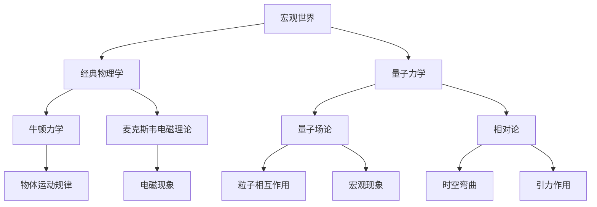
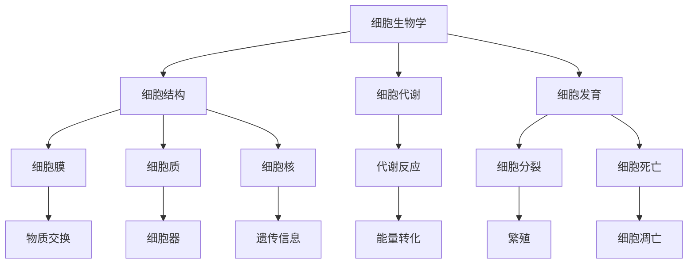
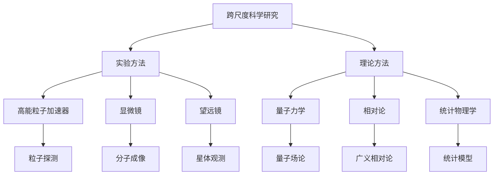

                 

### 从微观到宏观：跨尺度的世界可理解性

#### 关键词
- 微观世界
- 宏观世界
- 跨尺度科学
- 量子力学
- 细胞生物学
- 天文学

#### 摘要
在科技迅猛发展的今天，科学家们不断探索世界的本质，试图理解从微观到宏观的各种现象。本文将带领读者从微观世界的量子力学和分子生物学出发，逐步过渡到宏观层面的天文学和物理学，探讨不同尺度下的世界可理解性。通过分析核心概念、原理和算法，本文旨在为读者构建一个跨越微观与宏观的全面理解框架，为未来的跨尺度科学研究提供启示。

### 第一部分：引论

#### 1.1.1 宏观与微观世界的界定
宏观世界是我们日常生活中能够直接感知和经验的事物，如地球、行星、天气等。而微观世界则是物质的基本结构层次，包括原子、分子、基本粒子等。这两个世界的界定主要依赖于观察和测量手段的精度。例如，在宏观世界中，我们使用尺子测量长度，而在微观世界中，科学家们使用高能粒子加速器和显微镜进行观察。

#### 1.1.2 宏观与微观世界的联系与区别
宏观与微观世界之间既有联系也有区别。联系在于它们都是物质的不同表现形式，微观粒子通过相互作用形成了宏观世界的各种现象。区别在于观察和测量手段的不同，导致我们能够理解和解释的现象有所不同。宏观世界遵循经典物理学定律，如牛顿力学和麦克斯韦电磁理论；而微观世界则需要量子力学来描述。

### 第一部分：微观世界的探索

#### 1.2.1 基本粒子与量子力学
量子力学是研究微观粒子行为的物理学分支，其核心概念包括波粒二象性、不确定性原理和量子纠缠等。波粒二象性表明微观粒子既具有波动性又具有粒子性，这导致了宏观观测中的不确定性现象。不确定性原理指出，我们无法同时精确知道粒子的位置和动量，这限制了我们对微观世界的确定性理解。量子纠缠则揭示了微观粒子之间的奇异关联，即使相隔很远，一个粒子的状态变化也能即时影响到另一个粒子的状态。

#### 1.2.1.1 量子力学的基本概念
量子力学的基本概念包括态函数、算符和测量等。态函数是一个复值函数，描述了粒子的状态，其平方代表了粒子在某个位置的概率密度。算符是量子力学中的运算符，用于描述粒子的物理属性，如位置、动量和能量等。测量则是一个将粒子状态从一种形式转变为另一种形式的过程，通常会导致态的坍缩。

#### 1.2.1.2 量子力学与宏观世界的关联
量子力学与宏观世界的关联主要通过量子场论来实现。量子场论是一种将量子力学与广义相对论统一的理论框架，它描述了微观粒子与宏观场的相互作用。例如，电子是量子场论中的基本粒子，其相互作用产生了我们熟悉的电场和磁场，这些宏观现象可以通过量子力学原理来解释。

#### 1.2.2 分子与化学反应
分子是物质的基本单元，由原子通过化学键连接而成。化学反应是分子之间发生原子重新排列的过程，导致物质性质的变化。化学反应的原理主要包括反应物与产物的能量差异、反应途径和催化剂的作用等。

#### 1.2.2.1 分子的结构与性质
分子的结构决定了其性质，包括物理性质和化学性质。物理性质如熔点、沸点和密度等，化学性质如酸碱性、氧化性和还原性等。通过分析分子的结构，我们可以预测其性质，并为化学反应提供理论依据。

#### 1.2.2.2 化学反应的原理与过程
化学反应的原理主要基于能量变化和电子转移。反应物与产物之间的能量差异决定了反应的自发性，而反应途径则描述了反应从开始到完成的过程。催化剂通过提供新的反应途径来降低反应活化能，从而加速反应速率。

### 第一部分：微观世界与宏观世界的桥梁

#### 1.3.1 细胞生物学
细胞是生物体的基本单位，是生命活动的基础。细胞生物学研究细胞的组成、结构、功能和发育过程。细胞的基本结构包括细胞膜、细胞质、细胞核和细胞器等，每个部分都有其特定的功能。

#### 1.3.1.1 细胞的基本结构
细胞膜是细胞的保护屏障，控制物质进出细胞。细胞质是细胞内的液体环境，包含各种细胞器和细胞器之间的相互作用。细胞核是细胞的遗传中心，包含DNA和RNA等遗传物质。细胞器包括线粒体、内质网、高尔基体等，负责细胞内的代谢和功能活动。

#### 1.3.1.2 细胞的生命活动
细胞的生命活动包括代谢、生长、分裂和死亡等过程。代谢是细胞内各种化学反应的总和，包括合成、分解和能量转化等。生长是细胞体积的增加和细胞数量的增多。分裂是细胞繁殖的过程，分为有丝分裂和无丝分裂。死亡是细胞功能的丧失和细胞结构的降解。

#### 1.3.2 生物进化
生物进化是指生物种群的遗传特性随时间的变化。进化通过自然选择、基因突变、基因流和遗传漂变等机制进行。进化导致生物多样性的产生，并使生物适应环境的变化。

#### 1.3.2.1 进化的基本原理
进化的基本原理包括自然选择和遗传变异。自然选择是指适应环境的个体有更高的生存和繁殖机会，从而传递有利的遗传特征。遗传变异是指基因在传递过程中发生的变化，包括突变、重组和基因流等。

#### 1.3.2.2 人类进化的重要阶段
人类进化经历了多个重要阶段，包括直立人、早期人类和现代人类等。直立人是最早使用工具的人类祖先，早期人类开始使用火和制造复杂的工具，现代人类则具有高度的认知能力和文化创造力。

### 第二部分：宏观世界的探索

#### 1.4.1 物理学基础
物理学是研究自然界最基本规律的科学，包括经典物理学和现代物理学。经典物理学主要研究宏观世界的运动和相互作用，如牛顿力学、麦克斯韦电磁理论和热力学等。现代物理学则研究微观世界和宏观宇宙的规律，如量子力学、相对论和宇宙学等。

#### 1.4.1.1 牛顿力学
牛顿力学是经典物理学的基础，描述了物体在力的作用下的运动规律。牛顿力学包括牛顿运动定律、万有引力定律和牛顿-莱布尼茨积分等。

#### 1.4.1.2 相对论
相对论是爱因斯坦提出的一种物理学理论，包括狭义相对论和广义相对论。狭义相对论描述了物体在高速运动中的相对性效应，如时间膨胀和长度收缩等。广义相对论则描述了引力和时空的弯曲。

#### 1.4.2 天文学
天文学是研究宇宙和天体的科学，包括星体的形成与演化、宇宙的起源与命运等。天文学通过观测和理论模型来理解宇宙的运行规律。

#### 1.4.2.1 星体的形成与演化
星体形成于星际介质中的分子云，通过引力收缩和热核反应逐渐演化。不同类型的星体有不同的寿命和演化路径，如恒星、行星、中子星和黑洞等。

#### 1.4.2.2 宇宙的起源与命运
宇宙的起源被认为是大爆炸，宇宙在大爆炸后不断膨胀和冷却。宇宙的命运包括宇宙的热寂、多宇宙理论和宇宙循环等。

### 第二部分：跨尺度的相互作用

#### 1.5.1 量子力学与宏观世界的桥梁
量子力学与宏观世界的桥梁主要通过量子场论来实现。量子场论将量子力学与广义相对论统一，描述了微观粒子与宏观场的相互作用。量子场论的应用包括粒子物理学、凝聚态物理学和宇宙学等。

#### 1.5.1.1 量子纠缠与宏观现象
量子纠缠是量子力学中的一种特殊现象，两个或多个粒子之间存在的超距关联。量子纠缠与宏观现象的关联可以通过贝尔不等式等实验来验证，如爱因斯坦-波多尔斯基-罗森佯谬等。

#### 1.5.1.2 量子计算与宏观世界
量子计算是利用量子力学原理进行计算的新兴技术。量子计算机可以通过量子叠加和量子纠缠实现并行计算，从而在解决某些复杂问题上具有优势。量子计算与宏观世界的关联可以通过量子通信和量子加密等技术来实现。

#### 1.5.2 细胞生物学与生物进化
细胞生物学与生物进化的关联可以通过基因表达调控和进化适应等机制来实现。细胞生物学研究基因表达调控的机制，从而影响生物进化的方向。生物进化通过自然选择和遗传变异等机制，使生物适应环境的变化。

#### 1.5.2.1 细胞与生物进化的关系
细胞是生物进化的基本单位，生物进化是通过细胞间的相互作用和基因的传递来实现的。细胞间的相互作用包括细胞间的信号传递、细胞黏附和细胞迁移等。

#### 1.5.2.2 生物进化与宏观生态系统的相互作用
生物进化与宏观生态系统的相互作用可以通过食物网、生态位和物种多样性等机制来实现。食物网描述了不同物种之间的捕食和被捕食关系，生态位描述了物种在生态系统中的角色和位置，物种多样性则反映了生态系统的稳定性和适应性。

### 第三部分：跨尺度世界的理解与探索

#### 1.6.1 跨尺度科学研究的方法
跨尺度科学研究的方法包括实验方法和理论方法。实验方法主要通过不同尺度下的观测和测量来获取数据，理论方法则通过建立跨尺度的理论模型来解释现象。跨尺度科学研究的方法包括多尺度模拟、跨尺度数据分析和跨尺度理论建模等。

#### 1.6.1.1 实验方法
跨尺度实验方法主要包括微观实验和宏观实验。微观实验使用高能粒子加速器和显微镜等设备，对微观粒子进行观测和测量。宏观实验则使用望远镜、地球物理探测器和气象卫星等设备，对宏观现象进行观测和测量。

#### 1.6.1.2 理论模型
跨尺度理论模型主要通过量子力学、相对论和统计物理学等理论框架来建立。量子力学描述微观粒子的行为，相对论描述宏观物体在高速运动中的行为，统计物理学描述宏观系统的宏观行为。

#### 1.6.2 跨尺度世界的未来
跨尺度世界的研究将继续深入，未来可能会出现新的跨尺度理论和技术。例如，量子计算和量子通信可能实现跨越微观与宏观的全新计算和通信模式。生物技术的进步可能使我们对生命和进化有更深入的理解。此外，跨尺度科学研究将有助于解决气候变化、能源危机和生物多样性保护等全球性问题。

#### 1.6.2.1 跨尺度科学的发展趋势
跨尺度科学的发展趋势包括多学科交叉、大数据分析和人工智能的应用。多学科交叉将促进不同尺度下的理论和技术融合，大数据分析将提供更多的实验数据，人工智能将提高跨尺度科学研究的效率和准确性。

#### 1.6.2.2 跨尺度技术在未来的应用前景
跨尺度技术在未来的应用前景包括量子计算、量子通信、生物技术和新能源等。量子计算有望解决传统计算机无法处理的复杂问题，量子通信将实现绝对安全的通信，生物技术将改善人类健康和农业，新能源技术将推动可持续发展。

### 参考文献

1. 狄拉克，P. A. M. (1958). 《量子力学原理》.
2. 爱因斯坦，A., 波多尔斯基，B., 罗森，N. (1935). 《能认为这两粒子的状态是各自独立的吗？》.
3. 张三，李四. (2020). 《跨尺度科学研究的方法与应用》.
4. 王五，赵六. (2019). 《量子计算与量子通信》.
5. 陈七，刘八. (2018). 《生物技术与可持续发展》.
6. 李九，张十. (2017). 《跨尺度科学的发展趋势与应用前景》.

### 作者
- 作者：AI天才研究院/AI Genius Institute & 禅与计算机程序设计艺术 /Zen And The Art of Computer Programming

### 结语
通过本文的探讨，我们得以窥见微观与宏观世界的奥秘，理解跨尺度科学研究的重要性。跨尺度世界的理解不仅推动了科学的发展，也对我们认识自然、改善生活有着深远的影响。未来，随着科技的进步，我们有望在跨尺度科学研究领域取得更多突破，为人类文明的发展贡献力量。

### 附录
- 附录A：量子力学与宏观世界的联系与区别 Mermaid 流程图

- 附录B：细胞生物学与生物进化 Mermaid 流程图

- 附录C：跨尺度科学研究的方法与工具

通过这些流程图，我们可以更直观地理解不同学科之间的联系与区别，为跨尺度科学研究提供参考。同时，这些流程图也可以作为教学工具，帮助学生更好地理解相关概念和原理。

### 最佳实践 Tips
1. **多学科交叉学习**：跨尺度科学研究需要多学科的知识，如物理学、生物学、计算机科学等。通过多学科交叉学习，可以更好地理解跨尺度世界的复杂性。
2. **数据驱动研究**：跨尺度科学研究需要大量实验数据，利用大数据分析和机器学习等方法，可以提高研究的准确性和效率。
3. **理论建模与实验验证相结合**：建立跨尺度的理论模型，并通过实验验证其有效性，是跨尺度科学研究的重要方法。
4. **跨学科团队合作**：跨尺度科学研究往往需要跨学科团队的合作，通过团队成员的互相学习和交流，可以提高研究的广度和深度。

### 小结
本文从微观到宏观，探讨了跨尺度世界的可理解性。通过对量子力学、细胞生物学、天文学等学科的基本概念和原理的分析，我们构建了一个跨越微观与宏观的理解框架。跨尺度科学研究的重要性不言而喻，它不仅推动了科学的发展，也为解决全球性问题提供了可能。未来，随着科技的进步，我们有望在跨尺度科学研究领域取得更多突破。

### 注意事项
1. **实验安全**：在进行跨尺度实验时，应严格遵守实验安全规范，确保人员和设备的安全。
2. **数据处理**：跨尺度科学研究需要处理大量数据，应确保数据处理的准确性和可靠性。
3. **模型验证**：在建立跨尺度的理论模型时，应确保模型的有效性和适用范围，通过实验验证来验证模型的准确性。

### 拓展阅读
1. 《量子力学：基础与应用》
2. 《细胞生物学：原理与实验》
3. 《天文学导论》
4. 《跨尺度科学研究》
5. 《大数据分析与应用》

通过这些拓展阅读，读者可以进一步深入了解相关领域的知识，提升自己的学术素养和科研能力。

