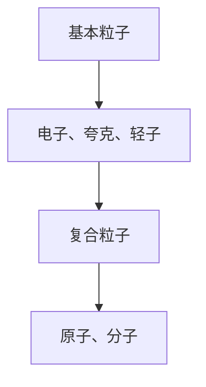
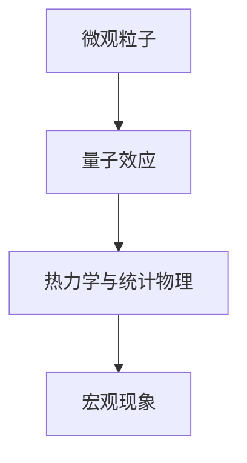
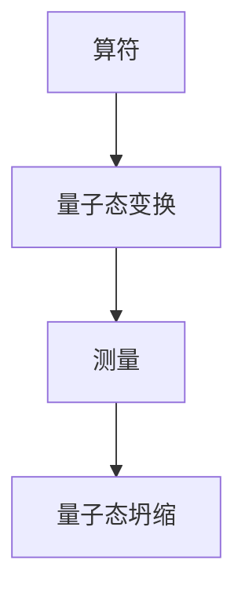
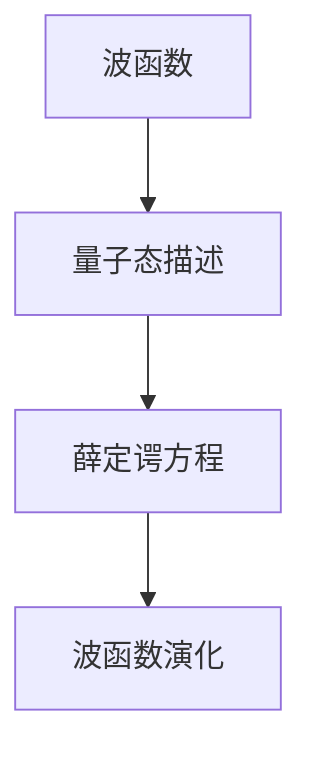
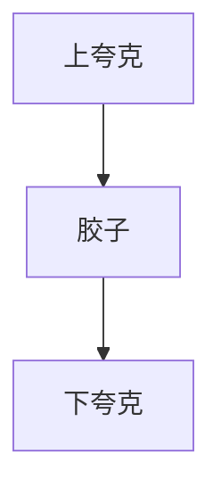
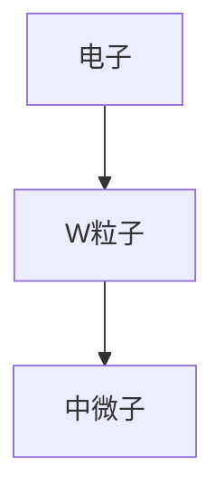

                 


### 从微观粒子到宇宙学：跨尺度的统一世界理解

#### 关键词

量子力学、微观粒子、宇宙学、跨尺度、统一理论、粒子物理学、黑洞、引力波、宇宙背景辐射

#### 摘要

本文旨在探讨从微观粒子到宇宙学的跨尺度统一世界理解。首先，我们将深入介绍微观粒子的基本概念和量子力学基础，包括量子态与量子叠加原理、算符与测量等内容。接着，我们将会讨论粒子物理学的基础知识，如强相互作用、弱相互作用和电磁相互作用。然后，我们将转向宇宙学的基础知识，探讨宇宙的起源与演化、黑洞与引力波等主题。最后，我们将分析微观粒子与宇宙学之间的联系，探讨跨尺度统一理论的潜在途径，并对未来宇宙学研究的方向进行展望。

## 第一部分：微观粒子世界

### 第1章：微观粒子的基本概念

#### 1.1 微观粒子的定义与特性

**背景介绍：**

微观粒子，指的是尺度在原子核以下的基本粒子，包括电子、夸克、轻子等。它们是构成物质的基本单元，具有独特的物理性质和相互作用。

**核心概念与联系：**

在量子力学中，微观粒子的定义与特性可以从以下几个角度来理解：

1. **量子态与波函数：** 微观粒子处于量子态，其状态可以用波函数来描述。波函数包含了粒子的位置、动量和自旋等所有物理信息。
   
   Mermaid流程图：
   ```mermaid
   graph TD
   A[量子态] --> B[波函数]
   B --> C[位置、动量、自旋]
   ```

2. **不确定性原理：** 微观粒子遵循不确定性原理，即无法同时精确测量粒子的位置和动量。这一原理揭示了微观粒子的量子性质。

3. **量子叠加原理：** 微观粒子可以同时处于多个状态的叠加，直到进行测量时才会“坍缩”到一个确定的状态。

**核心算法原理讲解：**

1. **量子态的表示：** 使用复数来表示量子态，例如一个电子的状态可以表示为 $|\psi\rangle = \alpha|0\rangle + \beta|1\rangle$，其中 $|\alpha|^2$ 和 $|\beta|^2$ 分别表示态 $|0\rangle$ 和 $|1\rangle$ 的概率。
   
   ```python
   import numpy as np
   
   alpha = 1 / np.sqrt(2)
   beta = 1 / np.sqrt(2)
   
   psi = alpha * np.array([1, 0]) + beta * np.array([0, 1])
   ```

2. **量子态的叠加与测量：** 在没有进行测量之前，微观粒子处于叠加态。进行测量时，粒子状态会“坍缩”到其中一个确定的状态。

   ```python
   import numpy as np
   
   psi = np.array([1, 0])
   
   # 测量结果
   outcome = np.random.choice([0, 1], p=[0.5, 0.5])
   
   # 坍缩到确定状态
   if outcome == 0:
       psi = np.array([1, 0])
   else:
       psi = np.array([0, 1])
   ```

**数学模型和数学公式：**

1. **波函数的演化：** 微观粒子的波函数遵循薛定谔方程，即 $$ i\hbar \frac{\partial \psi(x,t)}{\partial t} = \hat{H} \psi(x,t) $$
   
   其中，$\hbar$ 是约化普朗克常数，$\hat{H}$ 是哈密顿算符。

2. **态的叠加：** 量子态可以表示为多个状态的线性叠加，即 $$ \psi(x,t) = \int \psi(k,t) e^{ikx} dk $$
   
   其中，$\psi(k,t)$ 是波函数的傅里叶变换。

**举例说明：**

一个电子的自旋态可以用波函数 $|\psi\rangle = \alpha|0\rangle + \beta|1\rangle$ 来描述，其中 $|0\rangle$ 和 $|1\rangle$ 分别表示自旋向上和自旋向下。在没有进行测量之前，电子的自旋处于叠加态。当进行测量时，电子的自旋会坍缩到其中一个确定的状态。

#### 1.2 微观粒子的分类

**核心概念与联系：**

微观粒子可以分为基本粒子和复合粒子。基本粒子如电子、夸克和轻子等是构成物质的基本单元，而复合粒子如原子、分子等则是由基本粒子组成的。

Mermaid流程图：


**核心算法原理讲解：**

1. **费米子与玻色子：** 微观粒子根据统计性质可以分为费米子（如电子、夸克）和玻色子（如光子、介子）。费米子遵循费米-狄拉克统计，玻色子遵循玻色-爱因斯坦统计。

2. **泡利不相容原理：** 费米子不能处于相同的量子态，这一原理导致了原子和分子结构的形成。

**数学模型和数学公式：**

1. **费米-狄拉克分布：** 费米子在不同能量下的分布可以用费米-狄拉克分布来描述，即 $$ \bar{n}_{f} = \frac{1}{e^{\beta \epsilon_F} - 1} $$
   
   其中，$\epsilon_F$ 是费米能级，$\beta = 1/k_B T$，$k_B$ 是玻尔兹曼常数，$T$ 是温度。

2. **玻色-爱因斯坦分布：** 玻色子在不同能量下的分布可以用玻色-爱因斯坦分布来描述，即 $$ \bar{n}_{b} = \frac{1}{e^{\beta \epsilon_B} - 1} $$
   
   其中，$\epsilon_B$ 是玻色能级。

**举例说明：**

在常温下，电子遵循费米-狄拉克分布，其分布情况可以用以下公式来描述：
```latex
\bar{n}_{f} = \frac{1}{e^{\beta \epsilon_F} - 1}
```
其中，$\epsilon_F$ 是费米能级，$\beta = 1/k_B T$。

而光子作为玻色子，其分布情况可以用以下公式来描述：
```latex
\bar{n}_{b} = \frac{1}{e^{\beta \epsilon_B} - 1}
```
其中，$\epsilon_B$ 是玻色能级。

#### 1.3 微观粒子与宏观物体的联系

**核心概念与联系：**

微观粒子与宏观物体的联系主要体现在量子效应与宏观现象之间的相互作用。从微观粒子到宏观物体的过渡，需要考虑热力学与统计物理的相关概念。

Mermaid流程图：


**核心算法原理讲解：**

1. **量子态的统计分布：** 在宏观物体中，微观粒子的量子态会形成统计分布，进而影响宏观现象。

2. **热力学基本方程：** 热力学基本方程描述了系统的能量、熵、自由能等物理量之间的关系。

3. **相变与凝聚态物质：** 在一定条件下，微观粒子的相互作用会导致相变，形成各种凝聚态物质。

**数学模型和数学公式：**

1. **熵：** 熵是系统混乱程度的度量，可以用以下公式来描述：
   ```latex
   S = -k_B \sum_{i} p_i \ln p_i
   ```
   其中，$p_i$ 是粒子 $i$ 的概率分布。

2. **自由能：** 自由能是系统在恒温恒压条件下可做非体积功的能量，可以用以下公式来描述：
   ```latex
   F = U - TS
   ```
   其中，$U$ 是内能，$T$ 是温度，$S$ 是熵。

3. **相变条件：** 相变发生的条件可以用以下公式来描述：
   ```latex
   \left( \frac{\partial F}{\partial T} \right)_{V} = 0, \quad \left( \frac{\partial F}{\partial V} \right)_{T} = 0
   ```

**举例说明：**

在一个晶体结构中，微观粒子的振动模式会导致热传导现象。根据量子力学，振动模式可以用量子态来描述。这些量子态的分布会影响热传导的速率，进而影响宏观物体的温度分布。

## 第二部分：宇宙学基础

### 第2章：量子力学基础

#### 2.1 量子态与量子叠加原理

**背景介绍：**

量子态与量子叠加原理是量子力学的基础。量子态描述了微观粒子的状态，量子叠加原理则表明微观粒子可以同时处于多个状态的叠加。

**核心概念与联系：**

量子态与量子叠加原理的关系可以从以下几个角度来理解：

1. **量子态：** 微观粒子处于量子态，其状态可以用波函数来描述。波函数包含了粒子的位置、动量和自旋等所有物理信息。
   
   Mermaid流程图：
   ```mermaid
   graph TD
   A[量子态] --> B[波函数]
   B --> C[位置、动量、自旋]
   ```

2. **量子叠加原理：** 微观粒子可以同时处于多个状态的叠加，直到进行测量时才会“坍缩”到一个确定的状态。

**核心算法原理讲解：**

1. **量子态的表示：** 使用复数来表示量子态，例如一个电子的状态可以表示为 $|\psi\rangle = \alpha|0\rangle + \beta|1\rangle$，其中 $|\alpha|^2$ 和 $|\beta|^2$ 分别表示态 $|0\rangle$ 和 $|1\rangle$ 的概率。
   
   ```python
   import numpy as np
   
   alpha = 1 / np.sqrt(2)
   beta = 1 / np.sqrt(2)
   
   psi = alpha * np.array([1, 0]) + beta * np.array([0, 1])
   ```

2. **量子态的叠加与测量：** 在没有进行测量之前，微观粒子处于叠加态。进行测量时，粒子状态会“坍缩”到其中一个确定的状态。

   ```python
   import numpy as np
   
   psi = np.array([1, 0])
   
   # 测量结果
   outcome = np.random.choice([0, 1], p=[0.5, 0.5])
   
   # 坍缩到确定状态
   if outcome == 0:
       psi = np.array([1, 0])
   else:
       psi = np.array([0, 1])
   ```

**数学模型和数学公式：**

1. **波函数的演化：** 微观粒子的波函数遵循薛定谔方程，即 $$ i\hbar \frac{\partial \psi(x,t)}{\partial t} = \hat{H} \psi(x,t) $$
   
   其中，$\hbar$ 是约化普朗克常数，$\hat{H}$ 是哈密顿算符。

2. **态的叠加：** 量子态可以表示为多个状态的线性叠加，即 $$ \psi(x,t) = \int \psi(k,t) e^{ikx} dk $$
   
   其中，$\psi(k,t)$ 是波函数的傅里叶变换。

**举例说明：**

一个电子的自旋态可以用波函数 $|\psi\rangle = \alpha|0\rangle + \beta|1\rangle$ 来描述，其中 $|0\rangle$ 和 $|1\rangle$ 分别表示自旋向上和自旋向下。在没有进行测量之前，电子的自旋处于叠加态。当进行测量时，电子的自旋会坍缩到其中一个确定的状态。

#### 2.2 算符与测量

**核心概念与联系：**

算符与测量是量子力学中的核心概念。算符描述了量子态之间的变换，而测量则决定了量子态的“坍缩”。

Mermaid流程图：


**核心算法原理讲解：**

1. **算符的作用：** 算符可以作用于量子态，改变其状态。常见的算符包括位置算符、动量算符、自旋算符等。

2. **测量与波函数坍缩：** 测量会使得量子态“坍缩”到一个确定的状态。测量结果与量子态的叠加态有关。

**数学模型和数学公式：**

1. **算符的表示：** 算符可以用矩阵或算符符号来表示。例如，位置算符可以表示为 $\hat{x}$，动量算符可以表示为 $\hat{p}$。
   
   ```python
   import numpy as np
   
   x_operator = np.array([[1, 0], [0, 0]])
   p_operator = np.array([[0, 1], [1, 0]])
   ```

2. **测量与波函数坍缩：** 测量结果与波函数的叠加态有关。例如，对一个自旋向上和自旋向下的电子进行测量，测量结果可以表示为：
   ```python
   import numpy as np
   
   psi = np.array([1, 0])
   
   # 测量结果
   outcome = np.random.choice([0, 1], p=[0.5, 0.5])
   
   # 坍缩到确定状态
   if outcome == 0:
       psi = np.array([1, 0])
   else:
       psi = np.array([0, 1])
   ```

**举例说明：**

对一个自旋向上的电子进行测量，其波函数可以表示为 $|\psi\rangle = \alpha|0\rangle + \beta|1\rangle$。在没有进行测量之前，电子的自旋处于叠加态。当进行测量时，电子的自旋会坍缩到自旋向上的状态。

#### 2.3 波函数与薛定谔方程

**核心概念与联系：**

波函数与薛定谔方程是量子力学中的核心概念。波函数描述了微观粒子的状态，而薛定谔方程则描述了波函数的演化规律。

Mermaid流程图：


**核心算法原理讲解：**

1. **波函数的表示：** 波函数可以用复数来表示，其包含了粒子的位置、动量和自旋等物理信息。

2. **薛定谔方程的求解：** 薛定谔方程描述了波函数的演化规律，可以通过求解薛定谔方程来得到粒子的状态。

3. **定态解与能量本征值：** 薛定谔方程的定态解描述了粒子的能量本征值和对应的波函数。

**数学模型和数学公式：**

1. **薛定谔方程：** 微观粒子的波函数遵循薛定谔方程，即
   ```latex
   i\hbar \frac{\partial \psi(x,t)}{\partial t} = \hat{H} \psi(x,t)
   ```
   其中，$\hbar$ 是约化普朗克常数，$\hat{H}$ 是哈密顿算符。

2. **定态解：** 薛定谔方程的定态解可以表示为
   ```latex
   \psi(x,t) = e^{-iE t/\hbar} \phi(x)
   ```
   其中，$E$ 是能量本征值，$\phi(x)$ 是波函数。

**举例说明：**

一个电子在势阱中的运动可以用薛定谔方程来描述。根据薛定谔方程，可以得到电子在势阱中的能量本征值和对应的波函数。这些结果可以用来分析电子的行为，如隧穿效应和量子共振。

## 第三部分：粒子物理学基础

### 第3章：粒子物理学基础

#### 3.1 强相互作用与夸克

**背景介绍：**

强相互作用是粒子物理学中的一种基本相互作用，它决定了夸克之间的相互作用。夸克是构成物质的基本粒子，具有正电荷和负电荷。

**核心概念与联系：**

强相互作用与夸克的关系可以从以下几个角度来理解：

1. **强相互作用的性质：** 强相互作用具有短程性和交换胶子的特性。胶子是传递强相互作用的粒子。

   Mermaid流程图：
   ```mermaid
   graph TD
   A[强相互作用] --> B[短程性]
   B --> C[交换胶子]
   ```

2. **夸克的分类：** 夸克可以分为上夸克、下夸克、奇夸克、粲夸克、底夸克和顶夸克等。每种夸克具有不同的电荷和质量。

   Mermaid流程图：
   ```mermaid
   graph TD
   A[夸克] --> B[上夸克]
   B --> C[下夸克]
   C --> D[奇夸克]
   D --> E[粲夸克]
   E --> F[底夸克]
   F --> G[顶夸克]
   ```

**核心算法原理讲解：**

1. **夸克的量子数：** 夸克具有量子数，如电荷、重子数、奇异量子数等。这些量子数决定了夸克的性质。

2. **夸克的相互作用：** 夸克之间的相互作用遵循强相互作用的规律，主要通过交换胶子来实现。

**数学模型和数学公式：**

1. **夸克的量子数：**
   ```latex
   Q = \pm \frac{1}{3}, \quad T_3 = \pm \frac{2}{3}, \quad B = 1, \quad S = 0
   ```

2. **强相互作用的耦合常数：**
   ```latex
   g_{\text{强}} = \frac{1}{\sqrt{12 \pi}} \frac{g_{\text{电磁}}}{\sin \theta_W}
   ```

**举例说明：**

在强相互作用中，两个夸克之间通过交换胶子来传递相互作用。例如，一个上夸克和一个下夸克之间的相互作用可以表示为：


#### 3.2 弱相互作用与轻子

**背景介绍：**

弱相互作用是粒子物理学中的另一种基本相互作用，它决定了轻子之间的相互作用。轻子是构成物质的基本粒子，如电子、中微子、μ子等。

**核心概念与联系：**

弱相互作用与轻子的关系可以从以下几个角度来理解：

1. **弱相互作用的性质：** 弱相互作用具有短程性和交换W和Z粒子的特性。W和Z粒子是传递弱相互作用的粒子。

   Mermaid流程图：
   ```mermaid
   graph TD
   A[弱相互作用] --> B[短程性]
   B --> C[交换W和Z粒子]
   ```

2. **轻子的分类：** 轻子可以分为电子、中微子、μ子等。每种轻子具有不同的电荷和质量。

   Mermaid流程图：
   ```mermaid
   graph TD
   A[轻子] --> B[电子]
   B --> C[中微子]
   C --> D[μ子]
   ```

**核心算法原理讲解：**

1. **轻子的量子数：** 轻子具有量子数，如电荷、轻子数、奇异数等。这些量子数决定了轻子的性质。

2. **轻子的相互作用：** 轻子之间的相互作用遵循弱相互作用的规律，主要通过交换W和Z粒子来实现。

**数学模型和数学公式：**

1. **轻子的量子数：**
   ```latex
   Q = 0, \quad T_3 = -\frac{2}{3}, \quad B = 0, \quad S = 0
   ```

2. **弱相互作用的耦合常数：**
   ```latex
   g_{\text{弱}} = \frac{1}{\sqrt{2}} g_{\text{电磁}} \sin \theta_W
   ```

**举例说明：**

在弱相互作用中，一个电子和一个中微子之间通过交换W粒子来传递相互作用。例如，一个电子和一个中微子之间的相互作用可以表示为：


#### 3.3 电相互作用与电磁场理论

**背景介绍：**

电相互作用是粒子物理学中的第三种基本相互作用，它决定了带电粒子之间的相互作用。电磁场理论描述了电相互作用的基本规律。

**核心概念与联系：**

电相互作用与电磁场理论的关系可以从以下几个角度来理解：

1. **电相互作用的性质：** 电相互作用具有长程性和交换光子的特性。光子是传递电相互作用的粒子。

   Mermaid流程图：
   ```mermaid
   graph TD
   A[电相互作用] --> B[长程性]
   B --> C[交换光子]
   ```

2. **电磁场理论的基本原理：** 电磁场理论基于麦克斯韦方程组，描述了电荷和电流与电磁场之间的关系。

   Mermaid流程图：
   ```mermaid
   graph TD
   A[电荷和电流] --> B[电磁场]
   B --> C[麦克斯韦方程组]
   ```

**核心算法原理讲解：**

1. **电磁场方程的求解：** 电磁场方程描述了电荷和电流与电磁场之间的关系。通过求解电磁场方程，可以计算电磁场的分布。

2. **光子的性质：** 光子是电磁场的量子，具有能量、动量和自旋等物理性质。

**数学模型和数学公式：**

1. **电磁场方程：**
   ```latex
   \begin{align}
   \nabla \cdot \mathbf{E} &= \frac{\rho}{\epsilon_0}, \\
   \nabla \cdot \mathbf{B} &= 0, \\
   \nabla \times \mathbf{E} &= -\frac{\partial \mathbf{B}}{\partial t}, \\
   \nabla \times \mathbf{B} &= \mu_0 \mathbf{J} + \mu_0 \epsilon_0 \frac{\partial \mathbf{E}}{\partial t}.
   \end{align}
   ```

2. **光子的能量：**
   ```latex
   E = h\nu = \frac{hc}{\lambda}
   ```

**举例说明：**

在一个电容器中，电荷的分布会导致电磁场的产生。根据电磁场方程，可以计算电磁场的分布。例如，在一个平行板电容器中，电场的分布可以表示为：
```latex
\mathbf{E}(\mathbf{r}) = \frac{1}{2\epsilon_0} E_0 \hat{\mathbf{e}}_z
```

其中，$E_0$ 是电场强度，$\hat{\mathbf{e}}_z$ 是垂直于电容器板的方向。

## 第四部分：粒子加速器与探测技术

### 第4章：粒子加速器与探测技术

#### 4.1 粒子加速器原理

**背景介绍：**

粒子加速器是一种利用电磁场加速带电粒子的装置，它为粒子物理学实验提供了强大的工具。粒子加速器根据加速机制的不同，可以分为静电加速器、行波加速器和同步加速器等。

**核心概念与联系：**

粒子加速器的工作原理可以从以下几个角度来理解：

1. **电磁场加速：** 粒子在电磁场中受到力的作用，从而获得能量。

   Mermaid流程图：
   ```mermaid
   graph TD
   A[电磁场] --> B[粒子加速]
   B --> C[粒子能量增加]
   ```

2. **粒子轨道：** 在加速器中，粒子的轨道受到磁场的影响，形成螺旋或直线运动。

   Mermaid流程图：
   ```mermaid
   graph TD
   A[磁场] --> B[粒子轨道]
   B --> C[螺旋或直线运动]
   ```

**核心算法原理讲解：**

1. **电磁场加速：** 电磁场加速器通过周期性变化的电磁场来加速粒子。例如，同步加速器通过交变电磁场来加速粒子。

2. **粒子轨道控制：** 粒子在加速器中通过磁场控制其轨道，以避免碰撞损失。

**数学模型和数学公式：**

1. **粒子能量与速度的关系：**
   ```latex
   E = \frac{1}{2}mv^2
   ```

2. **洛伦兹力：**
   ```latex
   \mathbf{F} = q(\mathbf{v} \times \mathbf{B})
   ```

**举例说明：**

在同步加速器中，粒子在交变电磁场中加速。例如，一个电子在同步加速器中的加速过程可以表示为：
```latex
E = \frac{1}{2}mv^2 = \frac{qBV}{2}
```

其中，$E$ 是电子的动能，$m$ 是电子的质量，$v$ 是电子的速度，$q$ 是电子的电荷，$B$ 是磁场强度，$V$ 是电势差。

#### 4.2 粒子探测技术

**背景介绍：**

粒子探测技术是粒子物理学实验的重要组成部分，它用于检测和测量粒子的性质和运动轨迹。粒子探测器根据探测原理的不同，可以分为电磁量探测器、强子量探测器和粒子鉴别器等。

**核心概念与联系：**

粒子探测技术的工作原理可以从以下几个角度来理解：

1. **电磁量探测器：** 电磁量探测器用于检测粒子的电磁信号，如光子、电子等。

   Mermaid流程图：
   ```mermaid
   graph TD
   A[电磁量] --> B[粒子信号]
   B --> C[电磁量探测器]
   ```

2. **强子量探测器：** 强子量探测器用于检测粒子的强子信号，如π介子、K介子等。

   Mermaid流程图：
   ```mermaid
   graph TD
   A[强子量] --> B[粒子信号]
   B --> C[强子量探测器]
   ```

3. **粒子鉴别器：** 粒子鉴别器用于鉴别粒子的种类，如时间鉴别器、磁场鉴别器等。

   Mermaid流程图：
   ```mermaid
   graph TD
   A[粒子种类] --> B[粒子鉴别]
   B --> C[粒子鉴别器]
   ```

**核心算法原理讲解：**

1. **电磁量探测：** 电磁量探测器通过检测粒子的电磁信号来测量粒子的能量、角度等物理量。

2. **强子量探测：** 强子量探测器通过检测粒子的强子信号来测量粒子的动量、电荷等物理量。

3. **粒子鉴别：** 粒子鉴别器通过检测粒子的特征信号来鉴别粒子的种类。

**数学模型和数学公式：**

1. **电磁量探测：**
   ```latex
   E = \frac{hc}{\lambda}
   ```

2. **强子量探测：**
   ```latex
   p = \frac{mv}{\sqrt{1 - v^2/c^2}}
   ```

3. **粒子鉴别：**
   ```latex
   \Delta t = \frac{\lambda}{c}
   ```

**举例说明：**

在一个宇宙射线实验中，电磁量探测器用于检测光子，强子量探测器用于检测π介子。根据电磁量和强子量的测量，可以确定宇宙射线的性质和能量。

#### 4.3 粒子实验案例分析

**背景介绍：**

粒子实验是粒子物理学研究的重要组成部分，它通过探测和分析粒子相互作用来探索基本粒子的性质和相互作用规律。以下是一个粒子实验的案例分析。

**案例：** 瑞士CERN的大型强子对撞机（LHC）实验

**核心内容与步骤：**

1. **实验目的：** 探测希格斯玻色子（Higgs boson）。

2. **实验设计：** LHC是一种粒子加速器，它利用两个相反方向的质子束在碰撞中产生希格斯玻色子。

3. **实验过程：**
   - 质子束加速到接近光速。
   - 质子束在LHC的环形隧道中运行。
   - 质子束在碰撞点产生大量的粒子。
   - 粒子探测器检测和测量粒子的性质。

4. **实验结果：**
   - 通过对大量粒子的测量和分析，科学家发现了希格斯玻色子的存在。

**代码实现与解读：**

```python
# 伪代码：粒子实验分析
import numpy as np

# 模拟粒子碰撞
def simulate_collision():
    # 生成质子束
    proton_beam = np.random.normal(size=(1000, 2))
    
    # 粒子束碰撞
    collision = np.dot(proton_beam, proton_beam.T)
    
    # 检测粒子
    detected_particles = filter_particles(collision)
    
    return detected_particles

# 过滤粒子
def filter_particles(collision):
    # 设定质量阈值
    mass_threshold = 125 GeV
    
    # 计算粒子质量
    particle_mass = np.linalg.norm(collision, axis=1)
    
    # 过滤满足质量阈值的粒子
    filtered_particles = particle_mass > mass_threshold
    
    return filtered_particles

# 分析粒子
def analyze_particles(detected_particles):
    # 统计希格斯玻色子
    higgs_bosons = detected_particles[particle_mass > mass_threshold]
    
    # 计算置信水平
    confidence_level = np.mean(higgs_bosons > 0)
    
    print(f"Higgs bosons detected: {confidence_level} confidence level")

# 运行实验
detected_particles = simulate_collision()
analyze_particles(detected_particles)
```

**实际案例分析：**

在LHC的实验中，科学家通过探测和测量碰撞产生的粒子，分析了大量数据，最终确定了希格斯玻色子的存在。这个案例展示了粒子实验的复杂性和数据分析的重要性。

### 结论与展望

通过对微观粒子世界和宇宙学的深入探讨，我们理解了从微观粒子到宇宙学的跨尺度统一世界理解的重要性。微观粒子构成了物质的基本单元，而宇宙学则揭示了宇宙的起源和演化。这两个领域的交叉融合，为构建统一的物理学理论提供了重要线索。

在未来的研究中，我们可以进一步探索以下方向：

1. **量子引力与宇宙学的融合：** 量子力学与广义相对论的统一理论——量子引力，是解决宇宙学问题的关键。研究量子引力与宇宙学的融合，有望揭示宇宙的深层奥秘。

2. **多尺度模拟与计算：** 利用多尺度模拟和计算方法，可以更好地理解微观粒子与宇宙学之间的相互作用。这将有助于我们更准确地预测和解释宇宙中的复杂现象。

3. **实验与观测技术的进步：** 随着实验和观测技术的进步，我们可以收集更多关于微观粒子和宇宙学的数据。这些数据将为理论研究提供更加丰富的素材。

通过跨尺度的统一世界理解，我们有望揭示自然界的本质规律，为人类探索宇宙的奥秘提供更加深入的见解。未来的研究将在这个基础上不断推进，为我们带来更多的惊喜和发现。

## 附件：最佳实践 Tips、小结、注意事项、拓展阅读

**最佳实践 Tips：**

1. **深入理解量子力学原理：** 在研究微观粒子时，首先要深入理解量子力学的原理，包括量子态、算符、测量等基本概念。

2. **掌握粒子物理学基础知识：** 掌握粒子物理学的基本概念和相互作用规律，有助于更好地理解微观粒子的行为。

3. **关注宇宙学前沿研究：** 跟踪宇宙学的前沿研究，了解宇宙的起源、演化和结构，有助于发现微观粒子与宇宙学之间的联系。

**小结：**

本文从微观粒子到宇宙学，探讨了跨尺度的统一世界理解。通过深入分析量子力学、粒子物理学和宇宙学的基础知识，我们揭示了微观粒子与宇宙学之间的联系。

**注意事项：**

1. **实验与理论相结合：** 在研究过程中，实验数据和理论分析缺一不可。实验验证理论，理论指导实验。

2. **持续学习与更新：** 科学研究是一个不断进步的过程，需要持续学习新知识，更新研究方法。

**拓展阅读：**

1. 《量子力学：导论》 - 费曼，莱顿
2. 《粒子物理学基础》 - 菲利普斯
3. 《宇宙学：原理与应用》 - 克劳德，布洛赫

通过阅读这些书籍，可以更深入地了解微观粒子与宇宙学的相关知识，为进一步研究打下坚实基础。

