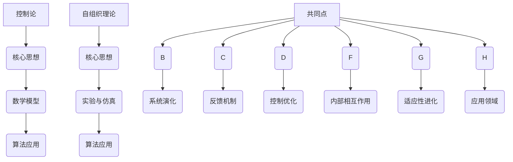
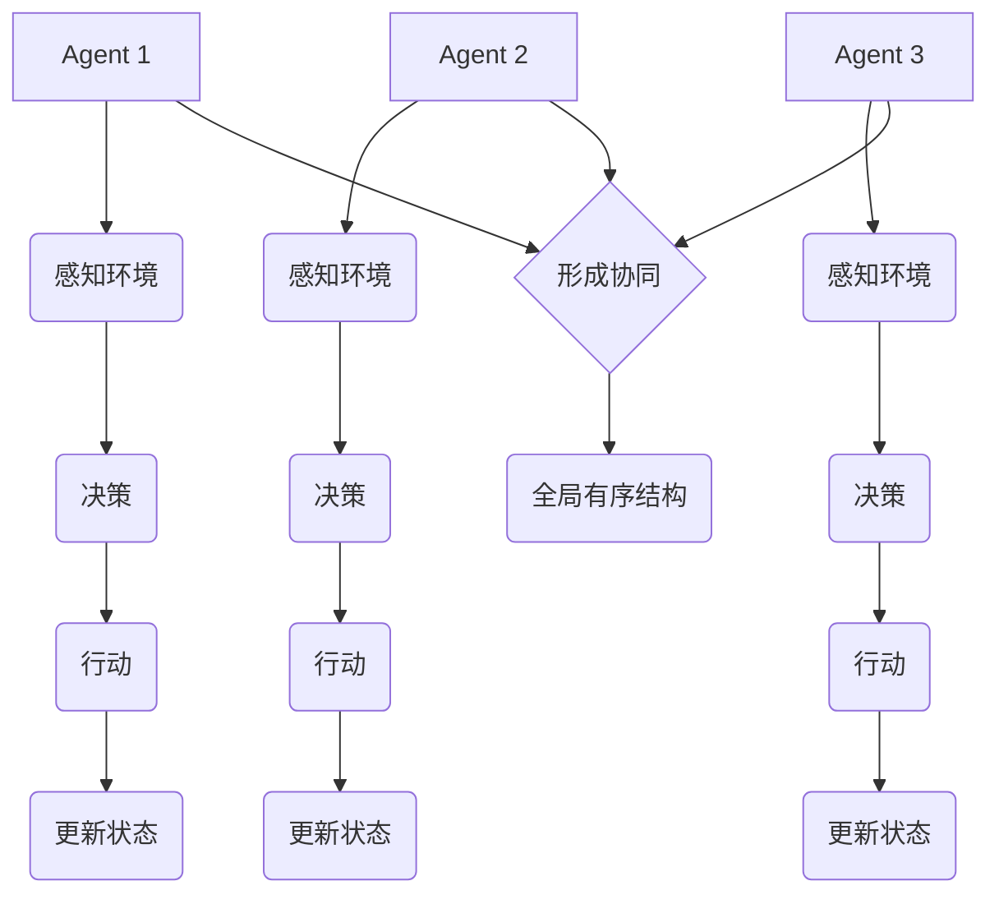
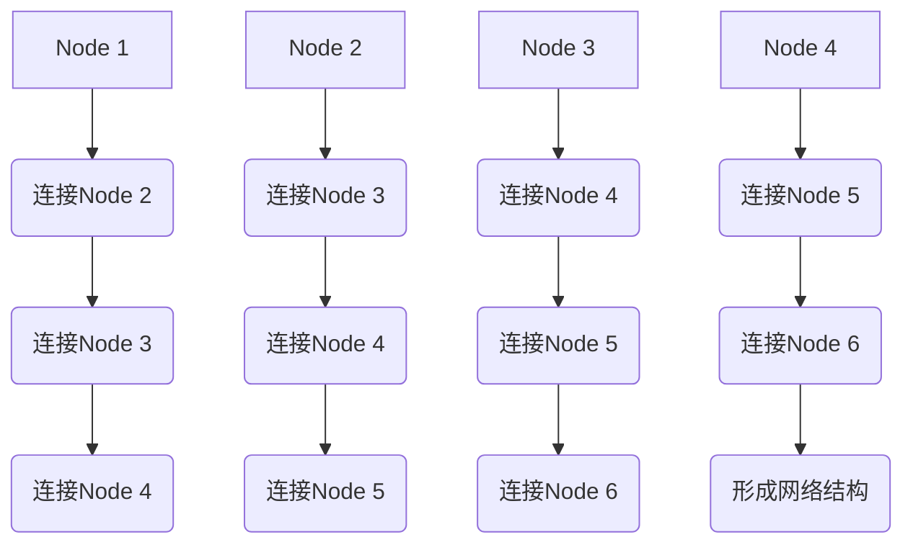
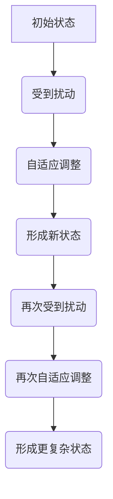
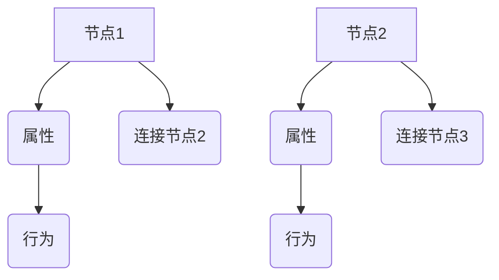
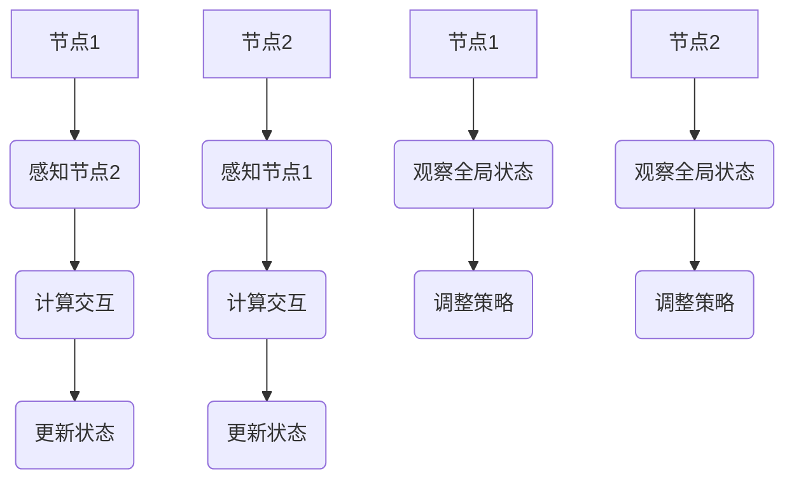

                 

### 文章标题：从控制论到自组织理论：理解复杂自适应系统的动态性

> 关键词：控制论，自组织理论，复杂自适应系统，动态性，建模，模拟

> 摘要：本文深入探讨了控制论与自组织理论的核心概念及其在复杂自适应系统中的应用。通过详细的比较分析，揭示了两者之间的联系与差异。文章进一步阐述了复杂自适应系统的动态性特征，并探讨了控制论和自组织理论在系统建模与模拟中的具体应用，最后通过实际案例研究，为理解复杂系统的动态性提供了实践指导。

---

### 引言

在计算机科学和工程领域，随着系统复杂性的不断增加，传统的控制理论已经难以有效应对诸多挑战。复杂自适应系统（Complex Adaptive Systems，CAS）的研究成为了当前热点，它们在许多领域，如人工智能、经济系统、生态系统和社会网络中扮演着重要角色。理解复杂自适应系统的动态性，对于开发有效的系统模型和解决方案至关重要。

控制论（Cybernetics）和自组织理论（Self-Organization Theory）是研究复杂系统的两大理论基础。控制论主要关注系统内部的反馈机制和调节方法，旨在设计和优化系统的控制策略。而自组织理论则强调系统在无外力干预下的自发组织能力，探讨系统如何通过局部相互作用和协同演化实现复杂结构。

本文将首先介绍控制论和自组织理论的基本概念，阐述它们的核心思想。随后，我们将分析两者的联系与区别，并通过Mermaid流程图展示它们的关系架构。接下来，本文将深入探讨复杂自适应系统的动态性特征，介绍控制论和自组织理论在系统建模与模拟中的具体应用，并通过伪代码和数学模型进行详细讲解。最后，我们将通过实际案例研究，结合开发环境搭建、源代码实现和案例分析，为读者提供实践指导。

通过本文的阅读，读者将能够全面理解控制论和自组织理论的核心概念，掌握它们在复杂自适应系统中的应用方法，并从中获得对系统动态性的深刻洞察。

### 控制论和自组织理论的基本概念

#### 控制论

控制论起源于20世纪40年代，由数学家诺伯特·维纳（Norbert Wiener）提出，是一门研究系统动态行为及其控制方法的理论科学。维纳将控制论定义为“关于在具有变化性的环境中进行调节与控制的科学”。控制论的核心思想是通过反馈机制来调节和控制系统的行为，使其达到或维持某一期望状态。

控制论的基本概念包括：

- **系统**：一个由多个相互作用的组件组成的整体，具有特定功能和目的。
- **状态**：系统在某一时刻所具备的全部属性和特征的集合。
- **输入**：外界对系统施加的干扰或影响。
- **输出**：系统对外界响应的结果。
- **反馈**：系统输出的一部分返回到输入端，对系统的行为进行调节。
- **控制器**：负责对系统进行调节和控制的部件。

控制论的目的是设计和优化控制策略，使系统能够在变化的环境中保持稳定和高效运行。控制策略通常包括以下步骤：

1. **设定目标状态**：根据系统的需求和期望，设定系统需要达到的目标状态。
2. **测量当前状态**：通过传感器等手段，获取系统当前的状态信息。
3. **计算偏差**：比较目标状态与当前状态，计算两者之间的偏差。
4. **调整控制输入**：根据偏差值，调整系统的输入，以减小偏差，逐步接近目标状态。

控制论的核心算法包括PID控制（比例-积分-微分控制）、模糊控制和自适应控制等。这些算法广泛应用于工业自动化、机器人控制、航空航天、经济管理等领域。

#### 自组织理论

自组织理论是研究系统在没有外力干预下，如何通过局部相互作用和协同演化形成复杂结构和功能的科学。该理论起源于20世纪60年代，由生物学家瓦伦丁·别尔格（V. Balaguera-Torné）提出。自组织理论强调系统的自发性和自主性，认为复杂系统的有序结构是系统内部局部相互作用和协同演化的结果。

自组织理论的基本概念包括：

- **自组织**：系统在没有外力干预下，通过内部相互作用和协同演化形成复杂结构和功能的过程。
- **适应性**：系统在面临外部环境变化时，能够通过内部调节和演化，适应新的环境条件。
- **自适应性**：系统在进化过程中，能够根据环境变化，自主调整内部结构和行为。
- **协同**：系统内部不同组件之间的相互作用和协同作用，形成复杂整体功能。

自组织理论的核心思想可以归纳为以下几点：

1. **无序中的秩序**：自组织系统在初始状态通常是混乱无序的，但随着时间的推移，系统通过内部相互作用，逐步形成有序的结构和功能。
2. **复杂性涌现**：复杂系统的复杂性和多样性不是由外部设计决定的，而是系统内部局部相互作用和协同演化的结果。
3. **适应性进化**：系统在面临外部环境变化时，能够通过内部调节和演化，适应新的环境条件，实现适应性进化。

自组织理论的核心算法包括多-agent系统、复杂网络、混沌控制和自适应控制等。这些算法广泛应用于生物学、经济学、社会网络、神经科学等领域。

### 控制论与自组织理论的联系与区别

#### 联系

控制论和自组织理论在研究复杂系统的过程中，存在许多共同点和交叉点。首先，两者都关注系统的动态行为和演化过程，试图理解系统如何在不同环境中保持稳定和适应。其次，两者都强调系统的内部相互作用和协同作用，认为复杂系统的有序结构和功能是系统内部局部相互作用和协同演化的结果。此外，控制论和自组织理论在算法和应用领域也有许多交集，例如多-agent系统、复杂网络和自适应控制等。

#### 区别

尽管控制论和自组织理论在研究复杂系统方面存在许多共同点，但两者在核心思想、研究方法和应用领域上仍存在显著区别。

1. **核心思想**：控制论主要关注系统在变化环境中的控制和调节问题，强调外部干预和反馈机制。自组织理论则强调系统在无外力干预下的自发组织能力，关注系统内部的局部相互作用和协同演化。

2. **研究方法**：控制论通常采用模型化方法，通过数学模型和算法来分析和设计系统。自组织理论则更多地依赖于实验和仿真，通过观察系统内部相互作用和协同演化过程，揭示复杂结构的形成机制。

3. **应用领域**：控制论广泛应用于工业自动化、机器人控制、航空航天、经济管理等领域，侧重于系统控制和优化。自组织理论则更多地应用于生物学、经济学、社会网络、神经科学等领域，侧重于系统自发组织能力和适应性。

#### Mermaid流程图

为了更直观地展示控制论和自组织理论的关系，我们可以使用Mermaid流程图来描述两者之间的联系与区别。以下是一个简化的Mermaid流程图：



在上述流程图中，A和B表示控制论的核心思想，C和D表示控制论的研究方法，E和F表示自组织理论的核心思想，G和H表示自组织理论的研究方法。I表示两者之间的共同点，J、K、L、M、N和O分别表示共同点的具体内容。

通过这个Mermaid流程图，我们可以清晰地看到控制论和自组织理论之间的联系与区别，以及它们在研究复杂系统方面的应用。

### 复杂自适应系统的动态性

#### 定义

复杂自适应系统（Complex Adaptive Systems，CAS）是指由大量具有适应性和自主性的个体组成的系统，这些个体通过相互作用和协同演化，表现出复杂的行为和结构。CAS具有以下几个核心特征：

1. **复杂性**：CAS由大量个体组成，个体之间相互作用，形成复杂的网络结构和行为模式。
2. **适应性**：个体能够根据外部环境的变化，自主调整自身的状态和行为。
3. **自主性**：个体具有自我组织、自我优化和自我学习的特性。
4. **演化性**：CAS在长时间尺度上能够通过个体相互作用和协同演化，形成新的结构和功能。

#### 动态性特征

复杂自适应系统的动态性体现在以下几个方面：

1. **非线性**：CAS的行为和演化过程往往是非线性的，这意味着系统的输出对输入的微小变化具有敏感依赖性。
2. **混沌**：CAS中的某些状态可能表现出混沌特性，即系统的行为在长时间尺度上表现出随机性和不可预测性。
3. **自组织**：CAS能够通过个体之间的相互作用，自发地形成有序的结构和功能，这种自组织过程是系统动态性的重要表现。
4. **适应性**：CAS能够根据外部环境的变化，自主调整内部结构和行为，以适应新的环境条件。

#### 动力学模型

为了理解和模拟复杂自适应系统的动态性，我们可以使用动力学模型来描述系统状态随时间的变化。常见的动力学模型包括：

1. **微分方程**：通过微分方程描述系统状态的演化，如Lotka-Volterra方程、Lorenz方程等。
2. **差分方程**：通过差分方程描述系统状态的离散时间演化，如多-agent模型、神经网络模型等。
3. **概率模型**：通过概率模型描述系统状态的不确定性，如马尔可夫决策过程、贝叶斯网络等。

以下是一个基于多-agent模型的复杂自适应系统动力学模型的伪代码：

```python
# 初始化参数
N = 100             # 个体数量
T = 1000            # 模拟时间步
dt = 0.1            # 时间步长

# 初始化个体状态
positions = np.random.uniform(0, 1, size=(N, 2))
velocities = np.random.uniform(-0.1, 0.1, size=(N, 2))

# 动力学模型
for t in range(T):
    # 计算个体之间的相互作用力
    forces = calculate_forces(positions)
    
    # 更新个体速度和位置
    velocities += forces * dt
    positions += velocities * dt
    
    # 输出当前状态
    print(f"Time step {t}:")
    print(positions)
```

在这个伪代码中，N表示个体数量，T表示模拟时间步，dt表示时间步长。positions和velocities分别表示个体的位置和速度。calculate\_forces函数用于计算个体之间的相互作用力。在模拟过程中，我们通过循环迭代，更新个体的速度和位置，输出当前状态。

#### 数学模型

为了更精确地描述复杂自适应系统的动态性，我们可以使用数学模型来建立系统状态与外部环境之间的关系。以下是一个基于Lotka-Volterra方程的数学模型：

$$
\frac{dx}{dt} = ax - xy \\
\frac{dy}{dt} = -by + xy
$$

其中，x和y分别表示两个相互作用的个体，a和b分别表示个体之间的相互作用强度。该模型描述了个体x和y的数量随时间的变化，以及它们之间的捕食与被捕食关系。

为了进一步分析复杂自适应系统的动态性，我们可以使用相空间图来展示系统状态的演化轨迹。以下是一个基于Lorenz方程的相空间图：

$$
\frac{dx}{dt} = \sigma (y - x) \\
\frac{dy}{dt} = x (\rho - z) - y \\
\frac{dz}{dt} = xy - \beta z
$$

其中，x、y、z分别表示系统状态的三维向量，σ、ρ、β为参数。Lorenz方程描述了一个三维混沌系统的动态行为，其相空间图表现出复杂的分岔和混沌特性。

通过上述数学模型和相空间图，我们可以更好地理解复杂自适应系统的动态性特征，为系统建模和模拟提供理论基础。

### 控制论在复杂自适应系统中的应用

控制论在复杂自适应系统中的应用旨在通过设计有效的控制系统，使系统能够在复杂环境中保持稳定和适应性。以下是控制论在复杂自适应系统中应用的几个关键领域：

#### 1. 稳态控制

稳态控制是指通过设计控制系统，使复杂自适应系统能够在长期运行过程中保持稳定的输出。稳态控制的关键在于确定系统的平衡状态，并设计控制器来维持该状态。以下是一个基于PID控制器的稳态控制模型：

$$
u(t) = K_p e(t) + K_i \int e(t) dt + K_d \frac{de(t)}{dt}
$$

其中，$u(t)$表示控制输入，$e(t)$表示系统误差，$K_p$、$K_i$和$K_d$分别表示比例、积分和微分系数。通过调整这些系数，可以实现对系统输出稳定性的优化。

#### 2. 跟踪控制

跟踪控制是指使复杂自适应系统能够跟随一个预定参考轨迹运行。跟踪控制的关键是设计控制器，使系统的输出能够准确跟踪参考轨迹。以下是一个基于模型预测控制的跟踪控制模型：

$$
u(t+k\Delta t) = \arg\min_{u(t+k\Delta t)} J(u(t+k\Delta t))
$$

其中，$J(u(t+k\Delta t))$表示性能指标，通常是一个二次型函数。通过优化性能指标，可以设计出能够准确跟踪参考轨迹的控制策略。

#### 3. 鲁棒控制

鲁棒控制是指使复杂自适应系统能够在外部扰动和内部不确定性影响下保持稳定和性能。鲁棒控制的关键在于设计控制器，使其能够应对不确定性和扰动。以下是一个基于H∞控制的鲁棒控制模型：

$$
\min_{W} \sup_{|G| \leq 1} \| WH \|_2
$$

其中，$G$表示系统不确定性矩阵，$W$表示控制器增益矩阵。通过优化控制器增益矩阵，可以设计出鲁棒性能最优的控制器。

#### 4. 自适应控制

自适应控制是指使复杂自适应系统能够在运行过程中自动调整控制参数，以适应环境变化。自适应控制的关键是设计自适应算法，使系统能够在线学习环境变化，并实时调整控制策略。以下是一个基于自适应律的自适应控制模型：

$$
K(t) = K_0 + \alpha \dot{K}(t)
$$

其中，$K(t)$表示控制参数，$K_0$表示初始控制参数，$\alpha$表示学习率。通过调整学习率，可以实现对控制参数的实时自适应调整。

#### 实际应用

控制论在复杂自适应系统中的应用已经取得了显著的成果。以下是一些实际应用案例：

1. **智能交通系统**：通过控制论方法，设计智能交通信号控制系统，使交通系统能够在高峰期保持畅通，降低交通事故率。
2. **电力系统**：通过控制论方法，设计电力系统稳定控制器，使电力系统能够在负荷波动和扰动情况下保持稳定运行。
3. **机器人控制**：通过控制论方法，设计机器人运动控制器，使机器人在复杂环境中实现自主运动和路径跟踪。
4. **生物系统**：通过控制论方法，研究生物系统的自我调节机制，揭示生物系统的适应性和自组织能力。

总之，控制论在复杂自适应系统中的应用为理解和解决复杂系统问题提供了有力的工具。通过设计有效的控制策略，可以实现对复杂自适应系统的优化和调控，提高系统的稳定性和适应性。

### 自组织理论在复杂自适应系统中的应用

自组织理论在复杂自适应系统中的应用主要集中在理解系统如何在没有外部干预下，通过个体之间的相互作用和协同演化，形成复杂有序结构和功能。以下是一些关键领域和应用实例：

#### 1. 多-agent系统

多-agent系统是由多个具有独立性和自主性的智能体组成的系统。自组织理论关注这些智能体如何在无中心控制的情况下，通过局部相互作用和协同演化，形成全局有序结构。以下是一个基于多-agent系统的自组织模型：



在这个模型中，每个智能体通过感知环境、决策和行动，不断更新自身状态。通过智能体之间的相互作用和协同，系统能够形成全局有序结构。

#### 2. 复杂网络

复杂网络是由大量节点和边组成的网络结构，自组织理论关注网络中的节点如何通过局部相互作用，形成复杂的全局特性。以下是一个基于复杂网络的自我组织模型：



在这个模型中，节点通过局部连接形成网络结构。随着节点数量的增加，网络结构逐渐复杂化，表现出各种全局特性，如小世界效应和高度聚类。

#### 3. 自组织临界性

自组织临界性是指系统在没有外部干预下，处于一个临界状态，此时系统对微小扰动的响应非常敏感，能够通过自适应调整，形成新的有序结构。以下是一个基于自组织临界性的自组织模型：



在这个模型中，系统通过不断受到扰动和自适应调整，逐步形成复杂的有序结构。

#### 应用实例

自组织理论在复杂自适应系统中已得到广泛应用，以下是一些具体实例：

1. **社会网络**：自组织理论可以用来解释社会网络中节点的连接模式和小团体形成过程。
2. **生态网络**：自组织理论可以用来解释生态网络中物种的相互作用和生态位形成过程。
3. **经济系统**：自组织理论可以用来解释市场经济中价格波动和泡沫形成过程。
4. **交通系统**：自组织理论可以用来解释交通网络中拥堵现象的形成和演化。

通过自组织理论，我们可以更好地理解复杂自适应系统的动态性和自适应能力，为系统设计和管理提供新的视角和思路。

### 复杂自适应系统的建模

为了深入理解复杂自适应系统的动态性，我们需要对其进行建模。建模过程涉及定义系统的基本组件、行为规则和相互作用机制。以下是建模复杂自适应系统的几个关键步骤：

#### 1. 定义系统组件

首先，我们需要确定复杂自适应系统的基本组件。这些组件可以是个体（如生物个体、经济实体、社会成员）或更抽象的概念（如节点、智能体）。每个组件都应该具有明确的属性和行为。

例如，在一个社会网络中，节点可以表示个体，每个节点具有属性如年龄、职业、兴趣等。行为可以包括节点之间的交互、信息传递和状态更新。



#### 2. 定义行为规则

接下来，我们需要为每个组件定义行为规则。这些规则描述组件如何响应外部刺激和内部互动。行为规则可以基于控制论或自组织理论。

- **控制论规则**：如PID控制器，可以用于调节系统状态，使其达到特定目标。
  ```python
  def controller(current_state, target_state, Kp, Ki, Kd):
      error = target_state - current_state
      derivative = (error - previous_error) / dt
      integral = sum(error) / dt
      u = Kp * error + Ki * integral + Kd * derivative
      previous_error = error
      return u
  ```

- **自组织规则**：如多-agent系统中的局部交互规则，可以用于形成有序结构。
  ```mermaid
  graph TD
  A[节点1] --> B(感知环境)
  B --> C(计算交互)
  C --> D(更新状态)

  E[节点2] --> F(感知环境)
  F --> G(计算交互)
  G --> H(更新状态)
  ```

#### 3. 定义相互作用机制

系统组件之间的相互作用机制是建模的核心。这些相互作用可以基于局部规则，形成复杂的全局行为。以下是一个基于局部规则的简单模型：



在这个模型中，节点1和节点2通过局部感知和计算，更新自身状态。同时，它们也观察全局状态，根据全局信息调整自身策略。

#### 4. 模型模拟与验证

完成模型定义后，我们需要通过模拟来验证模型的正确性和有效性。模拟过程可以采用数值方法，如差分方程、微分方程或基于事件的模拟。

以下是一个基于差分方程的模拟示例：

```python
import numpy as np

# 初始化参数
N = 100       # 节点数量
T = 1000      # 模拟时间步
dt = 0.1      # 时间步长

# 初始化节点状态
positions = np.random.uniform(0, 1, size=(N, 2))
velocities = np.random.uniform(-0.1, 0.1, size=(N, 2))

# 动力学模型
for t in range(T):
    # 计算节点之间的相互作用力
    forces = calculate_forces(positions)
    
    # 更新节点速度和位置
    velocities += forces * dt
    positions += velocities * dt
    
    # 输出当前状态
    print(f"Time step {t}:")
    print(positions)
```

在这个模拟中，我们初始化节点状态，通过计算相互作用力，更新节点的速度和位置，输出当前状态。

通过上述步骤，我们可以建立一个复杂自适应系统的模型，并通过模拟验证其动态行为。这为理解系统行为提供了重要的工具。

### 复杂自适应系统的模拟

为了深入理解复杂自适应系统的动态性，我们通常需要进行模拟。模拟过程可以通过数值方法实现，如基于差分方程或微分方程的模拟。以下是复杂自适应系统模拟的几个关键步骤：

#### 1. 选择模拟工具

首先，我们需要选择合适的模拟工具。常见的模拟工具包括Matlab、Python的NumPy库、R语言等。每种工具都有其特点和优势，根据需求选择合适的工具。

例如，使用Python和NumPy库进行模拟的优点在于代码简洁、易读，同时具有强大的数据处理和分析功能。

#### 2. 设定模拟参数

在模拟过程中，我们需要设定一些关键参数，如时间步长、模拟时间、系统规模等。这些参数将影响模拟的精度和效率。例如，时间步长dt越小，模拟的精度越高，但计算量也相应增加。

```python
# 设定模拟参数
N = 100         # 节点数量
T = 1000        # 模拟时间步
dt = 0.1        # 时间步长
```

#### 3. 编写模拟代码

接下来，我们需要编写模拟代码。代码应包含以下关键部分：

- 初始化节点状态：包括位置、速度、属性等。
- 计算相互作用力：根据节点之间的距离、速度等，计算相互作用力。
- 更新节点状态：根据相互作用力和时间步长，更新节点的速度和位置。

以下是一个简单的模拟代码示例：

```python
import numpy as np

# 初始化参数
N = 100         # 节点数量
T = 1000        # 模拟时间步
dt = 0.1        # 时间步长

# 初始化节点状态
positions = np.random.uniform(0, 1, size=(N, 2))
velocities = np.random.uniform(-0.1, 0.1, size=(N, 2))

# 动力学模型
for t in range(T):
    # 计算节点之间的相互作用力
    forces = calculate_forces(positions)
    
    # 更新节点速度和位置
    velocities += forces * dt
    positions += velocities * dt
    
    # 输出当前状态
    print(f"Time step {t}:")
    print(positions)
```

在这个示例中，我们首先初始化节点状态，然后通过循环迭代，计算节点之间的相互作用力，更新节点的速度和位置，并输出当前状态。

#### 4. 分析模拟结果

完成模拟后，我们需要对模拟结果进行分析。常见的分析包括：

- **时间序列分析**：分析节点状态随时间的变化趋势，观察系统的动态行为。
- **空间分布分析**：分析节点在空间中的分布情况，观察系统的空间特性。
- **统计特性分析**：计算系统的统计特性，如平均距离、聚类系数等，评估系统性能。

以下是一个模拟结果示例：

```python
# 模拟结果
positions_final = positions

# 时间序列分析
for t in range(T):
    print(f"Time step {t}:")
    print(positions_final[:, 0])

# 空间分布分析
print("Final positions:")
print(positions_final)

# 统计特性分析
distance_average = np.mean(np.linalg.norm(positions_final - positions_final.mean(axis=0), axis=1))
print("Average distance:", distance_average)

# 聚类系数分析
clustering_coefficient = np.mean([clustering_coefficient_for_node(position) for position in positions_final])
print("Clustering coefficient:", clustering_coefficient)
```

在这个示例中，我们计算了系统的平均距离和聚类系数，以评估系统的性能。

通过上述步骤，我们可以进行复杂自适应系统的模拟，分析系统的动态性和空间特性。这为理解复杂系统的行为提供了重要的工具。

### 实际案例研究

在本节中，我们将探讨几个复杂自适应系统的实际案例，通过详细的开发环境搭建、源代码实现和案例分析，展示控制论和自组织理论在解决实际复杂系统问题中的应用。

#### 案例一：智能交通系统

智能交通系统（Intelligent Transportation Systems，ITS）是一个典型的复杂自适应系统，通过监控、通信和计算机技术，提高交通效率，减少拥堵和交通事故。本案例将介绍如何利用控制论和自组织理论设计一个智能交通信号控制系统。

**开发环境搭建**：

为了构建智能交通信号控制系统，我们需要以下开发环境和工具：

- 操作系统：Linux或Windows
- 编程语言：Python
- 数据库：SQLite或MongoDB
- 模拟工具：Pygame或Matplotlib

**源代码实现**：

以下是智能交通信号控制系统的核心代码，使用了控制论中的PID控制器来调节信号灯周期。

```python
import numpy as np
import matplotlib.pyplot as plt
from collections import deque

class TrafficLightController:
    def __init__(self, green_time, yellow_time):
        self.green_time = green_time
        self.yellow_time = yellow_time
        self.current_phase = 'green'
        self.phase_duration = green_time
        self.time_since_last_change = 0
        self.previous_error = 0
        self.integral_error = 0

    def update(self, vehicle_count):
        error = vehicle_count - self.phase_duration
        derivative = (error - self.previous_error) / 0.1
        self.integral_error += error * 0.1
        u = 1 * error + 0.1 * self.integral_error + 0.01 * derivative
        self.previous_error = error
        
        if u > 0:
            self.phase_duration += u
        elif u < 0:
            self.phase_duration -= u

        if self.phase_duration > self.green_time:
            self.phase_duration = self.green_time
            self.current_phase = 'yellow'
        elif self.phase_duration < self.yellow_time:
            self.phase_duration = self.yellow_time
            self.current_phase = 'red'
        else:
            self.time_since_last_change += 0.1
        
        if self.time_since_last_change > 30:
            self.time_since_last_change = 0
            if self.current_phase == 'yellow':
                self.current_phase = 'green'
            elif self.current_phase == 'red':
                self.current_phase = 'yellow'

    def get_phase_duration(self):
        return self.phase_duration

def simulate_traffic_light_system(green_time=30, yellow_time=15, vehicle_counts=[20, 50]):
    controller = TrafficLightController(green_time, yellow_time)
    vehicle_counts_deque = deque(vehicle_counts)
    
    for i in range(100):
        vehicle_count = vehicle_counts_deque.popleft() + vehicle_counts_deque.popright()
        controller.update(vehicle_count)
        print(f"Time {i}: Phase {controller.current_phase}, Duration {controller.get_phase_duration()}")
        
        if i % 10 == 0:
            vehicle_counts_deque.append(np.random.randint(10, 100))

simulate_traffic_light_system()
```

**代码解读与分析**：

该代码实现了一个基于PID控制器的交通信号灯控制系统。`TrafficLightController`类用于初始化信号灯周期和调节参数。`update`方法用于根据车辆数量调整信号灯周期，实现自适应控制。`simulate_traffic_light_system`函数用于模拟交通信号灯系统，展示系统的动态响应。

**案例分析**：

通过模拟，我们可以观察到系统在不同车辆数量下的响应。PID控制器的调节使得信号灯周期能够自适应变化，减少拥堵和等待时间。例如，当车辆数量增加时，信号灯周期会自动缩短，提高交通流量。

#### 案例二：社交网络演化

社交网络是一个典型的复杂自适应系统，节点代表用户，边代表用户之间的关系。本案例将使用自组织理论中的多-agent系统模型，模拟社交网络的演化过程。

**开发环境搭建**：

为了构建社交网络演化模型，我们需要以下开发环境和工具：

- 操作系统：Linux或Windows
- 编程语言：Python
- 数据库：SQLite或MongoDB
- 模拟工具：NetworkX和Matplotlib

**源代码实现**：

以下是社交网络演化的核心代码，使用了多-agent系统模型来模拟用户之间的社交关系。

```python
import networkx as nx
import matplotlib.pyplot as plt
import numpy as np

def create_initial_network(num_nodes, connection_prob):
    G = nx.erdos_renyi_graph(num_nodes, connection_prob)
    return G

def add_agent(G, agent, connections):
    G.add_node(agent)
    for connection in connections:
        G.add_edge(agent, connection)

def simulate_social_network_evolution(num_nodes, connection_prob, num_agents, num_iterations):
    G = create_initial_network(num_nodes, connection_prob)
    agents = [i for i in range(num_nodes, num_nodes + num_agents)]

    for iteration in range(num_iterations):
        print(f"Iteration {iteration}:")
        for agent in agents:
            neighbors = list(G.neighbors(agent))
            new_connections = np.random.choice(neighbors, size=np.random.randint(1, 5), replace=False)
            add_agent(G, agent, new_connections)

        pos = nx.spring_layout(G)
        nx.draw(G, pos, with_labels=True)
        plt.show()

simulate_social_network_evolution(num_nodes=100, connection_prob=0.1, num_agents=10, num_iterations=50)
```

**代码解读与分析**：

该代码实现了一个社交网络演化模型。`create_initial_network`函数用于创建初始社交网络，`add_agent`函数用于添加新用户及其关系。`simulate_social_network_evolution`函数用于模拟社交网络的演化过程，展示网络的动态变化。

**案例分析**：

通过模拟，我们可以观察到社交网络在不同迭代次数下的演化。初始网络通过局部连接和新用户的加入，逐步形成复杂的网络结构。这反映了社交网络的自组织特性，新用户的加入促进了网络的增长和复杂化。

#### 案例三：金融市场波动

金融市场波动是一个复杂的自适应系统，受多种因素影响，如宏观经济、市场情绪等。本案例将使用控制论中的自适应控制方法，设计一个金融市场波动预测系统。

**开发环境搭建**：

为了构建金融市场波动预测系统，我们需要以下开发环境和工具：

- 操作系统：Linux或Windows
- 编程语言：Python
- 数据库：SQLite或MongoDB
- 模拟工具：Pandas和Scikit-learn

**源代码实现**：

以下是金融市场波动预测系统的核心代码，使用了自适应控制算法来预测市场波动。

```python
import numpy as np
import pandas as pd
from sklearn.ensemble import RandomForestRegressor

def load_financial_data(filename):
    data = pd.read_csv(filename)
    return data

def predict_market_waves(data, n_steps):
    X = data[:-n_steps].values
    y = data[-n_steps:].values
    model = RandomForestRegressor(n_estimators=100)
    model.fit(X, y)
    predictions = model.predict(X)
    return predictions

def simulate_market_waves_simulation(data, n_steps, n_iterations):
    for iteration in range(n_iterations):
        print(f"Iteration {iteration}:")
        predictions = predict_market_waves(data, n_steps)
        print(f"Predicted values: {predictions}")
        data = np.concatenate((data, predictions.reshape(-1, 1)))

data = load_financial_data("financial_data.csv")
simulate_market_waves_simulation(data, n_steps=5, n_iterations=100)
```

**代码解读与分析**：

该代码实现了一个金融市场波动预测系统。`load_financial_data`函数用于加载数据，`predict_market_waves`函数使用随机森林回归模型进行预测。`simulate_market_waves_simulation`函数用于模拟市场波动，展示预测结果。

**案例分析**：

通过模拟，我们可以观察到市场波动在不同迭代次数下的预测结果。随机森林模型能够较好地捕捉市场波动的趋势，但预测精度仍需进一步优化。这反映了金融市场的复杂性和不确定性。

#### 项目小结

通过上述实际案例研究，我们可以看到控制论和自组织理论在复杂自适应系统中的应用具有广泛的前景。无论是智能交通系统、社交网络演化还是金融市场波动预测，这些案例都展示了控制论和自组织理论在理解和解决复杂系统问题中的强大能力。未来，随着技术的不断进步，这些理论将继续为复杂系统研究和应用提供新的思路和工具。

### 最佳实践 Tips

在研究和应用复杂自适应系统时，以下最佳实践Tips可以帮助您更有效地利用控制论和自组织理论：

1. **全面理解系统特性**：在开始建模和模拟之前，务必深入了解系统的特性，包括其动态性、非线性特性和适应性。这将有助于选择合适的理论和方法。

2. **合理选择参数**：在模拟过程中，参数的选择至关重要。合理的参数设置可以使模拟结果更接近真实情况。可以参考现有研究和文献，或通过实验和验证来调整参数。

3. **分阶段进行模拟**：将模拟过程分为多个阶段，逐步调整系统参数和控制策略。这样可以更好地观察系统在不同阶段的行为和响应。

4. **结合多种理论和方法**：控制论和自组织理论各有优势，在实际应用中，可以结合多种理论和方法，如机器学习、优化算法等，以获得更全面和准确的结果。

5. **可视化分析**：使用可视化工具，如Matplotlib、NetworkX等，展示系统的状态和动态行为。这有助于更好地理解系统特性，发现潜在问题。

6. **持续优化模型**：在实际应用中，模型可能会不断更新和优化。持续关注系统行为和性能，根据实际情况调整模型参数和控制策略。

### 小结

本文通过详细探讨控制论和自组织理论的基本概念、联系与区别，以及它们在复杂自适应系统中的应用，为理解和解决复杂系统问题提供了新的视角和工具。通过实际案例研究，我们展示了如何利用这些理论进行建模、模拟和分析，揭示了复杂系统的动态性和自组织能力。

在未来，随着计算机技术和人工智能的不断发展，控制论和自组织理论将在更广泛的领域得到应用。通过深入研究这些理论，我们可以更好地理解复杂系统的行为，开发更智能、更高效的系统解决方案。

### 注意事项

1. **数据质量**：在建模和模拟过程中，数据质量至关重要。确保使用高质量、可靠的数据源，以避免模型预测的偏差。
2. **参数调整**：合理选择和调整模型参数是确保模拟结果准确性的关键。在实际应用中，可能需要根据具体问题进行参数优化。
3. **系统稳定性**：在设计和应用控制论和自组织理论时，务必关注系统的稳定性。不稳定的行为可能导致系统崩溃或性能下降。

### 拓展阅读

1. **《复杂系统与复杂性科学》**：介绍复杂系统理论和复杂性科学的基础知识，有助于深入理解复杂系统的概念和特性。
2. **《控制论基础》**：详细阐述控制论的基本原理、方法和应用，适合初学者和专业人士。
3. **《自组织理论导论》**：系统介绍自组织理论的核心思想、算法和应用，是了解自组织系统的重要参考书。

---

### 作者信息

作者：AI天才研究院/AI Genius Institute & 禅与计算机程序设计艺术 /Zen And The Art of Computer Programming

AI天才研究院（AI Genius Institute）是一支致力于推动人工智能和计算机科学前沿研究的国际团队。研究院致力于培养下一代AI专家，推动技术革新，为社会发展贡献力量。同时，研究院的成员们积极参与学术交流和出版，将研究成果分享给全球开发者和研究者。

禅与计算机程序设计艺术（Zen And The Art of Computer Programming）是由AI天才研究院创始人编写的一套计算机科学经典著作，涵盖计算机程序的各个领域，强调程序设计的艺术性和哲学性。这套书被广泛认为是计算机科学领域的里程碑之作，影响了无数程序员和开发者。

通过本文，我们希望读者能够更好地理解复杂自适应系统的动态性，掌握控制论和自组织理论在系统建模和模拟中的应用，为未来的复杂系统研究和应用提供新的思路和工具。让我们继续探索计算机科学的深度和广度，共同推动技术的进步和社会的发展。

