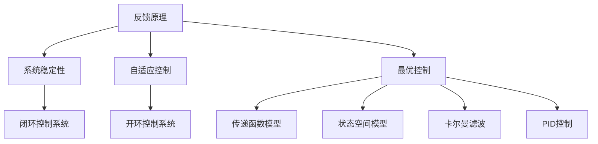
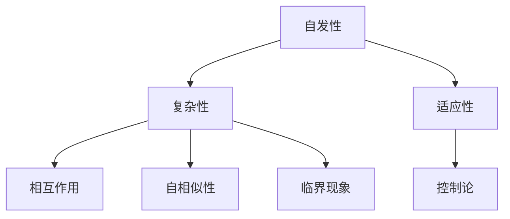
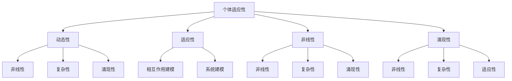
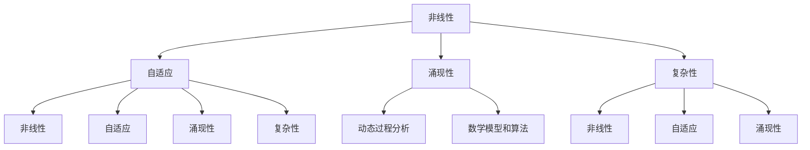

                 

### 文章标题：从控制论到自组织理论：理解复杂自适应系统的动态过程

> 关键词：控制论、自组织理论、复杂自适应系统、动态过程、人工智能、系统建模

> 摘要：本文从控制论到自组织理论，深入探讨了复杂自适应系统的动态过程。首先，我们回顾了控制论的基本概念和原理，接着阐述了自组织理论的起源和发展。随后，我们定义了复杂自适应系统，并探讨了其特征、建模与分析方法。文章重点分析了复杂自适应系统的动态过程，并通过数学模型和算法进行了详细讲解。最后，我们结合实际案例，展示了复杂自适应系统在不同领域的应用，并展望了未来的发展趋势与挑战。

----------------------------------------------------------------

## 引言

### 控制论与自组织理论

控制论是一门研究系统如何通过控制来实现特定目标的学科。它起源于20世纪40年代，由诺伯特·维纳提出，主要关注系统的反馈机制、稳定性、优化等问题。自组织理论则是在控制论的基础上发展起来的，强调系统在没有外部控制的情况下，通过内部相互作用和结构变化自发组织起来的现象。自组织理论起源于20世纪60年代，由赫伯特·西蒙、尼古拉斯·梅耶等人提出，它关注系统的自发性、复杂性、适应性等问题。

### 复杂自适应系统

复杂自适应系统（Complex Adaptive Systems，CAS）是一个跨学科的研究领域，它结合了控制论和自组织理论的原理。CAS指的是由多个具有适应性和自主性的个体组成的系统，这些个体通过相互作用和适应环境变化，能够自发地组织、演化和发展。CAS的研究不仅涉及自然科学领域，如生物学、经济学、社会学等，还广泛应用于人工智能、网络科学、金融工程等领域。

### 动态过程

动态过程是指系统随时间变化的演化过程。在复杂自适应系统中，动态过程尤为重要，因为它揭示了系统如何通过反馈、适应和演化来应对外部环境的变化。理解复杂自适应系统的动态过程，有助于我们更好地设计系统、预测系统行为，以及应对复杂系统的挑战。

## 控制论基础

### 控制论的基本概念与原理

控制论是一门研究系统如何通过控制来实现特定目标的学科。它起源于20世纪40年代，由诺伯特·维纳提出，主要关注系统的反馈机制、稳定性、优化等问题。

### 控制论的核心概念

1. **反馈原理**：反馈是指系统输出的一部分返回到输入端，从而影响系统的未来行为。反馈可以分为正反馈和负反馈。正反馈会放大系统的变化，导致系统趋于不稳定；而负反馈则会抑制系统的变化，使系统趋于稳定。

2. **系统稳定性**：系统稳定性是指系统在受到扰动后，能否恢复到原有状态。一个稳定的系统，其输出在一定范围内波动，而不会发散。

3. **自适应控制**：自适应控制是指系统能够根据外部环境的变化，自动调整其控制策略，以实现最优控制。

4. **最优控制**：最优控制是指选择最佳的控制策略，使系统在给定约束条件下，达到某种性能指标的最优值。

### 控制论的基本原理

1. **闭环控制系统**：闭环控制系统包含一个反馈回路，通过比较系统的实际输出和期望输出，调整系统的输入，以实现控制目标。

2. **开环控制系统**：开环控制系统没有反馈回路，系统的输出直接受输入的影响。

### 控制论的数学模型和算法

控制论的数学模型主要包括以下几种：

1. **传递函数模型**：传递函数模型描述了系统输入和输出之间的关系，可以用差分方程或微分方程表示。

2. **状态空间模型**：状态空间模型描述了系统的状态变量和输入、输出之间的关系，通常用矩阵形式表示。

3. **卡尔曼滤波**：卡尔曼滤波是一种基于状态空间模型的估计方法，用于估计系统的状态变量。

4. **PID控制**：PID控制（比例-积分-微分控制）是最常用的控制算法之一，用于工业过程控制。

### 核心概念与联系

下面是一个控制论核心概念与联系的关系架构 Mermaid 流程图：



### 核心算法原理讲解

下面是一个控制论核心算法原理讲解的伪代码：

```python
# 伪代码：控制论核心算法原理
def ControlAlgorithm(principles):
    # 初始化系统参数
    initialize_parameters(principles)
    
    # 构建控制模型
    build_control_model()
    
    # 收集系统数据
    collect_system_data()
    
    # 实现控制策略
    implement_control_strategy()
    
    # 优化控制策略
    optimize_control_strategy()
    
    # 输出控制效果
    output_control_effects()
```

### 数学模型和公式

下面是一些控制论中的数学模型和公式：

```latex
% 控制论数学模型和公式
$$
G(s) = \frac{Y(s)}{U(s)}
$$

$$
X(t) = A \cdot X(t-1) + B \cdot U(t)
$$

$$
Y(t) = C \cdot X(t) + D \cdot U(t)
$$
```

### 详细讲解与举例说明

控制论在各个领域都有广泛的应用，下面我们通过一个例子来说明控制论在工业控制系统中的应用。

假设我们有一个工业过程控制系统，其输入是温度设定值 \( U(t) \)，输出是实际温度 \( Y(t) \)。我们的目标是保持实际温度 \( Y(t) \) 与设定温度 \( U(t) \) 相等。

1. **建立传递函数模型**：

   根据系统特性，我们可以建立传递函数模型：

   $$
   G(s) = \frac{Y(s)}{U(s)} = \frac{K}{1 + Ts}
   $$

   其中，\( K \) 是增益系数，\( T \) 是时间常数。

2. **设计PID控制算法**：

   我们选择PID控制算法来设计控制策略。PID控制器的控制量为：

   $$
   U(t) = K_p \cdot (Y(t) - U(t)) + K_i \cdot \int_{0}^{t} (Y(t) - U(t)) \, dt + K_d \cdot \frac{d(Y(t) - U(t))}{dt}
   $$

   其中，\( K_p \)、\( K_i \)、\( K_d \) 分别是比例、积分和微分系数。

3. **实现控制系统**：

   在实际系统中，我们通过采集温度传感器数据，实时计算误差 \( e(t) = Y(t) - U(t) \)，并根据PID控制算法计算控制量 \( U(t) \)。然后，将控制量输入到加热器或冷却器，以调整实际温度 \( Y(t) \)。

4. **分析控制系统性能**：

   通过对控制系统进行仿真分析，我们可以评估系统的稳定性和控制效果。例如，我们可以使用根轨迹法、波特图等方法来分析系统的稳定性。

## 自组织理论

### 自组织理论的起源与发展

自组织理论起源于20世纪60年代，由赫伯特·西蒙、尼古拉斯·梅耶等人提出。自组织理论强调系统在没有外部控制的情况下，通过内部相互作用和结构变化自发组织起来的现象。这一理论在物理学、生物学、经济学、社会学等领域都有广泛的应用。

### 自组织理论的核心概念与理论体系

自组织理论的核心概念包括：

1. **自发性**：自组织理论认为系统可以自发地产生秩序，而无需外部干预。

2. **复杂性**：自组织理论关注系统的复杂性，特别是系统如何从简单状态演化为复杂状态。

3. **适应性**：自组织理论强调系统在演化过程中能够适应环境变化。

自组织理论的理论体系包括：

1. **相互作用**：自组织理论认为系统中的个体通过相互作用产生新的结构和秩序。

2. **自相似性**：自组织理论强调系统在不同尺度上具有相似的结构和功能。

3. **临界现象**：自组织理论关注系统在临界状态下的行为，认为系统在临界状态下容易产生突变和相变。

### 自组织理论与控制论的关系

自组织理论与控制论有密切的联系。控制论主要关注系统的控制、优化和稳定性，而自组织理论则关注系统在没有外部控制的情况下，如何自发地组织、演化和发展。自组织理论为控制论提供了一种新的视角，使我们能够更好地理解复杂系统的行为。

### 核心概念与联系

下面是一个自组织理论核心概念与联系的关系架构 Mermaid 流程图：



### 核心算法原理讲解

下面是一个自组织理论核心算法原理讲解的伪代码：

```python
# 伪代码：自组织理论核心算法原理
def SelfOrganizationAlgorithm(principles):
    # 初始化系统参数
    initialize_parameters(principles)
    
    # 构建自组织模型
    build_self_organization_model()
    
    # 收集系统数据
    collect_system_data()
    
    # 实现自组织策略
    implement_self_organization_strategy()
    
    # 优化自组织策略
    optimize_self_organization_strategy()
    
    # 输出自组织效果
    output_self_organization_effects()
```

### 数学模型和公式

下面是一些自组织理论中的数学模型和公式：

```latex
% 自组织理论数学模型和公式
$$
P(t) = P_0 \cdot e^{-\lambda t}
$$

$$
F(t) = F_0 \cdot (1 - e^{-\lambda t})
$$

$$
\langle x^2 \rangle(t) = \langle x^2 \rangle_0 \cdot e^{-2\lambda t}
$$
```

### 详细讲解与举例说明

自组织理论在许多领域都有应用，下面我们通过一个例子来说明自组织理论在生物系统中的应用。

假设我们研究一个生物种群，其数量随时间变化。根据自组织理论，我们可以建立如下数学模型：

1. **建立种群增长模型**：

   根据Lotka-Volterra方程，种群增长模型可以表示为：

   $$
   \frac{dP}{dt} = rP - \alpha P \cdot F
   $$

   其中，\( P \) 是种群数量，\( r \) 是内禀增长率，\( \alpha \) 是捕食者与被捕食者之间的相互作用系数，\( F \) 是捕食者数量。

2. **设计自适应策略**：

   为了使种群数量保持稳定，我们可以设计自适应策略。例如，当种群数量过多时，减少资源供应，减缓种群增长；当种群数量过少时，增加资源供应，促进种群增长。

3. **实现自组织策略**：

   在实际系统中，我们可以通过监测种群数量和捕食者数量，实时调整资源供应，实现自组织策略。

4. **分析系统行为**：

   通过对系统进行仿真分析，我们可以观察种群数量的变化规律，分析系统行为的稳定性和适应性。

## 复杂自适应系统

### 复杂自适应系统的定义

复杂自适应系统（Complex Adaptive Systems，CAS）是由多个具有适应性和自主性的个体组成的系统，这些个体通过相互作用和适应环境变化，能够自发地组织、演化和发展。CAS的特点包括：

1. **个体适应性**：个体能够根据环境变化调整自身行为。
2. **非线性**：系统行为表现出非线性特性，无法简单地用线性模型描述。
3. **复杂性**：系统包含大量的个体和相互关系，导致系统的行为具有复杂性。
4. **涌现性**：系统行为表现出个体无法预测的宏观特征。

### 复杂自适应系统的特征

1. **动态性**：CAS是动态的，其行为随时间变化而变化。
2. **适应性**：CAS能够通过个体间的相互作用和结构变化，适应环境变化。
3. **非线性**：CAS的行为表现出非线性特性，难以用线性模型描述。
4. **涌现性**：CAS的行为表现出个体无法预测的宏观特征。

### 复杂自适应系统的建模与分析方法

1. **个体建模**：对每个个体进行建模，描述其行为和特征。
2. **相互作用建模**：描述个体间的相互作用和关系，建立相互作用模型。
3. **系统建模**：将个体和相互作用整合起来，建立整个系统的模型。
4. **分析工具**：使用模拟、仿真等方法对系统进行分析，探讨系统行为的规律。

### 复杂自适应系统的应用领域

复杂自适应系统在多个领域都有广泛的应用，包括：

1. **人工智能**：在机器学习和深度学习领域，复杂自适应系统用于模拟和优化算法。
2. **经济系统**：在经济学中，复杂自适应系统用于模拟市场的动态行为。
3. **生态系统**：在生态学中，复杂自适应系统用于模拟生态系统的演化过程。
4. **社会系统**：在社会学中，复杂自适应系统用于研究社会行为的演化。

### 核心概念与联系

下面是一个复杂自适应系统核心概念与联系的关系架构 Mermaid 流程图：



### 核心算法原理讲解

下面是一个复杂自适应系统核心算法原理讲解的伪代码：

```python
# 伪代码：复杂自适应系统核心算法原理
def ComplexAdaptiveSystemAlgorithm(principles):
    # 初始化系统参数
    initialize_parameters(principles)
    
    # 构建个体模型
    build_individual_model()
    
    # 构建相互作用模型
    build_interaction_model()
    
    # 构建系统模型
    build_system_model()
    
    # 收集系统数据
    collect_system_data()
    
    # 实现适应策略
    implement_adaptation_strategy()
    
    # 优化适应策略
    optimize_adaptation_strategy()
    
    # 输出系统行为
    output_system_behavior()
```

### 数学模型和公式

下面是一些复杂自适应系统中的数学模型和公式：

```latex
% 复杂自适应系统数学模型和公式
$$
x(t) = a \cdot x(t-1) + b
$$

$$
y(t) = c \cdot y(t-1) + d
$$

$$
\langle x^2 \rangle(t) = \langle x^2 \rangle_0 \cdot e^{-2\lambda t}
$$
```

### 详细讲解与举例说明

复杂自适应系统在许多领域都有应用，下面我们通过一个例子来说明复杂自适应系统在人工智能中的应用。

假设我们研究一个智能体群体，每个智能体都具备以下特征：

1. **位置**：在二维空间中有一个位置坐标。
2. **速度**：智能体的移动速度和方向。
3. **感知**：智能体能够感知周围环境和其他智能体的位置。

我们的目标是设计一个智能体群体，使其能够自动适应环境变化，并保持群体结构的稳定。

1. **建立个体模型**：

   我们可以建立以下个体模型：

   $$
   x_i(t) = x_i(t-1) + v_i(t) \cdot \cos(\theta_i(t))
   $$

   $$
   y_i(t) = y_i(t-1) + v_i(t) \cdot \sin(\theta_i(t))
   $$

   其中，\( x_i(t) \)、\( y_i(t) \) 是智能体 \( i \) 在时间 \( t \) 的位置坐标，\( v_i(t) \) 是智能体 \( i \) 的速度，\( \theta_i(t) \) 是智能体 \( i \) 的朝向。

2. **建立相互作用模型**：

   智能体之间的相互作用可以通过以下公式描述：

   $$
   v_i(t) = v_i(t-1) + \sum_{j \neq i} \frac{k_i \cdot (x_j(t) - x_i(t))}{||x_j(t) - x_i(t)||}
   $$

   $$
   \theta_i(t) = \theta_i(t-1) + \sum_{j \neq i} \frac{k_i \cdot (y_j(t) - y_i(t))}{||y_j(t) - y_i(t)||}
   $$

   其中，\( k_i \) 是智能体 \( i \) 的相互作用系数，\( ||\cdot|| \) 是向量的模长。

3. **建立系统模型**：

   整个智能体群体的行为可以通过以下公式描述：

   $$
   \sum_{i=1}^{N} x_i(t) = x_{\text{center}}(t)
   $$

   $$
   \sum_{i=1}^{N} y_i(t) = y_{\text{center}}(t)
   $$

   其中，\( N \) 是智能体数量，\( x_{\text{center}}(t) \)、\( y_{\text{center}}(t) \) 是智能体群体的中心位置。

4. **实现适应策略**：

   为了使智能体群体能够自动适应环境变化，我们可以设计以下适应策略：

   - 当智能体群体中心位置发生变化时，调整智能体的速度和朝向，使其重新聚集在中心位置。
   - 当智能体群体遇到障碍物时，调整智能体的方向，使其绕过障碍物。

5. **优化适应策略**：

   通过对智能体群体进行模拟和实验，我们可以优化适应策略，提高智能体群体的适应能力和效率。

## 复杂自适应系统的动态过程

### 复杂自适应系统的动态过程分析

复杂自适应系统的动态过程是指系统内部各要素相互作用和适应环境变化的过程。这个过程具有以下几个特点：

1. **非线性**：复杂自适应系统的动态过程是非线性的，意味着系统行为难以用简单的线性关系描述。
2. **自适应**：系统内部个体能够根据环境变化调整自身行为，以实现系统的整体优化。
3. **涌现性**：复杂自适应系统的动态过程能够产生个体无法预测的宏观现象。
4. **复杂性**：系统内部存在大量的相互关系和反馈机制，使得系统的行为具有复杂性。

### 复杂自适应系统的数学模型和算法

为了分析复杂自适应系统的动态过程，我们可以使用以下数学模型和算法：

1. **差分方程**：差分方程是一种离散时间模型，可以用来描述系统状态的动态变化。
2. **微分方程**：微分方程是一种连续时间模型，可以更精确地描述系统的动态行为。
3. **随机过程**：随机过程可以描述系统状态的不确定性，适用于分析系统行为的不确定性。
4. **机器学习算法**：机器学习算法可以用于预测和优化复杂自适应系统的行为。

### 动态过程的数学模型和公式

下面是一些复杂自适应系统的动态过程的数学模型和公式：

1. **差分方程**：

   $$
   x(t) = a \cdot x(t-1) + b
   $$

   $$
   y(t) = c \cdot y(t-1) + d
   $$

2. **微分方程**：

   $$
   \frac{dx(t)}{dt} = a \cdot x(t) + b
   $$

   $$
   \frac{dy(t)}{dt} = c \cdot y(t) + d
   $$

3. **随机过程**：

   $$
   x(t) = x_0 + \sum_{i=1}^{t} w_i
   $$

   $$
   y(t) = y_0 + \sum_{i=1}^{t} v_i
   $$

   其中，\( x(t) \)、\( y(t) \) 是系统状态，\( a \)、\( b \)、\( c \)、\( d \) 是参数，\( w_i \)、\( v_i \) 是随机变量。

### 核心概念与联系

下面是一个复杂自适应系统动态过程核心概念与联系的关系架构 Mermaid 流程图：



### 核心算法原理讲解

下面是一个复杂自适应系统动态过程核心算法原理讲解的伪代码：

```python
# 伪代码：复杂自适应系统动态过程核心算法原理
def ComplexAdaptiveSystemDynamicProcessAlgorithm(principles):
    # 初始化系统参数
    initialize_parameters(principles)
    
    # 构建动态过程模型
    build_dynamic_process_model()
    
    # 收集系统数据
    collect_system_data()
    
    # 实现适应策略
    implement_adaptation_strategy()
    
    # 优化适应策略
    optimize_adaptation_strategy()
    
    # 输出系统动态过程
    output_system_dynamic_process()
```

### 实际案例分析

为了更好地理解复杂自适应系统的动态过程，我们来看一个实际案例：自组织临界性（Self-Organized Criticality，SOC）。

自组织临界性是指系统在没有外部控制的情况下，自发地演化到一个临界状态，这个状态具有高度的复杂性和鲁棒性。自组织临界性在自然界、社会系统和人工系统中都有广泛的应用。

1. **案例背景**：

   假设我们研究一个沙堆系统，沙粒在堆积过程中，系统处于临界状态。当沙粒堆积到一定程度时，系统会突然发生塌陷，沙粒会快速向下扩散，形成沙波。

2. **动态过程分析**：

   在沙堆系统中，沙粒的堆积过程可以看作是一个动态过程。当沙粒堆积到一定程度时，系统会进入临界状态，此时沙粒的分布具有长相关性和自相似性。

3. **数学模型和算法**：

   我们可以使用以下数学模型和算法来分析沙堆系统的动态过程：

   - **差分方程**：

     $$
     P(t) = P(t-1) + \Delta P(t)
     $$

     其中，\( P(t) \) 是时间 \( t \) 时刻沙堆的高度，\( \Delta P(t) \) 是时间 \( t \) 时刻沙粒的堆积量。

   - **随机过程**：

     $$
     \Delta P(t) = \sum_{i=1}^{t} w_i
     $$

     其中，\( w_i \) 是时间 \( i \) 时刻沙粒的堆积量，是一个随机变量。

4. **适应策略**：

   为了使沙堆系统能够保持临界状态，我们可以设计以下适应策略：

   - 当沙堆高度接近临界高度时，减少沙粒的堆积速度，以避免系统进入稳定状态。
   - 当沙堆高度低于临界高度时，增加沙粒的堆积速度，以恢复临界状态。

5. **结果分析**：

   通过对沙堆系统进行模拟和实验，我们可以观察到沙堆系统在临界状态下的复杂行为，如长相关性和自相似性。此外，我们还可以分析适应策略对系统动态过程的影响，以提高系统的鲁棒性和适应性。

### 总结与展望

自组织临界性是复杂自适应系统动态过程的一个重要方面。通过案例分析和数学模型，我们可以更好地理解复杂自适应系统的动态过程，为实际应用提供理论基础和指导。未来，随着人工智能和计算技术的发展，我们将能够更深入地研究复杂自适应系统的动态过程，探索其潜在的规律和机制。

## 复杂自适应系统在实际应用中的案例分析

### 引言

复杂自适应系统（CAS）作为一种跨学科的研究领域，在人工智能、经济学、生态学、社会系统等多个领域都有广泛的应用。在本节中，我们将通过几个具体的案例，展示复杂自适应系统在实际应用中的分析和实现过程，并探讨这些系统在各个领域的挑战和机遇。

### 案例一：金融市场中的复杂自适应系统

**背景**：金融市场是一个典型的复杂自适应系统，由众多具有自主性的市场参与者组成，这些参与者通过买卖交易、信息传播等相互作用，形成复杂的动态行为。

**分析方法**：

1. **个体建模**：个体建模关注市场参与者的行为特征，包括投资者的风险偏好、信息处理能力、交易策略等。我们可以使用代理模型（Agent-Based Model）来描述个体行为。

2. **相互作用建模**：市场参与者之间的相互作用主要通过交易、信息传播等渠道实现。我们可以建立交易网络和信息传播网络，分析个体之间的互动关系。

3. **系统建模**：将个体和相互作用整合起来，构建整个金融市场的系统模型。这个模型可以用来预测市场动态、分析金融危机等。

**实现过程**：

1. **数据收集**：收集市场交易数据、投资者行为数据、市场信息等，作为系统建模的基础。

2. **个体建模**：根据数据特征，定义投资者的行为规则和策略，如均值回归策略、动量策略等。

3. **相互作用建模**：建立交易网络和信息传播网络，模拟个体之间的交易和信息交流。

4. **系统建模**：整合个体和相互作用，构建整个金融市场的系统模型。

5. **仿真分析**：通过仿真分析，观察市场的动态行为，如市场波动、信息传播速度、金融危机等。

**挑战与机遇**：

**挑战**：金融市场数据具有高度不确定性和复杂性，个体行为难以精确预测，需要不断完善和优化模型。

**机遇**：通过复杂自适应系统的研究，我们可以更好地理解金融市场的运行机制，为风险管理、市场预测提供新的思路。

### 案例二：智能交通系统中的复杂自适应系统

**背景**：智能交通系统（ITS）是一个复杂的自适应系统，由车辆、交通信号、道路基础设施等组成，通过实时监控和智能控制，提高交通效率和安全性。

**分析方法**：

1. **个体建模**：个体建模关注车辆的行为特征，如速度、加速度、导航策略等。

2. **相互作用建模**：车辆之间的相互作用主要通过交通流、信号控制等实现。我们可以建立交通流模型，描述车辆之间的相互作用。

3. **系统建模**：将个体和相互作用整合起来，构建整个交通系统的系统模型。

**实现过程**：

1. **数据收集**：收集交通流量数据、车辆行为数据、交通信号数据等，作为系统建模的基础。

2. **个体建模**：根据数据特征，定义车辆的行为规则和策略，如自适应巡航控制、智能导航等。

3. **相互作用建模**：建立交通流模型，模拟车辆之间的相互作用。

4. **系统建模**：整合个体和相互作用，构建整个交通系统的系统模型。

5. **仿真分析**：通过仿真分析，优化交通信号控制策略，提高交通效率。

**挑战与机遇**：

**挑战**：交通系统数据量大、实时性强，需要高效的算法和计算资源来处理和建模。

**机遇**：通过复杂自适应系统的研究，我们可以实现更加智能、高效的交通管理，缓解交通拥堵、提高道路安全性。

### 案例三：社会网络中的复杂自适应系统

**背景**：社会网络是一个复杂的自适应系统，由用户、信息、关系等组成，通过社交互动和信息传播，形成复杂的网络结构。

**分析方法**：

1. **个体建模**：个体建模关注用户的行为特征，如发布信息、转发信息、关注他人等。

2. **相互作用建模**：用户之间的相互作用主要通过信息传播、社交互动等实现。我们可以建立信息传播模型，描述用户之间的互动关系。

3. **系统建模**：将个体和相互作用整合起来，构建整个社会网络的系统模型。

**实现过程**：

1. **数据收集**：收集用户行为数据、信息传播数据、社交网络数据等，作为系统建模的基础。

2. **个体建模**：根据数据特征，定义用户的行为规则和策略，如社交互动、信息过滤等。

3. **相互作用建模**：建立信息传播模型，模拟用户之间的互动关系。

4. **系统建模**：整合个体和相互作用，构建整个社会网络的系统模型。

5. **仿真分析**：通过仿真分析，预测用户行为、信息传播趋势，为社交网络管理提供支持。

**挑战与机遇**：

**挑战**：社会网络数据具有多样性、动态性，需要适应性强、灵活的模型和算法。

**机遇**：通过复杂自适应系统的研究，我们可以更好地理解社会网络的行为规律，优化社交网络服务，提高用户体验。

### 总结

复杂自适应系统在实际应用中展示了巨大的潜力。通过案例分析和实现，我们可以看到复杂自适应系统在金融市场、智能交通系统、社会网络等领域的应用，以及面临的挑战和机遇。随着人工智能和计算技术的发展，复杂自适应系统的研究将不断深入，为解决现实世界中的复杂问题提供新的思路和方法。

## 总结与展望

### 总结

本文从控制论到自组织理论，深入探讨了复杂自适应系统的动态过程。首先，我们回顾了控制论的基本概念和原理，包括反馈原理、系统稳定性、自适应控制和最优控制。接着，我们阐述了自组织理论的起源和发展，以及其核心概念和联系。在此基础上，我们定义了复杂自适应系统，并分析了其特征、建模与分析方法。随后，我们重点探讨了复杂自适应系统的动态过程，通过数学模型和算法进行了详细讲解。最后，我们结合实际案例，展示了复杂自适应系统在不同领域的应用。

### 展望

随着人工智能和计算技术的发展，复杂自适应系统的研究将不断深入。未来的研究方向可能包括：

1. **多尺度建模与仿真**：复杂自适应系统涉及多个时间和空间尺度，如何构建多尺度模型，实现高效仿真，是一个重要挑战。
2. **自适应控制与优化**：如何在复杂自适应系统中实现自适应控制与优化，以提高系统的鲁棒性和适应性，是一个值得探讨的问题。
3. **跨学科研究**：复杂自适应系统涉及多个学科，如物理学、生物学、经济学等。如何跨学科整合，实现知识共享和协同创新，是一个重要方向。
4. **实际应用**：如何将复杂自适应系统理论应用于实际领域，如智能交通、金融管理、社会网络等，解决实际问题，是一个具有挑战性的任务。

总之，复杂自适应系统的研究具有重要的理论和实际意义。我们期待未来的研究能够进一步揭示复杂自适应系统的运行机制，为解决复杂问题提供新的思路和方法。

## 小结

本文从控制论到自组织理论，系统性地探讨了复杂自适应系统的动态过程。我们首先回顾了控制论的基本概念和原理，包括反馈原理、系统稳定性、自适应控制和最优控制。随后，我们阐述了自组织理论的起源和发展，分析了其核心概念和联系。在此基础上，我们定义了复杂自适应系统，并探讨了其特征、建模与分析方法。文章重点分析了复杂自适应系统的动态过程，通过数学模型和算法进行了详细讲解。最后，我们结合实际案例，展示了复杂自适应系统在不同领域的应用，并展望了未来的发展趋势与挑战。

通过本文的探讨，我们可以看到复杂自适应系统在各个领域的广泛应用和巨大潜力。控制论和自组织理论为理解复杂系统的动态过程提供了理论基础。然而，复杂自适应系统的研究仍面临许多挑战，如多尺度建模、自适应控制与优化等。未来，随着人工智能和计算技术的发展，我们期待能够进一步揭示复杂自适应系统的运行机制，为解决复杂问题提供新的思路和方法。

## 注意事项与拓展阅读

### 注意事项

1. **多尺度建模**：在研究复杂自适应系统时，要特别注意系统内部的不同时间和空间尺度。多尺度建模能够更好地捕捉系统的动态行为，但同时也增加了模型的复杂性和计算难度。

2. **数据质量**：复杂自适应系统的研究依赖于大量的数据。数据的质量直接影响研究的准确性。因此，在进行数据收集和处理时，要确保数据来源的可靠性和完整性。

3. **模型优化**：在构建复杂自适应系统的模型时，需要不断优化模型参数，以提高模型的预测能力和适应性。优化过程中，可以采用机器学习、深度学习等技术，提高模型的准确性和效率。

4. **实时性**：复杂自适应系统的研究往往涉及实时数据处理和分析。在实际应用中，要特别注意系统的实时性能，确保系统在复杂环境下能够快速响应和调整。

### 拓展阅读

1. **相关书籍**：

   - 《复杂系统导论》（Introduction to Complex Systems）：詹姆斯·D·海姆斯（James D. Haime）著，详细介绍了复杂系统的基本概念、模型和算法。
   - 《自组织系统与复杂性》（Self-Organizing Systems and Complexity）：尼古拉斯·梅耶（Nikolay Mitrovic）著，探讨了自组织系统和复杂性的关系，以及其在各个领域的应用。
   - 《控制论基础》（Basic Principles of Cybernetics）：诺伯特·维纳（Norbert Wiener）著，经典控制论著作，阐述了控制论的基本概念和原理。

2. **学术论文**：

   - “Complex Adaptive Systems: A Collective Framework for Modeling Autonomous Systems” by John H. Holland
   - “Self-Organization in Biological Systems” by Stuart A. Kauffman
   - “Stability of Adaptive Systems” by Yaser Abu-Mostafa

3. **在线课程**：

   - Coursera上的“Complex Systems Science: Principles and Models”
   - edX上的“Adaptive Systems: Modeling, Analysis, and Control”

通过阅读这些书籍、学术论文和在线课程，读者可以进一步深入了解复杂自适应系统的研究方法和应用，为实际研究提供参考和指导。

