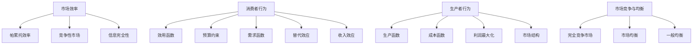
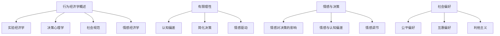
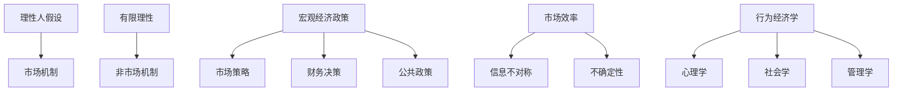

                 


### 引言

经济学作为社会科学的一个重要分支，自其诞生以来，一直在探讨人类在复杂社会和经济环境中的决策过程。随着社会经济的发展和人类认知的进步，经济学理论也不断演变和进步。本文将探讨从新古典经济学到行为经济学的发展历程，并重点分析人类在复杂世界中的决策行为。

新古典经济学（Neoclassical Economics）起源于19世纪末，是一种以理性人为基础，强调市场效率和资源配置效率的经济学理论。它认为，市场机制能够自动实现资源的最优分配，价格是供需关系的反映。然而，随着对人类行为的深入研究，学者们发现，人类并非总是理性的，这引发了行为经济学（Behavioral Economics）的兴起。

行为经济学在20世纪70年代开始发展，它引入了心理学、社会学等学科的理论和方法，研究人类在现实世界中的决策行为。行为经济学认为，人类在决策过程中受到多种因素的影响，包括认知偏差、情感、社会规范等，这些因素会导致人类做出非理性的决策。

本文的结构如下：首先，我们将介绍新古典经济学的基本原理和主要概念；然后，深入探讨行为经济学的基本原理和理论；接着，比较和分析两种经济学理论在复杂世界中的决策应用；随后，对经济学理论的局限性和挑战进行批判和探讨；最后，总结全文并展望未来经济学的发展。

通过本文的阅读，读者将能够全面理解新古典经济学和行为经济学的基本原理，掌握两种理论在复杂决策中的应用，并思考未来经济学的发展方向。本文旨在为广大经济学爱好者提供一份有深度、有思考、有见解的专业技术博客文章。

---

**关键词：** 新古典经济学，行为经济学，复杂决策，理性人假设，认知偏差，市场效率，资源配置。

**摘要：** 本文从新古典经济学到行为经济学的发展历程入手，系统介绍了两种经济学理论的基本原理和主要概念，深入探讨了人类在复杂世界中的决策行为。通过对两种经济学理论的比较和分析，本文揭示了其在复杂决策中的应用差异和局限性。最后，本文提出了对经济学理论的批判和探讨，并展望了未来经济学的发展方向。

## 第一部分：新古典经济学的理论和应用

### 第2章 新古典经济学的基本原理

新古典经济学（Neoclassical Economics）是一种以理性人为基础，强调市场效率和资源配置效率的经济学理论。它起源于19世纪末，经过一个多世纪的发展，已经成为经济学研究的主流。本章将介绍新古典经济学的基本原理和主要概念。

#### 2.1 市场效率

市场效率（Market Efficiency）是新古典经济学中的一个核心概念。它指的是市场在资源配置过程中能够达到最优状态，即资源在各个用途上的边际成本和边际收益相等。市场效率通常通过以下几个标准来衡量：

1. **帕累托效率**：资源分配达到帕累托效率，即无法在不使任何人境况变坏的情况下，使得任何其他人变得更好。换句话说，资源已经分配到最优状态，无法进行进一步的优化。

2. **竞争性市场**：竞争性市场是实现市场效率的重要条件。在竞争性市场中，消费者和生产者可以自由地进出市场，价格由市场供需关系决定，从而实现资源的最优配置。

3. **信息完全性**：市场效率的实现依赖于市场参与者对市场信息的完全了解。当市场参与者能够获取所有相关信息时，他们可以做出最优决策，从而推动市场向效率靠拢。

#### 2.2 消费者行为

消费者行为（Consumer Behavior）是新古典经济学研究的一个重要方面。它关注消费者如何根据个人偏好和预算限制进行消费决策。消费者行为的理论主要包括以下几个方面：

1. **效用函数**：效用函数（Utility Function）是消费者行为的数学模型，用来描述消费者在不同商品组合中的偏好。常用的效用函数有线性效用函数、二次效用函数等。

2. **预算约束**：预算约束（Budget Constraint）是消费者在做出消费决策时必须考虑的限制条件。预算约束通常表示为消费者购买不同商品的总支出不超过其可支配收入。

3. **需求函数**：需求函数（Demand Function）是描述消费者在不同价格水平下对商品需求量的函数。需求函数通常具有负斜率，即价格上升，需求量下降。

4. **替代效应和收入效应**：替代效应（Substitution Effect）和收入效应（Income Effect）是价格变化对消费者需求量的影响。替代效应是指当商品价格上升时，消费者会选择购买价格较低的其他商品；收入效应是指当商品价格上升时，消费者的实际收入下降，从而减少对该商品的需求量。

#### 2.3 生产者行为

生产者行为（Producer Behavior）是新古典经济学中的另一个重要概念。它研究生产者如何根据生产技术和成本函数进行生产决策。生产者行为的理论主要包括以下几个方面：

1. **生产函数**：生产函数（Production Function）是描述生产过程中各种生产要素（如劳动、资本、土地等）投入与产出之间关系的函数。常用的生产函数有线性生产函数、柯布-道格拉斯生产函数等。

2. **成本函数**：成本函数（Cost Function）是描述生产过程中各种成本与产出之间关系的函数。成本函数可以分为固定成本（如厂房租金、设备购置等）和可变成本（如原材料、劳动力等）。

3. **利润最大化**：生产者的目标是实现利润最大化。利润最大化可以通过边际收益等于边际成本来实现。边际收益（Marginal Revenue）是额外销售一单位商品所增加的收益；边际成本（Marginal Cost）是额外生产一单位商品所增加的成本。

4. **市场结构**：市场结构（Market Structure）对生产者的行为有重要影响。市场结构可以分为完全竞争市场、垄断市场、垄断竞争市场和寡头市场等。不同的市场结构下，生产者的定价策略、产量决策等都有所不同。

#### 2.4 市场竞争与均衡

市场竞争与均衡（Competition and Equilibrium）是新古典经济学研究的重要主题之一。市场竞争是推动市场效率提高的关键因素，市场均衡是实现资源最优配置的必要条件。

1. **完全竞争市场**：完全竞争市场（Perfectly Competitive Market）是一个理想化的市场结构，其中存在大量的小规模生产者和消费者，商品是同质的，市场信息是完全的，生产者和消费者可以自由进出市场。在完全竞争市场中，价格由市场供需关系决定，生产者和消费者的行为都符合市场效率原则。

2. **市场均衡**：市场均衡（Market Equilibrium）是指市场中供给量等于需求量，价格稳定的状态。市场均衡可以通过供求函数的交点来确定。当市场价格高于均衡价格时，供给量超过需求量，价格下降；当市场价格低于均衡价格时，需求量超过供给量，价格上升。最终，市场价格会调整到均衡水平。

3. **一般均衡**：一般均衡（General Equilibrium）是指在多个市场同时实现均衡的状态。一般均衡理论认为，在一个经济体系中，所有市场都应当同时实现均衡，从而实现整体经济的资源最优配置。

通过本章的介绍，读者可以对新古典经济学的基本原理和概念有更深入的理解。这些原理和概念为后续章节对行为经济学的探讨提供了基础。

---

**核心概念与联系**：

为了更清晰地理解新古典经济学的基本原理和概念，我们可以通过以下Mermaid流程图展示它们之间的联系：



**伪代码示例**：

为了更好地理解消费者行为中的效用函数，我们可以通过以下伪代码来模拟一个简单的消费者选择过程：

```python
# 定义效用函数
def utility_function(x, y):
    u = x ** 0.5 * y ** 0.5
    return u

# 定义预算约束
def budget_constraint(price_x, price_y, income):
    total_cost = price_x * x + price_y * y
    return total_cost <= income

# 求解消费者最优选择
def consumer_choice(price_x, price_y, income):
    # 初始化消费者选择
    x = 0
    y = 0
    
    # 尝试不同的x和y值，找到最大效用函数的解
    for i in range(income // price_x):
        for j in range(income // price_y):
            if budget_constraint(price_x, price_y, income) and utility_function(i, j) > utility_function(x, y):
                x = i
                y = j
                
    return x, y

# 示例参数
price_x = 2
price_y = 3
income = 100

# 求解并打印消费者最优选择
optimal_x, optimal_y = consumer_choice(price_x, price_y, income)
print(f"最优消费选择: x = {optimal_x}, y = {optimal_y}")
```

通过以上伪代码示例，我们可以看到如何利用效用函数和预算约束来求解消费者最优选择。这个过程可以进一步扩展到更复杂的市场环境和决策模型。

---

接下来，我们将继续探讨新古典经济学的应用，包括宏观经济政策、货币经济学和国际经济学。通过对这些应用的深入分析，我们将更好地理解新古典经济学的实际作用和局限性。

### 第3章 新古典经济学的应用

新古典经济学不仅提供了理论框架，而且在实际经济政策制定和经济学研究中有广泛的应用。本章将介绍新古典经济学在宏观经济政策、货币经济学和国际经济学中的具体应用。

#### 3.1 宏观经济政策

宏观经济政策（Macroeconomic Policy）是政府为了实现宏观经济目标而采取的一系列措施，包括财政政策、货币政策和收入政策等。新古典经济学为这些政策的制定提供了理论依据。

1. **财政政策**：财政政策（Fiscal Policy）主要通过改变政府支出和税收来影响经济活动。新古典经济学认为，政府可以通过增加支出或减少税收来刺激经济，从而实现充分就业和经济增长。例如，在经济增长缓慢时，政府可以增加基础设施投资，以刺激需求，促进经济增长。

    ```latex
    政府支出 = 支出乘数 * 初始支出
    ```

    其中，支出乘数（Spending Multiplier）表示政府每增加一单位支出所引起的经济总需求增加的倍数。

2. **货币政策**：货币政策（Monetary Policy）是中央银行通过调整货币供应量和利率来影响经济活动的政策。新古典经济学认为，中央银行可以通过调整利率来控制通货膨胀和经济增长。例如，当经济过热，通货膨胀上升时，中央银行可以提高利率，减少货币供应，抑制通货膨胀。

    ```latex
    利率 = 货币政策利率 + 利率风险溢价
    ```

    其中，利率风险溢价（Interest Rate Risk Premium）反映了市场对通货膨胀、风险和不确定性的预期。

3. **收入政策**：收入政策（Income Policy）旨在通过控制工资和价格来控制通货膨胀。新古典经济学认为，通货膨胀通常是由于需求过剩引起的，因此，控制工资和价格可以抑制通货膨胀。

    ```latex
    通货膨胀率 = 成本推动通货膨胀 + 需求拉动通货膨胀
    ```

    其中，成本推动通货膨胀（Cost-Push Inflation）和需求拉动通货膨胀（Demand-Pull Inflation）分别表示由于生产成本上升和需求过旺引起的通货膨胀。

#### 3.2 货币经济学

货币经济学（Monetary Economics）研究货币的供应、需求及其对经济活动的影响。新古典经济学中的货币需求函数和货币供应函数为货币经济学提供了理论框架。

1. **货币需求函数**：货币需求函数（Money Demand Function）描述了个人和企业持有货币的动机。新古典经济学认为，货币需求主要受收入和利率的影响。

    ```latex
    Md = f(Y, r)
    ```

    其中，Md表示货币需求，Y表示收入，r表示利率。

2. **货币供应函数**：货币供应函数（Money Supply Function）描述了中央银行控制货币供应的方式。新古典经济学认为，中央银行可以通过调整货币基础（如准备金）来影响货币供应。

    ```latex
    Ms = f(MB)
    ```

    其中，Ms表示货币供应，MB表示货币基础。

3. **货币均衡**：货币均衡（Money Equilibrium）是指货币需求等于货币供应的状态。新古典经济学认为，货币均衡可以通过市场机制自动实现。

    ```latex
    Md = Ms
    ```

#### 3.3 国际经济学

国际经济学（International Economics）研究国家之间的经济关系，包括国际贸易、国际金融和国际经济政策等。新古典经济学在国际经济学中的应用主要体现在贸易理论、汇率理论和国际经济政策分析等方面。

1. **贸易理论**：新古典经济学中的贸易理论主要包括比较优势理论和要素禀赋理论。比较优势理论（Comparative Advantage Theory）认为，国家之间贸易的基础是各自在不同产品生产上的相对效率差异。要素禀赋理论（Factor Endowment Theory）认为，国家之间的贸易取决于各国的资源禀赋差异。

    ```latex
    X = X_a - X_b
    Y = Y_b - Y_a
    ```

    其中，X和Y分别表示两国在商品a和商品b的生产量。

2. **汇率理论**：汇率理论（Exchange Rate Theory）研究汇率的决定因素和变动规律。新古典经济学中的汇率理论主要包括购买力平价理论（Purchasing Power Parity, PPP）和利率平价理论（Interest Rate Parity, IRP）。

    ```latex
    e = (1 + r_a) / (1 + r_b)
    ```

    其中，e表示汇率，r_a和r_b分别表示两国利率。

3. **国际经济政策**：国际经济政策（International Economic Policy）包括贸易政策和货币政策等。新古典经济学认为，政府可以通过合理的贸易政策和货币政策来促进本国经济发展。

    ```latex
    贸易政策 = X_a * e
    货币政策 = r_a - r_b
    ```

通过本章对新古典经济学在宏观经济政策、货币经济学和国际经济学中的应用介绍，我们可以看到新古典经济学在实际经济分析中的应用广泛且深入。这些应用不仅为经济政策制定提供了理论依据，也为经济学研究提供了丰富的分析工具。

---

**伪代码示例**：

为了更好地理解货币需求函数，我们可以通过以下伪代码来模拟货币需求的计算：

```python
# 定义货币需求函数
def money_demand_function(income, interest_rate):
    # 假设货币需求函数为线性函数
    k = 0.5  # 系数
    m = 100  # 截距
    
    md = k * income - m * interest_rate
    return md

# 示例参数
income = 5000
interest_rate = 0.05

# 计算货币需求
md = money_demand_function(income, interest_rate)
print(f"货币需求：{md}")
```

通过以上伪代码，我们可以看到如何通过货币需求函数来计算在不同收入水平和利率下的货币需求量。

---

在接下来的章节中，我们将深入探讨行为经济学的基本原理和理论。行为经济学通过引入心理学、社会学等学科的理论和方法，对人类在现实世界中的决策行为进行了深入研究。通过对行为经济学的基本原理和理论的理解，我们将进一步揭示人类在复杂决策中的行为模式。

### 第4章 行为经济学的基本原理

行为经济学（Behavioral Economics）是20世纪70年代兴起的一个经济学分支，它结合了心理学、社会学等学科的理论和方法，研究人类在现实世界中的决策行为。行为经济学的基本原理揭示了人类在决策过程中受到多种因素的影响，包括认知偏差、情感、社会规范等，这些因素会导致人类做出非理性的决策。

#### 4.1 行为经济学概述

行为经济学认为，传统经济学中的“理性人”假设过于简化了人类的决策过程。事实上，人类在决策过程中受到多种认知和非认知因素的影响，导致其行为表现出一定的非理性特征。行为经济学通过实验心理学和社会科学的研究成果，揭示了这些非理性因素，并试图构建一个更加符合人类实际决策行为的理论框架。

1. **实验经济学**：实验经济学（Experimental Economics）是行为经济学研究的重要方法之一。通过设计各种实验，行为经济学家可以观察和分析人类在不同情境下的决策行为，从而揭示认知偏差、情感等非理性因素对决策的影响。

2. **决策心理学**：决策心理学（Decision Psychology）是行为经济学的重要理论基础之一。它研究人类在决策过程中的心理机制，包括注意力、记忆、判断和偏好等。通过理解这些心理机制，行为经济学家可以更好地解释人类的决策行为。

3. **社会规范**：社会规范（Social Norms）是影响人类决策行为的重要因素之一。社会规范是指人们在社会交往中形成的共同行为准则，包括道德规范、文化规范等。行为经济学研究表明，社会规范会对个体的决策行为产生显著影响，例如，人们在面对公共物品决策时，往往会受到公平和道德原则的驱使。

4. **情感经济学**：情感经济学（Affective Economics）是行为经济学的一个分支，研究情感在决策过程中的作用。情感不仅影响人类的行为，还会影响人类的判断和偏好。例如，人们往往会受到情感的影响，对某些商品或服务产生强烈的偏好。

#### 4.2 有限理性

有限理性（Bounded Rationality）是行为经济学中的一个核心概念，它挑战了传统经济学中的“理性人”假设。行为经济学认为，人类在决策过程中并非总是理性的，其决策能力受到多种限制。

1. **认知偏差**：认知偏差（Cognitive Biases）是指人们在感知、判断和决策过程中，由于信息处理能力和心理机制的限制，而导致的系统性错误。常见的认知偏差包括确认偏见、锚定效应、代表性偏差等。这些认知偏差会影响人类的判断和决策，导致其行为表现出非理性特征。

2. **简化决策**：由于决策过程的复杂性和不确定性，人类往往采用简化策略（Heuristics）来进行决策。简化策略是一种快速、低成本的决策方法，虽然可能导致一些错误，但在很多情况下，它能够有效提高决策效率。

3. **情感驱动**：情感在人类决策过程中扮演着重要角色。例如，人们在决策时往往会受到情感的影响，对某些选项产生强烈的偏好。情感不仅影响决策结果，还会影响决策过程，例如，人们在情绪高涨时往往更容易做出冲动决策。

#### 4.3 情感与决策

情感与决策（Affect and Decision Making）是行为经济学研究的另一个重要领域。情感在人类决策过程中起着至关重要的作用，它不仅影响决策结果，还会影响决策过程。

1. **情感对决策的影响**：情感会影响人类的判断和偏好，例如，人们在情绪高涨时往往更容易做出冒险决策，而在情绪低落时则更容易做出保守决策。情感还会影响人们对风险的态度，例如，焦虑和恐惧会增强人们对风险的敏感性。

2. **情感与认知偏差**：情感与认知偏差密切相关。情感会影响人们对信息的处理和判断，从而引发认知偏差。例如，当人们感到喜悦时，他们可能更容易受到代表性偏差的影响，认为正面信息更有代表性；而当人们感到愤怒或焦虑时，他们可能更容易受到确认偏见的影响，只关注符合自己观点的信息。

3. **情感调节**：情感调节（Affect Regulation）是行为经济学研究的一个重要课题。情感调节是指人们通过各种方法来调节自己的情感状态，以更好地应对决策挑战。例如，人们可以通过认知重构、情绪释放等策略来调节自己的情绪，从而提高决策质量。

#### 4.4 社会偏好

社会偏好（Social Preferences）是行为经济学中的一个重要概念，它描述了人们在决策过程中对公平、正义和社会规范的偏好。社会偏好会影响人们的合作行为、慈善行为和市场行为。

1. **公平偏好**：公平偏好（Fairness Preferences）是指人们在决策时对公平的追求。研究表明，人们往往愿意为了追求公平而牺牲自己的利益。例如，在分配任务或资源时，人们往往会倾向于采用公平的分配规则。

2. **互惠偏好**：互惠偏好（Reciprocity Preferences）是指人们在决策时对互惠关系的重视。互惠关系是指双方在交易或互动中相互给予回报的行为。行为经济学研究表明，互惠偏好会影响人们的交易行为和合作行为。

3. **利他主义**：利他主义（Altruism）是指人们在决策时对他人利益的关心。利他主义行为通常表现为慈善捐赠、志愿者工作等。行为经济学研究表明，利他主义行为不仅受到道德和伦理规范的驱使，还受到情感和社会规范的驱动。

通过本章对行为经济学基本原理的介绍，我们可以看到行为经济学如何通过引入心理学、社会学等学科的理论和方法，对人类在现实世界中的决策行为进行了深入探讨。这些基本原理为我们理解和分析人类在复杂决策中的行为提供了新的视角和工具。

---

**核心概念与联系**：

为了更清晰地理解行为经济学的基本原理和概念，我们可以通过以下Mermaid流程图展示它们之间的联系：



**伪代码示例**：

为了更好地理解情感与决策，我们可以通过以下伪代码来模拟一个简单的决策过程：

```python
# 定义情感对决策的影响函数
def emotional_impact(decision, emotion):
    # 假设情感对决策的影响是一个线性函数
    alpha = 0.1  # 情感影响系数
    
    if emotion == "happy":
        impact = alpha * decision
    elif emotion == "sad":
        impact = -alpha * decision
    else:
        impact = 0
    
    return impact

# 定义决策函数
def make_decision(option_a, option_b, current_emotion):
    # 假设决策函数基于选项的收益和情感的影响
    decision = 0
    
    if option_a > option_b:
        decision += option_a
    else:
        decision += option_b
    
    decision += emotional_impact(decision, current_emotion)
    
    return decision

# 示例参数
option_a = 100
option_b = 80
current_emotion = "happy"

# 求解并打印决策结果
decision_result = make_decision(option_a, option_b, current_emotion)
print(f"最终决策结果：{decision_result}")
```

通过以上伪代码，我们可以看到如何通过情感对决策的影响来模拟一个简单的决策过程。这个过程可以进一步扩展到更复杂的决策模型。

---

在理解了行为经济学的基本原理和理论后，接下来我们将探讨行为经济学在实际应用中的具体实例。通过分析这些实例，我们将更好地理解行为经济学如何影响我们的日常生活和经济决策。

### 第5章 行为经济学在实际中的应用

行为经济学在许多实际领域都有着广泛的应用，例如市场策略、财务决策和公共政策。通过分析这些应用，我们可以更好地理解行为经济学在现实世界中的重要性。

#### 5.1 市场策略

市场策略（Market Strategies）是企业在竞争激烈的市场环境中制定的一系列行动方案，旨在提高市场份额和利润。行为经济学为市场策略提供了新的视角，通过理解消费者的心理和行为，企业可以制定出更有效率的营销策略。

1. **定价策略**：行为经济学研究表明，消费者对价格的感知和反应并非完全基于价格本身，还受到其他因素的影响，如参考价格、价格锚定等。企业可以利用这些认知偏差，制定更有效的定价策略。例如，企业可以通过设置心理定价（如9.9元而非10元），利用价格锚定效应，使消费者认为商品更便宜。

    ```latex
    价格感知 = 基础价格 + 价格锚定效应
    ```

2. **促销策略**：行为经济学还揭示了消费者对促销活动的认知偏差，如“限时优惠”、“数量有限”等。企业可以通过这些策略激发消费者的购买欲望。例如，一家服装店可能会推出“限时抢购，前100名顾客享受8折优惠”，利用限时优惠和数量有限的心理效应，吸引消费者迅速购买。

3. **品牌塑造**：行为经济学认为，消费者对品牌的认知和偏好受到多种因素的影响，包括情感、社会规范等。企业可以通过塑造积极、正面的品牌形象，增强消费者对品牌的忠诚度。例如，一家咖啡连锁店可能会通过提供高质量的产品和服务，以及营造温馨、舒适的消费环境，提升品牌形象，吸引更多顾客。

#### 5.2 财务决策

财务决策（Financial Decisions）是个人和企业面临的重要决策之一，行为经济学在财务决策中的应用具有重要意义。通过理解行为偏差，人们可以更好地管理自己的财务，做出更明智的投资决策。

1. **投资决策**：行为经济学研究表明，投资者在投资决策中往往会受到多种认知偏差的影响，如过度自信、损失厌恶等。这些偏差可能导致投资者在市场波动中做出非理性的决策。例如，投资者可能会在市场高涨时过于自信，过度投资；而在市场低迷时，过于悲观，过早卖出。通过了解这些认知偏差，投资者可以更好地管理自己的情绪，做出更理性的投资决策。

    ```latex
    投资决策 = 基本面分析 + 情绪管理
    ```

2. **消费决策**：行为经济学还揭示了消费者在消费决策中的认知偏差，如“即时满足”和“未来损失厌恶”。消费者往往更愿意立即消费，而不是将钱存起来用于未来消费。企业可以利用这一认知偏差，推出分期付款、信用卡消费等优惠策略，吸引消费者购买商品。

3. **风险管理**：行为经济学认为，个体在评估风险时往往存在认知偏差，如“小数法则”和“代表性偏差”。这些偏差可能导致个体对风险的评估出现偏差。通过了解这些偏差，企业可以更好地进行风险管理，制定出更有效的风险控制策略。

#### 5.3 公共政策

公共政策（Public Policy）是政府为解决社会问题、促进社会发展和保障民生而制定的一系列政策和措施。行为经济学在公共政策中的应用具有重要意义，通过理解人类行为和心理，政府可以制定出更有效的政策。

1. **税收政策**：行为经济学研究表明，个体在税收决策中会受到多种认知偏差的影响，如“损失厌恶”和“时间贴现”。这些偏差可能导致个体在税收决策中做出非理性的选择。例如，政府可以通过提高税收减免额度、实施累进税率等政策，激励个体增加储蓄和投资，从而促进经济增长。

    ```latex
    税收政策 = 基本税率 + 损失补偿
    ```

2. **社会福利政策**：行为经济学认为，个体在面对社会风险时，如失业、疾病等，往往存在认知偏差，如“未来损失厌恶”和“社会规范影响”。这些偏差可能导致个体在面临社会风险时，不愿主动参与社会福利计划。政府可以通过提高社会福利待遇、加强宣传教育等政策，鼓励个体参与社会福利计划，减轻社会风险。

3. **教育政策**：行为经济学研究表明，个体在教育决策中会受到多种认知偏差的影响，如“即时满足”和“努力程度偏差”。这些偏差可能导致个体在教育投资上做出非理性的决策。政府可以通过提供教育补贴、加强职业教育等政策，激励个体增加教育投入，提高整体人力资本水平。

通过本章对行为经济学在实际应用中的探讨，我们可以看到行为经济学如何通过理解人类行为和心理，对市场策略、财务决策和公共政策产生深远影响。这些应用不仅帮助我们更好地理解人类行为，也为企业和政府制定更有效的决策提供了理论依据。

---

**伪代码示例**：

为了更好地理解行为经济学在财务决策中的应用，我们可以通过以下伪代码来模拟一个简单的投资决策过程：

```python
# 定义投资决策函数
def investment_decision(initial_capital, expected_return, risk_tolerance, current_emotion):
    # 假设投资决策函数基于初始资本、预期回报、风险容忍度和情感状态
    decision = initial_capital * expected_return * (1 - risk_tolerance)
    
    if current_emotion == "happy":
        decision *= 1.1  # 情感积极时，增加投资比例
    elif current_emotion == "sad":
        decision *= 0.9  # 情感消极时，减少投资比例
    
    return decision

# 示例参数
initial_capital = 10000
expected_return = 0.05
risk_tolerance = 0.2
current_emotion = "happy"

# 求解并打印投资决策结果
investment_decision_result = investment_decision(initial_capital, expected_return, risk_tolerance, current_emotion)
print(f"最终投资决策结果：{investment_decision_result}")
```

通过以上伪代码，我们可以看到如何通过情感状态来调整投资决策。这个过程可以进一步扩展到更复杂的投资决策模型。

---

### 第6章 新古典经济学与行为经济学的比较

新古典经济学和行为经济学在许多方面都存在显著差异，这些差异不仅体现在理论基础和研究方法上，还体现在对人类决策行为的不同理解上。在本章中，我们将对新古典经济学和行为经济学进行比较和分析，以揭示它们之间的异同点，并探讨这些差异对经济学理论和实际应用的影响。

#### 6.1 理论框架对比

新古典经济学和行为经济学在理论框架上有着根本的不同。新古典经济学建立在“理性人”假设之上，认为个体在决策过程中是理性的，能够通过最大化自身效用或利润来实现最优决策。这一理论框架强调市场机制的作用，认为市场在自由竞争的条件下能够实现资源的最优配置。

1. **理性人假设**：新古典经济学中的“理性人”假设是理论框架的核心。理性人假设认为，个体在决策过程中具备完全的信息、理性的判断能力和无限的计算能力，能够通过最大化自身利益来实现最优决策。

2. **市场机制**：新古典经济学强调市场机制的作用，认为市场在自由竞争的条件下能够自动实现资源的最优配置。市场机制通过价格信号和竞争机制，调节供需关系，使资源得到有效配置。

相比之下，行为经济学认为人类并非总是理性的，其决策行为受到多种认知和非认知因素的影响，如情感、社会规范、认知偏差等。行为经济学的理论框架更加贴近现实，通过引入心理学、社会学等学科的研究成果，对人类行为进行了深入分析。

1. **有限理性**：行为经济学认为，个体在决策过程中存在“有限理性”，即决策者不具备完全的信息、理性的判断能力和无限的计算能力，其决策行为受到多种认知和非认知因素的制约。

2. **非市场机制**：行为经济学认为，市场并非总是有效的，市场机制在某些情况下可能无法实现资源的最优配置。例如，在存在认知偏差、信息不对称和市场不完全竞争的情况下，市场机制可能无法有效地调节供需关系。

#### 6.2 应用差异

新古典经济学和行为经济学在应用方面也存在显著差异。新古典经济学在宏观经济政策、货币经济学和国际经济学等领域有着广泛的应用，其理论框架为政策制定和经济学研究提供了重要的理论依据。行为经济学则在市场策略、财务决策和公共政策等方面有着广泛的应用，通过理解人类行为和心理，为企业和政府制定更有效的决策提供了新的视角。

1. **宏观经济政策**：新古典经济学在宏观经济政策中的应用主要体现在财政政策、货币政策和收入政策等方面。这些政策通过调节总需求和总供给，实现宏观经济目标，如充分就业和稳定物价。行为经济学在宏观经济政策中的应用相对较少，但其研究结论可以为政策制定提供新的参考。

2. **市场策略**：行为经济学在市场策略中的应用非常广泛，通过理解消费者的心理和行为，企业可以制定出更有效的营销策略，提高市场份额和利润。例如，企业可以通过价格锚定、限时优惠等策略，激发消费者的购买欲望。新古典经济学在市场策略中的应用相对较少，其主要关注点是市场效率和市场机制。

3. **财务决策**：行为经济学在财务决策中的应用也非常广泛，通过理解投资者的心理和行为，投资者可以更好地管理自己的情绪，做出更理性的投资决策。例如，投资者可以通过了解认知偏差，避免在市场波动中做出非理性的决策。新古典经济学在财务决策中的应用相对较少，其主要关注点是市场效率和市场机制。

4. **公共政策**：行为经济学在公共政策中的应用主要体现在税收政策、社会福利政策和教育政策等方面。通过理解人类行为和心理，政府可以制定出更有效的政策，促进社会发展和保障民生。例如，政府可以通过提高税收减免额度、实施累进税率等政策，激励个体增加储蓄和投资，促进经济增长。新古典经济学在公共政策中的应用相对较少，其主要关注点是市场效率和市场机制。

#### 6.3 理论的发展趋势

随着对人类行为和心理的深入研究，新古典经济学和行为经济学都在不断发展。新古典经济学在面临行为经济学的挑战的同时，也在不断吸收行为经济学的成果，改进其理论框架。例如，新古典经济学开始重视市场机制中的信息不对称和不确定性，引入了“不完全信息”和“不确定性”等概念，以更好地解释市场行为。

行为经济学则在新古典经济学的基础上，继续深化对人类行为和心理的研究，探讨人类在复杂决策中的行为模式。行为经济学的研究成果不仅在经济学领域产生了深远影响，还广泛应用于心理学、社会学、管理学等领域。

总之，新古典经济学和行为经济学在理论框架、应用差异和理论发展趋势等方面存在显著差异。通过对这两种经济学理论的比较和分析，我们可以更好地理解人类在复杂决策中的行为模式，为政策制定和经济学研究提供新的视角和工具。

---

**核心概念与联系**：

为了更清晰地理解新古典经济学与行为经济学的比较，我们可以通过以下Mermaid流程图展示它们之间的联系：



**伪代码示例**：

为了更好地理解两种经济学理论在决策中的应用差异，我们可以通过以下伪代码来模拟一个简单的决策过程：

```python
# 定义新古典经济学决策函数
def neoclassical_decision(information, utility_function, budget_constraint):
    # 假设决策函数基于完全信息、效用函数和预算约束
    decision = 0
    
    # 根据效用函数和预算约束进行决策
    for option in information:
        if utility_function(option) > decision and option <= budget_constraint:
            decision = option
            
    return decision

# 定义行为经济学决策函数
def behavioral_decision(information, cognitive_bias, emotion):
    # 假设决策函数基于信息、认知偏差和情感状态
    decision = 0
    
    # 考虑认知偏差和情感状态进行决策
    for option in information:
        if option > decision and (option - cognitive_bias) > emotion * option:
            decision = option
            
    return decision

# 示例参数
information = [10, 20, 30, 40, 50]
cognitive_bias = 5
emotion = 0.1
budget_constraint = 100

# 求解并打印决策结果
neoclassical_result = neoclassical_decision(information, utility_function, budget_constraint)
behavioral_result = behavioral_decision(information, cognitive_bias, emotion)
print(f"新古典经济学决策结果：{neoclassical_result}")
print(f"行为经济学决策结果：{behavioral_result}")
```

通过以上伪代码，我们可以看到如何通过新古典经济学和行为经济学的不同决策函数来模拟决策过程。这个过程可以进一步扩展到更复杂的决策模型。

---

在探讨了新古典经济学和行为经济学的基本原理、应用和比较后，我们接下来将分析经济学理论的局限性和挑战。这些局限性不仅体现在理论自身的缺陷，还包括其在实际应用中的困境。通过对这些局限性的分析，我们可以更好地理解经济学理论的局限性，并为未来的研究提供方向。

### 第7章 经济学理论的局限性和挑战

经济学作为一种社会科学，虽然为我们理解和分析经济现象提供了强有力的工具，但它在理论和实际应用中也面临诸多局限性和挑战。本章将分析新古典经济学和行为经济学的局限性，探讨这些局限性对经济学理论发展的影响。

#### 7.1 新古典经济学的局限

新古典经济学以“理性人”假设为基础，强调市场效率和资源配置效率。然而，这一理论在应对现实经济现象时，暴露出了一些局限性。

1. **信息不对称**：新古典经济学假设市场参与者具有完全信息，但在现实中，信息不对称是一个普遍存在的问题。信息不对称会导致市场失灵，例如，卖家可能拥有关于商品质量的更多信息，而买家则难以判断商品的真实价值，从而影响市场效率。

    ```latex
    市场效率 = 完全信息 + 理性决策
    ```

2. **市场不完全竞争**：新古典经济学假设市场是完全竞争的，但在现实中，市场往往是不完全竞争的，例如垄断和寡头市场。不完全竞争会导致市场资源配置效率低下，价格可能无法反映商品的真实价值。

    ```latex
    市场效率 = 竞争性市场 + 理性决策
    ```

3. **认知偏差**：新古典经济学假设个体是理性的，但在现实中，人们的行为往往受到认知偏差的影响，如锚定效应、代表性偏差等。这些认知偏差会导致个体在决策时偏离理性，影响市场效率和资源配置。

4. **外部性**：外部性是指市场交易对第三方产生的影响，新古典经济学假设市场能够内部化外部性，但在现实中，外部性问题可能导致市场失灵。例如，环境污染是一个典型的外部性问题，市场机制往往无法有效解决。

#### 7.2 行为经济学的挑战

行为经济学在揭示人类决策的非理性特征方面取得了显著成果，但也面临着一些挑战。

1. **实验结果的可重复性**：行为经济学依赖于实验研究，但实验结果的可重复性是一个重要问题。不同的实验设计和样本选择可能导致不同的结果，这使得行为经济学的结论难以验证和推广。

2. **理论与现实的距离**：行为经济学虽然揭示了人类决策的非理性特征，但其在现实中的应用仍然面临挑战。在实际决策中，个体往往受到多种因素的影响，如情感、社会规范等，这使得行为经济学理论在指导实际决策时具有一定的局限性。

3. **复杂性**：行为经济学研究人类决策的复杂性，但这也使得理论模型变得更加复杂。复杂的模型往往难以解释现实中的经济现象，例如，在金融市场波动中，行为经济学的理论很难准确预测市场的变化。

4. **政策建议的可行性**：行为经济学在公共政策中的应用提出了一些新的政策建议，如通过改变广告策略、设计更好的激励机制等来引导人们做出更理性的决策。然而，这些政策建议在实施过程中可能面临诸多挑战，如成本、效率等问题。

#### 7.3 经济学理论的反思

面对经济学理论的局限性和挑战，我们需要进行深刻的反思。

1. **理论整合**：为了克服新古典经济学和行为经济学的局限性，我们需要尝试将两种理论进行整合，构建一个更加全面和贴近现实的理论框架。这可以通过引入新的理论概念和方法来实现，如信息经济学、博弈论等。

2. **跨学科研究**：经济学不仅需要借鉴心理学、社会学等学科的理论和方法，还需要与其他学科进行跨学科研究，以更好地理解人类决策行为。例如，通过研究认知科学和神经科学，我们可以更深入地了解人类大脑在决策过程中的工作机制。

3. **实证研究**：经济学理论需要通过实证研究来验证其有效性和适用性。通过收集和分析大量的实证数据，我们可以检验经济学理论在现实中的应用效果，从而不断优化和完善理论。

4. **政策实验**：在制定和实施经济政策时，我们可以尝试进行政策实验，以验证政策的有效性和可行性。政策实验可以通过对比不同政策情境下的经济表现，为政策制定提供科学依据。

总之，经济学理论的局限性和挑战是经济学发展过程中不可避免的问题。通过对这些局限性和挑战的分析和反思，我们可以不断推动经济学理论的发展，为解决现实经济问题提供更有力的理论支持。

---

**伪代码示例**：

为了更好地理解经济学理论的局限性，我们可以通过以下伪代码来模拟一个信息不对称的市场环境：

```python
# 定义信息不对称市场中的卖家和买家
class Seller:
    def __init__(self, quality):
        self.quality = quality

class Buyer:
    def __init__(self, information):
        self.information = information

# 定义市场价格函数
def market_price(sellers, buyers):
    # 假设市场价格由买家信息和质量决定
    max_quality = max([seller.quality for seller in sellers])
    max_information = max([buyer.information for buyer in buyers])
    
    price = (max_quality + max_information) / 2
    
    return price

# 创建卖家和买家实例
sellers = [Seller(quality=1), Seller(quality=2), Seller(quality=3)]
buyers = [Buyer(information=0), Buyer(information=1), Buyer(information=2)]

# 计算市场价格
market_price_result = market_price(sellers, buyers)
print(f"市场价格：{market_price_result}")
```

通过以上伪代码，我们可以看到在信息不对称的市场环境中，市场价格如何受到卖家和买家信息质量的影响。这个过程可以进一步扩展到更复杂的模型，以分析市场效率和市场机制。

---

### 第8章 探讨未来的经济学

经济学作为一门社会科学，其发展不仅取决于理论的创新，还依赖于对现实世界的深入理解和实践。随着技术的进步和社会的变化，未来的经济学将面临新的挑战和机遇。本章将探讨未来的经济学发展方向，包括复杂性与经济学、新兴技术对经济学的影响，以及新经济学的可能性。

#### 8.1 未来的经济模型

随着社会经济的不断发展和人类认知的深入，未来的经济模型将更加复杂和多样化。这些模型不仅需要考虑传统的生产、消费和分配，还需要融入社会学、心理学、神经科学等学科的理论和方法。

1. **复杂性经济学**：复杂性经济学（Complexity Economics）是未来经济学发展的一个重要方向。复杂性经济学通过研究经济系统中的非线性、不确定性和动态性，试图揭示经济系统的复杂行为。例如，复杂性经济学可以用于分析金融市场波动、宏观经济波动等复杂经济现象。

2. **行为经济学深化**：未来的行为经济学将继续深化对人类行为和心理的研究，探索人类在复杂决策环境中的行为模式。行为经济学的研究成果将更加注重实际应用，如教育、健康、环境等领域。

3. **计算经济学**：计算经济学（Computational Economics）是利用计算机技术和算法分析经济问题的学科。随着计算能力的提升，计算经济学将为经济学提供更强大的工具，如模拟经济模型、分析大数据等。

#### 8.2 复杂性与经济学

复杂性的引入使经济学研究更加接近现实。在复杂经济系统中，个体行为和环境因素相互交织，形成复杂的动态过程。未来经济学将重点关注以下几个方面：

1. **个体行为的复杂性**：个体行为不仅受到理性决策的影响，还受到情感、社会规范、认知偏差等多种因素的制约。未来经济学将深入研究这些因素如何影响个体行为，以及个体行为如何影响整个经济系统。

2. **经济系统的动态性**：经济系统是一个动态的复杂系统，其运行过程不仅受到历史因素的影响，还受到外部环境的影响。未来经济学将利用动态模型和计算方法，分析经济系统的演化过程和稳定性。

3. **经济行为的涌现性**：在复杂经济系统中，个体行为的相互作用会产生宏观层面的经济现象，如市场波动、经济周期等。未来经济学将关注这些现象的涌现机制，以及如何通过调节个体行为来影响经济系统的宏观行为。

#### 8.3 新兴技术对经济学的影响

新兴技术对经济学产生了深远影响，改变了经济活动的模式和经济分析的方法。未来经济学将如何应对这些技术变革？

1. **大数据与经济学**：大数据技术的应用使经济学研究能够获取和分析海量的经济数据。未来经济学将利用大数据技术，深入研究经济现象的规律和趋势，为政策制定提供科学依据。

2. **人工智能与经济学**：人工智能（AI）技术的进步为经济学研究带来了新的机遇。例如，AI可以用于模拟经济模型、预测市场走势、优化资源分配等。未来经济学将探索如何利用人工智能技术提高经济分析效率和准确性。

3. **区块链与经济学**：区块链技术具有去中心化、不可篡改等特点，对经济活动产生了重大影响。未来经济学将研究区块链技术如何改变货币体系、金融市场、供应链等领域的运作模式。

#### 8.4 新经济学的可能性

新经济学（New Economics）是指未来经济学的发展方向，它将整合多学科的理论和方法，构建一个更加全面和贴近现实的经济理论框架。新经济学的可能性体现在以下几个方面：

1. **跨学科整合**：新经济学将整合经济学、心理学、社会学、认知科学等学科的理论和方法，构建一个更加全面的理论体系。这将有助于我们更好地理解人类行为和经济现象。

2. **动态分析**：新经济学将采用动态分析方法，研究经济系统的演化过程和稳定性。动态分析将使经济学理论更加贴近现实，能够更好地应对复杂的经济环境。

3. **实证研究**：新经济学将更加注重实证研究，通过收集和分析大量数据，验证和优化经济理论。实证研究将使经济学理论更加科学和可靠。

4. **政策应用**：新经济学将致力于将理论应用于实际政策制定，为政府和企业提供科学依据。新经济学将探索如何通过政策干预，优化经济系统的运行，促进社会发展和经济增长。

总之，未来的经济学将面临新的挑战和机遇。通过探讨复杂性与经济学、新兴技术的影响，以及新经济学的可能性，我们可以为经济学的发展指明方向，为解决现实经济问题提供有力的理论支持。

---

**伪代码示例**：

为了更好地理解未来经济学的发展，我们可以通过以下伪代码来模拟一个基于大数据和人工智能的经济预测模型：

```python
# 引入必要的库
import pandas as pd
import numpy as np
from sklearn.ensemble import RandomForestRegressor
from sklearn.model_selection import train_test_split

# 加载数据
data = pd.read_csv('economic_data.csv')

# 数据预处理
X = data.drop('target_variable', axis=1)
y = data['target_variable']

# 划分训练集和测试集
X_train, X_test, y_train, y_test = train_test_split(X, y, test_size=0.2, random_state=42)

# 构建预测模型
model = RandomForestRegressor(n_estimators=100, random_state=42)
model.fit(X_train, y_train)

# 预测
predictions = model.predict(X_test)

# 评估模型性能
performance = model.score(X_test, y_test)
print(f"模型性能：{performance}")

# 利用模型进行经济预测
future_data = pd.read_csv('future_economic_data.csv')
future_predictions = model.predict(future_data)

# 打印预测结果
print(f"未来经济预测结果：{future_predictions}")
```

通过以上伪代码，我们可以看到如何利用大数据和人工智能技术来构建经济预测模型。这个过程可以进一步扩展到更复杂的经济预测模型，以应对不断变化的全球经济环境。

---

### 结论

通过本文的探讨，我们系统地介绍了从新古典经济学到行为经济学的发展历程，分析了两种经济学理论的基本原理、应用差异和局限性。我们首先介绍了新古典经济学的基本原理，包括市场效率、消费者行为、生产者行为和市场竞争与均衡。接着，我们深入探讨了行为经济学的基本原理，如有限理性、情感与决策、社会偏好等。随后，我们比较了新古典经济学和行为经济学在复杂世界中的决策应用，揭示了它们之间的异同。最后，我们分析了经济学理论的局限性和挑战，并探讨了未来经济学的发展方向。

新古典经济学以理性人假设为基础，强调市场机制和资源配置效率。然而，它在信息不对称、市场不完全竞争和认知偏差等方面存在局限性。行为经济学通过引入心理学和社会学的方法，揭示了人类决策的非理性特征，为经济学提供了新的视角。但行为经济学在实验结果的可重复性、理论与现实的距离和复杂性等方面也面临挑战。

随着社会技术的进步和经济环境的复杂化，未来的经济学将朝着更复杂、更动态和更跨学科的方向发展。复杂性经济学、计算经济学和大数据技术的应用将使经济学研究更加深入和精准。新兴技术如人工智能和区块链也将对经济学产生深远影响。

本文的目标是为读者提供一份有深度、有思考、有见解的专业技术博客文章，帮助读者全面理解经济学理论的发展和应用。通过本文的阅读，读者不仅能够掌握新古典经济学和行为经济学的基本原理，还能够认识到经济学理论的局限性和挑战，为未来的经济学研究提供启示。

**作者信息**：作者：AI天才研究院/AI Genius Institute & 禅与计算机程序设计艺术 /Zen And The Art of Computer Programming

---

**最佳实践 tips**：

1. **持续学习**：经济学理论不断发展，持续学习最新的研究成果是保持专业素养的关键。

2. **跨学科研究**：结合心理学、社会学、认知科学等学科的方法，有助于更全面地理解人类决策行为。

3. **实践应用**：将经济学理论应用于实际案例，通过实证研究检验理论的适用性。

4. **关注新兴技术**：了解并应用大数据、人工智能等技术，提高经济分析效率和准确性。

**注意事项**：

1. **信息来源**：在学习和研究经济学时，务必确保信息来源的可靠性和权威性。

2. **批判性思维**：对经济学理论持批判性态度，既不盲目接受，也不盲目否定，通过逻辑分析和实证研究来判断理论的合理性。

3. **风险评估**：在应用经济学理论进行决策时，充分考虑风险因素，避免因理论局限性导致的决策失误。

**拓展阅读**：

1. **《行为经济学原理》**：Ritter, F. (2017). Behavioral Economics: A University Text. Princeton University Press.
2. **《复杂性经济学导论》**：Fagiolo, G. (2016). Complexity Economics: Economic Theory for an Age of Complexity. Routledge.
3. **《人工智能与经济学》**：Deng, P., & Yang, H. (2020). Artificial Intelligence and Economics. Springer.
4. **《大数据时代经济学》**：Zhou, J., & Fang, Y. (2019). Big Data Economics. Springer.

---

通过本文的阅读，读者可以系统地了解从新古典经济学到行为经济学的发展历程，掌握经济学理论的基本原理和应用，并为未来的经济学研究提供新的思考方向。希望本文能对您的经济学学习和研究有所帮助。

