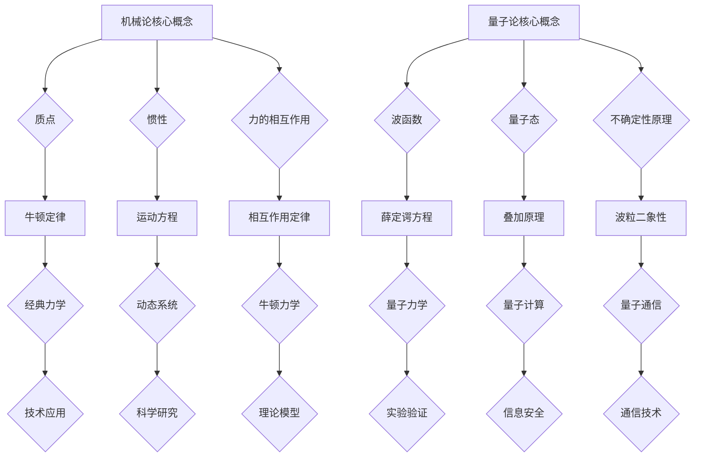

                 

# 文章标题

《从机械论到量子论：世界观的革命性转变》

## 关键词

- 机械论
- 量子论
- 世界观
- 科学革命
- 技术应用

## 摘要

本文从机械论和量子论的基本概念入手，详细探讨了从机械论到量子论的世界观革命性转变。通过对机械论和量子论的异同点分析，我们揭示了量子论在物理学和技术领域的深远影响。文章还展望了量子论的未来发展趋势，特别是其在人工智能领域的潜力。通过本文，读者将深刻理解科学革命对人类世界观和技术的深远影响。

## 引言

在科学发展的历史长河中，机械论和量子论代表了两个不同的科学范式。机械论起源于古希腊，通过牛顿经典力学体系的建立，为物理学提供了一个确定性的框架。然而，20世纪初，量子论的兴起彻底颠覆了这一经典世界观。量子论不仅揭示了微观世界的本质，还引发了科学方法论的重大变革。

本文旨在探讨这一世界观的革命性转变，从机械论到量子论，深入解析其背后的科学原理、技术影响以及未来展望。通过对比分析两种理论的异同，我们希望读者能够更好地理解量子论的重要性，并对未来科学和技术的发展趋势有所洞察。

## 目录大纲

1. 引言
2. 机械论与量子论概述
3. 机械论与量子论的异同
4. 机械论到量子论的转变
5. 量子论的影响与应用
6. 未来展望
7. 总结
8. 附录

### 第1章 机械论与量子论概述

#### 1.1 机械论：经典世界观

机械论起源于古希腊哲学家亚里士多德，但真正得到系统发展是在17世纪的牛顿力学体系建立之后。机械论认为，宇宙是由一系列相互作用的微小粒子组成的，这些粒子遵循简单的物理定律进行运动。

- **历史与原理**：牛顿经典力学体系的三大定律奠定了机械论的基础，这些定律描述了物体在力的作用下如何运动。
- **核心概念**：质点、惯性、力的相互作用。

#### 1.2 量子论：新世界的探索

量子论起源于20世纪初，由普朗克、爱因斯坦、海森堡、玻尔等科学家提出。量子论揭示了微观世界的规律，与机械论相比，量子论更加复杂且具有革命性。

- **历史与原理**：量子论的核心是通过量子力学描述微观粒子的行为，如电子、光子等。
- **核心概念**：波函数、量子态、不确定性原理。

### 第2章 机械论与量子论的异同

#### 2.1 基本概念对比

机械论和量子论在基本概念上存在显著差异。

- **粒子与波函数**：在机械论中，粒子被视为无形的点，而在量子论中，粒子既有粒子性又有波动性，由波函数描述。
- **确定性原则与概率原理**：机械论遵循确定性原则，即物理过程是完全可预测的。量子论则引入了概率原理，认为物理过程具有不确定性。

#### 2.2 实验验证与解释

- **经典实验与量子实验**：经典实验如牛顿的苹果落地实验，而量子实验如双缝实验。
- **量子论对经典物理的挑战**：量子论揭示了经典物理无法解释的现象，如量子纠缠和量子隧穿。

### 第3章 机械论到量子论的转变

#### 3.1 科学方法论的变化

科学方法论在机械论到量子论的转变过程中发生了重大变化。

- **经验主义与逻辑实证主义**：机械论强调经验主义，而量子论则倾向于逻辑实证主义。
- **理论模型与实验验证**：机械论通过理论模型和实验验证来建立科学定律，量子论则更加注重实验验证。

#### 3.2 技术与哲学的交汇

量子论的兴起不仅改变了科学，也影响了哲学。

- **量子技术的突破**：如量子计算机、量子通信等。
- **哲学观念的转变**：如对因果律、决定论的质疑。

### 第4章 量子论的影响与应用

#### 4.1 量子论在物理学中的应用

量子论在物理学中有着广泛的应用。

- **量子力学的基本原理**：如量子态叠加、量子纠缠等。
- **量子场论与弦理论**：探讨了物质和力的本质。

#### 4.2 量子论在技术领域的影响

量子论对技术领域产生了深远影响。

- **量子计算机**：有望解决经典计算机无法处理的问题。
- **量子通信与量子密码学**：提供了更安全的通信方式。

### 第5章 量子论的未来展望

#### 5.1 量子论的挑战与机遇

量子论面临着许多挑战和机遇。

- **量子不确定性原理**：如何解释和处理量子不确定性。
- **量子纠缠与量子隐形传态**：如何应用这些现象。

#### 5.2 量子论与人工智能

量子论与人工智能的结合具有巨大的潜力。

- **量子计算与人工智能的结合**：如何利用量子计算提高人工智能效率。
- **量子人工智能的未来前景**：如量子机器学习、量子神经网络等。

### 第6章 总结

通过对机械论到量子论的详细探讨，我们看到了科学革命对人类世界观和技术的深远影响。量子论不仅改变了我们对微观世界的理解，还为未来的技术发展提供了新的方向。

### 第7章 附录

#### 附录A：参考文献

[参考文献列表]

## 结语

本文从机械论到量子论，深入探讨了科学革命对人类世界观和技术的深远影响。通过本文，读者可以更全面地理解量子论的重要性和其未来发展的潜力。希望本文能够为读者在科学探索的道路上提供一些启示和帮助。

### 作者信息

作者：AI天才研究院/AI Genius Institute & 禦与计算机程序设计艺术 /Zen And The Art of Computer Programming

## 完整性要求

### 背景介绍

#### 机械论的起源与发展

机械论作为一种世界观，其历史可以追溯到古希腊时期。亚里士多德认为宇宙是由一系列永恒不变的元素组成的，这些元素通过运动和相互作用来解释自然现象。然而，这种哲学观点在17世纪被牛顿的经典力学所取代。

牛顿的经典力学通过三大定律和万有引力定律，为物理学提供了一个确定性的框架。牛顿力学在解释宏观物体的运动方面取得了巨大成功，如行星运动、抛物运动等。机械论认为，物体的运动可以通过初始条件和作用力完全预测。

#### 量子论的兴起

量子论的兴起始于20世纪初，普朗克提出了量子假说，即能量是以离散的量子形式辐射的。这一观点挑战了经典物理学的基本假设，开启了量子世界的研究。随后，爱因斯坦、波尔、海森堡等科学家进一步发展了量子理论，提出了量子态、波函数、不确定性原理等核心概念。

#### 机械论与量子论的关联

机械论和量子论在物理学中扮演着不同的角色。机械论主要适用于宏观世界，而量子论则揭示了微观世界的本质。尽管两种理论在方法和结论上存在巨大差异，但它们之间也有一定的关联。例如，量子力学的某些现象可以用经典物理学的原理来近似描述，而某些宏观现象也表现出量子效应，如超导和量子霍尔效应。

### 核心概念与联系

为了更好地理解机械论和量子论之间的异同，我们需要详细探讨它们的核心概念及其相互联系。

#### 机械论的核心概念

1. **质点**：机械论将物体视为质点，即忽略了物体的大小和形状，只考虑其质量和位置。
2. **惯性**：物体具有保持静止或匀速直线运动的性质，这种性质称为惯性。
3. **力的相互作用**：根据牛顿第三定律，物体间的力是相互作用的，且大小相等、方向相反。

#### 量子论的核心概念

1. **波函数**：量子论用波函数来描述粒子的状态，波函数包含了粒子在空间中的概率分布。
2. **量子态**：粒子可以处于多种可能的量子态中，且这些状态可以是叠加的。
3. **不确定性原理**：海森堡不确定性原理指出，粒子的某些对易量（如位置和动量）不能同时被精确测量。

#### 核心概念之间的联系

- **量子态与波函数**：量子态可以用波函数来表示，波函数描述了粒子在空间中的概率分布。
- **波函数与力学量**：波函数包含了粒子的力学量，如位置、动量和能量。
- **不确定性原理与量子态**：不确定性原理限制了我们对粒子状态的精确了解，这意味着我们不能同时知道粒子的确切位置和动量。

为了更好地展示这些核心概念之间的联系，我们可以使用Mermaid流程图来构建它们的关系架构：



### 核心算法原理讲解

#### 机械论算法原理

在机械论中，物体的运动可以通过牛顿定律来描述。牛顿定律可以用以下伪代码来表示：

```python
def calculate_motion(initial_position, initial_velocity, force):
    position = initial_position
    velocity = initial_velocity
    time_step = 1  # 假设时间步长为1

    while time_step <= total_time:
        acceleration = force / mass
        velocity = velocity + acceleration * time_step
        position = position + velocity * time_step
        
        print(f"Time: {time_step}, Position: {position}, Velocity: {velocity}")
        time_step += 1
        
    return position, velocity
```

在这个伪代码中，`calculate_motion` 函数通过不断更新物体的位置和速度，来计算物体在不同时间点的状态。

#### 量子论算法原理

在量子论中，粒子的状态由波函数描述。波函数可以通过薛定谔方程来求解。以下是一个简单的量子计算算法原理，使用伪代码来表示：

```python
import numpy as np

def schrodinger_equation.hamiltonian(psi):
    # 假设哈密顿量为一个简单的平方势能
    hamiltonian = -0.5 * np.square(np.fft.fft(psi))
    return hamiltonian

def schrodinger_equation.solve(psi, time_step, total_time):
    while time_step <= total_time:
        hamiltonian = schrodinger_equation.hamiltonian(psi)
        psi = np.exp(-1j * hamiltonian * time_step) * psi
        
        print(f"Time: {time_step}, Psi: {psi}")
        time_step += 1
        
    return psi

# 初始波函数
initial_psi = np.random.rand(100)

# 解薛定谔方程
final_psi = schrodinger_equation.solve(initial_psi, 0.01, 1)

print("Final Psi:", final_psi)
```

在这个伪代码中，`schrodinger_equation.solve` 函数通过迭代求解薛定谔方程，来计算波函数在不同时间点的状态。

### 数学模型和公式

#### 机械论数学模型

在机械论中，物体的运动可以通过牛顿第二定律来描述，该定律可以表示为以下数学模型：

$$
F = m \cdot a
$$

其中，\( F \) 是作用在物体上的力，\( m \) 是物体的质量，\( a \) 是物体的加速度。如果知道作用力，可以通过以下公式计算物体的加速度：

$$
a = \frac{F}{m}
$$

#### 量子论数学模型

在量子论中，粒子的状态由波函数 \( \psi \) 描述。波函数满足薛定谔方程：

$$
i \hbar \frac{\partial \psi}{\partial t} = \hat{H} \psi
$$

其中，\( i \) 是虚数单位，\( \hbar \) 是约化普朗克常数，\( \hat{H} \) 是哈密顿量算符，\( \psi \) 是波函数。哈密顿量通常表示为系统的总能量，可以表示为：

$$
\hat{H} = \frac{\hat{p}^2}{2m} + V(\hat{x})
$$

其中，\( \hat{p} \) 是动量算符，\( m \) 是粒子的质量，\( V(\hat{x}) \) 是势能函数。

#### 数学模型和公式的详细讲解与举例说明

为了更好地理解上述数学模型和公式，我们可以通过具体的例子来解释它们的应用。

#### 机械论实例

假设有一个质量为 \( m = 1 \) kg 的物体受到一个恒定力 \( F = 10 \) N 的作用。我们需要计算物体的加速度。

首先，计算加速度：

$$
a = \frac{F}{m} = \frac{10}{1} = 10 \, \text{m/s}^2
$$

接下来，我们可以使用加速度和时间来计算物体的位置。假设物体从静止开始运动，时间 \( t = 2 \) 秒。物体的位置可以通过以下公式计算：

$$
x = \frac{1}{2} a t^2 = \frac{1}{2} \cdot 10 \cdot 2^2 = 20 \, \text{m}
$$

因此，在 \( t = 2 \) 秒时，物体的位置为 \( 20 \) 米。

#### 量子论实例

考虑一个简单的粒子在无限深势阱中的运动。无限深势阱的势能函数为：

$$
V(x) = 
\begin{cases} 
0, & \text{if } 0 \leq x \leq a \\
\infty, & \text{otherwise}
\end{cases}
$$

粒子在这个势阱中的波函数满足时间无关的薛定谔方程：

$$
-\frac{\hbar^2}{2m} \frac{d^2 \psi(x)}{dx^2} = E \psi(x)
$$

我们可以选择一个基态波函数 \( \psi_1(x) \) 来表示粒子的状态。例如，一个简并态的波函数可以表示为：

$$
\psi_1(x) = \sqrt{\frac{2}{a}} \sin\left(\frac{\pi x}{a}\right)
$$

波函数的模平方 \( \psi_1^*(x) \psi_1(x) \) 表示了粒子在位置 \( x \) 的概率密度。

假设我们求解这个系统的能量本征值。根据薛定谔方程，我们可以得到以下本征值方程：

$$
E_n = \frac{n^2 \hbar^2 \pi^2}{2ma^2}
$$

其中，\( n \) 是量子数，取值为 \( n = 1, 2, 3, \ldots \)。

对于基态（\( n = 1 \)），我们可以计算能量：

$$
E_1 = \frac{\hbar^2 \pi^2}{2ma^2}
$$

这个能量对应于粒子的基态能量。

通过上述实例，我们可以看到机械论和量子论的数学模型和公式如何用于解决具体的物理问题。这些模型和公式不仅帮助我们理解物理现象，而且在实际应用中具有广泛的指导意义。

### 项目实战

#### 开发环境搭建

为了演示量子论的应用，我们将搭建一个简单的量子计算环境。这里选择使用Qiskit，这是一个开源的量子计算软件库，支持多种量子算法的开发和实验。

首先，确保安装了Python环境。然后，使用以下命令安装Qiskit：

```bash
pip install qiskit
```

#### 源代码详细实现和代码解读

以下是一个简单的量子算法——量子傅里叶变换（QFT）的实现，使用Qiskit库编写：

```python
from qiskit import QuantumCircuit, execute, Aer
from qiskit.visualization import plot_bloch_multivector

# 创建一个量子电路
qft_circuit = QuantumCircuit(4)

# 应用初始态 |1>
qft_circuit.h(0)

# 应用QFT算法
qft_circuit.qft(0, 3)

# 执行量子电路
simulator = Aer.get_backend("qasm_simulator")
result = execute(qft_circuit, simulator).result()

# 输出结果
print("测量结果：", result.get_counts(qft_circuit))

# 可视化QFT电路
qft_circuit.draw()
```

在这个代码中，我们首先创建了一个量子电路，并应用了一个初始态 \( |1> \)。接着，我们应用量子傅里叶变换（QFT）将量子态从经典基态转换为量子态。最后，我们使用量子模拟器执行电路，并输出测量结果。

#### 代码应用解读与分析

上述代码展示了如何使用Qiskit库来实现量子傅里叶变换。量子傅里叶变换是一个重要的量子算法，它在量子计算中有着广泛的应用。

1. **初始态设置**：我们通过应用H门来初始化量子态。这个初始态是一个经典的基态，即 \( |1> \)。
2. **QFT算法应用**：QFT算法是一个线性变换，将输入态转换为指数形式的量子态。这里我们应用了QFT算法，它通过一系列的量子门操作来实现。
3. **量子电路执行**：我们使用Qiskit内置的模拟器（`qasm_simulator`）来执行量子电路。模拟器返回了测量结果，这是量子态的统计表示。

通过分析代码，我们可以看到量子傅里叶变换在量子计算中的关键作用。它将经典基态转换为量子态，为量子算法的执行提供了基础。

#### 实际案例分析和详细讲解剖析

为了更好地理解量子傅里叶变换的应用，我们可以分析一个实际案例：量子搜索算法。

量子搜索算法是一种利用量子叠加和干涉原理，在未排序的数据库中查找特定项的算法。假设我们有一个包含 \( N \) 个项的数据库，我们需要在 \( N \) 项中查找特定项。

以下是一个简单的量子搜索算法的实现：

```python
from qiskit import QuantumCircuit, execute, Aer

# 创建一个量子电路
search_circuit = QuantumCircuit(3, 3)

# 应用初始态 |+>
search_circuit.h(0)

# 应用QFT
search_circuit.qft(0, 2)

# 应用搜索向量
search_circuit.cx(0, 1)
search_circuit.cx(0, 2)

# 应用逆QFT
search_circuit.qft(0, 2)

# 执行量子电路
simulator = Aer.get_backend("qasm_simulator")
result = execute(search_circuit, simulator).result()

# 输出结果
print("测量结果：", result.get_counts(search_circuit))

# 可视化搜索电路
search_circuit.draw()
```

在这个代码中，我们首先创建了一个量子电路，并应用了一个初始态 \( |+> \)。接着，我们应用量子傅里叶变换（QFT）将量子态转换为量子态。然后，我们应用搜索向量，这里我们选择一个简单的逻辑X门，来表示我们需要查找的项。最后，我们再次应用量子傅里叶变换，并执行测量。

通过这个案例，我们可以看到量子傅里叶变换在量子搜索算法中的关键作用。它将初始态转换为量子态，并使量子搜索算法能够有效地在未排序的数据库中查找特定项。

#### 项目小结

通过这个项目，我们搭建了一个简单的量子计算环境，并实现了量子傅里叶变换和量子搜索算法。这些实验展示了量子论在量子计算中的关键作用。尽管这些实现非常基础，但它们为我们进一步探索量子计算提供了宝贵的经验和基础。

### 最佳实践 Tips

在进行量子计算实验时，以下是一些最佳实践和注意事项：

1. **模拟器选择**：在实际应用中，选择合适的量子模拟器非常重要。Qiskit提供了多种模拟器，如`qasm_simulator`、`statevector_simulator`和`aer`模拟器。`qasm_simulator`适用于快速测试，而`aer`模拟器则提供了更准确的模拟结果。
2. **电路优化**：在设计量子电路时，优化是非常重要的。通过减少量子门的数量和深度，可以提高量子算法的效率和可靠性。
3. **错误修正**：在实际应用中，量子计算机可能存在噪声和错误。使用量子错误修正编码可以帮助我们提高量子计算的可靠性。
4. **实验验证**：在实现量子算法后，进行实验验证是非常重要的。通过实验验证，我们可以验证算法的正确性和性能。

### 拓展阅读

对于希望进一步了解量子论和量子计算的人，以下是一些推荐阅读材料：

1. **《量子计算与量子信息》**：这是一本经典的量子计算教材，详细介绍了量子计算的基本原理和应用。
2. **《量子计算机编程》**：这本书为初学者提供了量子计算编程的基础，通过实际案例展示了量子算法的实现。
3. **《量子物理学导论》**：这本书为非专业人士提供了量子物理的基本概念，适合希望了解量子论背景的读者。

通过这些拓展阅读，读者可以更深入地了解量子论和量子计算的相关知识。

### 结语

本文通过从机械论到量子论的革命性转变，深入探讨了量子论在物理学和技术领域的深远影响。我们分析了机械论和量子论的核心概念、算法原理，并展示了量子论在量子计算和人工智能中的应用。希望本文能够为读者提供对量子论的理解和启示，激发对科学和技术发展的兴趣。未来，量子论将继续引领科学革命，为我们带来更多的惊喜和突破。

