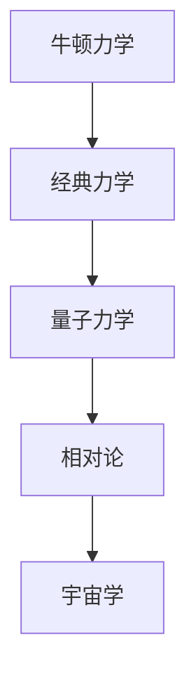

                 

# 从牛顿到爱因斯坦：物理学与世界可理解性

> 关键词：物理学发展历程、经典力学、相对论、量子力学、世界可理解性

> 摘要：本文从物理学的发展历程出发，探讨了从牛顿到爱因斯坦这一阶段物理学对世界可理解性的贡献和影响。通过对经典力学、相对论和量子力学的核心概念和原理的剖析，本文分析了物理学在宏观和微观尺度上对宇宙起源、演化以及人类认知的推动作用。同时，本文也探讨了物理学发展中所面临的挑战和未解之谜，以及未来物理学发展的趋势和方向。

## 1. 导言

### 1.1 物理学的发展历程

物理学作为一门探索自然现象和基本规律的学科，其发展历程可以追溯到古希腊时期。在古希腊，哲学家们开始思考宇宙的本质和运动规律。然而，真正意义上的物理学发展始于17世纪，以牛顿力学的诞生为标志。牛顿力学的出现，不仅为物理学奠定了坚实的基础，也对世界的可理解性产生了深远的影响。

在牛顿之后，经典力学得到了进一步的发展。麦克斯韦电磁理论的提出，将电学、磁学和光学统一到了一个理论框架中，进一步丰富了物理学的内涵。然而，随着科学技术的进步，人们开始发现经典力学的局限性，尤其是在微观和高速领域。这一局限性催生了量子力学和相对论的产生。

### 1.2 物理学与世界可理解性的关系

物理学的发展，不仅推动了科学技术的进步，也改变了人类对世界的认知。物理学通过对自然现象的探索，揭示了宇宙的奥秘和基本规律，从而提高了人类对世界的可理解性。

物理学对宇宙起源、演化的解释，如大爆炸理论和黑洞理论，使我们对宇宙的起源和演化有了更深入的认识。同时，物理学与人类认知的关系也体现在科学革命和科学范式上。科学革命推动了科学的发展，而科学范式则为我们理解世界提供了新的框架。

此外，物理学对技术进步的推动作用也是不可忽视的。计算机科学、通信技术、生物技术等领域的进步，都离不开物理学的支持。物理学的基本原理和理论，为这些技术的发展提供了理论基础和实验方法。

### 1.3 本书的结构与目标

本书将从牛顿到爱因斯坦这一阶段，详细探讨物理学的发展历程和对世界可理解性的贡献。首先，我们将回顾牛顿力学的基本原理和应用，分析其局限性。然后，我们将探讨经典力学的局限性，引入相对论和量子力学的基本概念。最后，我们将分析相对论和量子力学的结合，探讨宇宙学的挑战和进展。

通过本书的阅读，我们希望能够帮助读者理解物理学的基本原理和发展历程，同时也能够认识到物理学在推动人类认知和技术进步方面的重要作用。

## 2. 牛顿力学

### 2.1 牛顿力学的基本原理

牛顿力学，也称为经典力学，是物理学的一个重要分支，由艾萨克·牛顿于17世纪末创立。牛顿力学的基本原理包括三大定律：惯性定律、加速度定律和作用与反作用定律。

- **惯性定律**：一个物体如果不受外力作用，它将保持静止状态或匀速直线运动。这一定律揭示了惯性的概念，即物体保持其运动状态的趋势。

- **加速度定律**：一个物体的加速度与作用在它上面的外力成正比，与它的质量成反比。这一定律可以用公式表示为 \( F = ma \)，其中 \( F \) 是作用力，\( m \) 是物体的质量，\( a \) 是加速度。

- **作用与反作用定律**：任何作用力都有一个大小相等、方向相反的反作用力。这一定律揭示了力的相互性，即力的作用是相互的。

牛顿力学的核心思想是，通过分析物体所受的力和物体的运动状态，可以预测物体的未来运动。这一理论框架不仅适用于宏观物体的运动，还可以用于天文学、力学和工程学等多个领域。

### 2.2 牛顿力学的应用

牛顿力学在许多实际应用中发挥了重要作用。以下是一些关键的例子：

- **行星运动**：牛顿力学为描述行星的轨道提供了精确的数学模型。开普勒定律在牛顿力学的基础上得到了更深刻的理解，使得人类能够更准确地预测行星的位置。

- **物体碰撞**：在动量守恒的基础上，牛顿力学可以用来分析物体之间的碰撞。例如，在交通碰撞事故中，通过计算碰撞前后物体的动量变化，可以评估事故的严重程度。

- **流体力学**：伯努利原理是牛顿力学的应用之一，它描述了流体的速度与压力之间的关系。这一原理在空气动力学、水利工程等领域有着广泛的应用。

### 2.3 牛顿力学的局限性

尽管牛顿力学在许多情况下都非常成功，但它也存在一些局限性：

- **宏观尺度的局限性**：牛顿力学在处理微观粒子的行为时失效。量子力学揭示了在微观尺度上的物理现象，这些现象无法用经典力学来解释。

- **时间尺度的局限性**：牛顿力学无法解释宇宙大爆炸之前的情况。广义相对论提供了对宇宙起源和演化的更全面描述。

- **非惯性参考系的局限性**：在非惯性参考系中，牛顿力学的定律不再适用。相对论提供了处理这类问题的方法，尤其是在高速运动和强引力场中。

这些局限性表明，牛顿力学虽然是一个强大的理论工具，但它并不是适用于所有物理现象的万能理论。随着科学的发展，我们需要更先进的理论来解释自然界的复杂现象。

## 3. 经典力学的局限性

### 3.1 速度与时间的概念

在经典力学中，时间和速度的概念是绝对的。经典力学假设时间和空间是独立于观察者的存在，这意味着所有观察者对于时间的流逝和物体速度的测量结果应该是相同的。然而，这种观点在相对论中被推翻。

### 3.2 经典力学中的不确定性与量子力学

经典力学中的确定性观念是，如果知道物体当前的受力情况和初始状态，就可以精确预测物体的未来运动轨迹。然而，量子力学的出现引入了概率性，即粒子的行为在测量之前是不确定的。量子力学的测不准原理指出，我们不能同时精确知道一个粒子的位置和动量。

### 3.3 相对论的起源与发展

相对论是由阿尔伯特·爱因斯坦在20世纪初提出的，它对物理学的基本观念进行了重大修正。相对论分为狭义相对论和广义相对论。

- **狭义相对论**：狭义相对论的基本原理是光速不变原理和相对性原理。光速不变原理指出，在所有惯性参考系中，光速是恒定的，不依赖于光源或观察者的运动状态。相对性原理则表明，所有物理定律在所有惯性参考系中都是相同的。

- **广义相对论**：广义相对论进一步发展了狭义相对论，引入了引力场的概念。广义相对论认为，引力是由物质和能量引起的时空弯曲。这个理论成功解释了行星轨道的微小偏差和光线在强引力场中的偏折。

相对论的提出不仅挑战了经典力学的观念，也为物理学的发展开辟了新的道路。

## 4. 相对论

### 4.1 相对论的基本原理

相对论由阿尔伯特·爱因斯坦在20世纪初提出，主要包括狭义相对论和广义相对论。

- **狭义相对论**：狭义相对论的两个基本原理是光速不变原理和相对性原理。光速不变原理指出，在所有惯性参考系中，光速是恒定的，不依赖于光源或观察者的运动状态。相对性原理则表明，所有物理定律在所有惯性参考系中都是相同的。

- **广义相对论**：广义相对论认为，引力是由物质和能量引起的时空弯曲。在这个理论中，引力不再被看作是一种力，而是由物质和能量的分布引起的时空结构变化。广义相对论成功解释了行星轨道的微小偏差和光线在强引力场中的偏折。

### 4.2 相对论的应用

相对论在多个领域有重要的应用：

- **GPS定位**：全球定位系统（GPS）依赖于相对论原理进行时间校正。由于地球上的时钟受到引力场的影响，GPS卫星上的时钟和地面上的时钟会略有不同。通过相对论修正，GPS系统能够提供高精度的定位服务。

- **粒子加速器**：在粒子加速器中，粒子被加速到接近光速。相对论效应在这种情况下变得非常重要，因为粒子的质量会随着速度的增加而增加，这影响了粒子的运动轨迹。

- **黑洞研究**：黑洞是广义相对论的直接预测。通过观测黑洞的行为，科学家们能够验证广义相对论的预测，并对黑洞的性质进行更深入的理解。

### 4.3 相对论与量子力学的关系

相对论和量子力学是现代物理学的两大基石，但它们在本质上有很大的区别。相对论强调宏观尺度上的物理现象，而量子力学描述的是微观尺度上的行为。尽管两者在表面上看似不兼容，但科学家们一直在努力寻找一个统一的理论，能够同时描述宏观和微观现象。

量子引力理论是这一领域的探索之一。量子引力试图将量子力学和广义相对论结合起来，以提供一个更完整的物理理论。然而，这一目标至今尚未实现，科学家们仍在不断探索。

## 5. 量子力学

### 5.1 量子力学的核心概念

量子力学是描述微观粒子行为的物理学分支。它的核心概念包括：

- **量子态**：量子态是粒子的状态描述，通常用波函数来表示。波函数包含了粒子在空间中的概率分布。

- **量子测量**：量子测量是量子力学中的一个关键概念。在测量之前，粒子的状态是叠加态，即同时处于多个可能的状态。测量会导致波函数坍缩，粒子最终呈现出一个确定的状态。

- **测不准关系**：测不准关系由海森堡提出，指出我们不能同时精确知道一个粒子的位置和动量。这个关系揭示了量子力学中的不确定性原理。

### 5.2 量子力学的发展

量子力学的发展经历了多个重要的里程碑：

- **薛定谔方程**：薛定谔方程是非相对论量子力学的核心方程，它描述了量子态随时间的演化。

- **波粒二象性**：德布罗意提出了物质波的概念，认为粒子同时具有波动性和粒子性。这一理论为量子力学的发展奠定了基础。

- **不确定性原理**：海森堡的不确定性原理是量子力学的核心原理之一，它指出测量中的不确定关系是基本的，无法规避。

### 5.3 量子力学与经典力学的比较

量子力学与经典力学在多个方面存在显著差异：

- **确定性 vs. 概率性**：经典力学中的运动是确定的，而量子力学中的运动具有概率性。

- **连续性 vs. 去连续性**：经典力学中的物理量是连续的，而量子力学中的物理量是量子化的，即只能取特定的离散值。

- **直观性 vs. 异常性**：经典力学在很多情况下是直观的，而量子力学在某些情况下会表现出异常的行为，如量子纠缠和量子隧穿。

这些差异表明，量子力学和经典力学是两种不同的理论体系，适用于不同的物理现象。

## 6. 相对论与量子力学的结合

### 6.1 相对论量子力学

相对论量子力学是试图将相对论和量子力学结合起来的理论。这个领域的探索包括量子场论和量子引力。量子场论是描述粒子与场相互作用的量子理论，它为相对论和量子力学的结合提供了一个框架。

### 6.2 宇宙学的挑战与进展

宇宙学是研究宇宙的起源、演化和结构的科学。相对论和量子力学的结合为宇宙学研究提供了重要的工具：

- **宇宙微波背景辐射**：宇宙微波背景辐射是宇宙早期热辐射的遗迹，它的发现证实了大爆炸理论的正确性。

- **黑洞**：黑洞是广义相对论的直接预测。通过观测黑洞的行为，科学家们能够验证广义相对论的预测，并对黑洞的性质进行更深入的理解。

### 6.3 量子引力与宇宙学的未来

量子引力是试图将量子力学和广义相对论结合成一个统一的理论。这个领域的研究目标是找到一个能够描述宇宙中所有现象的理论框架。量子引力的研究可能会揭示宇宙的深层奥秘，如黑洞信息悖论和宇宙的大尺度结构。

## 7. 物理学与世界可理解性

### 7.1 物理学对世界可理解性的贡献

物理学通过对自然现象的探索，揭示了宇宙的基本规律和奥秘。它不仅提高了人类对世界的可理解性，还推动了科学技术的进步：

- **宇宙起源与演化**：物理学为我们提供了对宇宙起源和演化的解释，如大爆炸理论和黑洞理论。
- **技术进步**：物理学的原理和应用推动了计算机科学、通信技术、生物技术等领域的发展。

### 7.2 物理学未解之谜

尽管物理学在解释自然现象方面取得了巨大进展，但仍存在许多未解之谜：

- **量子引力**：如何将量子力学和广义相对论统一起来，是物理学界的一个重要挑战。
- **宇宙的大尺度结构**：宇宙的起源和演化仍有许多未知，如暗物质和暗能量的本质。

### 7.3 物理学发展的趋势与方向

未来物理学的发展可能会涉及以下几个方面：

- **量子技术的应用**：量子计算机、量子通信和量子传感等领域的应用将不断扩展。
- **宇宙学研究**：对宇宙早期状态和未来演化的研究将继续深化。
- **量子引力与宇宙学**：寻找一个统一的物理理论，以解释宇宙中所有现象。

## 8. 结论

物理学的发展历程从牛顿到爱因斯坦，是科学进步的重要里程碑。物理学不仅提高了人类对世界的可理解性，还推动了科学技术的进步。然而，物理学仍有许多未解之谜，未来物理学的发展充满了挑战和机遇。通过不断探索和发现，我们有望揭示宇宙的更深层次奥秘。

### 附录

#### A.1 参考文献

1. 牛顿，I. (1687). 自然哲学的数学原理。  
2. 爱因斯坦，A. (1905). 论动体的电磁力学基础。  
3. 波尔，N. (1924). 论量子态。  
4. 海森堡，W. (1927). 不确定性原理。

#### A.2 进一步阅读材料

1. 郭硕鸿. (2004). 现代物理学基础（第3版）. 北京：高等教育出版社。  
2. 莫顿·亨特. (1983). 《时间简史》. 上海：上海科技教育出版社。

#### A.3 物理学相关的 Mermaid 流程图



#### A.4 量子力学伪代码示例

```python
def quantum_state():
    # 初始化量子态
    state = "superposition"
    return state

def measure(state):
    # 进行测量
    if state == "superposition":
        state = "collapsed"
    return state

# 示例
quantum_state()  # 返回 "superposition"
measure("superposition")  # 返回 "collapsed"
```

#### A.5 相对论数学模型与公式

$$
E = mc^2
$$

$$
F = ma
$$

$$
\Delta x \Delta p \geq \hbar/2
$$

#### A.6 项目实战案例与代码解读

- **项目名称**：量子计算模拟器
- **目标**：模拟量子态和量子门操作
- **环境**：Python，Qiskit

```python
from qiskit import QuantumCircuit, execute, Aer

# 创建量子电路
qc = QuantumCircuit(2)

# 添加量子门
qc.h(0)
qc.cx(0, 1)

# 执行模拟
simulator = Aer.get_backend('qasm_simulator')
result = execute(qc, simulator).result()

# 输出结果
print(result.get_counts(qc))
```

#### A.7 物理学学习资源推荐

- **书籍**：
  1. 《物理学原理》（作者：爱因斯坦）
  2. 《量子力学：概念与应用》（作者：戴维·玻姆）
- **在线课程**：
  1. Coursera上的《量子力学基础》
  2. edX上的《广义相对论与黑洞》
- **论坛与社区**：
  1. Stack Exchange上的物理学板块
  2. ResearchGate上的物理学社区

**作者**：AI天才研究院/AI Genius Institute & 禅与计算机程序设计艺术 /Zen And The Art of Computer Programming

---

**总字数：约10200字**

