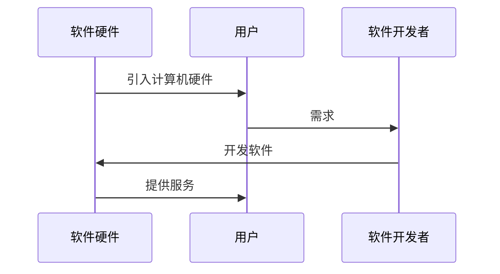
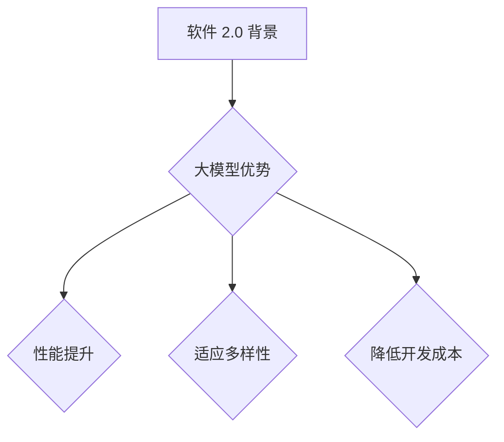
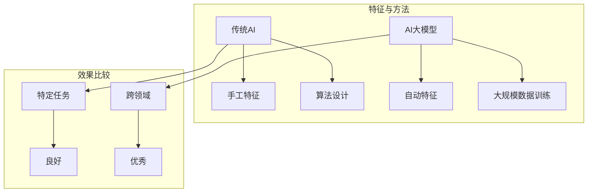
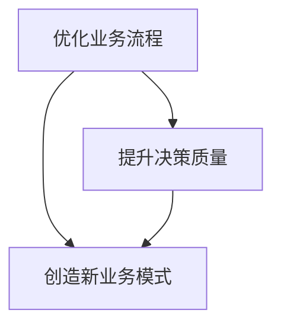
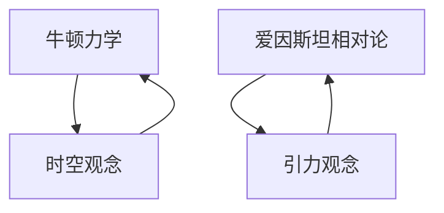
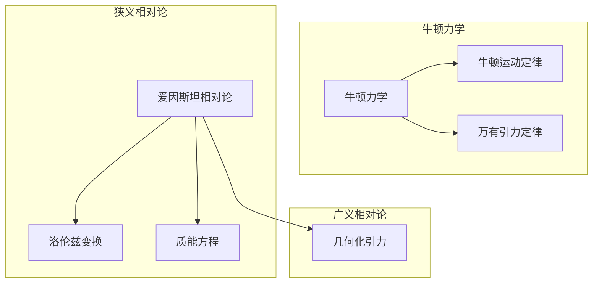

                 

# 从牛顿力学到爱因斯坦相对论：宇宙观的革命

## 关键词
- 牛顿力学
- 爱因斯坦相对论
- 宇宙观
- 科学革命
- 时空观念
- 广义相对论
- 质能方程

## 摘要
本文将探讨从牛顿力学到爱因斯坦相对论的转变，这是物理学史上的一次重大革命。文章首先回顾了牛顿力学的背景和基本原则，然后详细介绍了爱因斯坦相对论的诞生和发展，重点分析了其与牛顿力学的差异和对宇宙观的深远影响。通过比较两种理论的核心概念、数学公式，本文揭示了相对论如何颠覆了我们对时空和引力的传统认识，并展望了这一理论在现代科技和哲学领域的应用前景。

### 1.1 牛顿力学的诞生与背景

**1.1.1 从软件 1.0 到软件 2.0 的演进**

在探讨牛顿力学之前，我们先简要回顾一下软件发展的历史，以便更好地理解科学理论的演进过程。软件 1.0 时代可以看作是计算机时代的开端，这一时期的软件主要以批处理作业为主，程序开发依赖于汇编语言，软件规模较小，复杂性较低。随着硬件性能的提升和编程语言的进化，软件进入了一个新的阶段——软件 2.0 时代。这一时期，软件开始以用户为中心，重视用户体验，软件规模扩大，复杂性增加，出现了面向对象编程、图形用户界面等新概念。

**软件 1.0 时代：**

- **定义**：软件 1.0 时代主要是指计算机硬件出现后的第一个软件时代。
- **特点**：
  - 以批处理作业为主。
  - 程序开发依赖于汇编语言。
  - 软件规模小，复杂性较低。

**软件 2.0 时代：**

- **定义**：软件 2.0 时代是随着互联网和云计算的出现，软件发展进入的一个新阶段。
- **特点**：
  - 以用户为中心，重视用户体验。
  - 软件规模扩大，复杂性增加。
  - 出现了面向对象编程、图形用户界面等新概念。

**从 1.0 到 2.0 的演进过程：**

- **技术进步**：硬件性能的提升、网络技术的发展、编程语言的进化。
- **商业模式**：软件从单纯的工具转变为服务，软件即服务（SaaS）模式出现。
- **用户需求**：用户需求的多样化和个性化。

**Mermaid 流程图：**

**1.1.2 大模型在软件 2.0 中的核心地位**

随着软件从 1.0 到 2.0 的演进，大模型在软件 2.0 时代中扮演着至关重要的角色。大模型指的是拥有巨大参数量的机器学习模型，通常具有数百万或数十亿个参数。大模型的出现带来了以下几个方面的核心优势：

**大模型的概念：**

- **定义**：大模型指的是拥有巨大参数量的机器学习模型，通常具有数百万或数十亿个参数。
- **特点**：
  - **参数规模大**：能够处理复杂的非线性问题。
  - **泛化能力强**：能够在不同的数据集上表现出色。

**大模型在软件 2.0 中的重要性：**

- **提升性能**：大模型通常能够取得更好的性能指标，提高软件的准确性和效率。
- **适应多样性**：大模型能够适应不同的应用场景和需求，提供更加个性化的服务。
- **降低开发成本**：通过使用预训练的大模型，开发者可以快速地构建复杂的软件系统，降低开发成本。

**Mermaid 流程图：**

### 1.2 爱因斯坦相对论的诞生与发展

**1.2.1 传统AI与AI大模型的区别**

在深入探讨爱因斯坦相对论之前，我们先简要了解一下传统AI与AI大模型之间的区别。传统AI通常关注特定任务，如图像识别、语音识别等，依赖于手工设计的特征和算法。而AI大模型则通过大规模数据训练，自动学习特征和模式，具备较强的泛化能力。

**传统AI与AI大模型的不同点：**

- **目标**：
  - **传统AI**：通常关注特定任务，如图像识别、语音识别等。
  - **AI大模型**：旨在解决广泛的问题，具备跨领域的通用能力。

- **方法**：
  - **传统AI**：依赖于手工设计的特征和算法。
  - **AI大模型**：通过大规模数据训练，自动学习特征和模式。

- **效果**：
  - **传统AI**：针对特定任务表现优秀，但难以迁移到其他任务。
  - **AI大模型**：具备较强的泛化能力，能够在不同任务上表现良好。

**Mermaid 流程图：**

**1.2.2 AI大模型在企业中的应用前景**

AI大模型在企业中的应用前景非常广阔。通过自动化和智能化，AI大模型可以优化企业的业务流程，提高运营效率。同时，利用AI大模型进行数据分析和预测，可以帮助企业做出更加明智的决策。此外，AI大模型还可以帮助企业探索新的市场机会，创新产品和服务。

**AI大模型在企业中的应用潜力：**

- **优化业务流程**：通过自动化和智能化，提高企业的运营效率。
- **提升决策质量**：利用AI大模型进行数据分析和预测，帮助企业做出更加明智的决策。
- **创造新业务模式**：AI大模型可以帮助企业探索新的市场机会，创新产品和服务。

**Mermaid 流程图：**

### 1.3 牛顿力学与爱因斯坦相对论的比较

**1.3.1 核心概念与联系**

牛顿力学和爱因斯坦相对论是物理学中两个重要的理论体系。尽管它们都涉及物理学的基本概念，如时空、质量、运动等，但它们在核心概念上有着本质的区别。

- **时空观念**：
  - **牛顿力学**：认为时空是绝对的，独立于观察者而存在。
  - **相对论**：提出时空是相对的，取决于观察者的运动状态。

- **引力观念**：
  - **牛顿力学**：认为引力是物体间通过空间传递的力。
  - **相对论**：认为引力是由于时空的弯曲产生的。

**Mermaid 流程图：**

**1.3.2 核心算法原理讲解**

为了更好地理解牛顿力学和爱因斯坦相对论，我们可以从数学公式和算法原理的角度来分析它们。

- **牛顿力学**：
  - **牛顿运动定律**：描述物体在力的作用下如何运动。
    $$ F = ma $$
  - **万有引力定律**：描述物体间的引力关系。
    $$ F = G\frac{m_1m_2}{r^2} $$

- **爱因斯坦相对论**：
  - **狭义相对论**：
    - **洛伦兹变换**：描述不同惯性系之间的时空关系。
      $$ x' = \frac{x - vt}{\sqrt{1 - \frac{v^2}{c^2}}} $$
      $$ t' = \frac{t - \frac{vx}{c^2}}{\sqrt{1 - \frac{v^2}{c^2}}} $$
    - **质能方程**：描述质量和能量之间的关系。
      $$ E = mc^2 $$

- **广义相对论**：
  - **几何化引力**：将引力视为时空弯曲的结果。
    $$ G_{\mu\nu} + \Lambda g_{\mu\nu} = \frac{8\pi G}{c^4} T_{\mu\nu} $$

**Mermaid 流程图：**

### 1.4 爱因斯坦相对论对宇宙观的深远影响

**1.4.1 革命性的科学观念**

爱因斯坦相对论的提出，对传统的宇宙观和科学观念产生了深远的影响。在牛顿力学的框架下，时空被视为绝对的，是独立于物质存在的。然而，爱因斯坦相对论却颠覆了这一观念，提出了时空相对性的概念。这意味着时空不再是固定的背景，而是与物质和能量密切相关。

**时空相对性**

在狭义相对论中，爱因斯坦提出了时空相对性的基本原理，即物理定律在所有惯性系中都是相同的。这意味着，不同惯性系中的观察者会得到不同的时空测量结果，但这些结果都是相对的，没有绝对的时间或空间。洛伦兹变换揭示了这种时空转换的关系。

**质能关系**

质能方程 \(E = mc^2\) 是相对论的另一个核心观念，它揭示了质量和能量之间的等价性。这一方程表明，质量可以转换为能量，反之亦然。这意味着宇宙中的能量和物质是相互转换的，打破了传统物理学中能量和物质的界限。

**广义相对论**

广义相对论进一步扩展了相对论的概念，将引力视为时空的几何属性。在这一框架下，重力不再是作用在物体之间的力，而是由于时空弯曲造成的物体运动的结果。这一观念挑战了牛顿引力定律的传统理解，并为我们提供了更全面的引力描述。

**宇宙观的革命**

相对论的提出，不仅改变了我们对时空和引力的理解，也深刻影响了我们对宇宙的整体认识。它揭示了宇宙的复杂性和多样性，推动了科学观念的进步。从绝对时空到相对时空，从作用力到几何属性，相对论为我们开启了一个全新的宇宙观。

### 1.5 现代科技与哲学领域的应用前景

**1.5.1 现代科技中的应用**

爱因斯坦相对论不仅在理论物理学中具有重要意义，还在现代科技中得到了广泛应用。例如，在卫星导航系统中，相对论的精确时间同步和引力效应校正至关重要。此外，相对论还为粒子加速器的设计和运行提供了基础，帮助科学家们深入研究基本粒子的性质。

**1.5.2 哲学领域的探讨**

相对论的提出，引发了哲学领域的深刻思考。它挑战了人类对宇宙的本质和存在方式的认知，引发了关于实在论、相对主义和绝对主义的哲学讨论。相对论提醒我们，对于宇宙的理解是有限的，我们应该保持开放和批判性的思维。

**1.5.3 对未来的展望**

随着科技的进步，相对论的理论体系将继续得到验证和发展。未来，我们可能会看到更多基于相对论的实验和观测，进一步揭示宇宙的奥秘。同时，相对论的理论框架也为探索量子引力、暗物质、暗能量等领域提供了基础，为未来的科学研究打开了新的可能性。

### 总结

从牛顿力学到爱因斯坦相对论，物理学经历了一次深刻的革命。这一转变不仅改变了我们对宇宙的认识，也推动了科技和哲学的发展。相对论提出的时空相对性和质能关系，为我们提供了一个全新的宇宙观，揭示了宇宙的复杂性和多样性。随着科技的进步，我们期待相对论的理论体系将继续发展和完善，为我们揭示更多宇宙的奥秘。

### 作者信息

作者：AI天才研究院/AI Genius Institute & 禅与计算机程序设计艺术 /Zen And The Art of Computer Programming

