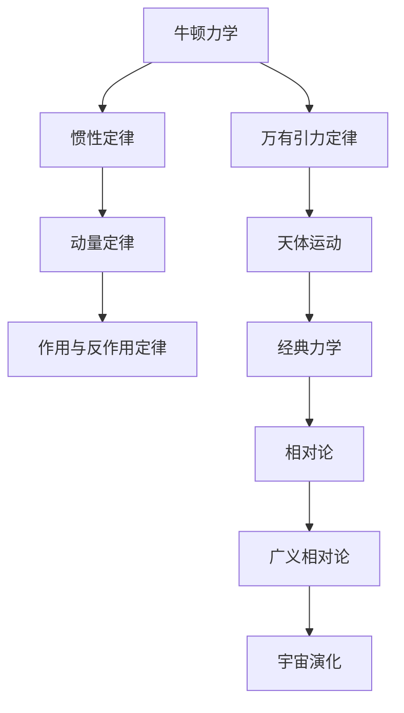
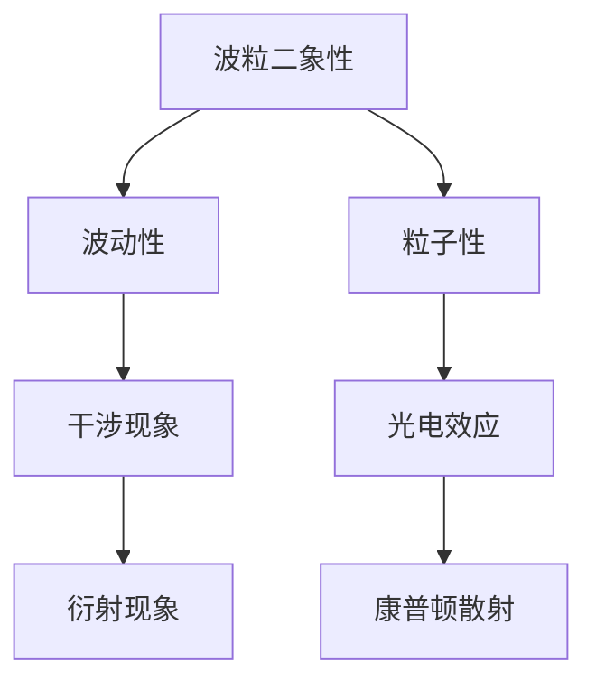
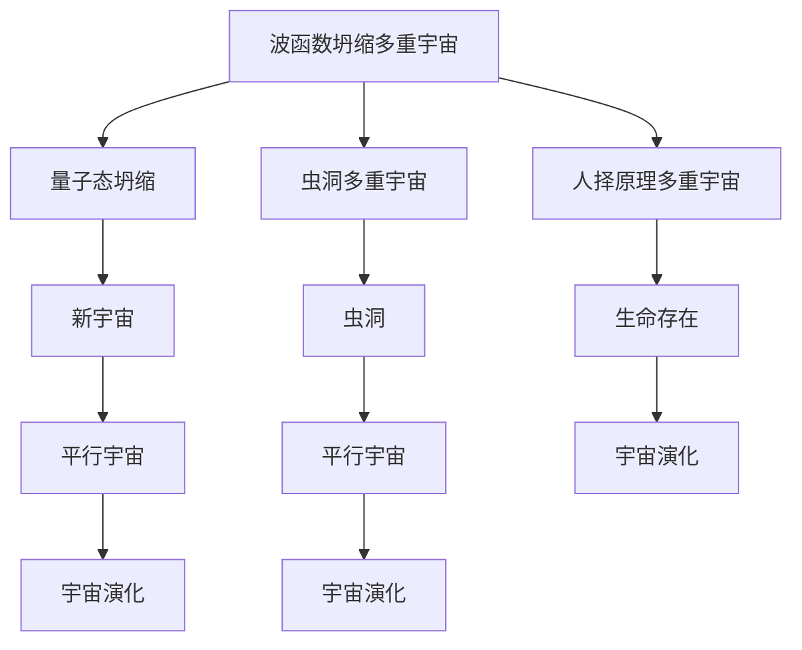
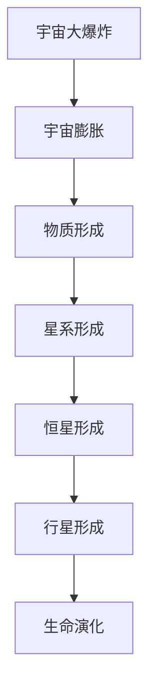

                 

## 文章标题

### 从牛顿宇宙观到多重宇宙理论：扩展宇宙可理解性

> 关键词：牛顿宇宙观、多重宇宙理论、宇宙可理解性、相对论、量子力学

> 摘要：本文将深入探讨从牛顿宇宙观到多重宇宙理论的演变，分析各自的理论框架、局限性以及它们对宇宙可理解性的影响。通过系统地梳理这些理论，我们希望能够提供一个清晰的视角，帮助读者更好地理解宇宙的本质。

## 引言

宇宙，这个浩瀚无垠的宇宙，自古以来就吸引着人类的目光。从古代的神话传说到现代的科学研究，人类对宇宙的认知经历了无数次的变革和升华。本文将带领读者踏上一段从牛顿宇宙观到多重宇宙理论的探索之旅，旨在揭示宇宙的奥秘，扩展我们对宇宙的理解。

### 牛顿宇宙观的起源与背景

牛顿宇宙观是历史上第一个系统性的宇宙观，由伟大的物理学家艾萨克·牛顿（Isaac Newton）在17世纪末期创立。牛顿通过他的三大定律和万有引力定律，建立了经典力学的基础，并提出了一个静态、永恒不变的宇宙模型。

#### 牛顿三大定律

1. **惯性定律**：一个物体如果没有受到外力的作用，它将保持静止或匀速直线运动。
2. **动量定律**：一个物体的动量变化等于作用在它上面的外力乘以外力的作用时间。
3. **作用与反作用定律**：任何作用力都有一个大小相等、方向相反的反作用力。

#### 万有引力定律

牛顿的万有引力定律描述了两个质点之间的引力大小与它们的质量和距离的平方成反比。这一理论不仅能够解释地球上的物体运动，还能够解释天体运动，为后来的天文学和宇宙学奠定了基础。

### 多重宇宙理论的起源与背景

与牛顿宇宙观相比，多重宇宙理论提出了一种更加复杂和广阔的宇宙图景。这一理论的基本概念是宇宙并非唯一的，而是存在多个宇宙，它们可能具有不同的物理规律、历史和结构。

#### 多重宇宙理论的起源

多重宇宙理论的起源可以追溯到20世纪初，量子力学的诞生为这一理论的提出提供了理论基础。例如，薛定谔的猫和量子隧穿等现象表明，微观世界的规律与我们通常所认为的确定性规律截然不同，这为多重宇宙理论的出现提供了可能性。

#### 多重宇宙理论的背景

随着相对论和量子力学的进一步发展，科学家们开始意识到，传统的宇宙观可能无法完全解释宇宙的复杂性。例如，黑洞和宇宙膨胀等现象提示我们，宇宙中可能存在我们无法直接观测到的其他宇宙。

### 牛顿宇宙观与多重宇宙理论的关系

牛顿宇宙观和多重宇宙理论虽然在本质上截然不同，但它们之间存在一定的联系。牛顿宇宙观为我们提供了一个基本的宇宙模型，而多重宇宙理论则是在这一基础上对宇宙进行更加深入和复杂的探讨。

## 第二部分：牛顿宇宙观

### 2.1 牛顿力学的基本原理

牛顿力学是物理学的基础，它由牛顿三大定律和万有引力定律构成。通过这些基本原理，我们可以描述宏观物体的运动规律。

#### 2.1.1 牛顿三大定律

**惯性定律**：一个物体如果没有受到外力的作用，它将保持静止或匀速直线运动。

**动量定律**：一个物体的动量变化等于作用在它上面的外力乘以外力的作用时间。

**作用与反作用定律**：任何作用力都有一个大小相等、方向相反的反作用力。

#### 2.1.2 引力的概念与计算

牛顿的万有引力定律描述了两个质点之间的引力大小与它们的质量和距离的平方成反比。其数学表达式为：

\[ F = G \frac{m_1 m_2}{r^2} \]

其中，\( F \) 是引力，\( G \) 是引力常数，\( m_1 \) 和 \( m_2 \) 是两个质点的质量，\( r \) 是它们之间的距离。

### 2.2 牛顿宇宙观的局限性

尽管牛顿宇宙观为我们提供了一个强大的理论工具，但它也存在一些局限性。

#### 2.2.1 牛顿力学与相对论的关系

牛顿力学在低速和弱引力场的情况下是准确的，但在高速度和强引力场中，牛顿力学的预测将不再准确。相对论，由爱因斯坦提出，能够更好地描述这些极端条件下的物理现象。

#### 2.2.2 牛顿宇宙观对宇宙演化的限制

牛顿宇宙观假设宇宙是静态和永恒不变的。然而，随着宇宙膨胀和黑洞等现象的发现，科学家们意识到宇宙是在不断演化的。

### 2.3 牛顿宇宙观在现代物理中的地位

尽管牛顿宇宙观在许多情况下仍然适用，但它已经无法完全描述现代物理学的所有现象。相对论和量子力学的发展为我们提供了更加全面和准确的宇宙观，但牛顿宇宙观仍然是物理学的重要基础，为我们理解宇宙提供了起点。

## 第三部分：相对论与量子力学

### 3.1 相对论的基本原理

相对论是由爱因斯坦提出的物理学理论，分为狭义相对论和广义相对论。相对论的基本原理包括：

#### 3.1.1 相对论的基本假设

1. 光速不变原理：在任何惯性参考系中，光速都是恒定的，不依赖于光源或观察者的运动状态。
2. 相对性原理：物理定律在所有惯性参考系中都是相同的。

#### 3.1.2 光速不变原理

光速不变原理是狭义相对论的核心，它表明光速在真空中的值是一个常数，不受观察者的运动状态影响。这一原理的提出挑战了牛顿力学中的绝对时间和空间观念。

### 3.2 量子力学的基本原理

量子力学是研究微观世界的物理学理论。其基本原理包括：

#### 3.2.1 量子态的概念

量子态是量子力学中的一个基本概念，描述了粒子的状态。量子态可以用波函数来表示，波函数的平方给出了粒子在不同位置出现的概率。

#### 3.2.2 波粒二象性

波粒二象性是量子力学的一个基本特征，它表明微观粒子既具有波动性，又具有粒子性。在不同的实验条件下，粒子表现出不同的性质。

### 3.3 相对论与量子力学的兼容性问题

相对论和量子力学是现代物理学的两大基石，但它们之间存在一定的兼容性问题。

#### 3.3.1 相对论与量子力学的冲突

相对论和量子力学在某些极端条件下（如黑洞和宇宙大爆炸）无法同时成立。例如，在黑洞事件视界内，量子力学和广义相对论之间的预测存在显著差异。

#### 3.3.2 现代物理学的解决方案

为了解决相对论与量子力学之间的冲突，科学家们提出了多种解决方案，如弦理论和量子引力理论。这些理论试图将相对论和量子力学统一起来，以提供一个更加完整的宇宙观。

## 第四部分：多重宇宙理论

### 4.1 多重宇宙理论的基本概念

多重宇宙理论是一个复杂且具有挑战性的理论，它提出了宇宙可能存在多个平行宇宙的观点。以下是多重宇宙理论的一些基本概念：

#### 4.1.1 多重宇宙的定义

多重宇宙（Multiverse）是指存在多个平行宇宙的总称。这些宇宙可能具有不同的物理规律、历史和结构。

#### 4.1.2 多重宇宙的几种形式

1. **波函数坍缩多重宇宙**：这种理论认为，量子态的坍缩会导致新的宇宙的产生。
2. **虫洞多重宇宙**：这种理论认为，宇宙之间存在虫洞，通过虫洞可以进入其他宇宙。
3. **人择原理多重宇宙**：这种理论认为，宇宙的演化是为了满足生命存在的条件，因此存在多个宇宙，每个宇宙都有不同的生命形式。

### 4.2 多重宇宙理论的几种形式

多重宇宙理论有多种形式，每种形式都有其独特的理论基础和假设。以下是几种主要的多重宇宙理论形式：

#### 4.2.1 波函数坍缩多重宇宙

波函数坍缩多重宇宙理论认为，量子态的坍缩会导致新的宇宙的产生。每个宇宙都是量子态的一种可能结果，因此存在着无限多个平行宇宙。

#### 4.2.2 虫洞多重宇宙

虫洞多重宇宙理论认为，宇宙之间存在虫洞，通过虫洞可以进入其他宇宙。虫洞是一种连接不同时空点的隧道，它可能成为不同宇宙之间的桥梁。

#### 4.2.3 人择原理多重宇宙

人择原理多重宇宙理论认为，宇宙的演化是为了满足生命存在的条件，因此存在多个宇宙，每个宇宙都有不同的生命形式。这种理论强调了生命的存在对宇宙演化的影响。

### 4.3 多重宇宙理论的支持和反对观点

多重宇宙理论是一个极具争议的话题，它既有支持者，也有反对者。以下是多重宇宙理论的一些支持和反对观点：

#### 4.3.1 多重宇宙理论的支持观点

1. **解释宇宙多样性的需要**：多重宇宙理论可以解释宇宙中存在的多样性，如不同的物理常数和宇宙演化过程。
2. **解决量子力学的悖论**：多重宇宙理论可以解决量子力学中的某些悖论，如量子态的坍缩。
3. **推动物理学的发展**：多重宇宙理论为物理学提供了一种新的视角，促进了物理学理论的发展。

#### 4.3.2 多重宇宙理论的反对观点

1. **科学验证的困难**：多重宇宙理论很难通过实验或观测进行验证，因此被认为是一种形而上的理论。
2. **资源浪费**：一些科学家认为，将资源投入到研究多重宇宙理论是不划算的，因为无法直接应用于实际问题。
3. **哲学问题的挑战**：多重宇宙理论引发了一系列哲学问题，如自由意志、因果关系和宇宙的本质等。

## 第五部分：宇宙的可理解性

### 5.1 宇宙的起源与演化

宇宙的起源和演化是宇宙学研究的核心问题。目前，最流行的理论是宇宙大爆炸理论，它认为宇宙起源于约138亿年前的一个极热、极密的状态。以下是宇宙起源与演化的关键阶段：

#### 5.1.1 宇宙大爆炸理论

宇宙大爆炸理论认为，宇宙起源于一个极热、极密的状态，随后开始膨胀。随着宇宙的膨胀，温度逐渐降低，物质开始形成，星系、恒星和行星逐渐诞生。

#### 5.1.2 宇宙背景辐射

宇宙背景辐射是宇宙大爆炸理论的重要证据之一。它是在宇宙早期遗留下来的辐射，遍布整个宇宙。通过对宇宙背景辐射的研究，科学家们能够更好地了解宇宙的早期状态。

### 5.2 宇宙的可理解性与人类认知的关系

宇宙的可理解性是人类认知的极限之一。人类通过科学方法对宇宙进行探索，但宇宙的复杂性远远超出了我们的认知范围。以下是宇宙可理解性与人类认知关系的几个方面：

#### 5.2.1 人类对宇宙认知的局限

人类对宇宙的认知受到多种限制，包括观测手段、理论模型的局限以及认知能力的限制。这些限制使得我们对宇宙的理解仍然有限。

#### 5.2.2 多重宇宙理论对人类认知的挑战

多重宇宙理论提出了一个更加广阔的宇宙图景，它挑战了我们对宇宙的传统理解。多重宇宙理论要求我们重新思考宇宙的本质、生命的意义以及人类在宇宙中的地位。

### 5.3 宇宙可理解性的未来展望

随着科学技术的不断发展，我们对宇宙的理解也在不断深化。以下是宇宙可理解性的未来展望：

#### 5.3.1 宇宙的可理解性研究趋势

未来，宇宙可理解性研究将朝着更精细、更全面的方向发展。例如，通过改进观测手段，我们可能能够发现更多关于宇宙起源和演化的细节。

#### 5.3.2 宇宙可理解性的科学意义

宇宙可理解性研究不仅有助于我们更好地理解宇宙，还具有重要的科学意义。它为我们提供了探索自然规律的新视角，推动了科学理论的发展。

## 结论

从牛顿宇宙观到多重宇宙理论，人类对宇宙的理解在不断扩展。本文系统地梳理了这些理论，分析了各自的优缺点以及对宇宙可理解性的影响。通过本文的探讨，我们希望能够为读者提供一个清晰、全面的宇宙图景，激发对宇宙奥秘的进一步思考。

## 参考文献

1. Newton, I. (1687). Philosophiæ Naturalis Principia Mathematica.
2. Einstein, A. (1905). On the Electrodynamics of Moving Bodies.
3. Bohr, N. (1928). The Quantum Theory of Line Spectra.
4. Hawking, S. W. (1988). A Brief History of Time: From the Big Bang to Black Holes.
5. Linde, A. (2005). The Original Multiverse. Scientific American, 292(1), 46-53.

## 附录

### 多重宇宙理论的 Mermaid 流程图

### 牛顿力学与相对论的关系架构 Mermaid 流程图

### 量子力学的波粒二象性 Mermaid 流程图

### 多重宇宙理论的几种形式 Mermaid 流程图

### 宇宙起源与演化 Mermaid 流程图

### 宇宙的可理解性与人类认知的关系 Mermaid 流程图

