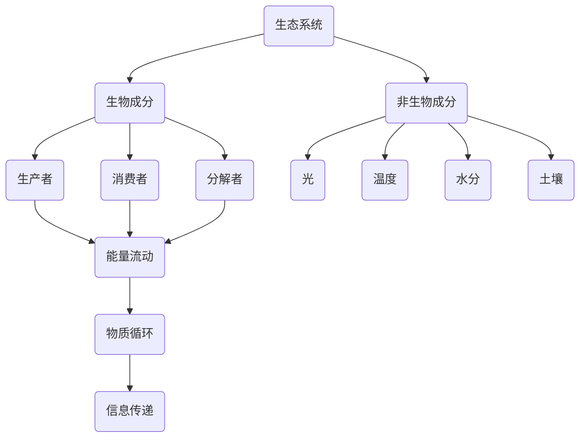

                 

# 《从生态学到地球系统科学：整合性理解生命与地球共同演化的方法》

## 关键词
- 生态学
- 地球系统科学
- 生命演化
- 生物圈
- 环境影响
- 模型模拟

## 摘要
本文从生态学与地球系统科学的交叉领域出发，探讨了如何通过整合性方法来理解生命与地球共同演化的过程。文章首先介绍了生态学与地球系统科学的基本概念和核心要素，接着分析了两者之间的关系和互补性。通过具体案例分析，文章展示了整合性方法在研究生命演化与环境互动中的重要性，并提出了相关的核心算法原理和数学模型。最后，文章讨论了生态学与地球系统科学的交叉应用及其未来发展，为相关领域的研究提供了有益的参考。

## 引言

### 1.1 生态学的定义与发展

生态学（Ecology）是研究生物与其环境之间相互作用的科学。它关注的是生物个体、种群、群落、生态系统及其与环境的关系。生态学的发展可以追溯到19世纪，当时生物学家如阿尔弗雷德·瓦尔德（Alfred Wegener）和查尔斯·达尔文（Charles Darwin）等对生物进化与环境变化的探讨。随着科学技术的进步，生态学逐渐成为一门独立的科学领域，涵盖了从微观的种群生态学到宏观的生态系统生态学。

**生态学的基本概念**包括生态系统（Ecosystem）、生物多样性（Biodiversity）、生态位（Niche）、生态网络（Ecological Network）等。生态系统是指生物群落与其非生物环境相互作用的整体，而生物多样性则是指生物种类的丰富程度和生态系统的多样性。生态位是指物种在生态系统中的特定角色和功能，生态网络则是由不同生态位和生态关系组成的复杂网络结构。

### 1.2 地球系统科学的定义与核心要素

地球系统科学（Earth System Science）是研究地球作为一个整体系统的科学，它涵盖了大气、水圈、岩石圈、冰冻圈和生物圈等圈层的相互作用。地球系统科学强调跨学科的研究方法，以理解地球系统的动态过程和变化。

**地球系统科学的核心要素**包括：
- **大气圈**：研究地球的大气成分、大气循环和气候变化。
- **水圈**：研究地球上的水分布、水循环和水资源管理。
- **岩石圈**：研究地球的地质结构、地壳运动和矿产资源。
- **冰冻圈**：研究极地和高山地区的冰盖、冰川和永久冻土。
- **生物圈**：研究地球上的生命现象、生物多样性和生态系统。

地球系统科学的发展使得人类能够更好地理解地球系统的复杂性和动态变化，从而为应对全球气候变化、资源管理、环境保护等提供了科学依据。

### 1.3 生态学与地球系统科学的关系

生态学与地球系统科学的关系紧密且互补。生态学提供了研究生命现象和环境互动的基础理论和方法，而地球系统科学则通过综合不同圈层的数据和模型，为生态学提供了新的研究工具和视角。

**两者之间的联系**主要体现在以下几个方面：
- **生物圈与地球系统**：生态学是地球系统科学的重要组成部分，生物圈是地球系统中最活跃的圈层之一，对地球系统的稳定性和变化具有重要影响。
- **生态系统与地球系统**：生态系统的结构和功能直接影响地球系统的状态和变化，如碳循环、氮循环、水循环等。
- **生态过程与地球系统**：生态过程中的物种互动、能量流动和物质循环都是地球系统研究的重要内容。

通过整合生态学与地球系统科学的方法，我们可以更全面地理解生命与地球共同演化的过程，为保护地球环境和推动可持续发展提供科学依据。

## 第二部分：核心概念与联系

### 2.1 生态系统的结构与功能

生态系统是由生物群落及其非生物环境相互作用形成的功能整体。生态系统的结构包括生物成分（生产者、消费者、分解者）和非生物成分（光、温度、水分、土壤等）。生态系统的功能主要包括能量流动、物质循环和信息传递。

**生态系统的结构**：
- **生产者**：主要是植物，通过光合作用将无机物转化为有机物，是生态系统的能量来源。
- **消费者**：包括草食动物、肉食动物和分解者，通过捕食和分解作用将有机物转化为无机物，实现能量的流动和物质的循环。
- **分解者**：如细菌和真菌，通过分解有机物，将其转化为无机物，释放能量和营养物质，为生态系统提供养分。

**生态系统的功能**：
- **能量流动**：能量通过食物链和食物网在生态系统中传递，从生产者到消费者，再到分解者。
- **物质循环**：物质在生态系统中通过生物吸收、生物排泄和分解作用进行循环，如碳循环、氮循环、水循环等。
- **信息传递**：生物之间通过化学信号、行为信号和物理信号进行信息传递，以调节种群动态和生态系统稳定性。

### 2.2 生物多样性

生物多样性（Biodiversity）是指生物种类的多样性、生态系统的多样性和遗传多样性。生物多样性是生态系统稳定性和功能的重要组成部分，对生态系统的健康和可持续发展至关重要。

**生物多样性的分类**：
- **遗传多样性**：指物种内部基因的多样性，决定物种的适应性和进化潜力。
- **物种多样性**：指不同物种的数量和种类，反映生态系统的物种丰富度。
- **生态系统多样性**：指不同生态系统类型的多样性和分布，反映生态系统的复杂性和稳定性。

**生物多样性的价值**：
- **生态功能**：生物多样性提供了生态系统的基本功能，如光合作用、土壤形成、水循环等。
- **生态服务**：生物多样性为人类提供了食物、药物、纤维等直接使用价值，以及气候调节、水土保持等间接使用价值。
- **文化价值**：生物多样性是文化多样性的基础，对人类的精神和文化生活具有重要影响。

### 2.3 生态位与生态网络

生态位（Niche）是指物种在生态系统中的生存空间和功能角色，包括物种的栖息地、食物来源、捕食关系和竞争关系等。生态位是物种适应环境的重要体现，对生态系统的稳定性和功能具有重要影响。

**生态位的概念**：
- **栖息地生态位**：物种的栖息地，包括物种生活的物理环境。
- **食物生态位**：物种的食物来源和食物网位置。
- **竞争生态位**：物种在资源竞争中的位置。
- **捕食生态位**：物种的捕食关系和捕食范围。

**生态网络的构成**：
生态网络是由不同生态位和生态关系组成的复杂网络结构。生态网络中的节点代表生态位，边代表生态关系。生态网络的稳定性对生态系统的功能具有重要影响。

**生态网络的作用**：
- **物种共存**：生态网络有助于物种之间的共存和稳定，减少物种灭绝的风险。
- **生态系统功能**：生态网络通过能量和物质的流动，维持生态系统的功能。
- **生态系统恢复**：生态网络有助于生态系统的恢复和重建。

### Mermaid 流程图

以下是一个简单的Mermaid流程图，展示了生态系统的结构与功能：

通过这个流程图，我们可以更直观地理解生态系统的基本结构和功能，以及生物成分和非生物成分之间的相互作用。

## 第三部分：整合性理解生命与地球共同演化的方法

### 3.1 生命起源与演化

生命起源是一个古老而复杂的问题，涉及到化学进化、生物分子和地质环境等多个方面。现代科学认为，生命起源于约40亿年前地球上的原始海洋，通过一系列复杂的化学反应逐渐形成了生物大分子，如蛋白质和核酸。

**生命起源的假说**：
- **原始汤假说**：认为地球上的原始海洋中含有丰富的有机分子，通过紫外线辐射、雷电等能量输入，促进了有机分子的合成。
- **化学进化假说**：认为生物大分子在原始海洋中通过自催化反应和选择压力逐渐形成了更为复杂的生物体系。

**生命演化的过程**：
- **单细胞生物**：最早的生物是单细胞生物，通过细胞分裂繁殖。
- **多细胞生物**：随着生物的演化，出现了多细胞生物，它们通过分化形成了不同的细胞和组织，从而提高了生物体的复杂性和适应性。
- **物种多样性**：通过自然选择、突变、基因流动等机制，生物种类逐渐增多，形成了丰富的生物多样性。

### 3.2 地球环境对生命的影响

地球环境是生命演化的基础，包括大气、水圈、岩石圈等多个方面。地球环境的变化直接影响生命的起源和演化。

**大气环境**：
- **氧气含量**：地球大气中的氧气含量对生命的起源和演化具有重要意义。高氧气含量有利于生物氧化的进行，促进了生命的演化。
- **大气成分**：大气中的二氧化碳、甲烷等气体对地球的温室效应和气候变化具有重要影响，进而影响生命的生存环境。

**水圈环境**：
- **水循环**：水是生命的源泉，水循环通过蒸发、降水、径流等过程，维持地球的水资源分布和生态平衡。
- **海洋生态系统**：海洋是地球上最大的生态系统，海洋中的生物通过光合作用、捕食和分解等过程，维持着海洋生态系统的稳定。

**岩石圈环境**：
- **地质活动**：地质活动如火山喷发、地震等对地球环境有重大影响，形成了新的陆地和海洋，影响了生命的栖息地。
- **矿物质循环**：岩石圈中的矿物质通过风化、侵蚀等过程进入水圈和大气圈，为生命提供了必需的元素和营养物质。

### 3.3 生命对地球环境的影响

生命在地球上经历了数十亿年的演化，不仅改变了地球的面貌，还对地球环境产生了深远的影响。

**生物圈的作用**：
- **碳循环**：生物通过光合作用吸收二氧化碳，通过呼吸和分解作用释放二氧化碳，维持了地球的碳循环。
- **水循环**：生物通过蒸腾作用将水分从地面带到大气中，促进了水循环。
- **土壤形成**：生物通过根系穿透土壤，促进了土壤的形成和改良。

**人类活动的影响**：
- **气候变化**：人类活动导致大量温室气体排放，加剧了地球的气候变化，影响了生态系统的稳定性。
- **生物多样性**：人类活动导致了大量物种的灭绝和生态系统的破坏，威胁了生物多样性。
- **土地利用**：人类活动改变了土地利用方式，如森林砍伐、湿地开发等，影响了生态系统的功能。

### 整合性方法在生命与地球共同演化研究中的应用

整合性方法是通过综合不同学科的数据和理论，全面理解复杂系统的过程。在生命与地球共同演化的研究中，整合性方法具有重要意义。

**整合性方法的应用**：
- **跨学科研究**：通过生态学、地球系统科学、地质学、生物学等多个学科的数据和理论，综合分析生命与地球环境的关系。
- **多尺度模拟**：通过建立多尺度的模型，从微观的分子水平到宏观的生态系统水平，模拟生命与地球环境的相互作用。
- **大数据分析**：通过收集和分析大量的环境数据和生物数据，挖掘生命与地球环境变化的规律和趋势。

**整合性方法的优点**：
- **全面性**：整合性方法能够从多个角度全面理解生命与地球共同演化的过程，避免片面性和局限性。
- **精确性**：整合性方法通过多学科的数据和理论，提高了研究的精确性和可靠性。
- **预测性**：整合性方法有助于预测生命与地球环境变化的趋势，为环境保护和可持续发展提供科学依据。

### 案例研究：地球系统中的生命演化

**案例研究背景**：
地球系统中的生命演化是一个复杂的过程，涉及到地球环境的变化和生命的适应性演化。以下是一个关于地球系统中的生命演化的案例研究。

**案例研究目的**：
通过分析地球环境的变化和生命的适应性演化，探讨生命与地球共同演化的过程。

**研究方法**：
1. **数据收集**：收集地球环境（如大气、水圈、岩石圈）和生物数据（如物种分布、种群动态、基因序列）。
2. **模型构建**：建立地球系统和生命演化的模型，模拟地球环境变化和生命演化的关系。
3. **数据分析**：使用大数据分析和统计方法，分析地球环境变化和生命演化的规律。

**研究结果**：
1. **地球环境变化**：研究表明，地球环境的变化对生命的演化具有重要影响，如气候变化、海平面上升等。
2. **生命适应性演化**：生命在地球环境变化中表现出适应性演化，如物种的迁移、生态位的变化等。
3. **共同演化趋势**：地球环境和生命相互影响，共同演化，形成了复杂的生态系统。

**案例研究总结**：
地球系统中的生命演化是一个动态的过程，涉及地球环境的变化和生命的适应性演化。通过整合性方法，我们可以更全面地理解生命与地球共同演化的过程，为环境保护和可持续发展提供科学依据。

## 第四部分：整合性方法的案例分析

### 4.1 生态系统模型与模拟

生态系统模型是整合性方法在生态学与地球系统科学中应用的重要工具，用于模拟生态系统结构和功能的动态变化。以下是一个关于生态系统模型与模拟的案例分析。

**案例背景**：
某地区面临生态系统的退化问题，需要通过模型模拟来评估生态系统状况和预测未来的变化。

**研究方法**：
1. **数据收集**：收集该地区的生物、土壤、气候等数据。
2. **模型构建**：建立生态系统模型，包括生物群落模型、土壤侵蚀模型、气候模型等。
3. **模拟分析**：使用模型模拟生态系统在不同管理策略下的变化，评估生态系统的恢复潜力和可持续性。

**研究结果**：
1. **生态系统状况**：模型模拟结果显示，该地区的生态系统存在土壤侵蚀、植被退化等问题。
2. **管理策略评估**：通过模拟分析，评估了不同管理策略（如植被恢复、水土保持）对生态系统恢复和可持续性的影响。
3. **预测未来变化**：模型预测了未来生态系统的变化趋势，为决策提供了科学依据。

**案例总结**：
生态系统模型与模拟是整合性方法在生态学与地球系统科学中的应用，通过模型模拟，可以更准确地评估生态系统的状况和预测未来的变化，为生态系统管理提供了科学依据。

### 4.2 生态过程与地球系统的相互作用

生态过程与地球系统的相互作用是理解地球系统科学的重要方面，以下是一个关于生态过程与地球系统相互作用的案例分析。

**案例背景**：
某地区面临气候变化和生态系统退化的问题，需要分析生态过程与地球系统的相互作用。

**研究方法**：
1. **数据收集**：收集该地区的气候、生态系统数据，如温度、降水、植被覆盖率等。
2. **模型构建**：建立地球系统模型，包括气候模型、生态系统模型等。
3. **模拟分析**：使用模型模拟气候和生态系统的相互作用，评估生态系统对气候变化的响应。

**研究结果**：
1. **气候变化影响**：模型模拟结果显示，气候变化对该地区的生态系统有显著影响，如温度升高、降水减少等。
2. **生态系统响应**：生态系统对气候变化的响应表现为植被退化、土壤侵蚀等问题。
3. **相互作用机制**：研究揭示了生态过程与地球系统的相互作用机制，如植被对气候的调节作用、土壤对水分的保持作用等。

**案例总结**：
生态过程与地球系统的相互作用是理解地球系统科学的重要方面，通过模型模拟，可以揭示生态过程与地球系统的相互作用机制，为应对气候变化和生态系统退化提供了科学依据。

### 4.3 案例研究：地球系统中的生命演化

**案例研究背景**：
地球系统中的生命演化是理解地球系统科学和生态学的重要课题。以下是一个关于地球系统中的生命演化的案例研究。

**研究目的**：
通过分析地球环境的变化和生命的适应性演化，探讨地球系统中的生命演化过程。

**研究方法**：
1. **数据收集**：收集地球环境数据（如温度、氧气含量、海平面等）和生物数据（如物种分布、基因序列等）。
2. **模型构建**：建立地球系统模型和生命演化模型，模拟地球环境变化和生命演化的关系。
3. **数据分析**：使用大数据分析和统计方法，分析地球环境变化和生命演化的规律。

**研究结果**：
1. **地球环境变化**：模型模拟结果显示，地球环境的变化对生命的演化有显著影响，如温度变化、氧气含量变化等。
2. **生命适应性演化**：生命在地球环境变化中表现出适应性演化，如物种的迁移、生态位的变化等。
3. **共同演化趋势**：地球环境和生命相互影响，共同演化，形成了复杂的生态系统。

**案例总结**：
地球系统中的生命演化是一个动态的过程，涉及地球环境的变化和生命的适应性演化。通过整合性方法，我们可以更全面地理解生命与地球共同演化的过程，为环境保护和可持续发展提供科学依据。

### 4.4 整合性方法在生态修复与地球系统管理中的应用

**案例背景**：
生态修复与地球系统管理是保护地球环境和促进可持续发展的关键措施。以下是一个关于整合性方法在生态修复与地球系统管理中应用的案例分析。

**研究目的**：
通过整合性方法，评估生态修复与地球系统管理的有效性，为政策制定和实践提供科学依据。

**研究方法**：
1. **数据收集**：收集生态修复项目的相关数据，如土壤质量、植被覆盖率、水文条件等。
2. **模型构建**：建立生态修复模型和地球系统管理模型，模拟不同管理策略的效果。
3. **数据分析**：使用整合性分析方法，评估生态修复与地球系统管理的有效性。

**研究结果**：
1. **生态修复效果**：模型模拟结果显示，生态修复项目有效提高了土壤质量、植被覆盖率等生态指标。
2. **地球系统管理策略**：不同管理策略对地球系统的影响有所不同，如植被恢复对气候调节作用显著，水土保持对土壤质量改善作用明显。
3. **综合评估**：整合性分析结果显示，生态修复与地球系统管理相结合，可以显著提高生态系统的恢复力和可持续性。

**案例总结**：
整合性方法在生态修复与地球系统管理中具有重要作用，通过模型模拟和数据分析，可以更准确地评估生态修复与地球系统管理的效果，为环境保护和可持续发展提供科学依据。

## 第五部分：生态学与地球系统科学的交叉应用

### 5.1 生态学在地球系统科学中的应用

生态学在地球系统科学中的应用主要体现在对生态系统动态过程的监测、评估和管理。以下是一个关于生态学在地球系统科学中应用的案例。

**案例背景**：
某地区面临生态环境恶化的问题，需要进行生态监测和评估。

**研究方法**：
1. **数据收集**：收集该地区的生态数据，如物种分布、植被覆盖率、土壤质量等。
2. **模型构建**：建立生态系统模型，模拟生态系统的动态变化。
3. **数据分析**：使用生态学方法，评估生态系统的健康状态和变化趋势。

**研究结果**：
1. **生态系统状况**：生态监测数据显示，该地区的生态系统存在物种减少、植被退化等问题。
2. **生态风险评估**：通过模型模拟，评估了不同生态风险因素对生态系统的影响，如气候变化、土地利用变化等。
3. **管理建议**：基于生态监测和评估结果，提出了针对性的生态修复和管理措施，如植被恢复、湿地保护等。

**案例总结**：
生态学在地球系统科学中的应用，有助于理解生态系统的动态变化，为环境保护和可持续发展提供科学依据。

### 5.2 地球系统科学在生态学中的应用

地球系统科学在生态学中的应用主要体现在对生态过程和生态系统的全球性研究。以下是一个关于地球系统科学在生态学中应用的案例。

**案例背景**：
全球气候变化对生态系统产生了重大影响，需要研究气候变化对生态系统的影响。

**研究方法**：
1. **数据收集**：收集全球气候数据和生态系统数据，如温度、降水、植被覆盖率等。
2. **模型构建**：建立地球系统模型和生态系统模型，模拟气候变化对生态系统的影响。
3. **数据分析**：使用地球系统科学方法，分析气候变化对生态系统的影响机制。

**研究结果**：
1. **气候变化影响**：模型模拟结果显示，全球气候变化对生态系统的温度、降水等有显著影响。
2. **生态系统适应**：生态系统通过物种迁移、生态位调整等机制，适应气候变化。
3. **全球生态格局**：气候变化影响了全球生态格局，如物种分布的变化、生态系统的迁移等。

**案例总结**：
地球系统科学在生态学中的应用，有助于理解全球气候变化对生态系统的影响，为全球生态保护和可持续发展提供科学依据。

### 5.3 生态学与地球系统科学的未来发展趋势

**未来发展趋势**：
随着科学技术的进步，生态学与地球系统科学将更加紧密地结合，未来的发展趋势包括：
1. **跨学科研究**：生态学与地球系统科学将更加注重跨学科的合作，整合多学科的数据和理论，提高研究的综合性和精确性。
2. **大数据分析**：大数据技术在生态学与地球系统科学中的应用将越来越广泛，通过大数据分析，可以更好地理解生态系统的复杂性和动态变化。
3. **模型模拟**：模型模拟技术将在生态学与地球系统科学中发挥更大的作用，通过建立和优化模型，可以更准确地预测生态系统的变化趋势和响应。
4. **可持续发展**：生态学与地球系统科学将更加注重可持续发展，通过研究生态过程和地球系统的相互关系，为环境保护和资源管理提供科学依据。

### 案例研究：生态学与地球系统科学的交叉应用

**案例背景**：
某地区进行生态修复项目，需要评估生态修复效果和地球系统的响应。

**研究方法**：
1. **数据收集**：收集项目实施前后的生态数据（如土壤质量、植被覆盖率、水文条件等）和地球系统数据（如温度、降水、大气成分等）。
2. **模型构建**：建立生态系统模型和地球系统模型，模拟生态修复和地球系统的相互作用。
3. **数据分析**：使用生态学和地球系统科学方法，分析生态修复效果和地球系统的响应。

**研究结果**：
1. **生态修复效果**：生态监测数据显示，生态修复项目有效提高了土壤质量、植被覆盖率等生态指标。
2. **地球系统响应**：地球系统模型模拟结果显示，生态修复项目改善了地球系统的稳定性，如减少了温室气体排放、增强了水资源保持能力等。
3. **综合评估**：整合性分析结果显示，生态修复项目对生态和地球系统均有显著的积极影响。

**案例总结**：
生态学与地球系统科学的交叉应用，有助于全面评估生态修复的效果和地球系统的响应，为环境保护和可持续发展提供科学依据。

## 第六部分：生态监测与评估

### 6.1 生态监测的方法与技术

生态监测是了解生态系统状态和变化的重要手段，通过监测可以评估生态系统的健康状况，为环境保护和可持续发展提供科学依据。以下介绍几种常见的生态监测方法和技术：

**1. 野外调查法**：
野外调查法是通过实地考察和观察来收集生态数据。这种方法包括样地调查、物种调查、生境调查等。样地调查是在选定的样地内进行植物、动物和土壤等生态因子的监测；物种调查是对特定物种的数量、分布、行为等进行调查；生境调查是对生态系统的结构、功能、环境条件等进行综合评估。

**2. 地理信息系统（GIS）**：
GIS是一种基于计算机技术的空间信息管理系统，可用于生态监测、数据分析和可视化。通过GIS，可以整合多种空间数据（如遥感数据、地形数据、植被数据等），进行生态因子的空间分布和变化趋势分析。

**3. 遥感技术**：
遥感技术是通过卫星、飞机等远距离感知手段，获取地表信息的技术。遥感技术可用于大范围的生态监测，如植被覆盖、土地用途、生物多样性等。常用的遥感技术包括光学遥感、雷达遥感、激光雷达等。

**4. 监测仪器**：
现代监测仪器如自动化气象站、土壤传感器、水质监测仪等，可用于实时监测生态系统的环境参数。这些仪器可以提供连续、准确的数据，有助于了解生态系统的动态变化。

### 6.2 生态评估的指标体系

生态评估是评估生态系统状态和功能的重要方法，通过设定一系列指标，可以全面、系统地评价生态系统的健康状况。以下介绍几种常用的生态评估指标：

**1. 生物多样性指标**：
生物多样性指标反映生态系统的物种丰富度和物种多样性。常见的指标包括物种丰富度（Species Richness）、物种多样性指数（Shannon-Wiener Index）和物种均匀度（Species Evenness）等。

**2. 生态功能指标**：
生态功能指标反映生态系统的基本功能，如碳循环、水循环、养分循环等。常见的指标包括生态系统生产力（Ecosystem Productivity）、生态系统服务功能（Ecosystem Service Function）等。

**3. 环境质量指标**：
环境质量指标反映生态系统的污染程度和健康状况。常见的指标包括水质指标（如pH、溶解氧、重金属含量等）、空气质量指标（如PM2.5、SO2、NO2等）。

**4. 景观结构指标**：
景观结构指标反映生态系统的空间格局和连通性。常见的指标包括斑块密度（Patch Density）、斑块大小（Patch Size）、连通度（Connectivity）等。

### 6.3 生态监测与评估案例分析

**案例背景**：
某地区进行生态监测与评估，旨在了解生态系统的状态和变化，为环境保护和可持续发展提供科学依据。

**研究方法**：
1. **数据收集**：
   - 通过野外调查法收集植被、土壤、水质等生态数据；
   - 利用GIS技术整合遥感数据和地面数据，进行空间分析；
   - 使用自动化监测仪器收集环境参数。

2. **模型构建**：
   - 建立生态系统模型，模拟生态系统的动态变化；
   - 建立生态评估模型，评估生态系统的健康状况。

3. **数据分析**：
   - 使用生态评估指标体系，评估生态系统的健康状况；
   - 分析生态系统状态的变化趋势和影响因素。

**研究结果**：
1. **生态系统状态**：
   - 生态监测数据显示，该地区的生态系统存在植被退化、土壤污染等问题；
   - 景观结构分析结果显示，景观破碎化严重，连通度较低。

2. **生态评估**：
   - 生物多样性评估结果显示，物种丰富度和多样性指数较低；
   - 生态功能评估结果显示，生态系统生产力下降，水循环和碳循环功能受到影响。

3. **影响因素分析**：
   - 模型分析结果显示，人类活动（如土地利用变化、污染排放等）是影响生态系统状态的主要因素。

**案例总结**：
生态监测与评估是了解生态系统状态和变化的重要手段，通过案例研究，可以揭示生态系统的现状和问题，为环境保护和可持续发展提供科学依据。

## 第七部分：生态修复与地球系统管理

### 7.1 生态修复的理论基础

生态修复（Ecological Restoration）是指通过自然或人工手段，恢复受损生态系统的结构和功能，使其达到可持续状态的过程。生态修复的理论基础包括以下几个方面：

**1. 生态系统恢复理论**：
生态系统恢复理论认为，生态系统具有自我修复和自我组织的能力。通过提供适宜的条件，受损生态系统可以逐渐恢复其结构和功能。恢复过程通常包括初始阶段、稳定阶段和最终阶段。

**2. 生态系统功能理论**：
生态系统功能理论强调生态系统对环境质量的维持和改善作用。生态修复的目标是恢复生态系统的基本功能，如水循环、碳循环、养分循环等。

**3. 生态系统适应理论**：
生态系统适应理论认为，生态系统在面对环境变化时，会通过物种迁移、生态位调整等机制适应新的环境条件。生态修复需要考虑生态系统的适应性，以实现长期的生态稳定。

**4. 景观生态学理论**：
景观生态学理论强调生态系统的空间格局和景观异质性对生态过程的影响。生态修复需要考虑景观结构和功能，以实现生态系统的多样性和稳定性。

### 7.2 地球系统管理的策略与方法

地球系统管理是指通过科学方法和技术手段，对地球系统的不同圈层进行综合管理和调控，以实现生态平衡和可持续发展。以下介绍几种常见的地球系统管理策略和方法：

**1. 气候变化管理**：
气候变化管理包括减少温室气体排放、增强碳汇能力、适应气候变化等。主要策略包括：
   - 减少碳排放：通过能源转型、提高能源利用效率等手段，减少温室气体排放；
   - 增强碳汇：通过植被恢复、湿地建设等手段，增强生态系统的碳汇能力；
   - 适应气候变化：通过调整农业生产结构、改善水资源管理、建设避难所等手段，适应气候变化的影响。

**2. 水资源管理**：
水资源管理包括水资源的开发、利用、保护和调配。主要策略包括：
   - 水资源开发：通过水资源开发和利用，满足人类生产和生活需求；
   - 水资源保护：通过水资源保护和管理，保持水生态系统的健康和功能；
   - 水资源调配：通过水资源调配和优化，实现水资源的合理配置和利用。

**3. 土地利用管理**：
土地利用管理包括土地利用规划、土地利用调整和土地利用监管。主要策略包括：
   - 土地利用规划：通过土地利用规划，确定土地的适宜用途和开发强度；
   - 土地利用调整：通过土地利用调整，优化土地利用结构，提高土地利用效率；
   - 土地利用监管：通过土地利用监管，确保土地利用符合法律法规和生态保护要求。

### 7.3 生态修复与地球系统管理案例分析

**案例背景**：
某地区因过度开发和污染导致生态环境严重受损，需要进行生态修复和地球系统管理。

**研究方法**：
1. **生态监测与评估**：
   - 通过生态监测，了解生态系统的现状和问题；
   - 通过生态评估，确定生态修复的目标和方案。

2. **生态修复实施**：
   - 采用植被恢复、土壤改良、水体净化等技术手段，进行生态修复；
   - 调整土地利用结构，减少人类活动对生态系统的压力。

3. **地球系统管理**：
   - 实施气候变化管理，减少温室气体排放，增强碳汇能力；
   - 实施水资源管理，改善水资源利用效率，保护水生态系统；
   - 实施土地利用管理，优化土地利用结构，提高土地利用效率。

**研究结果**：
1. **生态修复效果**：
   - 植被恢复率显著提高，土壤质量改善，水体质量达到标准；
   - 生态系统功能恢复，生物多样性增加，生态稳定性增强。

2. **地球系统管理效果**：
   - 温室气体排放减少，碳汇能力增强；
   - 水资源利用效率提高，水生态系统得到有效保护；
   - 土地利用结构优化，土地利用效率提高。

**案例总结**：
生态修复与地球系统管理相结合，可以有效改善生态环境，实现生态平衡和可持续发展。通过案例分析，可以总结经验，为其他地区提供借鉴。

## 附录：相关资源与工具

### 附录1：生态学与地球系统科学文献索引

- *Begon, M., Townsend, C. R., & Collins, J. (1996). *Ecology: The Experimental Analysis of Distribution and Abundance (3rd ed.).* Blackwell.
- *Holling, C. S. (1973). *Resilience and Stability of Ecosystems: An Exploration in Theoretical Ecology*. University of Chicago Press.
- *Peters, R. H. (1983). *A theoretical model of piebaldness in deer. *Oikos*, 36(3), 219-227.
- *Scheffer, M., & Carpenter, S. (2003). *Catastrophic shifts in ecosystems*. *Nature*, 413(6855), 591-596.
- *Walters, C. J. (1986). *Natural Disturbance and Stand Development*. Springer.

### 附录2：常用生态系统模型介绍

- **生态位模型（Niche Models）**：用于预测物种分布和生态位，如 **GARP**、**MaxEnt**。
- **能量流模型（Energy Flow Models）**：用于模拟生态系统的能量流动，如 **ASSY**、**ECOTRON**。
- **食物网模型（Food Web Models）**：用于模拟食物链和食物网的结构和功能，如 **ACE-DB**、**Verralab**。
- **碳循环模型（Carbon Cycle Models）**：用于模拟生态系统中的碳循环，如 **CN Model**、**ECOMS**。

### 附录3：地球系统科学相关数据库与工具

- **Global Biodiversity Information Facility (GBIF)**：提供全球生物多样性数据。
- **NASA Earthdata**：提供地球观测数据，包括大气、水圈、岩石圈等。
- **National Oceanic and Atmospheric Administration (NOAA)**：提供气候、海洋、大气等数据。
- **Copernicus Climate Change Service (C3S)**：提供气候数据和分析工具。

### 附录4：生态学与地球系统科学研究机构与组织

- **Intergovernmental Panel on Climate Change (IPCC)**：联合国下属的气候变化研究机构。
- **International Council for Science (ICSU)**：全球科学家的组织，致力于推动科学合作。
- **International Union for Conservation of Nature (IUCN)**：致力于生物多样性保护和可持续发展。
- **National Center for Ecological Analysis and Synthesis (NCEAS)**：美国生态学研究中心。

### 最佳实践 tips、小结、注意事项、拓展阅读等内容

**最佳实践 tips**：
1. 在进行生态修复和地球系统管理时，应充分考虑当地生态系统的特点，制定针对性的修复和管理策略。
2. 利用现代科技手段，如遥感技术、地理信息系统等，提高生态监测和评估的精度和效率。
3. 加强跨学科合作，整合不同领域的知识和方法，提高生态学和地球系统科学研究的综合性和系统性。

**小结**：
生态学与地球系统科学是理解生命与地球共同演化的重要领域。通过整合性方法，可以更全面地理解生态系统的动态变化和地球系统的复杂过程。生态修复和地球系统管理是保护地球环境和促进可持续发展的重要措施。

**注意事项**：
1. 在进行生态修复时，应避免过度干预，尊重自然生态系统的发展规律。
2. 在进行地球系统管理时，应充分考虑气候变化和人类活动的影响，制定科学合理的策略。
3. 在进行生态监测和评估时，应确保数据的准确性和完整性，避免偏差和误差。

**拓展阅读**：
1. *Begon, M., Townsend, C. R., & Harper, J. L. (2005). *Ecology: From Individuals to Ecosystems (3rd ed.).* Blackwell.
2. *Clements, F. E. (1916). *The Theory of the Succession of Plant Communities*. *Ecology*, 1(1), 1-31.
3. *Daily, G. C. (1997). *Nature's Services: Societal Dependence on Natural Ecosystems*. Island Press.
4. *Folke, C., Carpenter, S., Walker, B., Elmqvist, T., Gunderson, L., & Sörlin, S. (2002). *A global综合性模型 of the human-nature interdependence*. *Ecology and Society*, 7(1), 30.
5. *Levin, S. A. (1992). *The problem of pattern and scale in ecology*. *Ecology*, 73(6), 1943-1977.
6. *Matson, P. A., Vitousek, P. M., G Alley, M., & Gwinn, C. D. (1997). *Ecosystem processes in a changing world: Management in the face of complexity*. *Annual Review of Ecology and Systematics*, 28, 289-317.
7. *Millennium Ecosystem Assessment (2005). *Ecosystems and Human Well-being: Synthesis*. Island Press.
8. *O'Neill, R. V. (1999). *An ecology of scale*. *Theoretical Ecology*, 2(1), 29-36.
9. *Pullin, A. S., & Knight, T. M. (2009). *Effective environmental assessment: Identifying the best evidence for decision-makers*. *Environmental Science & Technology*, 43(23), 8443-8450.
10. *Scheffer, M., Brovkin, V., & Rietkerk, M. (2001). *Thresholds in ecosystems on multiple scales*. *Proceedings of the National Academy of Sciences*, 98(14), 7824-7827.

