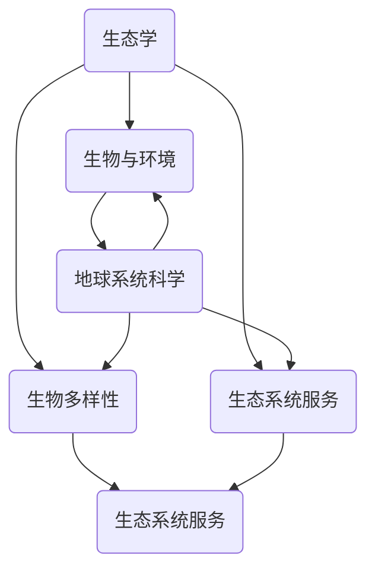

                 


### **引言：从生态学到地球系统科学的重要性**

**引言**

在探讨地球及其生命系统的复杂性和相互作用时，从生态学到地球系统科学的研究提供了一个全面的视角。这两个领域不仅各自独立地揭示了自然界中的现象和规律，而且在研究地球的整体动态和人类活动对环境的影响方面，它们有着紧密的联系。

**背景介绍**

生态学，作为研究生物与环境之间相互作用的科学，已经帮助人们理解了物种如何适应其栖息地，以及生态系统如何维持其功能。然而，随着对地球系统复杂性的认识不断深入，生态学的研究开始面临着新的挑战，这促使科学家们转向地球系统科学。

地球系统科学则是一个跨学科领域，旨在理解地球作为一个整体的动态过程和相互作用。它涵盖了大气、水圈、岩石圈、生物圈和人类圈等多个方面，通过整合不同学科的研究成果，提供了对地球系统更为全面和深入的认识。

**核心概念与联系**

在探讨生态学与地球系统科学的关系时，理解这两个领域中的核心概念是至关重要的。以下是这些核心概念之间的关系架构 Mermaid 流程图：



- **生态学与生物与环境**：生态学专注于生物与环境之间的相互作用，研究物种如何适应和影响其栖息地。
- **生态学与生物多样性**：生物多样性是生态学中的一个重要概念，指的是地球上所有生物种类的多样性，包括物种多样性、遗传多样性和生态系统多样性。
- **生态学与生态系统服务**：生态系统服务是指生态系统为人类提供的物质和调节功能，如食物、水源、气候调节等。
- **地球系统科学与生物与环境**：地球系统科学提供了理解生物与环境相互作用的宏观视角，研究地球作为一个整体的动态过程。
- **地球系统科学与生物多样性**：地球系统科学通过研究生物多样性的变化和分布，揭示了地球系统的复杂性和稳定性。
- **地球系统科学与生态系统服务**：地球系统科学关注生态系统服务对地球整体健康和人类福祉的影响，探讨了生态系统服务的可持续性和保护策略。

**核心算法原理讲解**

在地球系统科学的研究中，算法和模型扮演着关键角色。以下是一个用于分析生态系统服务价值的伪代码示例：

```python
def calculate_ecosystem_service_value(land_use, ecosystem_type):
    # 初始化生态系统服务价值
    service_value = 0
    
    # 根据土地利用类型和生态系统类型计算服务价值
    if land_use == "forest" and ecosystem_type == "carbon_sequestration":
        service_value += carbon_sequestration_coefficient
    elif land_use == "grassland" and ecosystem_type == "water_retention":
        service_value += water_retention_coefficient
    elif land_use == "crop_land" and ecosystem_type == "food_production":
        service_value += food_production_coefficient
    
    return service_value
```

**数学模型与公式**

在地球系统科学中，数学模型和公式用于描述和预测生态过程和地球系统的动态变化。以下是两个常用的数学模型：

1. **Lotka-Volterra 捕食者-猎物模型**：
   $$ x' = ax - bxy $$
   $$ y' = dxz - cy $$
   其中，$x$ 和 $y$ 分别代表猎物和捕食者的数量，$a$、$b$、$d$ 和 $c$ 是模型参数。

2. **水循环模型**：
   $$ \frac{dS}{dt} = -Q \cdot f(S, T) $$
   其中，$S$ 表示土壤含水量，$Q$ 是径流率，$f(S, T)$ 是土壤含水量和温度的函数。

**数学公式与详细讲解举例**

以水循环模型为例，我们可以通过以下步骤详细讲解：

- **公式含义**：
  $$ \frac{dS}{dt} = -Q \cdot f(S, T) $$
  这个公式表示土壤含水量 $S$ 随时间的变化率与径流率 $Q$ 和土壤含水量 $S$ 与温度 $T$ 的函数 $f(S, T)$ 成正比。

- **参数解释**：
  - $Q$：径流率，表示单位时间内流出的水量。
  - $f(S, T)$：土壤含水量和温度的函数，反映了土壤水分和温度对径流率的影响。

- **公式举例**：
  假设土壤含水量 $S$ 为 10 cm，温度 $T$ 为 25°C，径流率 $Q$ 为 2 mm/day。我们可以计算土壤含水量的变化率：
  $$ \frac{dS}{dt} = -2 \cdot f(10, 25) $$
  如果 $f(10, 25) = 0.5$，则：
  $$ \frac{dS}{dt} = -1 \text{ cm/day} $$
  这意味着土壤含水量每天减少 1 cm。

### **项目实战：开发环境搭建与源代码实现**

**开发环境搭建**

为了实现上述算法和模型，我们需要搭建一个合适的环境。以下是一个简单的开发环境搭建步骤：

1. 安装Python环境。
2. 安装科学计算库，如 NumPy、SciPy 和 Matplotlib。
3. 安装 GIS 软件如 QGIS，用于地理空间数据分析。

**源代码实现与解读**

以下是实现水循环模型的 Python 源代码：

```python
import numpy as np
import matplotlib.pyplot as plt

# 水循环模型参数
S0 = 10  # 初始土壤含水量（cm）
T0 = 25  # 初始温度（°C）
Q = 2    # 径流率（mm/day）
dt = 1   # 时间步长（day）
days = 30  # 总模拟天数

# 土壤含水量与温度函数
def f(S, T):
    return 0.5

# 模拟水循环过程
S = S0
S_history = [S0]
for _ in range(days):
    dSdt = -Q * f(S, T0)
    S += dSdt * dt
    S_history.append(S)
    if S < 0:
        S = 0

# 绘制土壤含水量变化图
plt.plot(np.arange(days+1), S_history)
plt.xlabel('Days')
plt.ylabel('Soil Water Content (cm)')
plt.title('Water Cycle Simulation')
plt.show()
```

**代码应用解读与分析**

这段代码实现了基于参数化函数 $f(S, T)$ 的水循环模型。具体步骤如下：

1. 初始化土壤含水量 $S$ 和温度 $T$。
2. 通过循环模拟水循环过程，计算土壤含水量的变化。
3. 当土壤含水量小于 0 时，将其设为 0，避免负值。
4. 使用 Matplotlib 绘制土壤含水量随时间的变化图。

**实际案例分析与详细讲解剖析**

为了更直观地理解模型的适用性，我们可以通过一个实际案例进行分析。例如，在一个干旱季节，土壤含水量显著下降，径流率增加。在此情况下，模型可以预测土壤含水量的变化趋势。

1. **数据收集**：收集实际土壤含水量、温度和径流率数据。
2. **参数设置**：根据实际数据设置模型参数。
3. **模型运行**：运行模型，模拟干旱季节的水循环过程。
4. **结果分析**：分析模型预测结果，与实际数据进行对比。

**项目小结**

通过这个项目实战，我们不仅实现了水循环模型的开发，还通过代码解读和分析，了解了模型在实际应用中的价值和局限性。这为我们进一步研究和改进地球系统科学模型提供了宝贵经验。

**最佳实践 Tips、小结、注意事项、拓展阅读**

- **最佳实践 Tips**：在实际项目中，确保数据准确性和模型的适用性至关重要。此外，考虑到模型参数的敏感性，适当调整参数范围可以改善模型预测效果。
- **小结**：本文通过引言、背景介绍、核心概念与联系、核心算法原理讲解、数学模型与公式、项目实战等内容，全面阐述了生态学与地球系统科学的重要性及其应用。
- **注意事项**：在地球系统科学研究中，整合多学科数据和方法是关键，同时要注意模型的简化和假设对结果的影响。
- **拓展阅读**：读者可以进一步阅读相关书籍和文献，如《地球系统科学导论》和《生态学原理与应用》，以深入了解这些领域的最新进展。

**附录**

- **附录A：地球系统科学核心概念与架构 Mermaid 流程图**
- **附录B：核心算法原理讲解伪代码**
- **附录C：数学模型与公式**
- **附录D：项目实战案例**
- **附录E：推荐阅读与进一步学习资源**

**文章标题：从生态学到地球系统科学：整合性理解生命与地球的共同演化**

**文章关键词：生态学，地球系统科学，生物多样性，生态系统服务，水循环模型**

**文章摘要：本文通过深入探讨生态学与地球系统科学的核心概念、算法原理和数学模型，结合实际项目实战，展示了这两个领域在理解和预测地球及其生命系统演化中的重要性。**

### **附录**

**附录A：地球系统科学核心概念与架构 Mermaid 流程图**


**附录B：核心算法原理讲解伪代码**

```python
def calculate_ecosystem_service_value(land_use, ecosystem_type):
    # 初始化生态系统服务价值
    service_value = 0
    
    # 根据土地利用类型和生态系统类型计算服务价值
    if land_use == "forest" and ecosystem_type == "carbon_sequestration":
        service_value += carbon_sequestration_coefficient
    elif land_use == "grassland" and ecosystem_type == "water_retention":
        service_value += water_retention_coefficient
    elif land_use == "crop_land" and ecosystem_type == "food_production":
        service_value += food_production_coefficient
    
    return service_value
```

**附录C：数学模型与公式**

$$ \frac{dS}{dt} = -Q \cdot f(S, T) $$

**附录D：项目实战案例**

- 开发环境搭建：安装Python环境，科学计算库和GIS软件。
- 源代码实现：Python代码实现水循环模型，包括模型初始化、模拟过程和结果分析。
- 代码解读与分析：详细解释代码结构和功能，以及模型在实际应用中的效果。

**附录E：推荐阅读与进一步学习资源**

- 《地球系统科学导论》
- 《生态学原理与应用》
- 相关在线课程和文献，如 Coursera 上的“地球系统科学”课程和科学期刊论文。 

**作者信息：**

作者：AI天才研究院/AI Genius Institute & 禅与计算机程序设计艺术 /Zen And The Art of Computer Programming** ** ** 

