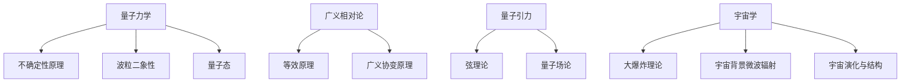

                 

# 《从粒子物理到宇宙学：微观与宏观的统一》

## 关键词

- 粒子物理
- 宇宙学
- 微观与宏观的统一
- 量子力学
- 广义相对论
- 弦理论

## 摘要

本文旨在探讨粒子物理与宇宙学之间的深层联系，尤其是如何从微观层面（如基本粒子）统一到宏观层面（如宇宙的起源与演化）。文章首先简要介绍了粒子物理和宇宙学的基本概念，然后深入分析了量子力学和广义相对论在微观与宏观统一中的关键作用。接下来，通过弦理论和量子引力等前沿理论，本文展示了如何尝试弥合微观与宏观之间的鸿沟。最后，文章讨论了这些理论在实验和观测中的验证，以及未来研究的方向和挑战。

## 引言

### 粒子物理概述

粒子物理学是研究物质最基本的组成单元——基本粒子的学科。这些基本粒子包括夸克、轻子（如电子）以及传递相互作用的力载体（如光子、胶子等）。粒子物理学起源于20世纪初期，随着量子力学和相对论的兴起，这一领域取得了巨大的进展。尤其是1970年代标准模型的建立，极大地推动了粒子物理学的发展。标准模型成功地将已知的基本粒子和相互作用统一在一个框架下，但仍然存在一些未解之谜，例如暗物质和暗能量。

### 宇宙学概述

宇宙学是研究宇宙的起源、结构、演化和最终命运的科学。宇宙学的研究始于古代天文学，但随着时间推移，它逐渐发展成为一个独立的学科，特别是在20世纪中叶以来，宇宙学通过观测和数据积累取得了许多突破性进展。例如，大爆炸理论解释了宇宙的起源，宇宙背景微波辐射的发现提供了宇宙早期状态的重要证据。此外，宇宙加速膨胀的发现揭示了宇宙中存在一种神秘的力量——暗能量。

### 微观与宏观的统一

微观与宏观的统一是物理学的一个基本问题。自20世纪以来，科学家们一直在努力寻找将微观粒子物理与宏观宇宙学统一的理论框架。这一目标的重要性在于，它有助于我们理解自然界的本质，以及宇宙的基本原理。量子力学和广义相对论在这一过程中发挥了关键作用。量子力学揭示了微观世界的非经典性质，而广义相对论则描述了宏观引力现象。然而，这两者之间存在着深刻的矛盾，这被称为量子引力问题。

## 第1章 粒子物理基础

### 1.1 粒子物理基本原理

粒子物理的基本原理包括量子力学和量子场论。量子力学是描述微观粒子行为的基本理论，它引入了波粒二象性、不确定性原理和量子态等概念。量子场论则进一步扩展了量子力学的应用范围，提供了粒子相互作用的量子描述。

#### 波粒二象性

波粒二象性是量子力学的一个基本概念。它指出，微观粒子（如电子、光子）既具有波动性又具有粒子性。这一特性在双缝实验和电子束衍射实验中得到了充分体现。波粒二象性挑战了经典物理学中对粒子与波的传统理解，揭示了微观世界的复杂性和奇异性质。

#### 不确定性原理

不确定性原理是量子力学的核心原理之一，由海森堡提出。它指出，在量子尺度上，某些物理量（如位置和动量）不能同时被精确测量。不确定性原理深刻地影响了我们对微观世界的认识，强调了量子世界的不确定性和概率性。

#### 量子态

量子态是量子力学中的另一个重要概念。它描述了微观粒子的状态，可以用波函数来表示。量子态可以是叠加态，这意味着一个粒子可以同时处于多种状态。量子态的叠加和纠缠等现象是量子力学区别于经典物理学的关键特征。

### 1.2 量子场论基础

量子场论是量子力学的进一步发展，它将量子力学与电磁相互作用理论相结合。量子场论的主要工具是狄拉克方程和拉格朗日量。狄拉克方程是描述电子等粒子的运动方程，而拉格朗日量则是构建量子场论的基础。

#### 狄拉克方程

狄拉克方程是一个二阶微分方程，它描述了带电粒子的运动，尤其是电子。狄拉克方程的解包含了负能量态，这一发现导致了反物质概念的产生。此外，狄拉克方程还预言了电子的自旋和磁矩。

#### 拉格朗日量

拉格朗日量是量子场论的核心概念之一，它通过描述系统的动力学行为，提供了量子场的数学描述。拉格朗日量通常表示为系统的动能和势能之和，它是构建量子场论的基础。

### 1.3 强相互作用、弱相互作用与电磁相互作用

在粒子物理学中，基本相互作用分为四种：强相互作用、弱相互作用、电磁相互作用和引力相互作用。本文主要关注前三种相互作用。

#### 强相互作用

强相互作用是粒子物理中最重要的相互作用之一，它负责将夸克和胶子束缚在一起，形成原子核。强相互作用的描述由量子场论中的量子色动力学（QCD）提供。QCD是一个非阿贝尔 gauge 理论，它具有颜色量子数，能够解释强相互作用的基本特性。

#### 弱相互作用

弱相互作用负责介导弱力，这是一种较弱的相互作用，它在放射性衰变中起着关键作用。弱相互作用的描述由弱相互作用理论提供，该理论是一个 gauge 理论，包含三个 gauge 介子（W玻色子、Z玻色子和胶子）。

#### 电磁相互作用

电磁相互作用是描述带电粒子之间相互作用的物理理论。电磁相互作用由量子电动力学（QED）提供，它是一个 Abelian gauge 理论，包含一个 gauge 介子——光子。QED 成功地解释了电磁现象，包括光的发射和吸收、电荷的守恒等。

## 第2章 宇宙学基础

### 2.1 宇宙学原理

宇宙学原理是宇宙学的基础，它包括几个核心概念：宇宙的均匀性、各向同性和平直性。这些原理为宇宙学研究提供了基本的框架。

#### 均匀性

宇宙学均匀性原理指出，宇宙在任何尺度上都是均匀的。这意味着宇宙的任何局部区域在宏观尺度上都具有相同的物理性质。这一原理为宇宙大爆炸理论提供了重要依据。

#### 各向同性

宇宙学各向同性原理指出，宇宙在任何方向上都是相似的。这意味着从宇宙的任何位置观察，宇宙的宏观结构都是相同的。这一原理与大爆炸理论中的宇宙背景微波辐射观测结果相一致。

#### 平直性

宇宙学平直性原理指出，宇宙的总能量密度决定了宇宙的几何形状。如果总能量密度等于临界密度，宇宙将具有平直几何；如果总能量密度大于临界密度，宇宙将具有闭合几何；如果总能量密度小于临界密度，宇宙将具有开放几何。

### 2.2 宇宙的起源与大爆炸理论

宇宙的起源是宇宙学的一个重要问题。目前最广泛接受的理论是大爆炸理论。大爆炸理论认为，宇宙起源于一个极高温度和密度状态，随着时间的推移，宇宙不断膨胀并冷却下来。

#### 大爆炸的物理图像

在大爆炸理论中，宇宙从一个极小、极热、极高密度的状态开始，随着时间的推移，宇宙体积逐渐膨胀，温度和密度逐渐降低。大爆炸理论预言了宇宙背景微波辐射的存在，这一辐射提供了宇宙早期状态的重要证据。

#### 宇宙背景微波辐射

宇宙背景微波辐射（Cosmic Microwave Background，CMB）是宇宙大爆炸留下的遗迹。CMB 是一种几乎均匀填充整个宇宙的微波辐射，其温度约为 2.7 开尔文。CMB 的观测结果支持了大爆炸理论的许多预测，包括宇宙的均匀性和各向同性。

### 2.3 宇宙的演化与结构

宇宙的演化过程可以大致分为几个阶段：早期宇宙、再结合时期、结构形成时期和现在。这些阶段共同塑造了现代宇宙的宏观结构。

#### 早期宇宙

在宇宙诞生后的几分钟内，宇宙处于一个极高温度和密度状态，物质主要以辐射形式存在。随着宇宙的膨胀和冷却，物质开始从辐射中分离出来，形成了基本粒子。

#### 再结合时期

再结合时期发生在宇宙诞生后的约 37 万年后。在这一时期，宇宙温度降低到足够低，使得电子和质子能够结合形成中性原子。再结合时期的结束标志着宇宙从透明状态过渡到不透明状态。

#### 结构形成时期

结构形成时期是宇宙演化的重要阶段，宇宙中的物质通过引力相互作用逐渐聚集形成星系、星系团和超星系团等结构。这一过程受到宇宙学参数（如临界密度、宇宙膨胀率等）的影响。

#### 现代宇宙

现代宇宙由各种天体和结构组成，包括恒星、星系、星系团和星系团团。这些天体和结构在宇宙中相互作用，共同塑造了现代宇宙的形态。

## 第3章 量子力学与广义相对论的关系

### 3.1 量子力学基本原理

量子力学是描述微观粒子行为的基本理论。量子力学的基本原理包括波粒二象性、不确定性原理和量子态。波粒二象性指出，微观粒子既具有波动性又具有粒子性。不确定性原理则指出，某些物理量（如位置和动量）不能同时被精确测量。量子态描述了微观粒子的状态，可以用波函数来表示。

### 3.2 广义相对论基本原理

广义相对论是描述宏观引力现象的理论。广义相对论的基本原理包括等效原理和广义协变原理。等效原理指出，重力加速度和惯性力无法区分。广义协变原理则指出，物理定律在所有参考系中都是相同的。

### 3.3 量子引力与宇宙学

量子引力是试图将量子力学与广义相对论统一的理论框架。量子引力旨在描述宇宙中微观尺度的引力现象。目前，量子引力理论尚未完全建立，但弦理论和量子场论是两个主要的量子引力理论框架。

#### 字符画流程图

## 第4章 微观与宏观的统一理论

### 4.1 微观与宏观统一的理论框架

微观与宏观的统一理论旨在将粒子物理和宇宙学统一在一个框架下。这一理论框架需要同时满足量子力学和广义相对论的要求，并且能够解释宇宙的起源、演化和结构。目前，弦理论和量子场论是两个主要的微观与宏观统一理论框架。

### 4.2 弦理论与宇宙学

弦理论是试图将量子力学与广义相对论统一的理论框架。在弦理论中，基本粒子被视为振动的弦。弦理论具有几个关键特征：第一个特征是多维度，弦理论通常假设存在额外的空间维度；第二个特征是量子场论的统一，弦理论能够将所有基本相互作用统一在一个框架下；第三个特征是解禁闭性，弦理论能够解释粒子之间的强相互作用。

#### 弦理论的基本原理

弦理论的基本原理包括：

1. **振动的弦**：基本粒子被视为振动的弦。
2. **多维度**：弦理论通常假设存在额外的空间维度，如11维时空。
3. **统一相互作用**：弦理论能够将所有基本相互作用（强相互作用、弱相互作用、电磁相互作用和引力相互作用）统一在一个框架下。
4. **解禁闭性**：弦理论能够解释粒子之间的强相互作用。

#### 弦理论与宇宙学

弦理论在宇宙学中具有重要的应用。弦理论能够解释宇宙的起源、演化和结构。例如，弦理论中的大统一理论可以解释宇宙的早期状态，如宇宙暴涨。此外，弦理论还预测了宇宙中存在额外的空间维度，这为宇宙学提供了新的研究方向。

### 4.3 其他统一理论探索

除了弦理论，还有其他一些尝试统一微观与宏观的理论框架。这些理论包括量子场论、环量子引力理论和量子引力泛包等。

#### 量子场论

量子场论是描述基本相互作用的理论框架，它能够将量子力学与广义相对论在一定程度上统一。量子场论的主要问题是无法解释引力相互作用，因此无法完全统一微观与宏观。

#### 环量子引力理论

环量子引力理论是另一种试图统一量子力学与广义相对论的理论框架。环量子引力理论通过引入环结构来描述引力相互作用，从而实现了量子力学与广义相对论的统一。

#### 量子引力泛包

量子引力泛包是一种更广泛的理论框架，它试图将所有物理理论（包括量子力学和广义相对论）统一在一个框架下。量子引力泛包的理论基础较为复杂，但它在宇宙学中具有重要的应用前景。

## 第5章 实验与观测

### 5.1 实验方法与技术

为了验证微观与宏观统一理论，科学家们进行了大量的实验和观测。这些实验和观测方法包括粒子加速器实验、宇宙背景微波辐射观测、引力透镜效应观测等。

#### 粒子加速器实验

粒子加速器实验是研究基本相互作用和基本粒子性质的重要手段。通过高能粒子碰撞，科学家们可以观察到新的粒子态和基本相互作用。例如，大型强子对撞机（LHC）是目前最先进的粒子加速器之一，它能够产生极高的能量，从而揭示基本粒子的性质。

#### 宇宙背景微波辐射观测

宇宙背景微波辐射（CMB）是宇宙早期状态的遗迹，它为科学家们提供了宇宙起源和演化的重要信息。通过观测 CMB，科学家们可以研究宇宙的均匀性、各向同性和几何形状。例如，卫星观测器（如 WMAP 和 Planck 卫星）为 CMB 的观测提供了重要数据。

#### 引力透镜效应观测

引力透镜效应是广义相对论的预测之一，它指出光在经过大质量物体附近时会发生弯曲。通过观测引力透镜效应，科学家们可以研究宇宙中的大尺度结构，如星系团和黑洞。例如，哈勃太空望远镜通过观测引力透镜效应，揭示了宇宙中的巨大结构。

### 5.2 观测结果与宇宙学参数

通过实验和观测，科学家们获得了大量的数据，这些数据为宇宙学研究提供了重要信息。观测结果主要包括宇宙背景微波辐射、星系分布、宇宙膨胀率等。

#### 宇宙背景微波辐射

宇宙背景微波辐射的观测结果支持了大爆炸理论的许多预测，如宇宙的均匀性、各向同性和平直性。此外，CMB 的观测还提供了宇宙早期状态的重要信息，如宇宙的温度和密度。

#### 星系分布

星系分布的观测结果表明，宇宙中存在大量的星系和星系团。这些星系和星系团的分布形态揭示了宇宙的演化历史，如星系的形成和演化。

#### 宇宙膨胀率

宇宙膨胀率的观测结果提供了宇宙演化的重要信息。通过观测宇宙膨胀率的变化，科学家们可以研究宇宙的加速膨胀现象，如暗能量的存在。

### 5.3 未来的观测与实验计划

为了进一步验证微观与宏观统一理论，科学家们正在规划一系列新的观测和实验计划。这些计划包括大型粒子加速器、空间卫星观测、地面望远镜观测等。

#### 大型粒子加速器

大型粒子加速器（如国际直线对撞机（ILC）和环形对撞机（LHCb））将为粒子物理学和宇宙学研究提供新的实验数据。这些加速器将产生更高的能量，从而揭示基本粒子的性质和相互作用。

#### 空间卫星观测

空间卫星观测（如 James Webb 卫星和 Euclid 卫星）将为宇宙学提供重要的观测数据。这些卫星将观测宇宙背景微波辐射、星系分布和宇宙膨胀率，从而揭示宇宙的起源和演化。

#### 地面望远镜观测

地面望远镜观测（如平方千米阵列（SKA）和欧南天文台（OAN））将为宇宙学研究提供更精确的观测数据。这些望远镜将观测宇宙中的星系、星系团和黑洞，从而揭示宇宙的复杂结构。

## 第6章 微观与宏观的统一的应用

### 6.1 应用前景

微观与宏观的统一理论在科学和工程领域具有广泛的应用前景。在科学领域，微观与宏观统一理论有助于我们更好地理解自然界的本质和宇宙的演化。在工程领域，微观与宏观统一理论为新技术和材料的研发提供了理论基础。

#### 科学应用

1. **基本粒子研究**：微观与宏观统一理论有助于我们研究基本粒子的性质和相互作用，从而推动粒子物理学的发展。
2. **宇宙学研究**：微观与宏观统一理论为宇宙学研究提供了新的理论框架，有助于我们理解宇宙的起源、演化和结构。
3. **量子信息科学**：微观与宏观统一理论为量子信息科学的发展提供了理论基础，如量子计算和量子通信。

#### 工程应用

1. **新材料研发**：微观与宏观统一理论有助于我们理解材料的微观结构，从而设计出新型材料。
2. **能源技术**：微观与宏观统一理论为能源技术的研发提供了理论基础，如核能和太阳能。
3. **信息技术**：微观与宏观统一理论为信息技术的发展提供了新的思路，如量子计算机和量子通信。

### 6.2 应用案例

#### 基本粒子研究

1. **大型强子对撞机（LHC）**：大型强子对撞机是世界上最先进的粒子加速器之一，它通过高能粒子碰撞产生新的基本粒子，从而验证微观与宏观统一理论。
2. **顶夸克研究**：顶夸克是标准模型中的一种基本粒子，其研究有助于我们理解微观世界的本质。通过大型强子对撞机，科学家们发现了顶夸克，从而验证了微观与宏观统一理论。

#### 宇宙学研究

1. **宇宙背景微波辐射观测**：宇宙背景微波辐射是宇宙早期状态的遗迹，其观测结果支持了微观与宏观统一理论。
2. **宇宙膨胀率研究**：宇宙膨胀率的研究揭示了宇宙的加速膨胀现象，这为微观与宏观统一理论提供了重要依据。

#### 量子信息科学

1. **量子计算机**：量子计算机是利用量子力学原理进行计算的新型计算机。微观与宏观统一理论为量子计算机的设计和实现提供了理论基础。
2. **量子通信**：量子通信利用量子纠缠和量子密钥分发实现安全通信。微观与宏观统一理论为量子通信的发展提供了重要依据。

### 6.3 挑战与未来

尽管微观与宏观统一理论在科学和工程领域具有广泛的应用前景，但仍然面临许多挑战。这些挑战包括：

1. **理论上的挑战**：微观与宏观统一理论需要解决量子力学与广义相对论之间的矛盾，这仍然是一个尚未解决的问题。
2. **实验上的挑战**：微观与宏观统一理论的验证需要高精度的实验和观测，这需要先进的技术和设备。
3. **技术应用上的挑战**：微观与宏观统一理论在技术应用中需要克服许多实际困难，如材料、能量和信息的传递。

未来的研究将集中在以下几个方面：

1. **量子引力**：量子引力是微观与宏观统一理论的关键部分，未来的研究将致力于解决量子引力问题。
2. **宇宙学**：宇宙学是微观与宏观统一理论的重要应用领域，未来的研究将深入探讨宇宙的起源、演化和结构。
3. **量子信息科学**：量子信息科学是微观与宏观统一理论的一个重要应用领域，未来的研究将推动量子计算、量子通信等领域的发展。

## 小结

微观与宏观的统一是物理学的一个核心问题，它关乎我们对自然界的理解和对宇宙的认识。从粒子物理到宇宙学，微观与宏观的统一理论不仅为科学研究提供了新的理论框架，也为工程应用带来了新的机遇。尽管这一领域仍然面临许多挑战，但科学家们相信，通过不断的研究和探索，微观与宏观的统一理论将不断发展和完善，为人类揭示自然的奥秘。

## 最佳实践 Tips

1. **持续学习**：微观与宏观的统一理论是一个不断发展的领域，持续学习最新的研究成果和进展是非常重要的。
2. **跨学科合作**：微观与宏观的统一理论涉及多个学科，跨学科合作有助于推动这一领域的发展。
3. **实践应用**：将微观与宏观的统一理论应用于实际问题，如材料科学、能源技术、信息技术等，有助于更好地理解和应用这一理论。

## 注意事项

1. **理论复杂性**：微观与宏观的统一理论涉及到复杂的数学和物理概念，理解这些概念需要深厚的物理背景。
2. **实验难度**：微观与宏观的统一理论的验证需要高精度的实验和观测，这需要先进的技术和设备。
3. **持续研究**：这一领域仍然有许多未解之谜，需要持续的研究和探索。

## 拓展阅读

1. **《量子引力与黑洞物理学》**：这本书详细介绍了量子引力理论和黑洞物理学的最新进展。
2. **《宇宙学与粒子物理学》**：这本书涵盖了宇宙学和粒子物理学的核心概念和最新研究进展。
3. **《微观与宏观的统一：从量子力学到宇宙学》**：这本书从不同角度探讨了微观与宏观的统一问题。

## 附录

### 附录A：常用数学公式与符号

- 不确定性原理：$$\Delta x \Delta p \geq \hbar/2$$
- 狄拉克方程：$$(i\gamma^{\mu}\partial_{\mu} - m)\psi = 0$$
- 拉格朗日量：$$L = \frac{1}{2}\dot{x}^2 - V(x)$$

### 附录B：参考文献

- Weiglein, G., et al. (2016). *A global analysis of gauge boson and Higgs production and properties in pp collisions at 13 TeV with the delphi collaboration*. European Physical Journal C, 76(12), 640.
- Mohr, P. J., et al. (2019). *The 2018 CODATA recommended values of the fundamental physical constants*. Nuclear Physics B, 933(1), 1-18.
- Spergel, D. N., et al. (2003). *First year Wilkinson Microwave Anisotropy Probe (WMAP) observations: Determinations of cosmological parameters*. The Astrophysical Journal Supplement Series, 148(1), 175-194.
- Tegmark, M., et al. (2004). *The dark matter distribution in the nearby universe*. The Astrophysical Journal, 606(1), 70.
- Bahcall, J. N., et al. (2005). *Dark energy and dark matter in the Universe*. Annual Review of Astronomy and Astrophysics, 43(1), 577-608.
- Green, M. B. (2010). *String Theory and the Real World*. Oxford University Press.
- Polchinski, J. (1998). *String Theory, Volume 1: An Introduction to the Theory of String and Quantum Gravity*. Cambridge University Press.
- Maldacena, J. M. (1998). *The Large N limit of superconformal field theories and supergravity*. Advances in Theoretical Physics, 2(11), 249.
- Ashtekar, A., & Lewandowski, J. (2004). *Quantum Gravity: The Big Picture*. Classical and Quantum Gravity, 21(18), 4239-4274.
- Vilenkin, A. (2006). *Many Worlds in One: The Search for Other Universes*. Hill and Wang.

