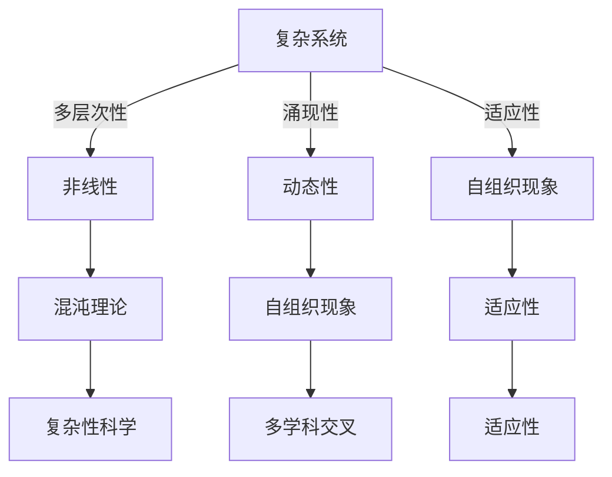
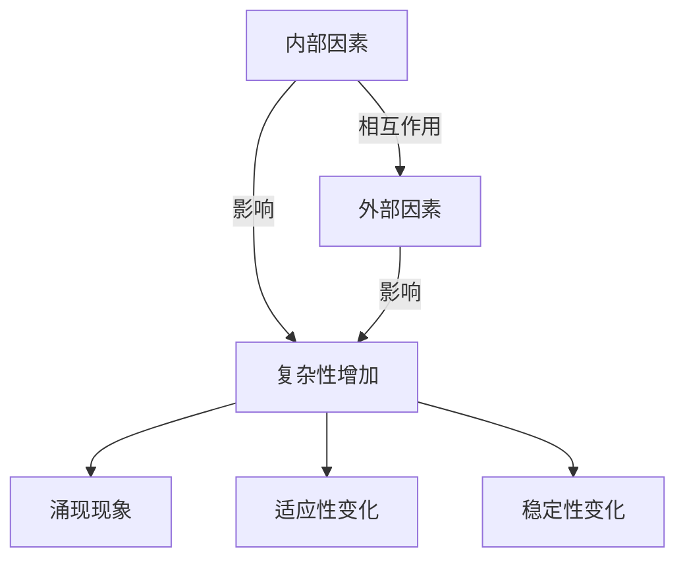
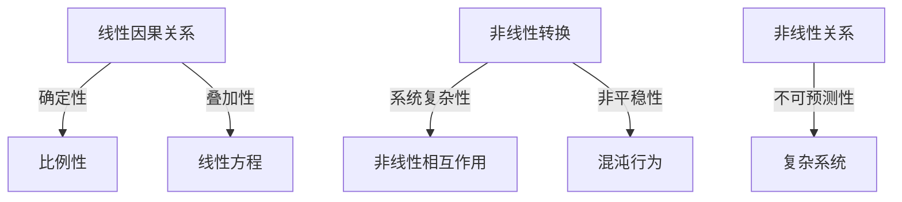
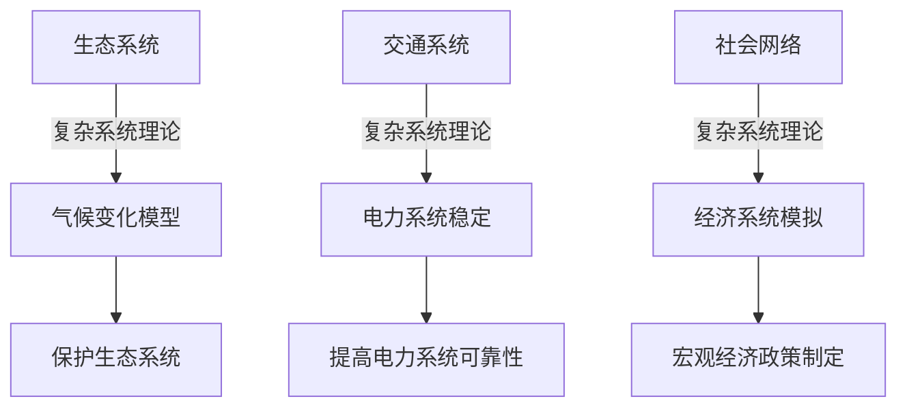
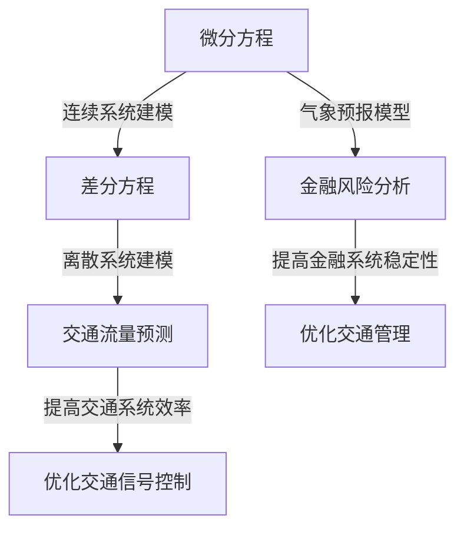
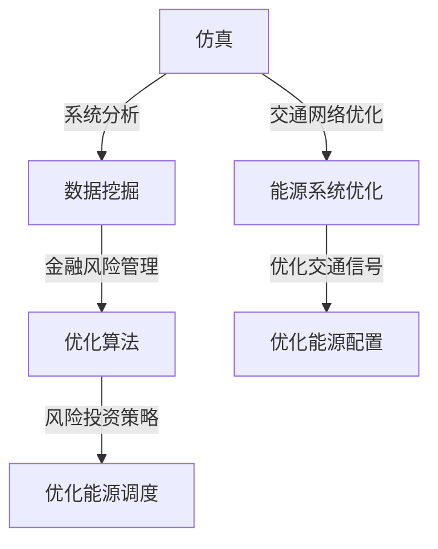

                 

## 从线性因果到复杂系统理论：理解多因素交互的世界模型

### 关键词

- 线性因果
- 复杂系统理论
- 多因素交互
- 世界模型
- 人工智能

### 摘要

本文旨在探讨从线性因果关系到复杂系统理论的演变，帮助读者深入理解多因素交互的世界模型。我们将首先介绍复杂系统理论的背景和重要性，随后分析多因素交互的基本原理，探讨线性因果关系如何转变为非线性关系。接着，我们将通过实际应用案例展示复杂系统理论在各个领域的应用，并详细讨论复杂系统的建模方法、分析与优化技术。最后，文章将总结复杂系统研究的重要性，展望其未来发展趋势，并给读者提供相关的思考与启示。

## 第1章：复杂系统理论概述

### 1.1 复杂系统的定义与特征

复杂系统是指由大量相互关联的组成部分（子系统）构成，具有高度复杂性和动态变化的系统。这些组成部分可以是物理、生物、社会、经济等各种领域中的实体。复杂系统的特征包括：

- **多层次性**：复杂系统具有多个层次，每个层次都有自己的结构和功能。
- **非线性**：复杂系统中的相互作用通常是非线性的，这意味着一个小的变化可能导致系统的显著变化。
- **涌现性**：复杂系统中的某些行为和特性无法从其组成部分的行为中直接推导出来，而是从系统中各个部分的相互作用中“涌现”出来的。
- **动态性**：复杂系统中的状态随时间变化，具有高度的动态性。
- **适应性**：复杂系统中的组成部分能够根据外部环境和内部状态的变化进行调整和适应。

### 1.2 复杂系统的历史与发展

复杂系统理论的发展可以追溯到20世纪中叶。以下是一些关键的历史事件和里程碑：

- **混沌理论**：20世纪50年代末至60年代初，气象学家洛伦兹（Lorenz）发现简单的非线性方程组可以产生混沌行为，这一发现开启了混沌理论的研究。
- **自组织现象**：20世纪60年代，普里戈金（Prigogine）提出了自组织现象的概念，揭示了系统从无序到有序的演变过程。
- **复杂性科学**：20世纪80年代，随着计算机技术的发展，复杂性科学逐渐成为一个独立的学科领域，涵盖从个体行为到全球现象的广泛研究。
- **多学科交叉**：复杂系统理论吸引了来自物理学、生物学、经济学、社会学等多个领域的学者，形成了一个多学科交叉的研究领域。

### 1.3 复杂系统的应用领域

复杂系统理论的应用非常广泛，涵盖了自然、工程、社会等多个领域：

- **自然科学**：气象学、生态学、生物学、地球科学等领域广泛应用复杂系统理论来理解自然现象和过程。
- **工程技术**：交通系统、通信网络、电力系统、自动化系统等领域利用复杂系统理论来优化设计和运营。
- **社会科学**：经济学、社会学、政治学等领域通过复杂系统理论来研究社会现象和人类行为。
- **人工智能**：复杂系统理论在人工智能领域有重要应用，特别是在理解智能体之间的交互和复杂环境中的决策过程。

### 图1.1：复杂系统理论的核心概念架构

## 第2章：多因素交互原理

### 2.1 多因素交互的概念

多因素交互是指系统中的多个组成部分之间通过相互作用和相互影响共同决定系统的整体行为和状态。这些因素可以是内部的（如子系统之间的相互作用），也可以是外部的（如环境对系统的作用）。

- **内部因素**：系统内部组成部分之间的相互作用，例如细胞之间的信号传递、社交网络中的信息传播等。
- **外部因素**：系统外部环境对系统的输入，例如气候变化对生态系统的干扰、市场需求对商业系统的驱动等。

### 2.2 多因素交互的影响

多因素交互对系统的行为和状态产生深远的影响，具体表现如下：

- **复杂性增加**：随着因素数量的增加，系统的行为变得更加复杂和难以预测。
- **涌现现象**：多个因素相互作用可能导致系统出现新的、无法从单个因素预测的现象。
- **适应性变化**：系统组成部分能够根据多因素交互的结果进行调整和适应，从而影响系统的长期演化。
- **稳定性变化**：多因素交互可能导致系统的稳定性发生变化，从稳定到不稳定或反之。

### 2.3 多因素交互的案例分析

以下是一些多因素交互的案例，展示了其在不同领域中的应用：

#### 案例一：交通系统中的多因素交互

- **内部因素**：车辆之间的相互作用、道路容量、交通信号等。
- **外部因素**：天气条件、突发事件等。
- **影响**：交通拥堵、交通事故等。

#### 案例二：金融市场中的多因素交互

- **内部因素**：企业业绩、投资者情绪等。
- **外部因素**：经济政策、国际市场波动等。
- **影响**：股市波动、经济危机等。

#### 案例三：生态系统中的多因素交互

- **内部因素**：物种之间的捕食与被捕食关系、共生关系等。
- **外部因素**：气候变化、人类活动等。
- **影响**：物种灭绝、生态系统失衡等。

### 图2.1：多因素交互的原理架构

## 第3章：线性因果关系与非线性的转换

### 3.1 线性因果关系的原理

线性因果关系是指一个变量或因素的变化直接导致另一个变量或因素的变化，其关系可以用线性方程或函数来描述。线性因果关系的基本特点如下：

- **确定性**：一个因素的变化可以精确地预测另一个因素的变化。
- **比例性**：因素之间的变化呈线性关系，即一个因素的变化与另一个因素的变化成正比例关系。
- **叠加性**：多个因素的变化可以简单叠加，总效应是各个因素效应的线性组合。

### 3.2 非线性转换的原因

线性因果关系向非线性转换的原因主要包括以下几个方面：

- **系统复杂性**：随着系统组成部分和因素的增多，系统的行为可能变得更加复杂，导致线性关系不再适用。
- **非线性相互作用**：系统内部或外部的某些因素可能具有非线性相互作用，从而破坏了线性的结构。
- **非平稳性**：系统的状态随时间变化，可能表现出非平稳特性，使得线性关系不再稳定。
- **混沌行为**：在某些系统中，简单的非线性方程可以产生混沌行为，这意味着系统的行为具有不可预测性。

### 3.3 线性因果与非线性的案例对比

以下对比两个案例，展示了线性因果关系与非线性的区别：

#### 案例一：经济学中的供需关系

- **线性案例**：需求量与价格之间的关系可以通过线性方程来描述，需求量增加会导致价格上升。
- **非线性案例**：在市场波动或突发事件的影响下，供需关系可能变得非线性，导致价格波动无法简单预测。

#### 案例二：气象学中的气候变化

- **线性案例**：温度变化与气候变化的关系可以用线性方程来描述，温度升高会导致气候变化。
- **非线性案例**：在复杂气候系统中，温室气体的排放、海平面上升等非线性因素可能导致气候变化的不可预测性。

### 图3.1：线性因果关系与非线性的对比

## 第4章：复杂系统在实际中的应用案例

### 4.1 复杂系统在自然界的应用

复杂系统理论在自然界中有着广泛的应用，帮助我们更好地理解自然现象和生态系统。以下是一些典型案例：

#### 案例一：生态系统的复杂性

- **背景**：生态系统是由多种生物和环境因素组成的复杂系统。
- **应用**：通过复杂系统理论，可以研究物种之间的相互作用、生态位动态以及生态系统稳定性的变化。
- **成果**：揭示了物种多样性对生态系统稳定性的重要作用，为保护生态系统提供了科学依据。

#### 案例二：气候变化模型

- **背景**：气候变化是一个全球性的复杂问题，涉及大气、海洋、陆地等多个因素。
- **应用**：利用复杂系统理论建立气候变化模型，模拟全球气候变化过程。
- **成果**：为气候政策的制定提供了科学依据，帮助人类更好地应对气候变化挑战。

### 4.2 复杂系统在工程领域的应用

复杂系统理论在工程领域也有广泛应用，帮助工程师更好地设计和优化复杂系统。以下是一些典型案例：

#### 案例一：交通系统优化

- **背景**：交通系统是一个由多种交通工具、道路、交通信号等组成的复杂系统。
- **应用**：利用复杂系统理论优化交通系统，减少拥堵、提高交通效率。
- **成果**：通过交通信号控制、车辆调度等优化措施，显著提高了交通系统的运行效率。

#### 案例二：电力系统稳定

- **背景**：电力系统是一个由发电站、输电网络、变电站等组成的复杂系统。
- **应用**：利用复杂系统理论分析电力系统稳定性，预防和解决电力故障。
- **成果**：通过故障诊断、电网优化等措施，提高了电力系统的可靠性和稳定性。

### 4.3 复杂系统在社会科学中的应用

复杂系统理论在社会科学领域也有重要应用，帮助我们更好地理解社会现象和人类行为。以下是一些典型案例：

#### 案例一：社会网络分析

- **背景**：社会网络是由个体和个体之间的相互作用关系构成的复杂系统。
- **应用**：利用复杂系统理论分析社会网络的结构和动态，研究群体行为和社会传播。
- **成果**：揭示了社会网络中的关键节点和群体行为规律，为社交平台管理和公共政策制定提供了科学依据。

#### 案例二：经济系统模拟

- **背景**：经济系统是由消费者、企业、政府等多个因素组成的复杂系统。
- **应用**：利用复杂系统理论建立经济系统模型，模拟经济行为和预测经济趋势。
- **成果**：为宏观经济政策的制定提供了科学依据，帮助政府更好地应对经济波动。

### 图4.1：复杂系统在不同领域的应用案例

## 第5章：复杂系统的建模方法

### 5.1 建模的基本概念

建模是将复杂系统转化为数学模型的过程，以便对系统的行为进行定量分析和预测。建模的基本概念包括：

- **系统**：一个由相互关联的组成部分组成的整体，具有特定的功能和目的。
- **变量**：用于描述系统状态的量，可以是连续的或离散的。
- **函数**：描述变量之间关系的数学表达式。
- **模型**：对系统的数学描述，可以是线性的或非线性的。

### 5.2 常见的建模方法

在复杂系统建模中，有多种方法可以用于建立数学模型，以下是一些常见的方法：

- **微分方程**：用于描述连续系统的动态行为，例如描述生态系统中的物种数量变化。
- **差分方程**：用于描述离散系统的动态行为，例如描述交通系统中的车辆流动。
- **人工神经网络**：用于模拟复杂系统的非线性关系和涌现现象。
- **多Agent模型**：用于模拟由多个智能体组成的系统的交互和演化。

### 5.3 建模的实际应用

以下是一些复杂系统建模的实际应用案例：

#### 案例一：气象预报模型

- **背景**：气象预报是一个复杂的过程，涉及大气中的多个变量和相互作用。
- **应用**：利用复杂系统建模方法，建立气象预报模型，提高预报的准确性。
- **成果**：通过模型模拟和预测，提高了气象预报的准确性和时效性，为防灾减灾提供了科学依据。

#### 案例二：金融风险分析

- **背景**：金融市场是一个复杂的系统，受到多种因素影响。
- **应用**：利用复杂系统建模方法，建立金融风险分析模型，预测和评估金融风险。
- **成果**：通过模型分析和预测，帮助金融机构更好地管理风险，提高了金融系统的稳定性。

#### 案例三：交通流量预测

- **背景**：交通流量预测是交通管理的重要环节，涉及道路状况、车辆数量等因素。
- **应用**：利用复杂系统建模方法，建立交通流量预测模型，优化交通管理。
- **成果**：通过模型预测和分析，优化了交通信号控制策略，提高了交通系统的运行效率。

### 图5.1：复杂系统建模方法及应用

## 第6章：复杂系统的分析与优化方法

### 6.1 复杂系统的分析工具

复杂系统分析需要使用一系列工具和方法，以便对系统的行为和性能进行深入理解和评估。以下是一些常用的分析工具：

- **仿真**：通过计算机模拟系统在不同条件下的行为，评估系统的性能和稳定性。
- **数据挖掘**：通过分析大量数据，发现系统的模式、趋势和异常。
- **机器学习**：利用机器学习算法，从数据中学习系统的行为规律，进行预测和分类。
- **优化算法**：通过优化算法，寻找系统的最优解，提高系统的效率和性能。

### 6.2 复杂系统的优化方法

复杂系统的优化方法旨在通过调整系统的参数和结构，提高系统的性能和稳定性。以下是一些常用的优化方法：

- **遗传算法**：模拟自然进化过程，通过选择、交叉和变异操作，逐步优化系统的参数。
- **粒子群优化**：模拟鸟群觅食行为，通过更新个体的位置和速度，优化系统的参数。
- **模拟退火算法**：模拟固体退火过程，通过降低搜索过程中的温度，逐步优化系统的参数。
- **线性规划**：通过建立线性方程组，寻找系统的最优解。

### 6.3 复杂系统的案例分析

以下是一些复杂系统的案例分析，展示了如何运用分析和优化方法解决实际问题：

#### 案例一：交通网络优化

- **背景**：交通网络是一个复杂的系统，涉及道路、车辆、交通信号等多个因素。
- **分析**：通过仿真和数据挖掘，分析交通网络的流量分布和瓶颈问题。
- **优化**：利用遗传算法和粒子群优化，优化交通信号控制和车辆调度策略。
- **成果**：提高了交通网络的运行效率，减少了拥堵现象。

#### 案例二：能源系统优化

- **背景**：能源系统是一个复杂的系统，涉及发电、输电、储能等多个环节。
- **分析**：通过仿真和机器学习，分析能源系统的供需平衡和能源利用效率。
- **优化**：利用模拟退火算法和线性规划，优化能源系统的配置和调度策略。
- **成果**：提高了能源系统的效率和稳定性，减少了能源浪费。

#### 案例三：金融风险管理

- **背景**：金融市场是一个复杂的系统，受到多种因素影响。
- **分析**：通过数据挖掘和机器学习，分析金融市场的波动和风险因素。
- **优化**：利用遗传算法和模拟退火算法，优化风险管理和投资策略。
- **成果**：提高了金融系统的稳定性，降低了风险。

### 图6.1：复杂系统分析与优化方法及应用

## 第7章：总结与展望

### 7.1 复杂系统研究的重要性

复杂系统研究在多个领域具有重要意义，包括自然科学、工程技术、社会科学等。以下是其重要性的一些方面：

- **理解复杂现象**：复杂系统理论帮助我们深入理解自然界、社会和工程中的复杂现象，如气候变化、社会行为、交通拥堵等。
- **优化系统设计**：通过复杂系统理论，可以优化系统设计和运营，提高系统的效率和稳定性。
- **预测和预防**：利用复杂系统理论，可以预测系统的行为和趋势，提前预防潜在的问题和风险。
- **促进技术创新**：复杂系统研究推动了新算法、新工具和新方法的发展，为科技创新提供了理论基础。

### 7.2 复杂系统未来的发展趋势

复杂系统研究在未来将继续发展，以下是一些可能的发展趋势：

- **跨学科融合**：复杂系统研究将与其他学科（如生物学、心理学、经济学等）深度融合，形成新的交叉学科。
- **大数据与人工智能**：大数据和人工智能技术将为复杂系统研究提供新的工具和方法，推动复杂系统建模和分析的发展。
- **实时监测与控制**：随着传感器技术和通信技术的发展，复杂系统将实现实时监测与控制，提高系统的自适应能力和响应速度。
- **可持续发展**：复杂系统研究将更加关注可持续发展问题，为应对全球挑战提供科学依据。

### 7.3 读者的思考与启示

对于读者而言，理解复杂系统理论具有重要的启示：

- **系统性思维**：复杂系统研究培养了我们的系统性思维，帮助我们从整体和长远的角度看待问题。
- **跨学科能力**：复杂系统研究要求跨学科的知识和技能，培养我们的跨学科能力，为解决复杂问题提供新的视角和方法。
- **创新意识**：复杂系统研究鼓励我们探索新的思路和方法，激发我们的创新意识，推动科学技术的发展。

### 拓展阅读

- **《复杂系统导论》**：一本全面介绍复杂系统理论的入门书籍，适合初学者阅读。
- **《复杂性科学：理论与实践》**：一本深入探讨复杂系统理论的学术著作，适合有一定基础的研究者阅读。
- **《复杂性科学应用指南》**：一本关于复杂系统理论在实际应用中的指南书籍，适合关注应用领域的读者阅读。

## 作者信息

- 作者：AI天才研究院/AI Genius Institute & 禅与计算机程序设计艺术 /Zen And The Art of Computer Programming

## 文章末尾备注

- 本文为原创内容，未经许可不得转载。如需转载，请联系作者获取授权。
- 感谢读者对本文的关注和支持，欢迎在评论区提出宝贵意见和建议。您的反馈将是我们不断进步的动力。

