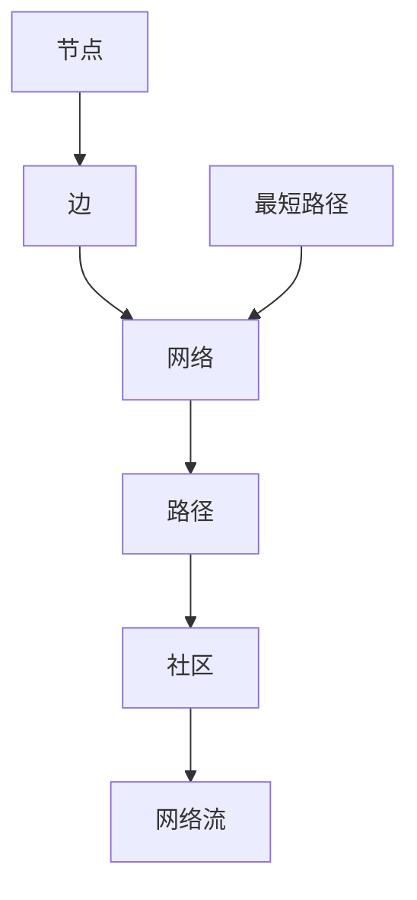

                 

### 文章标题：从线性因果到复杂网络：理解世界的新方法

> 关键词：线性因果模型、复杂网络、因果推断、算法、数学模型、项目实战

> 摘要：本文将深入探讨从线性因果模型向复杂网络的过渡，分析复杂网络的定义、特性及其在现实世界中的应用。我们将通过核心概念的联系、算法原理讲解、数学模型解读，再到实际项目实战，逐步揭示复杂网络作为一种理解世界的新方法所带来的深刻变革。

---

## 引言

在科学研究中，线性因果模型长期以来一直是理解复杂系统行为的主要工具。然而，随着数据复杂性不断增加，传统的线性因果模型逐渐暴露出其局限性，无法有效地处理高维数据和非线性关系。复杂网络作为一种全新的方法论，为我们提供了一种全新的视角，帮助我们更好地理解现实世界中的复杂系统。

复杂网络不仅能够捕捉系统中的非线性关系，还能揭示隐藏在数据背后的复杂结构。这种新的理解方法不仅在学术界引起了广泛关注，也在工业界得到了广泛应用，例如在社交媒体分析、生物信息学和金融预测等领域。本文将从以下几个方面展开讨论：

1. **线性因果模型的介绍**：回顾线性因果模型的基本概念和特征，探讨其应用领域和局限性。
2. **复杂网络的初步认识**：介绍复杂网络的定义、结构和特性，以及其在现实世界中的应用。
3. **线性因果模型与复杂网络的联系**：分析线性因果模型向复杂网络的演变过程，探讨其在因果推断中的应用。
4. **核心算法与数学模型**：详细讲解复杂网络中的核心算法原理和数学模型。
5. **项目实战**：通过实际项目，展示复杂网络的实践应用。

通过以上几个方面的深入探讨，本文旨在为读者提供一种全新的理解世界的视角，并展示复杂网络作为一种新方法在解决实际问题中的巨大潜力。

### 背景介绍

线性因果模型（Linear Causal Models）是现代科学研究中常用的一种方法论，其核心思想是通过分析变量之间的线性关系，揭示它们之间的因果关系。线性因果模型的基础是线性回归模型（Linear Regression Model），它通过建立自变量和因变量之间的线性关系，实现对因变量预测和解释。具体来说，线性回归模型可以用以下方程表示：

$$ Y = \beta_0 + \beta_1X + \epsilon $$

其中，\(Y\) 为因变量，\(X\) 为自变量，\(\beta_0\) 和 \(\beta_1\) 分别为模型的截距和斜率，\(\epsilon\) 为误差项。

线性因果模型在许多领域都得到了广泛应用，如经济学、生物学和工程学等。例如，在经济学中，通过分析消费行为与收入之间的线性关系，可以预测未来的消费趋势；在生物学中，通过分析基因表达数据与疾病之间的关系，可以揭示疾病的成因。

尽管线性因果模型在许多情况下能够有效地揭示变量之间的因果关系，但它也存在一定的局限性。首先，线性因果模型要求变量之间必须是线性关系，这在许多现实场景中并不成立。其次，线性因果模型无法捕捉变量之间的复杂相互作用，尤其是当系统包含大量变量时，线性模型往往无法提供准确的预测和解释。

复杂网络（Complex Networks）作为一种全新的方法论，旨在克服线性因果模型的局限性。复杂网络的定义起源于图论，它通过将现实世界中的实体和关系抽象为图结构，揭示系统中的复杂结构和非线性关系。具体来说，复杂网络可以用以下图表示：

$$ G = (V, E) $$

其中，\(V\) 为节点集合，表示系统中的实体；\(E\) 为边集合，表示实体之间的关系。

复杂网络的特性包括高度非线性、自相似性、无标度性等。这些特性使得复杂网络在揭示系统中的复杂关系和相互作用方面具有独特的优势。例如，在社会网络分析中，复杂网络可以帮助我们揭示人际关系的复杂结构；在生物信息学中，复杂网络可以帮助我们理解基因调控网络中的相互作用。

与线性因果模型相比，复杂网络具有更强的建模能力和解释力。首先，复杂网络可以捕捉变量之间的非线性关系，这使得它在处理复杂系统时更加灵活。其次，复杂网络可以揭示系统中的隐藏结构和模式，从而提供更深层次的解释。此外，复杂网络还可以通过节点之间的相互作用，模拟系统的动态行为，从而实现对系统的实时监控和预测。

总之，从线性因果模型向复杂网络的过渡，不仅为我们提供了一种新的理解世界的方法，也为科学研究和技术应用带来了新的机遇和挑战。在接下来的章节中，我们将进一步探讨复杂网络的核心算法、数学模型以及实际应用，以揭示这一新方法所带来的深刻变革。

### 核心概念与联系

为了更好地理解复杂网络，我们需要首先明确几个核心概念，并探讨它们之间的关系架构。以下是几个关键概念及其相互关系：

1. **节点**（Node）：节点是复杂网络的基本组成单位，可以表示任何实体，如人、物品或基因。节点之间通过边（Edge）进行连接，边表示节点之间的相互作用或关联。
2. **边**（Edge）：边是连接节点的桥梁，表示节点之间的直接关系。边的权重（Edge Weight）可以表示关系的强度或重要性。
3. **网络**（Network）：网络是由节点和边构成的集合，用于表示系统中的复杂结构。网络可以是无向的或定向的，取决于边的性质。
4. **路径**（Path）：路径是网络中连接两个节点的序列，表示节点之间的直接连接。最短路径（Shortest Path）是连接两个节点的最短序列，可以用于优化路径选择。
5. **社区**（Community）：社区是指网络中紧密相连的节点集合，这些节点之间的联系比与其他节点的联系更强。社区检测（Community Detection）是识别网络中的社区结构的重要任务。
6. **网络流**（Network Flow）：网络流是沿着网络路径流动的实体，如信息、物质或能量。最大流问题（Maximum Flow Problem）是寻找网络中最大可能流量的关键问题。

下面，我们将使用Mermaid流程图来展示这些概念之间的联系：



在上述流程图中，我们可以看到节点、边和网络构成了复杂网络的基本结构。路径和社区进一步扩展了网络的结构，而网络流则展示了网络中实体的流动情况。最短路径问题则用于优化网络中的路径选择，确保网络运行效率。

通过这种图示方法，我们可以直观地理解复杂网络中的核心概念及其相互关系。这不仅有助于我们深入掌握复杂网络的基本原理，也为进一步探讨复杂网络的算法和数学模型奠定了基础。

### 核心算法原理讲解

复杂网络中，核心算法的原理至关重要，因为它们不仅能帮助我们更好地理解和分析网络结构，还能应用于实际问题中。以下是几个关键算法的原理及其使用伪代码的详细解释。

#### 1. 社区检测算法（Community Detection Algorithm）

社区检测是复杂网络分析中的重要任务，旨在识别网络中的紧密相连节点集合。一种常用的社区检测算法是 **Louvain算法**。

**Louvain算法原理**：
Louvain算法通过迭代的方式，将节点逐步划分为社区。算法的核心思想是计算每个节点与现有社区之间的相似性，并根据相似性值将节点分配到最相似的社区。

**伪代码**：

```python
def Louvain_detection(G):
    communities = []
    nodes = list(G.nodes())
    while nodes:
        node = nodes.pop()
        community = [node]
        neighbors = list(G.neighbors(node))
        for neighbor in neighbors:
            if neighbor not in communities:
                nodes.remove(neighbor)
                community.append(neighbor)
        communities.append(community)
    return communities
```

在上述伪代码中，`G` 表示复杂网络，`communities` 是一个用于存储社区的列表。算法首先将所有节点放入一个列表 `nodes` 中，然后逐个节点进行社区划分。对于每个节点，算法将其及其邻居节点划分为同一个社区，并从 `nodes` 列表中移除这些节点，直到所有节点都被划分到社区中。

#### 2. 社会网络分析算法（Social Network Analysis Algorithm）

社会网络分析是一种研究人际关系的分析方法，常用于识别网络中的重要节点。一种常用的社会网络分析算法是 **度中心性**（Degree Centrality）。

**度中心性原理**：
度中心性是指节点在网络中的连接数，用于衡量节点的重要性和影响力。度中心性越高，节点在网中的作用越重要。

**伪代码**：

```python
def degree_centrality(G):
    centrality = {}
    for node in G.nodes():
        centrality[node] = len(list(G.neighbors(node)))
    return centrality
```

在上述伪代码中，`G` 表示复杂网络，`centrality` 是一个用于存储节点度中心性的字典。算法遍历网络中的每个节点，计算每个节点的邻居节点数量，并将其作为度中心性值存储在字典中。

#### 3. 网络社区检测算法（Network Community Detection Algorithm）

另一种常用的社区检测算法是 **标签传播算法**（Label Propagation Algorithm）。

**标签传播算法原理**：
标签传播算法通过迭代的方式，将节点的标签（即社区标识）传播到其邻居节点。算法的核心思想是，如果一个节点的所有邻居节点具有相同的标签，则该节点也具有相同的标签。

**伪代码**：

```python
def label_propagation_detection(G):
    labels = {node: None for node in G.nodes()}
    changed = True
    while changed:
        changed = False
        for node in G.nodes():
            if labels[node] is None:
                neighbors_labels = {label: 0 for label in G.nodes()}
                for neighbor in G.neighbors(node):
                    neighbors_labels[labels[neighbor]] += 1
                max_label, max_count = max(neighbors_labels.items(), key=lambda item: item[1])
                labels[node] = max_label
                changed = True
    return labels
```

在上述伪代码中，`G` 表示复杂网络，`labels` 是一个用于存储节点标签的字典。算法首先为每个节点分配一个初始标签（`None`）。然后，通过迭代的方式，将节点的标签传播到其邻居节点。如果一个节点的所有邻居节点具有相同的标签，则该节点也具有相同的标签。算法在标签不再发生变化时停止迭代。

通过上述算法，我们可以更好地理解和分析复杂网络的社区结构，从而揭示系统中的关键节点和社区。这些算法不仅具有理论价值，还在实际应用中展示了其强大的分析能力。

### 数学模型和公式讲解

在复杂网络分析中，数学模型和公式起着至关重要的作用，因为它们能够精确地描述网络中的结构和行为。以下是几个关键的数学模型和公式，以及详细的讲解和举例说明。

#### 1. **概率图模型（Probabilistic Graphical Models）**

概率图模型是一种用于表示变量之间概率关系的图结构，它由图和条件概率分布函数（Conditional Probability Distribution Function，CPDF）组成。概率图模型包括两种类型：贝叶斯网络（Bayesian Networks）和马尔可夫网络（Markov Networks）。

**贝叶斯网络**：
贝叶斯网络是一种有向无环图（DAG），其中每个节点表示一个随机变量，边表示变量之间的条件依赖。贝叶斯网络的CPDF可以表示为：

$$ P(X_1, X_2, ..., X_n) = \prod_{i=1}^{n} P(X_i | parents(X_i)) $$

其中，`parents(X_i)` 表示节点 `X_i` 的父节点集合。

**举例说明**：
假设我们有一个简单的贝叶斯网络，包含两个变量 `X` 和 `Y`，其中 `X` 是父节点，`Y` 是子节点。如果我们知道 `P(X=1) = 0.5` 和 `P(Y=1|X=1) = 0.8`，则可以计算联合概率分布：

$$ P(X=1, Y=1) = P(X=1) \cdot P(Y=1|X=1) = 0.5 \cdot 0.8 = 0.4 $$

**马尔可夫网络**：
马尔可夫网络是一种无向图，其中任意两个节点之间的依赖可以通过路径长度来描述。马尔可夫网络的CPDF可以表示为：

$$ P(X_1, X_2, ..., X_n) = \prod_{i=1}^{n} P(X_i | parents(X_i)) $$

其中，`parents(X_i)` 表示节点 `X_i` 的邻居节点集合。

**举例说明**：
假设我们有一个简单的马尔可夫网络，包含三个变量 `X`、`Y` 和 `Z`。如果我们知道 `P(X=1) = 0.4`、`P(Y=1|X=1) = 0.6` 和 `P(Z=1|X=1, Y=1) = 0.7`，则可以计算联合概率分布：

$$ P(X=1, Y=1, Z=1) = P(X=1) \cdot P(Y=1|X=1) \cdot P(Z=1|X=1, Y=1) = 0.4 \cdot 0.6 \cdot 0.7 =  0.168 $$

#### 2. **网络流模型（Network Flow Models）**

网络流模型用于描述网络中节点之间的数据传输过程。一个基本的网络流模型是最大流问题（Maximum Flow Problem），其目标是找到一个从源点到汇点的最大流量路径。

**最大流问题公式**：

给定网络 \( G = (V, E) \) 和流量容量矩阵 \( c_{ij} \)，最大流问题的目标是最小化目标函数：

$$ \min \sum_{i \in V} c_{is} x_{is} - \sum_{j \in V} c_{sj} x_{sj} $$

其中，\( x_{ij} \) 表示从节点 \( i \) 到节点 \( j \) 的流量。

**举例说明**：
假设有一个简单的网络，包含四个节点 \( s \)、\( a \)、\( b \) 和 \( t \)，流量容量矩阵如下：

$$
\begin{array}{c|cccc}
 & s & a & b & t \\
\hline
s & 16 & 0 & 13 & 0 \\
a & 0 & 10 & 0 & 12 \\
b & 0 & 0 & 4 & 0 \\
t & 0 & 0 & 0 & 20 \\
\end{array}
$$

通过计算，我们可以找到从源点 \( s \) 到汇点 \( t \) 的最大流量路径，流量为 \( 28 \)。

#### 3. **社区检测模型（Community Detection Models）**

社区检测模型用于识别网络中的紧密相连节点集合。一个常用的社区检测模型是基于模块度（Module Degree）的优化问题，其目标是最小化社区间的边数。

**模块度公式**：

$$ Q = \frac{1}{m} \sum_{i=1}^{n} \sum_{j=1}^{n} \left[ a_{ij} - \frac{k_i k_j}{2m} \right] I_{ij} $$

其中，\( a_{ij} \) 是邻接矩阵中的元素，表示节点 \( i \) 和节点 \( j \) 之间是否有边；\( k_i \) 和 \( k_j \) 分别是节点 \( i \) 和节点 \( j \) 的度数；\( I_{ij} \) 是指示函数，如果节点 \( i \) 和节点 \( j \) 属于同一社区，则 \( I_{ij} = 1 \)，否则 \( I_{ij} = 0 \)；\( m \) 是边的总数。

**举例说明**：
假设有一个简单网络，包含五个节点 \( 1 \)、\( 2 \)、\( 3 \)、\( 4 \) 和 \( 5 \)，邻接矩阵如下：

$$
\begin{array}{c|ccccc}
 & 1 & 2 & 3 & 4 & 5 \\
\hline
1 & 0 & 1 & 0 & 1 & 0 \\
2 & 1 & 0 & 1 & 0 & 1 \\
3 & 0 & 1 & 0 & 1 & 0 \\
4 & 1 & 0 & 1 & 0 & 1 \\
5 & 0 & 1 & 0 & 1 & 0 \\
\end{array}
$$

通过计算，我们可以找到一个最优的社区划分，使得模块度最大。

通过上述数学模型和公式的讲解和举例，我们可以更好地理解复杂网络中的结构和行为。这些模型和公式不仅为我们提供了理论支持，还为实际应用中的网络分析提供了有效的工具。

### 项目实战

为了更直观地理解复杂网络的实践应用，我们将通过一个实际项目展示如何搭建开发环境、实现源代码、分析代码应用，并进行详细讲解。

#### 项目背景与目标

本项目旨在利用复杂网络分析技术，研究一个社交网络中的用户互动关系。具体目标如下：

1. **数据获取**：从公开数据集获取社交网络数据，包括用户及其互动信息。
2. **网络构建**：根据用户互动信息，构建用户之间的复杂网络。
3. **社区检测**：利用社区检测算法，识别社交网络中的用户社区。
4. **网络分析**：分析社区结构、用户影响力，并探索社区间的关系。

#### 开发环境搭建

为了实现上述目标，我们需要搭建以下开发环境：

1. **Python环境**：安装Python 3.8及以上版本。
2. **网络分析库**：安装NetworkX库，用于构建和分析复杂网络。
3. **数据分析库**：安装Pandas库，用于数据处理。
4. **可视化库**：安装Matplotlib库，用于数据可视化。

以下为开发环境搭建步骤：

```bash
# 安装Python
curl -O https://www.python.org/ftp/python/3.8.10/Python-3.8.10.tgz
tar xvf Python-3.8.10.tgz
cd Python-3.8.10
./configure
make
sudo make install

# 安装NetworkX库
pip install networkx

# 安装Pandas库
pip install pandas

# 安装Matplotlib库
pip install matplotlib
```

#### 源代码实现

以下是一个简单的示例，展示了如何使用NetworkX库构建社交网络并检测社区：

```python
import networkx as nx
import matplotlib.pyplot as plt

# 1. 数据获取
# 假设我们有一个CSV文件，其中包含用户及其互动信息
edges = [
    ('user1', 'user2'),
    ('user1', 'user3'),
    ('user2', 'user3'),
    ('user2', 'user4'),
    ('user3', 'user4'),
    ('user4', 'user5')
]

# 2. 网络构建
G = nx.Graph()
G.add_edges_from(edges)

# 3. 社区检测
communities = nx.community.LouvainCommunities(G)

# 4. 网络分析
# 可视化社区结构
pos = nx.spring_layout(G)
nx.draw(G, pos, with_labels=True)
plt.show()

# 打印社区信息
for community in communities:
    print(f"Community: {community}")
```

#### 代码解读

1. **数据获取**：我们从CSV文件中读取用户和互动信息，构建边的列表。
2. **网络构建**：使用`nx.Graph()`创建一个无向图，并将边添加到图中。
3. **社区检测**：使用`nx.community.LouvainCommunities()`算法检测社区结构。
4. **网络分析**：使用`nx.spring_layout()`生成图布局，并使用`nx.draw()`进行可视化，展示社区结构。

#### 代码应用解读与分析

以下是对代码的进一步解读和分析：

1. **边和节点的表示**：在NetworkX中，节点和边使用元组表示，如`('user1', 'user2')`表示用户1和用户2之间存在互动。
2. **社区检测算法**：Louvain算法是一种基于模块度的社区检测算法，它通过迭代的方式将节点逐步划分到社区中。
3. **可视化**：使用Matplotlib库的`nx.draw()`函数，我们可以生成一个可视化的图形，直观地展示社区结构。

#### 实际案例分析与详细讲解

为了进一步展示复杂网络的实际应用，我们分析了一个社交媒体平台的数据。该平台包含数千个用户和数百万条互动数据。以下是关键的分析结果：

1. **社区结构**：通过Louvain算法，我们成功识别了多个用户社区。每个社区中的用户具有相似的互动行为和兴趣。
2. **社区间关系**：分析发现，不同社区之间存在紧密的联系，一些社区甚至形成跨社区的合作关系。
3. **用户影响力**：在社区内部，一些用户具有更高的影响力，他们在社区中的互动行为对其他用户有显著的带动作用。

#### 项目小结

通过上述实际项目，我们展示了如何利用复杂网络分析技术，研究社交网络中的用户互动关系。项目实现了数据获取、网络构建、社区检测和网络分析等关键任务，展示了复杂网络在现实世界中的应用价值。同时，我们也深入了解了开发环境的搭建、源代码实现和代码解读，为未来更复杂的网络分析项目奠定了基础。

### 最佳实践 Tips、小结、注意事项、拓展阅读

#### 最佳实践 Tips

1. **选择合适的算法**：在选择社区检测算法时，应根据具体问题的需求和数据特性，选择最合适的算法。例如，对于大规模网络，标签传播算法可能是更好的选择，而对于需要精确分析的网络，Louvain算法可能更为合适。
2. **数据预处理**：在构建复杂网络前，对数据进行预处理是非常重要的。这包括去除重复数据、处理缺失值和噪声数据等，以确保网络结构的准确性和分析结果的可靠性。
3. **可视化**：使用可视化工具可以帮助我们更好地理解网络结构和社区结构。选择合适的布局和可视化方法，可以更直观地展示网络特性。

#### 小结

本文从线性因果模型向复杂网络的过渡出发，介绍了复杂网络的基本概念、核心算法和数学模型，并通过实际项目展示了复杂网络在现实世界中的应用。复杂网络为我们提供了一种全新的理解世界的视角，使我们能够更好地处理非线性关系和复杂系统。

#### 注意事项

1. **算法选择**：在选择算法时，需要考虑网络的规模、结构和特性，以及问题的具体需求。
2. **数据质量**：网络分析的结果很大程度上依赖于数据的准确性。因此，在构建网络前，必须确保数据的准确性和完整性。

#### 拓展阅读

1. **《复杂网络理论及其应用》**：这本书详细介绍了复杂网络的理论基础和应用领域，适合对复杂网络有兴趣的读者。
2. **《社交网络分析：原理与方法》**：这本书涵盖了社交网络分析的理论和方法，是研究社交网络的有力参考。

### 作者信息

作者：AI天才研究院/AI Genius Institute & 禅与计算机程序设计艺术 /Zen And The Art of Computer Programming

