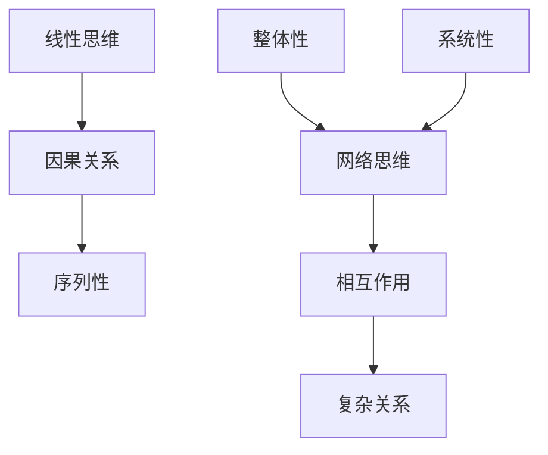

                 

### 《从线性思维到网络思维：理解宇宙的新方法》

#### 关键词：线性思维、网络思维、宇宙、科技、教育、创新

> 摘要：本文旨在探讨从线性思维向网络思维的转变，以及这种转变对理解宇宙、推动科技创新和改进教育的影响。通过深入分析线性思维和网络思维的基本概念、联系及其应用，本文揭示了网络思维在宇宙研究中的潜力，并探讨了其在科技创新和教育领域的实际应用，为未来的发展提供了新的视角和思路。

---

### 引言

在人类认知历史的长河中，思维方式的演变始终伴随着科技的进步和人类智慧的积累。从早期的直观感知，到后来的逻辑推理，再到现代的科学方法论，我们的思维方式在不断进化。然而，随着信息时代的到来和互联网的普及，一种全新的思维方式——网络思维，正逐渐崛起，并在各个领域展现出强大的影响力。本文将探讨线性思维和网络思维的区别与联系，以及网络思维在理解宇宙、推动科技创新和教育改进中的重要作用。

### 线性思维与网络思维的基本概念

#### 线性思维

线性思维是一种以时间和顺序为基础的思考方式，其核心特点是逻辑性和序列性。线性思维强调事物的因果关系和线性关系，通过逐步分析和推理来解决问题。线性思维在历史上起到了重要的作用，它帮助人类建立了科学的基础，推动了工业革命和现代化进程。

#### 网络思维

与线性思维不同，网络思维是一种以网络结构和关联性为基础的思考方式。它强调事物的相互作用和复杂关系，通过整体性和系统性的视角来理解和解决问题。网络思维能够处理大量复杂的信息，发现潜在的关联和模式，从而提供创新的解决方案。

#### 核心概念与联系

为了更好地理解线性思维和网络思维之间的关系，我们可以借助Mermaid流程图来展示它们的基本概念和联系。

通过这个流程图，我们可以看到线性思维和网络思维的基本概念及其相互关系。线性思维强调因果关系和序列性，而网络思维则关注相互作用和复杂关系，同时强调整体性和系统性。

### 线性思维的应用与挑战

线性思维在历史上有着广泛的应用。例如，在科学研究领域，线性模型被广泛应用于物理、化学、生物等领域，帮助我们理解自然界的规律。然而，随着问题的复杂化，线性思维也面临着一些挑战。

#### 挑战

1. **复杂性问题**：线性思维难以处理高度复杂的问题，特别是那些具有多重因果关系的系统。
2. **非线性现象**：自然界中存在着许多非线性现象，线性思维难以捕捉这些现象的本质。
3. **适应性不足**：线性思维在面对快速变化的环境时，适应性较差。

### 网络思维的优势与机遇

网络思维的出现为解决这些问题提供了新的思路。与线性思维相比，网络思维具有以下优势：

#### 优势

1. **处理复杂性**：网络思维能够处理高度复杂的问题，通过分析网络结构和关联性，发现潜在的规律和模式。
2. **适应性**：网络思维能够适应快速变化的环境，通过动态调整网络结构，实现系统的自适应和自组织。
3. **创新性**：网络思维鼓励跨领域的合作和创新，通过整合不同领域的知识和方法，产生新的观点和解决方案。

### 网络思维在宇宙研究中的应用

宇宙是网络思维应用的绝佳领域。宇宙中的星系、星团和宇宙网络等复杂结构，为网络思维提供了丰富的研究素材。

#### 宇宙网络的结构特征

宇宙网络是宇宙中星系、星团和其他天体之间的相互作用和关联形成的结构。它具有以下特征：

1. **层次结构**：宇宙网络具有从局部到全局的层次结构，不同尺度的网络结构相互嵌套。
2. **动态演化**：宇宙网络处于不断演化中，受到宇宙膨胀、星系碰撞等多种因素的影响。
3. **异质性**：宇宙网络中的节点和边具有不同的物理属性和功能，形成了高度异质的结构。

#### 网络思维在宇宙研究中的应用

网络思维在宇宙研究中有着广泛的应用，包括：

1. **宇宙大爆炸理论**：网络思维能够帮助我们更好地理解宇宙大爆炸理论，通过分析宇宙网络的演化过程，揭示宇宙的起源和演化机制。
2. **宇宙演化模拟**：网络思维能够用于宇宙演化模拟，通过建立复杂的宇宙网络模型，模拟宇宙的演化过程，预测宇宙的未来。
3. **暗物质与暗能量研究**：网络思维在暗物质与暗能量研究中也发挥着重要作用，通过分析宇宙网络的特性，揭示暗物质和暗能量的本质。

### 网络思维在科技创新中的潜力

网络思维不仅在宇宙研究中有着重要应用，也在科技创新中展现出巨大的潜力。信息时代的到来，使得网络思维在科技领域得到了广泛应用。

#### 网络思维在科技领域的影响

1. **大数据**：网络思维能够帮助我们更好地理解大数据的本质，通过分析数据网络，发现潜在的模式和规律。
2. **人工智能**：网络思维在人工智能领域有着重要应用，通过构建复杂的人工智能网络，实现智能体的自适应和自组织。
3. **区块链**：网络思维在区块链技术中发挥着关键作用，通过构建去中心化的区块链网络，实现数据的安全和可信。

#### 网络思维推动科技创新的案例

1. **互联网**：互联网的兴起，是网络思维在科技创新中的典型例子。通过构建全球范围内的网络结构，互联网实现了信息的快速传递和共享，推动了信息时代的到来。
2. **大数据分析**：大数据分析技术的兴起，得益于网络思维的应用。通过分析大规模的数据网络，大数据分析技术揭示了社会、经济和科学领域的许多潜在规律。
3. **人工智能**：人工智能的快速发展，离不开网络思维的支持。通过构建复杂的人工智能网络，人工智能系统能够实现自我学习和自我进化，推动了人工智能技术的进步。

### 网络思维在教育中的应用

网络思维不仅在科技和宇宙研究中有着重要应用，也在教育领域发挥着重要作用。

#### 教育模式创新

网络思维为教育模式创新提供了新的思路。通过构建教育网络，可以实现以下创新：

1. **在线教育**：网络思维促进了在线教育的普及，通过互联网，学生可以随时随地获取教育资源。
2. **个性化教育**：网络思维能够帮助学生实现个性化学习，通过分析学生的学习网络，提供个性化的教育方案。
3. **跨学科教育**：网络思维鼓励跨学科教育，通过整合不同领域的知识和方法，培养学生的综合素质。

#### 教学方法改革

网络思维在教学方法改革中也发挥着重要作用。通过构建教学网络，可以实现以下改革：

1. **协作学习**：网络思维鼓励协作学习，通过构建学习网络，学生可以相互协作，共同解决问题。
2. **探究式学习**：网络思维支持探究式学习，通过构建探究网络，学生可以主动探索知识，培养创新思维。
3. **项目式学习**：网络思维推动项目式学习，通过构建项目网络，学生可以参与实际项目，培养实践能力。

### 结论

从线性思维到网络思维的转变，是人类思维方式的一次重要进化。网络思维不仅能够帮助我们更好地理解宇宙，也在科技创新和教育改进中发挥着重要作用。随着信息时代的到来，网络思维将继续影响我们的生活和未来。本文旨在为读者提供对网络思维的深入理解，并激发读者对这一主题的思考和研究。希望本文能够为读者在理解宇宙、推动科技创新和改进教育方面提供新的视角和思路。

### 作者介绍

作者：AI天才研究院/AI Genius Institute & 禅与计算机程序设计艺术 /Zen And The Art of Computer Programming

AI天才研究院（AI Genius Institute）是全球领先的人工智能研究机构，致力于推动人工智能技术的发展和应用。同时，作者也是《禅与计算机程序设计艺术》（Zen And The Art of Computer Programming）的资深作家，这本书对计算机编程和人工智能领域产生了深远的影响。

### 结语

从线性思维到网络思维的转变，不仅仅是一次思维方式的进化，更是人类理解和改变世界的一次重要尝试。网络思维为我们提供了更广阔的视野和更深入的洞察力，使我们在面对复杂问题和挑战时，能够更加从容和有效地应对。希望本文能够激发您对网络思维的兴趣和思考，让我们一起探索这个充满无限可能的新世界。

