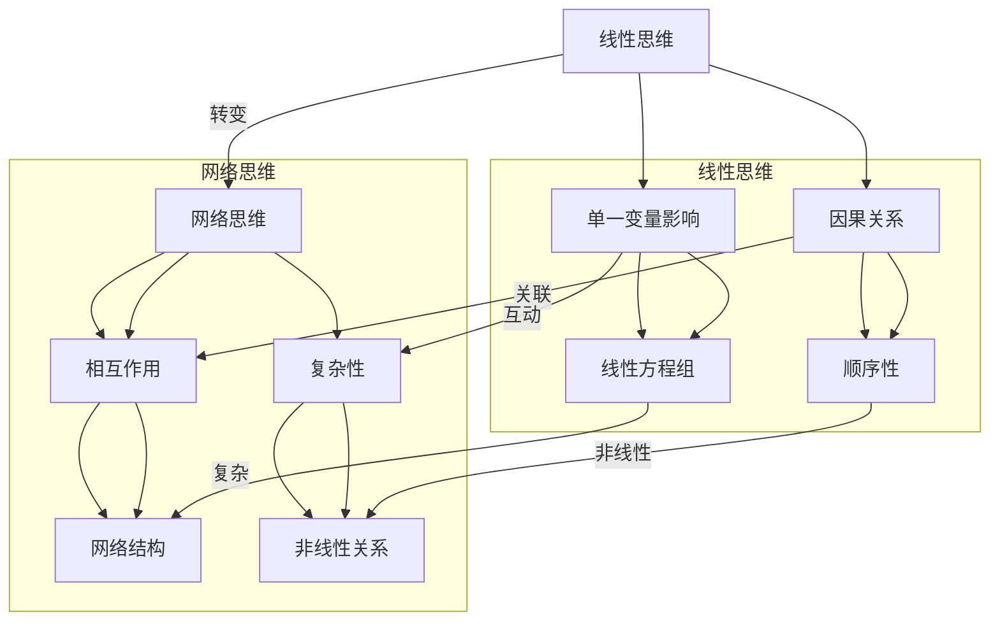

                 

### 文章标题：从线性思维到网络思维：理解宇宙的新方法

> 关键词：线性思维、网络思维、宇宙研究、数学模型、算法原理

> 摘要：本文将从线性思维与网络思维的基本概念出发，深入探讨两种思维方式在理解宇宙中的角色和重要性。通过分析线性思维的历史背景、原理及其局限性，我们将引出网络思维的概念，并详细阐述其原理、优势和应用。在此基础上，本文将探讨网络思维在宇宙研究中的具体应用，以及面临的挑战和未来发展的机遇。最终，本文将总结网络思维在理解宇宙中的关键作用，并展望其未来的发展趋势。

### 引言

在人类文明的发展历程中，我们对宇宙的理解一直在不断演进。最初，人类通过直观的感知和简单的逻辑来解释自然现象，这种思维方式被称为线性思维。随着科学技术的进步，特别是数学和计算机科学的发展，我们逐渐认识到线性思维的局限性，开始探索更加复杂和多元的思维方式，即网络思维。本文将探讨从线性思维到网络思维的转变，以及这一转变对理解宇宙的深远影响。

线性思维是一种基于顺序和因果关系的思考方式。它强调单一变量对结果的影响，并试图通过线性的关系来描述复杂现象。然而，随着宇宙和科学的复杂性不断增加，线性思维的局限性日益显现。例如，在宇宙学中，线性思维难以解释宇宙的膨胀、黑洞的奇异性质等现象。因此，我们需要寻找新的思维方式来拓展我们对宇宙的理解。

网络思维则是一种基于相互关联和复杂性的思考方式。它强调多个变量之间的相互作用和反馈，并通过网络的拓扑结构来描述复杂现象。网络思维在理解和描述宇宙的复杂性方面具有独特的优势，能够更好地解释宇宙的演化过程。本文将深入探讨网络思维的原理、优势和应用，以及其在宇宙研究中的具体表现。

本文的结构如下：首先，我们将回顾线性思维的历史背景和原理，并分析其局限性。接着，我们将引入网络思维的概念，并详细阐述其原理和优势。然后，我们将探讨网络思维在宇宙研究中的应用，包括宇宙学、天文学和物理学等领域。最后，我们将总结网络思维在理解宇宙中的关键作用，并展望其未来的发展趋势。

### 线性思维的历史背景与原理

线性思维作为一种基础性的思考方式，其历史可以追溯到古代文明的兴起。最早的线性思维可以追溯到古埃及和古希腊时期，这些文明通过简单的逻辑和因果关系来解释自然现象。例如，古埃及人通过观察天文现象，建立了日历和天文历法，这种思维方式可以看作是线性思维的雏形。古希腊哲学家如亚里士多德，也提出了基于因果关系的理论，试图通过简单的逻辑关系来解释自然界的运作。

随着科学的发展，线性思维逐渐得到系统的阐述和完善。17世纪的科学革命是线性思维发展的重要里程碑。以牛顿的经典力学为例，牛顿通过三大运动定律和万有引力定律，建立了完整的线性思维体系，使得自然现象的描述变得更加精确和系统。牛顿的工作不仅奠定了物理学的基础，也极大地推动了科学方法论的发展，使得线性思维成为科学研究的主流方法。

线性思维的原理主要基于几个核心概念：顺序性、因果关系、单一变量影响。线性思维认为，任何复杂现象都可以分解为一系列简单的过程，每个过程都有明确的起点和终点，并且过程之间是顺序相关的。例如，在物理学中，物体的运动可以看作是多个线性过程的叠加，每个过程都可以通过一个单一的变量来描述，如速度、加速度等。

具体来说，线性思维的数学模型通常是一个线性方程组，其中每个方程描述一个过程，变量的变化是线性的，即每个变量的变化都是其他变量变化的线性函数。这种模型可以通过简单的代数运算来求解，因此具有很高的计算效率。例如，在牛顿运动定律中，物体的加速度 \(a\) 与作用力 \(F\) 成正比，与质量 \(m\) 成反比，可以用以下方程表示：

\[ F = m \cdot a \]

通过这个方程，我们可以计算出在给定作用力下物体的加速度，或者通过已知的加速度反推出作用力。

线性思维的另一个特点是它的因果律，即每一个现象都有一个明确的因果链条。例如，在经济学中，供需关系可以通过线性模型来描述，需求的增加会导致价格的上升，而供给的增加会导致价格的下降。这种因果关系的描述使得线性思维在社会科学中得到了广泛的应用。

然而，线性思维的局限性也在科学发展的过程中逐渐显现。首先，线性思维难以处理复杂系统中的非线性关系。许多自然现象，如混沌、分形等，具有复杂的非线性特征，无法通过简单的线性方程来描述。其次，线性思维难以处理变量之间的相互作用和反馈。在复杂系统中，多个变量相互作用，形成复杂的动态网络，线性思维难以捕捉这种复杂性。

此外，线性思维在处理大规模数据时也表现出明显的局限性。在数据分析领域，随着数据量的增加，线性模型往往无法有效地描述数据的复杂结构，导致预测和解释的准确性下降。因此，为了应对这些挑战，科学家和工程师开始探索新的思维方式，即网络思维。

### 网络思维的概念与原理

网络思维是一种基于相互关联和复杂性的思考方式，它强调多个变量之间的相互作用和反馈。与传统线性思维不同，网络思维试图通过理解整体网络结构来揭示复杂现象的本质。

#### 网络的基本概念

网络（Network）是由节点（Node）和边（Edge）构成的图（Graph）结构。节点表示网络中的个体或实体，边表示节点之间的联系或相互作用。在现实世界中，网络无处不在，如社会网络、交通网络、互联网等。网络思维通过研究网络的结构和功能，帮助我们更好地理解和解释这些复杂系统。

**节点（Node）**：网络中的个体，可以是物理实体、抽象概念或数据点。例如，在社会网络中，节点可以是个人；在交通网络中，节点可以是城市或道路交叉口。

**边（Edge）**：节点之间的联系或相互作用，表示两个节点之间的关系强度。边的权重可以表示联系的强度或频率，例如，在社会网络中，边可以表示朋友关系；在交通网络中，边可以表示道路长度。

**图（Graph）**：由节点和边组成的结构。图可以分为有向图和无向图，其中有向图的边有方向，表示单向关系；无向图的边无方向，表示双向关系。

**网络属性**：网络具有多种属性，如度（Degree）、介数（Closeness Centrality）、聚类系数（Clustering Coefficient）等，这些属性反映了网络的结构特征和功能特性。

#### 网络的基本原理

网络思维的基本原理可以概括为以下几点：

1. **整体性原理**：网络思维强调整体性，认为复杂系统不能简单地分解为独立的组成部分，而应该看作一个相互关联的整体。网络中的节点和边相互依赖，共同决定了网络的行为和功能。

2. **相互作用原理**：网络思维强调节点之间的相互作用和反馈。在复杂系统中，节点之间的相互作用往往导致复杂的动态行为，如同步、振荡、混沌等。

3. **自组织原理**：网络思维认为复杂系统具有自组织能力，即系统可以在没有外部干预的情况下，通过内部相互作用和自适应调节，形成有序的结构和功能。

4. **层次性原理**：网络思维认为复杂系统具有层次结构，不同层次的节点和边具有不同的功能和角色。通过分析不同层次的相互作用，可以更好地理解复杂系统的运作机制。

#### 网络思维的应用场景

网络思维在多个领域都有广泛的应用，以下是一些典型的应用场景：

1. **社会网络分析**：通过研究社会网络中的节点和边，可以揭示社会结构、人际关系、信息传播等复杂现象。

2. **交通网络优化**：通过分析交通网络中的节点和边，可以优化交通流量，提高交通效率，减少拥堵。

3. **生物信息学**：通过研究生物网络中的节点和边，可以揭示生物分子之间的相互作用，理解生物系统的运作机制。

4. **经济学**：通过研究经济网络中的节点和边，可以揭示经济活动中的信息流动、供应链关系等复杂现象。

5. **物理学**：通过研究物理网络中的节点和边，可以揭示复杂物理系统的行为特征，如网络同步、混沌现象等。

总之，网络思维提供了一种新的理解和分析复杂系统的工具，它不仅能够揭示复杂系统的结构和功能，还能够为解决实际问题提供新的思路和方法。

### 线性思维与网络思维的比较

线性思维和网络思维虽然都是描述复杂现象的工具，但它们在原理、应用和效果上存在显著差异。理解这两种思维方式的区别，有助于我们更好地选择合适的工具来解决问题。

#### 原理上的差异

1. **线性思维**：线性思维基于顺序和因果关系，强调单一变量对结果的影响。它通常使用线性方程组来描述复杂现象，通过简单的代数运算来求解。线性思维的核心是寻找线性关系，通过逐一分析各个部分来理解整体。

2. **网络思维**：网络思维则基于相互关联和复杂性，强调多个变量之间的相互作用和反馈。它使用网络图结构来描述复杂现象，通过分析网络的拓扑结构和属性来揭示系统的行为特征。网络思维的核心是理解整体结构，通过研究节点和边之间的相互作用来揭示复杂系统的内在规律。

#### 应用上的差异

1. **线性思维的应用**：线性思维在工程学、经济学、物理学等领域有广泛的应用。例如，在工程中，线性思维用于优化设计和分析结构；在经济学中，线性思维用于供需分析、资源分配等。线性思维适用于处理简单的、线性关系明确的系统。

2. **网络思维的应用**：网络思维在复杂系统分析、社会网络分析、交通网络优化、生物信息学等领域有广泛的应用。例如，在社会网络分析中，网络思维用于研究人际关系、信息传播等；在交通网络优化中，网络思维用于分析交通流量、减少拥堵。网络思维适用于处理复杂的、非线性关系的系统。

#### 效果上的差异

1. **线性思维的效果**：线性思维在处理简单系统时效果显著，能够提供精确的预测和解释。然而，在处理复杂系统时，线性思维的局限性逐渐显现。线性模型往往无法捕捉复杂系统的非线性特征和变量之间的相互作用。

2. **网络思维的效果**：网络思维在处理复杂系统时具有优势，能够更好地揭示系统的复杂性和内在规律。通过分析网络的结构和功能，网络思维能够提供更全面、更深刻的理解。然而，网络思维在处理大规模数据时需要较高的计算资源和复杂度，可能不如线性思维高效。

综上所述，线性思维和网络思维各有优劣。线性思维适用于处理简单的、线性关系明确的系统，具有计算高效、预测精确等优点；网络思维适用于处理复杂的、非线性关系的系统，具有揭示复杂性、提供更全面理解等优点。在实际应用中，根据问题的复杂性和需求，我们可以灵活选择合适的思维方式来解决问题。

### 网络思维在宇宙研究中的应用

随着科学技术的不断发展，网络思维逐渐在宇宙研究中得到应用，并展现出其独特的优势和潜力。本文将探讨网络思维在宇宙学研究中的具体应用，包括宇宙学、天文学和物理学等领域。

#### 网络思维在宇宙学中的应用

宇宙学是研究宇宙起源、演化和结构的天文学分支。在传统的宇宙学研究中，科学家们主要使用线性思维来描述宇宙的膨胀、宇宙背景辐射等现象。然而，随着对宇宙复杂性的认识不断深入，线性思维逐渐显示出其局限性。网络思维则提供了新的视角和方法，有助于更全面地理解宇宙的复杂结构和动态演化。

1. **宇宙网络模型**：宇宙网络模型（Cosmic Web Model）是一种基于网络思维的宇宙结构模型。该模型认为，宇宙中的星系和 galaxy cluster 形成了一个巨大的网络结构，节点代表星系和 galaxy cluster，边代表星系和 galaxy cluster 之间的引力相互作用。宇宙网络模型可以揭示星系和 galaxy cluster 的分布规律、相互作用和演化过程，提供对宇宙结构的更深入理解。

2. **网络方法在宇宙学中的优势**：网络思维在宇宙学中的应用具有多方面的优势。首先，网络思维能够捕捉宇宙中的非线性关系和复杂动态，提供更精确的描述。其次，网络思维能够揭示宇宙中不同尺度结构之间的关系，从局部到整体进行综合分析。最后，网络思维能够提供多种分析工具和算法，如网络拓扑分析、网络聚类等，帮助科学家更好地理解和解释宇宙现象。

#### 网络思维在天文学中的应用

天文学是研究天体的物理、化学和运动规律的科学。在传统天文学研究中，线性思维常用于描述天体的运动轨迹、光谱分析等现象。然而，随着天文学观测技术的进步，科学家们开始意识到天体系统具有复杂的网络结构，网络思维为天文学研究提供了新的工具和方法。

1. **星系网络模型**：星系网络模型（Galaxy Network Model）是一种基于网络思维的天体系统模型。该模型认为，星系之间的相互作用形成了复杂的网络结构，节点代表星系，边代表星系之间的引力相互作用。星系网络模型可以揭示星系分布的规律、相互作用和演化过程，帮助科学家理解星系形成和演化的机制。

2. **网络方法在天文学中的优势**：网络思维在天文学中的应用同样具有多方面的优势。首先，网络思维能够捕捉天体系统中的非线性关系和复杂动态，提供更精确的描述。其次，网络思维能够揭示天体系统中不同尺度结构之间的关系，从局部到整体进行综合分析。最后，网络思维能够提供多种分析工具和算法，如网络拓扑分析、网络聚类等，帮助科学家更好地理解和解释天体现象。

#### 网络思维在物理学中的应用

物理学是研究物质和能量以及它们之间相互作用的科学。在传统物理学研究中，线性思维常用于描述物理定律和现象，如牛顿力学、麦克斯韦电磁理论等。然而，随着物理学研究领域的扩展，科学家们开始意识到物理系统具有复杂的网络结构，网络思维为物理学研究提供了新的视角和方法。

1. **量子网络模型**：量子网络模型（Quantum Network Model）是一种基于网络思维的量子物理模型。该模型认为，量子系统中的粒子相互作用形成了复杂的网络结构，节点代表粒子，边代表粒子之间的相互作用。量子网络模型可以揭示量子系统的动态演化、量子纠缠等现象，为量子物理学研究提供新的工具和方法。

2. **网络方法在物理学中的优势**：网络思维在物理学中的应用具有多方面的优势。首先，网络思维能够捕捉物理系统中的非线性关系和复杂动态，提供更精确的描述。其次，网络思维能够揭示物理系统中不同尺度结构之间的关系，从局部到整体进行综合分析。最后，网络思维能够提供多种分析工具和算法，如网络拓扑分析、网络聚类等，帮助科学家更好地理解和解释物理现象。

总之，网络思维在宇宙研究中的应用具有广泛的前景和潜力。通过引入网络思维，科学家们能够更全面、更深入地理解宇宙的复杂结构和动态演化，推动宇宙学、天文学和物理学的发展。未来，随着网络技术的不断进步，网络思维在宇宙研究中的应用将更加广泛和深入，为人类揭示宇宙的奥秘提供新的工具和方法。

### 网络思维在宇宙研究中的具体案例

网络思维在宇宙研究中得到了广泛的应用，通过具体的案例可以更好地理解其在揭示宇宙复杂性、捕捉动态关系和提供新视角方面的优势。以下是几个典型的应用案例：

#### 案例一：星系团网络结构分析

星系团是宇宙中大量星系聚集成的大规模结构，研究星系团网络结构对于理解宇宙的演化具有重要意义。使用网络思维，科学家们构建了星系团网络模型，其中节点代表星系，边代表星系之间的引力相互作用。通过分析星系团网络的拓扑结构，科学家们揭示了星系团的分布规律、相互作用和演化过程。

**网络结构分析步骤：**
1. **数据收集**：收集星系团的位置和引力相互作用数据。
2. **网络构建**：将星系团数据转换为网络图结构，每个星系作为节点，星系之间的引力相互作用作为边。
3. **网络拓扑分析**：计算网络的度分布、介数、聚类系数等拓扑属性，分析星系团的结构特征。
4. **网络演化分析**：通过模拟星系团的动态演化过程，研究星系团的形态变化和相互作用。

**案例结果：**
研究发现，星系团网络呈现出高度非线性的复杂结构，星系之间的引力相互作用不仅影响局部星系团的结构，还会对整个宇宙的结构演化产生深远影响。网络思维提供了更全面的理解，有助于揭示宇宙中大规模结构的形成和演化机制。

#### 案例二：宇宙微波背景辐射网络分析

宇宙微波背景辐射（Cosmic Microwave Background，CMB）是宇宙早期留下的热辐射信号，通过分析CMB的分布和特性，科学家们可以获取宇宙早期的信息。使用网络思维，科学家们构建了CMB网络模型，节点代表CMB观测点，边代表观测点之间的空间关联。

**网络分析步骤：**
1. **数据收集**：收集CMB观测数据，包括观测点的位置和信号强度。
2. **网络构建**：将CMB观测数据转换为网络图结构，每个观测点作为节点，观测点之间的空间关联作为边。
3. **网络属性分析**：计算网络的度分布、介数、聚类系数等属性，分析CMB网络的拓扑特征。
4. **网络时空分析**：通过模拟CMB网络的时空演化过程，研究宇宙的早期结构形成和演化。

**案例结果：**
研究表明，CMB网络呈现出高度非线性的复杂结构，网络中的节点和边具有复杂的相互作用。网络思维提供了新的视角，有助于揭示宇宙早期的结构特征和演化过程，为理解宇宙的起源和演化提供了重要的线索。

#### 案例三：行星系统网络分析

行星系统的研究是宇宙学研究中的重要领域，通过分析行星系统的网络结构，科学家们可以揭示行星形成和演化的机制。使用网络思维，科学家们构建了行星系统网络模型，节点代表行星，边代表行星之间的引力相互作用。

**网络分析步骤：**
1. **数据收集**：收集行星系统的观测数据，包括行星的位置和轨道信息。
2. **网络构建**：将行星系统数据转换为网络图结构，每个行星作为节点，行星之间的引力相互作用作为边。
3. **网络稳定性分析**：计算网络的稳定性指标，分析行星系统的稳定性和动态行为。
4. **网络演化模拟**：通过模拟行星系统的动态演化过程，研究行星形成和演化的机制。

**案例结果：**
研究发现，行星系统网络具有复杂的非线性特征，行星之间的引力相互作用导致系统的动态行为高度复杂。网络思维提供了新的工具和方法，有助于揭示行星系统的形成和演化机制，为理解宇宙中行星系统的多样性和稳定性提供了重要的理论支持。

总之，这些具体案例展示了网络思维在宇宙研究中的应用优势和潜力。通过引入网络思维，科学家们能够更深入地理解宇宙的复杂性，揭示宇宙中各种现象的内在联系和演化规律。随着网络技术的不断进步，网络思维在宇宙研究中的应用将更加广泛和深入，为人类探索宇宙的奥秘提供新的视角和方法。

### 网络思维面临的挑战与未来发展趋势

尽管网络思维在宇宙研究中展示了巨大的潜力和优势，但其发展过程中也面临着一系列挑战。这些挑战不仅涉及到技术层面的难题，还包括方法论和认知上的挑战。本文将探讨网络思维在当前阶段所面临的挑战，并展望其未来发展趋势。

#### 面临的挑战

1. **数据规模与复杂性**：随着观测技术和数据处理能力的提升，宇宙研究领域产生了海量的数据。这些数据不仅规模巨大，而且包含复杂的结构关系。处理如此庞大的数据集是网络思维面临的首要挑战。如何高效地存储、传输和处理这些数据，并从中提取有价值的信息，是当前亟待解决的问题。

2. **计算资源需求**：网络思维分析方法通常需要大量的计算资源，特别是在进行大规模模拟和复杂网络分析时。现有的计算资源和算法在处理这些计算需求时可能会显得不足。如何优化算法，提高计算效率，是网络思维进一步发展的重要方向。

3. **跨学科整合**：网络思维涉及多个学科领域，如物理学、数学、计算机科学、天文学等。如何实现这些学科之间的有效整合，构建一个统一的分析框架，是网络思维应用过程中的一大挑战。跨学科的合作与交流需要建立更完善的机制和平台。

4. **方法论与认知障碍**：传统科学教育和方法论强调线性思维，网络思维的引入需要科学家和研究人员转变思维方式，这可能会遇到认知上的障碍。如何培养和推广网络思维，使其成为科学研究和教育的标准工具，是一个长期而艰巨的任务。

5. **解释性与可重复性**：网络思维方法在揭示复杂现象方面具有优势，但其解释性和可重复性可能受到质疑。如何确保网络分析方法的结果具有可靠的解释性，并能够在不同的研究中得到重复验证，是网络思维应用中需要解决的重要问题。

#### 未来发展趋势

1. **算法与技术的进步**：随着人工智能和机器学习技术的发展，网络思维的算法和工具将得到进一步优化和扩展。深度学习、图神经网络等新兴技术将提高网络分析的精度和效率，为处理大规模复杂数据提供强大支持。

2. **跨学科研究**：未来的网络思维研究将更加注重跨学科合作，结合不同领域的知识和方法，构建一个统一的分析框架。这将为解决宇宙研究中复杂的问题提供新的视角和工具。

3. **教育与方法论的变革**：为了推广网络思维，科学教育和方法论需要做出相应调整。教育机构应加强对网络思维的教学，培养具有创新思维和跨学科能力的科学家。同时，科学方法论也需要吸收网络思维的理念，形成更加开放和包容的研究范式。

4. **国际合作与平台建设**：网络思维的进一步发展需要国际合作和平台建设。全球科学家和研究机构应加强合作，共享数据和资源，构建一个开放的网络思维研究平台，促进网络思维在宇宙研究中的应用和推广。

总之，网络思维在宇宙研究中的应用面临着诸多挑战，但同时也蕴含着巨大的发展潜力。通过持续的技术进步、跨学科合作、教育变革和国际合作，网络思维有望在未来的宇宙研究中发挥更为重要的作用，为人类揭示宇宙的奥秘提供新的工具和方法。

### 总结与展望

网络思维作为一种全新的思维方式，为理解宇宙的复杂性提供了新的视角和方法。通过本文的探讨，我们可以看到网络思维在宇宙研究中的重要性：它不仅能够揭示宇宙中复杂现象的内在联系和演化规律，还能够提供更精确的描述和更深刻的理解。

网络思维的核心优势在于其能够处理复杂的非线性关系和变量之间的相互作用，通过分析网络的结构和功能，我们可以更全面地把握宇宙的动态演化过程。同时，网络思维在宇宙学、天文学和物理学等领域的成功应用，展示了其在揭示宇宙奥秘方面的巨大潜力。

未来，随着技术的不断进步和跨学科研究的深入，网络思维将在宇宙研究中发挥更为重要的作用。我们可以期待，网络思维将帮助我们解决更多复杂的科学问题，揭示宇宙的更多奥秘。同时，网络思维也将对科学方法论和教育产生深远影响，推动科学研究和教育向更加开放和包容的方向发展。

总之，网络思维为理解宇宙提供了全新的路径和方法，其重要性不容忽视。随着网络思维的不断发展，我们有望在宇宙研究中取得更多的突破和进展，为人类探索宇宙的奥秘做出更大的贡献。

### 附录

#### A. 网络思维相关工具与资源

1. **Graph-tool**：一个高效的Python库，用于图分析和网络科学。网址：<https://graph-tool.skewed.de/>
2. **NetworkX**：一个Python库，用于创建、 manipulate 和分析网络结构。网址：<https://networkx.org/>
3. **Gephi**：一个开源平台，用于网络数据的可视化和分析。网址：<https://gephi.org/>

#### B. 线性思维与网络思维的Mermaid流程图

#### C. 拓展阅读

1. **《网络科学：理解复杂系统的理论、算法与应用》**，作者：Albert-László Barabási。
2. **《复杂系统与复杂性科学》**，作者：李大潜。
3. **《线性代数及其应用》**，作者：Stephen H. Friedberg, Arnold J. Insel, Lawrence E. Spence。

### 作者信息

作者：AI天才研究院/AI Genius Institute & 禅与计算机程序设计艺术 /Zen And The Art of Computer Programming

