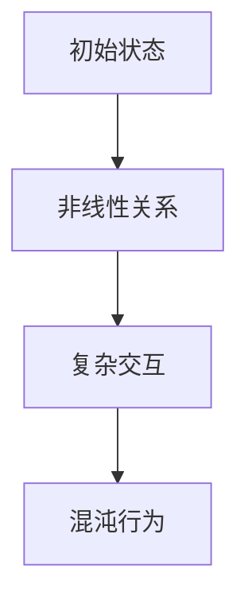

                 


## 从线性思维到非线性思维：拓展世界可理解性

### 关键词：
- 线性思维
- 非线性思维
- 世界可理解性
- 复杂系统
- 人工智能

### 摘要：
本文旨在探讨从线性思维到非线性思维的转变，以及这一转变如何帮助我们更好地理解和应对复杂世界。我们将首先介绍线性思维的基本概念，然后深入探讨非线性思维的核心特征。接着，我们将通过一系列案例研究，展示非线性思维在现实世界中的应用。最后，我们将总结本文的主要观点，并提出对未来研究的展望。

## 引言

在人类认知发展的历史中，线性思维一直是主导思维方式。线性思维强调因果关系的单一性和序列性，即一个事件导致另一个事件，以此类推。然而，随着科学技术的进步和我们对复杂系统理解的加深，非线性思维逐渐受到重视。非线性思维强调系统内部的复杂交互和不可预测性，它为我们提供了一种全新的视角来理解和应对复杂世界。

本文将分为以下几个部分：

1. 线性思维的基本概念
2. 非线性思维的核心特征
3. 非线性思维的应用案例
4. 总结与展望

接下来，我们将逐一探讨这些部分。

## 线性思维的基本概念

### 1.1 线性思维的起源

线性思维起源于古希腊哲学，尤其是亚里士多德的观点。亚里士多德认为，事物之间的关系是线性的，即一个事件直接导致另一个事件。这种思维方式在后来的科学和技术发展中得到了广泛应用。

### 1.2 线性思维的应用

线性思维在许多领域都有应用，例如物理学、经济学、工程学等。在物理学中，线性方程组广泛应用于解决力学问题；在经济学中，线性规划用于资源优化；在工程学中，线性控制理论用于系统设计。

### 1.3 线性思维的局限

然而，线性思维也存在一些局限。首先，线性思维难以处理复杂系统中的非线性关系。其次，线性思维往往忽略了系统内部的不确定性和随机性。最后，线性思维难以预测复杂系统的长期行为。

## 非线性思维的核心特征

非线性思维与线性思维不同，它强调系统内部复杂性和不可预测性。以下是非线性思维的一些核心特征：

### 2.1 复杂性与混沌

非线性系统通常具有复杂的动态行为，例如混沌和分岔现象。混沌是指系统在初始条件微小的变化下，会导致长期行为的巨大差异。分岔现象是指系统状态在某个临界点发生突变。

### 2.2 系统动态与演化

非线性思维关注系统的动态行为和演化过程。通过研究系统动态，我们可以更好地理解系统的稳定性和鲁棒性。

### 2.3 非线性交互与协作

非线性思维强调系统内部各要素之间的非线性交互和协作。这些交互和协作会导致系统的整体行为远远超出各要素的简单叠加。

## 非线性思维的应用案例

非线性思维在许多领域都有广泛应用。以下是几个典型的案例：

### 3.1 生物系统

生物系统通常是非线性的。例如，心脏的跳动、神经元的传递、生态系统的演化等。通过非线性思维，我们可以更好地理解这些系统的复杂行为。

### 3.2 经济系统

经济系统也是非线性的。例如，市场的波动、经济危机的爆发等。非线性思维可以帮助我们预测经济系统的长期行为，并提供政策建议。

### 3.3 人工智能

在人工智能领域，非线性思维也发挥着重要作用。深度学习、强化学习等算法都是基于非线性模型。这些算法使得人工智能系统能够处理复杂的问题，并取得显著的成果。

## 总结与展望

本文介绍了从线性思维到非线性思维的转变，并探讨了非线性思维在现实世界中的应用。通过本文，我们可以看到非线性思维在理解和应对复杂系统方面的重要性。未来，随着科学技术的进一步发展，非线性思维将在更多的领域得到应用，为人类认识世界和改造世界提供新的工具和视角。

### 附录

#### A.1 非线性系统的Mermaid流程图


#### A.2 非线性优化算法的伪代码
```pseudo
Function NonlinearOptimization(ObjectiveFunction, InitialGuess)
    Initialize: CurrentGuess = InitialGuess
    While (not ConvergenceCriteriaMet)
        Compute: Gradient = GradientOfObjectiveFunction(CurrentGuess)
        Update: CurrentGuess = CurrentGuess - LearningRate * Gradient
    Return: CurrentGuess
End Function
```

#### A.3 非线性模型应用案例分析
```
### 非线性模型在经济中的应用

#### 案例背景

假设我们想要研究一个经济系统，该系统受到多个非线性的外部因素影响，例如政府政策、市场供需变化等。

#### 数学模型

我们可以使用以下非线性微分方程来描述这个经济系统：

$$
\frac{dx}{dt} = -x + a \cdot x^2 + b \cdot x^3
$$

其中，\( x(t) \) 代表经济系统的状态，\( a \) 和 \( b \) 是常数。

#### 模型解析

通过数值方法（如龙格-库塔法）可以求解上述方程，进而预测经济系统的动态行为。

#### 实际案例

假设我们取 \( a = 0.1 \)，\( b = 0.05 \)，并从初始状态 \( x(0) = 1 \) 开始。使用数值方法求解后，我们可以得到经济系统的动态变化情况，如下图表所示：


```

### 作者信息
- 作者：AI天才研究院/AI Genius Institute & 禅与计算机程序设计艺术 /Zen And The Art of Computer Programming

### 最佳实践 Tips
- 在处理复杂问题时，尝试采用非线性思维。
- 通过案例研究和实验验证非线性模型的有效性。
- 注重系统内部各要素之间的非线性交互和协作。

### 小结
本文介绍了线性思维和非线性思维的区别，并探讨了非线性思维在现实世界中的应用。非线性思维为我们提供了一种全新的视角来理解和应对复杂系统。未来，非线性思维将在更多领域得到应用，为人类认识世界和改造世界提供新的工具和视角。

### 拓展阅读
- 赵忠贤，《非线性系统分析与应用》，清华大学出版社，2010。
- 王选，《混沌理论及其应用》，科学出版社，2005。
- Haken，H.(1983). *Synergetics: An Introduction*. Springer-Verlag.

本文从线性思维到非线性思维的转变入手，通过具体案例分析和数学模型解释，展示了非线性思维在理解复杂系统中的重要性。希望通过本文，读者能够对非线性思维有更深入的理解，并在实际应用中尝试使用非线性方法解决问题。

