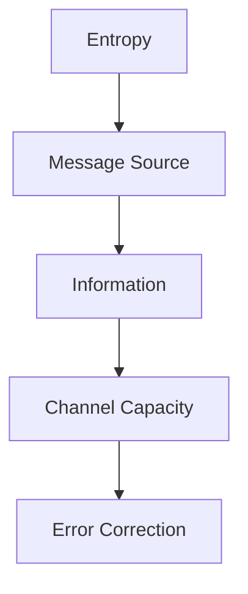
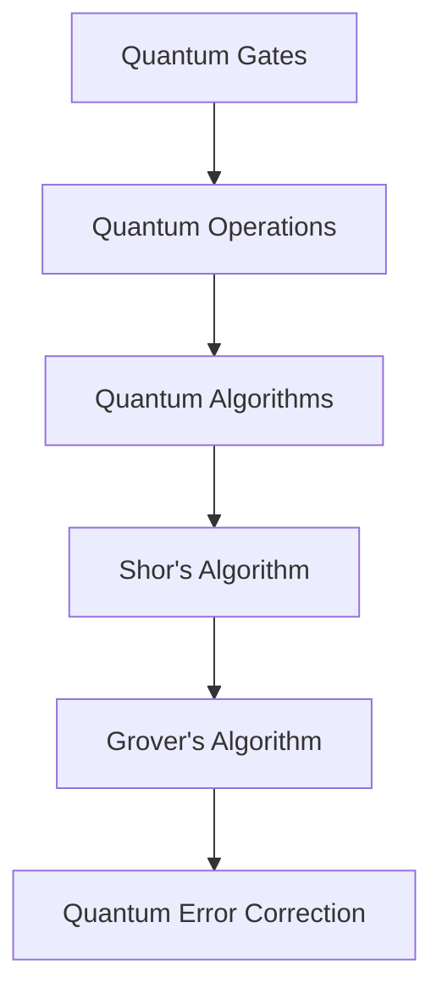
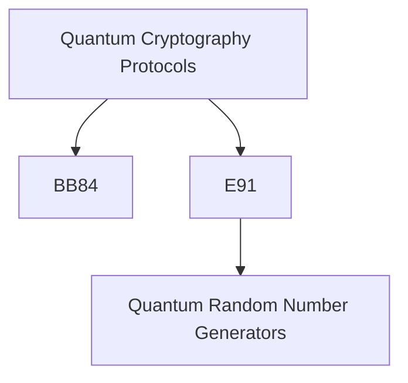
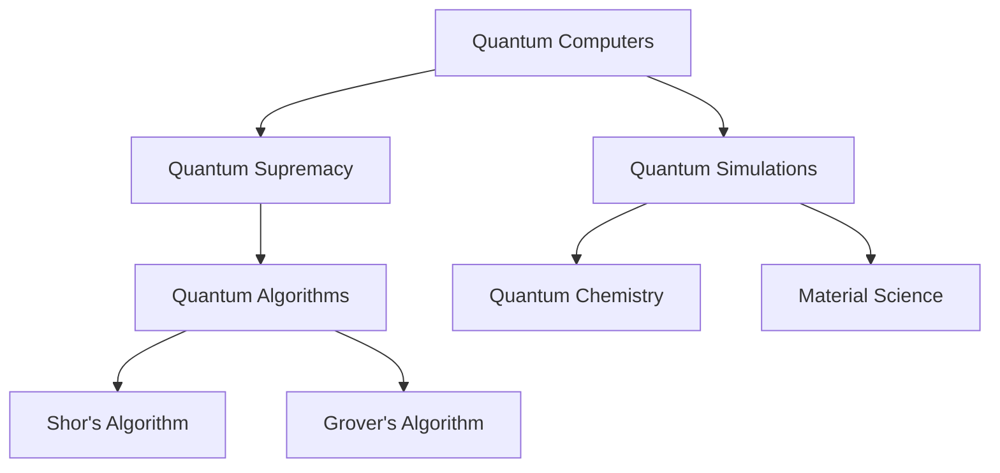

                 

### Article Title: From Classical Information Theory to Quantum Information Theory: Understanding the Information Age

#### Keywords:
- Information Theory
- Quantum Information Theory
- Information Age
- Entropy
- Qubits
- Quantum Computing
- Quantum Cryptography

#### Abstract:
This article explores the evolution of information theory from its classical roots to the revolutionary advancements in quantum information theory. We will delve into the foundational concepts, core principles, and groundbreaking applications of both fields. By understanding the transition from classical to quantum information, readers will gain insights into the transformative potential of quantum computing and its implications for the future of technology.

### Introduction

#### Historical Background
Information theory, as a field of study, was born in the mid-20th century with the pioneering work of Claude Shannon. Shannon's groundbreaking paper, "A Mathematical Theory of Communication," published in 1948, laid the foundation for our understanding of how information is transmitted, processed, and stored. This work introduced key concepts such as entropy, which measures the uncertainty of a message, and the capacity of a communication channel, which determines the maximum rate at which information can be reliably transmitted.

#### Fundamental Concepts
Shannon's theory introduced several fundamental concepts that are still widely used today:

1. **Entropy**: A measure of the uncertainty or randomness in a message source.
2. **Information**: The reduction in uncertainty that occurs when a message is received.
3. **Channel Capacity**: The maximum rate at which information can be transmitted over a noisy channel without error.

#### Applications
Information theory has found applications in various fields, including telecommunications, data compression, and cryptography. For example, the development of error-correcting codes, such as the Reed-Solomon code, has greatly improved the reliability of digital communication systems.

### Classical Information Theory

#### Entropy and Information Transmission
Entropy is a core concept in information theory. It measures the unpredictability or randomness of a source of information. In classical information theory, entropy is used to quantify the amount of information carried by a message. The entropy of a message source is given by the formula:

$$ H(X) = -\sum_{i=1}^{n} p(x_i) \log_2 p(x_i) $$

where \( p(x_i) \) is the probability of the \( i \)-th possible message.

The capacity of a communication channel, \( C \), is the maximum rate at which information can be transmitted over the channel without error. It is given by the formula:

$$ C = B \log_2 (1 + \frac{S}{N}) $$

where \( B \) is the bandwidth of the channel, \( S \) is the signal power, and \( N \) is the noise power.

#### Error Correction
One of the key challenges in communication is the presence of noise, which can corrupt the transmitted message. Error-correcting codes are used to detect and correct errors in the received message. The simplest form of error-correcting code is the parity bit, which adds an extra bit to a message to detect if an odd number of bits have been flipped during transmission. More sophisticated codes, such as the Reed-Solomon code, can correct multiple errors.

#### Mermaid Flowchart: Entropy and Information Transmission

### Quantum Information Theory

#### Introduction to Quantum Mechanics
Quantum mechanics is a fundamental theory in physics that describes the physical properties of nature at the scale of atoms and subatomic particles. It introduces concepts such as wave-particle duality, superposition, and entanglement.

1. **Wave-Particle Duality**: Matter can behave both as a particle and as a wave.
2. **Superposition**: A quantum system can exist in multiple states simultaneously.
3. **Entanglement**: Two or more particles can become linked in such a way that the state of one particle instantly influences the state of the other, regardless of the distance between them.

#### Quantum Bits (Qubits)
In classical information theory, a bit is the basic unit of information, representing a choice between two possible states, 0 or 1. In quantum information theory, the basic unit of information is the qubit, which can represent both 0 and 1 simultaneously due to superposition.

1. **Superposition**: A qubit can be in a superposition of states, represented as \( \alpha|0\rangle + \beta|1\rangle \), where \( |\alpha|^2 \) and \( |\beta|^2 \) are the probabilities of measuring 0 and 1, respectively.
2. **Entanglement**: Two or more qubits can become entangled, creating a correlated state that cannot be described independently of the other qubits.

#### Quantum Information Processing
Quantum information processing leverages the principles of quantum mechanics to perform computation and communication tasks more efficiently than classical methods. Key concepts include:

1. **Quantum Gates**: Analogous to classical logic gates, quantum gates operate on qubits and perform basic quantum operations.
2. **Quantum Algorithms**: Algorithms that take advantage of quantum properties to solve problems more efficiently than classical algorithms. Examples include Shor's algorithm for factoring large numbers and Grover's algorithm for searching unsorted databases.
3. **Quantum Error Correction**: Methods to detect and correct errors in quantum information.

#### Mermaid Flowchart: Quantum Information Processing

### Quantum Cryptography

#### Quantum Key Distribution (QKD)
Quantum key distribution is a method of securely distributing encryption keys between two parties using quantum mechanics. The key idea is that any attempt to intercept or measure the quantum states of the qubits being used for communication will inevitably disturb the system and alert the parties to the presence of an eavesdropper.

#### Quantum Cryptography Algorithms
Quantum cryptography includes several algorithms that leverage quantum properties to ensure the security of communication. Some notable examples include:

1. **Quantum Cryptography Protocols**: Quantum protocols such as BB84 and E91, which use quantum entanglement to establish a secure communication channel.
2. **Quantum Random Number Generators**: Devices that generate truly random numbers using quantum processes, which are valuable for cryptographic applications.

#### Mermaid Flowchart: Quantum Cryptography Algorithms

### Quantum Computing and Quantum Simulation

#### Quantum Computers
Quantum computers are devices that use quantum bits (qubits) to perform computation. Unlike classical computers, which use bits to represent information as 0s or 1s, quantum computers can represent information in both 0 and 1 states simultaneously due to superposition. This allows quantum computers to perform certain types of calculations much more efficiently than classical computers.

1. **Quantum Supremacy**: The achievement of a quantum computer performing a task that is beyond the capabilities of any existing classical computer.
2. **Quantum Algorithms**: Algorithms specifically designed for quantum computers, such as Shor's algorithm and Grover's algorithm.

#### Quantum Simulations
Quantum simulations involve using quantum computers to simulate quantum systems and processes. This can be useful for studying complex quantum phenomena and designing new materials and drugs.

1. **Quantum Chemistry**: Simulating the behavior of molecules and atoms at the quantum level.
2. **Material Science**: Designing new materials with specific properties using quantum simulations.

#### Mermaid Flowchart: Quantum Computing and Quantum Simulation

### Future Directions and Challenges in Quantum Information

#### Ethical and Societal Implications
The advent of quantum information technologies raises important ethical and societal questions. These include issues related to data privacy, security, and the potential for quantum computers to crack existing cryptographic systems.

#### Technical Challenges
Quantum information technologies face several technical challenges, including:

1. **Qubit Stability**: Maintaining the coherence of qubits over long periods of time to prevent decoherence and errors.
2. **Error Correction**: Developing robust error correction codes to mitigate the effects of noise and errors in quantum systems.
3. **Scalability**: Building scalable quantum computers with a large number of qubits to enable practical applications.

#### Societal Challenges
The rapid development of quantum information technologies also poses societal challenges, including:

1. **Economic Impact**: The potential for quantum technologies to disrupt existing industries and create new economic opportunities.
2. **Job Displacement**: The possibility of quantum computers replacing certain jobs and the need for a skilled workforce to develop and maintain these technologies.
3. **Security and Surveillance**: The implications of quantum computers breaking existing encryption systems and the need for new cryptographic methods.

### Conclusion

The transition from classical information theory to quantum information theory represents a significant milestone in the evolution of information technology. By understanding the fundamental principles of both fields, we can appreciate the transformative potential of quantum information and its impact on the future of technology. As we continue to advance in this field, we will face both opportunities and challenges that will shape the way we live, work, and communicate in the information age.

