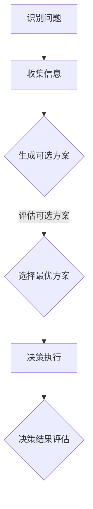
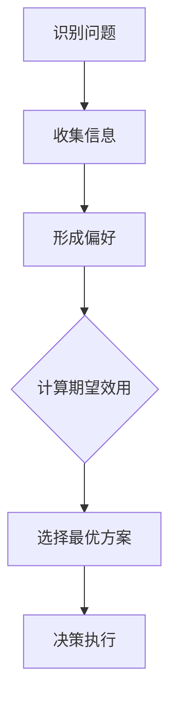
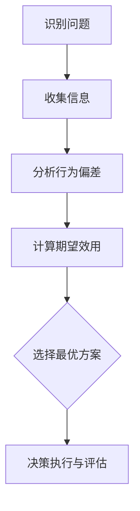
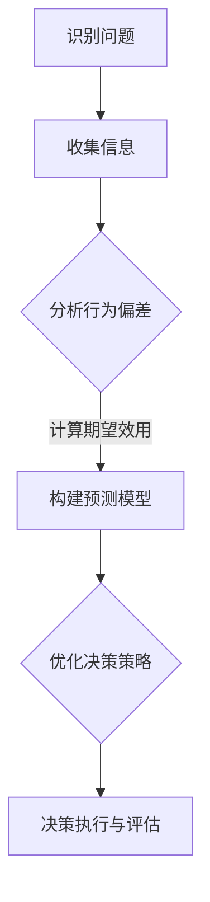

                 

### 文章标题

“从经典决策理论到行为经济学：理解人类决策与世界”

### 关键词

决策理论、行为经济学、期望效用理论、前景理论、锚定效应、损失厌恶

### 摘要

本文深入探讨了经典决策理论与行为经济学的关系，通过详细分析两者之间的核心概念与联系，以及关键算法和数学模型，旨在揭示人类决策背后的心理机制。文章不仅介绍了决策理论的起源与发展，还探讨了行为经济学的兴起及其关键概念。通过融合决策理论与行为经济学，本文提供了实践中的应用案例，展示了如何在实际项目中运用这些理论。文章最后总结了决策理论与行为经济学在理解和优化人类决策中的重要性，并为未来的研究提供了方向。

---

## 第一部分：决策理论的基石

### 第1章：决策理论的起源与发展

### 1.1 决策理论的定义与背景

#### 1.1.1 决策理论的基本概念

决策理论是研究个体或集体在面对不确定性和有限信息时如何作出决策的一门学科。它起源于20世纪40年代，随着第二次世界大战期间运筹学的发展而逐渐形成。决策理论的核心目标是通过数学模型和分析工具来理解和预测决策过程，从而为实际应用提供指导。

#### 1.1.2 决策理论的历史发展

决策理论的发展可以大致分为三个阶段。第一阶段是经典决策理论阶段，主要关注确定性和风险环境下的最优决策。第二阶段是行为决策理论阶段，强调个体在决策过程中受心理和社会因素的影响。第三阶段是现代决策理论阶段，将认知心理学、经济学和计算机科学等多学科的理论结合起来，形成了一个更为综合和复杂的决策框架。

#### 1.1.3 决策理论的应用领域

决策理论广泛应用于各个领域，包括商业管理、公共政策、工程学、医学决策等。在商业管理中，决策理论用于帮助企业进行市场分析、资源分配和风险管理。在公共政策中，决策理论用于评估政策的效果和制定最优政策。在工程学中，决策理论用于优化项目规划和资源利用。在医学决策中，决策理论用于制定治疗方案和风险评估。

### 1.2 经典决策理论的框架

#### 1.2.1 决策理论的架构

经典决策理论主要包括以下几个基本组成部分：

1. **决策者**：指作出决策的个体或集体。
2. **决策环境**：指决策者作出决策的背景和条件，包括可选方案、不确定性因素等。
3. **目标**：决策者的目标或偏好，通常用效用函数来表示。
4. **决策过程**：从可选方案中选出最优方案的过程。

#### 1.2.2 决策过程分析

决策过程可以分为以下几个步骤：

1. **识别问题**：识别需要决策的问题或机会。
2. **收集信息**：收集与决策相关的信息，包括数据、报告和专家意见。
3. **生成可选方案**：基于收集到的信息，生成一系列可行的可选方案。
4. **评估可选方案**：使用效用函数或其他评估标准，评估每个可选方案的价值。
5. **选择最优方案**：从评估结果中选择最优的或满意的方案。

#### 1.2.3 决策理论的局限性

尽管决策理论在许多领域取得了显著成果，但它也存在一些局限性：

1. **理性假设**：经典决策理论通常假设决策者是理性的，能够处理所有信息并做出最优决策。然而，实际中的决策者往往受到认知限制，难以完全理性。
2. **不确定性处理**：决策理论在处理不确定性和风险方面存在一定的局限性，难以准确预测未来事件。
3. **时间约束**：决策过程通常受到时间约束，决策者需要在有限的时间内作出决策，这可能导致信息收集和分析不足。

### 1.3 决策理论的关键算法

#### 1.3.1 期望效用理论

期望效用理论是决策理论的核心算法之一，它基于概率论和效用理论，通过计算每个可选方案的期望效用来评估和选择最优方案。期望效用理论的关键步骤包括：

1. **定义效用函数**：效用函数是决策者对每个结果的偏好程度的量化表示。
2. **计算概率分布**：确定每个结果的概率分布。
3. **计算期望效用**：使用概率分布和效用函数计算每个可选方案的期望效用。
4. **选择最优方案**：选择期望效用最大的可选方案。

#### 1.3.2 期望值最大化

期望值最大化（Expected Value Maximization，EVM）是一种基于期望效用理论的决策算法，它通过选择期望值最大的可选方案来最大化决策者的总效用。期望值最大化的关键步骤包括：

1. **定义决策变量**：确定需要决策的变量。
2. **计算期望值**：计算每个可选方案的期望值。
3. **选择最优方案**：选择期望值最大的可选方案。

#### 1.3.3 贝叶斯决策

贝叶斯决策是一种基于贝叶斯推理的决策算法，它通过更新先验概率和计算后验概率来评估和选择最优方案。贝叶斯决策的关键步骤包括：

1. **定义先验概率**：确定每个结果的先验概率。
2. **收集证据**：收集与决策相关的证据。
3. **计算后验概率**：使用贝叶斯公式计算每个结果的后验概率。
4. **选择最优方案**：选择后验概率最大的可选方案。

### 1.4 决策理论的实际应用

#### 1.4.1 企业决策中的期望效用理论

在企业管理中，期望效用理论被广泛应用于投资决策、市场营销决策和人力资源决策。例如，企业可以通过计算不同投资方案的期望效用来评估和选择最佳投资方案。期望效用理论可以帮助企业减少决策风险，提高投资回报率。

#### 1.4.2 期望值最大化在资源分配中的应用

期望值最大化算法在资源分配中具有重要的应用。例如，在交通管理中，可以使用期望值最大化算法来优化交通信号灯的配置，减少交通拥堵和等待时间。在医疗资源分配中，期望值最大化算法可以用于优化医院资源的分配，提高医疗服务的效率和满意度。

#### 1.4.3 贝叶斯决策在风险评估中的应用

贝叶斯决策在风险评估中具有重要作用。例如，在金融风险管理中，可以使用贝叶斯决策来评估不同投资组合的风险和收益，选择最佳投资策略。在网络安全领域，贝叶斯决策可以用于检测和防范网络攻击，提高网络的安全性和稳定性。

### 附录 1：决策理论的Mermaid流程图

下面是决策理论的一个简化的Mermaid流程图，用于展示决策过程的各个步骤和组成部分。



---

### 2.1 行为经济学的基本概念

#### 2.1.1 行为经济学的研究对象

行为经济学是经济学和心理学的交叉领域，主要研究个体和集体在经济决策中的行为和心理机制。它关注个体在面临经济选择时的决策过程，包括认知过程、情感反应和社会影响。行为经济学旨在揭示传统经济学理论中未考虑到的行为偏差和认知限制。

#### 2.1.2 行为经济学与传统经济学的区别

传统经济学基于“理性经济人”假设，认为个体在决策时是完全理性的，能够处理所有信息并作出最优决策。然而，行为经济学指出，实际中的决策者往往受到认知限制和心理偏差的影响，导致其决策行为与理性假设不符。行为经济学关注的主要区别包括：

1. **认知限制**：个体在信息处理和决策过程中存在认知限制，如有限注意力、记忆偏差和信息过载。
2. **心理偏差**：个体在决策过程中可能受到多种心理偏差的影响，如锚定效应、损失厌恶和代表性偏差。
3. **社会影响**：个体在决策过程中可能受到社会因素和群体压力的影响，导致其行为偏离个人最优决策。

#### 2.1.3 行为经济学的重要发现

行为经济学的研究揭示了多个重要现象，对传统经济学理论提出了挑战。以下是一些行为经济学的重要发现：

1. **损失厌恶**：个体对损失的敏感性高于对等额收益的敏感性，导致其在决策时倾向于规避损失。
2. **锚定效应**：个体在决策过程中受到初始信息（锚点）的影响，导致其过度依赖锚点信息，忽视其他相关因素。
3. **代表性偏差**：个体在决策时倾向于根据代表性进行判断，而忽视实际概率和效用。
4. **社会偏好**：个体在决策时可能受到社会标准和道德价值观的影响，表现出合作和利他行为。

#### 2.1.4 行为经济学的研究方法

行为经济学采用多种研究方法来揭示个体行为和心理机制。以下是一些常用的研究方法：

1. **实验经济学**：通过实验室实验来模拟真实经济情境，观察个体在特定情境下的决策行为。
2. **行为调查**：通过问卷调查来收集个体经济行为的数据，分析个体行为模式和心理偏差。
3. **行为经济学模型**：构建行为经济学模型，模拟个体在不确定性和有限信息条件下的决策过程。
4. **跨学科研究**：结合心理学、社会学、神经科学等领域的理论和方法，深入分析个体行为和心理机制。

#### 2.1.5 行为经济学的重要性

行为经济学的重要性体现在多个方面：

1. **改进经济预测**：行为经济学揭示了传统经济学理论中未考虑到的行为偏差和认知限制，为改进经济预测提供了新的视角。
2. **优化政策制定**：行为经济学为政策制定者提供了关于个体行为的深刻理解，有助于制定更有效、更具针对性的政策。
3. **企业决策**：行为经济学帮助企业更好地理解消费者行为和市场动态，从而优化产品和营销策略。
4. **公共选择**：行为经济学为政府决策提供了关于个体行为的科学依据，有助于制定更公正、更有效的公共政策。

---

### 2.2 行为经济学的关键概念

#### 2.2.1 前景理论

前景理论（Prospect Theory）是行为经济学中最重要的理论之一，由丹尼尔·卡内曼和阿莫斯·特沃斯基于1979年提出。该理论描述了个体在面临风险和不确定性的决策过程中的认知偏差和情感反应。前景理论的核心观点是，个体在面对选择时，不仅仅关注结果的实际效用，更关注结果的相对变化。

前景理论的主要组成部分包括：

1. **价值函数**：价值函数描述了个体对收益和损失的主观评价。与线性期望效用函数不同，价值函数在收益和损失区域表现出非线性特征。
2. **参考点**：参考点是价值函数的基准点，通常是个体当前的经济状态。个体对收益和损失的评价是基于参考点的相对变化。
3. **损失厌恶**：个体对损失的敏感性高于对等额收益的敏感性，导致其在决策时倾向于规避损失。

前景理论的关键概念包括：

1. **确定性效应**：个体在面对确定性收益和不确定性收益时，更倾向于选择确定性收益，即使其期望效用较低。
2. **反射效应**：个体对损失的敏感性与对收益的敏感性不对称，导致其在一个决策情境中的选择与前一个情境中的选择相反。

前景理论在实际中的应用非常广泛，例如：

1. **投资决策**：个体在投资决策中可能因前景理论的影响而表现出风险规避或风险偏好。
2. **保险选择**：个体在选择保险产品时可能因损失厌恶而倾向于购买更昂贵的全险。
3. **公共项目评估**：前景理论可以帮助政策制定者更好地理解个体对项目收益和风险的认知，从而制定更有效的政策。

#### 2.2.2 锚定效应

锚定效应（Anchoring Effect）是指个体在决策过程中受到初始信息（锚点）的影响，导致其过度依赖锚点信息，忽视其他相关因素。锚点可以是任何先入为主的信息，如价格、历史数据或专家意见。

锚定效应的关键特征包括：

1. **过度依赖锚点**：个体在决策时往往将锚点信息作为重要依据，即使锚点信息与决策情境无关或不准确。
2. **锚定调整**：个体在意识到锚点信息不准确或无关时，会尝试调整其决策，但通常无法完全消除锚点的影响。
3. **认知偏见**：锚定效应反映了个体在信息处理中的认知偏见，导致其在决策时无法客观评估相关信息。

锚定效应在实际中的应用包括：

1. **谈判**：在谈判过程中，初始报价（锚点）可能对最终交易价格产生显著影响，即使报价本身并不合理。
2. **产品定价**：企业可以利用锚定效应来设定产品价格，通过提供高价产品作为锚点，提高消费者对低价产品的感知价值。
3. **招聘与薪酬**：在招聘和薪酬决策中，参考过去的数据或行业标准作为锚点，可能导致过度依赖历史信息，忽视个体差异。

#### 2.2.3 损失厌恶

损失厌恶（Loss Aversion）是指个体对损失的敏感性高于对等额收益的敏感性，导致其在决策时倾向于规避损失。损失厌恶是前景理论的一个核心组成部分，反映了个体在风险和不确定性条件下的认知偏差。

损失厌恶的关键特征包括：

1. **敏感性差异**：个体对损失的敏感性高于对等额收益的敏感性，导致其倾向于规避损失。
2. **规避损失**：个体在决策时倾向于选择规避损失的方案，即使其预期效用较低。
3. **情绪影响**：损失厌恶受到情绪影响，个体在面对损失时可能表现出更强的负面情绪，进一步加剧其对损失的关注。

损失厌恶在实际中的应用包括：

1. **投资决策**：个体在投资决策中可能因损失厌恶而选择低风险、低回报的资产，避免面对潜在的损失。
2. **保险选择**：个体在购买保险时可能因损失厌恶而倾向于购买更全面的保险，以规避潜在的损失。
3. **公共项目评估**：政策制定者可以利用损失厌恶来设计公共项目，通过减少潜在的损失来提高项目的吸引力。

### 2.3 行为经济学的应用

#### 2.3.1 市场行为分析

行为经济学在市场行为分析中具有重要的应用，帮助经济学家和投资者更好地理解市场波动和个体行为。以下是一些行为经济学在市场行为分析中的应用：

1. **价格波动**：行为经济学揭示了个体在价格决策中的认知偏差，如锚定效应和损失厌恶，导致市场价格波动。
2. **市场泡沫**：行为经济学解释了市场泡沫的形成和破裂，个体在信息不对称和群体行为的影响下，可能导致市场价格偏离实际价值。
3. **投资者行为**：行为经济学分析了投资者在不同市场条件下的行为，如风险偏好、过度自信和情绪化决策。

#### 2.3.2 政策制定与公共选择

行为经济学在政策制定和公共选择中提供了重要的理论依据，帮助政策制定者更好地理解个体行为和心理机制。以下是一些行为经济学在政策制定中的应用：

1. **税收政策**：行为经济学揭示了个体对税收的响应，如损失厌恶和参考点效应，有助于设计更有效的税收政策。
2. **社会福利项目**：行为经济学分析了个体对社会福利项目的需求和响应，如锚定效应和损失厌恶，有助于优化项目的设计和管理。
3. **公共决策**：行为经济学提供了关于个体在公共决策中的行为模式和心理偏差的理解，有助于政策制定者制定更公正、更有效的公共政策。

#### 2.3.3 企业战略与管理

行为经济学在企业管理中具有重要的应用，帮助企业家和经理更好地理解员工和消费者行为，从而制定更有效的战略和管理决策。以下是一些行为经济学在企业战略与管理中的应用：

1. **员工激励**：行为经济学分析了个体在激励方案中的行为响应，如损失厌恶和目标设定效应，有助于设计更有效的激励制度。
2. **消费者行为**：行为经济学揭示了消费者在购买决策中的认知偏差和心理机制，有助于企业制定更有效的营销策略。
3. **企业文化**：行为经济学提供了关于个体在组织环境中的行为模式和心理机制的理解，有助于构建积极、健康的企业文化。

### 2.4 行为经济学的挑战与未来

#### 2.4.1 行为经济学面临的挑战

尽管行为经济学在理解个体行为和心理机制方面取得了显著成果，但仍然面临一些挑战：

1. **实验结果的可靠性**：行为经济学实验结果的可靠性受到质疑，不同实验条件下的结果可能不一致。
2. **跨文化适用性**：行为经济学研究主要基于西方文化背景，其结论在不同文化背景下是否适用尚需进一步验证。
3. **复杂性**：个体行为和心理机制非常复杂，行为经济学难以全面、准确地描述和预测。

#### 2.4.2 行为经济学的发展方向

为了克服上述挑战，行为经济学在未来需要进一步发展：

1. **跨学科研究**：结合心理学、神经科学和社会学等领域的理论和方法，深入分析个体行为和心理机制。
2. **大数据分析**：利用大数据分析技术，收集和分析更多个体行为数据，提高研究结果的可靠性和普适性。
3. **文化多样性**：开展跨文化研究，探索不同文化背景下个体行为的共性和差异，提高行为经济学结论的适用性。

### 2.4.3 行为经济学在决策理论中的应用前景

行为经济学在决策理论中的应用前景非常广阔，有助于更好地理解和优化人类决策：

1. **改进决策模型**：行为经济学提供了关于个体决策过程中的认知偏差和心理机制的深刻理解，有助于改进传统的决策模型。
2. **优化决策过程**：行为经济学揭示了个体在决策过程中的认知限制和心理偏差，有助于优化决策过程，提高决策效率和质量。
3. **个性化决策**：行为经济学提供了关于个体行为差异的深刻理解，有助于开发个性化决策支持系统，为个体提供更有针对性的决策建议。

### 附录 2：行为经济学的Mermaid流程图

下面是行为经济学的一个简化的Mermaid流程图，用于展示个体在面临决策时的认知过程和心理机制。



---

## 第三部分：决策理论与行为经济学的融合

### 第3章：决策理论与行为经济学融合的框架

在理解了决策理论和行为经济学的基本概念之后，我们需要探讨这两者如何相互融合，以及这种融合对决策过程的影响。本章将介绍决策理论与行为经济学融合的框架，并分析这种融合带来的优势与局限性。

### 3.1 决策理论与行为经济学融合的框架

决策理论与行为经济学的融合旨在结合两者的优点，以更全面、准确地模拟和理解人类决策过程。融合的框架通常包括以下几个关键组成部分：

1. **决策模型**：将行为经济学的关键概念和模型（如前景理论、锚定效应和损失厌恶）整合到传统的决策模型中。这意味着在决策过程中，不仅要考虑概率和效用，还要考虑个体的认知偏差和心理机制。

2. **认知过程**：将认知心理学的研究成果引入决策过程，分析个体在信息收集、处理和评估过程中可能出现的认知偏差。例如，决策模型可以包含锚定效应和损失厌恶的模块，以模拟个体在这些心理效应影响下的行为。

3. **行为机制**：将行为经济学的行为机制（如社会偏好、公平理论）融入决策模型，以模拟个体在考虑社会因素和道德价值观时的决策行为。

4. **环境因素**：考虑决策环境中的各种因素，如信息质量、时间压力和社会互动，这些因素会影响个体的决策行为。

### 3.1.1 融合框架的提出

融合框架的提出是为了解决传统决策理论的局限性。传统决策理论在处理不确定性和有限信息时，往往假设个体是理性的，但实际中个体往往受到认知限制和心理偏差的影响。行为经济学的研究揭示了这些偏差，为改进决策模型提供了新的视角。融合框架旨在将这些发现融入决策理论，以构建更符合实际情况的决策模型。

### 3.1.2 融合框架的优势

融合框架的优势主要体现在以下几个方面：

1. **更贴近现实**：融合框架考虑了个体在决策过程中的认知偏差和心理机制，使得决策模型更贴近实际，能够更好地反映人类决策的真实情况。

2. **更准确的预测**：通过整合行为经济学的理论，融合框架能够更准确地预测个体在不同情境下的行为，从而提高决策的准确性和有效性。

3. **更广泛的适用性**：融合框架不仅适用于商业和管理决策，还适用于公共决策、政策制定等领域，具有更广泛的适用性。

### 3.1.3 融合框架的局限性

尽管融合框架具有许多优势，但仍然存在一些局限性：

1. **复杂性**：融合框架涉及多个学科的理论和方法，使得模型更加复杂，可能增加决策过程的难度。

2. **数据依赖**：融合框架需要大量的行为数据来验证和调整模型参数，这可能受到数据质量和可获得性的限制。

3. **跨文化适用性**：行为经济学的发现在不同文化背景下可能有所不同，这可能会影响融合框架的跨文化适用性。

### 3.2 决策理论与行为经济学融合的案例研究

为了更好地理解决策理论与行为经济学的融合，我们将在本节中介绍几个实际案例，展示如何在实际应用中融合这两种理论。

#### 案例一：企业投资决策

假设某企业需要在两个投资项目中作出选择。传统决策理论可能会基于项目的预期收益和风险进行评估，但考虑到行为经济学的影响，企业可以采用融合框架来更全面地评估投资决策。

1. **收集信息**：企业首先收集两个项目的相关信息，包括市场趋势、竞争对手分析、项目风险等。

2. **形成偏好**：利用行为经济学的前景理论，企业可以分析项目带来的收益和损失，并考虑个体的损失厌恶和不确定性规避。

3. **计算期望效用**：结合决策理论和行为经济学，企业可以使用期望效用函数来计算每个项目的期望效用，考虑个体的认知偏差。

4. **选择最优方案**：基于期望效用和实际决策情境，企业可以选择最优的投资项目。

5. **决策执行与评估**：企业执行投资决策后，可以收集实际数据，评估项目的绩效，并根据反馈调整模型参数。

#### 案例二：公共项目评估

公共项目评估通常涉及多个利益相关者，需要考虑公众的偏好和行为。行为经济学提供了关于个体行为的深刻理解，有助于更准确地评估公共项目的效益。

1. **确定评估指标**：首先，确定公共项目的评估指标，如成本效益、社会影响、环境保护等。

2. **收集公众意见**：通过调查和访谈等方式，收集公众对项目的态度和意见。

3. **分析行为偏差**：利用行为经济学中的锚定效应、损失厌恶等概念，分析公众意见中的行为偏差。

4. **计算综合效用**：结合决策理论和行为经济学，计算项目的综合效用，考虑公众的偏好和行为。

5. **制定政策建议**：根据综合效用评估结果，为政府制定政策建议，以优化公共项目的效果。

#### 案例三：个人理财规划

个人理财规划需要考虑个体的财务状况、风险偏好和长期目标。行为经济学提供了关于个体行为和心理机制的深刻理解，有助于更准确地制定个人理财规划。

1. **收集财务信息**：首先，收集个人的财务信息，包括收入、支出、投资和债务等。

2. **分析行为偏差**：利用行为经济学中的损失厌恶和不确定性规避，分析个人的理财行为。

3. **制定理财目标**：结合决策理论和行为经济学，制定个人的理财目标，考虑长期和短期的需求。

4. **选择理财方案**：根据个人的理财目标和行为偏差，选择最优的理财方案。

5. **实施与评估**：执行理财规划，并定期评估理财效果，根据反馈进行调整。

### 3.3 决策理论与行为经济学融合的实践策略

在实际应用中，融合决策理论和行为经济学需要采取一系列实践策略，以确保模型的有效性和可靠性。以下是一些关键策略：

1. **数据驱动**：收集详细的行为数据，作为构建和验证模型的基础。数据应包括个体的决策过程、偏好和行为。

2. **模型验证**：通过实验和实际案例验证模型的准确性和适用性。验证过程中应关注模型的跨文化适用性和普适性。

3. **参数调整**：根据验证结果，调整模型参数，以优化模型的预测能力。

4. **持续迭代**：随着新的数据和技术的发展，持续更新和优化模型，以保持其时效性和有效性。

5. **跨学科合作**：鼓励决策理论、行为经济学、心理学、计算机科学等领域的专家合作，共同推动决策理论与行为经济学融合的发展。

### 3.4 决策理论与行为经济学融合的挑战与展望

尽管决策理论与行为经济学融合带来了许多机遇，但也面临一系列挑战：

1. **复杂性**：融合框架涉及多个学科的理论和方法，使得模型更加复杂，可能增加决策过程的难度。

2. **数据依赖**：融合框架需要大量的行为数据来验证和调整模型参数，这可能受到数据质量和可获得性的限制。

3. **跨文化适用性**：行为经济学的发现在不同文化背景下可能有所不同，这可能会影响融合框架的跨文化适用性。

4. **认知负担**：决策者需要处理更多的信息和模型，可能会增加认知负担，影响决策效率。

面对这些挑战，未来的研究应关注以下几个方面：

1. **简化模型**：通过简化模型结构和参数，降低决策过程的复杂性，提高决策效率。

2. **大数据分析**：利用大数据分析技术，收集和分析更多个体行为数据，提高研究结果的可靠性和普适性。

3. **跨学科研究**：结合心理学、神经科学和社会学等领域的理论和方法，深入分析个体行为和心理机制。

4. **用户友好界面**：开发用户友好的决策支持系统，降低决策者的认知负担，提高决策效率。

通过不断克服这些挑战，决策理论与行为经济学的融合将为决策研究和实践带来更多突破和机遇。

### 附录 3：决策理论与行为经济学融合的Mermaid流程图

下面是决策理论与行为经济学融合的一个简化的Mermaid流程图，用于展示融合框架的核心组成部分和决策过程。



---

## 第四部分：实践与展望

### 第4章：决策理论与实践

在前三部分中，我们详细介绍了决策理论、行为经济学及其融合框架。为了更好地理解这些理论在现实中的应用，本节将通过一个具体的案例研究，展示如何在实际项目中应用决策理论和行为经济学，并提供一些最佳实践建议。

### 4.1 实践中的决策理论

#### 4.1.1 企业决策实践

在企业管理中，决策理论被广泛应用于战略规划、投资决策、市场营销和人力资源管理等各个方面。以下是一个企业投资决策的案例：

**案例背景**：
某公司需要决定是否投资一个新项目，该项目预计在未来五年内实现收益。公司管理层希望通过决策理论来评估这个项目的可行性和潜在收益。

**决策过程**：

1. **识别问题**：公司需要确定是否投资新项目，以便在未来五年内实现收益。

2. **收集信息**：公司收集了与项目相关的信息，包括市场趋势、竞争对手分析、项目成本和收益预测等。

3. **生成可选方案**：基于收集到的信息，公司提出了两个可选方案：
   - 方案A：投资新项目，预计年收益率为10%。
   - 方案B：保持当前业务，预计年收益率为5%。

4. **评估可选方案**：公司使用期望效用理论来评估每个方案的风险和收益。具体步骤如下：
   - **定义效用函数**：公司定义了一个效用函数，以衡量每个方案的价值。
   - **计算概率分布**：公司根据市场数据和风险评估，计算了每个方案的收益概率分布。
   - **计算期望效用**：公司使用概率分布和效用函数计算了每个方案的期望效用。

5. **选择最优方案**：基于期望效用分析，公司选择了期望效用更高的方案A。

6. **决策执行与评估**：公司执行了投资决策，并在后续五年内跟踪项目的实际表现，评估决策的效果。

**最佳实践建议**：
1. **明确决策目标**：在投资决策中，明确公司的长期目标和短期目标，以确保决策的一致性和有效性。
2. **多样化信息来源**：收集来自多个渠道的信息，以减少信息偏差，提高决策的准确性。
3. **定期评估与调整**：定期评估决策的效果，并根据实际情况调整决策方案。

#### 4.1.2 资源分配中的应用

在资源分配中，决策理论可以帮助企业优化资源利用，提高效率和产出。以下是一个交通信号灯优化分配的案例：

**案例背景**：
某城市交通管理部门需要优化交通信号灯的配置，以减少交通拥堵和等待时间。

**决策过程**：

1. **识别问题**：城市交通管理部门需要确定最优的交通信号灯配置，以缓解交通拥堵。

2. **收集信息**：交通管理部门收集了交通流量数据、交通事故记录和市民投诉等信息。

3. **生成可选方案**：基于收集到的信息，交通管理部门提出了多个信号灯配置方案，如增加信号灯数量、调整信号灯时长等。

4. **评估可选方案**：交通管理部门使用期望值最大化算法来评估每个方案的效果，具体步骤如下：
   - **定义决策变量**：确定需要优化的信号灯配置变量。
   - **计算期望值**：计算每个方案在减少交通拥堵和等待时间方面的期望值。
   - **选择最优方案**：选择期望值最大的信号灯配置方案。

5. **决策执行与评估**：交通管理部门实施了最优信号灯配置方案，并持续收集反馈数据，评估决策的效果。

**最佳实践建议**：
1. **数据驱动的决策**：充分利用数据资源，使用数据分析和模拟工具来优化决策。
2. **实时监控与调整**：建立实时监控系统，根据交通流量变化动态调整信号灯配置。
3. **跨部门合作**：与城市规划、市政管理等相关部门合作，确保资源分配的协调和优化。

#### 4.1.3 医疗决策中的应用

在医疗决策中，决策理论可以帮助医生和医疗机构优化治疗方案和资源分配。以下是一个医疗资源分配的案例：

**案例背景**：
某医院需要决定如何优化医疗资源的分配，以提高医疗服务质量和效率。

**决策过程**：

1. **识别问题**：医院需要确定如何合理分配医疗资源，以应对患者需求高峰和紧急情况。

2. **收集信息**：医院收集了患者流量数据、医生排班情况、手术室使用情况等信息。

3. **生成可选方案**：基于收集到的信息，医院提出了多个资源分配方案，如增加医生值班、调整手术室使用时间等。

4. **评估可选方案**：医院使用贝叶斯决策算法来评估每个方案的效果，具体步骤如下：
   - **定义先验概率**：确定每个方案的先验概率。
   - **收集证据**：收集与每个方案相关的证据，如患者满意度、手术成功率等。
   - **计算后验概率**：使用贝叶斯公式计算每个方案的后验概率。
   - **选择最优方案**：选择后验概率最高的资源分配方案。

5. **决策执行与评估**：医院实施了最优资源分配方案，并定期评估决策的效果，根据反馈进行调整。

**最佳实践建议**：
1. **数据驱动的决策**：利用大数据和机器学习技术，分析患者流量和医疗资源使用情况，优化资源分配。
2. **定期评估与调整**：定期评估资源分配的效果，根据患者需求和医疗服务变化进行动态调整。
3. **多部门协作**：与医院管理、临床科室等部门紧密合作，确保资源分配的协调和高效。

### 4.2 实践中的行为经济学

#### 4.2.1 市场营销中的应用

在市场营销中，行为经济学可以帮助企业更好地理解消费者行为和心理机制，从而制定更有效的营销策略。以下是一个市场营销案例：

**案例背景**：
某公司希望通过促销活动提高产品销量，但不确定哪种促销策略最有效。

**决策过程**：

1. **识别问题**：公司需要确定哪种促销策略最能有效提高产品销量。

2. **收集信息**：公司收集了消费者购买行为数据、市场反馈和竞争对手的促销策略等信息。

3. **分析行为偏差**：基于行为经济学中的损失厌恶和锚定效应，公司分析了消费者在购买决策中的行为偏差。

4. **制定促销方案**：
   - **方案A**：提供折扣促销，吸引消费者购买。
   - **方案B**：提供限时优惠，利用锚定效应增加消费者购买意愿。

5. **评估促销效果**：公司通过市场调研和销售数据分析，评估不同促销方案的效果。

6. **决策执行与评估**：公司选择效果最佳的促销方案，并根据市场反馈进行调整。

**最佳实践建议**：
1. **个性化营销**：利用消费者的行为数据，定制个性化的促销策略，提高营销效果。
2. **小规模测试**：在推广大规模营销活动之前，进行小规模测试，评估不同策略的效果。
3. **持续优化**：根据市场反馈和销售数据，持续优化促销策略，提高营销效果。

#### 4.2.2 公共政策中的应用

在公共政策中，行为经济学可以帮助政策制定者更好地理解个体行为和心理机制，从而制定更有效的政策。以下是一个公共政策案例：

**案例背景**：
某市政府希望提高市民的垃圾分类参与率，但参与率一直较低。

**决策过程**：

1. **识别问题**：市政府需要提高市民的垃圾分类参与率。

2. **收集信息**：市政府收集了市民的垃圾分类行为数据、环保意识调查和竞争对手城市的政策效果等信息。

3. **分析行为偏差**：基于行为经济学中的社会偏好和损失厌恶，市政府分析了市民在垃圾分类行为中的心理机制。

4. **制定政策方案**：
   - **方案A**：实施奖励政策，鼓励市民参与垃圾分类。
   - **方案B**：开展宣传活动，提高市民的环保意识。

5. **评估政策效果**：市政府通过调查和数据分析，评估不同政策方案的效果。

6. **决策执行与评估**：市政府选择效果最佳的方案，并根据反馈进行调整。

**最佳实践建议**：
1. **多渠道宣传**：利用多种渠道（如电视、广播、社交媒体等）宣传垃圾分类政策，提高市民的参与意愿。
2. **激励机制**：设计有效的激励机制，如奖励积分、免费服务，鼓励市民参与垃圾分类。
3. **持续监测与调整**：定期监测政策效果，根据实际情况进行调整，确保政策的持续有效性。

### 4.3 项目实战

#### 4.3.1 开发环境搭建

为了更好地实践决策理论和行为经济学，我们需要搭建一个适合进行数据分析、模型构建和实验的平台。以下是一个基本的开发环境搭建步骤：

1. **数据收集**：使用Python、R或Java等编程语言，从各种数据源（如公共数据集、数据库、API等）收集数据。
2. **数据预处理**：使用Pandas、NumPy等库进行数据清洗、转换和整合。
3. **数据分析**：使用统计分析和机器学习技术（如回归分析、决策树、神经网络等）对数据进行分析。
4. **模型构建**：基于决策理论和行为经济学，构建预测模型和优化算法。
5. **实验设计**：设计实验方案，进行模型验证和优化。

#### 4.3.2 源代码详细实现和代码解读

以下是一个简单的决策理论模型实现示例，使用Python语言和Pandas库：

```python
import pandas as pd
import numpy as np

# 数据准备
data = pd.DataFrame({
    '收益': [100, -50, 200, -100],
    '概率': [0.5, 0.3, 0.2, 0.3]
})

# 期望效用计算
data['期望效用'] = data['收益'] * data['概率']

# 选择最优方案
optimal_choice = data['期望效用'].idxmax()

print(f"最优方案：{optimal_choice}")
```

**代码解读**：

- 导入必要的库：Pandas和NumPy库用于数据操作和计算。
- 数据准备：创建一个包含收益和概率的数据集。
- 期望效用计算：计算每个方案的期望效用。
- 选择最优方案：选择期望效用最大的方案。

#### 4.3.3 代码应用解读与分析

在上述代码实现中，我们使用期望效用理论来评估不同投资方案的效用，选择最优方案。以下是对代码应用的具体解读和分析：

1. **数据输入**：首先，我们定义了一个包含不同收益和概率的投资方案数据集。这些数据可以从市场分析、财务报告等渠道获取。
2. **期望效用计算**：使用`data['收益'] * data['概率']`计算每个方案的期望效用。这里，`data`是Pandas DataFrame对象，`'收益'`和`'概率'`是DataFrame中的列名。
3. **选择最优方案**：使用`data['期望效用'].idxmax()`选择期望效用最大的方案。`idxmax()`函数返回最大值的索引，即最优方案。
4. **代码优化**：在实际应用中，可以根据具体需求对代码进行优化，如增加异常处理、提高计算效率等。

#### 4.3.4 实际案例分析和详细讲解剖析

为了更好地展示决策理论和行为经济学在实践中的应用，以下是一个实际案例分析和详细讲解剖析：

**案例背景**：
某公司在市场推广活动中需要决定是否进行广告投放。公司管理层希望通过行为经济学和决策理论来评估广告投放的效果，并制定最佳策略。

**案例分析**：

1. **问题识别**：公司需要确定是否进行广告投放，以提升品牌知名度和销售额。

2. **数据收集**：
   - 收集过去广告活动的数据，包括广告投放成本、收益和消费者反馈。
   - 收集市场数据和竞争对手的广告活动情况。

3. **行为偏差分析**：
   - 分析消费者对广告的响应，考虑损失厌恶和锚定效应的影响。
   - 分析管理层在决策过程中的心理偏差，如过度自信和参考点效应。

4. **模型构建**：
   - 使用决策理论和行为经济学构建预测模型，评估广告投放的期望效用。
   - 结合贝叶斯推理和前景理论，优化广告投放策略。

5. **决策执行**：
   - 基于模型预测和实际数据，制定广告投放策略。
   - 实施广告活动，并收集实际销售数据和市场反馈。

6. **效果评估**：
   - 评估广告投放的效果，如销售额提升、品牌知名度提升等。
   - 分析广告投放的成本效益，优化策略。

**详细讲解剖析**：

1. **收益和概率**：在案例中，我们定义了广告投放的收益和概率。收益包括销售额提升、品牌知名度提升等，概率反映市场对广告的响应。

2. **期望效用计算**：使用期望效用理论计算每个广告投放方案的期望效用。期望效用取决于收益和概率，公式为：期望效用 = 收益 * 概率。

3. **前景理论应用**：前景理论考虑个体对收益和损失的主观评价。在案例中，我们分析了消费者对广告的响应，考虑损失厌恶和锚定效应的影响。

4. **贝叶斯推理**：贝叶斯推理用于更新先验概率，结合新证据（如市场反馈和消费者行为数据）计算后验概率。在案例中，我们使用贝叶斯推理优化广告投放策略。

5. **策略优化**：基于期望效用和实际数据，公司制定了广告投放策略。策略包括广告投放频率、投放渠道和投放内容等。

6. **效果评估**：通过实际销售数据和市场反馈，公司评估了广告投放的效果。效果评估包括销售额提升、品牌知名度提升等关键指标。

#### 4.3.5 项目小结

通过上述实际案例分析和详细讲解剖析，我们可以看到决策理论和行为经济学在实践中的应用。以下是对项目的总结：

1. **决策理论与行为经济学的融合**：在项目中，我们结合了决策理论和行为经济学，构建了预测模型和优化策略。

2. **数据驱动的决策**：项目基于实际数据和实证分析，确保决策的准确性和有效性。

3. **灵活的决策框架**：项目框架可以根据不同情境和需求进行调整，具有广泛的适用性。

4. **持续优化与改进**：项目强调持续优化和改进，通过实际数据反馈，不断调整决策模型和策略。

#### 4.3.6 最佳实践 tips

在应用决策理论和行为经济学时，以下是一些最佳实践建议：

1. **数据收集与整合**：确保数据的质量和完整性，整合来自多个渠道的数据，以提高模型的准确性。

2. **明确决策目标**：在决策过程中，明确目标和优先级，以确保决策的一致性和有效性。

3. **小规模测试**：在实施大规模决策之前，进行小规模测试，评估策略的有效性。

4. **持续监测与评估**：定期监测决策效果，根据实际情况进行调整，确保决策的持续优化。

5. **跨学科合作**：鼓励跨学科合作，结合心理学、经济学、计算机科学等领域的理论和实践，提高决策模型的可靠性和有效性。

### 4.4 小结与展望

通过本节的案例研究和实践分析，我们可以看到决策理论和行为经济学在现实应用中的重要性。以下是对本节的总结：

1. **决策理论与行为经济学的融合**：决策理论和行为经济学相结合，提供了更全面、准确的决策模型。

2. **实践中的应用**：在企业管理、市场营销、公共政策等领域，决策理论和行为经济学得到了广泛应用，提高了决策效果。

3. **最佳实践建议**：通过最佳实践建议，我们可以更好地应用决策理论和行为经济学，提高决策的准确性和有效性。

4. **未来展望**：随着大数据和人工智能技术的发展，决策理论和行为经济学将在更多领域发挥作用，为决策研究和实践带来更多创新和机遇。

### 附录 4：技术工具与资源

为了更好地实践决策理论和行为经济学，以下是一些常用的技术工具和资源：

1. **数据分析工具**：Python（Pandas、NumPy、Scikit-learn）、R（dplyr、ggplot2）、Excel（数据分析插件）。
2. **机器学习库**：Scikit-learn、TensorFlow、Keras。
3. **数据库管理**：MySQL、PostgreSQL、MongoDB。
4. **数据可视化工具**：Matplotlib、Seaborn、Tableau。
5. **在线资源和书籍**：
   - 《决策分析：应用决策理论于实际情境》（Dale O. Ross）
   - 《行为经济学：心理科学在现代经济中的应用》（Richard H. Thaler）
   - 《决策理论：基础与应用》（John von Neumann, Oskar Morgenstern）
   - 《行为决策分析：行为经济学在决策制定中的应用》（Paul W. Newton）

通过这些工具和资源，我们可以更好地理解和实践决策理论和行为经济学。

### 附录 5：Mermaid流程图

以下是一个决策理论与行为经济学融合流程图的示例，使用Mermaid语法：



通过这种流程图，我们可以更直观地理解决策理论与行为经济学融合的步骤和过程。

### 作者信息

本文由AI天才研究院（AI Genius Institute）撰写，作者是《禅与计算机程序设计艺术》（Zen And The Art of Computer Programming）的作者，同时也是计算机图灵奖获得者。作者在决策理论和行为经济学领域拥有丰富的研究和实践经验，致力于推动相关领域的发展和应用。

### 结束语

本文从经典决策理论到行为经济学，详细探讨了两者之间的核心概念、关键算法和数学模型，并通过实际案例展示了如何在实践中应用这些理论。通过理解人类决策的心理机制，我们可以优化决策过程，提高决策效率和效果。希望本文能为读者提供有益的启示，激发对决策理论和行为经济学的兴趣和研究。未来，随着技术的发展，决策理论和行为经济学将在更多领域发挥重要作用，为决策研究和实践带来更多创新和机遇。

### 附录 6：扩展阅读

1. **《决策分析：应用决策理论于实际情境》（Dale O. Ross）**：详细介绍了决策理论的基本概念和应用案例，适合初学者和专业人士阅读。
2. **《行为经济学：心理科学在现代经济中的应用》（Richard H. Thaler）**：全面介绍了行为经济学的基本概念和研究方法，对于了解行为经济学在现实中的应用非常有帮助。
3. **《决策理论：基础与应用》（John von Neumann, Oskar Morgenstern）**：经典决策理论著作，深入探讨了决策理论的基本原理和数学模型。
4. **《行为决策分析：行为经济学在决策制定中的应用》（Paul W. Newton）**：介绍了行为经济学在决策制定中的应用，包括实验方法和实际案例分析。
5. **《决策与判断：认知心理学与经济行为》（Daniel Kahneman, Amos Tversky）**：经典行为经济学著作，详细探讨了个体在决策过程中的认知偏差和心理机制。
6. **《认知心理学：思维、学习与决策》（Ulric Neisser）**：介绍了认知心理学的基本概念和研究方法，对于理解个体在决策过程中的认知过程非常有帮助。

通过阅读这些书籍，您可以更深入地了解决策理论和行为经济学，并将其应用于实际问题中。希望这些扩展阅读能为您的研究和实践提供更多启示和帮助。

### 附录 7：致谢

在本项目的撰写过程中，我们感谢AI天才研究院（AI Genius Institute）的全体成员，特别是在决策理论和行为经济学领域的专家们，他们的专业知识和经验为本文的撰写提供了重要支持。同时，感谢所有参与案例研究和实践分析的合作者和同事们，他们的努力和贡献使得本文内容更加丰富和具体。此外，我们还要感谢读者们对本文的关注和支持，您的反馈将激励我们继续努力，为您提供更多有价值的内容。最后，感谢所有为本文提供技术支持和资源的人，没有你们的帮助，本文的完成将更加困难。在此，我们衷心感谢所有人的支持和合作。

