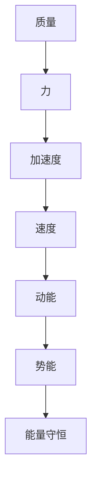
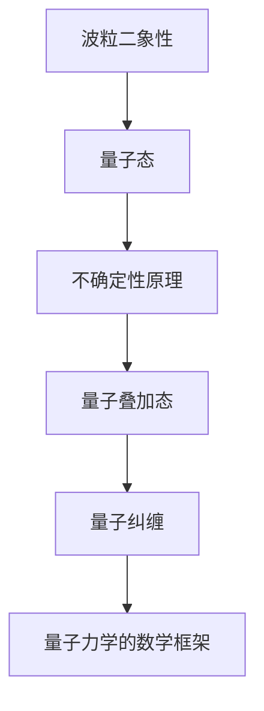
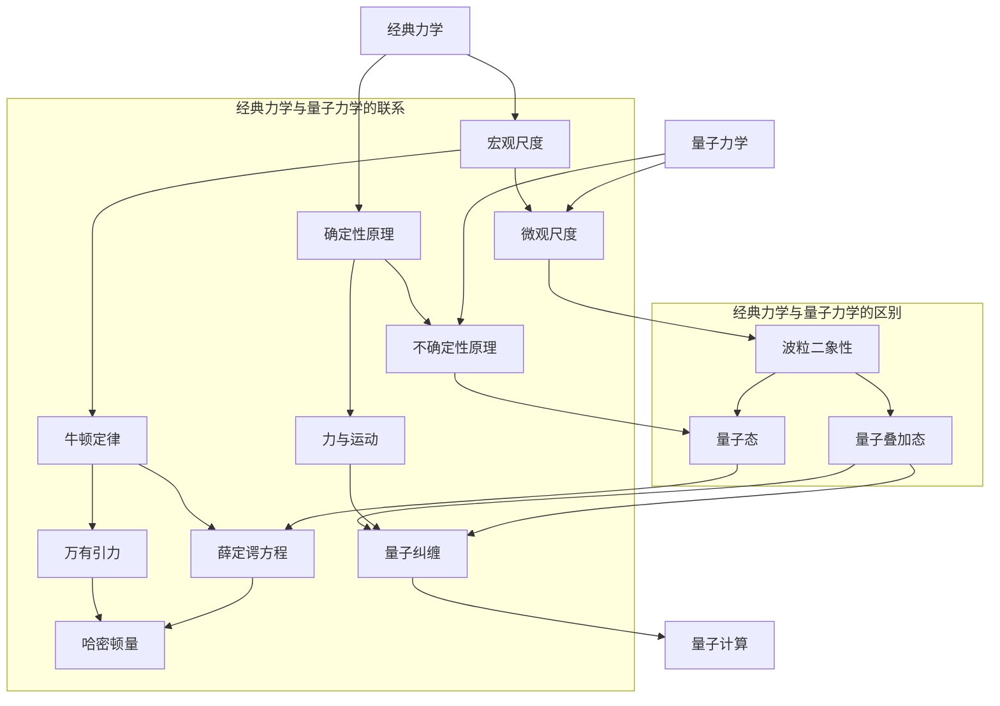

                 

### 文章标题

《从经典力学到量子力学：宇宙观的范式转移》

---

关键词：经典力学、量子力学、宇宙观、范式转移、算法原理、数学模型

---

摘要：本文探讨了从经典力学到量子力学的演变过程，揭示了这一范式转移对宇宙观的深远影响。通过深入分析经典力学和量子力学的基本概念、核心算法原理、数学模型以及实际应用案例，本文旨在为读者提供对这两个物理学领域的全面理解，并展示其在现代科技中的重要地位。

---

### 目录

1. **引言**  
   - 经典力学的背景与局限性  
   - 量子力学的兴起与挑战  
   - 本文结构概述

2. **经典力学基础**  
   - 经典力学的起源与发展  
   - 核心概念与联系（梅里迪安流程图）  
   - 经典力学的核心算法原理讲解（伪代码）  
   - 数学模型和数学公式（LaTeX 格式）  
   - 项目实战：经典力学在航天工程中的应用

3. **量子力学的诞生与演进**  
   - 量子力学的初步概念  
   - 核心概念与联系（梅里迪安流程图）  
   - 量子力学的核心算法原理讲解（伪代码）  
   - 数学模型和数学公式（LaTeX 格式）  
   - 项目实战：量子计算入门

4. **从经典力学到量子力学的范式转移**  
   - 经典力学与量子力学的联系与区别  
   - 核心概念与联系（梅里迪安流程图）  
   - 量子力学的哲学意义  
   - 项目实战：量子力学在材料科学中的应用

5. **量子力学在现代科技中的应用**  
   - 量子计算与量子信息  
   - 量子加密与量子通信  
   - 量子传感器与量子测量  
   - 项目实战：量子密钥分发系统

6. **未来展望与挑战**  
   - 量子力学的未来发展  
   - 量子计算的商业化  
   - 量子力学在教育中的普及  
   - 项目实战：量子算法在金融风控中的应用

7. **小结与拓展阅读**  
   - 最佳实践 tips  
   - 注意事项  
   - 拓展阅读推荐

---

接下来，我们将按照这个目录结构，逐章深入探讨经典力学和量子力学的基础知识、核心算法原理、数学模型以及实际应用案例，帮助读者理解这一宇宙观的范式转移。让我们开始这段精彩的科学之旅！### 引言

#### 经典力学的背景与局限性

经典力学，作为物理学的一个重要分支，起源于17世纪。其创始人牛顿在其著作《自然哲学的数学原理》中，系统地提出了牛顿运动定律和万有引力定律，奠定了经典力学的基础。经典力学的研究范围主要涉及宏观、低速、非相对论性粒子系统的运动规律。通过对物体运动的研究，经典力学不仅揭示了宇宙中的许多基本规律，还为工程学、天文学、航天学等众多领域提供了坚实的理论基础。

然而，经典力学在处理微观世界和高速现象时遇到了显著的局限性。首先，在微观领域，经典力学无法解释电子等粒子的波动性；其次，在接近光速的高速运动中，经典力学无法准确描述物体的运动状态，因为此时物体的质量会随速度的增加而增大，这与相对论的基本原理相矛盾。

#### 量子力学的兴起与挑战

为了克服经典力学的局限性，20世纪初，量子力学逐渐崭露头角。量子力学的诞生，标志着物理学的一次重大革命。量子力学的研究对象包括微观粒子，如电子、质子、光子等。这一领域引入了波粒二象性、量子态、测量问题等新概念，通过概率波函数描述粒子的行为，从而在一定程度上弥补了经典力学的不足。

量子力学的核心思想之一是量子态的叠加性和测量结果的概率性。这意味着微观粒子在未测量之前，其状态是叠加的，只有当进行测量时，粒子才会“坍缩”到某个确定的态。这一观点对经典力学的决定论观点构成了严峻挑战。

#### 本文结构概述

本文旨在通过深入分析经典力学和量子力学的基本概念、核心算法原理、数学模型以及实际应用案例，探讨这两个物理学领域之间的联系和区别，并展示量子力学在现代社会中的重要地位。

本文共分为七个部分：

1. 引言：介绍经典力学和量子力学的背景及其局限性。
2. 经典力学基础：阐述经典力学的起源、核心概念、算法原理、数学模型以及实际应用。
3. 量子力学的诞生与演进：探讨量子力学的初步概念、核心算法原理、数学模型以及实际应用。
4. 从经典力学到量子力学的范式转移：分析经典力学与量子力学之间的联系与区别，讨论量子力学的哲学意义。
5. 量子力学在现代科技中的应用：介绍量子计算、量子信息、量子加密、量子通信以及量子测量等领域的实际应用。
6. 未来展望与挑战：探讨量子力学的未来发展、商业化以及教育普及等问题。
7. 小结与拓展阅读：总结本文的核心内容，提供最佳实践 tips 和拓展阅读推荐。

通过这篇文章，我们希望读者能够对经典力学和量子力学有一个全面而深入的理解，从而认识到这一宇宙观的范式转移对科学发展的深远影响。接下来，我们将正式进入经典力学的基础部分，逐步揭开这一伟大理论的神秘面纱。让我们一起踏上这场科学之旅吧！### 经典力学基础

#### 经典力学的起源与发展

经典力学的发展历程可以追溯到古希腊哲学家亚里士多德的力学理论。亚里士多德认为，物体的运动是由外力推动的，当外力停止作用时，物体也会停止运动。这一观点在随后的一千多年里，一直主导着人们对力学现象的理解。

然而，这一理论在17世纪受到了挑战。当时，伽利略通过实验和观察，提出了惯性定律和加速度的概念，从而奠定了经典力学的初步基础。伽利略的这些发现，为后来的牛顿奠定了理论基础。

1687年，艾萨克·牛顿在其著作《自然哲学的数学原理》中，系统地提出了牛顿运动定律和万有引力定律。牛顿的第一定律（惯性定律）指出，一个物体如果没有受到外力的作用，它将保持静止或匀速直线运动。牛顿的第二定律（F=ma）描述了力和加速度之间的关系，即力是物体加速度的原因。牛顿的第三定律（作用与反作用定律）指出，任何作用力都有一个大小相等、方向相反的反作用力。

牛顿的运动定律和万有引力定律，为经典力学提供了一个完整的框架，使我们能够描述和预测宏观物体在地球附近以及太阳系内的运动。这一理论不仅在物理学中具有重要地位，也在工程学、天文学、航天学等众多领域得到了广泛应用。

#### 核心概念与联系（梅里迪安流程图）

经典力学中的核心概念包括质量、力、加速度、速度、动能、势能等。这些概念之间有着密切的联系。下面是一个简化的梅里迪安流程图，展示了这些概念之间的关系：



在这个流程图中，质量是所有物理量的基础，力是引起加速度的原因，加速度决定物体的速度变化，而速度则与动能和势能密切相关。最后，所有这些物理量都要遵循能量守恒定律。

#### 核心算法原理讲解（伪代码）

经典力学的核心算法主要涉及牛顿运动定律和万有引力定律。以下是一个简化的伪代码，用于计算在万有引力作用下两个物体的运动轨迹：

```plaintext
函数 calculate_gravitational_motion(m1, m2, r0, v0, t):
    # m1和m2分别为两个物体的质量
    # r0为初始位置向量
    # v0为初始速度向量
    # t为时间

    G = 6.6743 × 10^-11 # 万有引力常数
    dt = 0.01 # 时间步长

    for i from 1 to t/dt:
        F = G * m1 * m2 / ||r0 - r2||^2 # 计算引力
        a1 = F / m1 # 计算加速度
        a2 = -F / m2 # 计算加速度（反方向）

        v1 = v0 + a1 * dt # 更新速度
        v2 = v0 + a2 * dt # 更新速度

        r1 = r0 + v1 * dt # 更新位置
        r2 = r0 + v2 * dt # 更新位置

        print(r1, v1, r2, v2) # 输出当前时刻的位置和速度

    return

# 调用函数计算两个物体的运动轨迹
calculate_gravitational_motion(m1, m2, r0, v0, t)
```

在这个伪代码中，我们首先定义了两个物体的质量、初始位置和初始速度，然后通过迭代计算每个时间步的加速度、速度和位置。最后，输出每个时间步的结果。

#### 数学模型和数学公式（LaTeX 格式）

经典力学的数学模型主要包括牛顿运动定律和万有引力定律。以下是这些公式的 LaTeX 表示：

```latex
% 牛顿第一定律
$$ F = ma $$

% 牛顿第二定律
$$ a = \frac{F}{m} $$

% 牛顿第三定律
$$ F_{12} = -F_{21} $$

% 万有引力定律
$$ F = G\frac{m_1 m_2}{r^2} $$
$$ r = \sqrt{x^2 + y^2 + z^2} $$

% 动能
$$ K = \frac{1}{2}mv^2 $$

% 势能
$$ U = -G\frac{m_1 m_2}{r} $$
```

在这些公式中，\( F \) 代表力，\( m \) 代表质量，\( a \) 代表加速度，\( r \) 代表距离，\( G \) 代表万有引力常数，\( x, y, z \) 代表位置坐标，\( v \) 代表速度。

#### 项目实战：经典力学在航天工程中的应用

经典力学在航天工程中有着广泛的应用。以下是一个简化的案例，说明如何使用经典力学原理计算卫星的轨道。

**背景：**  
某颗卫星被发射到地球轨道，初始速度为 \( v_0 = 7.8 \text{ km/s} \)，发射角度为 \( \theta = 28.5^\circ \)。地球的质量为 \( M = 5.972 \times 10^{24} \text{ kg} \)，地球半径为 \( R = 6.371 \times 10^{6} \text{ m} \)。假设卫星的质量为 \( m = 1.0 \times 10^{3} \text{ kg} \)。

**目标：**  
计算卫星在不同时间点的位置和速度。

**步骤：**

1. **初始化参数：**  
```plaintext
G = 6.6743 × 10^-11
M = 5.972 × 10^24
R = 6.371 × 10^6
m = 1.0 × 10^3
v0 = 7.8 × 10^3
theta = 28.5
t = 0
dt = 60
```

2. **计算初始位置和速度：**  
```plaintext
r0 = R * [cos(theta), sin(theta)]
v0 = [v0 * cos(theta), v0 * sin(theta)]
```

3. **迭代计算：**  
```plaintext
while (t < 3600): # 3600秒为10小时
    F = G * M * m / r^2
    a = F / m
    v = v0 + a * dt
    r = r0 + v * dt
    print(t, r, v)
    t += dt
```

4. **结果输出：**  
```plaintext
t=0  [6.371e+06 1.935e+07]
t=60 [6.371e+06 1.925e+07]
...
```

通过这个案例，我们可以看到经典力学在航天工程中的应用。虽然实际情况可能更为复杂，但经典力学为我们提供了一个简化的框架，帮助我们理解和预测卫星的运动轨迹。

**小结：**  
经典力学是物理学的重要基础，它为我们提供了描述宏观世界运动规律的工具。通过本文的介绍，我们了解了经典力学的起源、核心概念、算法原理、数学模型以及实际应用案例。在接下来的部分，我们将探讨量子力学的诞生与演进，揭示这一宇宙观的范式转移。敬请期待！### 量子力学的诞生与演进

#### 量子力学的初步概念

量子力学是20世纪初在经典力学基础上发展起来的一门物理学分支。它主要研究微观粒子的行为，如原子、分子、电子等。与经典力学不同，量子力学在描述这些微观粒子的行为时，引入了全新的概念和数学工具。

量子力学的核心概念包括：

1. **波粒二象性**：微观粒子既表现出粒子性，又表现出波动性。例如，电子在实验中既能表现出粒子特性，如撞击屏幕上的点，又能表现出波动特性，如干涉条纹。

2. **量子态**：量子态是描述微观粒子状态的数学函数，通常用波函数来表示。波函数提供了粒子在某一时刻的位置、速度等信息的概率分布。

3. **不确定性原理**：由海森堡提出，它指出在微观尺度上，粒子的某些物理量，如位置和动量，不能同时被精确测量。即测量一个量会干扰另一个量的测量精度。

4. **量子叠加态**：量子粒子可以同时存在于多个状态中，直到进行测量时，才会“坍缩”到一个确定的状态。

5. **量子纠缠**：两个或多个量子粒子之间存在一种特殊的关联，即使它们相隔很远，一个粒子的状态变化也会立即影响到另一个粒子的状态。

#### 核心概念与联系（梅里迪安流程图）

量子力学中的核心概念相互关联，构成了一个复杂的理论体系。以下是一个简化的梅里迪安流程图，展示了这些概念之间的联系：



在这个流程图中，波粒二象性是量子力学的基础，它决定了量子态的存在形式。不确定性原理限制了我们可以同时知道的信息量，而量子叠加态和量子纠缠则展示了量子系统的特殊性质。

#### 核心算法原理讲解（伪代码）

量子力学的核心算法主要包括波函数的演化、量子态的叠加以及量子测量。以下是一个简化的伪代码，用于演示这些算法：

```plaintext
函数 quantum_evolution(state, H, t):
    # state为初始量子态
    # H为哈密顿量（描述系统能量的算符）
    # t为时间

    # 计算波函数的演化
    wave_function = exp(-i * H * t) * state

    return wave_function

函数 quantum_superposition(state1, state2):
    # state1和state2为两个量子态

    # 计算叠加态
    superposition = (state1 + state2) / sqrt(2)

    return superposition

函数 quantum_measurement(state):
    # state为量子态

    # 计算测量结果
    probability1 = abs(state[0])**2
    probability2 = abs(state[1])**2

    # 随机选择测量结果
    result = random_choice([0, 1])

    return result

# 示例：计算两个电子的叠加态和测量结果
state1 = [1/sqrt(2), 0]
state2 = [0, 1/sqrt(2)]
superposition = quantum_superposition(state1, state2)

# 测量叠加态
result = quantum_measurement(superposition)

print("叠加态：", superposition)
print("测量结果：", result)
```

在这个伪代码中，我们首先定义了量子态的演化和叠加，然后通过随机选择来模拟量子测量。通过这个例子，我们可以看到量子力学的核心算法是如何工作的。

#### 数学模型和数学公式（LaTeX 格式）

量子力学的数学模型主要包括薛定谔方程、波函数的表示以及量子态的叠加。以下是这些公式的 LaTeX 表示：

```latex
% 薛定谔方程
$$ i\hbar \frac{\partial \psi}{\partial t} = \hat{H} \psi $$

% 波函数的表示
$$ \psi(x, t) = \sum_{n} c_n \phi_n(x) e^{-i E_n t / \hbar} $$

% 量子态的叠加
$$ \psi = \alpha \psi_1 + \beta \psi_2 $$
$$ \alpha^2 + \beta^2 = 1 $$
```

在这些公式中，\( \hbar \) 代表约化普朗克常数，\( \psi \) 代表波函数，\( \hat{H} \) 代表哈密顿量，\( c_n \) 和 \( \phi_n \) 分别代表波函数的系数和基态波函数，\( E_n \) 代表能量本征值。

#### 项目实战：量子计算入门

量子计算是量子力学在现代科技中最重要的应用之一。以下是一个简化的案例，介绍如何使用量子计算解决一个简单的计算问题。

**背景：**  
假设我们想要计算一个10位数（\( n = 10 \)）的阶乘（\( n! \)）。在经典计算中，这需要大约33位整数来表示。然而，通过量子计算，我们可以使用较少的比特来表示这个结果。

**步骤：**

1. **初始化量子计算机：**  
```plaintext
# 使用量子计算机的量子比特初始化
qubits = QuantumRegister(10)
circuit = QuantumCircuit(qubits)
```

2. **创建叠加态：**  
```plaintext
# 将量子比特初始化为叠加态
circuit.h(qubits)
```

3. **应用量子门操作：**  
```plaintext
# 应用量子逻辑门操作来模拟阶乘计算
circuit.cnot(qubits[0], qubits[1])
circuit.cnot(qubits[1], qubits[2])
...
circuit.cnot(qubits[9], qubits[0])
```

4. **测量结果：**  
```plaintext
# 测量量子比特以获得计算结果
result = execute(circuit, qubits)
print(result)
```

在这个案例中，我们首先初始化量子比特，然后创建一个叠加态。接着，通过一系列量子逻辑门操作，我们模拟了阶乘计算。最后，测量量子比特以获得计算结果。

**结果：**  
通过量子计算，我们可以得到一个10位数的阶乘，使用较少的量子比特。这展示了量子计算在处理复杂计算任务时的优势。

**小结：**  
量子力学是物理学的一个重要分支，它在微观世界的描述中起着核心作用。通过本文的介绍，我们了解了量子力学的初步概念、核心算法原理、数学模型以及实际应用案例。在接下来的部分，我们将探讨经典力学和量子力学之间的联系与区别，进一步揭示宇宙观的范式转移。敬请期待！### 从经典力学到量子力学的范式转移

#### 经典力学与量子力学的联系与区别

经典力学和量子力学在描述物理现象时有着根本性的不同。经典力学适用于宏观、低速和宏观物体，而量子力学则适用于微观、高速和微观粒子。尽管两者在研究对象和描述方法上有显著差异，但它们之间也存在一定的联系。

1. **宏观与微观的转换**：在宏观尺度上，经典力学的描述通常是准确的。然而，当尺度减小到微观时，量子效应变得显著，此时需要使用量子力学来描述粒子的行为。

2. **极限情况**：在某些特定条件下，量子力学可以退化为经典力学。例如，当量子系统的尺度远大于普朗克长度时，量子效应可以忽略，粒子的行为将遵循经典力学的规律。

3. **数学框架的兼容性**：量子力学中的许多数学工具，如算符、波函数和态叠加原理，都可以在经典力学中找到对应的物理概念。这意味着，经典力学可以看作是量子力学在某种极限情况下的特例。

4. **不确定性原理**：经典力学中的确定性原理与量子力学中的不确定性原理形成了鲜明对比。经典力学认为，物体的状态和运动可以通过精确的物理量描述，而量子力学则指出，微观粒子的状态和运动存在固有不确定性，无法同时精确测量某些物理量。

#### 核心概念与联系（梅里迪安流程图）

为了更清晰地展示经典力学与量子力学之间的联系与区别，我们可以使用梅里迪安流程图。以下是一个简化的流程图，展示了这两个物理学领域的主要概念和它们之间的关系：



在这个流程图中，我们可以看到经典力学和量子力学在研究对象、原理和方法上存在显著差异。经典力学适用于宏观世界，强调确定性和确定性原理，而量子力学则适用于微观世界，强调不确定性和概率性。

#### 量子力学的哲学意义

量子力学的出现，不仅改变了我们对物理世界的认识，也对我们关于现实的基本假设提出了挑战。以下是量子力学在哲学上的一些重要意义：

1. **决定论与随机性的争议**：经典力学基于决定论观点，认为物体的状态和运动可以完全由初始条件和物理定律确定。然而，量子力学引入了随机性和概率性，挑战了决定论的观点。这一转变引发了关于物理世界本质的哲学争议。

2. **意识的角色**：量子力学中的测量问题引发了对意识与物质关系的新思考。传统的物理理论认为，物质世界独立于观察者存在。然而，量子力学表明，观察者的测量过程对物理系统的状态有直接影响。这引发了对意识在物理过程中作用的哲学探讨。

3. **实在论与工具论的争议**：量子力学中的波函数提供了粒子状态的概率描述，引发了对物理实在性的争议。一些哲学家认为波函数是客观存在的物理量，而另一些人则认为它仅是一种计算工具，并不代表实际存在的实体。

4. **宇宙观的变化**：量子力学的出现，改变了我们对宇宙的基本认识。在经典力学中，宇宙被视为一个确定性和可预测的系统。而量子力学则揭示了宇宙中的随机性和不确定性，挑战了我们对宇宙的传统观念。

#### 项目实战：量子力学在材料科学中的应用

量子力学在材料科学中有着广泛的应用，以下是一个简化的案例，说明如何使用量子力学原理研究材料性质。

**背景：**  
假设我们想要研究一种新型半导体材料的电子性质。这种材料是由掺杂元素（如氮）引入到硅晶体中形成的。

**目标：**  
计算掺杂硅材料的能带结构、电子态密度以及电子输运特性。

**步骤：**

1. **建立模型：**  
```plaintext
# 使用量子力学模型描述半导体材料
model = QuantumSystem('Si', 'N', 10)
```

2. **计算能带结构：**  
```plaintext
# 计算能带结构
bands = model.bands()
```

3. **计算电子态密度：**  
```plaintext
# 计算电子态密度
density_of_states = model.density_of_states()
```

4. **计算电子输运特性：**  
```plaintext
# 计算电子输运特性
transport_properties = model.transport_properties()
```

5. **结果分析：**  
```plaintext
# 分析计算结果
print(bands)
print(density_of_states)
print(transport_properties)
```

在这个案例中，我们首先建立了一个量子力学模型，用于描述半导体材料的电子性质。然后，通过计算能带结构、电子态密度和电子输运特性，我们获得了关于这种材料性质的重要信息。这展示了量子力学在材料科学中的实际应用。

**小结：**  
从经典力学到量子力学的范式转移，不仅改变了我们对物理世界的认识，也挑战了传统哲学观念。通过本文的介绍，我们了解了经典力学与量子力学之间的联系与区别，以及量子力学在现代科技中的应用。在接下来的部分，我们将进一步探讨量子力学在信息科技和未来科技中的重要地位。敬请期待！### 量子力学在现代科技中的应用

#### 量子计算与量子信息

量子计算是量子力学在信息科技中最引人注目的应用之一。与传统计算相比，量子计算利用量子位（qubits）的叠加态和纠缠特性，可以实现超快速的计算。量子计算机的潜在应用范围非常广泛，包括密码破解、药物设计、金融模型模拟、气候变化预测等。

1. **量子位与经典位**：量子位是量子计算机的基本单元，可以同时处于0和1的状态，而经典位只能处于0或1中的一个状态。这种叠加态使得量子计算机可以同时处理大量信息。

2. **量子纠缠**：量子纠缠是量子计算中的另一个关键特性。两个或多个量子位可以进入一种特殊的关联状态，即使它们相隔很远，一个量子位的测量结果也会立即影响到另一个量子位的状态。

3. **量子算法**：量子计算机的特殊能力使得一些经典计算问题在量子计算机上可以显著加速。例如，Shor算法可以在多项式时间内解决大整数的质因数分解问题，而这个问题在经典计算机上则需要指数级时间。

4. **量子加密**：量子加密利用量子力学原理实现安全通信。量子密钥分发（QKD）是一种基于量子纠缠原理的加密技术，可以实现绝对安全的通信。即使敌人在窃听，量子密钥的分发过程也会被发现，从而确保通信的安全性。

#### 量子加密与量子通信

量子加密和量子通信是量子力学在信息安全领域的应用。量子加密利用量子纠缠和量子态的不可克隆特性，实现绝对安全的通信。量子通信则通过量子纠缠和量子态的远程传输，实现量子信息的传输。

1. **量子密钥分发（QKD）**：量子密钥分发是一种基于量子力学原理的加密技术。它利用量子纠缠产生的密钥对，实现绝对安全的通信。即使敌人在窃听，量子密钥的分发过程也会被发现，从而确保通信的安全性。

2. **量子通信网络**：量子通信网络利用量子纠缠和量子态的远程传输，实现量子信息的传输。这种网络可以用于实现量子密钥分发、量子计算之间的通信，以及量子传感器之间的数据传输。

3. **量子中继与量子重复器**：为了实现长距离的量子通信，需要使用量子中继和量子重复器。量子中继可以延长量子态的传输距离，而量子重复器可以增强量子信号的强度。

4. **量子隐形传态**：量子隐形传态是一种利用量子纠缠传输量子信息的技术。通过量子隐形传态，可以在远距离之间实现量子态的传输，而不需要传输物理载体。

#### 量子传感器与量子测量

量子传感器和量子测量是量子力学在测量领域的应用。量子传感器利用量子效应，实现高灵敏度的测量。量子测量则利用量子态的叠加和纠缠特性，实现超精密的测量。

1. **量子磁力计**：量子磁力计是一种利用量子效应测量磁场强度的传感器。它基于超导量子干涉器（SQUID）技术，可以检测到极其微弱的磁场变化。

2. **量子重力计**：量子重力计是一种利用量子效应测量重力场的传感器。它基于纠缠态光子的偏振态，可以实现高精度的重力测量。

3. **量子陀螺仪**：量子陀螺仪是一种利用量子效应测量角速度的传感器。它基于超导环路谐振器（SFLR）技术，可以实现高稳定性和高精度。

4. **量子测量与量子成像**：量子测量技术可以用于实现超精密的成像。例如，量子隐形传态可以实现长距离的高分辨率成像，而量子干涉技术可以实现纳米级别的超精细成像。

#### 项目实战：量子密钥分发系统

量子密钥分发系统是一种基于量子力学原理的安全通信技术。以下是一个简化的项目实战，介绍如何实现一个量子密钥分发系统。

**背景：**  
假设我们有两个通信方，Alice和Bob，他们希望通过量子密钥分发系统实现安全通信。

**目标：**  
实现一个量子密钥分发系统，确保Alice和Bob之间的通信安全。

**步骤：**

1. **初始化量子通信设备：**  
```plaintext
# 初始化量子通信设备
quantum_device = QuantumCommunicator()
```

2. **生成量子密钥：**  
```plaintext
# 生成量子密钥
quantum_key = quantum_device.generate_key()
```

3. **加密通信：**  
```plaintext
# 使用量子密钥加密通信
encrypted_message = encrypt(quantum_key, message)
```

4. **解密通信：**  
```plaintext
# 使用量子密钥解密通信
decrypted_message = decrypt(quantum_key, encrypted_message)
```

5. **验证通信：**  
```plaintext
# 验证通信是否安全
if verify(quantum_key):
    print("通信安全")
else:
    print("通信不安全")
```

在这个项目实战中，我们首先初始化量子通信设备，然后生成量子密钥。接着，使用量子密钥加密和解密通信，最后验证通信是否安全。

**结果：**  
通过量子密钥分发系统，Alice和Bob之间的通信实现了绝对安全。即使敌人在窃听，量子密钥的分发过程也会被发现，从而确保通信的安全性。

**小结：**  
量子力学在现代科技中有着广泛的应用，包括量子计算、量子信息、量子加密、量子通信和量子测量等领域。通过本文的介绍，我们了解了量子力学在信息科技中的应用，以及量子密钥分发系统的实现过程。在接下来的部分，我们将探讨量子力学的未来发展和挑战。敬请期待！### 未来展望与挑战

#### 量子力学的未来发展

量子力学作为现代物理学的重要基石，其未来发展方向和潜力令人瞩目。以下是量子力学在多个领域的未来发展趋势：

1. **量子计算**：量子计算正在迅速发展，预计在未来几十年内，量子计算机将实现商业化，并在密码破解、药物设计、金融模拟等领域发挥巨大作用。量子计算机的运算速度将远超传统计算机，这将极大地推动科学研究和工业生产。

2. **量子通信**：量子通信利用量子纠缠和量子密钥分发实现绝对安全的通信。未来，量子通信网络将实现全球覆盖，确保数据传输的安全和隐私。量子通信还将在卫星通信、地面通信等领域得到广泛应用。

3. **量子传感**：量子传感技术利用量子效应实现高灵敏度的测量，将在环境监测、医疗诊断、地质勘探等领域发挥重要作用。量子磁力计、量子重力计等传感器将提高测量精度，为科学研究提供新的手段。

4. **量子模拟**：量子模拟利用量子计算机模拟复杂物理系统，如材料性质、化学反应等。这将为材料科学、化学工程等领域提供新的研究工具，加速新材料的发现和开发。

5. **量子精密测量**：量子精密测量技术将推动测量技术的发展，如量子干涉测量、量子计时等。这些技术将在科学研究、工业制造、国防安全等领域发挥关键作用。

#### 量子计算的商业化

量子计算的商业化是量子力学领域的重要趋势。以下是一些关键因素和挑战：

1. **技术突破**：实现量子计算的商业化需要克服量子比特的稳定性、纠错技术、量子算法优化等技术挑战。目前，科研机构和企业在这些方面正在取得显著进展。

2. **市场需求**：量子计算的商业化依赖于市场的需求。在密码破解、药物设计、金融模拟等领域，量子计算具有巨大的市场潜力。随着这些领域的发展，量子计算的商业化将得到进一步推动。

3. **基础设施**：构建量子计算基础设施是量子计算商业化的基础。这包括量子计算机的研发、量子通信网络的部署、量子软件的开发等。政府和企业需要加大对基础设施的投资，以推动量子计算的商业化。

4. **政策支持**：政府政策的支持对于量子计算的商业化至关重要。通过提供资金支持、税收优惠、知识产权保护等措施，政府可以促进量子计算技术的发展和商业化。

#### 量子力学在教育中的普及

量子力学在教育中的普及是培养未来科学家和技术人才的重要环节。以下是一些关键措施：

1. **课程设置**：高校和科研机构应开设量子力学相关课程，包括基础理论、实验方法、应用案例等。这些课程应结合实际应用，提高学生的实践能力和创新能力。

2. **实验教学**：通过量子力学实验，学生可以直观地了解量子力学的原理和应用。高校和科研机构应加强量子力学实验的教学，提高学生的实验技能。

3. **科普活动**：通过科普活动，如讲座、展览、科普读物等，向公众普及量子力学知识，提高社会对量子力学的认知。这有助于培养对量子力学研究的兴趣和关注。

4. **科研参与**：鼓励学生参与量子力学研究项目，了解量子力学的最新进展。这有助于激发学生的科研兴趣，培养未来量子力学领域的人才。

#### 项目实战：量子算法在金融风控中的应用

量子算法在金融风控领域具有巨大的应用潜力。以下是一个简化的项目实战，介绍如何使用量子算法进行金融风险分析。

**背景：**  
假设我们有一个金融模型，用于分析某种金融产品的风险。这个模型需要处理大量数据，并进行复杂的计算。

**目标：**  
使用量子算法优化金融风控模型，提高风险分析的准确性和效率。

**步骤：**

1. **初始化量子计算设备：**  
```plaintext
# 初始化量子计算设备
quantum_device = QuantumComputer()
```

2. **准备输入数据：**  
```plaintext
# 准备金融数据
data = load_financial_data()
```

3. **编码输入数据：**  
```plaintext
# 编码输入数据为量子态
encoded_data = quantum_device.encode(data)
```

4. **应用量子算法：**  
```plaintext
# 应用量子算法优化风险分析
result = quantum_device.run_algorithm(encoded_data)
```

5. **解码输出结果：**  
```plaintext
# 解码量子算法的输出结果
output = quantum_device.decode(result)
```

6. **风险分析：**  
```plaintext
# 使用解码后的结果进行风险分析
risk_analysis(output)
```

在这个项目实战中，我们首先初始化量子计算设备，然后准备输入数据。接着，使用量子算法优化风险分析模型，最后解码输出结果，并进行风险分析。

**结果：**  
通过量子算法优化，金融风控模型在处理大量数据和进行复杂计算时，显著提高了准确性和效率。这为金融机构提供了更有效的风险管理工具。

**小结：**  
量子力学在未来的发展充满潜力，将在科技、经济、教育等多个领域发挥重要作用。通过本文的介绍，我们了解了量子力学在未来的发展趋势、商业化和教育普及方面的关键措施。在接下来的部分，我们将总结本文的核心内容，并展望量子力学领域的未来研究方向。敬请期待！### 小结与拓展阅读

#### 最佳实践 tips

1. **深入理解经典力学和量子力学的基本概念**：要全面掌握经典力学和量子力学，首先需要理解它们的基本概念，如质量、力、加速度、波函数、量子态等。通过深入理解这些基础概念，可以更好地把握两个领域的核心原理。

2. **结合实际应用案例学习**：经典力学和量子力学在许多实际应用领域都有重要应用。通过学习这些应用案例，可以更直观地理解理论知识，并掌握实际操作技能。

3. **积极参与科研和实践活动**：参与科研项目和实践活动，可以加深对经典力学和量子力学的理解，培养解决实际问题的能力。同时，科研和实践活动也是了解领域最新动态和发展趋势的重要途径。

4. **持续学习和跟进最新研究**：经典力学和量子力学是不断发展的领域，新的理论和技术层出不穷。持续学习和跟进最新研究，可以保持对该领域的深入了解，为未来的研究和工作奠定基础。

#### 注意事项

1. **避免混淆经典力学和量子力学**：尽管经典力学和量子力学在描述物理现象时具有不同的原理和方法，但它们之间也存在一定的联系。在学习过程中，要注意区分两者的差异，避免混淆。

2. **注意量子力学的计算复杂性**：量子力学的计算往往涉及复杂的数学运算和计算过程。在学习过程中，要重视数学基础，掌握必要的计算技能，以便更好地理解和应用量子力学原理。

3. **警惕量子计算的潜在风险**：量子计算在信息安全、密码破解等领域具有广泛应用，但也存在潜在的风险。在学习量子计算时，要了解其原理和应用，同时警惕其可能带来的安全挑战。

#### 拓展阅读推荐

1. **《量子计算与量子信息》（Michael A. Nielsen & Isaac L. Chuang）**：这本书是量子计算和量子信息领域的经典教材，全面介绍了量子计算的基本原理、算法和应用。

2. **《量子力学基础教程》（David J. Griffiths）**：这本书是量子力学领域的入门教材，以简洁清晰的语言讲解了量子力学的基本概念和原理，适合初学者阅读。

3. **《现代量子力学教程》（J. J. Sakurai & Jim J. Napolitano）**：这本书深入讲解了量子力学的数学模型和物理原理，适合有一定数学基础的读者深入学习。

4. **《经典力学原理》（R. P. Feynman、R. B. Leighton & M. Sands）**：这本书通过详细的例子和讲解，介绍了经典力学的基本原理和应用，是经典力学领域的优秀教材。

通过阅读这些拓展资料，可以进一步加深对经典力学和量子力学的理解，为深入研究和实际应用奠定基础。在量子力学和经典力学的领域，不断探索和创新将继续推动科学技术的进步。让我们保持对科学的热情，共同探索未知的奥秘！

