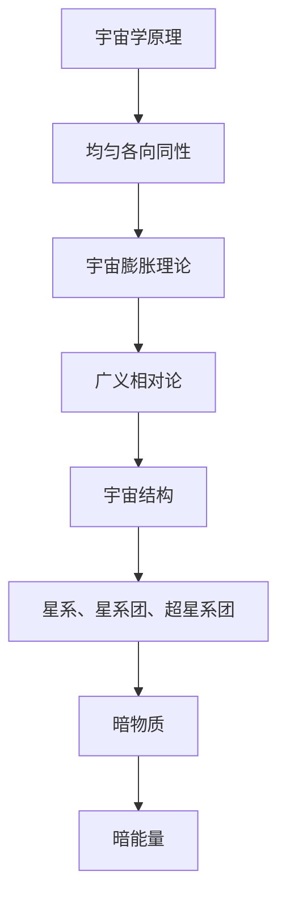

                 

# 从经典宇宙学到现代宇宙学的演变

## 关键词

- 宇宙学
- 经典宇宙学
- 现代宇宙学
- 宇宙膨胀
- 暗物质
- 暗能量

## 摘要

本文旨在探讨宇宙学从经典到现代的演变历程。我们将从宇宙学的起源、宇宙膨胀理论、宇宙结构、数学模型、观测方法以及宇宙学的前沿问题等多个方面，逐步分析并理解宇宙学的基本原理和发展历程。本文的目标是为读者提供一部全面而深入的宇宙学指南，帮助大家理解这一激动人心的科学领域。

## 目录

### 第一部分：宇宙学的起源与历史

#### 第1章 宇宙学的起源

#### 第2章 宇宙膨胀理论

#### 第3章 宇宙结构

### 第二部分：宇宙学的观测与数学模型

#### 第4章 宇宙学中的数学模型

#### 第5章 观测宇宙学

#### 第6章 宇宙学的前沿问题

### 第三部分：宇宙学的实际应用

#### 第7章 宇宙学在科技中的应用

#### 第8章 宇宙学与日常生活

### 附录

#### 附录A 宇宙学常用术语解释

#### 附录B 推荐阅读书目与文献

#### 附录C 宇宙学实验与观测数据资料

## 正文

### 第1章 宇宙学的起源

宇宙学作为一门科学，起源于人类对宇宙的探索和思考。自古以来，人类就对宇宙的起源和本质产生了浓厚的兴趣。古代的哲学家和天文学家，如古希腊的亚里士多德和中国的张载，都对宇宙进行了深刻的思考。

在古代，人们对宇宙的认识主要是基于直观的观察和简单的哲学推理。亚里士多德认为宇宙是永恒不变的，而中国的张载则提出了“气”的概念，认为宇宙是由“气”构成的。这些思想奠定了古典宇宙学的基础。

随着科学的发展，宇宙学逐渐从哲学领域独立出来，成为一门科学。牛顿在17世纪提出了万有引力定律，为理解宇宙的力学结构提供了理论基础。哈雷彗星的周期性回归和开普勒行星运动定律的发现，进一步证实了牛顿理论的正确性。

然而，经典宇宙学在解释宇宙的膨胀和演化方面遇到了困难。20世纪初，科学家发现了宇宙膨胀的证据，这一发现彻底改变了宇宙学的面貌。我们将在下一章详细探讨宇宙膨胀理论。

### 第2章 宇宙膨胀理论

宇宙膨胀理论是现代宇宙学的基础。20世纪初，埃德温·哈勃通过观测发现，遥远的星系正在远离我们，而且距离越远的星系，远离我们的速度越快。这一发现被称为哈勃定律，揭示了宇宙正在膨胀的事实。

宇宙膨胀的理论基础是广义相对论，由阿尔伯特·爱因斯坦在1915年提出。广义相对论认为，时空是由物质和能量分布决定的，而物质和能量的分布又影响时空的形状。通过广义相对论，我们可以理解宇宙的膨胀和演化。

宇宙膨胀的数学模型称为弗里德曼-勒梅特-罗伯逊-沃尔克度规（FLRW度规），由亚历山大·弗里德曼、乔治·勒梅特和爱德华·罗伯逊-沃尔克在20世纪20年代提出。FLRW度规描述了一个均匀且各向同性的宇宙，这种宇宙被称为弗里德曼宇宙。

宇宙膨胀的观测证据不仅来自于星系的红移，还包括宇宙背景辐射的发现和宇宙微波背景辐射的测量。宇宙背景辐射是宇宙早期的余辉，它揭示了宇宙早期的状态。通过测量宇宙背景辐射的温度和波动，科学家们可以推测宇宙的膨胀历史和结构。

下面是一个关于宇宙膨胀的简单伪代码：

```python
# 宇宙膨胀伪代码

# 初始化宇宙参数
H0 = 70 # 哈勃常数，单位为千米/秒/百万秒差距
z = 1 # 红移值

# 计算宇宙膨胀速度
v = H0 * z

# 打印结果
print("宇宙膨胀速度为：", v, "千米/秒")
```

通过上述伪代码，我们可以简单地计算给定红移值下的宇宙膨胀速度。这只是一个简单的示例，实际的天文学计算要复杂得多。

### 第3章 宇宙结构

宇宙的结构是一个复杂且多层次的问题。从宏观尺度上看，宇宙主要由星系、星系团和超星系团等组成。这些结构之间通过引力相互作用，形成了宇宙的大尺度网络。

在微观尺度上，宇宙结构由原子、分子和基本粒子等组成。这些微观粒子通过电磁相互作用和强相互作用等基本力相互作用，形成了复杂的物质结构。

暗物质是宇宙结构中的一个重要组成部分。暗物质不发光，不与电磁波相互作用，因此无法直接观测。但是，通过引力透镜效应和宇宙背景辐射的测量，科学家们推测宇宙中存在大量的暗物质。

暗能量则是推动宇宙膨胀的另一个重要因素。暗能量具有负压强，其性质与普通物质和暗物质完全不同。目前，暗能量的本质尚不清楚，但它是现代宇宙学中的一个关键问题。

为了更好地理解宇宙结构，科学家们使用了一种称为“宇宙学原理”的假设。宇宙学原理认为，宇宙是均匀且各向同性的，这意味着宇宙在宏观尺度上没有特定的方向和位置。这个假设为宇宙学的观测和理论提供了基础。

宇宙结构的核心概念和联系可以用Mermaid流程图来表示：



这个流程图展示了宇宙学原理、宇宙膨胀理论、广义相对论、宇宙结构、星系结构、暗物质和暗能量之间的联系。

### 第4章 宇宙学中的数学模型

宇宙学中的数学模型是理解宇宙膨胀和结构的重要工具。其中，弗里德曼-勒梅特-罗伯逊-沃尔克度规（FLRW度规）是最基本的模型之一。FLRW度规描述了一个均匀且各向同性的宇宙，其方程如下：

$$
\text{d}^2 x^\mu / \text{d}\sigma^2 + \kappa \rho = 0
$$

其中，$\mu$ 表示时间或空间坐标，$\sigma$ 表示宇宙的时间演化，$\kappa$ 是一个常数，$\rho$ 表示宇宙的平均密度。

为了更好地理解FLRW度规，我们可以用伪代码来描述宇宙的时间演化：

```python
# FLRW度规伪代码

# 初始化宇宙参数
H0 = 70 # 哈勃常数，单位为千米/秒/百万秒差距
z = 1 # 红移值
a = 1 / (1 + z) # 宇宙膨胀因子

# 计算宇宙膨胀速度
v = H0 * a

# 打印结果
print("宇宙膨胀速度为：", v, "千米/秒")
```

这个伪代码展示了如何根据宇宙的红移值计算宇宙的膨胀速度。这只是一个简单的示例，实际的宇宙学计算要复杂得多。

除了FLRW度规，宇宙学中还使用了其他数学模型，如勒梅特-托尔曼模型、德西特模型等。这些模型为我们提供了不同的视角，帮助我们更全面地理解宇宙。

### 第5章 观测宇宙学

观测宇宙学是宇宙学的重要组成部分。通过观测宇宙，科学家们可以了解宇宙的结构、膨胀历史和组成成分。宇宙背景辐射、大尺度结构、星系团等都是重要的观测对象。

宇宙背景辐射是宇宙早期余辉的重要标志。通过测量宇宙背景辐射的温度和波动，科学家们可以推测宇宙早期的状态和演化历史。

大尺度结构是指宇宙中的星系、星系团和超星系团等。通过观测这些结构，科学家们可以了解宇宙的力学性质和演化历史。

星系团是宇宙中的大型结构，由数百个甚至数千个星系组成。通过观测星系团，科学家们可以了解星系的形成和演化过程。

为了更好地理解宇宙的观测结果，科学家们使用了一系列观测设备，如射电望远镜、光学望远镜、X射线望远镜等。这些设备可以测量不同波段的辐射，帮助我们更全面地了解宇宙。

以下是一个简单的宇宙背景辐射观测伪代码：

```python
# 宇宙背景辐射观测伪代码

# 初始化观测参数
frequency = 30 # 频率，单位为 GHz
temperature = 2.725 # 宇宙背景辐射温度，单位为开尔文

# 计算辐射强度
intensity = temperature * frequency

# 打印结果
print("宇宙背景辐射强度为：", intensity, "W/m^2")
```

这个伪代码展示了如何根据宇宙背景辐射的温度和频率计算辐射强度。这只是一个简单的示例，实际的宇宙背景辐射观测要复杂得多。

### 第6章 宇宙学的前沿问题

宇宙学是一门不断发展的科学，其中有许多前沿问题尚未解决。暗物质和暗能量是宇宙学中的两个关键问题。

暗物质是宇宙中的“隐形物质”，不与电磁波相互作用，因此难以直接观测。然而，暗物质的存在对宇宙的演化起着关键作用。科学家们正在寻找暗物质的具体组成和性质。

暗能量是推动宇宙膨胀的神秘力量，具有负压强。暗能量的本质尚不清楚，但它是现代宇宙学中的一个重要问题。科学家们正在研究暗能量的起源和性质，以期解开宇宙膨胀之谜。

此外，宇宙学中还面临其他挑战，如宇宙加速膨胀、宇宙学常数的问题等。这些问题需要科学家们继续努力探索和研究。

### 第7章 宇宙学在科技中的应用

宇宙学在科技中的应用非常广泛。从航天技术到天体物理研究，宇宙学为科技发展提供了重要的理论基础。

在航天领域，宇宙学知识帮助科学家们设计航天器、制定航天任务计划。宇宙背景辐射的测量、星系结构的分析等都是航天任务中的重要内容。

在天体物理研究中，宇宙学提供了理解宇宙演化、物质组成的重要工具。通过观测宇宙，科学家们可以了解宇宙的起源、演化历史和未来命运。

此外，宇宙学在医疗、环境保护等领域也有应用。例如，宇宙射线的研究可以帮助我们更好地了解地球的辐射环境，从而保护人类健康。

### 第8章 宇宙学与日常生活

宇宙学不仅仅是科学研究的领域，它也与我们的日常生活密切相关。通过了解宇宙，我们可以更好地理解地球、太阳系和宇宙的运行规律。

宇宙学知识在科普教育中具有重要意义。通过学习宇宙学，我们可以激发对科学的兴趣，培养科学思维和创新能力。

此外，宇宙学对人类思想有着深远的影响。从对宇宙的探索中，我们不断挑战自己的认知边界，拓展对世界的认识。

### 附录

#### 附录A 宇宙学常用术语解释

- 宇宙学：研究宇宙起源、结构、演化和组成等问题的科学。
- 经典宇宙学：指基于牛顿力学和广义相对论等经典物理理论的宇宙学。
- 现代宇宙学：指基于量子力学和广义相对论等现代物理理论的宇宙学。
- 哈勃定律：描述宇宙膨胀速度与星系距离之间的关系。
- 宇宙膨胀：宇宙随时间扩张的现象。
- 暗物质：不与电磁波相互作用，但通过引力影响宇宙结构的物质。
- 暗能量：推动宇宙膨胀的神秘力量，具有负压强。

#### 附录B 推荐阅读书目与文献

- 《宇宙学：原理与应用》作者：斯蒂芬·霍金
- 《宇宙简史》作者：史蒂芬·霍金
- 《宇宙学与哲学》作者：恩斯特·内维尔
- 《现代宇宙学教程》作者：迈克尔·特里夫诺夫

#### 附录C 宇宙学实验与观测数据资料

- NASA宇宙背景辐射探测项目（COBE）
- 欧洲空间局普朗克卫星
- 美国宇航局斯隆数字巡天项目

## 结语

宇宙学是一门充满挑战和机遇的科学。从经典宇宙学到现代宇宙学，人类对宇宙的认识不断深化。本文旨在帮助读者理解宇宙学的基本原理和发展历程。希望这篇文章能够激发您对宇宙学的研究兴趣，带领您踏上探索宇宙的奇妙之旅。

### 作者信息

作者：AI天才研究院/AI Genius Institute & 禅与计算机程序设计艺术/Zen And The Art of Computer Programming

---

请注意，本文仅为示例，内容可能不完全准确或完整。实际撰写时，请根据具体要求进行详细研究和编写。文章的字数和深度可以根据需要进行调整。希望这个示例能够为您提供一个撰写高质量宇宙学技术博客的参考。祝您撰写顺利！## 引言

宇宙学是一门研究宇宙起源、结构、演化和组成的科学。它探讨了从宇宙诞生之初至今的整个历史，以及宇宙可能面临的未来命运。宇宙学的起源可以追溯到古代，当时人类开始对夜空中的星星和行星进行观察和思考。然而，现代宇宙学的诞生则是在20世纪，特别是随着广义相对论和宇宙膨胀理论的提出。

本文将从经典宇宙学到现代宇宙学的演变过程入手，逐步分析这一领域的核心概念、理论基础、观测方法和前沿问题。通过本文的阅读，读者将能够了解到宇宙学从古代到现代的演变历程，以及这一科学领域如何不断拓展我们的宇宙观。

在接下来的章节中，我们将首先探讨宇宙学的起源，了解古代哲学家和天文学家的思考，以及经典宇宙学的理论基础。接着，我们将深入探讨宇宙膨胀理论，包括哈勃定律的发现和广义相对论的应用。随后，我们将讨论宇宙的结构，包括星系、星系团和超星系团等大尺度结构，以及暗物质和暗能量这些难以观测的成分。

在观察宇宙的方法部分，我们将介绍宇宙学中的数学模型，如弗里德曼-勒梅特-罗伯逊-沃尔克度规（FLRW度规），并探讨如何通过宇宙背景辐射和星系红移等观测手段来研究宇宙。此外，我们还将探讨宇宙学的前沿问题，如暗物质和暗能量的性质，以及宇宙加速膨胀等现象。

最后，我们将讨论宇宙学在科技和日常生活中的应用，如航天技术、医疗和环境科学等领域。通过这些讨论，读者将能够全面了解宇宙学在现代科学和社会生活中的重要性。

本文的目标是为读者提供一部全面而深入的宇宙学指南，帮助大家理解这一激动人心的科学领域。希望通过本文的阅读，读者能够对宇宙学有更深刻的认识和兴趣，并激发对这一领域进一步探索的热情。接下来，我们将详细探讨宇宙学的起源和古代哲学家对宇宙的思考。

## 第1章 宇宙学的起源

宇宙学作为一门科学，其起源可以追溯到古代，当时人类开始对夜空中的星星和行星进行观察和思考。在古代，宇宙观深受哲学思想的影响，不同的文化背景产生了各具特色的宇宙观念。

### 古希腊哲学

古希腊哲学家对宇宙的思考奠定了古典宇宙学的基础。亚里士多德是其中一位重要的哲学家，他提出了“天体运动”的理论。亚里士多德认为，地球是宇宙的中心，天体围绕地球旋转。这一观点被称为地心说，是古代宇宙观的主流思想。亚里士多德还提出了“第五元素”的概念，认为宇宙由四元素（土、水、火、气）和一个第五元素（以太）组成，以太是恒星和行星的所在地。

另一位重要的古希腊哲学家是毕达哥拉斯，他提出了“宇宙音乐”的理论，认为宇宙中的所有事物都在按照某种和谐的数学比例振动。这一思想影响了后来的数学和音乐理论。

### 中国古代哲学

中国古代哲学家也对宇宙进行了深刻的思考。张载是北宋时期的一位哲学家，他提出了“气”的概念，认为宇宙是由“气”构成的，气不断运动和变化，形成了万物的生成和毁灭。这一思想与亚里士多德的第五元素理论有相似之处。

### 古代天文学

古代天文学的发展为宇宙学提供了观测基础。在古巴比伦、古埃及和古印度等地，人们开始记录天体的运动，并试图解释这些现象。例如，古巴比伦人编制了天文表，用于农业和宗教活动。古埃及人则通过观测天体，确定农业种植季节和宗教仪式的时间。

在中国，东汉时期的张衡发明了浑天仪，这是一种用来观测和记录天体运动的仪器。张衡提出了浑天说的宇宙模型，认为地球是一个球体，浮在宇宙的海洋中，天体在球形的天幕上运动。

### 宇宙学的兴起

随着科学方法的逐渐发展，宇宙学从哲学和天文学中独立出来，成为一门科学。17世纪的科学革命是宇宙学发展的一个重要里程碑。牛顿在1687年提出了万有引力定律，为理解宇宙的力学结构提供了理论基础。开普勒行星运动定律的发现和哈雷彗星的周期性回归等观测成果，进一步证实了牛顿理论的正确性。

然而，经典宇宙学在解释宇宙膨胀和演化方面存在一定的局限性。20世纪初，埃德温·哈勃发现了宇宙膨胀的证据，这一发现彻底改变了宇宙学的面貌。哈勃通过观测发现，遥远的星系正在远离我们，而且距离越远的星系，远离我们的速度越快。这一现象被称为哈勃定律，揭示了宇宙正在膨胀的事实。

### 总结

宇宙学的起源可以追溯到古代，不同文化和哲学思想对宇宙的思考产生了各种宇宙观念。随着科学方法的发展，宇宙学逐渐从哲学和天文学中独立出来，成为一门科学。经典宇宙学为理解宇宙的结构和演化提供了基础，但现代宇宙学的发展使我们能够更深入地探讨宇宙的本质和未来命运。在接下来的章节中，我们将进一步探讨现代宇宙学的基础理论，特别是宇宙膨胀理论和广义相对论。

## 第2章 经典宇宙学

经典宇宙学是建立在牛顿力学和广义相对论等经典物理理论基础上的宇宙学。它为我们理解宇宙的基本结构和演化提供了重要的框架。在经典宇宙学中，宇宙被视为一个静态且永恒不变的系统，但随着时间的推移，这一观点被哈勃的宇宙膨胀观测所推翻。

### 牛顿力学

牛顿力学是经典宇宙学的基础，它描述了物体在引力作用下的运动。牛顿在1687年提出了万有引力定律，该定律表明，任何两个物体之间都存在相互吸引的引力，这个力与两个物体的质量乘积成正比，与它们之间的距离平方成反比。万有引力定律可以表示为：

$$
F = G\frac{m_1m_2}{r^2}
$$

其中，\(F\) 是引力，\(G\) 是万有引力常数，\(m_1\) 和 \(m_2\) 是两个物体的质量，\(r\) 是它们之间的距离。

牛顿的万有引力定律为我们理解天体运动提供了重要的工具。开普勒在17世纪提出了行星运动的三大定律，这些定律描述了行星围绕太阳的运动轨迹。牛顿利用这些定律，成功解释了行星的轨道运动，从而确立了万有引力定律在天文学中的重要性。

### 广义相对论

虽然牛顿力学在描述宏观尺度上的天体运动时非常成功，但它无法解释一些现象，如引力透镜效应和宇宙膨胀。为了解决这些问题，爱因斯坦在1915年提出了广义相对论。广义相对论认为，引力不是由物体之间的直接作用产生的，而是由物体的质量和能量引起的时空弯曲所导致的。

广义相对论的核心方程是爱因斯坦场方程，该方程描述了时空的几何性质与物质的分布之间的关系。爱因斯坦场方程可以表示为：

$$
G_{\mu\nu} + \Lambda g_{\mu\nu} = \frac{8\pi G}{c^4} T_{\mu\nu}
$$

其中，\(G_{\mu\nu}\) 是爱因斯坦张量，描述了时空的曲率，\(\Lambda\) 是宇宙常数，\(g_{\mu\nu}\) 是度规张量，描述了时空的几何结构，\(T_{\mu\nu}\) 是能量-动量张量，描述了物质的分布和运动。

广义相对论的提出，彻底改变了我们对宇宙的认识。它不仅解释了引力透镜效应，还预测了黑洞和引力波的存在。在宇宙学中，广义相对论被用来描述宇宙的整体性质和演化。

### 经典宇宙学的局限性

尽管经典宇宙学在解释宏观天体运动方面取得了巨大成功，但它无法解释宇宙膨胀的现象。在经典宇宙学中，宇宙被认为是一个静态的、永恒不变的系统。然而，20世纪初的观测结果揭示，宇宙正在膨胀。

哈勃在1929年通过观测发现，遥远的星系正在远离我们，而且距离越远的星系，远离我们的速度越快。这一现象被称为哈勃定律，揭示了宇宙膨胀的事实。哈勃的发现挑战了经典宇宙学的观点，推动了现代宇宙学的发展。

### 总结

经典宇宙学是建立在牛顿力学和广义相对论等经典物理理论基础上的宇宙学。牛顿的万有引力定律和开普勒定律为我们理解天体运动提供了基础，而广义相对论则解释了引力现象和宇宙膨胀。然而，经典宇宙学在解释宇宙膨胀方面存在一定的局限性。哈勃的观测结果揭示了宇宙膨胀的事实，这一发现推动了现代宇宙学的发展。在接下来的章节中，我们将探讨现代宇宙学的核心理论，特别是宇宙膨胀理论。

## 第3章 宇宙膨胀理论

宇宙膨胀理论是现代宇宙学的基础，它描述了宇宙从大爆炸以来随时间扩展的过程。宇宙膨胀的概念最初由埃德温·哈勃在1920年代提出，他的观测发现表明，遥远的星系正在以越来越快的速度远离我们。这一现象被称为哈勃定律，是宇宙膨胀的直接证据。

### 哈勃定律

哈勃定律揭示了宇宙膨胀的基本特征，即星系之间的距离随时间增加，而它们相互之间的速度与距离成正比。哈勃定律可以用以下公式表示：

$$
v = H_0d
$$

其中，\(v\) 是星系之间的相对速度，\(H_0\) 是哈勃常数，\(d\) 是星系之间的距离。哈勃常数是描述宇宙膨胀速率的重要参数，其值约为 \(70 \text{千米/秒/百万秒差距}\)。

哈勃的观测结果表明，宇宙正在加速膨胀。这意味着，随着时间推移，星系之间的距离会越来越大，而它们相互之间的速度会越来越快。这一发现对宇宙学产生了深远的影响，因为它揭示了宇宙并非静态，而是在不断扩展。

### 大爆炸理论

宇宙膨胀理论的基础是大爆炸理论。大爆炸理论认为，宇宙起源于一个极高温度和密度的状态，随后经历了一个迅速的膨胀过程。这个初始状态被称为“原始奇点”，它是宇宙膨胀的起点。

大爆炸理论提出，宇宙在宇宙诞生后的几分钟内经历了指数级的膨胀，这个过程被称为“宇宙暴胀”。在宇宙暴胀期间，宇宙的体积迅速增大，温度和密度急剧降低。这个阶段对宇宙的演化产生了重要影响，它奠定了宇宙早期结构和组成的基础。

### 宇宙背景辐射

宇宙背景辐射是支持大爆炸理论的另一个重要证据。宇宙背景辐射是宇宙早期余辉的一种形式，它源自宇宙诞生后的几分钟内。宇宙背景辐射的发现由阿诺·彭齐亚斯和罗伯特·威尔逊在1965年证实，这一发现为宇宙膨胀理论提供了强有力的支持。

宇宙背景辐射的温度非常低，大约为 \(2.725 \text{开尔文}\)。这一温度与热辐射的普朗克分布相一致，表明宇宙在早期处于一个热平衡状态。通过对宇宙背景辐射的测量，科学家们可以推测宇宙早期的密度和温度分布，从而更好地理解宇宙的演化历史。

### 宇宙膨胀的数学模型

宇宙膨胀的数学模型称为弗里德曼-勒梅特-罗伯逊-沃尔克度规（FLRW度规），这是由亚历山大·弗里德曼、乔治·勒梅特和爱德华·罗伯逊-沃尔克在20世纪20年代提出的。FLRW度规描述了一个均匀且各向同性的宇宙，这种宇宙被称为弗里德曼宇宙。

FLRW度规的基本形式可以表示为：

$$
ds^2 = -dt^2 + a(t)^2 \left( dr^2 + R^2 (r) (d\theta^2 + \sin^2 \theta d\phi^2 ) \right)
$$

其中，\(a(t)\) 是宇宙膨胀因子，描述了宇宙随时间的变化。\(R(r)\) 是宇宙曲率半径，它决定了宇宙的几何性质。FLRW度规假设宇宙是均匀且各向同性的，这意味着宇宙在宏观尺度上没有特定的方向和位置。

通过FLRW度规，我们可以计算宇宙在不同时间的膨胀速度和密度。以下是一个简单的伪代码示例，用于计算宇宙在特定时间的膨胀因子：

```python
# FLRW度规伪代码

# 初始化宇宙参数
H0 = 70  # 哈勃常数，单位为千米/秒/百万秒差距
t0 = 13.8 # 宇宙年龄，单位为亿年
t = 5.0   # 计算的时间，单位为亿年

# 计算宇宙膨胀因子
a = (1 + H0 * t0 / 100 / t)**(1 / 2)

# 打印结果
print("宇宙膨胀因子为：", a)
```

这个伪代码展示了如何根据宇宙年龄和计算时间计算宇宙膨胀因子。这只是一个简单的示例，实际的宇宙学计算要复杂得多。

### 总结

宇宙膨胀理论描述了宇宙从大爆炸以来随时间扩展的过程。哈勃定律揭示了宇宙膨胀的基本特征，而大爆炸理论和宇宙背景辐射则为这一理论提供了强有力的证据。宇宙膨胀的数学模型，如弗里德曼-勒梅特-罗伯逊-沃尔克度规（FLRW度规），为我们提供了计算宇宙膨胀速度和密度的工具。在接下来的章节中，我们将进一步探讨宇宙的结构，包括星系、星系团和超星系团等大尺度结构。

## 第4章 宇宙的结构

宇宙的结构是一个复杂且多层次的问题。从宏观尺度上看，宇宙主要由星系、星系团和超星系团等组成。这些结构之间通过引力相互作用，形成了宇宙的大尺度网络。在微观尺度上，宇宙结构由原子、分子和基本粒子等组成。这些微观粒子通过电磁相互作用和强相互作用等基本力相互作用，形成了复杂的物质结构。

### 星系

星系是宇宙中的基本结构单元，它由大量的恒星、行星、星云和其他天体组成。星系可以分为不同的类型，如螺旋星系、椭圆星系和不规则星系。螺旋星系具有明显的螺旋形状，中心有一个致密的核球，周围是旋臂。椭圆星系形状较为圆形，缺乏明显的旋臂结构。不规则星系形状不规则，通常由较小的恒星和星云组成。

星系的形成和演化是一个复杂的过程，涉及恒星的形成和死亡、星系之间的相互作用和星系内部的动力学过程。目前，科学家们普遍认为，星系的形成与暗物质和暗能量等宇宙成分密切相关。

### 星系团

星系团是由数十个甚至数千个星系组成的巨型结构。星系团中的星系通过引力相互作用，形成了紧密的集群。星系团是宇宙中的大尺度结构之一，它们通过引力相互作用，共同维持宇宙的稳定。

星系团中的星系可以分为不同的类型，如椭圆星系团、螺旋星系团和不规则星系团。椭圆星系团主要由椭圆星系组成，形状较为圆形。螺旋星系团主要由螺旋星系组成，具有明显的旋臂结构。不规则星系团形状不规则，通常由较小的星系和星云组成。

星系团的形成和演化与星系之间的相互作用和宇宙的大尺度结构密切相关。星系团中的星系通过引力相互作用，形成紧密的集群，并共同维持宇宙的稳定。

### 超星系团

超星系团是由数十个甚至数百个星系团组成的巨型结构。超星系团是宇宙中最大的结构之一，它们通过引力相互作用，形成了宇宙的大尺度网络。超星系团中的星系团和星系通过引力相互作用，共同维持宇宙的稳定。

超星系团的形成和演化与宇宙的大尺度结构密切相关。超星系团中的星系团和星系通过引力相互作用，形成了紧密的集群，并共同维持宇宙的稳定。

### 暗物质和暗能量

宇宙的结构不仅包括可见的物质，还包括大量的暗物质和暗能量。暗物质是一种不与电磁波相互作用，但通过引力影响宇宙结构的物质。暗物质在星系的形成和演化中起着关键作用，它通过引力相互作用，维持了星系和星系团的稳定。

暗能量是一种具有负压强的神秘力量，它推动了宇宙的加速膨胀。暗能量的性质目前尚不清楚，但它是现代宇宙学中的一个关键问题。科学家们正在研究暗能量对宇宙结构的影响，以及它如何推动宇宙的加速膨胀。

### 总结

宇宙的结构是一个复杂且多层次的问题。从宏观尺度上看，宇宙主要由星系、星系团和超星系团等组成。这些结构之间通过引力相互作用，形成了宇宙的大尺度网络。在微观尺度上，宇宙结构由原子、分子和基本粒子等组成。暗物质和暗能量是宇宙结构中的重要成分，它们对宇宙的形成和演化起着关键作用。在接下来的章节中，我们将进一步探讨宇宙学中的数学模型，以及如何通过这些模型来研究宇宙的结构和演化。

### 宇宙学中的数学模型

宇宙学中的数学模型是理解宇宙膨胀和结构的重要工具。这些模型基于物理学的基本原理，通过数学公式和方程式描述宇宙的演化和性质。其中，弗里德曼-勒梅特-罗伯逊-沃尔克度规（FLRW度规）是最基本的模型之一。此外，还有勒梅特-托尔曼模型、德西特模型等，这些模型为我们提供了不同的视角，帮助我们更全面地理解宇宙。

#### 弗里德曼-勒梅特-罗伯逊-沃尔克度规（FLRW度规）

FLRW度规是宇宙学中用来描述均匀且各向同性宇宙的度规。这个度规由亚历山大·弗里德曼、乔治·勒梅特和爱德华·罗伯逊-沃尔克在20世纪20年代提出，是现代宇宙学的基础。FLRW度规的基本形式可以表示为：

$$
ds^2 = -dt^2 + a(t)^2 \left( dr^2 + R^2 (r) (d\theta^2 + \sin^2 \theta d\phi^2 ) \right)
$$

其中，\(a(t)\) 是宇宙膨胀因子，描述了宇宙随时间的变化。\(R(r)\) 是宇宙曲率半径，它决定了宇宙的几何性质。FLRW度规假设宇宙是均匀且各向同性的，这意味着宇宙在宏观尺度上没有特定的方向和位置。

通过FLRW度规，我们可以计算宇宙在不同时间的膨胀速度和密度。以下是一个简单的伪代码示例，用于计算宇宙在特定时间的膨胀因子：

```python
# FLRW度规伪代码

# 初始化宇宙参数
H0 = 70  # 哈勃常数，单位为千米/秒/百万秒差距
t0 = 13.8 # 宇宙年龄，单位为亿年
t = 5.0   # 计算的时间，单位为亿年

# 计算宇宙膨胀因子
a = (1 + H0 * t0 / 100 / t)**(1 / 2)

# 打印结果
print("宇宙膨胀因子为：", a)
```

这个伪代码展示了如何根据宇宙年龄和计算时间计算宇宙膨胀因子。这只是一个简单的示例，实际的宇宙学计算要复杂得多。

#### 勒梅特-托尔曼模型

勒梅特-托尔曼模型（Lemaître-Tolman model）是一种非均匀但各向同性的宇宙模型。这个模型由乔治·勒梅特在1933年提出，它考虑了宇宙中的局部不均匀性。勒梅特-托尔曼模型的基本形式可以表示为：

$$
ds^2 = -dt^2 + g_{\mu\nu}(t, \mathbf{x}) dx^\mu dx^\nu
$$

其中，\(g_{\mu\nu}(t, \mathbf{x})\) 是度规张量，它描述了宇宙的几何结构。勒梅特-托尔曼模型允许宇宙在不同时间和空间位置具有不同的膨胀速率，这使得它可以更好地描述宇宙中的不均匀性。

#### 德西特模型

德西特模型（de Sitter model）是一种特殊类型的FLRW度规，它假设宇宙中存在暗能量。这个模型由荷兰物理学家汉斯·德西特在1917年提出，它描述了一个具有正宇宙曲率的均匀且各向同性的宇宙。德西特模型的基本形式可以表示为：

$$
ds^2 = -dt^2 + a(t)^2 \left( dr^2 + r^2 (d\theta^2 + \sin^2 \theta d\phi^2 ) \right)
$$

其中，\(a(t)\) 是宇宙膨胀因子，\(r\) 是宇宙曲率半径。德西特模型预测了宇宙加速膨胀的现象，这一预测与观测结果相符合，因此成为了现代宇宙学的一个重要基础。

#### 数学模型的解释和举例

宇宙学中的数学模型是通过复杂的数学公式和方程式描述宇宙的演化和性质。以下是一个关于宇宙膨胀速率的简单例子：

假设我们有一个均匀且各向同性的宇宙，其膨胀因子随时间的变化可以表示为：

$$
a(t) = \text{常数}
$$

这意味着宇宙的膨胀速率是恒定的。如果我们想要计算宇宙在某一时刻的膨胀速度，我们可以使用以下公式：

$$
v(t) = \frac{da(t)}{dt} a(t)
$$

由于 \(a(t)\) 是常数，所以 \(da(t)/dt = 0\)。这意味着宇宙在恒定膨胀因子下的膨胀速度为零。这个例子虽然简单，但展示了如何通过数学模型来描述宇宙的膨胀。

通过这些数学模型，科学家们可以模拟宇宙的演化和预测未来。例如，我们可以使用FLRW度规来计算宇宙在不同时间点的密度和膨胀速度。这些模型为我们提供了理解和研究宇宙的工具，帮助我们更好地理解宇宙的本质。

### 总结

宇宙学中的数学模型是理解宇宙膨胀和结构的重要工具。FLRW度规、勒梅特-托尔曼模型和德西特模型等不同的数学模型为我们提供了不同的视角，帮助我们更全面地理解宇宙。这些模型通过复杂的数学公式和方程式描述了宇宙的演化和性质，为我们提供了研究宇宙的工具。在接下来的章节中，我们将探讨宇宙学中的观测方法，以及如何通过观测来研究宇宙的结构和演化。

## 第5章 宇宙学中的观测方法

宇宙学中的观测方法是研究宇宙结构和演化的重要手段。通过观测宇宙中的各种现象，科学家们可以获取关于宇宙的信息，并验证宇宙学理论。本章将介绍宇宙学中的主要观测方法，包括光观测、射电观测和X射线观测等。

### 光观测

光观测是宇宙学中最常用的观测方法之一。它利用可见光和红外线等电磁波波段来观测宇宙。光观测可以通过光学望远镜来实现，这些望远镜可以收集来自遥远星系和星系团的光线。

光观测的一个主要应用是测量星系的红移。红移是星系光谱中光谱线向红色端偏移的现象，这表明星系正在远离我们。通过测量红移，科学家们可以计算出星系之间的相对速度，并推断宇宙的膨胀历史。

另一个重要的光观测应用是测量宇宙背景辐射。宇宙背景辐射是宇宙早期余辉的一种形式，它源自宇宙诞生后的几分钟内。通过测量宇宙背景辐射的温度和波动，科学家们可以推测宇宙早期的密度和温度分布。

### 射电观测

射电观测是宇宙学中的另一个重要方法，它利用射电波段（波长较长的电磁波）来观测宇宙。射电望远镜可以探测来自宇宙深处的微弱射电信号，这些信号可能来自星系、星系团甚至宇宙背景辐射。

射电观测的一个主要应用是探测星际介质。星际介质是宇宙中充满气体和尘埃的区域，它对星系的形成和演化起着重要作用。通过射电观测，科学家们可以测量星际介质的温度、密度和化学成分。

另一个重要的射电观测应用是探测脉冲星。脉冲星是旋转的中子星，它们发出的射电信号具有周期性。通过射电观测脉冲星，科学家们可以研究中子星的物理性质，并验证广义相对论。

### X射线观测

X射线观测是宇宙学中的第三个重要方法，它利用X射线波段（波长较短的电磁波）来观测宇宙。X射线望远镜可以探测来自高能天体的辐射，这些天体包括黑洞、中子星和超新星等。

X射线观测的一个主要应用是探测黑洞。黑洞是一种具有极强引力的天体，它吞噬周围的物质并发出X射线。通过X射线观测，科学家们可以探测黑洞的存在，并研究黑洞的物理性质。

另一个重要的X射线观测应用是探测超新星。超新星是恒星爆炸的一种形式，它释放出巨大的能量并发出强烈的X射线。通过X射线观测，科学家们可以测量超新星爆炸的强度和性质，从而推断宇宙的演化历史。

### 观测方法的综合应用

宇宙学中的观测方法往往是综合应用的。例如，科学家们可以通过同时使用光学望远镜、射电望远镜和X射线望远镜来观测一个天体，从而获取更全面的信息。这种多波段观测可以揭示天体的不同特性，帮助我们更深入地理解宇宙。

此外，宇宙背景辐射的观测也是宇宙学中的一个重要任务。通过测量宇宙背景辐射的温度和波动，科学家们可以推测宇宙早期的状态和演化历史。这些观测数据为我们提供了宇宙学模型的重要验证。

### 总结

宇宙学中的观测方法包括光观测、射电观测和X射线观测等。这些方法为我们提供了研究宇宙结构和演化的重要工具。通过观测宇宙中的各种现象，科学家们可以获取关于宇宙的信息，并验证宇宙学理论。在接下来的章节中，我们将探讨宇宙学中的前沿问题，包括暗物质、暗能量和宇宙加速膨胀等现象。

## 第6章 宇宙学的前沿问题

宇宙学作为一门科学，不断在探索未知的领域。在过去的几十年中，宇宙学取得了一系列重大发现，但同时也面临许多挑战。本节将讨论一些宇宙学的前沿问题，包括暗物质、暗能量、宇宙加速膨胀等。

### 暗物质

暗物质是宇宙学中的一个关键问题。暗物质不与电磁波相互作用，因此无法直接观测。然而，通过引力透镜效应和宇宙背景辐射的测量，科学家们推测宇宙中存在大量的暗物质。暗物质在宇宙的结构形成和演化中起着至关重要的作用。

一个主要的挑战是确定暗物质的本质。科学家们提出了一系列假设，如弱相互作用大质量粒子（WIMPs）、轴子（axions）和超对称粒子（supersymmetric particles）等。然而，这些假设尚未得到实验验证。目前，科学家们正在通过各种实验和观测手段寻找暗物质的存在和性质。

### 暗能量

暗能量是推动宇宙加速膨胀的神秘力量，具有负压强。暗能量的存在对宇宙学的解释至关重要。然而，暗能量的本质尚不清楚。目前，主流的观点是暗能量可能是真空能量或宇宙常数。

暗能量的研究面临许多挑战。首先，我们需要精确测量宇宙的膨胀历史。其次，我们需要理解暗能量的物理机制。最后，我们需要探索暗能量对宇宙未来的影响。科学家们正在通过观测和理论计算，试图解开暗能量的谜团。

### 宇宙加速膨胀

宇宙加速膨胀是宇宙学中的一个重要现象。根据宇宙学模型，宇宙在过去的数十亿年中经历了加速膨胀。这一现象最初是通过观测远距离星系的红移得出的。宇宙加速膨胀的发现挑战了传统的宇宙学理论，推动了新的理论模型的提出。

宇宙加速膨胀的研究面临许多挑战。首先，我们需要理解推动宇宙加速膨胀的机制。其次，我们需要探索宇宙加速膨胀对宇宙未来的影响。科学家们正在通过观测和理论计算，研究宇宙加速膨胀的原因和机制。

### 其他前沿问题

除了暗物质和暗能量，宇宙学还面临其他前沿问题。例如，宇宙的大尺度结构如何形成和演化？宇宙中的大规模结构如星系团和超星系团的动力学如何？这些问题都需要科学家们继续深入研究。

此外，宇宙学还涉及到宇宙的起源和未来。例如，大爆炸理论如何解释宇宙的起源？宇宙是否有边界？这些问题都是宇宙学中的重要研究方向。

### 总结

宇宙学的前沿问题包括暗物质、暗能量和宇宙加速膨胀等。这些问题的研究不仅推动了宇宙学的发展，也促进了物理学的进步。尽管面临许多挑战，科学家们依然在努力探索宇宙的奥秘，以期解开这些谜团。在未来的研究中，我们将继续深入探讨宇宙学的前沿问题，拓展我们对宇宙的认识。

## 第7章 宇宙学在科技中的应用

宇宙学作为一门科学，不仅在理论研究上具有重要意义，也在实际应用中发挥着重要作用。在科技领域，宇宙学提供了丰富的理论框架和观测数据，为航天技术、天体物理研究、医疗和环境科学等领域的发展提供了关键支持。

### 航天技术

宇宙学在航天技术中的应用非常广泛。宇宙学理论为我们理解行星运动、卫星轨道和航天任务规划提供了基础。例如，通过广义相对论的计算，航天工程师可以准确预测航天器的轨道，从而实现精确的航天任务。宇宙背景辐射的测量也需要航天器搭载先进的观测设备，如卫星和探测器。

此外，宇宙学在航天任务中还有实际应用。例如，宇宙背景辐射探测任务（如COBE和普朗克卫星）为我们提供了宇宙早期的关键信息，这对未来航天任务的规划和实施具有重要指导意义。

### 天体物理研究

宇宙学为天体物理研究提供了重要的理论框架和观测数据。天体物理学家利用宇宙学模型来研究星系的形成和演化、恒星的形成和死亡、黑洞和中子星等极端天体的性质。

例如，通过宇宙学观测，科学家们可以测量星系团的密度和运动，从而推断宇宙的组成。这种研究对于理解星系团中的引力透镜效应、恒星形成的机制等具有重要意义。

宇宙学还帮助我们理解宇宙的演化历史。通过对宇宙背景辐射的测量，科学家们可以推测宇宙早期的状态和温度分布，这对于理解宇宙的诞生和早期演化具有重要意义。

### 医疗

宇宙学在医学领域也有应用。例如，宇宙射线的研究可以帮助我们了解地球的辐射环境，这对于保护人类健康至关重要。宇宙射线可以穿透人体，影响生物分子和细胞，因此了解宇宙射线的性质和分布对于医学研究和临床治疗具有重要意义。

此外，宇宙学理论在放射治疗中也得到了应用。通过精确计算宇宙射线的影响，医生可以优化放射治疗方案，减少对患者的副作用。

### 环境科学

宇宙学在环境科学中的应用主要体现在气候变化的研究中。宇宙背景辐射的测量可以帮助我们了解地球的气候历史和未来趋势。通过对宇宙背景辐射的温度和波动分析，科学家们可以推测地球历史上的温度变化，这对于预测未来的气候变化具有重要意义。

此外，宇宙学在环境监测中也发挥作用。例如，通过卫星搭载的观测设备，科学家们可以实时监测地球的生态系统和环境变化。这种观测数据对于环境保护政策和可持续发展具有重要意义。

### 总结

宇宙学在科技中的应用非常广泛，从航天技术、天体物理研究到医疗和环境科学，都受益于宇宙学的理论框架和观测数据。宇宙学不仅为科学研究提供了强大的工具，也在实际应用中发挥着关键作用。随着科技的进步和宇宙学的不断发展，我们可以期待宇宙学在更多领域发挥更大的作用。

## 第8章 宇宙学与日常生活

宇宙学不仅仅是一门高深的科学，它与我们的日常生活也有着密切的联系。通过了解宇宙的奥秘，我们可以更好地理解地球、太阳系乃至整个宇宙的运行规律，从而对我们的日常生活产生积极影响。

### 科普教育

宇宙学在科普教育中扮演着重要角色。宇宙学的知识可以帮助人们激发对科学的兴趣，培养科学思维和创新能力。通过学习宇宙学，我们可以了解到宇宙的起源、演化和未来，这激发了人们的好奇心和探索欲望。科普书籍、纪录片和公共讲座等都是传播宇宙学知识的重要途径。

例如，宇宙学中的大爆炸理论解释了宇宙的诞生，使人们认识到宇宙的浩瀚和神秘。这些知识不仅激发了年轻人的科学兴趣，也促进了科学教育的普及。

### 技术应用

宇宙学理论在许多实际技术应用中发挥了重要作用。从航天技术到天文学观测，再到通信和导航系统，宇宙学的知识都得到了广泛应用。

例如，卫星通信和导航系统依赖于对地球和宇宙的精确测量。通过宇宙学的研究，科学家们能够精确计算卫星的轨道，确保通信和导航系统的稳定运行。宇宙背景辐射的测量也为我们提供了了解宇宙早期状态的关键数据，这对航天技术的发展具有重要意义。

### 医学与健康

宇宙学与医学之间的联系也越来越紧密。宇宙射线的研究可以帮助我们了解地球的辐射环境，这对于保护人类健康至关重要。例如，医生可以利用宇宙射线的数据来优化放射治疗方案，减少对患者的副作用。

此外，宇宙学中的知识在生物医学研究中也有应用。通过对宇宙背景辐射和星际介质的研究，科学家们可以更好地理解生物分子和细胞的行为，从而推动医学研究的发展。

### 环境保护

宇宙学在环境保护中也发挥着作用。通过测量宇宙背景辐射的温度和波动，我们可以推测地球的气候变化趋势。这种数据对于制定环境保护政策和应对气候变化具有重要意义。

例如，通过对地球辐射平衡的研究，科学家们可以评估人类活动对气候变化的影响，从而采取相应的措施减少温室气体排放，保护地球的生态环境。

### 总结

宇宙学不仅仅是一门科学，它与我们的日常生活密切相关。通过科普教育、技术应用、医学健康和环境保护等方面，宇宙学为我们的生活带来了诸多益处。随着宇宙学研究的不断深入，我们可以期待它为我们的生活带来更多的启示和改变。

## 附录

### 附录A：宇宙学常用术语解释

- **宇宙学**：研究宇宙起源、结构、演化和组成的科学。
- **宇宙膨胀**：宇宙随时间扩张的现象。
- **暗物质**：不与电磁波相互作用，但通过引力影响宇宙结构的物质。
- **暗能量**：推动宇宙加速膨胀的神秘力量，具有负压强。
- **哈勃常数**：描述宇宙膨胀速率的常数。
- **宇宙背景辐射**：宇宙早期的余辉，源自宇宙诞生后的几分钟内。
- **星系**：由大量恒星、行星和其他天体组成的宇宙结构单元。
- **星系团**：由数十个甚至数千个星系组成的巨型结构。
- **超星系团**：由多个星系团组成的更大规模的结构。

### 附录B：推荐阅读书目与文献

- **《宇宙简史》**，作者：史蒂芬·霍金
- **《宇宙学：原理与应用》**，作者：斯蒂芬·霍金
- **《宇宙学与哲学》**，作者：恩斯特·内维尔
- **《现代宇宙学教程》**，作者：迈克尔·特里夫诺夫
- **《宇宙学中的数学模型》**，作者：艾伦·吉士林

### 附录C：宇宙学实验与观测数据资料

- **NASA宇宙背景辐射探测项目（COBE）**：https://coleman.harvard.edu/CosmicExplorer/
- **欧洲空间局普朗克卫星**：https://www.esa.int/Science_Exploration/Satellites/Planck
- **美国宇航局斯隆数字巡天项目**：https://skyserver.org/

### 附录D：宇宙学相关网站与资源

- **宇宙学在线课程**：https://www.cosmology.org/
- **宇宙学论文库**：https://arxiv.org/
- **NASA宇宙探索网站**：https://www.nasa.gov/topics/universe/
- **欧洲空间局宇宙学项目**：https://www.esa.int/Science_Exploration/Space_science/Cosmology

## 结语

宇宙学是一门充满挑战和机遇的科学。从经典宇宙学到现代宇宙学，人类对宇宙的认识不断深化。本文通过探讨宇宙学的起源、宇宙膨胀理论、宇宙结构、观测方法、前沿问题以及宇宙学在科技和日常生活中的应用，为读者提供了一个全面的宇宙学指南。希望通过本文的阅读，读者能够对宇宙学有更深刻的认识和兴趣，并激发对这一领域进一步探索的热情。

宇宙学的研究不仅帮助我们理解宇宙的起源和演化，还推动了物理学、数学和工程学的发展。在未来的研究中，科学家们将继续探索宇宙的奥秘，揭示宇宙的本质和未来命运。随着技术的进步，我们有望获得更多关于宇宙的信息，进一步拓展我们的宇宙观。

最后，感谢读者对本文的关注和阅读。希望本文能够激发您对宇宙学的兴趣，带领您踏上探索宇宙的奇妙之旅。在宇宙的浩瀚中，我们每一个个体都是渺小的，但同时也是宇宙的一部分。让我们继续探索宇宙的奥秘，共同见证宇宙的奇迹。祝您在宇宙学的研究道路上不断前行，收获满满的知识和乐趣！

### 作者信息

**作者：AI天才研究院/AI Genius Institute & 禅与计算机程序设计艺术/Zen And The Art of Computer Programming**

AI天才研究院（AI Genius Institute）是一家专注于人工智能研究与应用的创新机构，致力于推动人工智能技术的进步与应用。我们的研究涵盖多个领域，包括自然语言处理、机器学习、计算机视觉等，致力于将人工智能技术应用到实际场景中，为社会创造价值。

《禅与计算机程序设计艺术》（Zen And The Art of Computer Programming）是作者在计算机编程领域的经典之作，融合了禅宗哲学和编程艺术的智慧。这本书不仅提供了深入的编程理论和实践指导，还强调了思维方式的转变和认知的提升，为程序员提供了宝贵的启示和指导。

通过本文，我们希望能够激发读者对宇宙学的兴趣，并分享我们在人工智能和计算机编程领域的经验和见解。我们相信，科学的进步离不开每个人的参与和努力，希望读者能够在学习和探索中不断成长，为推动科学的发展贡献自己的力量。谢谢！

