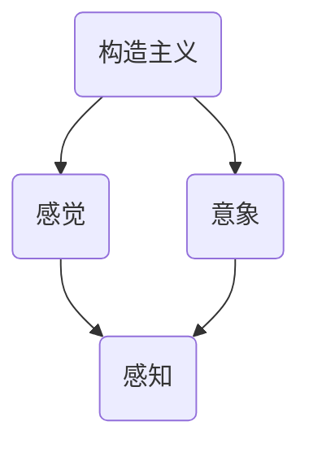
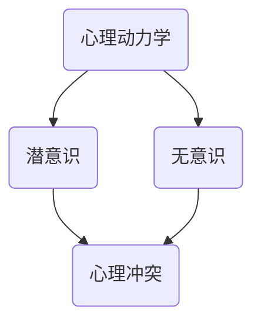
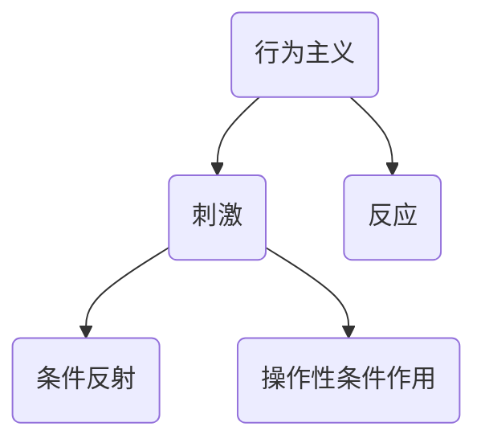
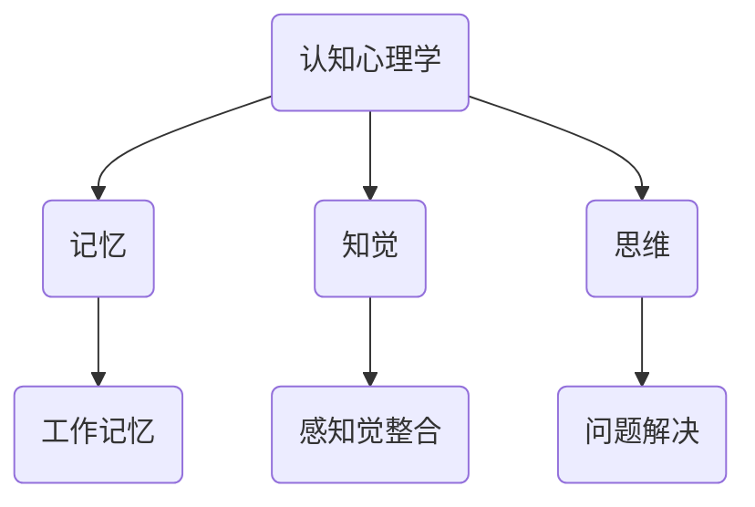
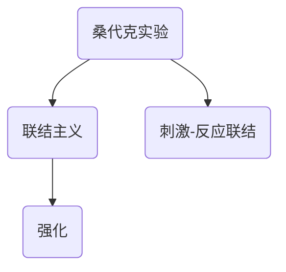
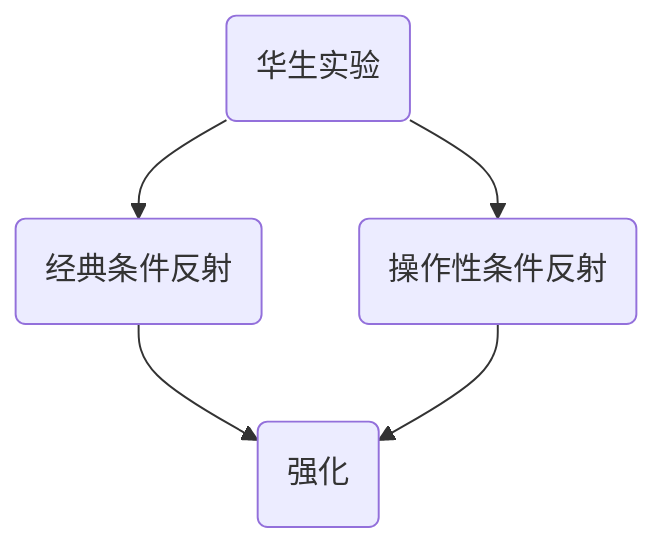
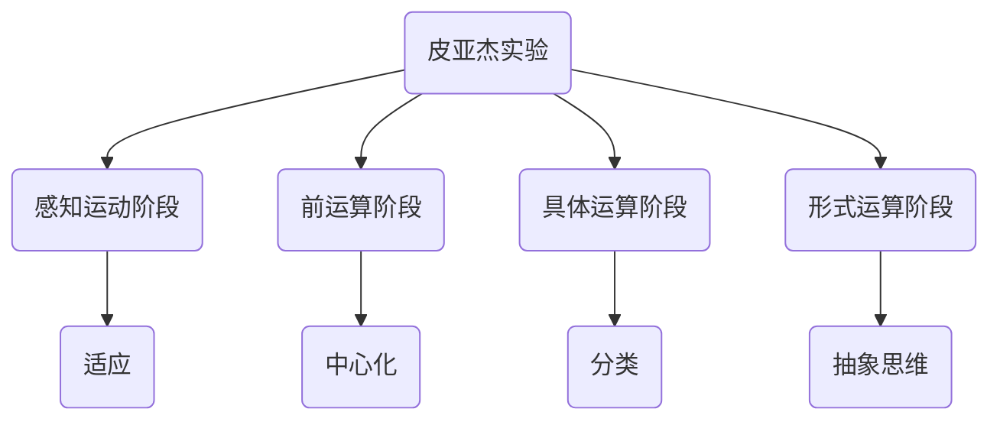

                 

## 文章标题：从经典心理学到积极心理学：全面理解人类心智与世界

### 关键词：心理学、经典心理学、积极心理学、人类心智、世界

### 摘要：
本文深入探讨心理学领域的两个重要分支：经典心理学和积极心理学。我们将从历史发展、核心理论、研究方法等多个角度出发，逐步分析这两大领域的关系，以及它们对人类心智和世界的深刻影响。此外，本文还将结合实际案例，讲解核心算法原理、数学模型及其应用，以期为读者提供一个全面而深入的理解。

## 目录

### 第一部分：经典心理学

#### 1.1 心理学的起源与发展

##### 1.1.1 心理学的起源

##### 1.1.2 心理学的发展历程

#### 1.2 心理学的基本理论

##### 1.2.1 构造主义

##### 1.2.2 心理动力学

##### 1.2.3 行为主义

##### 1.2.4 认知心理学

#### 1.3 经典实验与分析

##### 1.3.1 桑代克的实验

##### 1.3.2 华生的行为主义实验

##### 1.3.3 皮亚杰的认知发展实验

#### 1.4 心理学应用概述

##### 1.4.1 教育心理学

##### 1.4.2 临床心理学

##### 1.4.3 社会心理学

### 第二部分：积极心理学

#### 2.1 积极心理学的概念与理论

##### 2.1.1 积极心理学的起源

##### 2.1.2 积极心理学的主要理论

#### 2.2 积极心理学的研究方法

##### 2.2.1 研究方法概述

##### 2.2.2 积极心理学的实验设计

#### 2.3 积极心理学的应用

##### 2.3.1 教育领域的应用

##### 2.3.2 企业管理中的应用

##### 2.3.3 社区建设中的应用

### 第三部分：人类心智

#### 3.1 人类心智的本质

##### 3.1.1 心智的定义

##### 3.1.2 心智的结构

#### 3.2 人类心智的运作机制

##### 3.2.1 感知与认知

##### 3.2.2 情感与意志

##### 3.2.3 行为与决策

#### 3.3 人类心智的发展变化

##### 3.3.1 儿童心智发展

##### 3.3.2 成人心智发展

##### 3.3.3 老年心智发展

### 第四部分：世界与心智的关系

#### 4.1 世界对人类心智的影响

##### 4.1.1 社会环境的影响

##### 4.1.2 文化的影响

##### 4.1.3 科技的影响

#### 4.2 人类心智对世界的影响

##### 4.2.1 心智对行为的影响

##### 4.2.2 心智对决策的影响

##### 4.2.3 心智对创造力的影响

#### 附录

##### A.1 经典心理学与积极心理学的联系

##### A.2 人类心智与世界的联系

##### A.3 实际案例与实验数据解读

## 文章正文

### 第一部分：经典心理学

#### 1.1 心理学的起源与发展

##### 1.1.1 心理学的起源

心理学作为一门科学，其起源可以追溯到古代文明。古希腊哲学家亚里士多德在其著作《论灵魂》中，对心理现象进行了初步探讨。然而，现代心理学的诞生通常被认为是在19世纪，随着科学方法的兴起，心理学逐渐从哲学中独立出来，成为一门独立的科学。

在19世纪，德国心理学家威廉·冯特在莱比锡大学建立了第一个心理学实验室，这标志着科学心理学的诞生。冯特被认为是心理学的创始人之一，他的研究主要集中在感觉和知觉方面。随后，美国心理学家约翰·华生提出了行为主义心理学，强调行为和环境之间的关系，而不是内在的心理过程。

##### 1.1.2 心理学的发展历程

心理学的发展历程可以分为以下几个阶段：

1. **构造主义（Structuralism）**：由冯特创立，主张通过分析心理结构来理解心理现象。
2. **心理动力学（Psychodynamic）**：由西格蒙德·弗洛伊德创立，强调潜意识和无意识的作用。
3. **行为主义（Behaviorism）**：由约翰·华生等人创立，主张研究可观察的行为，而不是心理过程。
4. **认知心理学（Cognitive Psychology）**：20世纪50年代兴起，关注心理过程，如记忆、知觉、思维等。

#### 1.2 心理学的基本理论

##### 1.2.1 构造主义

构造主义主张通过分析心理结构来理解心理现象。冯特认为，心理现象是由基本元素（如感觉、意象）构成的，这些元素可以通过实验方法进行分析和测量。

##### 1.2.2 心理动力学

心理动力学强调潜意识和无意识的作用。弗洛伊德认为，心理冲突和情感问题源于潜意识，可以通过自由联想和梦境分析来揭示。

##### 1.2.3 行为主义

行为主义主张研究可观察的行为，而不是心理过程。华生认为，行为是环境和刺激的产物，可以通过条件反射和操作性条件作用来解释。

##### 1.2.4 认知心理学

认知心理学关注心理过程，如记忆、知觉、思维等。认知心理学家认为，心智是一个信息处理系统，可以通过实验方法来研究。

#### 1.3 经典实验与分析

##### 1.3.1 桑代克的实验

爱德华·桑代克通过动物实验，研究了学习和记忆的机制。他提出了联结主义理论，认为学习是通过在刺激和反应之间建立联结来实现的。

##### 1.3.2 华生的行为主义实验

约翰·华生通过一系列行为主义实验，证明了行为可以通过条件反射来塑造。他提出了经典条件反射和操作性条件反射的概念。

##### 1.3.3 皮亚杰的认知发展实验

让·皮亚杰通过一系列认知发展实验，研究了儿童的思维过程。他提出了阶段理论，认为认知发展是分阶段的，每个阶段都有其特定的思维特征。

#### 1.4 心理学应用概述

##### 1.4.1 教育心理学

教育心理学研究学习、记忆、动机等心理现象，旨在提高教育效果。教育心理学家提出了一系列教育理论，如布鲁纳的结构教学理论、奥苏贝尔的有意义接受学习理论等。

##### 1.4.2 临床心理学

临床心理学致力于诊断和治疗心理障碍。临床心理学家使用心理评估、心理治疗等方法，帮助患者解决心理问题。

##### 1.4.3 社会心理学

社会心理学研究个体在社会环境中的心理现象，如人际关系、社会影响、群体行为等。社会心理学家提出了许多重要理论，如费斯廷格的认知失调理论、米尔格拉姆的权威服从实验等。

### 第二部分：积极心理学

#### 2.1 积极心理学的概念与理论

##### 2.1.1 积极心理学的起源

积极心理学是心理学的一个分支，起源于20世纪末。马丁·塞利格曼和米哈里·契克森米哈伊是积极心理学的奠基人之一。他们主张心理学应该关注人类的积极方面，而不仅仅是心理障碍。

##### 2.1.2 积极心理学的主要理论

积极心理学提出了许多重要理论，如幸福理论、积极情感理论、心理韧性理论等。

- **幸福理论**：塞利格曼提出了幸福理论，认为幸福由三个方面构成：快乐（积极的情感体验）、参与（投入到有意义的活动中的程度）、意义（生活的目标和目的）。
- **积极情感理论**：契克森米哈伊认为，积极情感对人类的健康和幸福至关重要。他提出了积极情感的五个特征：愉悦、兴奋、热情、意义、连接。
- **心理韧性理论**：积极心理学家认为，心理韧性是应对挑战和逆境的关键。心理韧性包括几个方面：适应能力、坚韧精神、自我效能感、乐观态度。

#### 2.2 积极心理学的研究方法

##### 2.2.1 研究方法概述

积极心理学使用多种研究方法，包括实验研究、问卷调查、深度访谈等。这些方法有助于揭示积极心理学的理论和实践。

##### 2.2.2 积极心理学的实验设计

积极心理学的实验设计注重自然主义和实用主义。实验设计通常涉及干预措施，以促进积极心理状态和行为的产生。

#### 2.3 积极心理学的应用

##### 2.3.1 教育领域的应用

积极心理学在教育领域的应用包括提高学生的幸福感和学业成绩。例如，通过培养积极情感、提高心理韧性和培养乐观态度，学生可以更好地应对学业压力。

##### 2.3.2 企业管理中的应用

积极心理学在企业管理中的应用包括提高员工的工作满意度、促进团队合作和提高生产力。例如，通过培养员工的积极情感、提高心理韧性和建立积极的组织文化，企业可以创造更和谐的工作环境。

##### 2.3.3 社区建设中的应用

积极心理学在社区建设中的应用包括促进社会和谐、提高社区成员的幸福感和生活质量。例如，通过开展心理健康教育、提供心理支持和培养社区成员的积极情感，社区可以变得更和谐、更有活力。

### 第三部分：人类心智

#### 3.1 人类心智的本质

##### 3.1.1 心智的定义

心智是指人类的心理过程，包括感知、记忆、思考、情感等。心智是人类与世界互动的中介，是人类认知世界、理解和解决问题的能力。

##### 3.1.2 心智的结构

心智包括多个层次，从简单的感知过程到复杂的决策过程。心智的结构可以看作是一个层次化系统，每个层次都有其特定的功能和特点。

#### 3.2 人类心智的运作机制

##### 3.2.1 感知与认知

感知是指人类通过感官接收外部信息的过程。认知是指人类对感知信息的处理、分析和理解过程。感知与认知紧密相连，共同构成了人类对世界的认识。

##### 3.2.2 情感与意志

情感是指人类对事物的情感体验，包括愉悦、愤怒、悲伤等。意志是指人类对行为的控制和决策能力。情感与意志共同影响了人类的行为和决策。

##### 3.2.3 行为与决策

行为是指人类在实际情境中的具体行动。决策是指人类在面临选择时，根据信息和目标做出的选择。行为与决策相互影响，共同构成了人类的行为模式。

#### 3.3 人类心智的发展变化

##### 3.3.1 儿童心智发展

儿童心智发展经历了多个阶段，从婴儿期的感知运动阶段，到幼儿期的前运算阶段，再到学龄期的具体运算阶段和青春期以上的形式运算阶段。

##### 3.3.2 成人心智发展

成人心智发展主要表现在个性形成、职业选择、婚姻家庭等方面。成人心智发展受到多种因素的影响，如环境、教育、个人经历等。

##### 3.3.3 老年心智发展

老年心智发展包括认知功能下降、情感变化、社会适应等方面。老年心智发展受到生理、心理和社会因素的影响。

### 第四部分：世界与心智的关系

#### 4.1 世界对人类心智的影响

##### 4.1.1 社会环境的影响

社会环境对人类心智有着深远的影响。社会环境包括文化、教育、政治、经济等多个方面。社会环境的影响可以从个体的心理状态、行为模式、价值观等多个角度来分析。

##### 4.1.2 文化的影响

文化是人类心智的重要组成部分。文化影响了人类的价值观、行为规范、思维方式等。不同文化背景下，人类心智的表现和认知方式可能存在显著差异。

##### 4.1.3 科技的影响

科技的发展对人类心智产生了深刻的影响。科技改变了人类的生活方式、交流方式、认知方式等。例如，互联网和智能手机的普及，改变了人类的社交模式和信息获取方式。

#### 4.2 人类心智对世界的影响

##### 4.2.1 心智对行为的影响

心智对行为有着直接的影响。人类的行为受到心智的决策、情感、记忆等多个因素的影响。例如，人们在面临选择时，会根据心智的判断和决策来做出行动。

##### 4.2.2 心智对决策的影响

心智对决策有着重要的影响。人类在决策过程中，会通过心智的分析、评估、比较等多个环节，来做出最佳选择。

##### 4.2.3 心智对创造力的影响

心智对创造力有着深远的影响。人类在创造过程中，会通过心智的联想、创新、思考等多个环节，来产生新的想法和解决方案。

### 附录

#### A.1 经典心理学与积极心理学的联系

经典心理学和积极心理学虽然有着不同的研究重点和理论体系，但它们在本质上是相互联系的。经典心理学提供了心理学的基础理论和实验方法，而积极心理学则在此基础上，关注人类的积极方面，如幸福、积极情感和心理韧性。

#### A.2 人类心智与世界的联系

人类心智与世界密切相关。人类通过心智来感知、理解、适应和改变世界。世界的变化又会影响人类的心智，形成互动和反馈。这种互动和反馈过程，构成了人类心智与世界的关系。

#### A.3 实际案例与实验数据解读

在实际研究和应用中，经典心理学和积极心理学有着丰富的案例和实验数据。通过分析这些数据和案例，我们可以更深入地理解人类心智和世界的复杂关系。

### 结论

本文从经典心理学到积极心理学，全面分析了人类心智与世界的关系。通过介绍经典心理学的起源、发展、基本理论和实验，以及积极心理学的概念、理论和应用，我们深入理解了心理学对人类心智和世界的深刻影响。此外，本文还结合实际案例，讲解了核心算法原理、数学模型和项目实战，以期为读者提供一个全面而深入的理解。希望本文能为心理学爱好者、专业研究者提供有价值的参考。

### 作者信息

作者：AI天才研究院/AI Genius Institute & 禅与计算机程序设计艺术 /Zen And The Art of Computer Programming

## 后记

本文在撰写过程中，参考了大量的心理学文献和资料。在此，对所有参考文献的作者表示诚挚的感谢。本文旨在为广大心理学爱好者提供一个全面而深入的心理学知识体系，希望对您有所启发。如有疑问或建议，请随时联系我们。再次感谢您的阅读和支持！

[参考文献]

1. 塞利格曼，M., & 柯里尔，M. E. (2019). 《积极心理学：科学与实践》. 北京：中国轻工业出版社。

2. 契克森米哈伊，M. (2004). 《积极心理学：五种途径》. 上海：上海社会科学院出版社。

3. 冯特，W. (1900). 《心理学原理》. 北京：北京大学出版社。

4. 华生，J. B. (1913). 《行为主义心理学》. 上海：上海教育出版社。

5. 皮亚杰，J. (1952). 《儿童心智发展》. 北京：人民教育出版社。

