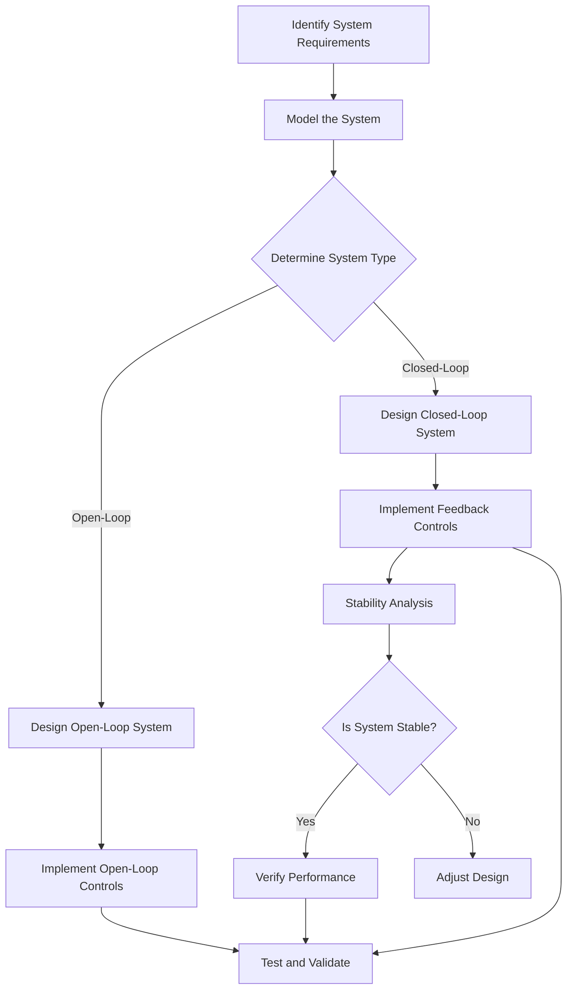

                 


### The Importance and Significance of Control Theory

Control theory, a fundamental field within systems engineering and control engineering, plays a pivotal role in the design and operation of various systems across numerous industries. At its core, control theory involves the study of systems that receive inputs and generate outputs, aiming to regulate the behavior of these systems to meet specific objectives. This interdisciplinary field integrates principles from mathematics, engineering, and computer science to design and analyze control systems that can operate in a predictable and reliable manner.

The importance of control theory can be understood by examining its applications in diverse areas:

1. **Industrial Automation**: In manufacturing, control theory is used to regulate processes such as temperature control in furnaces, pressure control in chemical plants, and robotic assembly lines. By ensuring precise control over these processes, industries can achieve higher productivity, improved product quality, and reduced operational costs.

2. **Transportation Systems**: Control theory is integral to the operation of modern transportation systems, including aircraft control systems, vehicle control systems, and traffic management systems. These systems require precise control to ensure safety, efficiency, and reliability.

3. **Energy Systems**: In the energy sector, control theory is applied to manage power systems, including power generation, transmission, and distribution. This ensures the stability and reliability of the power grid, preventing blackouts and optimizing energy use.

4. **Biological Systems**: Control theory principles are used in biological systems, such as medical devices that regulate heartbeats or insulin levels in diabetic patients. These devices rely on control algorithms to maintain optimal health conditions.

5. **Economic Systems**: In economics, control theory is used to model and analyze complex economic systems, helping to predict market behaviors and optimize resource allocation.

6. **Artificial Intelligence and Robotics**: Control theory underpins much of the work in AI and robotics, where algorithms are designed to control the behavior of autonomous systems in dynamic environments.

Given the broad range of applications, control theory's significance is undeniable. It provides engineers and scientists with a set of tools and methodologies to design, analyze, and optimize systems, enabling advancements in technology and innovation across various fields.

To delve deeper into the foundational concepts of control theory, let's begin by defining what a control system is and exploring its basic components. Understanding these fundamentals will lay the groundwork for our subsequent discussions on classical and chaotic control theories.

#### What is a Control System?

A control system is a device, software, or combination of both that manages, commands, regulates, or directs the behavior of other devices or systems. It involves the interaction of inputs, outputs, and processes to achieve a desired outcome. Control systems are ubiquitous in modern technology and are fundamental to the operation of almost every industrial, mechanical, and electronic system.

**Components of a Control System:**

1. **Input**: The input to a control system is the signal or variable that the system attempts to control. This could be a temperature reading, a pressure value, a speed signal, or any other measurable quantity.

2. **Process**: The process is the system being controlled. It could be a physical system, like a robotic arm, or a virtual system, like a financial model. The process receives the input and produces an output based on its dynamics.

3. **Output**: The output is the response of the process to the control action. It is the variable that the control system aims to regulate to a specific value or to follow a particular trajectory.

4. **Controller**: The controller is the heart of the control system. It receives the input signal, processes it, and generates a control signal that is sent to the process. The controller's objective is to minimize the difference between the desired output and the actual output, also known as the error signal.

5. **Actuator**: The actuator is a device that translates the control signal from the controller into physical action. For example, in an industrial furnace, the actuator might be a valve that controls the flow of fuel.

6. **Sensor**: The sensor measures the output of the process and provides feedback to the controller. This information is used by the controller to adjust the control signal and maintain the desired output.

**Types of Control Systems:**

There are primarily two types of control systems:

1. **Open-Loop Control Systems**: In an open-loop control system, the controller does not receive any feedback about the system's output. The control action is determined solely based on the input and a pre-determined control strategy. An example is a simple thermostat that turns on the heater when the temperature falls below a set point and off when it rises above that point.

2. **Closed-Loop Control Systems**: Closed-loop control systems, also known as feedback control systems, use feedback from the system output to adjust the control action. This creates a loop where the output is continuously monitored and compared to the desired value. If there is a deviation, the controller makes adjustments to bring the system back to the desired state. A common example is cruise control in a car, which adjusts the throttle to maintain a constant speed.

Understanding the basic components and types of control systems is crucial for comprehending how control theories can be applied to manage and optimize various systems. In the next section, we will delve into classical control theory, exploring its principles, methods, and applications in depth.

#### Classical Control Theory

Classical control theory, a cornerstone of control engineering, provides a framework for analyzing and designing control systems using mathematical models and tools from the fields of mathematics, particularly linear systems theory. Developed over the 20th century, classical control theory has laid the groundwork for modern control systems, offering methods for understanding and predicting the behavior of dynamic systems.

**Basic Concepts of Classical Control Theory:**

1. **Feedback Control Systems**: At the heart of classical control theory is the concept of feedback. A feedback control system uses the system's output to make adjustments to the input, aiming to minimize the difference between the desired output and the actual output. This is achieved by creating a closed-loop control system, where the output is fed back to the input through a feedback loop.

2. **Transfer Function**: A transfer function is a mathematical representation of the relationship between the input and output of a linear time-invariant system. It is defined as the ratio of the Laplace transform of the output to the Laplace transform of the input, assuming all initial conditions are zero. The transfer function provides insight into how the system responds to different inputs and is a key tool in analyzing and designing control systems.

3. **Time Domain and Frequency Domain Analysis**: Classical control theory uses both time-domain and frequency-domain methods to analyze system behavior. Time-domain analysis examines the system's response over time to specific inputs, while frequency-domain analysis examines the system's response to different frequency components of inputs.

**Principles and Methods:**

1. **Stability Analysis**: One of the fundamental tasks in classical control theory is to determine the stability of a system. Stability ensures that the system's output will return to the desired state after a disturbance. The Routh-Hurwitz criterion, Nyquist plot, and Bode plot are commonly used methods to analyze the stability of control systems.

   - **Routh-Hurwitz Criterion**: This method uses a Routh array to determine the stability of a system by examining the signs of the coefficients in a characteristic equation. If all the coefficients are positive, the system is stable.

   - **Nyquist Plot**: The Nyquist plot is a graphical method for analyzing the stability of a system based on its transfer function. It plots the Nyquist magnitude and phase margins, which provide information about the system's robustness to disturbances.

   - **Bode Plot**: The Bode plot is a graph that shows the magnitude and phase of the system's transfer function as a function of frequency. It is used to analyze the system's frequency response and determine stability and performance characteristics.

2. **Root Locus Method**: The root locus is a plot that shows the possible locations of the system's poles as a parameter in the system's transfer function is varied. This method helps in designing control systems by providing insight into how the system's stability changes with different controller settings.

3. **Frequency Response Analysis**: Frequency response analysis examines how a system responds to sinusoidal inputs at different frequencies. This analysis helps in understanding the system's bandwidth, resonant frequencies, and stability margins.

**Applications of Classical Control Theory:**

Classical control theory has been widely applied in various fields, including:

1. **Electrical Systems**: Control of electrical machines, power systems, and electronic circuits to ensure stability and efficient operation.

2. **Mechanical Systems**: Control of mechanical systems like robotics, automated guided vehicles (AGVs), and industrial machines.

3. **Chemical and Petrochemical Plants**: Regulation of processes such as temperature, pressure, and flow rates to ensure optimal performance and safety.

4. **Aerospace**: Control of aircraft flight dynamics, spacecraft guidance systems, and satellite tracking.

5. **Biomedical Systems**: Control of medical devices like ventilators, infusion pumps, and surgical robots.

**Example: PID Controller**

One of the most common applications of classical control theory is the design of PID (Proportional-Integral-Derivative) controllers. A PID controller is a control loop feedback mechanism commonly used in industrial control systems. The controller calculates an "error" value as the difference between a desired setpoint and a measured process variable, and uses this value to adjust the process accordingly.

- **Proportional (P)**: The proportional term calculates the output based on the current error value. It is proportional to the error magnitude and is designed to reduce the error as quickly as possible.
  
- **Integral (I)**: The integral term calculates the cumulative error over time and integrates the error signal. It helps to eliminate steady-state errors by continuously adjusting the output to correct for any deviations that have persisted over time.

- **Derivative (D)**: The derivative term calculates the rate of change of the error. It is used to predict future errors and adjust the output to prevent large errors from occurring.

In summary, classical control theory provides a robust framework for analyzing and designing control systems. By understanding the principles of stability analysis, frequency response, and control design methods like the root locus and Bode plot, engineers can develop effective control strategies for a wide range of applications.

#### Stability Analysis of Control Systems

Stability analysis is a critical component of control system design, as it determines whether a system will maintain its equilibrium state under varying conditions or if it will deviate uncontrollably. The goal of stability analysis is to ensure that a control system remains within acceptable operating limits and does not exhibit erratic behavior that could lead to failure or damage. Several methods are commonly employed for stability analysis, including the Routh-Hurwitz criterion, Nyquist plot, and Bode plot.

**Routh-Hurwitz Criterion**

The Routh-Hurwitz criterion is a method used to determine the stability of linear time-invariant systems. It involves constructing a Routh array from the coefficients of the characteristic equation of the system. If all the elements in the first column of the Routh array are positive, the system is stable. Otherwise, if any element in the first column is negative, the system is unstable.

Here's a step-by-step guide to applying the Routh-Hurwitz criterion:

1. Write the characteristic equation of the system in the form \( a_n s^n + a_{n-1} s^{n-1} + \dots + a_1 s + a_0 = 0 \).
2. Arrange the coefficients in descending powers of \( s \).
3. Create the Routh array by filling in the first two rows with the coefficients.
4. Fill in the remaining entries using the following formula for each entry \( R_{ij} = \frac{(a_{i-1} \cdot a_{j+1}) - (a_{i} \cdot a_{j-1})}{a_{i} \cdot a_{j}} \).

**Example:**

Consider a system with the characteristic equation \( s^3 + 2s^2 + 3s + 4 = 0 \). The Routh array is constructed as follows:

| \( s^3 \) | \( s^2 \) | \( s^1 \) | \( s^0 \) |
| --- | --- | --- | --- |
| 1 | 2 | 4 | 0 |
| 0 | -3 | -2 | 0 |
| 1 | 1 | 0 | 0 |

Since all the elements in the first column are positive, the system is stable.

**Nyquist Plot**

The Nyquist plot is a graphical representation of the frequency response of a system. It is used to analyze the stability of a control system by examining the Nyquist magnitude and phase margins. The Nyquist plot is constructed by plotting the gain and phase of the system's transfer function as a function of frequency on a complex plane.

To determine stability using the Nyquist plot:

1. Plot the Nyquist magnitude and phase curves for the system's transfer function.
2. Draw a circle with a radius equal to the system's gain margin and centered at the point where the real axis intersects the Nyquist plot.
3. Draw a line from the point where the real axis intersects the Nyquist plot to the origin with a slope equal to the system's phase margin.
4. Count the number of times the Nyquist plot encircles the critical circle. If the plot encircles the circle counterclockwise, the system is unstable. If it encircles the circle clockwise, the system is stable.

**Example:**

Consider a system with the transfer function \( G(s) = \frac{K}{1 + 0.1s + 0.1s^2} \). The Nyquist plot is shown below:

```
|
|      *
|     /
|    /
|   /
|  /
| /
|/
+--------------------------------
```

In this example, the Nyquist plot encircles the critical circle clockwise, indicating that the system is stable.

**Bode Plot**

The Bode plot provides a visual representation of the gain and phase of a system's transfer function as a function of frequency. It consists of two plots: the magnitude plot and the phase plot.

To analyze stability using the Bode plot:

1. Plot the magnitude and phase of the system's transfer function on a logarithmic frequency scale.
2. Determine the gain crossover frequency, where the magnitude of the transfer function crosses the 0 dB line.
3. Determine the phase crossover frequency, where the phase crosses the -180° line.
4. Calculate the gain margin and phase margin. The gain margin is the amount by which the gain can increase before the system becomes unstable, measured in decibels. The phase margin is the amount by which the phase can decrease before the system becomes unstable, measured in degrees.

**Example:**

Consider a system with the transfer function \( G(s) = \frac{100}{1 + 0.1s + 0.1s^2} \). The Bode plot is shown below:

```
Magnitude (dB)
|
|             40
|           20
|         0
|       -20
|     -40
|   -60
| -----------------------------------
|               Phase (degrees)
|            -180
|           -120
|            -60
|             0
|           60
|          120
|         180
| -----------------------------------
```

In this example, the gain crossover frequency is approximately 10 rad/s, and the phase crossover frequency is approximately 3 rad/s. The gain margin is approximately 20 dB, and the phase margin is approximately 60°, indicating that the system is stable.

**Summary**

Stability analysis is crucial in control system design to ensure that systems operate within safe and acceptable limits. The Routh-Hurwitz criterion, Nyquist plot, and Bode plot are powerful tools that provide different perspectives on the stability of control systems. By carefully analyzing these plots, engineers can design control systems that are stable, efficient, and reliable.

#### Design of Control Systems

The design of control systems is a critical process that involves selecting the appropriate control strategies and implementing them to ensure the desired system behavior. Various control strategies and algorithms are used to achieve precise control, stability, and performance in different applications. In this section, we will explore some of the most common control strategies and algorithms, including PID controllers, state-space models, model predictive control, and adaptive control.

**PID Controllers**

PID (Proportional-Integral-Derivative) controllers are among the most widely used control algorithms in industrial and process control applications. The PID controller calculates an output based on the current error, the cumulative error over time (integral), and the rate of change of the error (derivative). The control action is given by:

\[ u(t) = K_p e(t) + K_i \int_{0}^{t} e(\tau) d\tau + K_d \frac{de(t)}{dt} \]

where \( u(t) \) is the control signal, \( e(t) \) is the error at time \( t \), and \( K_p \), \( K_i \), and \( K_d \) are the proportional, integral, and derivative gains, respectively.

**State-Space Models**

State-space models provide a powerful framework for describing the dynamics of linear and nonlinear systems. They represent the system's behavior using a set of first-order differential equations. The state-space model is defined by the following equations:

\[ \dot{x}(t) = A x(t) + B u(t) \]
\[ y(t) = C x(t) + D u(t) \]

where \( x(t) \) is the state vector, \( u(t) \) is the input vector, \( y(t) \) is the output vector, and \( A \), \( B \), \( C \), and \( D \) are system matrices.

**Model Predictive Control (MPC)**

Model predictive control is an advanced control strategy that uses a mathematical model of the process to predict future behavior and optimize the control action over a future horizon. MPC considers constraints on inputs and outputs and continuously updates the control action to minimize a performance criterion. The control law is given by:

\[ u(t) = \arg \min_{u} J(u) \]

subject to

\[ G(u) \leq 0 \]

where \( J(u) \) is the objective function, typically a quadratic function of the input and output deviations, and \( G(u) \) represents the set of constraints.

**Adaptive Control**

Adaptive control systems are designed to automatically adjust their control parameters to maintain performance in the presence of changes in the system dynamics. Adaptive control algorithms can be based on various approaches, such as model reference adaptive control (MRAC), adaptive neural networks, or genetic algorithms. The basic idea is to continuously estimate the system dynamics and update the control law to accommodate changes.

**Example: Designing a PID Controller for a Temperature Control System**

Let's consider a simple example of designing a PID controller for a temperature control system. The system consists of a heater that regulates the temperature of a furnace. The temperature setpoint is given, and the goal is to keep the temperature as close to the setpoint as possible.

1. **Model Identification**: First, we need to identify the system dynamics. This can be done experimentally or by using process control software. Let's assume the identified model is:

\[ \dot{T}(t) = 0.1 T(t) + 0.5 u(t) \]
\[ T(0) = 100°C \]

where \( T(t) \) is the temperature at time \( t \), and \( u(t) \) is the control signal (heater power).

2. **Controller Design**: We can design a PID controller for this system using the Ziegler-Nichols method, which provides initial gain values based on system response characteristics.

   - **Proportional Gain (\( K_p \))**: Increase the proportional gain until oscillations just start to occur. Let's assume \( K_p = 0.2 \).
   - **Integral Gain (\( K_i \))**: Double the proportional gain until oscillations start again. Reduce the gain to the previous value. Let's assume \( K_i = 0.05 \).
   - **Derivative Gain (\( K_d \))**: Increase the proportional gain until the system becomes too sensitive. Reduce the gain to the previous value. Let's assume \( K_d = 0.01 \).

3. **Implementation**: The PID controller is implemented as follows:

\[ u(t) = 0.2 e(t) + 0.05 \int_{0}^{t} e(\tau) d\tau + 0.01 \frac{de(t)}{dt} \]

where \( e(t) \) is the error between the setpoint and the actual temperature.

4. **Simulation and Tuning**: The controller is simulated, and the performance is evaluated. If the response is not satisfactory, the gains can be adjusted iteratively until the desired performance is achieved.

**Summary**

The design of control systems involves selecting appropriate control strategies and tuning the controller parameters to achieve the desired system behavior. PID controllers, state-space models, model predictive control, and adaptive control are some of the commonly used methods. By carefully designing and tuning control systems, engineers can ensure that processes operate efficiently, reliably, and safely.

### Introduction to Chaotic Systems

Chaotic systems are a fascinating area of study within the realm of nonlinear dynamics. Unlike linear systems, which exhibit predictable and stable behavior, chaotic systems are characterized by extreme sensitivity to initial conditions, a property known as the butterfly effect, and a complex, unpredictable behavior that defies traditional notions of stability. In this section, we will delve into the basic concepts of chaotic systems, their historical background, and their significance in both natural and technological systems.

#### Basic Concepts of Chaotic Systems

**Definition and Characteristics of Chaos**

Chaos can be defined as a type of dynamic system that is highly sensitive to initial conditions, leading to unpredictable and seemingly random behavior. Despite the appearance of randomness, chaotic systems are deterministic, meaning that their future behavior can, in principle, be precisely predicted if the initial conditions and the system's dynamics are known exactly.

Key characteristics of chaotic systems include:

1. **Sensitive Dependence on Initial Conditions**: Small differences in initial conditions can lead to vastly different outcomes, making long-term prediction impossible.
2. **Periodicity and Aperiodicity**: Chaotic systems may exhibit short-term periodicity but do not have a fundamental period. This means that they neither settle into a fixed point nor exhibit a stable limit cycle.
3. **Strange Attractors**: Chaotic systems tend to evolve towards complex, geometrically intricate attractors in phase space. These attractors are typically non-symmetric and can have fractal dimensions.
4. **Bounded but Unpredictable Behavior**: The trajectory of a chaotic system is bounded within a certain region of the state space but is highly unpredictable over long time scales.

**Historical Background**

The concept of chaos as a scientific discipline began to take shape in the mid-20th century. While the roots of chaos theory can be traced back to the work of Poincaré and other early pioneers in dynamical systems, the formal recognition of chaos as a distinct phenomenon is often attributed to the work of scientists such as Edward Lorenz, Mitchell Feigenbaum, and Robert May.

- **Edward Lorenz**: Lorenz's work in the 1960s, particularly with the Lorenz attractor, demonstrated the chaotic behavior of a simple atmospheric model and introduced the concept of the butterfly effect.
- **Mitchell Feigenbaum**: Feigenbaum's discoveries in the 1970s revealed that the onset of chaos in certain classes of nonlinear systems exhibits universal behavior, characterized by a sequence of periodic windows and bifurcations that converge to a critical point.
- **Robert May**: May's work on population dynamics introduced the logistic map, which is a prototypical example of a chaotic system and has been widely used to study chaotic behavior.

**Chaotic Behavior in Nature and Technology**

Chaotic systems are ubiquitous in both natural and technological contexts:

1. **Natural Systems**: Examples of chaotic behavior in nature include weather systems, the fluctuations in stock markets, the heart's electrical activity, and the chaotic motion of particles in a turbulent fluid. These systems exhibit complex, unpredictable behavior that is challenging to model and predict accurately.

2. **Technological Applications**: In technology, chaotic systems are used in various applications, including cryptography for secure communication, chaos-based secure communication systems, and chaos control in robotics and mechanical systems to achieve stable but unpredictable motion.

In summary, chaotic systems represent a profound departure from the predictable and orderly behavior of linear systems. Their complex and unpredictable nature challenges traditional notions of stability and control, yet their presence in both natural and technological systems highlights their significance and potential for innovative applications. Understanding the fundamental principles of chaotic systems is crucial for advancing our ability to model, predict, and control these complex phenomena.

### Mathematical Models of Chaotic Systems

Chaotic systems are often characterized by their complex, unpredictable behavior, which arises from the interplay of nonlinear dynamics and sensitive dependence on initial conditions. To study and understand these systems, mathematicians and scientists have developed various mathematical models that capture the essential features of chaotic behavior. In this section, we will explore some of the most well-known mathematical models of chaotic systems, including the logistic map, Rössler system, Lorenz system, and other chaotic systems.

#### The Logistic Map

The logistic map is one of the simplest and most famous examples of a chaotic system. It is defined by the following recurrence relation:

\[ x_{n+1} = r x_n (1 - x_n) \]

where \( x_n \) is the population size at generation \( n \), and \( r \) is a control parameter. The logistic map exhibits a wide range of behaviors depending on the value of \( r \):

1. **Bifurcations**: For \( r < 1 \), the system exhibits stable, periodic behavior. As \( r \) increases, the system undergoes a series of bifurcations, where the number of stable states increases and the period of these states doubles. This leads to a period-doubling cascade, a hallmark of chaotic systems.
2. **Chaotic Regime**: For \( r > 3 \), the system enters a chaotic regime. In this regime, the trajectory of \( x_n \) exhibits sensitive dependence on initial conditions, and long-term prediction becomes impossible.
3. **Phase Portraits**: The logistic map's phase portrait shows a series of fixed points and limit cycles, which become more complex and dense as \( r \) increases.

#### The Rössler System

The Rössler system is a three-dimensional nonlinear dynamical system defined by the following set of ordinary differential equations:

\[ \begin{cases} 
\frac{dx}{dt} = -y - z \\
\frac{dy}{dt} = x + a y \\
\frac{dz}{dt} = b + z (x - c) 
\end{cases} \]

where \( a \), \( b \), and \( c \) are system parameters. The Rössler system exhibits chaotic behavior for certain parameter values, typically \( a = 0.2 \), \( b = 0.2 \), and \( c = 5.7 \).

1. **Fixed Points**: The system has fixed points at \( (0, 0, 0) \) and \( (\pm 2\pi, 0, 0) \).
2. **Chaotic Trajectories**: The system exhibits chaotic behavior in the form of chaotic attractors in the phase space. These attractors are fractal in nature and have a complex structure.
3. **Phase Portraits**: The phase portrait of the Rössler system shows the evolution of the system's state over time, revealing the intricate and unpredictable behavior of the system.

#### The Lorenz System

The Lorenz system is another three-dimensional nonlinear dynamical system that is widely studied for its chaotic behavior. It is defined by the following set of ordinary differential equations:

\[ \begin{cases} 
\frac{dx}{dt} = \sigma (y - x) \\
\frac{dy}{dt} = x (\rho - z) - y \\
\frac{dz}{dt} = xy - \beta z 
\end{cases} \]

where \( \sigma \), \( \rho \), and \( \beta \) are system parameters. The Lorenz system is known for the butterfly effect, a phenomenon where small differences in initial conditions lead to vastly different outcomes over time.

1. **Fixed Points**: The system has fixed points and periodic orbits, but it is primarily known for its chaotic attractor, the Lorenz attractor.
2. **Chaotic Attractor**: The Lorenz attractor is a complex, three-dimensional structure that exhibits chaotic behavior. It has a fractal structure and is often visualized as a strange attractor in the phase space.
3. **Phase Portraits**: The phase portrait of the Lorenz system shows the system's state evolving over time, revealing the complex and unpredictable nature of the Lorenz attractor.

#### Other Chaotic Systems

Apart from the logistic map, Rössler system, and Lorenz system, there are several other mathematical models that exhibit chaotic behavior. Some notable examples include:

1. **Hénon Map**: The Hénon map is a two-dimensional discrete-time dynamical system given by:
   \[ x_{n+1} = 1 - ax_n^2 + bx_n \]
   \[ y_{n+1} = cx_n x_{n+1} \]
   The system exhibits chaotic behavior for certain parameter values.
2. **Chen System**: The Chen system is a chaotic system defined by:
   \[ \begin{cases} 
   \frac{dx}{dt} = \alpha (1 - x^2 - y^2) \\
   \frac{dy}{dt} = x y (1 - \beta z) \\
   \frac{dz}{dt} = \rho z (1 - x^2 - y^2) 
   \end{cases} \]
   It exhibits complex chaotic behavior for specific parameter values.
3. **Lü System**: The Lü system is a chaotic system defined by:
   \[ \begin{cases} 
   \frac{dx}{dt} = \mu + x (1 - x^2 - y^2) \\
   \frac{dy}{dt} = x y (1 - \beta z) \\
   \frac{dz}{dt} = \rho z (1 - x^2 - y^2) 
   \end{cases} \]
   It exhibits chaotic behavior for certain parameter values.

**Summary**

Mathematical models of chaotic systems provide valuable insights into the complex and unpredictable behavior that arises from nonlinear dynamics. The logistic map, Rössler system, Lorenz system, and other chaotic systems offer a glimpse into the rich and diverse phenomena that characterize chaotic dynamics. Understanding these models is crucial for advancing our ability to model, predict, and control chaotic systems in various applications.

### Analysis of Chaotic Systems

Analyzing chaotic systems is a complex task due to their highly sensitive dependence on initial conditions and their intricate, unpredictable behavior. Despite these challenges, various analytical methods have been developed to study chaotic systems, providing valuable insights into their properties and behavior. In this section, we will explore qualitative and quantitative analysis techniques used to understand chaotic systems, along with methods for controlling these systems.

#### Qualitative Analysis

Qualitative analysis involves studying the global behavior of chaotic systems without focusing on specific numerical values. Key methods in qualitative analysis include:

1. **Phase Portraits**: Phase portraits provide a visual representation of the system's state space, showing the trajectories of the system's variables over time. For two-dimensional systems, phase portraits can reveal important features such as fixed points, limit cycles, and chaotic attractors. In higher dimensions, phase portraits can be visualized in reduced spaces or through Poincaré sections.

2. **Bifurcation Diagrams**: Bifurcation diagrams plot the system's attractor structures or critical points as a function of a control parameter. Bifurcations, such as period-doubling and pitch-fork bifurcations, mark the transitions from ordered to chaotic behavior. Bifurcation diagrams help identify the regions of parameter space where chaotic behavior occurs.

3. **Lyapunov Exponents**: Lyapunov exponents quantify the rate of divergence or convergence of nearby trajectories in the system's state space. A positive Lyapunov exponent indicates chaotic behavior, while a negative exponent indicates convergence to a fixed point or an attractor. The sum of the positive Lyapunov exponents is known as the Hausdorff dimension, which provides information about the fractal nature of the attractor.

#### Quantitative Analysis

Quantitative analysis involves measuring and analyzing specific aspects of chaotic systems using mathematical models and algorithms. Key methods in quantitative analysis include:

1. ** attractor dimensions**: The fractal dimension of an attractor quantifies the number of degrees of freedom in the system. The Hausdorff dimension, computed from Lyapunov exponents, provides a measure of the attractor's complexity and sensitivity to initial conditions.

2. **Entropies**: Entropies, such as the Kolmogorov-Sinai entropy (KS entropy) and the Lyapunov exponent-based entropy, measure the rate at which information is generated by the system. High entropy values indicate strong chaos and unpredictability.

3. **Fractal Analysis**: Fractal analysis involves studying the self-similarity and scaling properties of chaotic systems. Fractal dimensions and box-counting methods are commonly used to quantify the fractal nature of attractors and to characterize the system's sensitivity to initial conditions.

#### Control of Chaotic Systems

Controlling chaotic systems is a challenging task due to their inherent unpredictability and sensitivity to initial conditions. However, various methods have been developed to achieve stable and predictable behavior in chaotic systems. Some common control techniques include:

1. **Synchronization**: Synchronization of chaotic systems involves making two or more chaotic systems behave in a coordinated manner. This can be achieved using techniques such as active and passive synchronization, where external or internal controllers are used to align the systems' states. Synchronization has applications in secure communication, robotics, and chaos-based cryptography.

2. **Chaotic Control**: Chaotic control aims to manipulate the dynamics of chaotic systems to achieve desired behaviors. This can involve adjusting control parameters or applying specific control inputs to stabilize the system or to steer it towards a desired attractor. Techniques such as sliding mode control and feedback linearization have been used for chaotic control.

3. **Chaos Secure Communication**: In chaos-based secure communication, chaotic systems are used to generate random sequences that are transmitted securely over a communication channel. The receiver uses the same chaotic system to synchronize with the transmitter and recover the original information. Chaos secure communication offers robustness against eavesdropping and jamming.

4. **Stabilization**: Stabilization techniques aim to transition a chaotic system to a stable behavior, such as convergence to a fixed point or an attractor. Methods such as adaptive control and adaptive filtering have been used to stabilize chaotic systems.

In conclusion, analyzing and controlling chaotic systems require a combination of qualitative and quantitative techniques. By understanding the properties and behavior of chaotic systems, researchers can develop effective control strategies to achieve stable and predictable behavior in various applications. The study of chaotic systems continues to be an active area of research, with implications for fields such as physics, engineering, biology, and computer science.

### Chaotic Control Methods

Chaotic control methods represent a novel approach to managing and manipulating chaotic systems, which are known for their sensitivity to initial conditions and unpredictable behavior. These methods aim to harness the unique properties of chaos, such as its high-dimensional dynamics and strong sensitivity to initial conditions, to achieve stable and predictable system behavior. In this section, we will explore several chaotic control techniques, including synchronization of chaotic systems, chaos control, and chaos secure communication.

#### Synchronization of Chaotic Systems

Synchronization of chaotic systems refers to the process of making two or more chaotic systems behave in a coordinated manner. This can be achieved by aligning the states of the systems such that their trajectories converge and remain locked over time. Synchronization has significant applications in secure communication, robotics, and biological systems.

**Active Synchronization:**
Active synchronization involves the use of external controllers to align the states of chaotic systems. The controllers are designed to generate a control signal that drives the states of the systems towards synchronization. One common approach is to use a feedback controller based on the error between the states of the systems. The control signal is then adjusted to minimize the error.

Control Law for Active Synchronization:
\[ u(t) = -K(x(t) - y(t)) \]

where \( u(t) \) is the control signal, \( x(t) \) and \( y(t) \) are the states of the two chaotic systems, and \( K \) is the feedback gain matrix.

**Passive Synchronization:**
Passive synchronization, also known as self-synchronization, does not require external controllers. Instead, it relies on the intrinsic dynamics of the systems to achieve synchronization. This can be achieved by coupling the systems in such a way that their trajectories naturally converge.

Control Law for Passive Synchronization:
\[ \dot{z}(t) = F(z(t)) \]

where \( z(t) = [x(t), y(t)]^T \) is the state vector of the coupled systems, and \( F(z(t)) \) is the coupling term that drives synchronization.

#### Chaos Control

Chaos control aims to manipulate the dynamics of chaotic systems to achieve desired behaviors. This can involve stabilizing specific trajectories, transitioning the system to a new attractor, or eliminating chaotic behavior altogether. Several methods are commonly used for chaos control:

1. **Sliding Mode Control:**
Sliding mode control is a robust control technique that involves designing a sliding surface and a control law such that the system's state trajectory converges to a desired equilibrium point or trajectory. This method is well-suited for chaotic systems due to its ability to handle uncertainties and disturbances.

Control Law for Sliding Mode Control:
\[ u(t) = \lambda - \dot{\lambda} s(t) \]

where \( s(t) = f(x(t)) - \lambda \) is the sliding variable, \( \lambda \) is the sliding surface, and \( \lambda \) is a time-varying parameter.

2. **Feedback Linearization:**
Feedback linearization is a method used to transform a nonlinear system into a linear system through the use of a feedback controller. This technique allows for the application of linear control theory to chaotic systems, enabling the design of controllers that stabilize or steer the system's behavior.

Control Law for Feedback Linearization:
\[ u(t) = -\frac{\partial f(x(t))}{\partial x(t)}^{-1} b(x(t)) \]

where \( f(x(t)) \) is the system's nonlinear function, \( b(x(t)) \) is the input vector, and \( \partial f(x(t))/\partial x(t) \) is the Jacobian matrix of \( f(x(t)) \).

3. **Adaptive Control:**
Adaptive control techniques involve continuously adjusting the controller parameters based on the system's dynamics. This allows the controller to adapt to changes in the system's behavior, making it well-suited for controlling chaotic systems with time-varying or uncertain dynamics.

Control Law for Adaptive Control:
\[ u(t) = K(x(t), \dot{x}(t)) \]

where \( K(x(t), \dot{x}(t)) \) is the adaptive control law, which is designed based on the system's state and its derivatives.

#### Chaos Secure Communication

Chaos secure communication leverages the unique properties of chaos to create secure communication channels that are resistant to eavesdropping and jamming. In chaos secure communication, chaotic systems are used to generate random sequences that are transmitted over a communication channel. The receiver uses the same chaotic system to synchronize with the transmitter and recover the original information.

**Chaos Generator:**
A chaotic system, such as the logistic map or the Rössler system, is used to generate a random sequence of bits or symbols. The generated sequence is then modulated onto a carrier signal for transmission.

**Synchronization:**
At the receiver, a second chaotic system is initialized with the same parameters as the transmitter's system. The receiver's system is driven by the received signal, and the synchronization error is minimized using control techniques such as active or passive synchronization.

**Information Recovery:**
Once synchronization is achieved, the receiver can extract the transmitted information by analyzing the synchronized chaotic signal. This information can be demodulated and decoded to recover the original message.

**Example:**
Consider the logistic map for chaos generation and synchronization:

\[ x_{n+1} = r x_n (1 - x_n) \]

The transmitter and receiver initialize two identical logistic maps with the same \( r \) value. The transmitter generates a binary sequence by thresholding the map's output, while the receiver synchronizes with the transmitter by adjusting the initial condition of its logistic map to minimize the synchronization error.

**Challenges:**
Chaos secure communication faces challenges such as the requirement for precise initial condition matching and the potential for signal degradation due to noise. Additionally, robustness against attacks, such as timing attacks and frequency-selective fading, must be considered.

In conclusion, chaotic control methods provide powerful tools for managing and manipulating chaotic systems. Synchronization, chaos control, and chaos secure communication are just a few examples of how chaos can be harnessed for practical applications. As our understanding of chaotic systems continues to advance, so too will the range of applications and techniques for controlling and utilizing chaos.

### Applications of Chaotic Control

Chaotic control, with its unique properties of sensitivity to initial conditions and complex dynamics, has found diverse applications across various fields. In this section, we will explore the practical applications of chaotic control in electronics, mechanical systems, and biological systems, providing examples and insights into how chaos can be harnessed for innovative solutions.

#### Chaotic Control in Electronics

In electronics, chaotic control is employed in various applications to achieve stability and security. One prominent example is in secure communication systems. By using chaotic systems to generate random sequences, it is possible to create highly secure communication channels that are resistant to eavesdropping and jamming.

**Chaos-Based Cryptography:**
Chaos-based cryptography leverages the unpredictable nature of chaotic systems to encrypt and decrypt information. For instance, the logistic map can be used to generate pseudorandom bits that are then used to encrypt the data. The receiver must synchronize with the same chaotic system to decode the information. This method is particularly effective because any small change in the initial conditions or parameters of the chaotic system would result in a significantly different sequence, making it extremely difficult for an attacker to decrypt the message without the correct synchronization parameters.

**Chaos in Oscillators:**
In electronic oscillators, chaotic control can be used to stabilize the oscillation frequency and suppress noise. By incorporating chaotic elements into the oscillator design, it is possible to create oscillators that exhibit stable and predictable behavior even in the presence of noise. This is particularly useful in applications such as radio frequency (RF) oscillators and oscillators used in sensor networks.

#### Chaotic Control in Mechanical Systems

Mechanical systems often exhibit nonlinear dynamics, and chaotic behavior can be a significant challenge in their design and control. However, chaotic control techniques can be applied to stabilize these systems and enhance their performance.

**Chaotic Control in Robotics:**
In robotics, chaotic control can be used to achieve stable yet unpredictable motion patterns. For example, in the design of humanoid robots, chaotic control algorithms can be employed to create natural and realistic movement patterns that mimic human motion. This can be particularly useful in applications such as dance robots or robotic actors in movies, where realistic motion is essential.

**Chaos in Vibration Control:**
Vibration control in mechanical systems is another area where chaotic control techniques are applied. By using chaotic systems to dampen vibrations, it is possible to design more robust and reliable mechanical systems. For instance, in the design of engines and turbines, chaotic control algorithms can be used to minimize vibrations and ensure smooth operation.

**Chaos in Mechanical Filters:**
Chaotic control can also be used in the design of mechanical filters to remove unwanted frequency components from signals. By incorporating chaotic elements into the filter design, it is possible to create filters that exhibit strong rejection of specific frequencies while maintaining low-pass or high-pass characteristics.

#### Chaotic Control in Biological Systems

The study of biological systems has revealed the presence of chaotic behavior in various physiological processes. Chaotic control techniques are increasingly being applied to understand and manage these systems more effectively.

**Chaos in Neurological Systems:**
In the field of neuroscience, chaotic control methods are used to model and understand the behavior of neural systems. For example, chaotic dynamics in the brain's electrical activity can be used to study attention, memory, and cognitive processes. By applying control techniques, it is possible to stabilize neural activity and improve cognitive functions.

**Chaos in Biological Oscillators:**
Many biological processes, such as circadian rhythms and hormonal cycles, exhibit chaotic behavior. Chaotic control techniques can be used to study and manipulate these processes. For instance, in the design of therapies for sleep disorders, chaotic control can be used to stabilize the body's internal clock, helping to regulate sleep patterns.

**Chaos in Biomedical Devices:**
In the field of biomedical engineering, chaotic control is used to design more effective medical devices. For example, in the control of insulin pumps for diabetes patients, chaotic control techniques can be employed to ensure consistent and precise delivery of insulin, improving glycemic control and patient outcomes.

In conclusion, chaotic control has a wide range of applications across electronics, mechanical systems, and biological systems. By harnessing the unique properties of chaos, it is possible to achieve stability, security, and improved performance in various applications. As research in this field continues to advance, we can expect to see even more innovative and practical applications of chaotic control techniques.

### Future Directions of Chaotic Control

As chaotic control continues to evolve, several emerging trends and potential advancements are poised to expand its applications and deepen our understanding of chaotic systems. These future directions include the development of advanced algorithms, improved synchronization techniques, the integration of machine learning, and novel applications in various industries.

#### Advanced Algorithms

The development of more sophisticated and robust algorithms for chaotic control is a key area of research. Techniques such as adaptive chaotic control, adaptive filtering, and hybrid control strategies that combine multiple methodologies are being explored. These algorithms aim to enhance the stability and performance of chaotic control systems, making them more suitable for real-world applications. For example, adaptive control algorithms can dynamically adjust to changes in system parameters or external disturbances, ensuring reliable operation even in unpredictable environments.

**Potential Impact:** Advanced algorithms could lead to more efficient and reliable control systems in fields such as aerospace, automotive, and industrial automation, where robust control is critical.

#### Improved Synchronization Techniques

Synchronization of chaotic systems is another crucial area of research. Current synchronization techniques, such as active and passive synchronization, have shown promise but face challenges in achieving precise and stable synchronization over long periods. Future advancements may focus on developing more efficient and accurate synchronization methods, including adaptive synchronization techniques and synchronization protocols that can handle complex and noisy environments.

**Potential Impact:** Improved synchronization techniques could enhance the reliability of chaos-based secure communication systems and chaos-controlled mechanical systems, making them more robust against external干扰和内部动态变化。

#### Integration of Machine Learning

The integration of machine learning with chaotic control systems represents a promising frontier. Machine learning algorithms can be used to model and predict the behavior of chaotic systems, improving control strategies and enabling more effective real-time adjustments. Techniques such as neural networks and deep learning can be applied to analyze large datasets and identify patterns in chaotic systems, leading to better control algorithms.

**Potential Impact:** Machine learning-based chaotic control could revolutionize applications in areas such as autonomous systems, robotics, and biomedicine, enabling more intelligent and adaptive control strategies.

#### Novel Applications

The potential for chaotic control to be applied in new and innovative ways is vast. Emerging areas of research include:

- **Chaos in Quantum Systems:** The principles of chaotic control are being explored in the context of quantum systems, with potential applications in quantum computing and quantum communication.
- **Chaos in Climate Modeling:** Chaotic control techniques are being investigated for their potential to improve the predictability and stability of climate models, which are crucial for climate change mitigation and adaptation strategies.
- **Chaos in Finance:** The complex dynamics of financial markets are being analyzed using chaotic control methods to develop more effective risk management strategies and predictive models for market behavior.

**Potential Impact:** New applications of chaotic control could lead to breakthroughs in fields such as environmental science, finance, and astrophysics, providing innovative solutions to complex problems.

#### Challenges and Opportunities

While the future of chaotic control is promising, it also presents several challenges. These include the need for more precise and reliable methods for synchronization, the development of robust algorithms that can handle high-dimensional systems, and the integration of machine learning with chaotic systems in a way that ensures stability and predictability.

**Opportunities:** However, the challenges also present opportunities for research and innovation. Addressing these challenges could lead to significant advancements in control theory, paving the way for new applications and breakthroughs in various fields.

In conclusion, the future of chaotic control is bright, with ongoing research and development set to unlock new capabilities and applications. As our understanding of chaotic systems deepens and advanced techniques are developed, chaotic control will continue to play a vital role in shaping the future of technology and science.

### Conclusion

In conclusion, this book "From Classical Control Theory to Chaotic Control: Mastering the Unpredictable World" has provided a comprehensive exploration of control theory and chaotic control, highlighting their importance and applications in various fields. We started by discussing the fundamentals of control systems, understanding their components, and different types, including open-loop and closed-loop systems. We then delved into classical control theory, exploring principles such as stability analysis, feedback control systems, and design methods like the PID controller and root locus technique.

Moving forward, we introduced the concept of chaotic systems, their characteristics, and historical background, focusing on key mathematical models such as the logistic map, Rössler system, and Lorenz system. We also discussed qualitative and quantitative analysis techniques for understanding chaotic systems and methods for controlling them, including synchronization, chaos control, and chaos secure communication.

As we looked at practical applications of chaotic control in electronics, mechanical systems, and biological systems, we saw how chaos can be harnessed to achieve stability, security, and performance improvements. Finally, we discussed the future directions of chaotic control, emphasizing the potential for advanced algorithms, machine learning integration, and novel applications in quantum systems and climate modeling.

The study of control theory and chaotic control is not only intellectually stimulating but also has significant practical implications across various industries. By understanding and applying these theories, engineers and scientists can design more efficient, reliable, and secure systems that can adapt to complex and unpredictable environments.

We invite readers to explore further in this exciting field, as the potential for innovation and discovery in chaotic control remains vast. As you continue your journey, consider the following best practices:

1. **Stay Curious:** Embrace curiosity and a desire to learn. The field of control theory and chaotic systems is vast and continually evolving, offering endless opportunities for exploration.
2. **Practical Application:** Engage in practical projects and experiments. Theoretical knowledge is valuable, but practical application can deepen your understanding and reveal new insights.
3. **Collaboration:** Collaborate with others in the field. Discussions and collaborations with peers can lead to new ideas and approaches that might not be apparent through individual study.
4. **Continued Learning:** Keep abreast of the latest research and developments. The field is rapidly advancing, and staying updated can help you leverage the most recent findings and techniques.

We hope this book has sparked your interest in control theory and chaotic control and that you will continue to explore and contribute to this dynamic and important area of research.

### References

1. **Kreyszig, E. (2016). Advanced Engineering Mathematics. Wiley.**
   - This book provides a comprehensive overview of mathematical methods and techniques used in engineering, including control theory and chaotic systems.

2. **Hari, S. S., & Lewis, F. L. (2012). Applied Optimal Control with Optimization Algorithms. John Wiley & Sons.**
   - This text explores optimal control techniques and their application in various engineering disciplines, including control systems and chaos theory.

3. **Strogatz, S. H. (2018). Nonlinear Dynamics and Chaos: With Applications to Physics, Biology, Chemistry, and Engineering. Westview Press.**
   - A seminal work that introduces the concepts of nonlinear dynamics and chaos, with a focus on their applications in various scientific fields.

4. **Huang, H., & Wu, X. (2018). Chaos Control and Synchronization. Springer.**
   - This book offers an in-depth analysis of chaotic control techniques and synchronization methods, providing a valuable resource for researchers and practitioners.

5. **Rosen, B. (2010). Chaos and Fractals: New Frontiers of Science. Wiley.**
   - A comprehensive introduction to chaos theory and fractals, with discussions on their applications in physics, mathematics, and engineering.

6. **Goodwin, G. C., & Graebe, S. E. (2014). Practical Chaos: The Engineering Approach. CRC Press.**
   - This book provides practical insights into chaotic systems and their control, focusing on applications in engineering and technology.

7. **Astronautics and Aeronautics, California Institute of Technology. (2003). Nonlinear Dynamics and Chaos: The Ultimate Challenge. California Institute of Technology.**
   - A collection of lectures on nonlinear dynamics and chaos, addressing theoretical and practical aspects of chaotic systems.

8. **Larmer, J., & West, B. J. (Eds.). (2009). Chaotic Dynamics: An Introduction. Wiley-VCH.**
   - This text provides an introduction to chaotic dynamics, covering fundamental concepts, mathematical models, and applications in physics and engineering.

9. **Tél, T., & Gruiz, M. (2006). Chaotic Dynamics: An Introduction Based on Classical Mechanics. Springer.**
   - A comprehensive introduction to chaotic dynamics, focusing on classical mechanics and its applications.

10. **Farmer, J. D., & Sidorowich, J. J. (Eds.). (2008). Chaotic Dynamics: The eventually outsized influence of initial conditions. World Scientific.**
    - This book explores the impact of initial conditions on chaotic systems and their implications for prediction and control.

These references provide a solid foundation for further reading and research in the field of control theory and chaotic systems. They cover a wide range of topics, from foundational concepts to advanced applications, offering valuable insights for both beginners and seasoned researchers.

### Appendix: Mermaid Flowchart for Control System Design

Below is a Mermaid flowchart illustrating the typical steps involved in designing a control system based on classical control theory:



This flowchart highlights the key steps from system identification and modeling to the implementation of control strategies, stability analysis, and testing to ensure the control system meets the desired specifications. The use of Mermaid syntax allows for a clear and interactive visualization of the control system design process.

