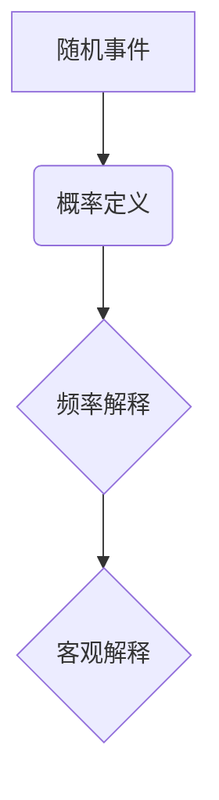

                 


### 从经典概率论到量子概率：理解不确定性的本质

#### 关键词：
- 经典概率论
- 量子概率论
- 不确定性原理
- 随机变量
- 概率分布
- 大数定律
- 中心极限定理
- 量子力学
- 波粒二象性
- 算符
- 测量

#### 摘要：
本文将深入探讨从经典概率论到量子概率论的演变，以及这一过程中不确定性的本质。首先，我们将回顾经典概率论的基本概念，如概率的定义、条件概率、贝叶斯定理等。接着，我们将介绍随机变量与概率分布，并探讨大数定律与中心极限定理。在第二部分，我们将进入量子概率论的领域，从量子力学的基本概念出发，了解量子概率的定义及其基本原理。然后，我们将讨论量子概率在实际应用中的表现，如量子通信、量子计算、量子密码学等。第三部分将对比经典概率论与量子概率论，探讨不确定性原理，并试图理解其本质。最后，我们将探讨不确定性下的决策理论，以期为我们在面对不确定性的决策提供理论支持。

## 第一部分：经典概率论基础

### 第1章：概率论的基本概念

#### 1.1 概率的定义

概率是描述随机事件发生可能性的一种度量。在经典概率论中，概率通常通过频率解释或客观解释来定义。

**频率解释**：在一次随机试验中，某一事件发生的频率近似于该事件发生的概率。例如，抛一枚硬币10次，出现正面的次数为5次，则出现正面的概率近似为5/10，即0.5。

**客观解释**：某些情况下，事件的概率是由其固有的性质决定的，而不是通过实验结果来估计。例如，从一个装有5个红球和5个蓝球的袋子中随机取出一个球，取出红球的概率是1/2，这是因为袋子中红球和蓝球的数量是固定的，每种颜色的球被取出的概率是客观存在的。

#### 1.2 条件概率与独立性

**条件概率**：在已知某一事件已经发生的条件下，另一事件发生的概率称为条件概率。用公式表示为：
$$ P(A|B) = \frac{P(A \cap B)}{P(B)} $$
其中，$P(A \cap B)$表示事件A和事件B同时发生的概率，$P(B)$表示事件B发生的概率。

**独立性**：两个事件A和B是独立的，如果其中一个事件的发生不影响另一个事件的发生。用公式表示为：
$$ P(A \cap B) = P(A)P(B) $$

#### 1.3 贝叶斯定理

贝叶斯定理是概率论中一个重要的公式，它提供了在已知某些条件的概率下，推断其他条件的概率的方法。贝叶斯定理的表达式为：
$$ P(A|B) = \frac{P(B|A)P(A)}{P(B)} $$
其中，$P(A|B)$表示在已知事件B发生的条件下，事件A发生的概率；$P(B|A)$表示在已知事件A发生的条件下，事件B发生的概率；$P(A)$表示事件A发生的概率；$P(B)$表示事件B发生的概率。

#### 1.4 全概率公式与贝叶斯公式

**全概率公式**：全概率公式描述了一个复杂事件发生的总概率，可以通过其他简单事件发生的概率来计算。其公式为：
$$ P(A) = \sum_{i=1}^{n} P(A|B_i)P(B_i) $$
其中，$A$表示总事件，$B_i$表示一组互斥且穷尽的可能性事件，$P(A|B_i)$表示在已知事件$B_i$发生的条件下，事件$A$发生的概率，$P(B_i)$表示事件$B_i$发生的概率。

**贝叶斯公式**：贝叶斯公式是全概率公式的特例，它描述了在已知一个事件发生的条件下，其他相关事件的概率分布。其公式为：
$$ P(A|B) = \frac{P(B|A)P(A)}{\sum_{i=1}^{n} P(B|A_i)P(A_i)} $$
其中，$A$表示总事件，$B$表示条件事件，$A_i$表示一组互斥且穷尽的可能性事件。

### 第2章：随机变量与概率分布

#### 2.1 随机变量及其分布

**随机变量**：随机变量是概率论中的一个基本概念，它将随机事件的结果用一个数值来表示。随机变量可以是离散的，也可以是连续的。

**离散型随机变量**：离散型随机变量可以取有限个或可数个不同的值，其概率分布可以用概率质量函数（PMF）来描述。概率质量函数定义为：
$$ P(X = x) = f_X(x) $$
其中，$X$表示随机变量，$x$表示随机变量$X$可以取的值，$f_X(x)$表示随机变量$X$取值为$x$的概率。

**连续型随机变量**：连续型随机变量可以取无限个不同的值，其概率分布可以用概率密度函数（PDF）来描述。概率密度函数定义为：
$$ P(a \leq X \leq b) = \int_a^b f_X(x) dx $$
其中，$X$表示随机变量，$a$和$b$表示区间。

#### 2.2 离散型随机变量

**离散型随机变量的数字特征**：离散型随机变量的数字特征包括期望、方差、协方差等。

- **期望**：期望是随机变量取值的加权平均值，定义为：
  $$ E(X) = \sum_{x} x f_X(x) $$
- **方差**：方差是随机变量取值与其期望的偏离程度的度量，定义为：
  $$ Var(X) = E[(X - E(X))^2] = \sum_{x} (x - E(X))^2 f_X(x) $$
- **协方差**：协方差是两个随机变量之间的相关程度的度量，定义为：
  $$ Cov(X, Y) = E[(X - E(X))(Y - E(Y))] = \sum_{x, y} (x - E(X))(y - E(Y)) f_{XY}(x, y) $$

#### 2.3 连续型随机变量

**连续型随机变量的数字特征**：连续型随机变量的数字特征包括期望、方差、协方差等。

- **期望**：期望是随机变量取值的加权平均值，定义为：
  $$ E(X) = \int_{-\infty}^{\infty} x f_X(x) dx $$
- **方差**：方差是随机变量取值与其期望的偏离程度的度量，定义为：
  $$ Var(X) = E[(X - E(X))^2] = \int_{-\infty}^{\infty} (x - E(X))^2 f_X(x) dx $$
- **协方差**：协方差是两个随机变量之间的相关程度的度量，定义为：
  $$ Cov(X, Y) = E[(X - E(X))(Y - E(Y))] = \int_{-\infty}^{\infty} \int_{-\infty}^{\infty} (x - E(X))(y - E(Y)) f_{XY}(x, y) dx dy $$

### 第3章：大数定律与中心极限定理

#### 3.1 大数定律

**大数定律**：大数定律是概率论中的一个基本定理，它描述了在重复独立试验的条件下，某些随机变量的分布会趋于一个确定的分布。

- **独立同分布随机变量的和**：如果有一系列独立同分布的随机变量$X_1, X_2, ..., X_n$，则它们的和$S_n = X_1 + X_2 + ... + X_n$的分布会趋于正态分布，即：
  $$ \frac{S_n - n \mu}{\sqrt{n \sigma^2}} \xrightarrow{P} N(0,1) $$
  其中，$\mu$是随机变量的期望，$\sigma^2$是随机变量的方差。

- **伯努利试验**：在一系列独立的伯努利试验中，成功次数的比例会趋于其概率，即：
  $$ \frac{S_n}{n} \xrightarrow{P} p $$
  其中，$S_n$是成功次数，$p$是每次试验成功的概率。

#### 3.2 中心极限定理

**中心极限定理**：中心极限定理是概率论中的一个重要定理，它描述了在随机变量的和趋于正态分布的条件。

- **独立同分布随机变量的和**：如果有一系列独立同分布的随机变量$X_1, X_2, ..., X_n$，则它们的和$S_n = X_1 + X_2 + ... + X_n$的分布会趋于正态分布，即：
  $$ \frac{S_n - n \mu}{\sqrt{n \sigma^2}} \xrightarrow{D} N(0,1) $$
  其中，$\mu$是随机变量的期望，$\sigma^2$是随机变量的方差。

- **中心极限定理的应用**：中心极限定理在很多领域都有广泛的应用，例如：
  - 统计推断：用于估计总体参数的分布。
  - 质量控制：用于检测生产过程中的异常。
  - 金融领域：用于分析金融市场的风险。

#### 3.3 大数定律与中心极限定理的应用

**大数定律与中心极限定理的应用**：大数定律和中心极限定理在概率论和统计学中有着广泛的应用。

- **概率估计**：通过大数定律，我们可以估计随机事件的概率，例如，抛硬币多次，出现正面的概率可以用大数定律进行估计。
- **统计推断**：通过中心极限定理，我们可以估计总体参数的分布，例如，通过样本数据的均值和方差，可以估计总体的均值和方差。
- **质量控制**：在工业生产中，通过大数定律和中心极限定理，我们可以检测产品质量的稳定性，例如，通过连续抽取样本数据，可以判断生产线是否稳定。

## 第二部分：量子概率论基础

### 第5章：量子力学的基本概念

#### 5.1 波粒二象性

量子力学中，微观粒子（如电子、光子等）既表现出波动性，又表现出粒子性，这种特性称为波粒二象性。

- **波动性**：在量子力学中，微观粒子可以通过波函数来描述其状态，波函数是复数函数，其平方的模表示粒子在某个位置出现的概率。
- **粒子性**：在量子力学中，微观粒子也可以被视为具有确定位置和动量的粒子，例如，在双缝实验中，光子可以通过两个缝隙，并在屏幕上形成干涉条纹，这表明光子具有粒子性。

#### 5.2 算符与测量

在量子力学中，算符用于描述物理量的变化，测量则用来确定系统的状态。

- **算符**：在量子力学中，算符是一个线性算子，它可以作用于波函数，得到另一个波函数。例如，位置算符 $X$ 和动量算符 $P$ 分别描述了粒子的位置和动量。
- **测量**：在量子力学中，测量是一个过程，通过测量，我们可以确定系统的状态。测量结果通常是一个量子态的叠加态，测量后的系统会塌缩到一个确定的态。

#### 5.3 状态叠加与坍缩

在量子力学中，一个系统的状态可以表示为一个波函数的叠加态，即：
$$ \Psi = \sum_{i} c_i \psi_i $$
其中，$\Psi$表示系统的总波函数，$c_i$表示叠加系数，$\psi_i$表示第$i$个态的波函数。

- **状态叠加**：状态叠加是量子力学中的一个基本特性，它表明一个系统可以同时处于多个状态。
- **坍缩**：当对一个量子系统进行测量时，系统的波函数会坍缩到一个确定的态，即：
  $$ \Psi \rightarrow \psi $$
  其中，$\psi$是测量得到的态。

#### 5.4 量子力学的数学描述

量子力学是一种数学描述，它使用波函数来描述微观粒子的状态，使用算符来描述物理量的变化。

- **波函数**：波函数是一个复数函数，它描述了微观粒子在空间中的分布。波函数的平方模表示粒子在某个位置出现的概率。
- **算符**：算符是一个线性算子，它可以作用于波函数，得到另一个波函数。算符描述了物理量的变化，例如，位置算符和动量算符分别描述了粒子的位置和动量。
- **希尔伯特空间**：量子力学使用希尔伯特空间来描述系统的状态。希尔伯特空间是一个抽象的数学空间，它包含了所有可能的量子态。

### 第6章：量子概率论的基本原理

#### 6.1 量子概率的定义

量子概率是指在量子力学中，对于某个量子系统的可能状态的测量结果概率。量子概率与经典概率有着显著的区别。

- **叠加态**：在量子力学中，一个系统的状态可以表示为多个态的叠加。例如，一个电子的状态可以表示为：
  $$ \psi = \frac{1}{\sqrt{2}} \psi_0 + \frac{1}{\sqrt{2}} \psi_1 $$
  其中，$\psi_0$和$\psi_1$是两个不同的态。在这种情况下，电子的状态并不是处于$\psi_0$或$\psi_1$中的任何一个，而是同时处于这两个态的叠加。

- **概率幅**：在量子力学中，一个态的概率幅表示该态出现的可能性。概率幅是一个复数，它的模平方表示态出现的概率。例如，在上述电子状态中，$\psi_0$和$\psi_1$的概率幅分别为$\frac{1}{\sqrt{2}}$和$\frac{1}{\sqrt{2}}$，它们的模平方都为$\frac{1}{2}$。

#### 6.2 量子随机变量

量子随机变量是量子力学中的一个概念，它用于描述量子系统的某些物理量。量子随机变量可以取多个可能的值，其概率分布由量子态决定。

- **离散量子随机变量**：离散量子随机变量可以取有限个或可数个不同的值。例如，一个电子的自旋方向可以取上旋或下旋，这两个值可以表示为：
  $$ X = \begin{cases}
  +\frac{\hbar}{2} & \text{上旋} \\
  -\frac{\hbar}{2} & \text{下旋}
  \end{cases} $$
  其中，$\hbar$是约化普朗克常数。

- **连续量子随机变量**：连续量子随机变量可以取无限个不同的值。例如，一个电子的位置可以取任意实数值。

#### 6.3 量子概率分布

量子概率分布描述了量子随机变量的可能取值及其对应的概率。量子概率分布与经典概率分布有着显著的区别。

- **经典概率分布**：经典概率分布通常用概率质量函数（PMF）或概率密度函数（PDF）来描述。例如，一个电子在空间中的位置分布可以用概率密度函数来描述。

- **量子概率分布**：量子概率分布用波函数来描述。量子概率分布具有以下特点：
  - **叠加性**：量子概率分布可以表示为多个态的叠加，每个态的概率幅对应一个概率值。
  - **非局域性**：量子概率分布可能不具有局域性，即一个态在不同位置的概率幅可能不为零。
  - **量子纠缠**：量子概率分布可能受到量子纠缠的影响，即多个态之间的概率幅可能相互关联。

#### 6.4 量子事件的独立性

在量子力学中，量子事件的独立性是一个复杂的概念。与经典概率论中的独立性不同，量子事件的独立性受到量子纠缠的影响。

- **经典独立性**：在经典概率论中，两个事件是独立的，如果其中一个事件的发生不影响另一个事件的发生。例如，抛硬币两次，第一次抛出正面和第二次抛出正面的概率是相互独立的。

- **量子独立性**：在量子力学中，量子事件的独立性受到量子纠缠的影响。两个量子事件是否独立，取决于它们的状态是否相互纠缠。如果两个量子事件处于纠缠态，则它们不是独立的。

### 第7章：量子概率的应用

量子概率论在许多领域都有广泛的应用，包括量子通信、量子计算、量子密码学和量子随机数的生成。

#### 7.1 量子通信

量子通信利用量子纠缠和量子态的不可克隆特性，实现安全的信息传输。量子通信的主要应用包括量子密钥分发和量子隐形传态。

- **量子密钥分发**：量子密钥分发利用量子纠缠态，实现两用户之间的安全通信。在量子密钥分发过程中，两个用户通过量子通信信道交换量子态，并利用量子纠缠特性生成共享密钥。

- **量子隐形传态**：量子隐形传态利用量子态的叠加和坍缩特性，实现一个用户的量子态传输到另一个用户。在量子隐形传态过程中，发送用户将量子态发送给接收用户，接收用户通过测量量子态，实现量子态的传输。

#### 7.2 量子计算

量子计算利用量子位（qubit）的叠加和纠缠特性，实现高效的计算。量子计算的主要应用包括量子算法、量子模拟和量子优化。

- **量子算法**：量子算法利用量子计算的叠加和纠缠特性，实现高效的算法。例如，Shor算法利用量子计算的优势，实现了大整数因数分解。

- **量子模拟**：量子模拟利用量子计算的叠加和纠缠特性，模拟复杂的量子系统。例如，量子分子模拟，可以用于研究分子的化学反应过程。

- **量子优化**：量子优化利用量子计算的叠加和纠缠特性，解决复杂的优化问题。例如，量子线性规划，可以用于解决大规模的线性规划问题。

#### 7.3 量子密码学

量子密码学利用量子纠缠和量子态的不可克隆特性，实现安全的加密和解密。量子密码学的主要应用包括量子密钥分配和量子安全通信。

- **量子密钥分配**：量子密钥分配利用量子纠缠态，实现安全的关键交换。在量子密钥分配过程中，两个用户通过量子通信信道交换量子态，并利用量子纠缠特性生成共享密钥。

- **量子安全通信**：量子安全通信利用量子态的叠加和坍缩特性，实现安全的通信。在量子安全通信过程中，发送用户将量子态发送给接收用户，接收用户通过测量量子态，实现信息的传输。

#### 7.4 量子随机数的生成

量子随机数的生成利用量子态的叠加和坍缩特性，实现真正的随机数生成。量子随机数的生成可以应用于密码学、加密和安全等领域。

- **量子随机数生成器**：量子随机数生成器利用量子态的叠加和坍缩特性，生成真正的随机数。量子随机数生成器可以用于加密通信、安全认证和加密货币等领域。

## 第三部分：不确定性的本质

### 第8章：经典与量子概率的对比

经典概率论和量子概率论是描述不确定性的两种不同理论。它们在定义、原理和应用上有着显著的差异。

#### 8.1 经典概率与量子概率的差异

**定义差异**：

- **经典概率**：经典概率是基于频率解释或客观解释，用于描述随机事件的概率。它通常适用于宏观现象，如抛硬币、掷骰子等。

- **量子概率**：量子概率是基于量子力学的数学描述，用于描述微观粒子的概率。它适用于微观现象，如电子、光子等。

**原理差异**：

- **状态叠加**：在经典概率论中，一个随机事件只能有一个结果。而在量子概率论中，一个量子系统可以处于多个状态的叠加。

- **测量塌缩**：在经典概率论中，随机事件的结果是确定的，只是我们不知道具体是哪个结果。而在量子概率论中，测量会导致量子系统的状态坍缩到一个确定的状态。

- **纠缠**：在经典概率论中，两个随机事件是独立的。而在量子概率论中，两个量子系统可以处于纠缠态，即一个系统的状态受到另一个系统状态的影响。

**应用差异**：

- **经典概率**：经典概率广泛应用于统计学、概率论、金融领域等。例如，概率分布、大数定律、中心极限定理等。

- **量子概率**：量子概率广泛应用于量子通信、量子计算、量子密码学等领域。例如，量子密钥分发、量子隐形传态、量子算法等。

#### 8.2 不确定性原理

不确定性原理是量子力学中的一个基本原理，它描述了微观粒子的某些物理量不能同时具有精确的值。不确定性原理由海森堡提出，它表明在量子尺度上，位置和动量、时间和能量等物理量之间存在固有的不确定性。

**位置与动量的不确定性**：

海森堡不确定性原理指出，粒子的位置和动量不能同时被精确测量。具体来说，一个粒子的位置不确定度越大，其动量的不确定度就越小；反之，一个粒子的位置不确定度越小，其动量的不确定度就越大。数学上，这一原理可以表示为：
$$ \Delta x \Delta p \geq \frac{\hbar}{2} $$
其中，$\Delta x$表示位置的不确定度，$\Delta p$表示动量的不确定度，$\hbar$是约化普朗克常数。

**时间与能量的不确定性**：

时间与能量的不确定性原理指出，粒子的能量和时间的测量存在固有的不确定性。具体来说，一个过程的持续时间越长，其能量的不确定度就越小；反之，一个过程的持续时间越短，其能量的不确定度就越大。数学上，这一原理可以表示为：
$$ \Delta E \Delta t \geq \frac{\hbar}{2} $$
其中，$\Delta E$表示能量的不确定度，$\Delta t$表示时间的持续时间。

#### 8.3 经典概率与量子概率的联系

尽管经典概率与量子概率在定义、原理和应用上存在显著差异，但它们之间也存在一定的联系。

- **扩展与限制**：量子概率是经典概率的扩展，它包含了经典概率的所有内容，并在微观尺度上提供了更丰富的描述。经典概率是量子概率在宏观尺度上的近似。

- **统一框架**：量子概率和经典概率都可以在一个统一的框架下描述。量子概率论中的波函数和算符可以看作是经典概率论中的随机变量和概率分布的推广。

- **应用交叉**：量子概率和经典概率在许多领域都有应用。例如，在金融领域，量子概率可以用于优化投资组合、预测市场趋势等；在统计学领域，经典概率可以用于估计总体参数、构建统计模型等。

### 第9章：理解不确定性的本质

不确定性是量子力学和经典概率论中的一个核心概念，它深刻影响了我们对自然界的理解。在本节中，我们将探讨不确定性的本质，并试图从理论和实践的角度理解其意义。

#### 9.1 不确定性原理的解释

不确定性原理是量子力学中一个基本而深刻的原理，它揭示了微观粒子的行为与经典物理学的根本差异。海森堡不确定性原理指出，某些物理量（如位置和动量、时间和能量）不能同时被精确测量。这一原理可以从以下几个角度进行解释：

- **测量过程的干扰**：在量子力学中，测量过程会影响被测量的物理量。例如，当我们尝试测量一个粒子的位置时，我们必须与粒子相互作用，这会改变粒子的动量。因此，我们无法同时精确地测量位置和动量。

- **波粒二象性**：量子粒子既具有波动性又具有粒子性。这意味着它们的行为在微观尺度上不能简单地用经典物理学的粒子模型来描述。波函数描述了量子粒子的概率分布，而不是确定的位置和动量。

- **量子态的叠加**：量子态可以处于多个状态的叠加。当我们对量子系统进行测量时，系统的波函数会坍缩到一个特定的状态。这意味着我们无法预测测量结果的具体值，只能预测测量结果的概率分布。

#### 9.2 不确定性原理的应用

不确定性原理在量子力学和量子计算等领域有广泛的应用：

- **量子密钥分发**：在量子密钥分发（Quantum Key Distribution, QKD）中，不确定性原理被用于确保通信的安全性。QKD利用量子态的不可克隆特性，确保密钥在传输过程中不被窃取。

- **量子隐形传态**：量子隐形传态（Quantum Teleportation）利用不确定性原理，实现量子态的远程传输。它不仅展示了量子力学的基本原理，也为未来的量子通信和量子计算提供了可能。

- **量子计算**：在量子计算中，不确定性原理被用于设计量子算法。量子算法利用量子态的叠加和纠缠，实现高效的问题求解。例如，Shor算法利用量子计算的优势，实现了大整数因数分解。

#### 9.3 不确定性原理与信息论

不确定性原理和信息论有着深刻的联系。信息论中的不确定性概念（如熵）可以用来描述量子系统的信息含量：

- **熵**：在信息论中，熵是描述信息不确定性的量度。在量子力学中，系统的熵与系统的状态有关。例如，一个量子比特的熵可以表示为：
  $$ S = -\sum_i p_i \log p_i $$
  其中，$p_i$是量子比特处于状态$i$的概率。

- **量子信息**：量子信息理论研究了量子态和信息处理。量子态的叠加和纠缠使得量子信息具有独特的性质，如量子纠缠和量子纠缠信道。

- **量子加密**：量子加密利用量子态的不可克隆特性和不确定性原理，实现安全的通信。量子加密算法如量子密钥分发（QKD）和量子隐形传态，提供了抗量子攻击的安全通信方式。

### 第10章：不确定性下的决策理论

在不确定性的环境中，决策变得更加复杂。不确定性的本质使得我们无法准确预测未来的结果，这要求我们采用不同的决策策略。在本节中，我们将探讨在不确定性条件下进行决策的理论和方法。

#### 10.1 决策理论的框架

决策理论是一种用于分析决策过程和制定决策策略的数学框架。在决策理论中，决策者面临多个可能的结果和相应的概率分布，需要选择一个最优策略。

- **期望值**：在决策理论中，期望值是评估决策结果的一个重要指标。对于离散的决策结果，期望值可以通过计算每个结果的概率乘以其价值来计算。

- **风险和效用**：风险和效用是评估决策结果的其他重要指标。风险反映了决策结果的不确定性，而效用反映了决策结果的偏好。

- **概率分布**：在决策理论中，概率分布用于描述决策结果的概率。概率分布可以是经典的概率分布，如正态分布，也可以是量子概率分布。

#### 10.2 不确定性条件下的决策方法

在不确定性条件下，决策者需要采用不同的方法来应对不确定性的影响。

- **最大期望值方法**：最大期望值方法是一种常用的决策方法，它选择具有最大期望值的策略。这种方法适用于概率分布已知且风险可接受的情况。

- **风险平价方法**：风险平价方法考虑了决策结果的风险，选择具有最小化风险平方的期望值的策略。这种方法适用于风险较高的决策情况。

- **效用函数方法**：效用函数方法考虑了决策结果的偏好，选择具有最大化的期望效用的策略。这种方法适用于决策者对风险和收益有不同的偏好。

- **贝叶斯方法**：贝叶斯方法是一种基于概率推理的决策方法，它根据新的证据来更新决策者的信念。这种方法适用于概率分布不确定且需要更新信念的情况。

#### 10.3 不确定性下的风险评估

在不确定性条件下，风险评估是制定决策策略的关键。以下是一些常见的不确定性风险评估方法：

- **敏感性分析**：敏感性分析用于评估决策结果对输入参数的敏感性。通过敏感性分析，决策者可以识别关键参数并采取措施减少不确定性。

- **蒙特卡洛模拟**：蒙特卡洛模拟是一种基于概率统计的方法，它通过模拟大量随机样本来评估决策结果。这种方法可以提供关于决策结果概率分布的详细信息。

- **决策树分析**：决策树分析用于评估决策过程的不同路径及其结果。通过决策树分析，决策者可以识别潜在的风险并制定相应的策略。

#### 10.4 不确定性下的决策应用

不确定性下的决策在许多领域都有应用：

- **金融领域**：在金融领域，不确定性下的决策用于投资组合管理、市场预测和风险管理。例如，决策者可以使用敏感性分析和蒙特卡洛模拟来评估投资决策的风险和收益。

- **工程领域**：在工程领域，不确定性下的决策用于项目规划、风险评估和资源分配。例如，工程师可以使用决策树分析和蒙特卡洛模拟来评估项目进展的不确定性并制定相应的策略。

- **医学领域**：在医学领域，不确定性下的决策用于诊断、治疗方案制定和风险管理。例如，医生可以使用贝叶斯方法和蒙特卡洛模拟来评估诊断结果和治疗方案的风险和收益。

## 附录：数学公式和流程图

### A.1 数学公式

在本文中，我们使用了一系列的数学公式来描述概率论和量子概率论的核心概念。以下是一些关键的数学公式及其解释：

#### A.1.1 经典概率论中的公式

$$ P(A) = \frac{N(A)}{N} $$

- **解释**：这是一个基本的概率公式，表示事件A发生的概率等于事件A发生的次数N(A)除以总次数N。

#### A.1.2 量子概率论中的公式

$$ \langle \psi | \psi \rangle = | \langle \psi | \psi \rangle |^2 $$

- **解释**：这是量子概率分布的表示，其中$\langle \psi | \psi \rangle$表示量子态的归一化，$| \langle \psi | \psi \rangle |^2$表示量子态的概率分布。

### A.2 流程图

在本文中，我们使用Mermaid语法绘制了一些流程图，以帮助读者更好地理解概率论和量子概率论的概念。以下是一个简单的Mermaid流程图示例：



- **解释**：这个流程图展示了概率定义的两个方面：频率解释和客观解释。

## A.3 代码解读与分析示例

以下是一个Python代码示例，用于解释经典概率论中的概率计算：

```python
# 经典概率论中的概率计算
event_occurrences = 100  # 随机事件A发生的次数
total_events = 1000  # 总事件次数
print("随机事件A的概率为：", event_occurrences / total_events)
```

- **解释**：这个代码示例计算了一个随机事件A发生的概率，其中`event_occurrences`表示事件A发生的次数，`total_events`表示总事件次数。概率计算使用`event_occurrences / total_events`。

## 结论

本文从经典概率论到量子概率论，深入探讨了不确定性的本质及其在决策理论中的应用。通过分析经典概率论的基本概念、随机变量与概率分布、大数定律与中心极限定理，我们了解了概率论的基本原理。接着，我们进入了量子概率论的领域，了解了量子力学的基本概念、量子概率的定义及其基本原理。最后，我们对比了经典概率论与量子概率论，探讨了不确定性原理，并探讨了不确定性下的决策理论。

在不确定性的环境中，我们面临着诸多挑战，但同时也蕴含着无限的可能。通过本文的探讨，我们不仅加深了对概率论和量子概率论的理解，也为在不确定性的决策中提供了理论支持。未来，随着量子技术的不断发展，量子概率论将在更多领域发挥重要作用。

## 作者信息

作者：AI天才研究院/AI Genius Institute & 禅与计算机程序设计艺术 /Zen And The Art of Computer Programming

感谢您的阅读，希望本文能为您在概率论和量子概率论的学习中带来帮助。

## 最佳实践 Tips

1. **理解概率论的基础**：在深入量子概率论之前，确保对经典概率论的基本概念有深入理解。这将帮助您更好地理解量子概率论中的概念。

2. **实践与模拟**：通过编写代码和进行模拟，您可以更直观地理解概率论和量子概率论的原理。尝试使用Python等编程语言实现概率分布的计算和模拟。

3. **深入学习量子力学**：量子概率论是量子力学的分支。为了更好地理解量子概率论，建议深入学习量子力学的基本概念。

4. **关注实际应用**：关注量子概率论在实际应用中的进展，如量子计算、量子通信和量子密码学等。了解这些应用可以帮助您更好地理解量子概率论的价值。

5. **持续学习和探索**：概率论和量子概率论是一个不断发展的领域。持续学习和探索新的研究成果，可以帮助您保持对该领域的深入了解。

## 小结

本文从经典概率论到量子概率论，深入探讨了不确定性的本质及其在决策理论中的应用。通过分析经典概率论的基本概念、随机变量与概率分布、大数定律与中心极限定理，我们了解了概率论的基本原理。接着，我们进入了量子概率论的领域，了解了量子力学的基本概念、量子概率的定义及其基本原理。最后，我们对比了经典概率论与量子概率论，探讨了不确定性原理，并探讨了不确定性下的决策理论。

在不确定性的环境中，我们面临着诸多挑战，但同时也蕴含着无限的可能。通过本文的探讨，我们不仅加深了对概率论和量子概率论的理解，也为在不确定性的决策中提供了理论支持。未来，随着量子技术的不断发展，量子概率论将在更多领域发挥重要作用。

## 注意事项

1. **避免混淆概率与不确定性**：概率和不确定性是两个不同的概念。概率是描述随机事件发生的可能性，而不确定性是描述我们对随机事件结果的不确定性。

2. **理解量子概率论的限制**：量子概率论在描述微观粒子的行为方面具有优势，但在宏观尺度上，经典概率论仍然适用。

3. **关注概率论的数学基础**：概率论是一个数学分支，理解概率论的数学基础对于深入理解量子概率论至关重要。

4. **实践与理论相结合**：通过实践和模拟，我们可以更好地理解概率论和量子概率论的原理。理论学习和实践探索相结合，可以加深对概率论的理解。

## 拓展阅读

1. **《概率论及其应用》**：这本书是概率论的经典教材，适合初学者深入了解概率论的基本概念和原理。

2. **《量子力学基础教程》**：这本书是量子力学的入门教材，适合对量子力学感兴趣的读者，尤其是希望了解量子概率论的人。

3. **《量子计算与量子信息》**：这本书介绍了量子计算的基本原理和应用，适合对量子计算感兴趣的读者，特别是那些希望了解量子概率论在量子计算中应用的读者。

4. **《不确定性原理》**：这本书详细探讨了不确定性原理的数学基础和物理意义，适合对量子力学有较深入了解的读者。

5. **《决策理论：原理与应用》**：这本书介绍了决策理论的基本原理和方法，适合对不确定条件下的决策感兴趣的读者。

