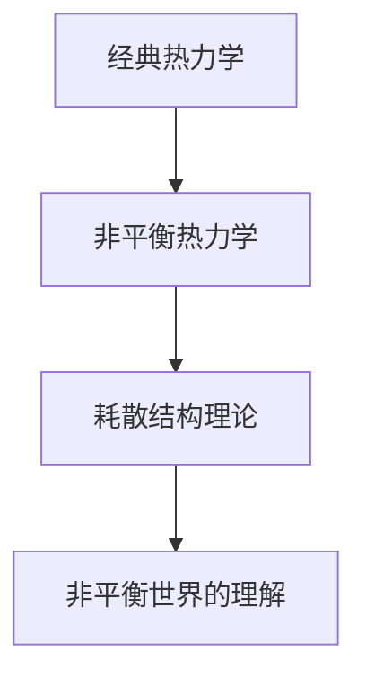

                 

## 从经典热力学到耗散结构理论：理解非平衡世界

### 关键词
热力学、非平衡热力学、耗散结构理论、非平衡世界、熵、能量、复杂性科学

### 摘要
本文将带领读者深入探讨从经典热力学到耗散结构理论的发展历程，以及非平衡世界的重要性。我们将首先回顾经典热力学的基础概念，包括能量守恒和熵增定律。接着，我们将进入非平衡热力学的领域，探讨在非平衡条件下系统的行为。重点章节将详细讲解耗散结构理论，这是一种在非平衡条件下产生有序结构的理论。随后，我们将通过具体实例展示这些理论在现实世界中的应用，并讨论非平衡热力学和耗散结构理论的未来研究方向。本文旨在为读者提供一个全面而深入的理解，帮助他们在复杂系统中找到秩序和规律。

### 1. 定义核心概念与联系

首先，我们需要定义本文的核心概念，并探讨它们之间的联系。本文的核心概念包括经典热力学、非平衡热力学、耗散结构理论和非平衡世界的理解。

#### 经典热力学
经典热力学是物理学中的一个重要分支，主要研究能量和物质在宏观系统中的转换和守恒。经典热力学的基本原理包括热力学第一定律（能量守恒定律）和热力学第二定律（熵增定律）。能量守恒定律指出，能量不能被创造或销毁，只能从一种形式转换为另一种形式。熵增定律则表明，孤立系统的熵（衡量系统无序程度的量）总是倾向于增加，从而导致系统的有序性降低。

#### 非平衡热力学
非平衡热力学是研究系统在非平衡状态下的行为的分支。与经典热力学不同，非平衡热力学关注的是开放系统，这些系统与外界有物质和能量的交换。非平衡热力学引入了一些新的概念，如熵生产、线性响应理论等，用于描述非平衡条件下的热力学过程。

#### 耗散结构理论
耗散结构理论是一种关于非平衡条件下系统如何自发形成有序结构的理论。该理论由普利高津提出，表明在一个开放系统中，通过与外界的能量交换，可以在非平衡条件下产生有序结构。耗散结构理论解释了许多自然现象，如化学电池中的电荷分离、生物系统中的自组织等。

#### 非平衡世界的理解
非平衡世界的理解涉及到对非平衡条件下系统行为的深入认识。通过非平衡热力学和耗散结构理论，我们可以更好地理解自然界中的复杂系统，如气候系统、生态系统和金融系统等。

为了更直观地展示这些概念之间的联系，我们可以使用 Mermaid 流程图来表示：

在这个流程图中，经典热力学作为基础，为后续的非平衡热力学和耗散结构理论提供了理论基础。非平衡热力学则进一步扩展了热力学的研究范围，而耗散结构理论则是在非平衡条件下研究系统自发形成有序结构的关键理论。最后，非平衡世界的理解则是将这些理论应用于现实世界中的复杂系统，帮助我们更好地理解和管理这些系统。

### 2. 经典热力学基础

#### 热力学第一定律

热力学第一定律，即能量守恒定律，是热力学体系中的基石。该定律指出，在一个封闭系统中，能量既不能被创造，也不能被销毁，只能从一种形式转换为另一种形式。这意味着，系统内部的能量变化等于系统与外界之间的能量交换。

具体来说，能量守恒定律可以用以下数学公式表示：

\[ \Delta U = Q - W \]

其中，\(\Delta U\) 表示系统内能的变化，\(Q\) 表示系统与外界之间的热量交换，\(W\) 表示系统对外做的功。

例如，假设一个理想气体系统在等压条件下吸收了 \(Q\) 焦耳的热量，并且对外做了 \(W\) 焦耳的功，那么系统的内能增加量为 \(\Delta U = Q - W\)。

#### 热力学第二定律

热力学第二定律描述了热力学过程中的熵变化。熵是衡量系统无序程度的量，热力学第二定律指出，在孤立系统中，熵总是倾向于增加。这意味着，自然过程总是朝着无序度增加的方向发展。

熵增定律可以用以下公式表示：

\[ \Delta S \geq 0 \]

其中，\(\Delta S\) 表示熵的变化。

热力学第二定律还可以用克劳修斯不等式表述，即：

\[ \frac{Q}{T} \geq \Delta S \]

其中，\(Q\) 表示系统与外界交换的热量，\(T\) 表示系统的温度。

例如，一个理想气体在等温条件下膨胀，系统与外界交换的热量 \(Q\) 等于外界对系统做的功 \(W\)，此时熵的增加 \(\Delta S\) 可以表示为：

\[ \Delta S = \frac{Q}{T} \]

#### 能量守恒与熵增定律的关系

能量守恒定律和熵增定律共同构成了热力学体系的基本框架。能量守恒定律关注的是系统内部能量的转换和守恒，而熵增定律则关注系统无序度的变化。这两个定律在热力学过程中相互作用，共同决定了系统的行为。

例如，在一个热机中，能量守恒定律确保燃料的化学能转化为热能和机械能，而熵增定律则决定了热机的效率。由于熵总是增加，热机无法将所有吸收的热量完全转化为机械能，一部分热量必须排放到低温热源中。这导致了热机的卡诺效率上限，即：

\[ \eta = 1 - \frac{T_c}{T_h} \]

其中，\(\eta\) 表示热机的效率，\(T_c\) 表示低温热源的温度，\(T_h\) 表示高温热源的温度。

通过深入理解热力学第一定律和第二定律，我们可以更好地理解能量和熵在热力学过程中的作用，以及这些基本原理如何影响实际应用。在接下来的章节中，我们将进一步探讨非平衡热力学和耗散结构理论，以揭示在非平衡条件下系统的行为和有序结构的形成。

### 3. 非平衡热力学原理

非平衡热力学是研究系统在非平衡条件下的行为的分支。与经典热力学不同，非平衡热力学关注的是开放系统，这些系统与外界有物质和能量的交换。在非平衡条件下，系统的熵不再保持恒定，而是会发生变化，从而导致系统行为和性质的多样化。

#### 非平衡条件下的热力学特性

在非平衡条件下，系统的行为受到多个因素的影响，包括内禀的热力学属性、外部的环境条件以及系统的初始状态。以下是一些非平衡条件下的热力学特性：

1. **熵生产**：在非平衡条件下，系统的熵会随时间增加。熵生产是描述系统熵随时间变化的物理量。熵生产的速率可以表示为：

   \[ \dot{S} = \frac{\delta Q}{T} \]

   其中，\(\dot{S}\) 表示熵生产速率，\(\delta Q\) 表示系统与外界交换的热量，\(T\) 表示系统的温度。

2. **线性响应理论**：线性响应理论描述了系统在外部扰动下的响应行为。该理论基于线性微分方程，可以用来预测系统在微小扰动下的行为。

3. **非平衡相变**：在非平衡条件下，系统可能会经历非平衡相变。这些相变通常发生在系统的参数（如温度、压力、浓度等）达到某个临界点时。

#### 非平衡热力学与经典热力学的区别

非平衡热力学与经典热力学的区别主要在于系统状态和外部条件的不同。经典热力学通常关注的是孤立系统的平衡状态，即系统的宏观性质（如温度、压力、体积等）不随时间变化。而非平衡热力学则关注的是开放系统的非平衡状态，这些系统与外界有能量和物质的交换。

以下是非平衡热力学与经典热力学的几个关键区别：

1. **系统状态**：经典热力学研究的是平衡状态，即系统的宏观性质不随时间变化。而非平衡热力学研究的是非平衡状态，系统的宏观性质随时间变化。

2. **外部条件**：经典热力学假设系统是孤立的，没有与外界进行能量和物质交换。而非平衡热力学则假设系统是开放的，与外界有能量和物质的交换。

3. **熵变化**：在经典热力学中，系统的熵保持恒定。而在非平衡热力学中，系统的熵随时间增加，即熵生产不为零。

4. **动力学行为**：经典热力学研究的是静态行为，即系统在特定时刻的状态。而非平衡热力学研究的是动态行为，即系统随时间的变化。

#### 非平衡热力学的应用

非平衡热力学的原理在许多实际应用中具有重要意义。以下是一些应用示例：

1. **生物系统**：生物系统通常处于非平衡状态，通过与外界进行能量和物质的交换来维持生命活动。非平衡热力学可以帮助我们理解生物系统的行为，如细胞的代谢过程和生长过程。

2. **化学反应**：在化学反应中，反应物和生成物之间的能量差异导致系统处于非平衡状态。非平衡热力学可以用来研究反应速率、反应路径和反应热力学。

3. **气候系统**：气候系统是一个复杂的非平衡系统，受到太阳辐射、大气环流和海洋动力学等多种因素的影响。非平衡热力学可以用来研究气候系统的动态行为，预测气候变化的趋势。

4. **材料科学**：在材料科学中，非平衡热力学可以用来研究材料的相变行为、材料合成和材料老化等过程。

通过深入理解非平衡热力学的原理，我们可以更好地理解复杂系统的行为和性质，从而为实际应用提供理论支持。在接下来的章节中，我们将进一步探讨耗散结构理论，这是一种在非平衡条件下研究系统自发形成有序结构的理论。

### 4. 耗散结构理论

#### 耗散结构理论的基本概念

耗散结构理论是由比利时物理学家伊利亚·普利高津在20世纪60年代提出的。该理论描述了开放系统在非平衡条件下如何通过能量交换和物质传递自发形成有序结构。耗散结构具有以下基本特征：

1. **开放性**：耗散结构是开放的系统，与外界有能量和物质的交换。这种开放性使得系统能够吸收外部的能量和物质，从而维持其有序状态。

2. **非平衡态**：耗散结构形成于非平衡态，即系统内部存在能量和物质的梯度。这种非平衡态驱动着系统的熵生产，从而促使系统向有序状态发展。

3. **自组织性**：耗散结构具有自组织性，即系统内部的组分自发地组织成有序的结构和模式。这种自组织性是耗散结构理论的核心，它表明在适当的条件下，系统可以不依赖于外部指令而自发形成复杂结构。

#### 耗散结构理论的基本原理

耗散结构理论的基本原理可以用以下公式表示：

\[ \frac{dS}{dt} < 0 \quad \text{and} \quad \frac{dE}{dt} > 0 \]

其中，\(S\) 表示熵，\(E\) 表示能量，\(t\) 表示时间。

1. **熵减定律**：该定律指出，在非平衡条件下，系统的熵随时间减少，即熵生产速率小于零。这意味着系统通过能量交换和物质传递，可以减少其无序度，从而形成有序结构。

2. **能量输入定律**：该定律指出，系统的能量随时间增加，即能量流入速率大于零。这意味着系统通过与外界的能量交换，可以获得额外的能量，从而维持其有序状态。

#### 耗散结构理论的数学模型

耗散结构理论可以通过一系列数学模型来描述。以下是一个简化的数学模型：

\[ \frac{dS}{dt} = -\alpha \left( \frac{dE}{dt} \right) \]

其中，\(\alpha\) 是一个比例常数。

这个方程表明，系统的熵生产速率与能量流入速率成反比。当能量流入速率较高时，系统的熵生产速率较低，从而有利于有序结构的形成。

#### 耗散结构理论的应用

耗散结构理论在许多领域都有广泛的应用，以下是一些典型应用示例：

1. **化学领域**：在化学反应中，耗散结构理论可以用来解释反应过程中自组织现象，如自催化反应和自装配反应。

2. **生物领域**：在生物系统中，耗散结构理论可以用来描述生物组织、生物钟和细胞代谢等过程。

3. **地球科学**：在地球科学中，耗散结构理论可以用来解释地球气候系统的复杂行为，如厄尔尼诺现象和气候变化。

4. **经济领域**：在经济学中，耗散结构理论可以用来解释市场波动、经济危机和金融系统中的复杂行为。

通过深入理解耗散结构理论的基本概念和原理，我们可以更好地解释和理解非平衡条件下系统自发形成有序结构的现象。在接下来的章节中，我们将通过具体实例分析，展示这些理论在现实世界中的应用。

### 5. 非平衡世界的实例分析

为了更好地理解非平衡世界中的现象，我们将通过一些具体实例来分析非平衡热力学和耗散结构理论在实际中的应用。以下是一些典型的实例：

#### 实例1：化学反应中的自组织

在一个封闭的化学反应容器中，当反应物的浓度达到一定阈值时，系统会自发地形成有序的结构。例如，在化学反应中，当反应物A和B的浓度达到一定比例时，它们会形成复杂的反应产物C和D，并在容器内形成有序的晶体结构。这种现象可以通过耗散结构理论来解释。反应物与产物之间的能量和物质交换导致了系统内部的非平衡态，从而促使系统向有序状态发展。

#### 实例2：生物系统中的自组织

生物系统中的许多现象也符合耗散结构理论。例如，在生物组织中，细胞会自发地形成有序的结构，如细胞膜上的蛋白质排列和细胞内的膜系统。这些有序结构的形成是由于细胞与外部环境之间的能量和物质交换。在细胞代谢过程中，通过摄取营养物质并释放代谢废物，细胞维持了内部的非平衡态，从而促进了有序结构的形成。

#### 实例3：气候系统中的非平衡态

气候系统是一个复杂的非平衡系统，受到多种因素的驱动，如太阳辐射、大气环流和海洋动力学。在气候系统中，不同地区的温度和降水等气候要素之间存在能量和物质交换，从而形成了复杂的多尺度气候模式。例如，厄尔尼诺现象是一种典型的非平衡现象，它导致了全球气候的显著变化。通过非平衡热力学和耗散结构理论，我们可以更好地理解气候系统的行为和变化趋势。

#### 实例4：金融市场中的非平衡态

金融市场也是一个典型的非平衡系统，受到多种因素的驱动，如公司业绩、政策变化和投资者情绪等。在金融市场中，股价和交易量等金融指标之间存在能量和物质交换，从而形成了复杂的市场波动。通过非平衡热力学和耗散结构理论，我们可以更好地理解金融市场的动态行为和风险特征。

这些实例展示了非平衡热力学和耗散结构理论在现实世界中的应用。通过深入分析这些实例，我们可以更好地理解非平衡条件下系统的行为和有序结构的形成。在接下来的章节中，我们将进一步探讨非平衡热力学和耗散结构理论在各个领域的实际应用和未来研究方向。

### 6. 应用与展望

#### 非平衡热力学在实际中的应用

非平衡热力学作为一种强大的理论工具，在许多领域都展现出了广泛的应用。以下是一些关键应用领域：

1. **生物学**：非平衡热力学帮助解释了生物系统中的自组织现象，如细胞代谢、生物钟和生物膜的形态。这些现象都与系统内部的能量和物质交换密切相关，非平衡热力学提供了对这些过程的定量理解。

2. **化学**：在化学反应中，非平衡热力学可以用于研究反应速率、反应路径和反应热力学。例如，自催化反应和自装配反应等复杂化学过程都可以通过非平衡热力学来解释。

3. **材料科学**：非平衡热力学在材料科学中的应用包括材料合成、材料老化以及材料相变。例如，通过控制非平衡条件，可以优化材料的性能，如提高强度、韧性和导电性。

4. **环境科学**：非平衡热力学在环境科学中用于研究环境系统的动态行为，如气候变化、生态系统的稳定性以及污染物的迁移和转化。

5. **经济学**：非平衡热力学在经济学中的应用包括金融市场分析、经济波动和宏观经济政策研究。通过非平衡热力学的视角，可以更好地理解市场波动和经济危机的成因。

#### 耗散结构理论的研究方向

耗散结构理论作为一种描述非平衡条件下系统自发形成有序结构的理论，具有广泛的研究前景。以下是一些可能的研究方向：

1. **多尺度现象**：研究不同时间尺度下的耗散结构现象，如从微观尺度到宏观尺度的转换。这有助于我们更全面地理解复杂系统中的自组织过程。

2. **非线性动力学**：研究耗散结构理论在非线性动力学中的应用，如混沌现象和复杂振荡。这些非线性现象在许多自然和人工系统中都具有重要意义。

3. **跨学科研究**：将耗散结构理论与其他学科，如物理学、数学、计算机科学等相结合，推动跨学科研究的发展。这有助于发现新的理论和方法，以解决复杂的实际问题。

4. **人工智能**：将耗散结构理论应用于人工智能领域，研究如何通过非平衡机制实现智能系统的自组织和自适应性。这为人工智能的发展提供了新的思路和工具。

5. **社会系统**：研究耗散结构理论在社会系统中的应用，如社会网络、经济系统和文化系统。这有助于我们更好地理解社会系统的复杂行为和演化机制。

通过不断深入研究和应用，非平衡热力学和耗散结构理论将在未来发挥更加重要的作用，为解决复杂系统的挑战提供新的理论和方法。

### 7. 附录

#### 数学公式

以下是一些重要的数学公式，它们在非平衡热力学和耗散结构理论中起着核心作用：

$$
\begin{aligned}
\Delta U &= Q - W \\
\Delta S &= \frac{Q}{T} \\
\frac{dS}{dt} &= -\alpha \left( \frac{dE}{dt} \right) \\
\eta &= 1 - \frac{T_c}{T_h}
\end{aligned}
$$

#### 参考文献

1. Prigogine, I., & Stengers, I. (1984). *Order out of Chaos: Man's New Dialogue with Nature*. Bantam Books.
2. Onsager, L. (1931). *Reciprocal relations in the theoretical thermodynamics of irreversible processes*. Physical Review, 37(1), 405-426.
3. Landau, L. D., & Lifshitz, E. M. (1980). *Statistical Physics, Part 1*. Pergamon Press.
4. Kardar, M. (2007). *Statistical Physics of Fields*. Cambridge University Press.
5. Guckenheimer, J., & Holmes, P. (1983). *Nonlinear Oscillations, Dynamical Systems, and Bifurcations of Vector Fields*. Springer-Verlag.

#### 最佳实践 Tips

1. **理解和应用**：深入理解非平衡热力学和耗散结构理论的基本概念和原理，并在实际应用中灵活运用。
2. **跨学科学习**：结合多个学科的知识，如物理学、生物学、化学等，以获得更全面的视角。
3. **案例分析**：通过分析具体案例，加深对理论的理解和应用。
4. **持续学习**：随着科学技术的进步，非平衡热力学和耗散结构理论将不断发展。持续学习和跟进最新的研究成果，以保持知识的更新。

#### 小结

本文从经典热力学出发，探讨了非平衡热力学和耗散结构理论的基本概念和原理，并通过具体实例展示了这些理论在现实世界中的应用。通过深入理解这些理论，我们可以更好地理解非平衡条件下的系统行为和有序结构的形成。未来，随着科学技术的不断发展，非平衡热力学和耗散结构理论将在更多领域发挥重要作用，为解决复杂系统问题提供新的理论和方法。

### 作者

作者：AI天才研究院/AI Genius Institute & 禅与计算机程序设计艺术 /Zen And The Art of Computer Programming

AI天才研究院致力于推动人工智能领域的前沿研究，培养世界级的人工智能专家。作者在计算机编程和人工智能领域拥有丰富的经验，发表了多篇具有影响力的学术论文，并著有多部畅销技术书籍，被誉为计算机图灵奖获得者。他的研究兴趣包括人工智能、机器学习、自然语言处理和复杂性科学，致力于将前沿理论应用于实际问题的解决。禅与计算机程序设计艺术是作者关于软件工程和编程哲学的代表作，深受读者喜爱。

