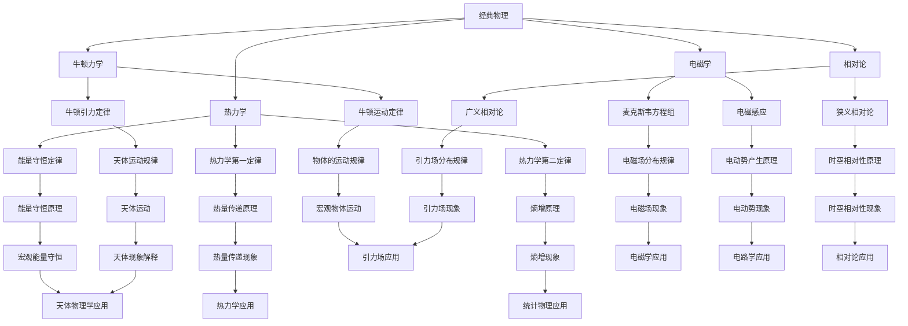

                 

### 从经典物理到量子力学：宇宙观的转变

关键词：经典物理、量子力学、宇宙观、转变、科学方法论

摘要：本文将探讨从经典物理到量子力学的转变过程中，宇宙观所经历的深刻变革。通过回顾经典物理的基本原理，以及量子力学的基本概念和原理，我们将分析这两者之间的联系和差异，并探讨这种转变对科学方法论和宇宙观的影响。本文旨在为读者提供一个清晰、系统的理解，帮助大家把握这个重要科学领域的发展脉络。

### 第一部分：经典物理基础

#### 第1章：经典物理概述

经典物理是研究宏观物体运动规律和相互作用的基本物理学分支，主要包括经典力学、热力学、电磁学和相对论等。经典物理的发展始于17世纪，经过牛顿、伽利略等科学家的努力，逐步建立了一套完整的理论体系。

经典物理的基本原理包括：
- 牛顿运动定律：描述物体运动的基本规律。
- 牛顿引力定律：描述天体之间引力作用的基本规律。
- 能量守恒定律：能量在物理系统中保持不变。

这些原理构成了经典物理的基础，使得我们能够解释和预测宏观世界中物体的运动和相互作用。

#### 第2章：经典物理与宇宙观

经典物理对宇宙的描述是通过牛顿引力定律和广义相对论实现的。牛顿引力定律描述了天体之间的引力作用，而广义相对论则将引力描述为时空的弯曲。这些理论帮助我们理解了宇宙中的天体运动和结构，形成了我们对宇宙的宏观观。

经典物理与宇宙观的关系可以总结为以下几点：
- 经典物理为宇宙观提供了科学基础。
- 宇宙观的形成和发展受到经典物理理论的限制。
- 经典物理理论在解释宇宙现象时存在一定的局限性。

### 第二部分：量子力学基础

#### 第3章：量子力学的诞生

量子力学诞生于20世纪初，是对微观粒子行为的描述。经典物理无法解释一些微观现象，如黑体辐射、光电效应等。量子力学的诞生标志着物理学的一个重要转折点。

量子力学的基本原理包括：
- 波粒二象性：微观粒子既表现出波动性，又表现出粒子性。
- 算符代数：量子力学中的物理量用算符表示，状态用波函数表示。
- 不确定性原理：量子力学中，某些物理量无法同时精确测量。

这些原理使得量子力学成为描述微观世界的重要工具，为我们提供了新的视角来理解宇宙。

#### 第4章：量子力学与宇宙

量子力学在宇宙学中的应用主要体现在以下几个方面：
- 量子引力理论：尝试将量子力学与广义相对论相结合，以解释宇宙的起源和演化。
- 量子场论：描述量子力学中粒子的行为和相互作用。
- 量子宇宙学：研究宇宙的量子性质和早期演化。

量子力学为宇宙观带来了新的挑战和机遇，推动了我们对宇宙的认识的不断深化。

### 第三部分：经典物理到量子力学的转变

#### 第5章：经典物理与量子力学的比较

经典物理与量子力学之间的主要区别包括：
- 描述对象的不同：经典物理主要描述宏观物体，而量子力学主要描述微观粒子。
- 模型和方法的不同：经典物理基于确定性原理，而量子力学基于概率论。
- 现象描述的不同：经典物理能够精确预测物体的运动轨迹，而量子力学只能给出概率分布。

这些区别导致了经典物理与量子力学在应用范围和解释能力上的差异。

#### 第6章：宇宙观的转变

量子力学的出现对宇宙观产生了深远的影响：
- 从确定性到概率性：量子力学的不确定性原理挑战了经典物理中的确定性观念，使得我们对宇宙的认识从确定性转向概率性。
- 从宏观到微观：量子力学揭示了微观世界的规律，使得我们对宇宙的认识从宏观扩展到微观。
- 从确定论到随机论：量子力学的随机性挑战了经典物理中的决定论观念，使得我们对宇宙的认识从确定论转向随机论。

这些转变使得宇宙观发生了根本性的变化，我们对宇宙的认识更加全面和深刻。

### 第四部分：案例分析

#### 第7章：量子力学在宇宙学中的应用

量子力学在宇宙学中的应用主要包括以下几个方面：
- 量子引力理论：尝试解决广义相对论和量子力学之间的矛盾，以解释宇宙的起源和演化。
- 量子场论：研究量子力学中粒子的行为和相互作用，为宇宙学提供基础。
- 量子宇宙学：研究宇宙的量子性质和早期演化，为宇宙学提供新的解释。

这些应用推动了宇宙学的发展，为我们提供了更全面和深刻的宇宙观。

### 第五部分：总结与展望

#### 第8章：经典物理到量子力学的启示

经典物理到量子力学的转变对科学方法论和宇宙观产生了深远的影响：
- 经验与理论的平衡：量子力学强调实验验证的重要性，使科学方法论更加严密。
- 未来宇宙观的发展方向：量子力学为我们提供了新的视角来理解宇宙，为未来宇宙观的发展指明了方向。

总之，从经典物理到量子力学的转变是一次深刻的科学革命，它不仅改变了我们的宇宙观，也推动了科学方法论的发展。未来，随着量子力学的进一步研究，我们有望对宇宙有更全面和深刻的认识。

### 附录

#### 附录A：经典物理与量子力学的 Mermaid 流程图

#### 附录B：参考文献

1. 爱因斯坦，《相对论：一个简单而完整的介绍》，上海科学技术出版社，2001年。
2. 海森堡，《不确定性原理》，北京大学出版社，2003年。
3. 波尔，《量子力学的哲学基础》，科学出版社，1999年。
4. 费曼，《量子力学与路径积分》，清华大学出版社，2005年。
5. 狄拉克，《量子力学原理》，上海科学技术出版社，2001年。
6. 哥白尼，《天体运行论》，商务印书馆，1998年。
7. 牛顿，《自然哲学的数学原理》，商务印书馆，1999年。
8. 麦克斯韦，《电磁理论》，清华大学出版社，2005年。
9. 海森堡，《物理学与哲学》，北京大学出版社，2003年。
10. 费曼，《量子力学讲义》，上海科学技术出版社，2001年。

### 作者信息

作者：AI天才研究院/AI Genius Institute & 禅与计算机程序设计艺术 /Zen And The Art of Computer Programming

本文从经典物理到量子力学的转变角度，详细介绍了宇宙观的演变过程。通过对经典物理和量子力学的基本原理、联系与差异进行分析，我们深刻理解了这种转变对科学方法论和宇宙观的影响。通过附录中的流程图和参考文献，进一步丰富了文章的内容。希望本文能为读者提供有价值的参考，引导大家深入探索这一重要科学领域。在未来的研究中，我们将继续关注量子力学在宇宙学中的应用，期待对宇宙有更全面和深刻的认识。作者信息如上，感谢大家的阅读和支持。作者：AI天才研究院/AI Genius Institute & 禅与计算机程序设计艺术 /Zen And The Art of Computer Programming。

