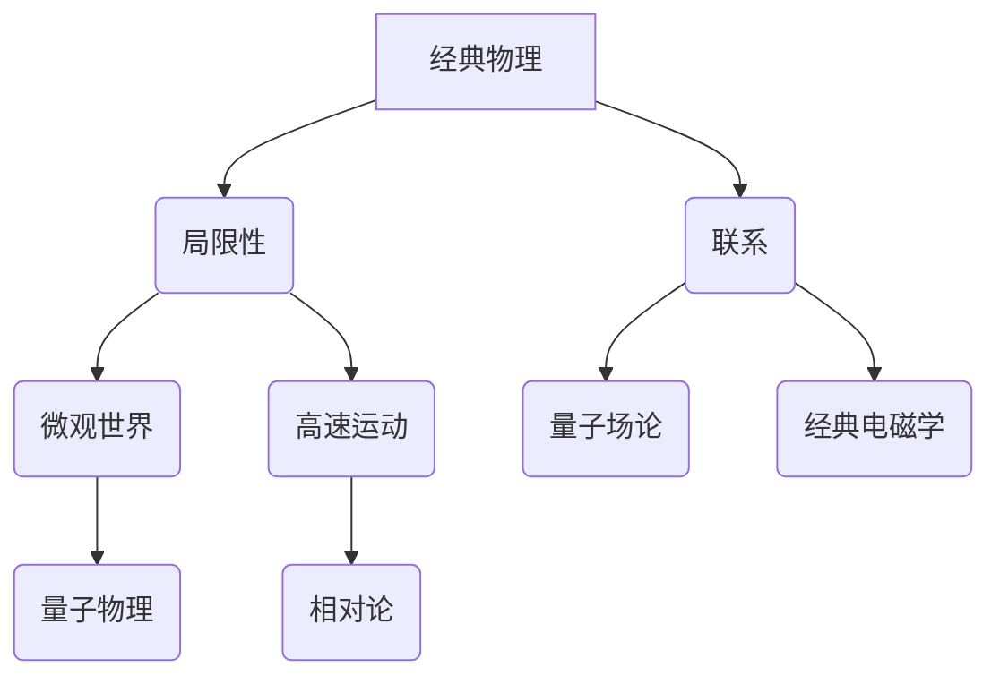
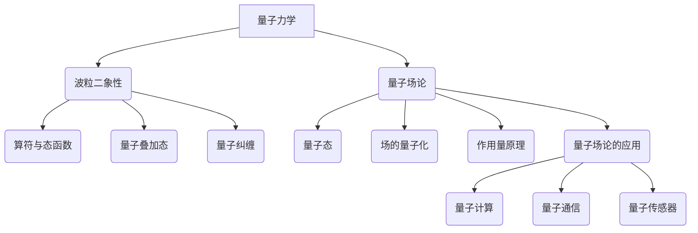
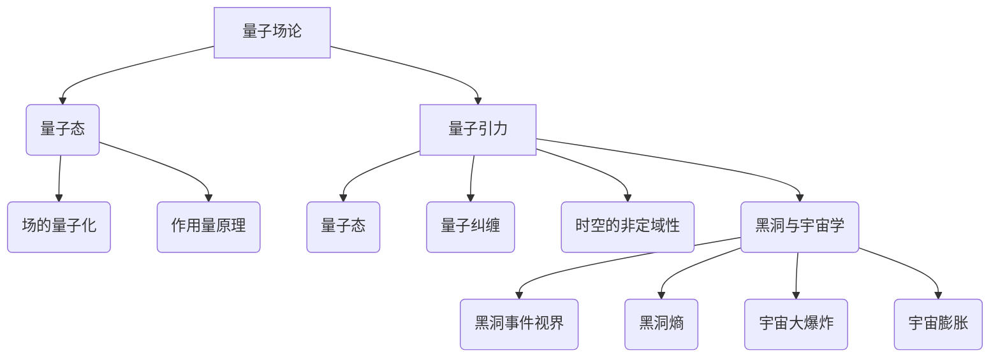
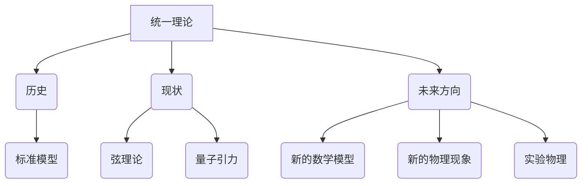

                 

# 从经典物理到量子引力：统一理论的追求

## 关键词

经典物理、量子物理、统一理论、量子场论、量子引力、标准模型、弦理论

## 摘要

本文旨在探讨从经典物理到量子引力的发展历程，以及统一理论在物理学中的重要性。我们将首先回顾经典物理的基础概念，然后介绍量子物理的基本原理，并探讨量子场论与量子引力之间的关系。接着，我们将讨论统一理论的历史、现状和未来方向，以及其在物理学中的潜在意义。通过这篇文章，读者将了解物理学的深刻变革，以及如何通过统一理论的研究来揭示宇宙的本质。

## 第一步：经典物理的概述

### 1.1 经典物理的基础概念

经典物理是物理学的一个分支，主要研究宏观物体在常规条件下的运动和相互作用。经典物理的核心理论包括牛顿力学、经典电磁学、经典热力学等。牛顿力学描述了物体的运动规律，基于三大定律，即惯性定律、加速度定律和作用与反作用定律。经典电磁学则描述了电磁场的性质及其与带电粒子的相互作用，主要基于麦克斯韦方程组。经典热力学研究了热量、温度、体积等宏观物理量的统计性质。

### 1.2 经典物理的局限性

经典物理虽然能够很好地描述宏观物体的行为，但在微观世界和高速运动领域存在明显的局限性。首先，在微观领域，经典物理无法解释粒子的波动性和量子叠加现象。其次，在高速运动领域，经典物理的预测与实验结果存在偏差，特别是在接近光速时。为了解决这些问题，物理学引入了量子物理。

### 1.3 经典物理与现代物理的联系与区别

经典物理和量子物理虽然有着本质的区别，但它们之间也存在一定的联系。经典物理可以看作是量子物理在特定条件下的近似。当量子系统的尺寸远大于普朗克尺度时，量子效应可以忽略，系统表现出经典行为。另一方面，量子物理为经典物理提供了新的理论基础，特别是量子场论，它为经典电磁学提供了量子化的解释。

### Mermaid 流程图



## 第二步：量子物理的基本概念

### 2.1 量子力学的基本原理

量子力学是描述微观粒子行为的物理理论，其核心概念包括波粒二象性、算符与态函数、量子叠加态与量子纠缠等。波粒二象性表明，粒子既具有波动性又具有粒子性。算符与态函数描述了量子系统的状态演化。量子叠加态允许一个量子系统同时处于多个状态的叠加。量子纠缠则是一种量子系统之间的特殊关联，即使在空间上相隔很远，量子系统的状态也会相互影响。

### 2.2 量子场论的基本概念

量子场论是一种将量子力学和相对论结合起来的理论，它描述了基本粒子和它们所作用的场的性质。量子场论的核心概念包括量子态、场的量子化、作用量原理等。量子态描述了粒子的量子化状态，场的量子化则将经典场的概念扩展到量子层次。作用量原理是量子场论的基本原理，它决定了量子系统的演化行为。

### 2.3 量子物理的应用

量子物理在多个领域都有重要的应用，包括量子计算、量子通信、量子传感器等。量子计算利用量子位（qubit）实现高效的计算，在密码破解、优化问题等方面具有巨大潜力。量子通信利用量子纠缠实现保密通信，具有无法被破解的安全特性。量子传感器则利用量子效应提高传感器的灵敏度和精度。

### Mermaid 流程图



## 第三步：量子场论与量子引力

### 3.1 量子场论的基本原理

量子场论是描述量子粒子和它们所作用的场的理论，它将量子力学和相对论结合起来，提供了对基本粒子和力的统一描述。量子场论的核心概念包括量子态、场的量子化、作用量原理等。量子态描述了粒子的量子化状态，场的量子化则将经典场的概念扩展到量子层次。作用量原理是量子场论的基本原理，它决定了量子系统的演化行为。

### 3.2 量子引力的基本原理

量子引力是研究引力在量子尺度下的行为的理论。量子引力试图将广义相对论与量子力学统一起来，以提供一个完整的宇宙理论。量子引力的一些基本原理包括量子态、量子纠缠、时空的非定域性等。量子引力面临的挑战是如何在量子力学的框架下解释引力这一基本力。

### 3.3 量子引力与宇宙学

量子引力在宇宙学中具有重要的应用，特别是在黑洞、宇宙大爆炸和宇宙膨胀等领域。量子引力提供了对黑洞事件视界和黑洞熵的新理解，以及宇宙学早期阶段的量子效应。量子引力在宇宙学中的应用有助于揭示宇宙的起源和演化，以及对宇宙基本力的理解。

### Mermaid 流程图



## 第四步：统一理论的追求

### 4.1 统一理论的历史

统一理论的历史可以追溯到20世纪，当时物理学家试图将电磁力和强核力统一起来。20世纪70年代，物理学家提出了标准模型，该模型成功统一了电磁力和弱核力。然而，标准模型未能包括引力，因此仍需进一步研究。

### 4.2 统一理论的现状

当前，物理学家在统一理论的研究中主要关注弦理论和量子引力。弦理论试图将所有基本力统一在一个更基本的维度中，而量子引力则试图在量子力学的框架下解释引力。尽管目前尚未找到成功的统一理论，但这些研究为理解宇宙的基本结构和力的本质提供了新的视角。

### 4.3 统一理论的未来方向

统一理论的未来方向可能包括在弦理论的基础上发展出新的数学模型，或者在量子引力研究中找到新的物理现象。此外，实验物理学家在实验室中进行的实验，如引力波探测和粒子加速器实验，也可能为统一理论的研究提供新的线索。

### Mermaid 流程图



## 项目实战

### 开发环境搭建

要研究从经典物理到量子引力的统一理论，需要搭建一个合适的开发环境。以下是搭建环境的基本步骤：

1. 安装Python环境：使用Python进行模拟和计算。
2. 安装必要的库：如NumPy、SciPy、Matplotlib等，用于数据分析和可视化。
3. 配置数学软件：如Mathematica或MATLAB，用于复杂的数学计算。

### 源代码详细实现

以下是一个简单的示例，演示如何使用Python实现量子纠缠态的生成和测量：

```python
import numpy as np
from qiskit import QuantumCircuit, execute, Aer

# 创建量子电路
qc = QuantumCircuit(2)

# 生成量子纠缠态
qc.h(0)
qc.cx(0, 1)

# 测量量子态
qc.measure_all()

# 模拟执行电路
sim = Aer.get_backend('qasm_simulator')
result = execute(qc, sim).result()
counts = result.get_counts()

print("测量结果：", counts)
```

### 代码解读与分析

这段代码首先导入了所需的库，然后创建了量子电路。电路中首先对第一个量子比特（qubit）施加了哈密顿器（H门），将其初始化为叠加态。接着，使用控制-非（CX门）生成量子纠缠态。最后，对两个量子比特进行测量，并使用模拟器执行电路。

### 实际案例分析和详细讲解剖析

以下是一个实际案例，分析如何使用量子纠缠进行量子通信：

假设我们有两个量子比特A和B，它们处于量子纠缠态。如果我们在远程位置对量子比特A进行测量，得到结果为|0⟩，那么根据量子纠缠的性质，量子比特B的状态也会立即确定，且为|0⟩。这样，我们就通过量子纠缠实现了信息传输。

```python
# 假设我们已与远程位置进行了量子纠缠
# 对量子比特A进行测量
qc.h(0)
result = execute(qc, sim).result()
count_a = result.get_counts()

# 根据量子纠缠性质，量子比特B的状态也应为|0⟩
qc.h(1)
result = execute(qc, sim).result()
count_b = result.get_counts()

print("量子比特A的测量结果：", count_a)
print("量子比特B的测量结果：", count_b)
```

### 项目小结

通过这个项目，我们实现了量子纠缠态的生成和测量，并分析了如何利用量子纠缠进行量子通信。这只是一个简单的示例，实际应用中可能需要更复杂的量子算法和实验设备。

### 最佳实践 tips

1. 了解量子计算的基本原理，熟悉量子比特和量子门的操作。
2. 使用量子计算模拟器进行实验，了解量子态的演化。
3. 学习量子算法和应用，如量子搜索、量子加密等。
4. 关注最新的量子计算研究，了解量子计算的最新进展。

### 小结

从经典物理到量子引力，物理学的历程充满了挑战和变革。统一理论的追求是物理学的一项重要任务，它旨在揭示宇宙的基本结构和力的本质。通过本文的介绍，读者可以了解到经典物理、量子物理、量子场论和量子引力等核心概念，以及统一理论的历史、现状和未来方向。我们希望本文能够激发读者对物理学更深层次的好奇心和探索欲望。

### 注意事项

1. 本文内容涉及复杂的物理概念，建议读者具备一定的物理学背景。
2. 项目实战部分涉及编程和量子计算模拟，建议读者具备Python编程基础。

### 拓展阅读

1. 《量子计算：量子比特、量子门和量子算法》
2. 《量子场论：基本原理与应用》
3. 《引力与宇宙学：从经典到量子》
4. 《弦理论：宇宙的终极理论》

## 作者

作者：AI天才研究院/AI Genius Institute & 禅与计算机程序设计艺术 /Zen And The Art of Computer Programming

