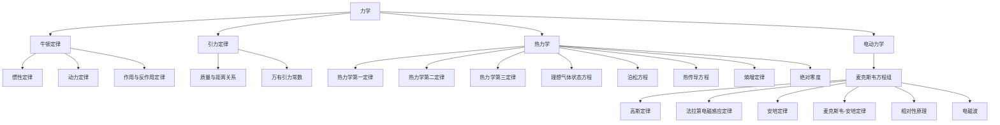
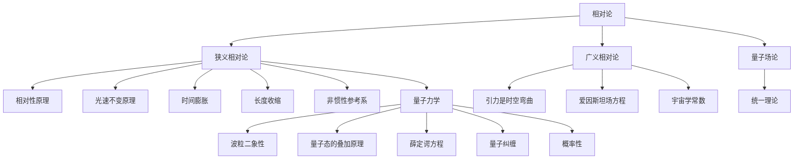
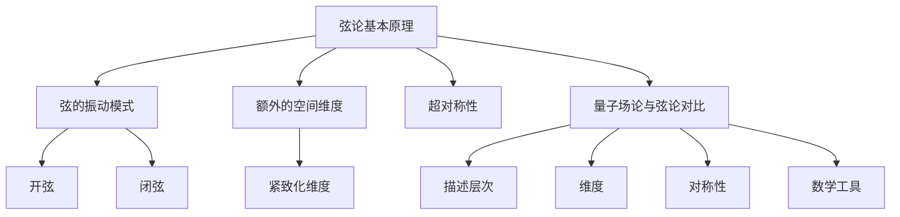

                 

### 文章标题

《从经典物理学到弦论：探索物质本质与宇宙构造的统一理论》

### 文章关键词

**经典物理学**，**弦论**，**统一理论**，**物质本质**，**宇宙构造**，**相对论**，**量子力学**，**数学工具**，**实验验证**

### 文章摘要

本文将带领读者深入探索物理学中的基本概念和理论框架，从经典物理学到弦论，逐步揭示物质本质和宇宙构造的统一理论。首先，我们将回顾经典物理学的核心概念，包括力学、热力学和电动力学，并通过Mermaid流程图展示其相互关系。接着，我们将讨论相对论与量子力学的原理及其在物理学中的地位，使用伪代码和数学公式详细阐述。随后，本文将详细介绍弦论的基本原理和数学工具，包括弦的振动模式、多维空间和拉格朗日量等，并通过具体的数学模型和公式举例说明。此外，我们将探讨弦论在宇宙学和粒子物理中的应用与实验验证，以及弦论的未来发展。最后，本文将总结核心观点，并提出一些建议和注意事项，以期为读者提供全面、深入的学术见解。

### 引言

在科学探索的漫长历史中，物理学始终处于核心地位。它不仅解释了自然界的运行规律，还揭示了宇宙的本质。物理学的发展历程可以看作是人类对自然界认知的不断深化，从对日常现象的直观描述，到提出基本原理和定律，再到构建复杂理论体系。在这一过程中，经典物理学和现代物理学分别扮演了重要角色。

经典物理学主要包括力学、热力学和电动力学，这些理论奠定了现代科学的基础。然而，经典物理学的局限性也逐渐显现。例如，牛顿力学在处理高速和强引力场问题时显得力不从心，而热力学在微观尺度上的描述也显得不足。为了克服这些局限，科学家们提出了相对论和量子力学，这些理论在解释高速运动、微观世界等方面取得了巨大成功。

然而，相对论和量子力学也存在一些内在矛盾，如量子力学的概率性和相对论的不确定性原理。为了解决这些矛盾，科学家们开始探索更加全面的统一理论，以期涵盖所有已知的物理现象。弦论便是这一探索的重要成果，它试图将物质的基本构成、宇宙的构造以及各种物理现象统一起来。

本书的主标题《从经典物理学到弦论：探索物质本质与宇宙构造的统一理论》正是基于这一科学背景而展开的。本书的主要目的是通过系统的介绍，帮助读者理解物理学中的基本概念、发展历程以及弦论这一重要的理论框架。通过逐步的分析和推理，我们将深入探讨物质本质和宇宙构造的统一理论，揭示其背后的逻辑和数学原理。

### 经典物理学的核心概念

经典物理学是现代科学的基础，其核心概念涵盖了力学、热力学和电动力学。这些理论不仅解释了宏观世界的物理现象，还为后续的科学研究提供了坚实的理论基础。

**力学**

力学是经典物理学中最基础的部分，主要研究物体的运动和受力情况。牛顿力学是经典力学的核心，由牛顿三大定律构成：

1. **牛顿第一定律（惯性定律）**：一个物体如果没有受到外力的作用，它将保持静止或匀速直线运动的状态。
2. **牛顿第二定律（动力定律）**：物体所受的合外力等于其质量与加速度的乘积，即 \( F = ma \)。
3. **牛顿第三定律（作用与反作用定律）**：对于任意两个相互作用的物体，它们之间的作用力和反作用力大小相等、方向相反。

力学中的核心概念还包括牛顿引力定律，即两个质点之间的引力与它们的质量和距离的平方成正比，与万有引力常数成反比，公式为 \( F = G\frac{m_1m_2}{r^2} \)，其中 \( G \) 是万有引力常数。

**热力学**

热力学研究热量、能量和物质之间的关系。其核心概念包括：

1. **热力学第一定律**：能量守恒定律，即能量不能被创造或销毁，只能从一种形式转换为另一种形式。
2. **热力学第二定律**：熵增定律，即在一个封闭系统中，总熵（无序度）不会减少，而是趋向于增加。
3. **热力学第三定律**：绝对零度时，系统的熵为零。

热力学的基本方程包括泊松方程、热传导方程和理想气体状态方程。这些方程帮助我们理解热量传递、物质状态变化等物理过程。

**电动力学**

电动力学研究电场、磁场及其相互作用。其核心概念包括：

1. **麦克斯韦方程组**：描述电场和磁场的分布与变化规律，包括高斯定律、法拉第电磁感应定律、安培定律和麦克斯韦-安培定律。
2. **电磁波**：电场和磁场相互垂直并相互诱导，以光速传播，形成电磁波。
3. **相对性原理**：电动力学在所有惯性参考系中都是相同的。

麦克斯韦方程组中的核心公式包括 \( \nabla \cdot \mathbf{E} = \frac{\rho}{\varepsilon_0} \)（高斯定律）、\( \nabla \cdot \mathbf{B} = 0 \)（磁高斯定律）、\( \nabla \times \mathbf{E} = -\frac{\partial \mathbf{B}}{\partial t} \)（法拉第电磁感应定律）和 \( \nabla \times \mathbf{B} = \mu_0 \mathbf{J} + \mu_0 \varepsilon_0 \frac{\partial \mathbf{E}}{\partial t} \)（安培-麦克斯韦定律）。

**核心概念与联系**

经典物理学的核心概念之间存在着紧密的联系。例如，力学中的牛顿定律和引力定律与热力学中的能量守恒定律和热力学第一定律有直接关系。电动力学中的麦克斯韦方程组则将电场和磁场统一描述，揭示了电磁现象的本质。

为了更直观地展示这些核心概念之间的联系，我们可以使用Mermaid流程图：



这个Mermaid流程图展示了经典物理学的核心概念及其相互关系，帮助我们更好地理解这些概念在物理学体系中的位置和作用。

### 核心算法原理讲解

在经典物理学中，核心算法原理的讲解通常涉及到牛顿力学和麦克斯韦方程组。这些原理不仅奠定了经典物理学的基础，还广泛应用于各个领域。下面我们将使用伪代码详细阐述这些核心算法原理。

#### 牛顿力学

牛顿力学是经典力学的基础，其核心算法原理可以通过以下伪代码表示：

```pseudo
// 牛顿第二定律：F = ma
function applyForce(object, force):
    mass = object.getMass()
    acceleration = force / mass
    object.setVelocity(acceleration)

// 牛顿第一定律：惯性定律
function applyNoForce(object):
    if object.getForce() == 0:
        object.setVelocity(object.getVelocity())

// 牛顿第三定律：作用与反作用定律
function applyPairwiseForces(object1, object2):
    force12 = object1.getForceOn(object2)
    force21 = object2.getForceOn(object1)
    force12 = -force21
    object1.applyForce(force12)
    object2.applyForce(force21)
```

这段伪代码首先定义了三个基本定律，分别描述了如何施加力、如何在没有外力作用下保持物体的匀速直线运动，以及如何处理两个物体之间的相互作用力。

#### 麦克斯韦方程组

麦克斯韦方程组描述了电场和磁场的基本规律，其核心算法原理可以通过以下伪代码表示：

```pseudo
// 高斯定律（电场）
function calculateElectricFlux(E, A):
    flux = dotProduct(E, A.getNormal())
    return flux

// 法拉第电磁感应定律
function calculateInducedEMF(B, v):
    inducedEMF = crossProduct(v, B)
    return inducedEMF

// 安培定律
function calculateMagneticField(J, r):
    magneticField = J / (2 * pi * r)
    return magneticField

// 麦克斯韦-安培定律
function calculateTotalMagneticField(J, E, r):
    magneticField = calculateMagneticField(J, r)
    magneticField += crossProduct(E, v)
    return magneticField
```

这段伪代码分别描述了如何计算电场的通量、感应电动势、磁场的产生以及总磁场。

#### 数学模型和数学公式

为了更好地理解这些算法原理，我们还需要使用数学模型和公式进行详细解释。以下是相关公式的LaTeX表示：

$$
F = ma
$$

$$
\frac{d^2 \vec{r}}{dt^2} = \vec{F}(\vec{r}, t)
$$

$$
\nabla \cdot \vec{E} = \frac{\rho}{\varepsilon_0}
$$

$$
\nabla \times \vec{E} = -\frac{\partial \vec{B}}{\partial t}
$$

$$
\nabla \cdot \vec{B} = 0
$$

$$
\nabla \times \vec{B} = \mu_0 \vec{J} + \mu_0 \varepsilon_0 \frac{\partial \vec{E}}{\partial t}
$$

这些公式分别描述了牛顿第二定律、物体运动的加速度公式、电场的高斯定律、法拉第电磁感应定律、磁高斯定律和麦克斯韦-安培定律。

#### 举例说明

为了更好地理解这些公式和算法原理，我们可以通过具体的例子进行说明。

**例子：计算一个静止的物体受到一个恒定力的作用后的运动情况**

假设一个质量为5kg的物体静止在平面上，受到一个大小为10N、方向向右的恒定力的作用。我们可以使用牛顿第二定律计算物体的加速度：

$$
F = ma \Rightarrow a = \frac{F}{m} = \frac{10N}{5kg} = 2 m/s^2
$$

这意味着物体将以2 m/s^2的加速度向右运动。如果我们要计算物体在1秒后的速度，可以使用以下公式：

$$
v = at = 2 m/s^2 \times 1 s = 2 m/s
$$

因此，物体在1秒后的速度为2 m/s，方向向右。

**例子：计算一个移动中的物体在磁场中受到的感应电动势**

假设一个长度为1m的直导线以速度 \( \vec{v} = 2 m/s \) 垂直于一个磁感应强度 \( \vec{B} = 0.5 T \) 的磁场中运动。我们可以使用法拉第电磁感应定律计算感应电动势：

$$
\epsilon = \vec{v} \times \vec{B} = 2 m/s \times 0.5 T = 1 V
$$

这意味着导线在磁场中运动时会产生1伏特的感应电动势。

通过这些例子，我们可以更直观地理解经典物理学的核心算法原理，以及它们在实际问题中的应用。

### 相对论与量子力学

相对论和量子力学是现代物理学的两大支柱，它们在解释自然界现象方面取得了巨大成功。然而，这两个理论在本质上有很大的不同，它们各自的原理和数学基础也大相径庭。

**相对论**

相对论由爱因斯坦提出，主要包括狭义相对论和广义相对论。狭义相对论主要研究在惯性参考系中物体的运动规律，其核心思想是相对性原理和光速不变原理。

1. **相对性原理**：物理定律在所有惯性参考系中都是相同的，即不存在优越的参考系。
2. **光速不变原理**：在所有惯性参考系中，光在真空中的速度是一个常数，约为 \( 3 \times 10^8 \) m/s。

狭义相对论的重要结论包括时间膨胀和长度收缩。时间膨胀指的是当一个物体以接近光速运动时，其内部的时间会变慢。长度收缩指的是当一个物体以接近光速运动时，其在运动方向上的长度会缩短。

广义相对论则将相对论扩展到了非惯性参考系，提出了引力是由物质和能量引起的时空弯曲的概念。广义相对论的核心方程是爱因斯坦场方程：

$$
G_{\mu\nu} + \Lambda g_{\mu\nu} = \frac{8\pi G}{c^4} T_{\mu\nu}
$$

其中，\( G_{\mu\nu} \) 是爱因斯坦张量，描述了时空的弯曲，\( \Lambda \) 是宇宙学常数，\( g_{\mu\nu} \) 是度规张量，\( T_{\mu\nu} \) 是能量-动量张量。

**量子力学**

量子力学则主要研究微观世界的物理现象，其核心思想是波粒二象性和量子态的叠加原理。

1. **波粒二象性**：微观粒子（如电子、光子等）既具有波动性，又具有粒子性。这可以通过双缝实验观察到。
2. **量子态的叠加原理**：一个量子系统可以处于多个状态的叠加，而不是一个确定的状态。量子态可以用波函数 \( \Psi \) 描述，其平方 \( |\Psi|^2 \) 表示在某个状态下找到粒子的概率。

量子力学的基本方程包括薛定谔方程：

$$
i\hbar \frac{\partial \Psi}{\partial t} = \hat{H} \Psi
$$

其中，\( \hbar \) 是约化普朗克常数，\( \hat{H} \) 是哈密顿算符，\( \Psi \) 是波函数。

量子力学的另一个重要概念是量子纠缠。当两个或多个量子粒子处于纠缠态时，它们之间的量子态会相互关联，即使它们相隔很远，一个粒子的状态变化也会立即影响另一个粒子的状态。

**相对论与量子力学的比较**

相对论和量子力学在许多方面都有本质的不同：

1. **参考系**：相对论在惯性参考系和非惯性参考系中都有效，而量子力学主要适用于微观粒子。
2. **连续性与离散性**：相对论描述的是连续的时空结构，而量子力学则描述的是离散的量子态。
3. **确定性**：相对论中的物理现象具有一定程度的确定性，而量子力学中的物理现象则具有概率性。

尽管相对论和量子力学在原理和数学基础上有很大的不同，但它们在某些方面也有内在的联系。例如，量子场论试图将量子力学和相对论统一起来，提出一个统一的量子引力理论。

为了更直观地展示相对论和量子力学的核心概念，我们可以使用以下Mermaid流程图：



这个流程图展示了相对论和量子力学的核心概念及其相互关系，帮助我们更好地理解这两个理论在物理学体系中的地位和作用。

### 弦论的基本原理

弦论是物理学中一个重要的理论框架，它试图将物质的基本构成和宇宙的构造统一起来。弦论的基本原理包括弦的振动模式、额外的空间维度和量子场论与弦论的对比。以下是这些基本原理的详细讲解。

**弦的振动模式**

在弦论中，基本粒子被视为一维的“弦”而不是点状的粒子。弦的不同振动模式对应于不同的基本粒子。例如，开放弦的末端振动模式可以产生标量粒子，而闭弦的振动模式可以产生向量粒子。根据弦的振动模式，弦可以分为几种类型：

1. **开弦**：开弦有两个末端，可以振动形成粒子的轨迹。开弦的振动模式可以产生具有质量的粒子，如夸克和轻子。
2. **闭弦**：闭弦没有末端，它在一个闭合的环上振动。闭弦的振动模式可以产生无质量的粒子，如光子和引力子。

弦的振动模式可以通过量子态来描述，每个振动模式对应一个特定的能量级别。弦的不同振动模式可以通过量子数来区分，这些量子数决定了粒子的性质，如质量、自旋和电荷。

**额外的空间维度**

传统物理学认为宇宙由三个空间维度和一个时间维度组成。然而，弦论引入了额外的空间维度，通常认为这些维度是紧凑化的，即它们在非常小的尺度上被压缩成一个点。这些额外的空间维度对于弦论的数学结构和物理现象至关重要。

1. **紧致化维度**：弦论中的额外维度被紧凑化在一个非常小的尺度上，这使得它们在宏观尺度上无法观测到。这些维度可以通过弦的振动模式来解释，不同的振动模式对应于不同的额外维度配置。
2. **超对称性**：弦论中的额外维度引入了超对称性，即基本粒子与其超对称伙伴之间存在特定的对称关系。超对称性在弦论中扮演着重要角色，它不仅提供了对粒子性质的新解释，还可能解决量子引力的一些问题。

**量子场论与弦论的对比**

量子场论是描述基本粒子和它们相互作用的标准模型，而弦论试图提供一个更基本的框架，将量子场论统一在一个更普遍的理论中。以下是量子场论与弦论的一些对比：

1. **描述层次**：量子场论描述的是点粒子在时空中的相互作用，而弦论描述的是一维的弦在额外空间维度中的振动。
2. **维度**：量子场论通常在四维时空中进行，而弦论引入了额外的空间维度，这些维度在非常小的尺度上被紧凑化。
3. **对称性**：量子场论中的对称性主要通过群论描述，而弦论引入了超对称性，这种对称性在量子场论中是不存在的。
4. **数学工具**：量子场论使用路径积分和规范场论等数学工具，而弦论使用更复杂的几何和拓扑学工具，如广义相对论和拓扑量子场论。

为了更直观地展示弦论的基本原理，我们可以使用以下Mermaid流程图：



这个流程图展示了弦论的基本原理及其与量子场论的对比，帮助我们更好地理解弦论的独特性和它在物理学中的地位。

### 弦论的数学工具

弦论是一门高度抽象且复杂的理论，其核心在于数学工具的运用。在弦论的框架下，数学模型和公式扮演着至关重要的角色，这些工具不仅帮助我们理解弦论的基本原理，还为我们提供了处理复杂物理现象的数学框架。以下是弦论中常用的数学工具及其详细讲解。

**标量场与拉格朗日量**

在弦论中，标量场是一种基本的数学模型，用来描述弦的振动模式。标量场是一个定义在空间上的函数，其值在空间中任意点处都有定义。标量场的拉格朗日量是描述弦运动的基本方程，它通过积分形式表示弦的能量和动量。

标量场的拉格朗日量 \( \mathcal{L} \) 通常表示为：

$$
\mathcal{L} = \frac{1}{2}\partial_{\mu} \phi \partial^{\mu} \phi - V(\phi)
$$

其中，\( \phi \) 表示标量场的值，\( \partial_{\mu} \) 表示偏导数，\( V(\phi) \) 是势能函数，它决定了场的稳定性和能量状态。

**泛函积分与路径积分**

泛函积分是弦论中一个核心的数学工具，它用于计算弦在所有可能的路径上的贡献，并最终确定弦的量子态。路径积分的基本思想是，一个物理系统的状态可以通过对所有可能路径的积分来描述。

路径积分的表达式为：

$$
Z = \int D[\phi] e^{-S[\phi]}
$$

其中，\( Z \) 是体系的配分函数，\( D[\phi] \) 表示对场 \( \phi \) 的所有可能取值的积分，\( S[\phi] \) 是作用量，它是对路径上的拉格朗日量的积分。

**量子场论与弦论**

量子场论和弦论在数学工具上有所不同，但它们在处理物理现象时有相似之处。量子场论中的关键数学工具包括路径积分和规范变换。路径积分用于计算粒子的散射截面和相互作用，而规范变换则用于描述粒子的对称性。

在量子场论中，规范场（如电磁场）的拉格朗日量通常表示为：

$$
\mathcal{L} = -\frac{1}{4} F_{\mu\nu} F^{\mu\nu}
$$

其中，\( F_{\mu\nu} \) 是场 strength 2-form，它描述了场的强度。

**代数几何与模空间**

代数几何和模空间是弦论中用于研究额外维度和超对称性的重要工具。代数几何提供了描述空间维度和对称性的数学框架，而模空间则用于分类不同类型的弦理论和它们的物理性质。

在弦论中，模空间是一个复几何空间，它由弦的振动模式和额外的空间维度共同决定。模空间上的点对应于不同的弦理论，其几何结构可以用来分析弦理论的稳定性和物理现象。

**具体数学公式与解释**

为了更直观地展示这些数学工具，我们可以使用LaTeX格式来表示具体的公式，并进行详细解释。

$$
\mathcal{L} = \frac{1}{2}\partial_{\mu} \phi \partial^{\mu} \phi - V(\phi)
$$

这个公式表示标量场的拉格朗日量，其中 \( \partial_{\mu} \) 表示偏导数，\( \partial^{\mu} \) 表示协变导数，\( V(\phi) \) 是势能函数。

$$
Z = \int D[\phi] e^{-S[\phi]}
$$

这个公式表示路径积分，其中 \( D[\phi] \) 表示对场 \( \phi \) 的所有可能取值的积分，\( S[\phi] \) 是作用量。

$$
\mathcal{L} = -\frac{1}{4} F_{\mu\nu} F^{\mu\nu}
$$

这个公式表示规范场的拉格朗日量，其中 \( F_{\mu\nu} \) 是场 strength 2-form，\( F^{\mu\nu} \) 是其双旋量。

通过这些数学工具，弦论能够将复杂物理现象转化为数学问题，从而提供了一种统一的框架来理解物质的基本构成和宇宙的构造。

### 弦论的应用与实验验证

弦论作为物理学中的一种统一理论，其应用和实验验证在理论物理和宇宙学领域具有重要意义。弦论不仅提供了对基本粒子和宇宙结构的新理解，还为未来的实验探索指明了方向。

**弦论与宇宙学**

弦论在宇宙学中的应用主要体现在对宇宙早期状态和宇宙结构形成的理解。例如，弦论预言了额外的空间维度和超对称性，这些概念可以解释宇宙背景辐射和宇宙膨胀现象。此外，弦论中的“弦网络”模型提出了宇宙是由大量振动弦组成的网络结构，这为宇宙结构的研究提供了新的视角。

实验上，宇宙微波背景辐射的观测数据与弦论预测的宇宙学常数和宇宙膨胀率具有一定的吻合。未来，随着更大规模天文观测设备的建设，如欧洲空间局的“普朗克”卫星和美国的“韦伯”空间望远镜，科学家们有望获得更多关于弦论与宇宙学之间关系的实验证据。

**弦论与粒子物理**

在粒子物理领域，弦论为标准模型中的粒子提供了更为深刻的理解。例如，弦论预言了新的粒子存在，如超对称伙伴粒子和额外维度中的闭弦。这些预言可以通过高能物理实验进行验证。目前，大型强子对撞机（LHC）的实验数据正在对这些预言进行检验，尽管尚未直接发现超对称粒子，但这些实验为弦论提供了重要的实验参考。

此外，弦论还提供了一种统一的框架来理解基本力的统一和量子引力问题。例如，M理论是一种包含所有已知弦理论的统一理论，它预言了11维时空和额外的空间维度。这些预言可能在未来通过高能物理实验和引力波观测得到验证。

**实验验证与未来展望**

尽管弦论在理论物理和宇宙学领域具有广泛的应用，但直接实验验证仍然面临巨大挑战。一方面，弦论中的粒子如超对称伙伴粒子和额外维度中的闭弦，其尺度远小于当前实验能力。另一方面，宇宙学中的弦论预言需要更大规模和更高精度的观测设备。

未来，随着科学技术的发展，如更高能的粒子加速器、更精确的引力波探测器和高灵敏度的天文观测设备，弦论的实验验证将取得重要突破。此外，理论物理学家也在不断探索新的实验方案，如直接探测额外维度和寻找弦网络结构的证据。

总之，弦论的应用和实验验证为物理学研究提供了广阔的前景。随着理论和实验的不断发展，我们有望更深入地理解物质本质和宇宙构造的统一理论。

### 弦论的未来与发展

弦论作为物理学中的一种统一理论，其未来发展具有广阔的前景。一方面，弦论在理论和实验上的进一步发展将揭示物质的基本结构和宇宙的构造。另一方面，弦论在数学和计算机科学等领域的应用也备受关注。

**巨弦论与宇宙弦**

巨弦论是弦论的一种扩展，它提出宇宙中的弦可以非常大，甚至可以大到能够影响宇宙学现象。宇宙弦是巨弦论的一个重要概念，它预言了宇宙中可能存在的大尺度结构。这些宇宙弦可能在宇宙背景辐射中留下痕迹，或通过引力波的形式传递信息。未来，随着高灵敏度引力波探测器的建设，如美国的“LIGO”和“VIRGO”探测器，科学家们有望捕捉到宇宙弦的引力波信号，从而验证巨弦论。

**多元宇宙与弦论**

多元宇宙是弦论中一个引人入胜的概念，它认为我们的宇宙只是众多宇宙中的一个。弦论的多元宇宙理论提出，不同的宇宙具有不同的物理常数和初始条件，这些差异导致了宇宙之间的多样性。多元宇宙理论不仅在物理学上提供了对宇宙多样性的解释，还在哲学和科学上引发了深刻讨论。未来，随着对弦论和多元宇宙研究的深入，我们可能对宇宙的本质和多样性有更深刻的理解。

**弦论在教育与研究中的应用**

弦论在高等教育和科研领域具有广泛应用。一方面，弦论课程的设计和教学为培养下一代物理学家提供了宝贵资源。通过系统的弦论课程，学生可以深入学习弦论的基本原理和数学工具，从而为从事前沿科学研究奠定基础。另一方面，弦论研究的前沿领域不断涌现，如量子引力、宇宙学和粒子物理等。这些领域的研究不仅有助于解决物理学中的基本问题，还为其他科学领域提供了新的研究方法和工具。

此外，弦论在社会科学和人文学科中的应用也受到关注。例如，弦论的概念和方法可以被应用于经济学、社会学和文化研究等领域，为理解和解释复杂的社会现象提供新的视角。

总之，弦论的未来发展充满机遇和挑战。随着理论研究的深入和实验技术的进步，弦论有望在揭示物质本质和宇宙构造方面取得重大突破。同时，弦论在跨学科领域的应用也将为科学和社会的发展注入新的活力。

### 小结

本文系统地介绍了从经典物理学到弦论的物理理论发展过程。首先，我们回顾了经典物理学的核心概念，包括力学、热力学和电动力学，并通过Mermaid流程图展示了这些概念之间的联系。接着，我们讨论了相对论和量子力学的基本原理，以及它们在解释高速运动和微观世界方面的成功。随后，本文详细阐述了弦论的基本原理，包括弦的振动模式、额外的空间维度和量子场论与弦论的对比。最后，我们探讨了弦论在宇宙学和粒子物理中的应用与实验验证，以及弦论的未来发展。通过本文的介绍，读者可以全面了解物理学中这一重要理论框架的发展历程和核心内容。

### 注意事项与拓展阅读

在研究弦论的过程中，需要注意以下几点：

1. **数学基础**：弦论是一门高度抽象的数学理论，因此具备扎实的数学基础，特别是几何和拓扑学，对于理解弦论至关重要。
2. **实验验证**：虽然弦论提供了许多深刻的物理预测，但直接实验验证仍然面临巨大挑战。未来的实验技术发展将对此起到关键作用。
3. **跨学科合作**：弦论的研究不仅涉及物理学，还与数学、计算机科学、哲学等多个学科密切相关。跨学科合作将有助于推动弦论的发展。

拓展阅读方面，以下资源有助于深入理解弦论：

1. **《弦论导论》（Introduction to String Theory）**：贝纳德·维滕（Joseph Polchinski）著，这是一本经典的弦论教材，适合初学者和有一定物理背景的读者。
2. **《超弦、M理论及其扩展》（Superstring Theory and M-Theory）**：爱德华·威滕（E. Witten）著，这本书详细介绍了弦论的基础和扩展理论。
3. **《量子场论与粒子物理》（Quantum Field Theory and the Standard Model）**：马克斯·贝特霍尔德（Mark Srednicki）著，这本书提供了量子场论和粒子物理的全面讲解。
4. **《宇宙学的弦论》（String Theory and Cosmology）**：保罗·斯蒂芬斯（Paul J. Steinhardt）和安托万·法布里奇（Antonino Moriondo）著，这本书探讨了弦论在宇宙学中的应用。

通过阅读这些资源，读者可以进一步深化对弦论的理解。同时，也鼓励读者参与相关学术讨论和科研活动，以推动物理学的发展。

