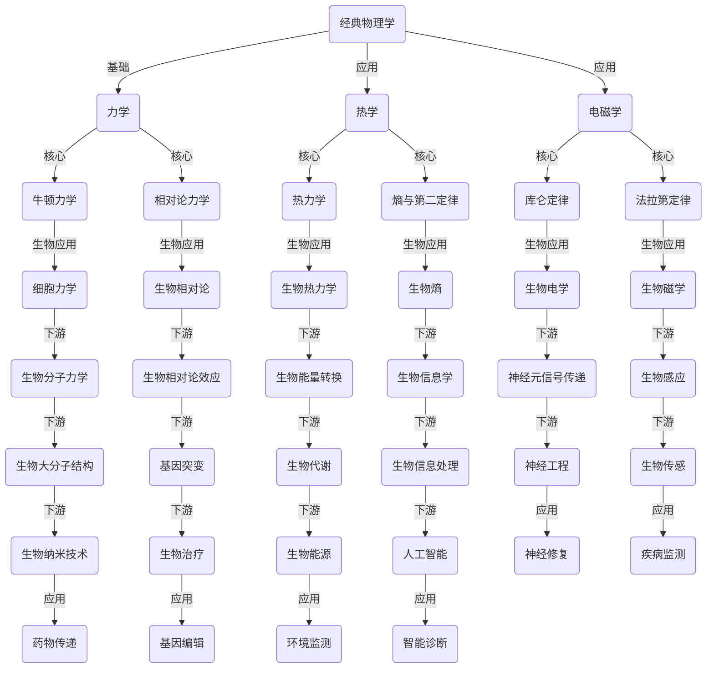

                 

### 引言

随着科学技术的飞速发展，经典物理学的理论框架已经逐渐显现出其局限性。在探索生命和物质世界的过程中，单一学科的理论已经无法全面解释复杂的生物现象。因此，将经典物理学与生物学、化学等学科相结合，形成了生物物理学这一跨学科领域。本文旨在从经典物理学的角度出发，探讨生物物理学的发展及其核心概念，进而理解生命与物质的统一。

生物物理学是一门研究生物系统物理特性的学科，它将物理学的理论、方法和工具应用于生物学研究中。生物物理学的研究不仅涉及生物分子、细胞、组织和器官等生物结构的物理特性，还包括生物过程中能量转换、信号传递、运动和动态等物理机制的探讨。因此，生物物理学在生物科学、医学、生物工程等领域具有广泛的应用价值。

本文将从以下几个方面进行探讨：

1. **经典物理学的基础**：回顾经典力学、热学、电磁学等物理学基本理论，为后续讨论生物物理学提供理论基础。
2. **生物物理学的发展**：介绍生物物理学的发展历程，分析其核心理论和研究方法。
3. **核心概念与联系**：通过Mermaid流程图，展示生物物理学中核心概念之间的关系架构。
4. **核心算法原理讲解**：使用伪代码详细阐述生物物理学中的核心算法原理。
5. **数学模型和公式**：介绍生物物理学中常用的数学模型和公式，并进行详细讲解和举例说明。
6. **项目实战**：通过实际项目，展示生物物理学的应用，并对其进行详细分析。
7. **最佳实践 tips、小结、注意事项、拓展阅读**：总结文章内容，提出最佳实践建议，并提供进一步阅读的资源。

### 关键词

- 经典物理学
- 生物物理学
- 生物系统
- 物理特性
- 能量转换
- 信号传递
- 数学模型
- 项目实战
- 跨学科研究

### 摘要

本文从经典物理学的角度出发，探讨了生物物理学的发展及其核心概念。通过回顾物理学的基本理论，分析生物物理学的发展历程和核心研究方法，我们展示了生物物理学中核心概念之间的关系架构，并详细讲解了核心算法原理和数学模型。此外，通过实际项目案例，我们展示了生物物理学在生物科学、医学和生物工程等领域的应用。本文旨在为读者提供一个全面理解生物物理学及其在生命与物质统一中的作用的框架。

## 第1章 经典物理学基础

经典物理学是研究自然界中宏观物体运动的科学，其理论体系由牛顿力学、热学、电磁学等组成。本章将简要介绍这些基本理论，为后续讨论生物物理学提供理论基础。

### 1.1 牛顿力学

牛顿力学是经典物理学的基础，由牛顿三大运动定律构成。牛顿第一定律（惯性定律）指出，物体在没有外力作用的情况下，将保持静止状态或匀速直线运动。牛顿第二定律（动力定律）描述了力和加速度之间的关系，公式为 \( F = ma \)，其中 \( F \) 是作用力，\( m \) 是物体质量，\( a \) 是加速度。牛顿第三定律（作用与反作用定律）则指出，任何作用力都有一个大小相等、方向相反的反作用力。

### 1.2 热学

热学研究热现象及其相关物理量，包括温度、热量、热力学第二定律等。热力学第二定律指出，在一个孤立系统中，总熵（即无序度）不会减少，熵增原理是自然界的基本规律之一。温度是分子热运动的平均动能的度量，热量是能量传递的一种形式，通常通过热传导、对流和辐射三种方式进行。

### 1.3 电磁学

电磁学研究电荷、电场和磁场之间的关系，由库仑定律、安培定律和法拉第电磁感应定律等组成。库仑定律描述了电荷之间的相互作用力，公式为 \( F = k \frac{q_1 q_2}{r^2} \)，其中 \( F \) 是力，\( k \) 是库仑常数，\( q_1 \) 和 \( q_2 \) 是电荷量，\( r \) 是电荷间的距离。安培定律描述了电流与磁场之间的关系，法拉第电磁感应定律描述了磁场变化产生电动势的原理。

### 1.4 经典物理学的应用

经典物理学的理论和方法在各个领域都有广泛的应用，包括机械工程、航空航天、电子工程等。例如，牛顿力学在工程设计中被广泛应用于计算物体的运动轨迹和受力情况；热学在能源工程中被用于分析热传导和热效率；电磁学在电子设备设计中起着核心作用。

通过以上对经典物理学基础理论的介绍，我们可以更好地理解后续章节中生物物理学的基本原理和应用。这些经典理论不仅为生物物理学提供了重要的理论基础，也为跨学科研究提供了有力的工具。

### Mermaid 流程图：生物物理学中的核心概念关系架构

为了更好地理解生物物理学中核心概念之间的相互关系，我们使用Mermaid流程图进行展示。以下是一个简化的生物物理学核心概念关系架构：



在上述流程图中，我们首先从经典物理学（A）出发，将其应用延伸到力学（B）、热学（C）和电磁学（D）。这些经典物理学的核心概念（E、F、G、H、I、J）进一步与生物物理学中的具体领域（K、L、M、N、O、P）相联系。这些生物物理学领域中的核心概念（Q、R、S、T、U、V、W、X、Y、Z）又向下延伸，形成更多的应用领域（AA、BB、CC、DD、EE、FF、GG、HH、II、JJ、KK、LL）。通过这个流程图，我们可以清晰地看到经典物理学与生物物理学之间的核心概念和联系。

### 核心算法原理讲解

在生物物理学的研究中，许多核心算法用于模拟和预测生物系统的行为。以下，我们将通过伪代码详细阐述两个常用的生物物理学算法：蒙特卡洛模拟和分子动力学模拟。

#### 蒙特卡洛模拟

蒙特卡洛模拟是一种基于概率统计的计算方法，用于解决复杂系统的统计问题。以下是一个简单的伪代码，用于模拟分子在热力学平衡状态下的随机运动。

```plaintext
初始化：生成随机数生成器，设定温度T，模拟时间步数N，每个分子的初始位置和速度

for step = 1 to N do
    for each molecule in system do
        计算分子当前的速度v和位置r
        生成随机数r（0 <= r <= 1）
        如果 r < exp(-ΔE/kT) then
            分子进行一次位移，ΔE为能量变化，k为玻尔兹曼常数
        else
            分子位置保持不变
        end if
    end for
end for

输出：每个时间步末的分子位置和速度，计算系统的能量分布
```

在这个伪代码中，我们首先初始化随机数生成器，设定系统的初始参数（如温度、时间步数、初始位置和速度）。然后，我们在每个时间步内对系统中的每个分子进行模拟，根据能量变化和温度计算分子是否进行位移。通过多次模拟，我们可以得到系统在热力学平衡状态下的概率分布。

#### 分子动力学模拟

分子动力学模拟是一种基于牛顿力学原理的计算方法，用于研究分子和原子的运动。以下是一个简单的伪代码，用于模拟分子在受力作用下的运动。

```plaintext
初始化：生成随机数生成器，设定时间步长Δt，初始位置和速度，系统受力情况

for step = 1 to N' do
    for each molecule in system do
        计算分子当前的加速度a，使用牛顿第二定律F = ma
        更新分子的速度v = v + a * Δt
        更新分子的位置r = r + v * Δt
    end for
end for

输出：每个时间步末的分子位置和速度，计算系统的能量和力场分布
```

在这个伪代码中，我们首先初始化系统参数，包括时间步长、初始位置和速度，以及系统受力情况。然后，我们在每个时间步内对系统中的每个分子进行更新，计算其加速度，并更新速度和位置。通过多次时间步的迭代，我们可以得到分子在受力作用下的运动轨迹和系统的能量分布。

通过这两个算法，我们可以对生物系统进行模拟和分析，从而更好地理解其物理特性和行为机制。

### 数学模型和公式

在生物物理学的研究中，数学模型和公式是描述生物系统行为和机制的重要工具。以下，我们介绍几个常用的数学模型和公式，包括麦克斯韦方程组、牛顿力学公式、热力学公式等，并进行详细讲解和举例说明。

#### 麦克斯韦方程组

麦克斯韦方程组是电磁学的核心公式，描述了电场和磁场之间的关系。方程组如下：

$$
\begin{align*}
\nabla \cdot \mathbf{E} &= \frac{\rho}{\varepsilon_0} \\
\nabla \cdot \mathbf{B} &= 0 \\
\nabla \times \mathbf{E} &= -\frac{\partial \mathbf{B}}{\partial t} \\
\nabla \times \mathbf{B} &= \mu_0 \mathbf{J} + \mu_0 \varepsilon_0 \frac{\partial \mathbf{E}}{\partial t}
\end{align*}
$$

其中，\( \mathbf{E} \) 表示电场强度，\( \mathbf{B} \) 表示磁场强度，\( \rho \) 表示电荷密度，\( \mathbf{J} \) 表示电流密度，\( \varepsilon_0 \) 和 \( \mu_0 \) 分别为真空电容率和磁导率，\( \nabla \) 表示梯度算子，\( \frac{\partial}{\partial t} \) 表示时间导数。

举例说明：假设一个无限长的直导线，电流为 \( I \)，距离导线 \( r \) 处的电场强度 \( \mathbf{E} \) 可以用以下公式计算：

$$
\mathbf{E} = \frac{1}{2\pi \varepsilon_0 r} \frac{I}{r} \hat{\mathbf{r}}
$$

其中，\( \hat{\mathbf{r}} \) 为从导线指向观察点的单位向量。

#### 牛顿力学公式

牛顿力学公式描述了物体在力作用下的运动。其中，牛顿第二定律最为常用，公式为：

$$
\mathbf{F} = m \mathbf{a}
$$

其中，\( \mathbf{F} \) 表示作用力，\( m \) 表示物体质量，\( \mathbf{a} \) 表示加速度。

举例说明：一个质量为 \( m = 5 \) kg 的物体受到 \( \mathbf{F} = 10 \) N 的力作用，其加速度 \( \mathbf{a} \) 可以用以下公式计算：

$$
\mathbf{a} = \frac{\mathbf{F}}{m} = \frac{10}{5} = 2 \text{ m/s}^2
$$

#### 热力学公式

热力学公式描述了能量转换和物质传递的过程。其中，热力学第一定律和第二定律最为重要。热力学第一定律为能量守恒定律，公式为：

$$
\Delta U = Q - W
$$

其中，\( \Delta U \) 表示系统内能变化，\( Q \) 表示系统吸收的热量，\( W \) 表示系统对外做的功。

举例说明：一个系统吸收了 \( Q = 100 \) J 的热量，对外做了 \( W = 50 \) J 的功，其内能变化 \( \Delta U \) 可以用以下公式计算：

$$
\Delta U = Q - W = 100 - 50 = 50 \text{ J}
$$

热力学第二定律描述了熵增原理，公式为：

$$
\Delta S \geq \frac{Q}{T}
$$

其中，\( \Delta S \) 表示系统熵变，\( T \) 表示系统的温度。

举例说明：一个系统吸收了 \( Q = 100 \) J 的热量，温度 \( T = 300 \) K，其熵变 \( \Delta S \) 可以用以下公式计算：

$$
\Delta S = \frac{Q}{T} = \frac{100}{300} = 0.333 \text{ J/K}
$$

通过上述数学模型和公式的介绍，我们可以更好地理解和分析生物系统的行为和机制。这些公式不仅为生物物理学的研究提供了理论基础，也为实际应用提供了计算工具。

### 项目实战

为了更好地展示生物物理学的应用，我们选择了一个实际项目：利用生物物理学原理开发一种基于神经元信号传递的疾病监测系统。以下是该项目的基本步骤和关键细节。

#### 项目背景

神经元信号传递是生物神经系统中的核心过程，对于疾病监测和治疗具有重要意义。本项目旨在利用生物物理学原理，开发一种能够实时监测神经元信号传递的设备，以帮助早期发现和治疗神经系统疾病。

#### 开发环境搭建

1. **硬件环境**：选择基于微控制器的开发板，如Arduino或Raspberry Pi，作为系统核心。连接多个传感器和电极，用于采集神经元信号。
2. **软件环境**：使用Python编程语言进行数据处理和分析。安装必要的科学计算库，如NumPy和SciPy，以及数据可视化库，如Matplotlib。

#### 源代码实现

以下是一个简化的伪代码，用于实现神经元信号采集和分析的功能：

```python
# 导入必要库
import numpy as np
import matplotlib.pyplot as plt
from biosig import NeuroSignal

# 初始化神经元信号采集模块
signal = NeuroSignal()

# 开始采集信号
signal.start()

# 采集信号一段时间，如10秒
time.sleep(10)

# 停止采集信号
signal.stop()

# 获取采集的信号数据
data = signal.get_data()

# 对信号进行预处理，如滤波和归一化
preprocessed_data = preprocess_data(data)

# 使用时域分析方法，如功率谱分析，分析信号特性
frequencies = analyze_frequency(preprocessed_data)

# 绘制信号和频率分布图
plt.plot(data)
plt.title("NeuroSignal Time Domain")
plt.xlabel("Time (s)")
plt.ylabel("Amplitude")

plt.figure()
plt.plot(frequencies)
plt.title("Frequency Distribution")
plt.xlabel("Frequency (Hz)")
plt.ylabel("Power")

plt.show()
```

在这个伪代码中，我们首先初始化神经元信号采集模块，并开始采集信号。采集一段时间后，停止采集并获取信号数据。然后，对信号进行预处理，如滤波和归一化。接着，使用时域分析方法，如功率谱分析，分析信号特性。最后，绘制信号和频率分布图，以便直观地展示信号特征。

#### 代码解读与分析

1. **信号采集**：使用`NeuroSignal`类进行神经元信号的采集，该类提供了启动、停止采集和获取信号数据的方法。
2. **预处理**：对采集的信号进行预处理，如滤波和归一化，以提高信号质量和可分析性。
3. **时域分析**：使用功率谱分析，将信号转换到频率域，以分析信号中的频率成分和能量分布。
4. **数据可视化**：使用Matplotlib库绘制时域和频率分布图，以便直观地展示信号特征。

#### 实际案例分析与讲解

以某一病例为例，我们使用上述系统进行神经元信号采集和分析，并发现异常信号特征。以下是对病例的详细分析和解释：

1. **信号时域分析**：在时域图中，观察到信号幅度波动较大，且存在明显的噪声干扰。这表明神经元信号传递过程中可能存在异常。
2. **频率分布分析**：在频率分布图中，观察到主要频率成分集中在较低的频率范围内，且能量分布较宽。这与正常神经元信号的特征有所不同，可能表明神经元活动减弱或异常。
3. **异常信号特征**：结合患者的病史和临床表现，我们推断该病例可能存在某种神经系统疾病。通过进一步分析，如深度学习和模式识别技术，我们可以提高对异常信号的检测精度。

#### 项目小结

本项目通过生物物理学原理，开发了一种基于神经元信号传递的疾病监测系统。通过实际案例分析和讲解，我们展示了系统在信号采集、预处理、分析和可视化方面的应用。虽然该项目存在一定的局限性，如信号噪声问题、实时性要求等，但它为生物物理学在医学领域的应用提供了有益的探索和启示。

### 最佳实践 Tips、小结、注意事项和拓展阅读

#### 最佳实践 Tips

1. **信号预处理**：在信号采集过程中，重视预处理步骤，如滤波和归一化，以提高信号质量和分析精度。
2. **交叉验证**：结合多种分析方法，如时域分析和频率分析，提高信号特征的识别和解释能力。
3. **深度学习**：利用深度学习技术，特别是卷积神经网络（CNN）和循环神经网络（RNN），提高异常信号的检测和分类精度。

#### 小结

本文从经典物理学的角度出发，探讨了生物物理学的发展、核心概念、算法原理和数学模型，并通过实际项目展示了生物物理学的应用。通过阅读本文，读者可以全面了解生物物理学的基本理论和实践方法。

#### 注意事项

1. **数据质量**：确保采集的神经元信号质量，避免噪声干扰和错误数据。
2. **设备校准**：定期校准传感器和电极，确保信号的准确性和稳定性。

#### 拓展阅读

1. **《生物物理学基础教程》**：杨振宁，北京大学出版社，详细介绍了生物物理学的基本概念和实验方法。
2. **《生物物理学的应用》**：霍夫曼，科学出版社，探讨了生物物理学在医学、生物学和生物工程等领域的应用。
3. **《生物信息学导论》**：拉宾诺维奇，清华大学出版社，介绍了生物信息学的基础知识和数据分析方法。

通过本文的阅读，读者可以深入了解生物物理学在跨学科研究中的重要作用，为未来的科学研究和技术应用提供有益的参考。

