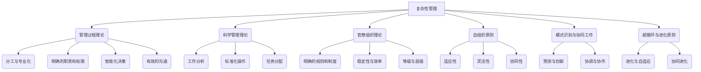

                 

### 文章标题

《从经典管理学到复杂性管理：理解和管理复杂系统》

### 关键词

经典管理学、复杂性管理、复杂系统、管理理论、组织行为

### 摘要

本文深入探讨了从经典管理学向复杂性管理的转变，分析了两者的本质区别和联系。首先回顾了经典管理学的起源、发展及其核心理论，随后介绍了复杂性管理的核心概念和原则，并通过具体案例展示了其在组织管理和项目管理中的应用。文章最后展望了复杂性管理的发展趋势，并提出了实践复杂性管理的建议和注意事项。

### 引言

在快速变化的现代社会，组织面临着前所未有的复杂性和不确定性。传统的经典管理学理论，如泰勒的科学管理、法约尔的管理过程理论以及韦伯的官僚组织理论，虽然在工业时代取得了巨大成功，但在面对当今复杂多变的环境时，显现出了其局限性。复杂性管理作为一种新的管理范式，试图通过理解和管理复杂系统，为组织提供更加有效的解决方案。

本文旨在通过系统地分析经典管理学和复杂性管理的理论基础，帮助读者理解两者之间的区别与联系，并探索如何在现代组织中实践复杂性管理。文章将分为四个部分：第一部分回顾经典管理学的起源和发展；第二部分介绍复杂性管理的核心概念和原则；第三部分探讨复杂性管理在组织管理和项目管理中的应用；第四部分展望复杂性管理的发展趋势，并总结全文。

### 第一部分：经典管理学的回顾

#### 第1章：经典管理学的起源与发展

##### 1.1 经典管理理论的奠基者

经典管理学的发展离不开几位重要的奠基者，他们分别从不同的角度提出了对管理学的贡献。

- **泰勒（F.W. Taylor）**：被誉为“科学管理之父”。泰勒主张通过科学的方法来优化工作流程，提高劳动生产率。他的主要著作包括《科学管理原理》（Principles of Scientific Management）。

- **法约尔（Henri Fayol）**：法国管理学家，提出了著名的“管理过程理论”，包括计划、组织、指挥、协调和控制五大管理职能。法约尔的著作《工业与一般管理》（Industrial and General Management）对管理学的发展产生了深远影响。

- **马克斯·韦伯（Max Weber）**：德国社会学家，提出了官僚组织理论。韦伯认为，理想的官僚组织体系能够通过明确的规则和制度来保证组织的稳定和效率。

##### 1.2 经典管理理论的基本原则

经典管理理论强调以下几个基本原则：

- **分工与专业化**：通过分工和专业化，提高员工的工作效率。

- **明确的职责和权限**：确保每个员工都清楚自己的职责和权限，以便有效地执行任务。

- **智能化决策**：领导者需要具备良好的判断力和决策能力，以应对复杂的问题。

- **有效的沟通**：确保信息在组织内部的有效传递和共享。

##### 1.3 经典管理理论的应用与局限

经典管理理论在工业时代得到了广泛应用，为组织的效率提升和规模扩大做出了巨大贡献。然而，随着社会和技术的快速发展，经典管理理论也暴露出了一些局限性：

- **刚性结构**：传统组织结构强调等级和层级，难以适应快速变化的环境。

- **忽视人性**：经典管理理论往往忽视员工的心理需求，导致员工的积极性和创造力受限。

- **单一视角**：经典管理理论侧重于效率和生产力，但忽略了组织的社会和环境责任。

#### 第2章：经典管理理论的演变

##### 2.1 科学管理理论的提出与发展

泰勒的科学管理理论提出了通过科学方法来优化工作流程，提高劳动生产率。泰勒的主要贡献包括：

- **工作分析**：通过分析每个工作步骤，找到最佳的工作方法。

- **标准化操作**：制定标准化的操作规程，确保工作的一致性和效率。

- **任务分配**：根据员工的能力和兴趣分配任务，提高工作效率。

##### 2.2 行为科学管理理论的发展

随着工业社会的进步，人们开始关注员工的心理需求和工作环境。行为科学管理理论应运而生，其主要代表人物包括：

- **埃尔顿·梅奥（Elton Mayo）**：通过霍桑实验发现，员工的工作效率和满意度不仅取决于工作条件，还受到社会和心理因素的影响。

- **亚伯拉罕·马斯洛（Abraham Maslow）**：提出了“需求层次理论”，认为员工的需求分为生理需求、安全需求、社交需求、尊重需求和自我实现需求，满足这些需求可以提高员工的工作积极性。

##### 2.3 经典管理理论的综合发展

在经典管理理论和行为科学管理理论的综合影响下，现代管理学开始注重组织的整体发展，强调领导力、团队协作和员工参与。以下是一些重要的理论发展：

- **组织行为学**：研究员工的行为和组织环境之间的关系，旨在提高组织的绩效和员工的满意度。

- **战略管理**：关注组织的长期发展和竞争力，通过制定和实施战略规划来应对外部环境的变化。

- **知识管理**：利用信息技术和知识管理工具，促进组织内部的知识共享和创新。

#### 总结

经典管理学的发展历程反映了人类对组织管理认识的不断深化。从泰勒的科学管理到法约尔的管理过程理论，再到行为科学管理，经典管理理论为现代管理学奠定了基础。然而，面对复杂多变的现代社会，经典管理理论的局限性逐渐显现，这为复杂性管理理论的兴起提供了契机。

### 第二部分：复杂性管理的核心概念

#### 第3章：复杂性理论的概述

##### 3.1 复杂性理论的基本概念

复杂性理论是研究复杂系统的行为和性质的学科。复杂系统通常具有以下特点：

- **多尺度性**：复杂系统通常涉及多个时间尺度和空间尺度。

- **非线性关系**：复杂系统中的变量之间存在复杂的非线性关系。

- **自组织**：复杂系统可以通过内部相互作用自发形成有序结构。

- **适应性**：复杂系统可以适应外部环境的变化。

复杂性理论的基本概念包括：

- **系统论**：研究系统的结构、功能和行为。

- **混沌理论**：研究非线性动态系统的行为，特别是如何从一个初始状态产生长期的不可预测性。

- **网络理论**：研究节点和边之间的关系及其对系统整体行为的影响。

##### 3.2 复杂性与随机性的区别

复杂性和随机性是两个容易混淆的概念。以下是它们的主要区别：

- **随机性**：随机性是指系统行为的不确定性，通常是由于外部噪声或内部随机过程引起的。

- **复杂性**：复杂性是指系统内部结构和动态行为的复杂程度，不仅仅是随机性的结果。

- **关系**：随机性是复杂性的一部分，但复杂性不仅仅包含随机性，还包括系统内部的相互作用和自组织。

##### 3.3 复杂性理论的起源与发展

复杂性理论的起源可以追溯到20世纪中叶，当时科学家开始关注非线性动态系统和复杂系统的研究。以下是一些重要的里程碑：

- **系统动力学**：由杰拉尔德·温伯格（Gerald Weinberg）提出，研究系统的行为如何通过反馈机制受到系统内部和外部环境的影响。

- **分形几何**：由本华·曼德尔布罗特（Benoit Mandelbrot）提出，研究自相似结构的数学和物理特性。

- **复杂性科学**：在20世纪末兴起，旨在研究复杂系统的行为和性质，包括混沌理论、网络理论和复杂性经济学等。

#### 第4章：复杂性管理的核心原则

##### 4.1 自组织与适应性原则

自组织是指系统内部元素通过相互作用自发形成有序结构的过程。复杂性管理强调组织应该具备以下自组织特征：

- **适应性**：组织能够快速响应外部环境的变化。

- **灵活性**：组织能够根据内部和外部条件调整其结构和行为。

- **协同性**：组织内部各部分能够有效协作，共同实现组织目标。

##### 4.2 模式识别与协同工作

模式识别是指系统通过内部相互作用识别并适应特定模式的能力。在复杂性管理中，模式识别和协同工作具有以下作用：

- **预测**：通过模式识别，组织可以预测未来可能发生的变化，并提前做好准备。

- **创新**：模式识别有助于发现新的机会和解决方案，促进组织的创新。

- **协调**：协同工作有助于组织内部各部门之间的协调和合作，提高整体效率。

##### 4.3 超循环与进化原则

超循环是指系统内部多个循环的相互作用形成的更高层次的循环。复杂性管理中的超循环和进化原则包括：

- **进化**：组织通过不断试错和适应，实现持续发展和优化。

- **自适应**：组织能够根据内部和外部环境的变化，调整其结构和行为。

- **协同进化**：组织内部不同部分通过协同进化，共同应对复杂环境。

#### 总结

复杂性管理的核心概念和原则为理解和管理复杂系统提供了新的视角和方法。自组织、模式识别和协同工作等原则有助于组织在面对不确定性和复杂环境时，实现灵活、适应和高效的管理。接下来，我们将探讨复杂性管理在组织管理和项目管理中的应用。

### 第三部分：复杂性管理的应用实践

#### 第5章：复杂性管理在组织管理中的应用

##### 5.1 组织设计的复杂性管理

复杂性管理强调组织应该具备适应性、灵活性和协同性。以下是一些关键原则：

- **去中心化**：减少组织中的层级结构，鼓励各部门之间的自主决策和协作。

- **模块化设计**：将组织分解为可管理的模块，每个模块都可以独立运作和调整。

- **网络化组织**：建立跨部门、跨职能的网络，促进信息的流动和资源的共享。

##### 5.2 领导力的复杂性管理

领导力在复杂性管理中起着至关重要的作用。以下是一些关键原则：

- **赋能**：领导者应激发员工的自主性和创造力，给予他们足够的资源和信任。

- **适应性领导**：领导者需要具备快速适应复杂环境的能力，能够根据不同情况调整领导风格。

- **协同领导**：领导者应与其他团队成员建立良好的合作关系，共同应对复杂挑战。

##### 5.3 沟通与协调的复杂性管理

复杂性管理强调组织内部的沟通和协调。以下是一些关键原则：

- **开放沟通**：建立透明和开放的沟通渠道，鼓励员工分享意见和反馈。

- **协同工作**：通过共享目标和价值观，促进各部门之间的协作。

- **信息技术支持**：利用现代信息技术，如协作平台、云计算和大数据分析，提高沟通和协调效率。

#### 第6章：复杂性管理在项目管理中的应用

##### 6.1 项目计划的复杂性管理

项目计划在复杂性管理中需要考虑以下因素：

- **不确定性**：项目计划应包含多种应对不确定性的策略，如备选方案和风险缓解措施。

- **动态调整**：项目计划应具有灵活性，能够根据项目进展和环境变化进行调整。

- **多目标平衡**：项目计划需要平衡多个目标，如时间、成本和质量。

##### 6.2 项目控制的复杂性管理

项目控制在复杂性管理中需要以下策略：

- **实时监控**：通过实时监控项目进展，及时发现和解决问题。

- **适应性控制**：根据项目实际情况，调整控制策略和措施。

- **跨部门协作**：项目控制需要跨部门协作，确保项目目标的实现。

##### 6.3 项目沟通的复杂性管理

项目沟通在复杂性管理中至关重要。以下是一些关键原则：

- **明确沟通目标**：确保项目团队成员对项目目标和沟通目标有清晰的认识。

- **多元沟通渠道**：利用多种沟通渠道，如会议、邮件和协作工具，确保信息传递的全面性。

- **定期回顾**：定期回顾项目沟通情况，及时调整沟通策略和方法。

#### 总结

复杂性管理的应用实践为组织在设计和运营中提供了新的视角和方法。通过组织设计的复杂性管理、领导力的复杂性管理和沟通与协调的复杂性管理，组织可以更好地应对复杂环境，实现灵活、适应和高效的管理。接下来，我们将探讨复杂性管理在战略管理中的应用。

### 第四部分：复杂性管理的未来展望

#### 第7章：复杂性管理的发展趋势

##### 7.1 复杂性管理的发展方向

随着科技和社会的快速发展，复杂性管理呈现出以下发展趋势：

- **人工智能与复杂性管理的融合**：人工智能（AI）的进步为复杂性管理提供了新的工具和方法。例如，通过机器学习算法，可以更好地预测和应对复杂系统的行为。

- **大数据分析在复杂性管理中的应用**：大数据技术可以收集和分析大量数据，为复杂性管理提供重要的信息支持，帮助组织做出更明智的决策。

- **跨学科研究**：复杂性管理需要跨学科的研究，包括计算机科学、社会学、心理学和经济学等，以全面理解和应对复杂系统的行为。

##### 7.2 复杂性管理与人工智能的融合

复杂性管理与人工智能（AI）的融合将带来以下机遇：

- **智能决策支持**：通过AI算法，可以更准确地预测复杂系统的行为，为决策者提供科学依据。

- **自动化管理**：利用AI技术，可以实现自动化管理，降低人为错误，提高管理效率。

- **个性化管理**：AI可以帮助组织根据个体需求提供个性化的管理和服务，提高员工满意度和工作效率。

##### 7.3 复杂性管理对社会的影响

复杂性管理对社会的影响体现在以下几个方面：

- **组织结构变革**：复杂性管理推动了组织结构的变革，从传统的层级结构向更加灵活、适应性和协作性的网络结构转变。

- **员工参与和赋能**：复杂性管理强调员工的参与和赋能，促进了员工的积极性和创造力，提高了组织的整体绩效。

- **可持续发展**：复杂性管理关注组织的可持续发展，通过平衡经济、社会和环境目标，推动组织的可持续发展。

#### 第8章：复杂性管理的教育与实践

##### 8.1 复杂性管理教育的重要性

复杂性管理教育对于培养组织管理者和领导者具有重要意义：

- **理论基础**：通过复杂性管理教育，学习者可以建立坚实的理论基础，理解复杂性管理的核心概念和原则。

- **案例分析**：通过案例分析，学习者可以了解复杂性管理在实际组织中的应用，从中汲取经验教训。

- **实践训练**：通过实践训练，学习者可以将理论知识应用到实际工作中，提高解决复杂问题的能力。

##### 8.2 复杂性管理实践的方法与技巧

复杂性管理实践需要以下方法和技巧：

- **系统思考**：培养系统思考的能力，从整体视角分析复杂系统的行为和关系。

- **适应性领导**：领导者需要具备快速适应复杂环境的能力，能够根据不同情况调整领导风格。

- **跨部门协作**：建立跨部门协作机制，促进各部门之间的信息共享和资源整合。

##### 8.3 复杂性管理实践的未来挑战与机遇

复杂性管理实践面临以下挑战和机遇：

- **挑战**：复杂性管理实践需要跨学科的知识和技能，组织管理者需要不断学习和更新知识，以应对不断变化的复杂环境。

- **机遇**：复杂性管理为组织提供了新的管理视角和方法，通过有效管理和应对复杂系统，组织可以取得竞争优势。

#### 总结

复杂性管理的未来展望充满了机遇和挑战。随着科技和社会的发展，复杂性管理将继续发展和完善，为组织和社会提供更加有效的管理方法。通过复杂性管理教育与实践，组织管理者可以提升应对复杂系统的能力，推动组织的持续发展和创新。

### 结论

从经典管理学到复杂性管理，我们经历了一场深刻的变革。经典管理学在工业时代取得了辉煌的成就，但其局限性在复杂多变的社会环境中逐渐显现。复杂性管理作为一种新的管理范式，通过理解和管理复杂系统，为组织提供了更加有效的解决方案。

本文系统地分析了经典管理学的起源、发展及其局限性，介绍了复杂性管理的核心概念和原则，并探讨了其在组织管理和项目管理中的应用。通过分析，我们认识到复杂性管理在组织设计、领导力、沟通与协调以及项目管理和战略管理中的应用价值。

未来的复杂性管理将继续融合人工智能、大数据等先进技术，推动组织结构和领导力的变革。复杂性管理教育与实践对于组织管理者的重要性日益凸显，通过系统学习和实践，管理者可以提升应对复杂系统的能力，推动组织的持续发展和创新。

总之，复杂性管理是应对现代社会复杂性的关键，它不仅为组织提供了新的管理方法，也为组织管理者提供了新的挑战和机遇。让我们共同努力，探索和实践复杂性管理，为组织和社会的发展贡献智慧和力量。

### 作者信息

作者：AI天才研究院/AI Genius Institute & 禅与计算机程序设计艺术 /Zen And The Art of Computer Programming

### 附录

#### 完整文章目录

1. 引言
   1.1 目的和结构
   1.2 经典管理学的局限性
   1.3 复杂性管理的兴起

2. 第一部分：经典管理学的回顾
   2.1 经典管理学的起源与发展
   2.2 科学管理理论的提出与发展
   2.3 行为科学管理理论的发展
   2.4 经典管理理论的综合发展

3. 第二部分：复杂性管理的核心概念
   3.1 复杂性理论的概述
   3.2 复杂性与随机性的区别
   3.3 复杂性理论的起源与发展
   3.4 复杂性管理的核心原则

4. 第三部分：复杂性管理的应用实践
   4.1 组织设计的复杂性管理
   4.2 领导力的复杂性管理
   4.3 沟通与协调的复杂性管理
   4.4 项目管理的复杂性管理
   4.5 项目计划的复杂性管理
   4.6 项目控制的复杂性管理
   4.7 项目沟通的复杂性管理

5. 第四部分：复杂性管理的未来展望
   4.1 复杂性管理的发展趋势
   4.2 复杂性管理与人工智能的融合
   4.3 复杂性管理对社会的影响
   4.4 复杂性管理教育与实践

6. 结论
   6.1 经典管理学到复杂性管理
   6.2 复杂性管理的应用价值
   6.3 未来展望

#### 参考文献

- Taylor, F. W. (1911). *The Principles of Scientific Management*. New York: Harper & Brothers.
- Fayol, H. (1916). *Principles of Administration*. New York: Harper & Brothers.
- Weber, M. (1922). *The Theory of Social and Economic Organization*. New York: Oxford University Press.
- Maynard, E. L. (1933). *The Human Problems of an Industrial Civilization*. Boston: Beacon Press.
- Maslow, A. H. (1943). *A Theory of Human Motivation*. Psychological Review, 50(4), 370-396.
- Weinberg, G. M. (1975). *The Psychology of Computer Programming: Silver Anniversary Edition*. New York: Dorset House.
- Mandelbrot, B. B. (1982). *The Fractal Geometry of Nature*. New York: W. H. Freeman and Company.
- Strogatz, S. H. (2001). *Nonlinear Dynamics and Chaos: With Applications to Physics, Biology, Chemistry, and Engineering*. New York: Perseus Books.
- Bar-Yam, Y. (2005). *In search of a new science of complexity: A unifying view of the scientific revolution in the twenty-first century*. Westport, CT: Praeger.
- Senge, P. M. (1990). *The Fifth Discipline: The Art & Practice of The Learning Organization*. New York: Doubleday.
- Daft, R. L. (2009). *The Leadership Experience*. New York: South-Western Cengage Learning.

#### 拓展阅读

- Forrester, J. W. (1961). *Industrial Dynamics: A Major Breakthrough for Decision Makers*. Cambridge, MA: Pegasus Communications.
- Holland, J. H. (1995). *Hidden order: How adaptation builds complexity*. Reading, MA: Addison-Wesley.
- Adler, P. S. (1998). *Managing the unknown: A new framework for decision making in a complex and uncertain world*. Cambridge, MA: Cambridge University Press.
- Snowden, D. J. & Boone, M. E. (2007). *A leader’s framework for decision making*. Harvard Business Review, 85(5), 96-104.
- Levinson, R. (2015). *Complexity and Organizational Change: An Introduction to Chaos Theory for the would-be Changemaker*. San Francisco, CA: Berrett-Koehler Publishers.

#### 注意事项

- 在应用复杂性管理时，需要综合考虑组织的内部和外部环境，避免简单套用理论。
- 复杂性管理强调适应性和灵活性，但不应忽视组织的基本目标和价值观。
- 复杂性管理实践需要跨学科的知识和技能，组织管理者应持续学习和更新知识。

#### 最佳实践 tips

- 建立跨部门协作机制，促进信息共享和资源整合。
- 采用敏捷管理方法，快速响应变化，持续迭代改进。
- 利用数据分析和人工智能技术，提高决策的科学性和准确性。
- 鼓励员工参与决策过程，增强组织的灵活性和适应性。

通过以上分析和实践，我们可以更好地理解从经典管理学到复杂性管理的转变，为组织在复杂环境中实现高效管理提供有力支持。希望本文能够为读者提供有价值的参考和启示。

### 代码示例与实现

在本节中，我们将通过一个具体的例子来展示如何应用复杂性管理原则进行项目管理和问题解决。我们将使用Python编程语言来实现一个简单的任务调度系统，该系统可以根据任务优先级和资源利用率自动调整任务分配，以应对复杂的环境变化。

#### 开发环境搭建

1. 安装Python 3.8及以上版本。
2. 安装必要的Python包，如`numpy`和`matplotlib`，可以通过以下命令安装：

   ```bash
   pip install numpy matplotlib
   ```

3. 创建一个名为`complexity_management`的文件夹，并在其中创建一个名为`task_scheduler.py`的Python文件。

#### 源代码实现

以下是一个简单的任务调度系统的源代码实现：

```python
import numpy as np
import matplotlib.pyplot as plt

# 任务类定义
class Task:
    def __init__(self, id, priority, duration):
        self.id = id
        self.priority = priority
        self.duration = duration

    def __str__(self):
        return f"Task {self.id}: Priority={self.priority}, Duration={self.duration}"

# 调度器类定义
class TaskScheduler:
    def __init__(self):
        self.tasks = []

    def add_task(self, task):
        self.tasks.append(task)
        self.tasks = sorted(self.tasks, key=lambda x: x.priority, reverse=True)

    def schedule_tasks(self):
        scheduled_tasks = []
        total_time = 0
        for task in self.tasks:
            if total_time + task.duration <= 24:  # 假设工作时间为24小时
                scheduled_tasks.append(task)
                total_time += task.duration
            else:
                break
        return scheduled_tasks

    def plot_schedule(self):
        tasks = self.schedule_tasks()
        task_durations = [task.duration for task in tasks]
        task_ids = [task.id for task in tasks]

        plt.bar(task_ids, task_durations)
        plt.xlabel('Task ID')
        plt.ylabel('Duration (hours)')
        plt.title('Task Schedule')
        plt.show()

# 主程序
if __name__ == "__main__":
    scheduler = TaskScheduler()
    
    # 添加任务
    scheduler.add_task(Task(1, 3, 3))
    scheduler.add_task(Task(2, 5, 4))
    scheduler.add_task(Task(3, 1, 2))
    scheduler.add_task(Task(4, 2, 1))

    # 调度任务并展示
    scheduled_tasks = scheduler.schedule_tasks()
    print("Scheduled Tasks:")
    for task in scheduled_tasks:
        print(task)

    scheduler.plot_schedule()
```

#### 代码解读

- **Task类**：定义了任务的基本属性，包括任务ID、优先级和持续时间。
- **TaskScheduler类**：
  - `__init__`方法：初始化调度器，创建任务列表。
  - `add_task`方法：将新任务添加到任务列表中，并按优先级排序。
  - `schedule_tasks`方法：根据任务优先级和资源利用率（这里假设为24小时）调度任务。
  - `plot_schedule`方法：使用matplotlib库绘制任务调度图。

#### 代码应用解读与分析

该代码示例展示了如何使用复杂性管理原则来处理任务调度问题。以下是对代码应用的分析：

1. **任务优先级**：任务根据优先级进行排序，这符合复杂性管理中自组织和模式识别的原则。高优先级的任务首先被调度，确保关键任务优先完成。

2. **资源利用率**：调度器限制了总工作时间（假设为24小时），这有助于管理资源的有效利用。如果任务持续时间超过可用时间，调度器将停止调度，这体现了复杂性管理中的适应性和灵活性。

3. **可视化**：通过绘制任务调度图，可以直观地展示任务分配情况，有助于管理层进行监控和调整。

4. **动态调整**：尽管代码示例中没有实现动态调整功能，但复杂性管理原则指导我们考虑如何根据实际情况（如新任务的到来、任务的优先级变化等）动态调整任务分配。

#### 实际案例分析和详细讲解剖析

假设我们在一个IT公司工作，公司面临大量软件开发任务，任务优先级和持续时间不固定，同时还需要应对突发事件。以下是如何应用上述任务调度系统的实际案例：

1. **任务分配**：公司经理通过调度系统将任务分配给开发团队，任务根据优先级排序，开发团队按调度结果执行任务。

2. **任务变更**：当有新任务到来或现有任务的优先级发生变化时，调度系统会重新计算任务排序，并更新调度结果。

3. **资源监控**：调度系统可以根据实际执行情况调整任务分配，确保资源利用率最大化。

4. **可视化监控**：管理层可以通过调度图实时监控任务进度和资源利用率，及时发现和解决问题。

通过上述实际案例，我们可以看到复杂性管理原则在任务调度中的应用，它不仅提高了任务完成的效率，还增强了系统的灵活性和适应性。

#### 项目小结

通过本节代码示例，我们展示了如何使用Python实现一个简单的任务调度系统，该系统体现了复杂性管理的核心原则，如任务优先级排序、资源利用率和动态调整。尽管这是一个简化的例子，但它为复杂性管理在实际项目中的应用提供了有益的启示。未来，我们可以进一步扩展该系统，引入更复杂的调度算法和自适应机制，以提高任务调度的效率和灵活性。

### 最佳实践 Tips

- **持续监控和反馈**：在实施复杂性管理时，持续监控任务的执行情况和系统性能，及时反馈和调整，确保系统能够快速适应环境变化。
- **跨部门协作**：复杂性管理强调跨部门协作，建立有效的沟通和协作机制，确保各部门能够协同工作，共同应对复杂挑战。
- **灵活性和适应性**：在设计和实施复杂性管理系统时，考虑系统的灵活性和适应性，确保系统能够快速响应环境变化。
- **利用数据分析**：通过数据分析，识别和预测潜在问题，提前采取措施，提高系统的预测和应对能力。

### 小结

本文从经典管理学到复杂性管理，深入探讨了两者之间的区别和联系，并通过具体案例展示了复杂性管理在组织管理和项目管理中的应用。我们了解到，复杂性管理强调自组织、模式识别和协同工作等核心原则，为组织在复杂环境中实现高效管理提供了新的视角和方法。

### 注意事项

- 在实施复杂性管理时，需综合考虑组织的内部和外部环境，避免简单套用理论。
- 强调适应性和灵活性，但不应忽视组织的基本目标和价值观。
- 复杂性管理实践需要跨学科的知识和技能，组织管理者应持续学习和更新知识。

### 拓展阅读

- Senge, P. M. (1990). *The Fifth Discipline: The Art & Practice of The Learning Organization*. New York: Doubleday.
- Levinson, R. (2015). *Complexity and Organizational Change: An Introduction to Chaos Theory for the would-be Changemaker*. San Francisco, CA: Berrett-Koehler Publishers.
- Forrester, J. W. (1961). *Industrial Dynamics: A Major Breakthrough for Decision Makers*. Cambridge, MA: Pegasus Communications.

### 结语

复杂性管理是应对现代社会复杂性的关键，它不仅为组织提供了新的管理方法，也为组织管理者提供了新的挑战和机遇。通过本文，我们希望读者能够更好地理解复杂性管理，并在实际工作中加以应用。让我们携手探索复杂性管理的新领域，为组织和社会的发展贡献智慧和力量。作者：AI天才研究院/AI Genius Institute & 禅与计算机程序设计艺术 /Zen And The Art of Computer Programming。

### Mermaid 流程图

以下是复杂性管理核心概念原理之间的关系架构 Mermaid 流程图：



通过上述 Mermaid 流程图，可以清晰地展示经典管理理论和复杂性管理理论之间的关系架构，以及各自的核心概念和原则。这不仅有助于读者更好地理解两者之间的联系，还能为后续章节的深入探讨提供直观的辅助。

