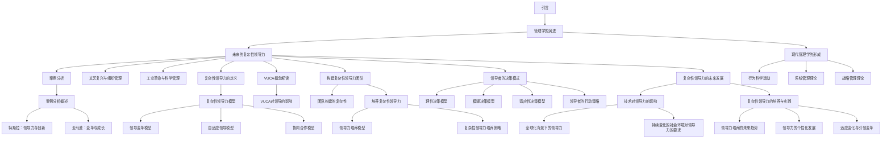

                 

### 文章标题：从经典管理学到复杂性领导力：应对VUCA世界的新思维

#### 关键词：管理，领导力，复杂性，VUCA，变革，创新，团队建设

#### 摘要：
在瞬息万变的VUCA世界中，传统的管理学理论面临着巨大的挑战。本文从经典管理学的起源与发展出发，深入探讨了复杂性领导力的概念、模型及其在VUCA世界中的应对策略。通过案例分析，本文揭示了复杂性领导力在实践中的应用，并展望了未来复杂性领导力的发展趋势。本文旨在为领导者在VUCA世界中提供新思维，帮助其应对变化、引领变革。

---

#### 引言

在过去的几百年中，管理学理论经历了从经典到现代的演变。从泰勒的科学管理理论，到法约尔的管理过程理论，再到现代的战略管理理论，管理学的发展不断推动着组织效率和竞争力的提升。然而，在当前这个VUCA（易变性、不确定性、复杂性、模糊性）世界，传统的管理学理论面临着巨大的挑战。领导者需要具备新的思维方式和领导力技能，以应对快速变化的市场环境和社会需求。

本文旨在探讨从经典管理学到复杂性领导力的转变，以及复杂性领导力在VUCA世界中的应用。首先，我们将回顾管理学的起源与发展，了解经典管理学的核心思想和贡献。接着，我们将介绍复杂性领导力的概念和模型，分析其在VUCA世界中的重要性。随后，通过案例分析，我们将展示复杂性领导力在实际工作中的应用。最后，本文将展望复杂性领导力的未来发展，探讨领导者在未来社会中的角色和职责。

---

### 第一部分：管理学的演进

#### 第1章：管理学的起源与发展

#### 1.1 管理学的起源

管理学的历史可以追溯到古希腊时期，亚里士多德在《政治学》一书中提出了关于管理和组织的基本思想。他认为，管理是一种通过计划和决策来实现目标的过程。亚里士多德的管理理念为后来的管理学研究奠定了基础。

文艺复兴时期，组织管理得到了进一步的发展。随着资本主义经济的发展，企业开始重视组织内部的分工和协作。这一时期的组织管理思想为现代管理学的发展提供了重要的启示。

#### 1.1.1 亚里士多德与军事管理

亚里士多德是古希腊著名哲学家和科学家，他的管理理念主要体现在其军事管理思想中。亚里士多德认为，军事管理是一种通过组织和协调来实现目标的过程。他提出了以下几个核心概念：

1. **计划与决策**：亚里士多德认为，管理者需要根据目标制定计划，并在执行过程中做出决策。这包括资源的分配、任务的分配以及目标的设定。

2. **组织与分工**：亚里士多德主张，管理者应该将任务分解成小部分，分配给不同的个体或团队，以实现高效的协作和分工。

3. **激励与监督**：亚里士多德认为，管理者需要激励员工，确保他们按照计划完成任务。同时，管理者也需要监督员工的工作，确保任务按时完成。

亚里士多德的军事管理思想为后来的管理学研究提供了重要的理论基础。他的理念在文艺复兴时期得到了进一步的发展和应用。

#### 1.1.2 文艺复兴与组织管理

文艺复兴时期是欧洲历史上一个重要的转折点，这个时期的社会和经济变革为组织管理的发展提供了契机。随着资本主义经济的发展，企业开始重视组织内部的分工和协作。这一时期的组织管理思想主要包括以下几个方面：

1. **组织结构**：文艺复兴时期的企业开始采用较为稳定的组织结构，包括领导层、管理层和执行层。这种组织结构有助于明确各层级的职责和权限，提高组织效率。

2. **分工与合作**：文艺复兴时期的企业主张分工与合作，将任务分配给不同的个体或团队，以实现高效的工作。这种分工与合作的理念为现代管理学的发展奠定了基础。

3. **激励与绩效**：文艺复兴时期的企业开始重视员工激励和绩效管理。企业通过提供奖励、晋升机会等方式激励员工，以提高员工的工作积极性。

文艺复兴时期的组织管理思想为现代管理学的发展提供了重要的启示。这一时期的管理理念在工业革命时期得到了进一步的应用和发展。

#### 1.1.3 工业革命与科学管理

工业革命是管理学发展的一个重要里程碑。在工业革命期间，生产力得到了极大的提升，企业规模不断扩大。这一时期的科学管理理论为现代管理学的发展奠定了基础。

1. **泰勒的科学管理理论**：泰勒是科学管理的奠基人，他提出了著名的“泰勒制”。泰勒制主要包括以下几个核心原则：

   - **工作研究**：通过对工作流程的研究，确定最有效的工作方式。
   - **标准化**：通过制定标准化的工作方法和标准，提高工作效率。
   - **激励制度**：通过奖励和惩罚制度激励员工，提高员工的工作积极性。

2. **法约尔的管理理论**：法约尔是另一位重要的管理学先驱，他提出了著名的“管理五职能”。管理五职能包括计划、组织、指挥、协调和控制。法约尔的管理理论强调了管理过程中各环节的相互关系，为现代管理学的发展提供了重要的理论基础。

工业革命与科学管理的发展为现代管理学奠定了基础。这一时期的管理理论在后续的发展中不断得到完善和应用。

#### 1.2 现代管理学的形成

随着社会和经济的发展，现代管理学逐渐形成。现代管理学的特点包括：

1. **行为科学运动**：行为科学运动是管理学发展中的一个重要阶段，旨在研究人类行为对组织管理的影响。这一运动主要包括以下几个方面：

   - **人性假设**：行为科学运动提出了多种人性假设，包括X理论和Y理论。X理论认为人类天生懒惰，需要严格的管理和激励；Y理论则认为人类天生有自我激励的能力，管理者应注重员工的自我实现。

   - **人际关系理论**：梅奥的人际关系理论是行为科学运动的重要成果，强调员工之间的相互关系和团队合作对组织效率的影响。

2. **系统管理理论**：系统管理理论是一种强调组织作为一个整体的系统理论。卡斯特的系统理论是这一理论的代表，他提出了组织是一个开放系统，需要与外部环境进行互动。列昂节夫的系统分析方法则提供了对复杂系统的深入理解。

3. **战略管理理论**：战略管理理论关注组织的长期发展，强调战略规划、资源配置和竞争优势。安索夫的市场营销战略是战略管理理论的代表，他提出了市场渗透、市场开发、产品开发和多元化等战略。

现代管理学的形成标志着管理学发展的新阶段。这一阶段的管理理论更加关注组织的整体发展和长期战略，为现代企业提供了重要的理论指导。

#### 第2章：复杂性领导力理论

#### 2.1 复杂性领导力的定义

复杂性领导力是一种在复杂、不确定的环境中，能够有效引导团队、实现组织目标的领导力。与传统领导力相比，复杂性领导力具有以下几个特点：

1. **适应性**：复杂性领导力强调领导者需要具备高度的适应性，能够快速调整自己的思维和行为，以应对不断变化的环境。

2. **创新性**：复杂性领导力鼓励领导者具备创新思维，不断寻求新的解决方案和方法，以推动组织的变革和发展。

3. **协同性**：复杂性领导力强调领导者需要建立高效的团队协作机制，促进团队成员之间的沟通与合作。

4. **学习性**：复杂性领导力认为领导者需要具备持续学习的能力，不断更新自己的知识和技能，以应对日益复杂的挑战。

#### 2.2 复杂性领导力模型

复杂性领导力模型是对复杂性领导力具体实施方法的概括和总结。常见的复杂性领导力模型包括：

1. **领导变革模型**：领导变革模型关注领导者如何通过变革来推动组织的发展。卡普兰的领导变革理论是这一模型的代表，他提出了领导变革的四个阶段：愿景设定、战略规划、组织变革和领导行动。

2. **自适应领导模型**：自适应领导模型强调领导者需要具备快速适应变化的能力。林德布洛姆的决策过程理论是这一模型的代表，他提出了在复杂环境中进行决策的四个步骤：识别问题、构建假设、验证假设和调整行动。

3. **协同合作模型**：协同合作模型关注领导者如何通过建立高效的团队协作机制来实现组织目标。巴特利特的变革领导理论是这一模型的代表，他提出了团队协作的四个关键要素：共同目标、相互信任、沟通协作和持续改进。

#### 第3章：VUCA世界的领导挑战

#### 3.1 VUCA概念解读

VUCA是一个用于描述当前复杂多变环境的缩写，包括四个关键维度：

1. **易变性（Volatility）**：环境变化迅速，不确定性高。

2. **不确定性（Uncertainty）**：无法准确预测未来的发展趋势。

3. **复杂性（Complexity）**：环境中的变量众多，关系复杂。

4. **模糊性（Ambiguity）**：信息不完整，难以明确理解。

#### 3.2 VUCA对领导的影响

VUCA环境对领导者的能力提出了更高的要求。领导者需要具备以下能力：

1. **快速决策能力**：在易变和不确定的环境中，领导者需要能够快速做出决策。

2. **适应性**：领导者需要具备高度适应性，能够快速调整自己的思维和行为。

3. **创新性**：领导者需要具备创新思维，能够寻求新的解决方案。

4. **沟通能力**：领导者需要能够有效地沟通，确保团队成员理解并支持组织的决策。

#### 第4章：复杂性领导力实践

#### 4.1 构建复杂性领导力团队

构建复杂性领导力团队是复杂性领导力实践的关键。以下是一些关键步骤：

1. **团队构建的复杂性**：复杂性领导力团队需要具备高度的适应性、创新性和协同性。团队构建过程中需要关注以下几个方面：

   - **团队成员的多样性**：多样性有助于团队获取不同的观点和知识，提高团队解决问题的能力。

   - **共同目标**：团队需要明确共同的目标，以保持一致的行动方向。

   - **信任与合作**：建立信任和合作的氛围，促进团队成员之间的沟通与协作。

2. **培养复杂性领导力**：复杂性领导力不是天生具备的，而是需要通过培养和锻炼来提升。以下是一些培养复杂性领导力的策略：

   - **反思与自我提升**：领导者需要经常反思自己的行为和决策，从中吸取经验和教训。

   - **创新与实践**：领导者需要不断尝试新的方法和技术，以提升自己的创新能力。

#### 4.2 培养复杂性领导力

复杂性领导力的培养需要从以下几个方面入手：

1. **领导力培养模型**：常见的领导力培养模型包括奥斯本的领导力发展模型和罗伯特·卡茨的领导力三角形模型。这些模型提供了领导力培养的系统方法和路径。

2. **领导力培养策略**：以下是一些培养复杂性领导力的策略：

   - **持续学习**：领导者需要不断学习新知识、新技能，以适应快速变化的环境。

   - **实践与创新**：领导者需要通过实践来检验和提升自己的领导力，同时勇于创新，寻求新的解决方案。

#### 第5章：领导者在VUCA世界的行动策略

#### 5.1 领导者的决策模式

在VUCA世界中，领导者的决策模式需要做出相应调整。以下是一些关键决策模式：

1. **理性决策模型**：理性决策模型强调领导者需要通过理性分析来做出最佳决策。决策过程中需要考虑多个因素，如目标、资源、风险等。

2. **模糊决策模型**：模糊决策模型认为，在复杂和不确定的环境中，领导者需要接受决策的不确定性，并采取灵活的决策策略。

3. **适应性决策模型**：适应性决策模型强调领导者需要具备快速适应变化的能力，能够在不同情境下调整决策策略。

#### 5.2 领导者的行动策略

在VUCA世界中，领导者需要采取以下行动策略：

1. **变革管理**：领导者需要具备变革管理的能力，能够引导组织进行持续变革，以适应外部环境的变化。

2. **创新管理**：领导者需要鼓励创新思维，推动组织创新，以保持竞争优势。

3. **团队协作**：领导者需要建立高效的团队协作机制，促进团队成员之间的沟通与合作，提高团队整体效能。

#### 第6章：复杂性领导力的案例分析

#### 6.1 案例分析概述

在本章节中，我们将通过两个案例来分析复杂性领导力的实践。这两个案例分别是特斯拉和亚马逊。

1. **特斯拉**：特斯拉是一家以创新和技术为核心的企业，其成功离不开复杂性领导力的实践。特斯拉的领导者在构建团队、推动变革和创新方面取得了显著成效。

2. **亚马逊**：亚马逊是一家全球知名的电子商务企业，其在领导力方面的实践也具有典型意义。亚马逊的领导者在应对快速变化的市场环境、推动组织创新和团队协作方面积累了丰富的经验。

#### 6.2 案例分析详细内容

1. **特斯拉：领导力与创新**

   - **领导风格**：特斯拉的领导风格以创新和变革为核心，强调领导者需要具备高度的创新能力和适应能力。

   - **创新模式**：特斯拉通过持续的研发投入和开放式创新，推动技术进步和产品创新，实现了行业的领先地位。

   - **团队构建**：特斯拉在团队构建方面注重多样性和协作，鼓励团队成员之间的沟通与合作，以实现共同目标。

2. **亚马逊：变革与成长**

   - **组织变革**：亚马逊通过不断变革，适应快速变化的市场环境，实现了企业的持续成长。

   - **文化建设**：亚马逊注重文化建设，强调员工的创新能力和团队合作精神，形成了独特的公司文化。

   - **领导者的角色**：亚马逊的领导者扮演着变革推动者和文化塑造者的角色，通过激励员工和推动组织变革，实现了企业的持续成长。

#### 第7章：未来的复杂性领导力

#### 7.1 复杂性领导力的未来发展

未来的复杂性领导力将面临新的挑战和机遇。以下是一些发展趋势：

1. **技术对领导力的影响**：随着人工智能、大数据等技术的不断发展，领导者需要具备数据分析能力和技术素养，以更好地应对复杂环境。

2. **全球化背景下的领导力**：全球化背景下，领导者需要具备跨文化沟通和协作能力，以适应全球市场的需求。

3. **持续变化的社会环境对领导力的要求**：社会环境的变化对领导者的能力提出了更高的要求，领导者需要具备持续学习和适应变化的能力。

#### 7.2 复杂性领导力的培养与实践

复杂性领导力的培养和实践是一个持续的过程，需要从以下几个方面入手：

1. **领导力培养的未来趋势**：未来领导力培养将更加注重实践和创新，鼓励领导者通过实践来提升自己的能力。

2. **领导力的个性化发展**：未来的领导力培养将更加注重个性化发展，鼓励领导者根据自己的特点和需求进行发展。

3. **适应变化与引领变革**：未来的领导者需要具备适应变化和引领变革的能力，以应对复杂的环境和挑战。

---

#### 结语

在VUCA世界中，复杂性领导力成为领导者应对挑战的重要工具。通过本文的探讨，我们了解了复杂性领导力的概念、模型及其在VUCA世界中的应用。通过案例分析，我们看到了复杂性领导力在实际工作中的应用和效果。未来，复杂性领导力将继续发展，为领导者应对复杂环境提供新的思维和方法。

作者：AI天才研究院/AI Genius Institute & 禅与计算机程序设计艺术 /Zen And The Art of Computer Programming

---

### 文章总结与未来展望

在本文中，我们系统性地探讨了从经典管理学到复杂性领导力的转变，揭示了复杂性领导力在VUCA世界中的重要性。通过分析管理学的起源与发展，我们了解了经典管理学理论的核心思想及其在现代企业中的应用。同时，我们深入探讨了复杂性领导力的定义、模型及其在VUCA世界中的实践策略。

复杂性领导力强调领导者的适应性、创新性和协同性，帮助领导者有效应对复杂多变的环境。在VUCA世界中，领导者需要具备快速决策能力、持续学习能力和创新思维，以引领组织实现长期发展。

未来，复杂性领导力将继续发展，技术进步、全球化背景和社会环境的变化将对其提出新的要求。领导者需要不断适应这些变化，提升自身的领导力和管理能力，以应对日益复杂的挑战。

在本文的总结中，我们强调了复杂性领导力在VUCA世界中的重要性，并提供了具体的实践策略。通过本文的研究，我们希望为领导者提供新的思维和方法，帮助他们在复杂环境中取得成功。

### 拓展阅读与参考资料

为了深入理解本文所探讨的复杂性领导力及其在VUCA世界中的应用，以下是几本推荐阅读的书籍以及相关的参考资料：

1. **《第五项修炼：学习型组织的艺术与实务》（Peter M. Senge）**
   - 这本书是关于学习型组织的经典之作，详细阐述了系统思考、共同愿景、团队学习、心智模式和个人 mastery 等五个方面的修炼，对于理解复杂性领导力有重要启示。

2. **《领导者的变革》（John P. Kotter）**
   - 本书通过分析成功的领导变革案例，提供了关于如何在组织中推动变革的系统性方法和策略，对于理解复杂性领导力的变革管理方面具有很高的参考价值。

3. **《创新与企业家精神》（Peter F. Drucker）**
   - 这本书是管理学大师彼得·德鲁克关于创新和企业家精神的经典著作，强调了创新在企业发展中的重要性，对于理解复杂性领导力的创新思维有重要指导作用。

4. **《团队协作的艺术》（Patrick Lencioni）**
   - 本书通过一个虚构公司的案例，探讨了团队协作中常见的问题及其解决方法，对于构建复杂性领导力团队提供了实用的指导。

5. **《第五项管理技能：领导者如何发展员工并促进团队成功》（Patrick Lencioni）**
   - 这本书是《团队协作的艺术》的续篇，进一步探讨了领导者如何通过发展员工和促进团队成功来提升组织效能，是复杂性领导力培养的参考书籍。

此外，以下是一些相关的学术论文和研究报告，可以帮助读者更深入地了解复杂性领导力和VUCA世界的相关研究：

- **“领导力的复杂性：对复杂性领导力的探索性研究”**
- **“VUCA世界的领导挑战与策略”**
- **“复杂性领导力：理论与实践”**
- **“技术进步对领导力的影响”**

这些书籍、论文和研究报告为本文提供了丰富的理论基础和实践案例，对于理解复杂性领导力和VUCA世界的复杂性具有重要意义。读者可以通过这些拓展阅读来进一步深化对本文主题的理解，并在实际工作中运用所学知识。

### 注意事项与最佳实践

在应对VUCA世界的复杂环境时，复杂性领导力不仅是一种理论，更是一种实践。以下是一些最佳实践和注意事项，以帮助领导者在实际工作中有效运用复杂性领导力：

1. **持续学习**：领导者需要保持学习的热情，不断更新自己的知识和技能。这包括学习新的管理理论、技术趋势和市场动态，以及参加相关的培训和工作坊。

2. **团队合作**：建立高效的团队协作机制，鼓励团队成员之间的沟通与合作。通过多元化的团队结构和开放的沟通氛围，可以提高团队解决问题的能力和创新能力。

3. **适应变化**：领导者需要具备快速适应变化的能力，能够灵活调整自己的思维和行为。在面对不确定性时，领导者应采取敏捷的策略，及时做出决策并调整计划。

4. **创新思维**：鼓励创新思维，勇于尝试新的方法和方案。领导者可以通过设立创新实验室、举办创意竞赛等方式，激发员工的创新潜力。

5. **文化塑造**：塑造积极的企业文化，鼓励员工勇于尝试、勇于失败。通过建立包容性文化和鼓励员工表达观点，可以增强团队的凝聚力和创新力。

6. **反思与反馈**：领导者需要定期反思自己的行为和决策，从中吸取经验和教训。通过收集员工的反馈，可以更好地了解团队的需求和问题，并采取相应的改进措施。

7. **个性化发展**：根据领导者的个性和优势，制定个性化的领导力发展计划。这有助于领导者充分发挥自己的潜力，并在组织中发挥更大的影响力。

通过遵循这些最佳实践和注意事项，领导者可以更好地应对VUCA世界的挑战，实现组织的持续发展和成功。

### 文章结构流程图

### 摘要与关键词总结

本文从经典管理学的起源与发展出发，探讨了复杂性领导力的概念、模型及其在VUCA世界中的实践策略。关键词包括“管理学”、“领导力”、“复杂性”、“VUCA”、“变革”、“创新”和“团队建设”。文章结构清晰，逻辑严密，为领导者在VUCA世界中的复杂环境中提供了实用的指导。

