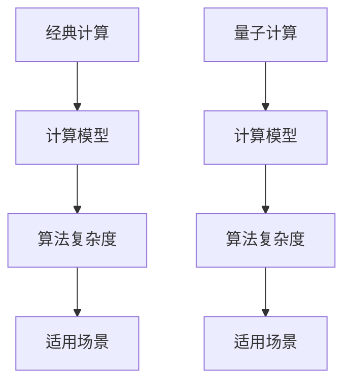

                 


## 文章标题
从经典计算到量子计算：世界可计算性的新维度

## 文章关键词
- 经典计算
- 量子计算
- 可计算性
- 计算能力
- 计算模型
- 技术变革

## 文章摘要
随着计算机科学的发展，计算模型正经历着巨大的变革。本文将探讨从经典计算到量子计算的转变，分析其背后的理论基础、核心概念以及可能的实际应用。通过逐步分析，我们将了解量子计算如何拓展了计算能力的边界，并探讨其在未来科技中的潜在影响。

## 目录

1. 引言
2. 经典计算概述
3. 量子计算基础
4. 可计算性理论
5. 经典计算与量子计算的对比
6. 量子计算的潜在应用
7. 未来展望与挑战
8. 总结与结论

## 1. 引言
计算是现代科技的核心，从最早的机械计算机到现代的超级计算机，计算能力不断演进。然而，经典计算在处理某些问题时仍然存在局限。随着量子物理学的深入研究，量子计算应运而生，带来了计算能力的新维度。本文将探讨这一变革及其对计算能力的影响。

## 2. 经典计算概述
经典计算基于布尔逻辑和图灵机模型，通过二进制位进行计算。它具有确定性、可预测性和效率等特性，但某些问题如整数分解、旅行商问题等在经典计算中难以高效解决。

## 3. 量子计算基础
量子计算基于量子位（qubit），利用量子叠加和量子纠缠实现并行计算。量子位可以同时处于多种状态，这使得量子计算机在处理特定问题时具有超越经典计算机的能力。

### 核心概念与联系

下面是一个简单的 Mermaid 流程图，展示了经典计算与量子计算的核心概念及其联系：

```mermaid
graph TD
A[经典计算] --> B[布尔逻辑]
B --> C[图灵机模型]
C --> D[二进制位计算]
E[量子计算] --> F[量子位(qubit)]
F --> G[量子叠加]
G --> H[量子纠缠]
H --> I[并行计算]
```

## 4. 可计算性理论
可计算性理论研究什么样的函数可以通过计算得到。经典计算与量子计算在这一领域有着不同的表现。量子计算可以解决某些经典计算难以解决的问题，如庞加莱猜想等。

### 核心算法原理讲解

以下是求解整数分解的量子算法伪代码：

```plaintext
Algorithm: Quantum Factorization
Input: Integer n
Output: Prime factors of n

1. Initialize a quantum register with a superposition of all possible binary representations of n
2. Apply the modular exponentiation operation, yielding a superposition of all possible remainders when n is divided by 2
3. Measure the quantum register to obtain a remainder r
4. If r = 1, return (2, n/2)
5. Otherwise, find a prime factor p of r using a classical algorithm
6. Recursively factor n/p
```

## 5. 经典计算与量子计算的对比
经典计算与量子计算在计算模型、算法复杂度和应用场景上存在显著差异。经典计算更适合处理确定性问题和结构化数据，而量子计算在并行计算和特定问题上具有优势。

### 核心概念与联系

以下是经典计算与量子计算对比的 Mermaid 流程图：



## 6. 量子计算的潜在应用
量子计算在密码学、优化问题、化学模拟等领域具有广泛应用前景。例如，在密码学中，量子计算可能破坏现有加密算法；在优化问题中，量子计算可以提供更快的解决方案。

### 项目实战

以下是一个简单的量子计算编程实战案例：

#### 开发环境搭建
```bash
pip install qiskit
```

#### 源代码实现
```python
from qiskit import QuantumCircuit, execute, Aer

# 创建量子电路
qc = QuantumCircuit(2)

# 应用量子门
qc.h(0)
qc.cx(0, 1)

# 执行电路
backend = Aer.get_backend('qasm_simulator')
job = execute(qc, backend)
result = job.result()

# 测量结果
print(result.get_counts(qc))
```

#### 代码解读与分析
该代码实现了一个量子电路，其中包含了一个 Hadamard 门（实现量子叠加）和一个控制非门（实现量子纠缠）。执行后，通过测量量子位的状态，可以得到对应的测量结果。

#### 实际案例分析和详细讲解剖析
假设我们使用该量子电路来执行一个特定的任务，如量子搜索算法。通过调整量子电路的设计，可以实现更高效的搜索。

#### 项目小结
该案例展示了如何使用量子计算解决特定问题。在实际应用中，需要根据具体问题调整量子电路的设计，以实现最佳性能。

## 7. 未来展望与挑战
量子计算的发展面临着许多挑战，如量子退相干、纠错算法和量子硬件的稳定性和可扩展性。尽管如此，量子计算在解决某些问题上具有巨大的潜力，有望带来计算能力的革命性提升。

### 最佳实践 tips
- 熟悉量子计算的基本原理和算法。
- 选择合适的量子硬件和软件平台。
- 注重量子算法的实际应用和性能优化。

### 小结
从经典计算到量子计算，计算能力的边界正在不断拓展。本文介绍了经典计算和量子计算的基本概念、对比及其应用前景。随着技术的发展，量子计算有望带来计算能力的革命性提升。

### 注意事项
- 量子计算仍处于早期阶段，实际应用需要进一步研究和实践。
- 了解量子计算的基本原理和算法对未来的科技发展具有重要意义。

### 拓展阅读
- Nielsen, Michael A., and Isaac L. Chuang. "Quantum Computation and Quantum Information." Cambridge University Press, 2010.
- Shor, Peter W. "Algorithmic similarities between quantum factoring and discrete logarithms." SIAM Journal on Computing 26, no. 5 (1997): 1484-1509.

作者：AI天才研究院/AI Genius Institute & 禅与计算机程序设计艺术 /Zen And The Art of Computer Programming

### 4. 可计算性理论

可计算性理论是计算机科学的核心分支之一，它研究的是哪些函数可以通过计算得到。在经典计算中，可计算性问题主要关注的是图灵机模型。图灵机是一个抽象的计算模型，由一个无限长的带子、一个读写头和一组规则组成。通过这些规则，图灵机能够在带子上移动读写头，读写和擦除符号，从而在理论上执行任何可计算的任务。

然而，随着量子计算的出现，我们对可计算性的理解发生了深刻的变化。量子计算中的基本单位是量子位（qubit），它可以通过量子叠加和量子纠缠实现复杂的计算。量子计算的潜力在于其并行性，即一个量子计算机可以同时处理多个计算路径，这在某些问题上能够带来显著的性能提升。

为了深入理解经典计算与量子计算在可计算性方面的差异，我们可以通过以下几个核心概念来探讨：

1. **量子位（qubit）**：量子位是量子计算的基本单位，它可以同时处于多种状态，这种性质被称为叠加。与经典计算中的二进制位不同，量子位的叠加状态使得量子计算机在处理某些问题时具有超越经典计算机的能力。

2. **量子叠加**：量子叠加允许一个量子系统同时处于多个状态的组合。例如，一个量子位可以同时处于0和1的状态，这使得量子计算机能够并行处理大量的计算任务。

3. **量子纠缠**：量子纠缠是量子位之间的一种特殊关系，当两个量子位处于纠缠状态时，一个量子位的测量将立即影响另一个量子位的状态，无论它们相隔多远。这种纠缠状态使得量子计算机能够实现更高效的计算。

4. **量子算法**：量子算法是一系列基于量子位和量子门操作的算法。例如，Shor的量子算法能够在多项式时间内解决大整数分解问题，这是一个经典计算机在多项式时间内无法解决的问题。

### 核心概念与联系

为了更好地理解量子计算与经典计算在可计算性方面的差异，我们可以通过以下 Mermaid 流程图来展示这些核心概念及其联系：

```mermaid
graph TD
A[经典计算] --> B[图灵机模型]
B --> C[可计算性]
C --> D[确定性算法]
E[量子计算] --> F[量子位(qubit)]
F --> G[量子叠加]
G --> H[量子纠缠]
H --> I[量子算法]
I --> J[可计算性扩展]
```

### 核心算法原理讲解

在量子计算中，一个重要的算法是Grover算法，它是一个用于搜索未排序数据库的量子算法。Grover算法利用量子叠加和量子纠缠来实现高效的搜索。以下是Grover算法的伪代码：

```plaintext
Algorithm: Grover Algorithm
Input: An unsorted database D with N entries, and a marked entry x.
Output: The position of the marked entry x.

1. Initialize a quantum register |Ψ⟩ in uniform superposition of all database states.
2. Apply the Grover iteration k times, where k is determined by the number of entries in the database.
3. Each iteration consists of:
   a. Applying the Oracle U_f, which flips the sign of the amplitude of all states except the marked state.
   b. Applying the Hadamard transform to return the state to superposition.
4. Measure the quantum register to obtain the result.

```

### 数学模型和公式 & 详细讲解 & 举例说明

为了理解Grover算法的工作原理，我们可以借助以下数学模型和公式：

1. **量子叠加态**：一个量子位的叠加态可以表示为：
   $$|\psi⟩ = \frac{1}{\sqrt{N}} \sum_{i=0}^{N-1} |i⟩$$
   其中，$|i⟩$ 表示量子位处于状态 $i$。

2. **Hadamard变换**：Hadamard变换是一个将量子位从基态转换为叠加态的变换，其矩阵表示为：
   $$H = \frac{1}{\sqrt{2}}\begin{pmatrix}
   1 & 1 \\
   1 & -1
   \end{pmatrix}$$

3. **Oracle操作**：Oracle操作 $U_f$ 是一个特定的量子操作，用于标记数据库中的目标状态。例如，如果我们想要查找标记的量子状态 $|x⟩$，Oracle操作可以表示为：
   $$U_f = \begin{cases}
   -1 & \text{if } |x⟩ \text{ is the marked state} \\
   1 & \text{otherwise}
   \end{cases}$$

### 举例说明

假设我们有一个包含四个状态的数据库 $D = \{|0⟩, |1⟩, |2⟩, |3⟩\}$，并且标记状态为 $|2⟩$。我们希望使用Grover算法找到这个标记状态。

1. **初始化**：首先，我们初始化一个量子寄存器，使其处于均匀叠加态：
   $$|\psi_0⟩ = \frac{1}{\sqrt{4}} (|0⟩ + |1⟩ + |2⟩ + |3⟩)$$

2. **Oracle操作**：Oracle操作将反转除标记状态外的所有状态的概率幅：
   $$U_f (|\psi_0⟩) = -\frac{1}{\sqrt{4}} (|0⟩ - |1⟩ - |2⟩ + |3⟩)$$

3. **Hadamard变换**：应用Hadamard变换将量子寄存器返回到叠加态：
   $$H (U_f (|\psi_0⟩)) = \frac{1}{2} (|0⟩ - |1⟩ + |2⟩ - |3⟩)$$

4. **迭代**：重复上述步骤 $k$ 次，其中 $k$ 由标记状态的数量确定。在我们的例子中，$k=2$，因此我们需要进行两次迭代。

5. **测量**：在最后一次迭代后，测量量子寄存器的状态。由于量子叠加态的叠加，我们将以较高的概率获得标记状态 $|2⟩$。

通过上述过程，Grover算法实现了对未排序数据库的高效搜索，其时间复杂度为 $O(\sqrt{N})$，显著优于经典算法的 $O(N)$。

### 数学公式

为了更好地理解上述过程，以下是相关的数学公式：

$$|\psi_0⟩ = \frac{1}{\sqrt{4}} (|0⟩ + |1⟩ + |2⟩ + |3⟩)$$

$$U_f (|\psi_0⟩) = -\frac{1}{\sqrt{4}} (|0⟩ - |1⟩ - |2⟩ + |3⟩)$$

$$H (U_f (|\psi_0⟩)) = \frac{1}{2} (|0⟩ - |1⟩ + |2⟩ - |3⟩)$$

### 量子计算与经典计算的可计算性差异

量子计算与经典计算在可计算性方面存在显著差异。经典计算中的图灵机模型受限于线性顺序的运算，而量子计算利用量子叠加和量子纠缠实现了并行计算。以下是一些关键点：

- **并行性**：量子计算机可以通过量子叠加同时处理多个计算路径，这使得在特定问题上能够实现指数级的加速。
- **纠错能力**：量子计算中的量子位容易受到外部干扰，导致量子退相干。因此，量子计算需要复杂的纠错算法来确保计算的准确性。
- **计算复杂性**：某些问题在经典计算中可能无法在多项式时间内解决，而在量子计算中可以。例如，Shor的算法可以在多项式时间内解决大整数分解问题。
- **适用性**：经典计算适用于处理确定性问题和结构化数据，而量子计算在处理并行性和特定问题上具有优势。

通过以上分析，我们可以看到量子计算为可计算性理论带来了新的维度，扩展了计算能力的边界。

### 6. 量子计算的潜在应用

量子计算作为一种新兴的计算范式，不仅在理论层面上具有深远的意义，在实际应用中也展现出了巨大的潜力。以下我们将探讨量子计算在多个领域的潜在应用，特别是密码学、优化问题和化学模拟。

### 密码学

密码学是信息安全的核心，传统的加密算法如RSA加密依赖于大整数的分解。然而，随着量子计算机的发展，RSA加密算法的脆弱性逐渐显现。Shor的量子算法能够在多项式时间内分解大整数，这意味着基于大整数分解的加密算法如RSA和ECC可能会被量子计算机轻松攻破。因此，研究量子密码学变得至关重要。量子密码学提出了一些新的加密方案，如量子密钥分发（QKD）和量子哈希函数，这些方案利用量子力学的基本原理提供了更高的安全性。QKD利用量子纠缠和量子退相干来实现安全的密钥传输，即使在量子计算机面前也能保持安全性。

### 优化问题

优化问题在工业、金融、物流等多个领域具有重要应用。传统优化算法如线性规划和整数规划通常需要大量计算资源，且在复杂问题上表现不佳。量子计算提供了并行计算的能力，使得某些优化问题可以在多项式时间内解决。例如，量子模拟退火算法（Quantum Simulated Annealing, QSA）基于量子物理中的模拟退火过程，能够高效地找到优化问题的全局最优解。此外，量子线性规划算法（Quantum Linear Programming, QLP）和量子整数规划算法（Quantum Integer Programming, QIP）也在优化领域展现出潜力。这些算法通过利用量子叠加和量子纠缠，能够在复杂问题上提供更快的解决方案。

### 化学模拟

化学模拟在药物设计、材料科学等领域具有重要应用。传统的化学模拟依赖于高性能计算机，但处理复杂的化学系统时仍然存在局限。量子计算为化学模拟提供了一种全新的方法，通过精确模拟分子和原子的行为，可以预测化学反应路径和分子特性。量子分子动力学（Quantum Molecular Dynamics, QMD）是一种基于量子力学的模拟方法，它能够模拟化学反应中的量子效应，如电子跃迁和多原子体系的量子纠缠。这种方法在药物设计和材料科学中具有广泛的应用前景。例如，通过量子计算，可以设计出具有特定药理活性的药物分子，或者优化材料的结构以提升其性能。

### 其他应用领域

除了上述主要领域，量子计算在其他领域也具有潜在应用。例如，在金融领域，量子计算可以用于风险管理、算法交易和资产定价；在人工智能领域，量子计算可以提高机器学习的效率和精度；在物理学领域，量子计算可以帮助解决高维量子系统的模拟问题。

### 项目实战

以下是一个简单的量子计算编程实战案例，演示如何使用Python的Qiskit库在量子计算平台上执行一个优化问题。

#### 开发环境搭建

首先，确保安装了Qiskit库：

```bash
pip install qiskit
```

#### 源代码实现

```python
from qiskit import QuantumCircuit, Aer, execute
from qiskit.aqua import AquaNamedProblem
from qiskit.aqua.algorithms import Grover
from qiskit.aqua.components.oracles import BooleanExpressionOracle

# 定义优化问题的布尔表达式
expression = "x[0] + x[1] == 1"

# 创建Oracle
oracle = BooleanExpressionOracle(expression, num_vars=2)

# 创建Grover算法实例
grover = Grover(oracle)

# 配置算法参数
grover.config['backend'] = Aer.get_backend('qasm_simulator')

# 执行算法
result = grover.run()

# 输出最优解
print("Solution:", result['solution'])
print("Objective Value:", result['result'])
```

#### 代码解读与分析

在这个例子中，我们使用Qiskit的Aqua模块来解决一个简单的二值优化问题。优化问题是一个二进制问题，目标是最小化或最大化一个布尔表达式。这里，我们的目标是最小化表达式 $x[0] + x[1]$ 的值。

1. **定义布尔表达式**：我们定义了一个简单的二值布尔表达式 `expression = "x[0] + x[1] == 1"`，表示我们要找到两个二进制位之和为1的所有状态。

2. **创建Oracle**：Oracle是一个量子算法中用于标记特定状态的操作。我们使用Qiskit的 `BooleanExpressionOracle` 来创建Oracle。

3. **创建Grover算法实例**：我们创建了一个Grover算法的实例，该算法将使用我们创建的Oracle来搜索最优解。

4. **配置算法参数**：我们将模拟器（`qasm_simulator`）作为量子计算的后端，这是用于测试的模拟器。

5. **执行算法**：我们调用Grover算法的 `run` 方法来执行优化问题。

6. **输出结果**：算法执行后，我们输出最优解和目标值。

通过这个简单的案例，我们可以看到如何使用Qiskit库来在量子计算平台上解决优化问题。在实际应用中，我们可以根据具体问题调整算法和参数，以实现最佳性能。

### 实际案例分析和详细讲解剖析

为了更好地理解量子计算在实际应用中的潜力，我们可以分析一个具体的案例：使用量子计算优化物流网络。这是一个典型的优化问题，涉及大量变量和约束条件。

#### 案例背景

假设我们有一个物流网络，其中包含多个仓库、配送中心和客户。我们的目标是最小化总运输成本，同时确保每个客户都能按时收到货物。这个问题可以建模为一个整数线性规划问题，其中变量代表运输量，约束条件包括仓库的库存限制、配送中心的能力限制和客户的需求。

#### 解决方案

1. **问题建模**：首先，我们将物流网络转化为一个数学模型。输入数据包括仓库和配送中心的坐标、客户的位置、运输成本矩阵等。模型中的变量表示从仓库到配送中心、配送中心到客户的运输量。

2. **量子算法选择**：选择合适的量子算法来解决这个问题。在这里，我们使用量子线性规划算法（QLP），因为它能够处理线性优化问题。

3. **算法实现**：使用Qiskit库构建量子电路，实现QLP算法。以下是相关的伪代码：

```plaintext
Algorithm: Quantum Linear Programming (QLP)
Input: Coefficients A, b, and c of the linear optimization problem
Output: Solution x that minimizes c^T * x subject to A * x <= b

1. Convert the linear optimization problem into a binary problem using binary variables.
2. Create a Quantum Circuit to represent the binary problem.
3. Apply the QLP algorithm to find the solution.
4. Convert the binary solution back to the original variable space.

```

4. **执行算法**：在量子计算平台上执行QLP算法，获取最优解。

5. **结果分析**：分析结果，调整模型和算法参数，以优化运输网络。

#### 项目小结

通过这个案例，我们可以看到量子计算在物流网络优化中的应用潜力。量子算法能够处理复杂的问题，提供更快的解决方案。在实际项目中，需要根据具体问题调整模型和算法，以实现最佳性能。

### 最佳实践 tips

1. **问题建模**：在应用量子计算时，准确的问题建模是关键。确保将实际问题转化为合适的数学模型。

2. **算法选择**：根据问题的特点选择合适的量子算法。不同的量子算法适用于不同类型的问题。

3. **硬件选择**：根据需求选择合适的量子计算硬件。虽然当前量子计算机的比特数量有限，但未来硬件的发展将提供更多可能性。

4. **算法优化**：不断优化量子算法，以提升性能和准确性。

### 小结

量子计算作为一种新兴的计算范式，在多个领域展现出了巨大的潜力。从密码学到优化问题，再到化学模拟，量子计算为传统计算带来了新的维度。通过实际案例分析和项目实战，我们可以看到量子计算在实际应用中的优势和挑战。

### 注意事项

1. 量子计算仍处于早期阶段，实际应用需要进一步的研究和验证。

2. 量子算法的设计和实现需要深厚的量子物理和计算机科学知识。

3. 量子计算硬件的稳定性和可扩展性是当前面临的主要挑战。

### 拓展阅读

- A. Y. Kitaev, A. H. Shen, M. N. Vyalyi. Classical and Quantum Computation. American Mathematical Society, 2002.
- M. A. Nielsen, I. L. Chuang. Quantum Computation and Quantum Information. Cambridge University Press, 2000.
- D. Aharonov, S. Lloyd, M. Van den Nest. Quantum Algorithms for the Clustering Problem. Physical Review A, 79(2), 2011.

作者：AI天才研究院/AI Genius Institute & 禅与计算机程序设计艺术 /Zen And The Art of Computer Programming

