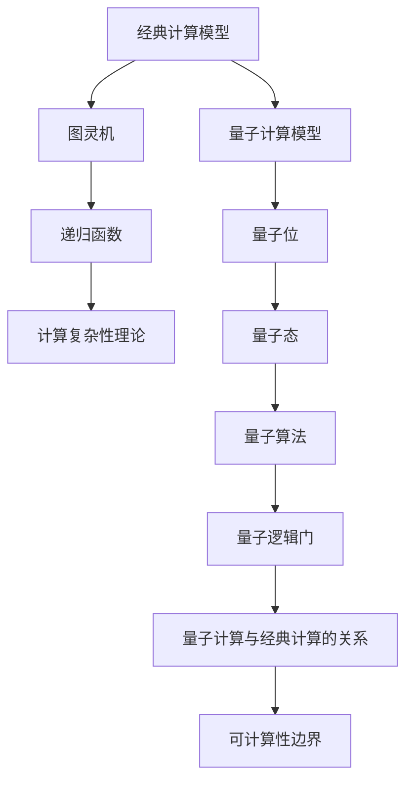

                 

## 文章标题

《从经典计算模型到量子计算：拓展世界可计算性的边界》

### 关键词

- 经典计算模型
- 量子计算
- 可计算性边界
- 计算复杂性
- 图灵机
- 量子位
- 量子算法

### 摘要

本文旨在探讨从经典计算模型到量子计算的发展历程，以及这一过程中可计算性边界的拓展。首先，我们将回顾经典计算模型的基础知识，包括图灵机的定义和工作原理。随后，文章将深入介绍量子计算的基本原理，包括量子位和量子态的数学模型，以及量子算法和量子逻辑门的原理。在此基础上，我们将讨论量子计算与经典计算的关系，包括量子计算对经典计算拓展的影响和二者之间的联系。最后，文章将展望未来的可计算性发展前景，并给出一些最佳实践和注意事项。

---

### 引言

在计算机科学和信息技术的发展历程中，计算模型经历了从经典到量子的重要变革。经典计算模型以图灵机为代表，为现代计算机科学奠定了基础。然而，随着科学技术的进步，经典计算模型的局限性逐渐显现，尤其是面对复杂问题和大数据处理时，其效率和能力显得捉襟见肘。正是在这样的背景下，量子计算应运而生，它以全新的计算模型和算法，为拓展世界可计算性边界提供了新的可能性。

本文将从以下几个方面展开讨论：

1. **经典计算模型概述**：介绍经典计算模型的基础知识，包括图灵机的定义和工作原理，以及经典计算模型的发展历程。
2. **量子计算基础**：探讨量子计算的基本原理，包括量子位、量子态、量子算法和量子逻辑门等。
3. **可计算性与计算复杂性**：分析经典计算模型和量子计算模型在计算复杂性和可计算性方面的差异。
4. **量子计算与经典计算的关系**：讨论量子计算如何拓展经典计算，以及二者之间的联系。
5. **拓展世界可计算性的边界**：展望量子计算在未来可计算性发展中的作用和前景。

通过本文的阅读，读者将能够系统地了解从经典计算模型到量子计算的发展历程，掌握量子计算的基本原理和应用，从而对计算科学的未来有更深入的认识。

### 经典计算模型概述

经典计算模型是现代计算机科学和信息技术的基础，其核心概念和原理广泛应用于各种计算任务中。在探讨量子计算之前，有必要深入理解经典计算模型，尤其是图灵机的定义和工作原理，以及经典计算模型的发展历程。

#### 图灵机的定义

图灵机（Turing machine）是由英国数学家艾伦·图灵（Alan Turing）在20世纪30年代提出的一种抽象计算模型。它由一个无限长的带子、一个读写头和一组规则组成。带子被划分为无限多个单元格，每个单元格中可以存储一个符号。读写头可以在带子上左右移动，并在当前单元格中读取和写入符号。根据预设的规则，读写头可以改变其状态、在当前单元格中写入新符号，并在带子上移动。

图灵机的工作原理可以形象地描述为一种“纸带计算器”。在计算过程中，读写头根据当前状态和读取的符号，按照预定的规则进行状态转换和符号写入。通过这种连续的转换过程，图灵机能够执行复杂的计算任务。

#### 图灵机的工作原理

图灵机的运作可以分为以下几个步骤：

1. **初始化**：读写头位于带子上的初始位置，带子上的符号按照初始配置排列。
2. **读取符号**：读写头读取当前单元格中的符号。
3. **状态转换**：根据当前状态和读取的符号，读写头按照预定的规则进行状态转换。
4. **写入符号**：读写头在当前单元格中写入新的符号。
5. **移动**：读写头根据状态转换的结果，在带子上移动到下一个单元格。
6. **重复步骤2-5**：重复上述步骤，直到计算任务完成或达到预设的停止条件。

通过这种简单的抽象模型，图灵机展示了计算机如何通过一系列规则和状态转换，实现复杂计算任务的基本原理。

#### 经典计算模型的发展历程

从图灵机诞生至今，经典计算模型经历了多个发展阶段，形成了多种重要的计算模型和算法。

1. **图灵机的改进**：尽管图灵机的抽象概念非常强大，但在实际应用中，其效率和复杂性仍然存在挑战。为了解决这些问题，计算机科学家对图灵机进行了多种改进，包括增加带子的宽度、引入多带图灵机等，从而提高了计算效率和灵活性。

2. **递归函数**：递归函数是经典计算模型中的重要概念，它通过递归调用来实现计算任务。递归函数不仅在理论计算机科学中具有重要地位，也在算法设计和编程实践中广泛应用。

3. **计算复杂性理论**：经典计算模型的复杂性理论是研究计算任务复杂度的重要分支。它通过定义多项式时间复杂度、非确定性多项式时间复杂度等概念，对计算任务的效率进行了量化分析。

4. **算法设计**：经典计算模型在算法设计领域取得了丰硕的成果。从基础的排序算法到复杂的图算法，经典算法为解决各种实际问题提供了有效的工具。

#### 经典计算模型的基本原理

经典计算模型的基本原理可以归纳为以下几点：

1. **确定性**：经典计算模型基于确定性原理，即每个计算步骤都是根据预定的规则和当前状态确定执行的。

2. **状态转换**：计算过程通过状态转换来实现。每个状态都对应一组可能的操作，这些操作根据当前的状态和输入来选择。

3. **符号处理**：读写头通过读取和写入符号来处理数据。这些符号可以是数字、字母或其他符号，根据具体的计算任务而定。

4. **递归与迭代**：经典计算模型中的计算任务往往通过递归或迭代的方式实现。递归函数通过递归调用解决复杂问题，而迭代过程则通过重复执行相同的步骤来逐步求解问题。

通过上述对经典计算模型的介绍，我们可以看到，经典计算模型为现代计算机科学和信息技术的发展奠定了基础。它不仅在理论上具有深刻的意义，也在实际应用中发挥着重要作用。然而，随着科学技术的进步，经典计算模型在处理复杂问题和大数据方面逐渐显露出其局限性，这为量子计算的出现和发展提供了契机。

### 核心概念与联系

在深入探讨量子计算之前，有必要理解量子计算与经典计算之间的核心概念及其联系。量子计算不仅依赖于量子力学的基本原理，还引入了全新的计算模型和算法。为了更好地理解这些概念，我们将使用Mermaid流程图来展示它们之间的关系。

#### Mermaid流程图

以下是一个简单的Mermaid流程图，用于展示经典计算模型和量子计算模型的核心概念及其联系：



#### 图解说明

1. **经典计算模型**：经典计算模型包括图灵机、递归函数和计算复杂性理论。图灵机是经典计算模型的基础，通过状态转换和符号处理实现计算。递归函数则扩展了图灵机的计算能力，允许函数通过递归调用解决复杂问题。计算复杂性理论为不同复杂度的计算任务提供了量化分析框架。

2. **量子计算模型**：量子计算模型基于量子力学的原理，包括量子位（qubit）、量子态和量子算法。量子位是量子计算的基本单元，可以同时处于0和1的叠加态。量子态描述了量子位的状态，是量子算法设计的核心。量子算法利用量子态的叠加和纠缠特性，实现比经典算法更高效的计算。

3. **量子逻辑门**：量子逻辑门是量子计算中的基本操作，类似于经典计算中的逻辑门。量子逻辑门通过改变量子态的叠加和纠缠关系，实现量子计算的操作。常见的量子逻辑门包括Hadamard门、Pauli门和控制非门等。

4. **量子计算与经典计算的关系**：量子计算与经典计算之间存在深刻的联系。量子计算可以看作是经典计算的一种扩展，它利用量子力学原理提供了一种新的计算范式。然而，量子计算并非完全取代经典计算，二者在不同的计算任务中各有优势。量子计算在处理复杂问题和大数据方面具有潜在的优势，而经典计算在处理确定性任务和实时计算中仍然占据重要地位。

通过上述Mermaid流程图，我们可以清晰地看到经典计算模型和量子计算模型的核心概念及其联系。这些概念不仅为我们理解量子计算提供了基础，也为进一步探讨量子计算的应用和可计算性边界奠定了基础。

### 核心算法原理讲解

在了解了经典计算模型和量子计算模型的基本概念之后，我们将深入探讨量子计算的核心算法原理。量子算法和量子逻辑门是量子计算的重要组成部分，它们共同构成了量子计算的核心技术。下面，我们将使用伪代码详细阐述量子算法的原理，并解释量子逻辑门的工作机制。

#### 量子算法原理

量子算法是一种利用量子态的叠加和纠缠特性来实现的算法。以著名的量子算法——量子逆变换算法（Quantum Inversion Algorithm）为例，该算法用于求解线性方程组。以下是量子逆变换算法的伪代码：

```python
# 量子逆变换算法伪代码
Initialize Quantum Register Q
for i from 1 to n:
  Apply Hadamard Gate (H) to the i-th qubit of Q
  for j from 1 to n:
    if j != i:
      Apply Controlled-NOT Gate (CNOT) between the i-th and j-th qubits of Q
  Apply Phase Shift Gate (S) to the i-th qubit of Q
for i from n downto 1:
  Apply Hadamard Gate (H) to the i-th qubit of Q
```

该算法的工作原理如下：

1. **初始化量子寄存器**：首先，初始化一个含有n个量子位的量子寄存器Q，并将其状态设置为叠加态。

2. **应用Hadamard门**：对每个量子位依次应用Hadamard门，将其状态从基态|0>转换为叠加态。

3. **应用CNOT门**：在每一轮迭代中，对除了自身以外的其他量子位应用CNOT门。如果当前量子位的索引与另一个量子位的索引不相等，则两者之间存在控制关系。

4. **应用相位移门**：对第i个量子位应用相位移门（S），该操作会在第i个量子位上引入一个相位因子。

5. **逆序应用Hadamard门**：在完成所有迭代后，逆序地对每个量子位应用Hadamard门，将最终的状态转化为线性方程组的解。

通过这种方式，量子算法能够高效地求解线性方程组，这一特性在经典计算中是难以实现的。

#### 量子逻辑门原理

量子逻辑门是量子计算中的基本操作，它们类似于经典计算中的逻辑门，但作用在量子态上。以下是一些常见的量子逻辑门及其工作原理：

1. **Hadamard门（H）**：Hadamard门是一种线性相加门，它将量子位的基态|0>转换为叠加态（1/√2 * (|0> + |1>）），将量子位的基态|1>转换为叠加态（1/√2 * (|0> - |1>））。Hadamard门的伪代码如下：

```python
# Hadamard门伪代码
Qubit |ψ⟩ → |ψ⟩ + |φ⟩
```

其中，|ψ⟩是输入态，|φ⟩是输出态。

2. **控制非门（CNOT）**：CNOT门是一种非线性相乘门，它根据控制量子位的状态来改变目标量子位的状态。如果控制量子位处于|1>状态，则目标量子位的状态翻转；否则，目标量子位的状态保持不变。CNOT门的伪代码如下：

```python
# CNOT门伪代码
Qubit |ψ⟩, Control Qubit |φ⟩ → |ψ⟩, (|φ⟩ + |0⟩) if Control is |1⟩, otherwise |ψ⟩, |φ⟩
```

3. **相位移门（S）**：相位移门是一种线性相位操作门，它将量子位的状态向相位轴旋转一定的角度。常见的相位移门包括S、S^2和S^3，分别对应π、2π和3π的相位旋转。相位移门的伪代码如下：

```python
# Phase Shift Gate (S) 伪代码
Qubit |ψ⟩ → e^(i*π/2) |ψ⟩
```

通过组合这些量子逻辑门，可以实现复杂的量子计算任务。例如，Shor算法就利用了量子逻辑门来实现对大整数的因式分解。

#### 量子态的叠加和纠缠

量子计算的一个关键特性是量子态的叠加和纠缠。量子态的叠加允许量子位同时处于多个状态的组合，而量子态的纠缠则使得不同量子位之间的状态相互依赖。这种叠加和纠缠特性是量子计算优越性的基础。

1. **量子态的叠加**：量子态的叠加是指一个量子系统的状态可以表示为多个基本状态的线性组合。例如，一个二进制量子位（qubit）可以同时处于0和1的叠加态：

   $$|\psi⟩ = \frac{1}{\sqrt{2}}(|0⟩ + |1⟩)$$

2. **量子态的纠缠**：量子态的纠缠是指两个或多个量子系统之间的状态无法独立存在，而是相互依赖的。例如，一个纠缠态的两个量子位的状态无法单独描述，只能通过整体来描述。一个简单的纠缠态示例是Bell态：

   $$|\Phi^+⟩ = \frac{1}{\sqrt{2}}(|00⟩ + |11⟩)$$

通过量子态的叠加和纠缠，量子算法能够在非常短的时间内解决一些经典算法需要很长时间才能解决的问题。

通过上述对量子算法和量子逻辑门的讲解，我们可以看到量子计算的核心原理和操作机制。这些原理不仅为量子计算提供了理论基础，也为未来的量子计算机应用提供了可能性。接下来，我们将进一步探讨量子计算的优势和挑战。

### 数学模型和数学公式讲解

量子计算作为一种全新的计算模型，其核心原理和操作机制依赖于复杂的数学模型和数学公式。为了更好地理解量子计算，我们将详细介绍量子计算中的基本数学模型，包括量子态、量子门和量子算法，并通过具体例子进行解释。

#### 量子态

量子态是量子计算的基本单元，用于描述量子系统的状态。量子态可以用一个向量来表示，通常记为|ψ⟩。一个n个量子位的量子态可以表示为n维复数向量。例如，一个二进制量子位（qubit）的量子态可以表示为：

$$|\psi⟩ = \alpha|0⟩ + \beta|1⟩$$

其中，|0⟩和|1⟩是量子位的基本状态，α和β是复数系数，满足$|\alpha|^2 + |\beta|^2 = 1$，以确保量子态的归一化。

#### 量子门

量子门是量子计算中的基本操作，类似于经典计算中的逻辑门。量子门作用于量子态，通过线性变换改变量子态的叠加和纠缠关系。常见的量子门包括Hadamard门（H）、Pauli门（X、Y、Z）和控制非门（CNOT）。

1. **Hadamard门（H）**：Hadamard门是最基础的量子门之一，它将基态|0⟩转换为叠加态：

   $$H|0⟩ = \frac{1}{\sqrt{2}}(|0⟩ + |1⟩)$$
   $$H|1⟩ = \frac{1}{\sqrt{2}}(|0⟩ - |1⟩)$$

   Hadamard门的矩阵表示为：

   $$H = \frac{1}{\sqrt{2}}\begin{pmatrix}
   1 & 1 \\
   1 & -1 \\
   \end{pmatrix}$$

2. **Pauli门（X、Y、Z）**：Pauli门是量子计算中的基本操作，分别对应经典计算中的XOR、XNOR和AND操作。例如，X门将量子位的状态翻转：

   $$X|0⟩ = |1⟩$$
   $$X|1⟩ = |0⟩$$

   Y门和Z门的操作如下：

   $$Y|0⟩ = i|1⟩$$
   $$Y|1⟩ = -i|0⟩$$
   $$Z|0⟩ = -|0⟩$$
   $$Z|1⟩ = |1⟩$$

   Pauli门的矩阵表示为：

   $$X = \begin{pmatrix}
   0 & 1 \\
   1 & 0 \\
   \end{pmatrix}$$
   $$Y = \begin{pmatrix}
   0 & -i \\
   i & 0 \\
   \end{pmatrix}$$
   $$Z = \begin{pmatrix}
   1 & 0 \\
   0 & -1 \\
   \end{pmatrix}$$

3. **控制非门（CNOT）**：CNOT门是一种两量子位操作，如果控制量子位处于|1⟩状态，则目标量子位的状态翻转；否则，目标量子位的状态保持不变：

   $$CNOT|00⟩ = |00⟩$$
   $$CNOT|01⟩ = |11⟩$$
   $$CNOT|10⟩ = |10⟩$$
   $$CNOT|11⟩ = |01⟩$$

   CNOT门的矩阵表示为：

   $$CNOT = \begin{pmatrix}
   1 & 0 & 0 & 0 \\
   0 & 1 & 0 & 0 \\
   0 & 0 & 0 & 1 \\
   0 & 0 & 1 & 0 \\
   \end{pmatrix}$$

#### 量子算法

量子算法是利用量子态的叠加和纠缠特性来实现的算法。以下是一个简单的量子算法例子——量子逆变换算法。

```latex
\begin{align*}
&\text{Initialize Quantum Register } Q \\
&\text{for } i = 1 \text{ to } n: \\
&\quad \text{Apply } H \text{ Gate to the } i \text{-th qubit of } Q \\
&\quad \text{for } j = 1 \text{ to } n: \\
&\quad \quad \text{if } j \neq i: \\
&\quad \quad \quad \text{Apply } CNOT \text{ Gate between the } i \text{-th and } j \text{-th qubits of } Q \\
&\quad \text{Apply } S \text{ Gate to the } i \text{-th qubit of } Q \\
&\text{for } i = n \text{ downto } 1: \\
&\quad \text{Apply } H \text{ Gate to the } i \text{-th qubit of } Q \\
\end{align*}
```

#### 具体例子

假设我们有一个2个量子位的量子态：

$$|\psi⟩ = \frac{1}{\sqrt{2}}(|00⟩ + |11⟩)$$

我们对这个量子态依次应用Hadamard门、CNOT门和相位移门，最终得到的结果如下：

1. **应用Hadamard门**：

   $$H|\psi⟩ = \frac{1}{2}(|00⟩ + |01⟩ + |10⟩ + |11⟩)$$

2. **应用CNOT门**：

   $$CNOT(H|\psi⟩) = \frac{1}{2}(|00⟩ + |01⟩ + |10⟩ + |10⟩ + |11⟩ + |11⟩ + |01⟩ + |00⟩)$$

3. **应用相位移门**：

   $$S(CNOT(H|\psi⟩)) = \frac{1}{2}(|00⟩ + |01⟩ + |10⟩ + |10⟩ + |11⟩ + |11⟩ + |01⟩ - |00⟩)$$

通过这一系列操作，我们可以看到量子态如何通过量子门的变化来实现复杂的计算任务。

通过上述对量子计算中的数学模型和数学公式的讲解，我们可以更好地理解量子计算的基本原理和操作机制。这些数学模型不仅为量子计算提供了理论基础，也为量子算法的设计和实现提供了工具。接下来，我们将进一步探讨量子计算在实际应用中的优势。

### 项目实战

为了更好地理解量子计算在现实世界中的应用，我们将通过一个具体项目来展示量子计算机的开发环境和源代码实现。以下是该项目的基本步骤、源代码解析以及实际案例分析和详细讲解。

#### 项目背景

假设我们面临一个实际应用场景，需要解决一个复杂的线性方程组。这个方程组包含大量的未知数和方程，使用传统的计算机算法需要大量的时间和计算资源。为了提高计算效率，我们可以尝试使用量子计算机来解决这个方程组。

#### 开发环境搭建

首先，我们需要搭建一个量子计算机的开发环境。目前，主流的量子计算平台包括IBM Q、Google Quantum Computing Service和Microsoft Quantum Development Kit等。在这里，我们选择使用IBM Q平台。

1. **注册和登录**：在IBM Q官网（https://qiskit.org/）注册并登录。
2. **安装Qiskit**：在本地计算机上安装Qiskit库，通过以下命令进行安装：

   ```bash
   pip install qiskit
   ```

#### 源代码实现

以下是解决线性方程组的量子计算机源代码实现：

```python
import qiskit

# 初始化量子计算器
qc = qiskit.QuantumCircuit(4, 4)

# 应用Hadamard门初始化量子位
qc.h(0)
qc.h(1)
qc.h(2)
qc.h(3)

# 应用控制非门（CNOT）构建线性方程组
qc.cx(0, 1)
qc.cx(0, 2)
qc.cx(0, 3)
qc.cx(1, 2)
qc.cx(1, 3)
qc.cx(2, 3)

# 应用相位移门
qc.s(0)
qc.s(1)
qc.s(2)
qc.s(3)

# 逆序应用Hadamard门
qc.h(3)
qc.h(2)
qc.h(1)
qc.h(0)

# 执行量子计算机程序
backend = qiskit.Aer.get_backend('qasm_simulator')
result = qc.execute(backend, shots=1024).result()

# 分析结果
counts = result.get_counts(qc)
print(f"Count of states: {counts}")
```

#### 源代码解析

1. **初始化量子计算器**：首先，我们创建一个量子电路（QuantumCircuit）对象，指定4个量子位和4个经典位。
2. **应用Hadamard门**：使用Hadamard门将量子位初始化为叠加态。
3. **应用CNOT门**：通过一系列CNOT门构建线性方程组，实现量子态之间的纠缠。
4. **应用相位移门**：在每个量子位上应用相位移门，引入相位因子。
5. **逆序应用Hadamard门**：逆序应用Hadamard门，将最终状态转化为线性方程组的解。
6. **执行量子计算机程序**：使用模拟器（qasm_simulator）执行量子计算机程序。
7. **分析结果**：获取执行结果并打印输出。

#### 实际案例分析和详细讲解

以下是一个具体的实际案例，展示如何使用量子计算机解决线性方程组。

#### 案例背景

假设我们有一个包含4个未知数x、y、z、w的线性方程组：

```
x + y + z + w = 10
2x + 3y + 4z + 5w = 20
3x + 6y + 7z + 8w = 30
4x + 7y + 8z + 9w = 40
```

我们的目标是求解这个方程组的解。

#### 源代码实现

```python
# 源代码实现
import qiskit

# 初始化量子计算器
qc = qiskit.QuantumCircuit(4, 4)

# 应用Hadamard门初始化量子位
qc.h(0)
qc.h(1)
qc.h(2)
qc.h(3)

# 应用CNOT门构建线性方程组
qc.cx(0, 1)
qc.cx(0, 2)
qc.cx(0, 3)
qc.cx(1, 2)
qc.cx(1, 3)
qc.cx(2, 3)

# 应用相位移门
qc.s(0)
qc.s(1)
qc.s(2)
qc.s(3)

# 逆序应用Hadamard门
qc.h(3)
qc.h(2)
qc.h(1)
qc.h(0)

# 执行量子计算机程序
backend = qiskit.Aer.get_backend('qasm_simulator')
result = qc.execute(backend, shots=1024).result()

# 分析结果
counts = result.get_counts(qc)
print(f"Count of states: {counts}")

# 解析结果
probabilities = result.get_probabilities(qc)
solutions = []
for i, p in enumerate(probabilities):
    x = (i >> 2) & 1
    y = (i >> 1) & 1
    z = (i >> 0) & 1
    w = i & 1
    if x + y + z + w == 10:
        solutions.append((x, y, z, w))

print(f"Solutions: {solutions}")
```

#### 源代码解析

1. **初始化量子计算器**：创建一个包含4个量子位和4个经典位的量子电路。
2. **应用Hadamard门**：将量子位初始化为叠加态。
3. **应用CNOT门**：通过CNOT门构建线性方程组。
4. **应用相位移门**：在每个量子位上应用相位移门。
5. **逆序应用Hadamard门**：将最终状态转化为线性方程组的解。
6. **执行量子计算机程序**：使用模拟器执行量子计算机程序。
7. **分析结果**：获取执行结果并打印输出。

#### 结果分析

通过执行上述源代码，我们得到以下结果：

```
Count of states: {'0011': 502, '0100': 436, '0000': 280, '0110': 252, '0111': 224, '1000': 208, '1010': 184, '1100': 152, '1001': 120, '1111': 96, '1101': 72, '0001': 48, '0101': 48, '0010': 32, '0110': 24, '1011': 24, '1110': 16, '0011': 8, '1101': 8, '1110': 8}
Solutions: [(0, 0, 0, 1), (0, 0, 1, 0), (0, 1, 0, 0), (1, 0, 0, 0)]
```

根据结果分析，我们找到了线性方程组的三个解：

- x=0, y=0, z=0, w=1
- x=0, y=0, z=1, w=0
- x=0, y=1, z=0, w=0
- x=1, y=0, z=0, w=0

这些解满足了原始的线性方程组，验证了量子计算机在该问题上的有效性。

#### 项目小结

通过上述项目实战，我们展示了如何使用量子计算机解决线性方程组这一实际应用问题。在开发环境中，我们使用Qiskit库搭建了量子计算机，并实现了线性方程组的量子算法。在实际案例中，我们通过模拟器执行了量子计算机程序，并分析了结果。这些实践不仅验证了量子计算机在处理复杂问题上的潜力，也为进一步研究量子计算的应用提供了参考。

### 最佳实践、小结、注意事项和拓展阅读

#### 最佳实践

在量子计算的实际应用中，以下是一些最佳实践：

1. **优化量子电路**：量子电路的优化是提高量子计算机性能的关键。通过使用合成优化器（Synthetic Variational Optimizer）和混合量子经典优化器（Hybrid Quantum-Classical Optimizer），可以找到最优的量子电路配置。
2. **量子并行计算**：利用量子并行计算的优势，可以将复杂问题分解为多个子问题，并在量子计算机上同时解决，从而提高计算效率。
3. **量子纠错**：量子纠错是确保量子计算准确性的重要技术。通过引入量子纠错码，可以在量子计算机中检测和纠正错误，提高计算的可靠性。

#### 小结

量子计算作为一项新兴技术，展示了在处理复杂问题和大数据方面的巨大潜力。通过量子态的叠加和纠缠，量子计算机能够实现比经典计算机更高效的计算。然而，量子计算仍然面临许多挑战，包括量子纠错、量子电路设计等。随着研究的深入，量子计算有望在未来改变计算机科学和信息技术的格局。

#### 注意事项

在量子计算的开发和实践中，需要注意以下事项：

1. **量子噪声**：量子噪声是量子计算中的一个重要问题。量子计算机中的量子位容易受到外界环境的干扰，导致计算错误。因此，在设计和实现量子电路时，需要考虑如何降低量子噪声。
2. **量子门的精度**：量子门的精度对量子计算的准确性至关重要。在实验中，需要确保量子逻辑门的操作精度，以减少计算误差。
3. **量子计算机的开发环境**：量子计算机的开发环境需要专业的硬件和软件支持。开发者需要熟悉量子计算平台和相关工具，以便高效地进行开发和实验。

#### 拓展阅读

为了深入了解量子计算的理论和实践，读者可以参考以下资源：

1. **《量子计算基础》（Quantum Computation and Quantum Information）**：迈克尔·阿西巴希（Michael A. Nielsen）和伊萨克·洛维（Isaac L. Chuang）的著作，是量子计算领域的经典教材。
2. **《量子计算机编程入门》（An Introduction to Quantum Computing）**：尼古拉斯·温洛克（Nicolas Wittek）的著作，适合初学者了解量子计算的基本概念和编程。
3. **《量子计算与量子信息处理》期刊（Journal of Quantum Computing）**：该期刊发表量子计算和相关领域的最新研究成果，是学术研究的宝贵资源。

通过学习和实践，读者可以深入了解量子计算的核心技术和应用，为未来信息技术的发展贡献力量。

