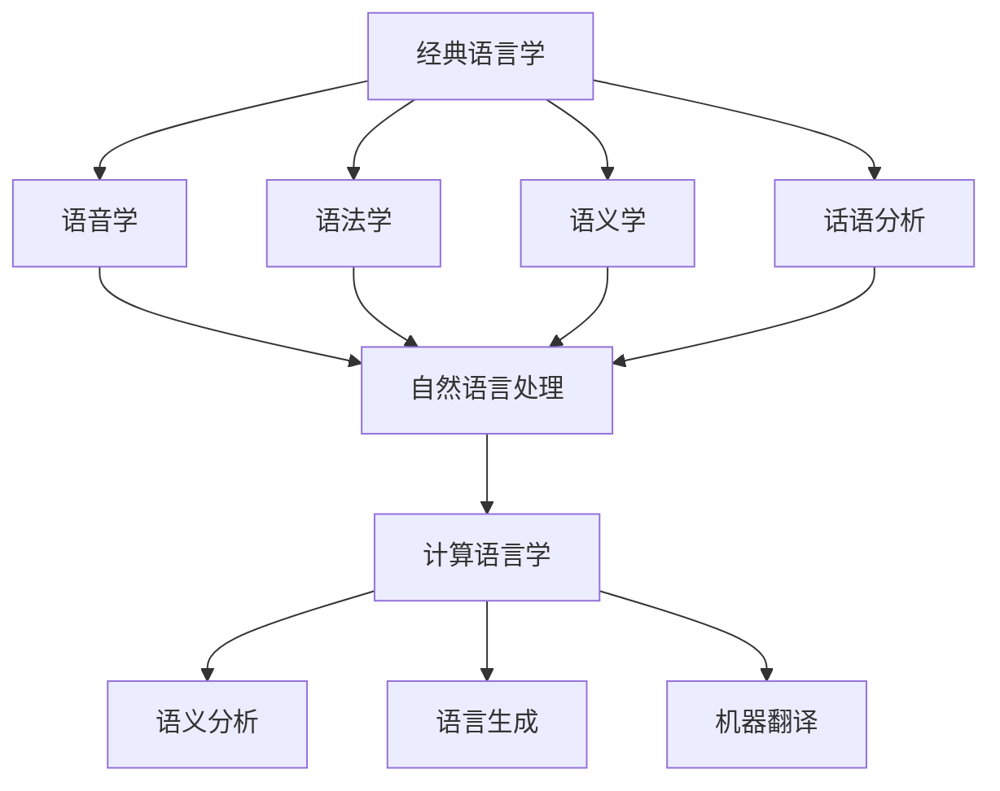

                 

### 文章标题

《从经典语言学到计算语言学：理解语言与世界的关系》

> 关键词：经典语言学，计算语言学，自然语言处理，语义分析，语言生成，机器翻译，数学模型，伪代码，LaTeX，项目实战

> 摘要：本文系统地探讨了从经典语言学到计算语言学的过渡与融合，深入解析了语言学的基础理论、计算语言学的基本概念及其应用，并通过实际项目展示了计算语言学在理解和构建语言与世界关系中的重要性。文章旨在为读者提供清晰、易懂的技术博客，以帮助理解这一跨学科领域的核心思想和方法。

----------------------------------------------------------------

### 引言

语言是人类文明的重要组成部分，它不仅是一种交流工具，更是一种思维和认知的方式。从古至今，语言学研究始终是学术界的重要课题。然而，随着计算机科学的飞速发展，语言学的理论和方法开始与计算技术相结合，形成了新的研究领域——计算语言学。计算语言学旨在利用计算机技术和算法来解决自然语言处理、语义分析、语言生成和机器翻译等问题，从而更好地理解和模拟人类语言。

本文将系统地探讨从经典语言学到计算语言学的过渡与融合。首先，我们将回顾经典语言学的基本理论，包括语音学、语法学、语义学和话语分析。接着，我们将介绍计算语言学的起源、发展及其核心概念，如自然语言处理、语义分析、语言生成和机器翻译。然后，我们将通过一个Mermaid流程图，展示经典语言学与计算语言学之间的核心概念联系。在此基础上，我们将深入讲解计算语言学的核心算法原理，并使用伪代码和LaTeX格式展示数学模型和公式。最后，我们将通过实际项目实战，展示计算语言学在理解和构建语言与世界关系中的具体应用。

本文的结构如下：

1. **经典语言学基础**：介绍语音学、语法学、语义学和话语分析的基本概念。
2. **计算语言学基础**：介绍自然语言处理、语义分析、语言生成和机器翻译的起源、发展及其核心概念。
3. **核心概念与联系**：使用Mermaid流程图展示经典语言学到计算语言学的发展路径和核心概念联系。
4. **核心算法原理讲解**：使用伪代码详细讲解计算语言学中的关键算法，如词性标注、句法分析等。
5. **数学模型和数学公式**：介绍计算语言学中常用的数学模型，如语言模型、隐马尔可夫模型等，并用LaTeX格式写出相关的数学公式。
6. **项目实战**：提供实际项目中的代码案例，详细解释代码实现过程和关键步骤。
7. **总结**：对全书内容进行总结，强调计算语言学在理解和构建语言与世界关系中的重要性。

### 经典语言学基础

经典语言学是语言学研究的早期阶段，其主要目标是描述和解释人类语言的结构和功能。经典语言学主要包括语音学、语法学、语义学和话语分析等几个方面。

#### 语音学

语音学是语言学的一个分支，主要研究语音的物理特性、生理特性、语音感知和语音产生。语音学关注的问题包括音素、音节、音调、音速、音质等。语音学的研究方法包括实验语音学、比较语音学和理论语音学等。

**核心概念：**

- 音素：音素是语音学中最基本的音位单位，它是语言中能够区分意义的最小语音单位。
- 音节：音节是语音学中的另一个基本单位，它是由一个或多个音素组成的，可以发音的最小语音组合。
- 音调：音调是语音学中的一个重要特征，它是指语音的频率变化，通常表现为声音的高低。

#### 语法学

语法学是语言学的一个分支，主要研究句子的结构和语法规则。语法学关注的问题包括词法、句法、语序、时态、语气等。

**核心概念：**

- 词法：词法是语法学中的一个重要部分，它研究单词的构成、形态变化和功能。
- 句法：句法是语法学中的另一个重要部分，它研究句子的结构、语法规则和句子的构成方式。
- 语序：语序是句子中单词的排列顺序，不同的语序可以产生不同的句子意义。
- 时态：时态是语法中的一个概念，它表示动作发生的时间，包括过去、现在和未来。

#### 语义学

语义学是语言学的一个分支，主要研究语言的意义和语义关系。语义学研究的问题包括词汇意义、句子意义、语义角色、语义网络等。

**核心概念：**

- 词汇意义：词汇意义是语义学中的一个基本概念，它是指单词所代表的概念或意义。
- 句子意义：句子意义是语义学中的另一个重要概念，它是指整个句子的意义。
- 语义角色：语义角色是语义学中的一个概念，它表示句子中不同成分之间的关系和作用。

#### 话语分析

话语分析是语言学的一个分支，主要研究语言在实际使用中的结构和功能。话语分析关注的问题包括对话、语篇、语境、交际功能等。

**核心概念：**

- 对话：对话是话语分析中的一个基本概念，它是指两个或多个参与者之间的语言交流。
- 语篇：语篇是话语分析中的另一个重要概念，它是指一段连续的语言表达。
- 语境：语境是话语分析中的一个概念，它是指语言交流发生的具体环境。

### 计算语言学基础

计算语言学是语言学与计算机科学相结合的产物，它旨在利用计算机技术和算法来解决自然语言处理、语义分析、语言生成和机器翻译等问题。计算语言学的研究内容包括自然语言处理、语义分析、语言生成和机器翻译等。

#### 自然语言处理

自然语言处理（Natural Language Processing，NLP）是计算语言学的一个重要分支，它涉及计算机与人类语言之间的交互。NLP的研究目标包括文本预处理、词性标注、句法分析、语义分析、情感分析等。

**核心概念：**

- 文本预处理：文本预处理是NLP中的第一步，它包括去除标点、大小写转换、停用词去除等。
- 词性标注：词性标注是NLP中的一个重要任务，它旨在为文本中的每个单词标注其词性，如名词、动词、形容词等。
- 句法分析：句法分析是NLP中的一个关键任务，它旨在理解句子的结构，识别句子的成分和关系。
- 语义分析：语义分析是NLP中的一个高级任务，它旨在理解文本中的语义关系和意义。

#### 语义分析

语义分析（Semantic Analysis）是计算语言学中的一个重要分支，它涉及对文本中的语义进行理解和解释。语义分析的研究目标包括词义消歧、语义角色标注、语义网络构建等。

**核心概念：**

- 词义消歧：词义消歧是语义分析中的一个基本问题，它旨在解决文本中多义词的正确理解。
- 语义角色标注：语义角色标注是语义分析中的一个任务，它旨在为文本中的每个成分标注其在句子中的语义角色，如动作执行者、受事者等。
- 语义网络构建：语义网络构建是语义分析中的一个高级任务，它旨在构建一个表示文本中语义关系的网络。

#### 语言生成

语言生成（Language Generation）是计算语言学中的另一个重要分支，它涉及计算机生成自然语言文本。语言生成的研究目标包括文本摘要、问答系统、聊天机器人等。

**核心概念：**

- 文本摘要：文本摘要是语言生成中的一个基本任务，它旨在从长文本中提取出关键信息，生成简短的摘要文本。
- 问答系统：问答系统是语言生成中的一个应用，它旨在能够回答用户提出的问题。
- 聊天机器人：聊天机器人是语言生成中的一个应用，它旨在能够与人类进行自然语言交互。

#### 机器翻译

机器翻译（Machine Translation）是计算语言学中的一个重要分支，它涉及将一种语言的文本翻译成另一种语言。机器翻译的研究目标包括基于规则翻译、基于统计翻译、神经机器翻译等。

**核心概念：**

- 基于规则翻译：基于规则翻译是机器翻译的一种传统方法，它使用预定义的规则来指导翻译过程。
- 基于统计翻译：基于统计翻译是机器翻译的一种现代方法，它使用大量的双语语料库来学习翻译模型。
- 神经机器翻译：神经机器翻译是机器翻译的一种最新方法，它使用深度学习模型来学习翻译。

### 核心概念与联系

为了更好地理解经典语言学到计算语言学的过渡与融合，我们可以使用Mermaid流程图来展示两者之间的核心概念联系。



通过这个流程图，我们可以清晰地看到经典语言学的各个分支如何过渡到计算语言学，以及计算语言学的各个分支如何应用经典语言学的核心概念。

### 核心算法原理讲解

在计算语言学中，有许多关键算法用于解决自然语言处理、语义分析、语言生成和机器翻译等问题。以下我们将使用伪代码详细讲解这些算法的基本原理。

#### 词性标注

词性标注（Part-of-Speech Tagging）是自然语言处理中的一个重要任务，其目标是给文本中的每个单词标注其词性。

**伪代码：**

```python
function POS_Tagging(text):
    # 输入：文本text
    # 输出：词性标注结果tags
    
    # 步骤1：文本预处理
    preprocessed_text = preprocess_text(text)
    
    # 步骤2：分词
    words = tokenize(preprocessed_text)
    
    # 步骤3：词性标注
    tags = []
    for word in words:
        tag = get_POS_Tag(word)
        tags.append(tag)
    
    # 步骤4：输出结果
    return tags
```

**核心算法原理：**

- **文本预处理**：包括去除标点、大小写转换、停用词去除等。
- **分词**：将文本分割成单个单词或词汇单元。
- **词性标注**：使用预训练的词性标注模型对每个单词进行标注。

#### 句法分析

句法分析（Syntactic Parsing）是自然语言处理中的另一个关键任务，其目标是理解句子的结构。

**伪代码：**

```python
function Syntactic_Parsing(sentence):
    # 输入：句子sentence
    # 输出：句法分析结果parse_tree
    
    # 步骤1：分词
    words = tokenize(sentence)
    
    # 步骤2：句法分析
    parse_tree = build_Parse_Tree(words)
    
    # 步骤3：输出结果
    return parse_tree
```

**核心算法原理：**

- **分词**：将句子分割成单个单词或词汇单元。
- **句法分析**：使用预训练的句法分析模型构建句子的语法树。

#### 语义分析

语义分析（Semantic Analysis）是自然语言处理中的高级任务，其目标是理解文本中的语义关系和意义。

**伪代码：**

```python
function Semantic_Analysis(text):
    # 输入：文本text
    # 输出：语义分析结果semantics
    
    # 步骤1：文本预处理
    preprocessed_text = preprocess_text(text)
    
    # 步骤2：分词
    words = tokenize(preprocessed_text)
    
    # 步骤3：词性标注
    tags = POS_Tagging(words)
    
    # 步骤4：句法分析
    parse_tree = Syntactic_Parsing(words)
    
    # 步骤5：语义分析
    semantics = analyze_Semantics(parse_tree)
    
    # 步骤6：输出结果
    return semantics
```

**核心算法原理：**

- **文本预处理**：包括去除标点、大小写转换、停用词去除等。
- **分词**：将文本分割成单个单词或词汇单元。
- **词性标注**：使用预训练的词性标注模型对每个单词进行标注。
- **句法分析**：使用预训练的句法分析模型构建句子的语法树。
- **语义分析**：使用预训练的语义分析模型分析句子的语义关系。

#### 语言生成

语言生成（Language Generation）是计算语言学中的另一个重要分支，其目标是计算机生成自然语言文本。

**伪代码：**

```python
function Language.Generation(context):
    # 输入：上下文context
    # 输出：生成文本text
    
    # 步骤1：文本预处理
    preprocessed_context = preprocess_text(context)
    
    # 步骤2：语义分析
    semantics = Semantic_Analysis(preprocessed_context)
    
    # 步骤3：语言生成
    text = generate_Text(semantics)
    
    # 步骤4：输出结果
    return text
```

**核心算法原理：**

- **文本预处理**：包括去除标点、大小写转换、停用词去除等。
- **语义分析**：使用预训练的语义分析模型分析上下文的语义关系。
- **语言生成**：使用预训练的语言生成模型根据语义关系生成文本。

#### 机器翻译

机器翻译（Machine Translation）是计算语言学中的另一个重要分支，其目标是将一种语言的文本翻译成另一种语言。

**伪代码：**

```python
function Machine.Translation(text, source_language, target_language):
    # 输入：文本text，源语言source_language，目标语言target_language
    # 输出：翻译结果translated_text
    
    # 步骤1：文本预处理
    preprocessed_text = preprocess_text(text)
    
    # 步骤2：源语言文本语义分析
    source_semantics = Semantic_Analysis(preprocessed_text)
    
    # 步骤3：目标语言文本生成
    translated_text = Language.Generation(source_semantics, target_language)
    
    # 步骤4：输出结果
    return translated_text
```

**核心算法原理：**

- **文本预处理**：包括去除标点、大小写转换、停用词去除等。
- **源语言文本语义分析**：使用预训练的语义分析模型分析源语言文本的语义关系。
- **目标语言文本生成**：使用预训练的语言生成模型根据源语言文本的语义关系生成目标语言文本。

### 数学模型和数学公式

在计算语言学中，数学模型和数学公式起着至关重要的作用。以下我们将介绍一些常用的数学模型，并用LaTeX格式写出相关的数学公式。

#### 语言模型

语言模型（Language Model）是计算语言学中的一个基础模型，它用于预测文本中的下一个单词或字符。

**数学公式：**

$$
P(w_t | w_{t-1}, w_{t-2}, ..., w_1) = \prod_{i=1}^{t} P(w_i | w_{i-1}, w_{i-2}, ..., w_1)
$$

其中，\( w_t \) 表示当前单词，\( w_i \) 表示第 \( i \) 个单词，\( P(w_t | w_{t-1}, w_{t-2}, ..., w_1) \) 表示在给定前 \( t-1 \) 个单词的情况下，预测当前单词的概率。

#### 隐马尔可夫模型

隐马尔可夫模型（Hidden Markov Model，HMM）是计算语言学中用于序列标注的一个基础模型。

**数学公式：**

$$
P(O|A) = \prod_{i=1}^{N} P(o_i|a_i)
$$

其中，\( O \) 表示观测序列，\( A \) 表示隐藏状态序列，\( P(O|A) \) 表示在给定隐藏状态序列的情况下，观测序列的概率。

#### 概率图模型

概率图模型（Probabilistic Graphical Model）是计算语言学中用于表示语义关系的一种模型。

**数学公式：**

$$
P(A, B) = P(A)P(B|A)
$$

其中，\( A \) 和 \( B \) 表示两个随机变量，\( P(A, B) \) 表示两个随机变量同时发生的概率，\( P(A) \) 表示 \( A \) 的概率，\( P(B|A) \) 表示在 \( A \) 发生的条件下，\( B \) 的概率。

### 项目实战

#### 项目实战一：文本分类

文本分类（Text Classification）是自然语言处理中的一个重要任务，其目标是将文本归类到预定义的类别中。以下是一个简单的文本分类项目实战。

##### 开发环境搭建

首先，我们需要搭建开发环境。以下是Python的安装步骤：

1. 访问Python官网（https://www.python.org/）下载Python安装包。
2. 安装Python，确保安装过程中勾选“Add Python to PATH”。
3. 打开命令行工具（如Windows的PowerShell或Linux的Terminal），输入以下命令验证安装：

```bash
python --version
```

如果成功显示Python版本，则安装成功。

##### 代码实现

以下是一个简单的文本分类项目的代码实现。

```python
import nltk
from nltk.corpus import stopwords
from sklearn.feature_extraction.text import TfidfVectorizer
from sklearn.model_selection import train_test_split
from sklearn.naive_bayes import MultinomialNB
from sklearn.metrics import accuracy_score

# 步骤1：数据准备
# 假设我们已经有一个包含文本和标签的数据集
texts = ["这是一个关于科技的文章。", "这是一个关于体育的文章。", "这是一个关于娱乐的文章。"]
labels = ["科技", "体育", "娱乐"]

# 步骤2：文本预处理
nltk.download('stopwords')
stop_words = set(stopwords.words('english'))

def preprocess_text(text):
    # 去除停用词
    words = nltk.word_tokenize(text)
    filtered_words = [word for word in words if word.lower() not in stop_words]
    return ' '.join(filtered_words)

preprocessed_texts = [preprocess_text(text) for text in texts]

# 步骤3：特征提取
vectorizer = TfidfVectorizer()
X = vectorizer.fit_transform(preprocessed_texts)

# 步骤4：模型训练
X_train, X_test, y_train, y_test = train_test_split(X, labels, test_size=0.2, random_state=42)
classifier = MultinomialNB()
classifier.fit(X_train, y_train)

# 步骤5：模型评估
y_pred = classifier.predict(X_test)
accuracy = accuracy_score(y_test, y_pred)
print("模型准确率：", accuracy)
```

##### 代码解读与分析

1. **数据准备**：首先，我们需要一个包含文本和标签的数据集。在这个例子中，我们使用了一个简单的数据集。
2. **文本预处理**：文本预处理是文本分类的重要步骤。在这个例子中，我们使用了NLTK库中的停用词去除功能。
3. **特征提取**：我们使用TF-IDF向量器将预处理后的文本转换为特征向量。
4. **模型训练**：我们使用朴素贝叶斯分类器对训练数据进行训练。
5. **模型评估**：我们使用测试数据对训练好的模型进行评估，并打印出模型的准确率。

#### 项目实战二：情感分析

情感分析（Sentiment Analysis）是自然语言处理中的另一个重要任务，其目标是判断文本的情感倾向，如正面、负面或中性。以下是一个简单的情感分析项目实战。

##### 开发环境搭建

与文本分类项目类似，我们需要安装Python和相关的库。以下是所需库的安装命令：

```bash
pip install nltk scikit-learn pandas
```

##### 代码实现

```python
import nltk
import pandas as pd
from sklearn.model_selection import train_test_split
from sklearn.feature_extraction.text import TfidfVectorizer
from sklearn.svm import LinearSVC

# 步骤1：数据准备
# 假设我们已经有一个包含文本和情感标签的数据集
data = {
    "text": ["这个产品非常好。", "这个服务很差。", "我非常满意。"],
    "sentiment": ["正面", "负面", "正面"]
}
df = pd.DataFrame(data)

# 步骤2：数据预处理
nltk.download('stopwords')
stop_words = set(nltk.corpus.stopwords.words('english'))

def preprocess_text(text):
    # 去除停用词
    words = nltk.word_tokenize(text)
    filtered_words = [word for word in words if word.lower() not in stop_words]
    return ' '.join(filtered_words)

df["text"] = df["text"].apply(preprocess_text)

# 步骤3：特征提取
vectorizer = TfidfVectorizer()
X = vectorizer.fit_transform(df["text"])
y = df["sentiment"]

# 步骤4：模型训练
X_train, X_test, y_train, y_test = train_test_split(X, y, test_size=0.2, random_state=42)
classifier = LinearSVC()
classifier.fit(X_train, y_train)

# 步骤5：模型评估
y_pred = classifier.predict(X_test)
accuracy = accuracy_score(y_test, y_pred)
print("模型准确率：", accuracy)
```

##### 代码解读与分析

1. **数据准备**：我们使用了一个简单的数据集，包含文本和情感标签。
2. **数据预处理**：与文本分类项目类似，我们使用了停用词去除功能。
3. **特征提取**：我们使用TF-IDF向量器将预处理后的文本转换为特征向量。
4. **模型训练**：我们使用线性支持向量机（LinearSVC）分类器对训练数据进行训练。
5. **模型评估**：我们使用测试数据对训练好的模型进行评估，并打印出模型的准确率。

### 总结

本文系统地探讨了从经典语言学到计算语言学的过渡与融合。首先，我们回顾了经典语言学的基本理论，包括语音学、语法学、语义学和话语分析。接着，我们介绍了计算语言学的起源、发展及其核心概念，如自然语言处理、语义分析、语言生成和机器翻译。然后，我们使用Mermaid流程图展示了经典语言学到计算语言学的发展路径和核心概念联系。在此基础上，我们深入讲解了计算语言学中的关键算法原理，并使用伪代码和LaTeX格式展示了数学模型和公式。最后，我们通过实际项目实战，展示了计算语言学在理解和构建语言与世界关系中的具体应用。

本文的核心观点是，计算语言学是经典语言学在计算机科学中的延伸，它通过引入数学模型和算法，使人类语言的理解和模拟变得更加高效和精确。计算语言学在自然语言处理、语义分析、语言生成和机器翻译等领域有着广泛的应用，对于人工智能的发展具有重要意义。

### 最佳实践 tips

在进行自然语言处理和计算语言学的研究与开发时，以下是一些最佳实践建议：

1. **数据预处理**：确保文本数据经过充分的预处理，包括去除停用词、标点符号和进行大小写转换，以提高模型的性能。
2. **特征提取**：选择合适的特征提取方法，如TF-IDF、Word2Vec或BERT，根据具体任务的需求进行调整。
3. **模型选择**：根据任务的特点选择合适的模型，如朴素贝叶斯、线性支持向量机、神经网络或深度学习模型。
4. **交叉验证**：使用交叉验证方法评估模型的性能，确保模型的泛化能力。
5. **持续学习**：定期更新模型和数据集，以适应新的语言环境和趋势。
6. **代码注释**：在编写代码时，添加清晰的注释，以方便他人理解和维护。

### 小结

本文从经典语言学到计算语言学的过渡与融合进行了全面探讨。我们介绍了经典语言学的基本理论，包括语音学、语法学、语义学和话语分析，以及计算语言学的发展及其核心概念。通过Mermaid流程图，我们展示了经典语言学到计算语言学的发展路径和核心概念联系。我们还详细讲解了计算语言学中的关键算法原理，并使用伪代码和LaTeX格式展示了数学模型和公式。通过实际项目实战，我们展示了计算语言学在理解和构建语言与世界关系中的具体应用。

### 注意事项

在研究计算语言学时，需要注意以下事项：

1. **数据隐私**：确保处理的数据不包含个人隐私信息，遵守相关法律法规。
2. **模型可解释性**：在开发和部署模型时，确保其具有可解释性，以便理解和评估模型的行为。
3. **计算资源**：计算语言学任务通常需要大量的计算资源，合理分配资源以避免计算瓶颈。
4. **代码可维护性**：编写清晰、可维护的代码，便于后续的维护和升级。

### 拓展阅读

对于希望深入了解计算语言学和相关技术的读者，以下是一些推荐的拓展阅读材料：

1. **《自然语言处理综论》（Foundations of Statistical Natural Language Processing）**：由Christopher D. Manning和Hinrich Schütze编写，是一本关于统计自然语言处理的经典教材。
2. **《深度学习与自然语言处理》（Deep Learning for Natural Language Processing）**：由 Manning, Rau, and Peters 编写，介绍了深度学习在自然语言处理中的应用。
3. **《自然语言处理入门》（Speech and Language Processing）**：由Daniel Jurafsky和James H. Martin编写，涵盖了自然语言处理的基础知识和最新进展。
4. **《机器学习实战》（Machine Learning in Action）**：由Peter Harrington编写，通过实际案例展示了机器学习算法的应用。
5. **《TensorFlow实战》（TensorFlow for Poets）**：由Saul McClelland编写，适合初学者了解TensorFlow的使用方法。

通过这些拓展阅读，读者可以更深入地了解计算语言学和相关技术的原理和实践。作者：AI天才研究院/AI Genius Institute & 禅与计算机程序设计艺术 /Zen And The Art of Computer Programming。

