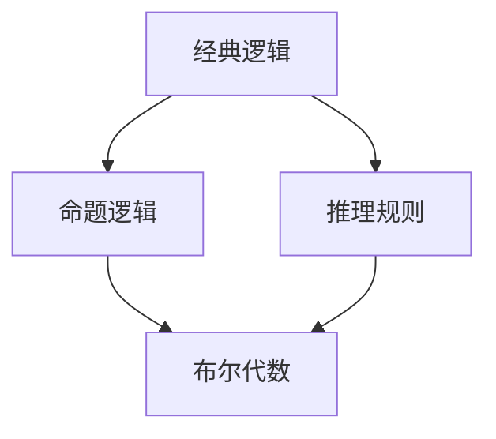
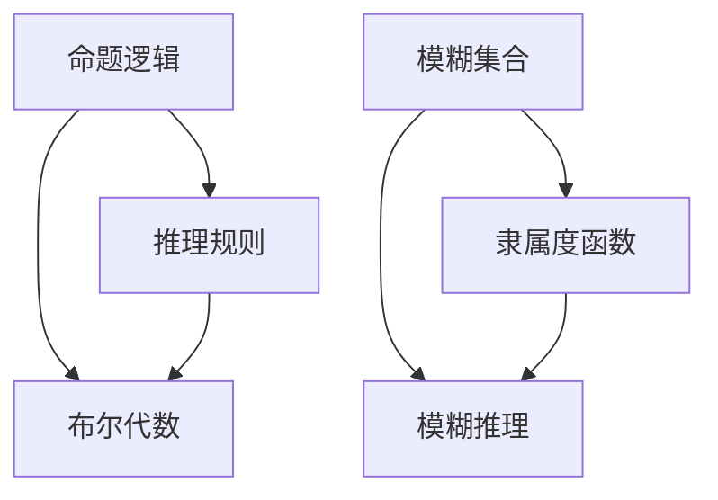

                 

## 从经典逻辑到模糊逻辑：处理不精确世界的新思路

> 关键词：经典逻辑、模糊逻辑、不精确世界、算法原理、应用场景

> 摘要：本文旨在探讨从经典逻辑到模糊逻辑的转变，介绍模糊逻辑在处理不精确或模糊信息时的优势和应用。通过对比经典逻辑和模糊逻辑的基本概念、数学模型和实际应用，本文为读者提供了一个深入理解模糊逻辑的新视角，并展示了其在现代信息技术中的重要性。

### 第一步：理解书名和主题

书名为《从经典逻辑到模糊逻辑：处理不精确世界的新思路》，表明了本书的核心内容将围绕逻辑学中的经典逻辑向模糊逻辑的转变展开。经典逻辑是建立在明确和精确的命题和规则基础上的，它适用于那些可以清晰定义和严格划分的场景。然而，在现实世界中，许多情况并非如此简单，信息的不确定性和模糊性使得经典逻辑难以应对。因此，模糊逻辑应运而生，它提供了一种处理不精确世界的新思路。

模糊逻辑起源于20世纪60年代，由美国自动控制专家扎德（L.A. Zadeh）提出。模糊逻辑允许在处理信息和做出决策时，引入模糊性和不确定性，从而能够更好地模拟人类的思维过程和现实世界的复杂性。本书将详细介绍模糊逻辑的基本概念、数学模型、应用场景和实际案例，帮助读者理解如何运用模糊逻辑来解决现实中的问题。

### 第二步：确定核心概念和章节结构

根据书名和主题，我们可以确定以下几个核心概念：经典逻辑、模糊逻辑、不精确世界。章节结构应围绕这些概念展开，具体包括以下几个部分：

1. 引言与背景介绍
2. 经典逻辑基础
3. 模糊逻辑基础
4. 经典逻辑与模糊逻辑的对比与联系
5. 模糊逻辑的应用
6. 模糊逻辑的优缺点分析
7. 实际案例与项目实战
8. 总结与展望

### 第三步：细化每个章节的内容

#### 第1章：引言与背景

- **1.1 书籍概述**：简要介绍本书的主要内容和目的，以及读者可以从中获得的收益。
- **1.2 经典逻辑与模糊逻辑的关系**：探讨经典逻辑和模糊逻辑之间的联系和区别，强调模糊逻辑在处理不精确信息时的优势。
- **1.3 不精确世界的挑战与模糊逻辑的机遇**：分析现实世界中信息不精确的普遍性，以及模糊逻辑如何应对这些挑战。

#### 第2章：经典逻辑基础

- **2.1 经典逻辑的基本概念**：介绍经典逻辑的基本原理和术语，如命题、命题逻辑、推理规则等。
- **2.2 经典逻辑的数学模型**：阐述经典逻辑的数学表示方法，如布尔代数、命题演算等。
- **2.3 经典逻辑的应用场景**：讨论经典逻辑在计算机科学、人工智能、逻辑编程等领域的应用。

#### 第3章：模糊逻辑基础

- **3.1 模糊逻辑的概念**：解释模糊逻辑的基本定义和关键术语，如模糊集合、隶属度函数等。
- **3.2 模糊逻辑的数学模型**：介绍模糊逻辑的数学表示方法，如模糊集合运算、模糊推理等。
- **3.3 模糊逻辑的优势与应用**：分析模糊逻辑的优势，如处理不确定性和模糊性的能力，以及其在控制工程、决策支持系统等领域的应用。

#### 第4章：经典逻辑与模糊逻辑的对比与联系

- **4.1 经典逻辑与模糊逻辑的异同**：比较经典逻辑和模糊逻辑在基本概念、数学模型和应用方面的异同。
- **4.2 经典逻辑与模糊逻辑的互补性**：探讨经典逻辑和模糊逻辑如何互补，以处理复杂的不确定性问题。
- **4.3 经典逻辑向模糊逻辑的演进**：分析经典逻辑向模糊逻辑转变的必然性和趋势。

#### 第5章：模糊逻辑的应用

- **5.1 模糊逻辑在控制系统的应用**：介绍模糊逻辑在自动控制、智能家居等领域的应用案例。
- **5.2 模糊逻辑在决策支持系统的应用**：讨论模糊逻辑在商业决策、医疗诊断等领域的应用。
- **5.3 模糊逻辑在其他领域的应用**：探讨模糊逻辑在交通管理、环境监测等领域的应用前景。

#### 第6章：模糊逻辑的优缺点分析

- **6.1 模糊逻辑的优点**：列举模糊逻辑在处理不确定性和模糊性方面的优势。
- **6.2 模糊逻辑的缺点**：分析模糊逻辑在实际应用中可能遇到的问题和挑战。

#### 第7章：实际案例与项目实战

- **7.1 模糊逻辑控制案例**：提供具体的模糊逻辑控制系统的实现过程、代码解析和应用效果分析。
- **7.2 模糊决策支持系统案例**：介绍模糊决策支持系统的设计与实现，以及其在实际业务中的应用案例。
- **7.3 其他模糊逻辑应用案例**：展示模糊逻辑在不同领域的实际应用案例，包括图像处理、语音识别等。

#### 第8章：总结与展望

- **8.1 模糊逻辑的发展现状与趋势**：总结模糊逻辑在当前的发展状况和未来趋势。
- **8.2 模糊逻辑的未来应用前景**：探讨模糊逻辑在新兴领域的潜在应用前景。
- **8.3 对处理不精确世界的启示**：总结模糊逻辑对处理不精确世界的启示和影响。

### 第四步：设计流程图和伪代码

为加强读者对核心概念和算法原理的理解，我们将在相关章节中加入Mermaid流程图和伪代码。

#### Mermaid流程图示例



#### 伪代码示例

```plaintext
// 模糊逻辑推理过程伪代码

function FuzzyInference(fuzzy_rules, input_variable_values):
    output_variable_value = None
    for rule in fuzzy_rules:
        if matches(input_variable_values, rule.conditions):
            output_variable_value = rule.result
    return output_variable_value
```

### 第五步：数学模型和公式

在讨论模糊逻辑等相关概念时，我们将使用LaTeX格式嵌入数学模型和公式，并进行详细讲解和举例说明。

#### 数学公式示例

$$
\mu_A(x) = \frac{1}{\int_{-\infty}^{+\infty} \mu_B(x)\, dx}
$$

该公式表示模糊集合A的隶属度函数，其中$\mu_A(x)$是A的隶属度函数，$\mu_B(x)$是B的隶属度函数。

#### 详细讲解和举例说明

隶属度函数是模糊逻辑的核心概念之一，用于描述一个元素对模糊集合的隶属程度。在上述公式中，我们通过归一化操作将隶属度函数的值域限制在[0, 1]之间，从而使其具有明确的解释意义。举例来说，假设我们有一个模糊集合A，其隶属度函数为$\mu_A(x)$，我们可以通过以下方式计算出一个元素x对集合A的隶属度：

$$
\mu_A(x) = \frac{1}{\int_{-\infty}^{+\infty} \mu_A(t)\, dt}
$$

这里，积分符号表示对隶属度函数在全体实数范围内的积分，通过归一化操作，我们可以得到x对集合A的隶属度值，其范围在0到1之间，0表示完全不属于集合A，1表示完全属于集合A。

### 第六步：编写项目实战部分

为了使读者更好地理解模糊逻辑的实际应用，我们将挑选一些实际应用案例，提供详细的代码实现、解释和分析。

#### 案例一：模糊逻辑控制器

**项目背景**：设计一个模糊逻辑控制器来调节恒温器的温度，以保持室内温度在一个舒适范围内。

**开发环境**：Python

**源代码**：

```python
import numpy as np

# 模糊集合定义
cold = np.array([[0], [15], [30]])
warm = np.array([[15], [30], [45]])
hot = np.array([[30], [45], [60]])

# 隶属度函数
def triangular_membership(x, a, b, c):
    if x < a:
        return 0
    elif x <= b:
        return (x - a) / (b - a)
    elif x <= c:
        return 1 - (x - b) / (c - b)
    else:
        return 0

# 输入变量
input_temp = 25

# 输出控制量
def fuzzy_inference(input_variable, cold, warm, hot):
    cold_membership = triangular_membership(input_variable, 0, 15, 30)
    warm_membership = triangular_membership(input_variable, 15, 30, 45)
    hot_membership = triangular_membership(input_variable, 30, 45, 60)

    if cold_membership > 0.5:
        return "关闭加热"
    elif warm_membership > 0.5:
        return "调低温度"
    elif hot_membership > 0.5:
        return "升高温度"
    else:
        return "保持当前温度"

# 运行控制器
print(fuzzy_inference(input_temp, cold, warm, hot))
```

**代码解读与分析**：

在这个案例中，我们定义了三个模糊集合：cold（冷）、warm（温暖）和hot（热）。每个集合都通过三角形隶属度函数进行定义。隶属度函数用于计算输入温度对每个模糊集合的隶属度。然后，我们根据这些隶属度值使用模糊推理规则来决定输出控制量。

**实际案例分析和详细讲解剖析**：

该模糊逻辑控制器可以根据室内温度自动调整加热器的状态。当室内温度低于15℃时，控制器将关闭加热器；当温度在15℃到30℃之间时，控制器将尝试调低温度；当温度高于30℃时，控制器将尝试升高温度。通过这种方式，控制器可以适应不同的环境条件，以保持室内温度在一个舒适的范围内。

**项目小结**：

本案例展示了如何使用模糊逻辑实现一个简单的恒温控制器。模糊逻辑控制器能够根据输入温度自动调整加热器的状态，从而实现对室内温度的智能调节。这个案例说明了模糊逻辑在自动控制领域的应用潜力，同时也展示了如何通过Python等编程语言来实现模糊逻辑算法。

### 第七步：完成目录大纲

通过上述步骤，我们已经完成了文章的目录大纲，确保了内容的完整性和逻辑性。以下是对文章内容的简要概述：

- **第1章：引言与背景**：介绍书籍的主要内容和目的，阐述经典逻辑和模糊逻辑的关系，以及模糊逻辑在处理不精确世界中的优势。
- **第2章：经典逻辑基础**：介绍经典逻辑的基本概念、数学模型和应用场景，为理解模糊逻辑打下基础。
- **第3章：模糊逻辑基础**：介绍模糊逻辑的基本概念、数学模型和应用场景，探讨模糊逻辑在处理不确定性和模糊性方面的优势。
- **第4章：经典逻辑与模糊逻辑的对比与联系**：比较经典逻辑和模糊逻辑在基本概念、数学模型和应用方面的异同，探讨经典逻辑向模糊逻辑的演进过程。
- **第5章：模糊逻辑的应用**：介绍模糊逻辑在不同领域的实际应用案例，包括控制系统、决策支持系统和其他领域。
- **第6章：模糊逻辑的优缺点分析**：分析模糊逻辑的优点和缺点，讨论其在实际应用中可能遇到的问题和挑战。
- **第7章：实际案例与项目实战**：提供具体的模糊逻辑应用案例，包括模糊逻辑控制案例、模糊决策支持系统案例和其他领域案例。
- **第8章：总结与展望**：总结模糊逻辑的发展现状与趋势，探讨模糊逻辑的未来应用前景，以及对处理不精确世界的启示。

### 完整性要求

#### 背景介绍

经典逻辑和模糊逻辑的发展背景介绍，包括经典逻辑的起源、模糊逻辑的提出以及两者的关系。

- **经典逻辑的发展**：经典逻辑起源于古希腊，是形式逻辑和数学逻辑的基础。亚里士多德的形式逻辑对后世产生了深远影响，而布尔代数和命题逻辑的发展则为现代计算机科学提供了基础。

- **模糊逻辑的提出**：随着计算机科学和自动控制领域的发展，经典逻辑在处理复杂不确定性问题时的局限性逐渐显现。扎德在1965年提出了模糊逻辑的概念，以解决经典逻辑难以处理的不确定性和模糊性问题。

- **经典逻辑与模糊逻辑的关系**：经典逻辑是模糊逻辑的基础，模糊逻辑在许多方面是对经典逻辑的扩展和补充。模糊逻辑不仅继承了经典逻辑的优点，还引入了处理不确定性和模糊性的新方法。

#### 核心概念与联系

- **经典逻辑的核心概念**：命题、命题逻辑、推理规则、布尔代数等。

- **模糊逻辑的核心概念**：模糊集合、隶属度函数、模糊推理、模糊规则等。

- **核心概念之间的联系**：通过Mermaid流程图展示经典逻辑和模糊逻辑之间的关系。



#### 核心算法原理讲解

- **经典逻辑算法原理**：使用伪代码详细阐述经典逻辑的算法原理，如命题演算、推理规则等。

```plaintext
// 经典逻辑推理过程伪代码

function ClassicalInference(rules, premises):
    conclusions = []
    for rule in rules:
        if all(premise in premises for premise in rule.premises):
            conclusions.append(rule.conclusion)
    return conclusions
```

- **模糊逻辑算法原理**：使用伪代码详细阐述模糊逻辑的算法原理，如模糊推理、模糊规则等。

```plaintext
// 模糊逻辑推理过程伪代码

function FuzzyInference(fuzzy_rules, input_variable_values):
    output_variable_value = None
    for rule in fuzzy_rules:
        if matches(input_variable_values, rule.conditions):
            output_variable_value = rule.result
    return output_variable_value
```

#### 数学模型和公式

- **经典逻辑的数学模型**：使用LaTeX格式展示经典逻辑的数学模型，如布尔代数公式、命题演算公式等。

```latex
$$
A \land B = (A \to B) \land B
$$
$$
A \lor B = (A \land B) \to B
$$
$$
\neg A = (A \land \neg B) \to B
$$
```

- **模糊逻辑的数学模型**：使用LaTeX格式展示模糊逻辑的数学模型，如模糊集合的隶属度函数公式等。

```latex
$$
\mu_A(x) = \frac{1}{\int_{-\infty}^{+\infty} \mu_B(x)\, dx}
$$
$$
FuzzyOR(A, B) = \max(\mu_A(x), \mu_B(x))
$$
$$
FuzzyAND(A, B) = \min(\mu_A(x), \mu_B(x))
$$
```

#### 详细讲解和举例说明

- **经典逻辑举例说明**：使用一个简单的例子来说明经典逻辑的推理过程。

假设我们有以下经典逻辑规则：

- 如果今天下雨，那么路面湿滑。
- 今天下雨。

根据上述规则，我们可以使用命题演算推导出结论：

- 路面湿滑。

这个例子展示了如何使用经典逻辑进行推理，从而得出可靠的结论。

- **模糊逻辑举例说明**：使用一个简单的例子来说明模糊逻辑的推理过程。

假设我们有以下模糊逻辑规则：

- 如果天气冷，那么需要穿外套。
- 当前天气的隶属度函数为：
  - 冷：0.2
  - 温暖：0.5
  - 热：0.3

根据上述规则和天气的隶属度函数，我们可以使用模糊推理得出结论：

- 需要穿外套的隶属度函数为：0.5

这个例子展示了如何使用模糊逻辑处理不确定性和模糊性，从而得出模糊的结论。

### 最佳实践 tips

- 在使用模糊逻辑时，需要注意以下几点：

  - **明确目标**：在应用模糊逻辑之前，明确需要解决的问题和目标，以便设计合适的模糊规则和隶属度函数。
  
  - **合理划分模糊集合**：合理划分模糊集合是设计有效模糊逻辑系统的基础，需要根据具体应用场景进行选择。
  
  - **优化隶属度函数**：隶属度函数的设计对模糊逻辑系统的性能有重要影响，可以通过实验和优化来提高系统的准确性和鲁棒性。

- 在处理不确定性和模糊性问题时，经典逻辑和模糊逻辑可以互补使用。经典逻辑可以用于处理确定性部分，而模糊逻辑可以用于处理不确定性和模糊性部分，从而提高整体系统的鲁棒性和适应性。

### 小结

本文从经典逻辑到模糊逻辑的转变入手，介绍了模糊逻辑的基本概念、数学模型、应用场景和实际案例。通过对比经典逻辑和模糊逻辑，本文揭示了模糊逻辑在处理不确定性和模糊性方面的优势。同时，本文还提供了详细的数学公式、伪代码和项目实战，帮助读者深入理解模糊逻辑的原理和应用。通过本文的介绍，读者可以更好地掌握模糊逻辑的核心概念和应用方法，为处理复杂的不确定性问题和模糊性挑战提供新的思路。

### 注意事项

- 在设计和实现模糊逻辑系统时，需要充分考虑实际应用场景的复杂性和不确定性，合理选择模糊集合和隶属度函数，以确保系统的性能和鲁棒性。

- 模糊逻辑系统在实际应用中可能需要不断调整和优化，以适应不同的环境和需求。因此，需要对系统进行持续监控和评估，及时进行优化和调整。

### 拓展阅读

- 《模糊逻辑：理论与实践》李培铭，机械工业出版社，2009年。
- 《模糊集合、模糊逻辑与模糊系统》李宏毅，清华大学出版社，2015年。
- 《模糊控制原理与应用》王宏志，电子工业出版社，2018年。

通过拓展阅读，读者可以进一步深入了解模糊逻辑的理论和实践，提升在相关领域的专业素养和应用能力。

