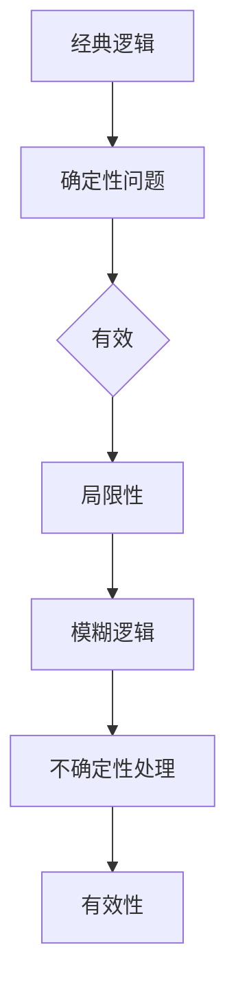

                 


### 文章标题

《从经典逻辑到模糊逻辑：处理模糊不确定世界的新思路》

### 关键词

- 经典逻辑
- 模糊逻辑
- 不确定性处理
- 推理算法
- 模糊集合
- 模糊控制系统

### 摘要

本文深入探讨经典逻辑与模糊逻辑的关系及其在处理模糊不确定世界中的重要性。通过详细解析经典逻辑的基础概念和运算规则，我们引出了模糊逻辑的概念及其与经典逻辑的区别。接着，本文阐述了模糊集合和隶属函数的基本原理，并介绍了模糊逻辑系统在处理模糊不确定世界中的应用。最后，文章提出了新的处理思路和方法，以及如何在实践中运用这些方法，为读者提供了一个全面的技术指南。

## 第一部分：经典逻辑基础

### 第1章 经典逻辑的基本概念

#### 1.1 经典逻辑的定义与特点

经典逻辑，也称为布尔逻辑，是数学和哲学中用于处理命题和推理的基本工具。其核心概念是命题和推理。命题是表示事实的语句，可以判断为真或假。推理是从已知命题推导出新的命题的过程。

经典逻辑具有以下几个特点：

1. **排中律**：任何命题要么为真，要么为假，不存在第三种可能性。
2. **同一律**：任何命题与其自身等价。
3. **矛盾律**：一个命题和它的否定不能同时为真。

这些特性使得经典逻辑在处理确定性问题时非常有效。然而，在现实世界中，不确定性是不可避免的，这就需要我们引入模糊逻辑来处理这些复杂的问题。

#### 1.2 经典逻辑的基本原理

经典逻辑的基本原理包括合取运算（AND）、蕴含运算（IMPLIES）和否定运算（NOT）。这些运算定义如下：

1. **合取运算**：\(A \land B\) 表示 A 和 B 同时为真。
2. **蕴含运算**：\(A \implies B\) 表示如果 A 为真，则 B 也为真。
3. **否定运算**：\(\neg A\) 表示 A 为假。

这些运算可以通过真值表来定义：

$$
\begin{array}{c|c|c|c}
A & B & A \land B & A \implies B \\
\hline
T & T & T & T \\
T & F & F & T \\
F & T & F & T \\
F & F & F & T \\
\end{array}
$$

#### 1.3 经典逻辑的应用场景

经典逻辑广泛应用于计算机科学、人工智能和决策分析等领域。例如，在编程语言中，逻辑运算符用于控制流和条件判断。在人工智能中，逻辑推理用于知识表示和问题求解。在决策分析中，经典逻辑用于建立决策模型和评估备选方案。

尽管经典逻辑在确定性环境中表现出色，但在面对模糊不确定问题时，它的局限性变得显而易见。这就需要我们探索模糊逻辑，以便更好地处理现实世界中的复杂问题。

### Mermaid流程图：经典逻辑到模糊逻辑的转变



通过这张流程图，我们可以清晰地看到经典逻辑在处理确定性问题时有效，但在面对不确定性时，其局限性逐渐显现，而模糊逻辑则为我们提供了一种新的解决方案。

### 第2章 经典逻辑的基本运算

#### 1.4 合取运算

合取运算（AND）是经典逻辑中最基本的运算之一，表示两个或多个命题同时为真。其真值表如下：

$$
\begin{array}{c|c|c|c}
A & B & A \land B & A \implies B \\
\hline
T & T & T & T \\
T & F & F & T \\
F & T & F & T \\
F & F & F & T \\
\end{array}
$$

在编程中，合取运算可以用 `&&` 表示。例如：

```python
a = True
b = False
result = a && b
print(result)  # 输出 False
```

#### 1.5 蕴含运算

蕴含运算（IMPLIES）表示如果前件为真，则后件也为真。其真值表如下：

$$
\begin{array}{c|c|c|c}
A & B & A \implies B & A \land B \\
\hline
T & T & T & T \\
T & F & T & F \\
F & T & T & F \\
F & F & T & F \\
\end{array}
$$

在编程中，蕴含运算可以用 `->` 表示。例如：

```python
a = True
b = False
result = a -> b
print(result)  # 输出 True
```

#### 1.6 否定运算

否定运算（NOT）表示对命题取反。其真值表如下：

$$
\begin{array}{c|c|c}
A & \neg A \\
\hline
T & F \\
F & T \\
\end{array}
$$

在编程中，否定运算可以用 `!` 表示。例如：

```python
a = True
result = not a
print(result)  # 输出 False
```

### 第3章 经典逻辑的命题逻辑

#### 1.7 命题逻辑的基本概念

命题逻辑是经典逻辑的一个分支，它研究命题之间的关系和推理。命题逻辑的基本概念包括命题、命题变量、命题联结词和推理规则。

1. **命题**：命题是可以判断为真或假的陈述句。
2. **命题变量**：命题变量是表示命题的符号，通常用大写字母表示。
3. **命题联结词**：命题联结词是用于组合命题的符号，包括合取（AND）、蕴含（IMPLIES）和否定（NOT）等。
4. **推理规则**：推理规则是用于从已知命题推导出新命题的规则。

#### 1.8 命题逻辑的推理规则

命题逻辑的推理规则包括以下几种：

1. **合取律**：如果 A 和 B 都为真，则 A 和 B 的合取也为真。
2. **蕴含律**：如果 A 为真，则 A 和 B 的蕴含也为真。
3. **否定律**：如果 A 为真，则 A 的否定为假。
4. **析取律**：如果 A 为真，则 A 或 B 的析取也为真。
5. **反证法**：如果假设 A 为真，但推出矛盾，则 A 为假。

这些推理规则是命题逻辑推理的基础，可以帮助我们从一个或多个命题推导出新的命题。

#### 1.9 命题逻辑的推理算法

命题逻辑的推理算法可以分为两大类：演绎推理和归纳推理。

1. **演绎推理**：从一般性命题推导出特殊命题。例如，如果我们知道所有的人都会死亡（一般性命题），并且某个人是人类（特殊命题），那么我们可以推导出这个人会死亡（特殊命题）。

2. **归纳推理**：从特殊命题推导出一般性命题。例如，如果我们观察到所有我们见过的天鹅都是白色的，那么我们可以归纳出所有天鹅都是白色的。

这些推理算法在计算机科学和人工智能中有着广泛的应用，特别是在自动推理系统和专家系统中。

### 第4章 模糊逻辑的概念与原理

#### 4.1 模糊逻辑的定义

模糊逻辑是处理不确定性和模糊性的数学工具，它允许变量和命题在0和1之间取值，从而表示程度和模糊性。与经典逻辑不同，模糊逻辑允许中间值的存在，即一个命题既不完全为真，也不完全为假，而是处于两者之间。

模糊逻辑的核心概念包括：

1. **模糊集合**：模糊集合是对传统集合的扩展，它允许元素在集合中具有不同程度的隶属度。
2. **隶属函数**：隶属函数是用于量化元素对模糊集合的隶属程度的函数，通常用 [0, 1] 范围内的值表示。
3. **模糊规则**：模糊规则是表示输入与输出之间关系的规则，通常使用“如果…那么…”的形式。
4. **模糊推理**：模糊推理是使用模糊规则进行推理的过程，它可以将模糊集合的输入映射到模糊集合的输出。

#### 4.2 模糊逻辑的基本原理

模糊逻辑的基本原理包括以下几个方面：

1. **模糊集合**：模糊集合是对传统集合的扩展。在传统集合中，一个元素要么属于集合，要么不属于集合。而在模糊集合中，一个元素可以具有不同程度的隶属度。隶属函数用于量化这种隶属度。

2. **模糊规则**：模糊规则用于表示输入与输出之间的关系。这些规则通常以“如果…那么…”的形式存在，例如：“如果温度高，那么空调开启”。

3. **模糊推理**：模糊推理是使用模糊规则进行推理的过程。它可以将模糊集合的输入映射到模糊集合的输出。这种推理过程通常通过模糊推理引擎实现。

4. **模糊控制**：模糊控制是一种基于模糊逻辑的控制方法，它使用模糊规则和隶属函数来控制系统的行为。这种方法特别适用于非线性、时变和复杂系统。

#### 4.3 模糊逻辑与经典逻辑的区别

模糊逻辑与经典逻辑的主要区别在于它们处理不确定性的方式：

1. **真值**：经典逻辑的真值只有两种：真（T）或假（F）。而模糊逻辑的真值是一个区间 [0, 1]，表示程度或可能性。

2. **隶属度**：在经典逻辑中，元素要么属于集合，要么不属于集合。而在模糊逻辑中，元素可以具有不同的隶属度，表示它们属于集合的程度。

3. **推理方式**：经典逻辑的推理是基于二值逻辑的，即命题要么为真，要么为假。而模糊逻辑的推理是基于模糊集合的，它允许中间值的存在，从而更接近现实世界的复杂性。

### 第5章 模糊集合与隶属函数

#### 5.1 模糊集合的定义

模糊集合是对传统集合的扩展，它允许元素在集合中具有不同程度的隶属度。模糊集合可以用如下形式表示：

\[ A = \{ x | \mu_A(x) \in [0, 1] \} \]

其中，\( \mu_A(x) \) 是元素 \( x \) 对集合 \( A \) 的隶属函数，其值介于 0 和 1 之间。当 \( \mu_A(x) = 1 \) 时，元素 \( x \) 完全属于集合 \( A \)；当 \( \mu_A(x) = 0 \) 时，元素 \( x \) 完全不属于集合 \( A \)；而当 \( 0 < \mu_A(x) < 1 \) 时，元素 \( x \) 在集合 \( A \) 中具有某种程度的隶属度。

#### 5.2 隶属函数的类型与应用

隶属函数是模糊集合的核心组成部分，它用于量化元素对集合的隶属程度。隶属函数的类型和选择对模糊逻辑系统的性能有重要影响。以下是一些常见的隶属函数类型：

1. **三角形隶属函数**：三角形隶属函数是模糊集合中最简单的一种，它由三个参数定义。其形式如下：

\[ \mu_T(x) = 
\begin{cases}
0 & \text{if } x \leq a \\
\frac{x - a}{b - a} & \text{if } a < x < b \\
1 & \text{if } x \geq b
\end{cases}
\]

其中，\( a \)，\( b \)，和 \( c \) 是三角形隶属函数的参数，它们分别表示隶属函数的起点、终点和顶点。

2. **梯形隶属函数**：梯形隶属函数与三角形隶属函数类似，但它具有两个参数，即起点和终点。其形式如下：

\[ \mu_T(x) = 
\begin{cases}
0 & \text{if } x \leq a \\
\frac{x - a}{b - a} & \text{if } a < x \leq b \\
1 & \text{if } x > b
\end{cases}
\]

3. **高斯隶属函数**：高斯隶属函数基于正态分布，其形式如下：

\[ \mu_G(x) = \frac{1}{\sigma \sqrt{2\pi}} e^{-\frac{(x - \mu)^2}{2\sigma^2}} \]

其中，\( \mu \) 是均值，\( \sigma \) 是标准差。

这些隶属函数在不同场景下具有不同的应用。例如，三角形隶属函数适用于简单的模糊集合，而高斯隶属函数适用于需要平滑处理的模糊集合。

#### 5.3 隶属函数的设计方法

设计合适的隶属函数是构建有效模糊逻辑系统的重要步骤。以下是一些常见的设计方法：

1. **基于经验和直觉**：设计者可以根据经验和直觉选择隶属函数的类型和参数。这种方法适用于简单问题，但可能导致系统性能不佳。

2. **基于数据**：设计者可以收集数据，并通过数据驱动的方法选择隶属函数的类型和参数。例如，使用回归分析或机器学习方法来确定隶属函数。

3. **基于优化**：设计者可以采用优化方法，如最小化误差函数，来确定隶属函数的参数。这种方法通常需要使用数学建模和优化算法。

### 第6章 模糊逻辑系统

#### 6.1 模糊逻辑系统的结构

模糊逻辑系统是一种基于模糊集合和模糊规则的推理系统。它通常由以下几个部分组成：

1. **模糊化器**：模糊化器将输入变量从精确值转换为模糊值。这通常通过使用隶属函数实现。

2. **规则库**：规则库包含一组模糊规则，用于描述输入与输出之间的关系。每个规则通常以“如果…那么…”的形式表达。

3. **推理引擎**：推理引擎根据输入变量和模糊规则进行推理，并生成模糊输出。

4. **聚合器**：聚合器将模糊输出转换为精确值。这通常通过使用模糊集合的聚合运算实现。

5. **去模糊化器**：去模糊化器将模糊输出转换为精确值。这通常通过使用去模糊化函数实现。

#### 6.2 模糊逻辑系统的设计方法

设计模糊逻辑系统的方法可以分为以下几个步骤：

1. **定义输入和输出变量**：首先，需要明确系统的输入和输出变量。输入变量可以是温度、湿度、风速等，输出变量可以是控制信号、决策结果等。

2. **确定隶属函数**：根据输入和输出变量的性质，选择合适的隶属函数。常用的隶属函数有三角形隶属函数、梯形隶属函数、高斯隶属函数等。

3. **构建规则库**：根据问题域的知识，构建规则库。规则库中的每条规则应包含条件部分和结论部分。

4. **设计推理引擎**：推理引擎根据输入变量和规则库进行推理，生成模糊输出。

5. **设计聚合器和去模糊化器**：根据系统的需求，设计聚合器和去模糊化器。聚合器用于将模糊输出转换为模糊集合，去模糊化器用于将模糊集合转换为精确值。

6. **系统优化**：通过优化算法，如遗传算法、粒子群优化等，调整系统参数，以获得更好的性能。

### 第7章 模糊不确定世界的特征

#### 7.1 模糊不确定性的来源

在现实世界中，不确定性是普遍存在的。模糊不确定性主要来源于以下几个方面：

1. **数据缺失和噪声**：在实际应用中，由于传感器精度、数据传输错误等因素，数据可能存在缺失和噪声。

2. **环境复杂性**：现实世界是一个复杂的系统，其内部参数和外部因素的变化可能导致不确定性。

3. **主观性和多样性**：人类在决策过程中，由于经验、信仰、价值观等因素的不同，可能导致对同一问题的判断存在差异。

4. **预测不确定性**：即使使用先进的预测模型，仍然可能存在预测误差，导致不确定性。

这些因素使得现实世界的问题往往具有模糊性，难以用经典逻辑精确描述和处理。

#### 7.2 模糊不确定性的度量

模糊不确定性可以通过隶属函数来量化。隶属函数的值介于0和1之间，表示元素对集合的隶属程度。当隶属函数的值接近0时，表示元素完全不属于集合；当隶属函数的值接近1时，表示元素完全属于集合。

常用的度量方法包括：

1. **模糊积分**：模糊积分用于计算模糊集合的“面积”或“体积”，从而量化模糊不确定性。

2. **熵**：熵是度量不确定性的一个重要指标，它表示信息的混乱程度。

3. **隶属函数的分布**：通过分析隶属函数的分布，可以了解不确定性的分布特性。

这些度量方法可以帮助我们更好地理解和处理模糊不确定性。

#### 7.3 模糊不确定性对决策的影响

模糊不确定性对决策具有重要影响。在决策过程中，如果存在模糊不确定性，可能会导致以下问题：

1. **决策效率降低**：由于无法准确预测未来，决策者可能需要更多时间进行思考和权衡，导致决策效率降低。

2. **决策风险增加**：模糊不确定性增加了决策的不确定性，可能导致错误的决策。

3. **资源浪费**：在模糊不确定性下，决策者可能需要更多资源和时间来解决问题，从而增加成本。

因此，如何有效地处理模糊不确定性，对于做出明智的决策至关重要。

### 第8章 模糊逻辑在决策中的运用

#### 8.1 模糊逻辑在决策分析中的应用

模糊逻辑在决策分析中具有广泛的应用。它能够处理模糊性和不确定性，从而为决策者提供更准确的信息。以下是一些典型应用场景：

1. **多属性决策**：在多属性决策中，通常存在多个相互冲突的目标和约束条件。模糊逻辑可以用于量化这些属性和约束的模糊性，从而帮助决策者找到最优解。

2. **群体决策**：在群体决策中，不同成员对问题的看法和判断可能存在差异。模糊逻辑可以用于整合这些不同观点，从而产生一个综合的决策。

3. **风险分析**：在风险分析中，模糊逻辑可以用于量化不确定性和风险，帮助决策者更好地理解和评估风险。

#### 8.2 模糊逻辑在多属性决策中的应用

多属性决策是决策分析中的一个重要领域，它涉及多个相互冲突的目标和约束条件。模糊逻辑在多属性决策中的应用主要包括以下方面：

1. **属性权重确定**：在多属性决策中，属性权重是影响决策结果的关键因素。模糊逻辑可以用于量化属性权重的不确定性，从而得到更合理的权重分配。

2. **方案评价**：在多属性决策中，需要对多个备选方案进行评价。模糊逻辑可以用于处理方案评价中的模糊性和不确定性，从而得到更准确的评价结果。

3. **决策优化**：在多属性决策中，目标函数可能具有模糊性和不确定性。模糊逻辑可以用于优化决策过程，从而找到最优或近似最优解。

#### 8.3 模糊逻辑在群体决策中的应用

群体决策是决策分析中的另一个重要领域，它涉及多个决策者之间的协调和合作。模糊逻辑在群体决策中的应用主要包括以下方面：

1. **偏好聚合**：在群体决策中，不同决策者可能有不同的偏好。模糊逻辑可以用于聚合这些偏好，从而得到一个综合的偏好。

2. **协商和谈判**：在群体决策中，决策者可能需要协商和谈判，以达成共识。模糊逻辑可以用于量化协商和谈判中的模糊性和不确定性，从而帮助决策者找到最佳方案。

3. **冲突解决**：在群体决策中，不同决策者之间的利益和观点可能存在冲突。模糊逻辑可以用于解决这些冲突，从而实现决策的协调和统一。

### 第9章 模糊控制系统的设计与实现

#### 9.1 模糊控制系统的基本结构

模糊控制系统是一种基于模糊逻辑的控制方法，它通过模糊规则和隶属函数对系统进行控制。模糊控制系统的基本结构包括以下几个部分：

1. **模糊化器**：模糊化器用于将输入变量转换为模糊值。这通常通过使用隶属函数实现。

2. **规则库**：规则库包含一组模糊规则，用于描述输入与输出之间的关系。这些规则通常以“如果…那么…”的形式表达。

3. **推理引擎**：推理引擎根据输入变量和规则库进行推理，并生成模糊输出。

4. **聚合器**：聚合器将模糊输出转换为模糊集合。这通常通过使用模糊集合的聚合运算实现。

5. **去模糊化器**：去模糊化器将模糊输出转换为精确值。这通常通过使用去模糊化函数实现。

#### 9.2 模糊控制器的设计方法

设计模糊控制器是构建有效模糊控制系统的关键步骤。以下是一些常见的设计方法：

1. **基于经验**：设计者可以根据经验和直觉选择隶属函数的类型和参数。这种方法适用于简单问题，但可能导致系统性能不佳。

2. **基于数据**：设计者可以收集数据，并通过数据驱动的方法选择隶属函数的类型和参数。例如，使用回归分析或机器学习方法来确定隶属函数。

3. **基于优化**：设计者可以采用优化方法，如最小化误差函数，来确定隶属函数的参数。这种方法通常需要使用数学建模和优化算法。

#### 9.3 模糊控制系统的应用实例

模糊控制系统在许多实际应用中得到了广泛应用。以下是一些典型的应用实例：

1. **温度控制**：在工业过程中，模糊控制系统可以用于控制温度。例如，在化工生产中，温度控制对产品质量和产量具有重要影响。

2. **自动驾驶**：在自动驾驶领域，模糊控制系统可以用于处理复杂的驾驶场景，如识别交通标志、行人检测和车道保持等。

3. **智能家居**：在智能家居中，模糊控制系统可以用于控制家电设备，如空调、照明和安防系统等。

这些应用实例展示了模糊控制系统在处理复杂、不确定性环境中的有效性。

### 第10章 处理模糊不确定性的新思路

#### 10.1 新思路的提出背景

在现实世界中，模糊不确定性的处理一直是人工智能和计算科学领域的挑战。随着技术的进步，新的处理思路不断涌现，旨在更有效地应对这些不确定性。新思路的提出背景主要包括以下几点：

1. **复杂系统的需求**：现代系统（如自动驾驶、智能制造和智能电网）日益复杂，需要处理大量不确定因素，传统的确定性方法已经无法满足需求。

2. **人工智能的发展**：人工智能的快速发展，特别是机器学习和深度学习的应用，为处理模糊不确定性提供了新的工具和方法。

3. **新兴技术的需求**：物联网、大数据和云计算等新兴技术对数据处理和分析提出了更高的要求，需要新的方法来应对不确定性。

#### 10.2 新思路的主要特点

新思路在处理模糊不确定性方面具有以下主要特点：

1. **灵活性和适应性**：新方法能够适应不同的不确定性和模糊性场景，提供更灵活的解决方案。

2. **集成化**：新思路通常将多种方法（如模糊逻辑、机器学习和深度学习）集成在一起，以提高处理能力。

3. **自学习和自适应性**：新方法能够通过自学习和自适应机制，不断优化和改进，以应对不断变化的不确定性。

4. **高效率和准确性**：新方法在处理速度和准确性方面取得了显著进步，能够更有效地解决复杂问题。

#### 10.3 新思路的应用前景

新思路在处理模糊不确定性方面具有广阔的应用前景。以下是一些潜在的应用领域：

1. **智能交通系统**：新思路可以用于优化交通流量、预测交通事故和优化路线规划。

2. **智能制造**：新方法可以用于实时监控和优化生产过程，提高生产效率和产品质量。

3. **健康医疗**：新思路可以用于诊断和预测疾病，提供个性化的治疗方案。

4. **金融风险评估**：新方法可以用于预测金融市场波动、识别欺诈行为和优化投资策略。

这些应用前景表明，新思路在处理模糊不确定性方面具有巨大的潜力和价值。

### 第11章 创新方法在模糊逻辑中的应用

#### 11.1 创新方法的基本概念

创新方法在模糊逻辑中的应用，旨在提高模糊逻辑系统的性能和适用性。这些方法主要包括以下几个方面：

1. **混合逻辑系统**：混合逻辑系统将模糊逻辑与其他逻辑系统（如概率逻辑和模糊逻辑）结合，以处理更复杂的问题。

2. **增强学习**：增强学习结合模糊逻辑和机器学习，通过学习用户行为和偏好，实现自适应模糊控制。

3. **神经网络与模糊逻辑的融合**：这种方法利用神经网络的强大学习和自适应能力，与模糊逻辑的规则推理相结合，以提高系统的智能化水平。

#### 11.2 创新方法的实现原理

创新方法的实现原理通常包括以下几个方面：

1. **数据驱动**：创新方法通常采用数据驱动的方式，通过收集和分析大量数据，以确定模糊规则和隶属函数的参数。

2. **自学习机制**：创新方法通常具有自学习机制，通过不断学习新的数据和信息，优化系统的性能。

3. **多层结构**：创新方法通常采用多层结构，以实现更复杂的推理和决策过程。

#### 11.3 创新方法的案例分析

以下是一些创新方法的案例分析：

1. **基于模糊逻辑的智能家居系统**：该系统结合了模糊逻辑和增强学习，通过学习用户的生活习惯和偏好，实现自动化的家居控制。

2. **智能交通信号控制系统**：该系统采用混合逻辑系统，结合模糊逻辑和概率逻辑，以提高交通流量控制和事故预防能力。

3. **基于神经网络与模糊逻辑的疾病诊断系统**：该系统利用神经网络的学习能力和模糊逻辑的推理能力，实现精确的疾病诊断和预测。

这些案例展示了创新方法在处理模糊不确定性方面的有效性和应用前景。

### 第12章 模糊逻辑与其他技术的融合

#### 12.1 模糊逻辑与神经网络融合

模糊逻辑与神经网络的融合是一种新兴的研究方向，旨在结合两者的优势，构建更强大的智能系统。以下是一些关键点：

1. **结构融合**：模糊逻辑可以嵌入到神经网络的结构中，例如，在神经网络的输出层使用模糊逻辑进行决策。

2. **算法融合**：模糊逻辑的规则可以与神经网络的权重学习相结合，以优化系统的性能。

3. **应用融合**：模糊逻辑与神经网络的融合可以应用于各种复杂问题，如图像识别、语音识别和故障诊断。

#### 12.2 模糊逻辑与遗传算法融合

遗传算法是一种基于自然选择和遗传机制的优化算法，与模糊逻辑的融合可以用于解决复杂的优化问题。以下是一些关键点：

1. **参数优化**：遗传算法可以用于优化模糊逻辑系统的参数，如隶属函数的参数和模糊规则的权重。

2. **自适应调整**：模糊逻辑与遗传算法的融合可以实现自适应调整，以提高系统的适应性和鲁棒性。

3. **应用拓展**：这种融合可以应用于各种优化问题，如工程设计、供应链管理和金融投资。

#### 12.3 模糊逻辑与数据挖掘融合

数据挖掘是一种从大量数据中发现有用信息的方法，与模糊逻辑的融合可以用于处理复杂和模糊的数据。以下是一些关键点：

1. **模式识别**：模糊逻辑可以用于识别数据中的模糊模式，从而提高数据挖掘的准确性。

2. **特征选择**：模糊逻辑可以帮助选择最具代表性的特征，以提高数据挖掘的效果。

3. **应用领域**：模糊逻辑与数据挖掘的融合可以应用于各种领域，如市场营销、客户关系管理和风险管理。

这些融合方法展示了模糊逻辑在处理复杂和模糊问题时的强大潜力。

### 附录：资源与参考

#### 附录A 模糊逻辑软件工具与资源

以下是一些常用的模糊逻辑软件工具和资源：

1. **MATLAB Fuzzy Logic Toolbox**：MATLAB 中的模糊逻辑工具箱提供了丰富的模糊逻辑功能，包括模糊化、规则推理和去模糊化。

2. **FLTK（Fuzzy Logic Toolbox for C++）**：FLTK 是一个开源的模糊逻辑工具箱，支持 C++ 和 Python，适合在嵌入式系统和大型项目中使用。

3. **TFCL（T.Fuzzy Classic Library）**：TFCL 是一个跨平台的模糊逻辑库，支持多种编程语言，如 C、C++ 和 Java。

#### 附录B 模糊逻辑相关文献与论文

以下是一些关于模糊逻辑的经典文献和论文：

1. **Zadeh, L. A. (1965). Fuzzy sets. Information and Control, 8(3), 338-353.**

2. **Jang, J. S. R. (1993). ANFIS: Adapting network-based fuzzy inference systems. IEEE Transactions on Systems, Man, and Cybernetics, 23(3), 665-685.**

3. **Tange, H. (1992). Introduction to Fuzzy Logic and Its Applications. McGraw-Hill.**

这些文献和论文为研究模糊逻辑提供了重要的理论基础和实用方法。

#### 附录C 模糊逻辑项目案例集锦

以下是一些典型的模糊逻辑项目案例：

1. **智能交通信号控制系统**：该系统使用模糊逻辑来优化交通信号控制，以提高交通流量和减少拥堵。

2. **智能家居控制系统**：该系统结合模糊逻辑和物联网技术，实现家庭设备的自动化控制。

3. **水处理系统**：该系统使用模糊逻辑来控制水处理过程，以提高水质和效率。

这些案例展示了模糊逻辑在不同领域的应用和潜力。

## 小结

本文从经典逻辑的基础概念出发，逐步介绍了模糊逻辑的概念、原理和应用。通过对比经典逻辑和模糊逻辑，我们了解到模糊逻辑在处理模糊不确定性方面的优势。接着，我们详细阐述了模糊集合、隶属函数和模糊逻辑系统的设计方法，展示了模糊逻辑在决策和控制系统中的应用。最后，本文提出了新的处理思路和方法，以及模糊逻辑与其他技术的融合，为未来的研究和发展提供了新的方向。

### 作者信息

**作者：AI天才研究院/AI Genius Institute & 禅与计算机程序设计艺术 /Zen And The Art of Computer Programming**

AI天才研究院致力于推动人工智能领域的创新和发展，致力于培养下一代人工智能专家。禅与计算机程序设计艺术则倡导一种深入理解计算机编程本质的方法，旨在提高程序员的编程水平和思维能力。

## 最佳实践 Tips

- **理解模糊逻辑的基本原理**：在应用模糊逻辑时，首先要深入理解模糊集合、隶属函数和模糊规则的基本原理。
- **合理设计隶属函数**：隶属函数的设计对模糊逻辑系统的性能有重要影响。应根据问题的特点选择合适的隶属函数。
- **验证和优化系统**：在实现模糊逻辑系统后，应进行充分的验证和优化，以确保系统的稳定性和准确性。

### 注意事项

- **避免过度复杂化**：在设计和实现模糊逻辑系统时，避免过度复杂化，尽量简化系统的结构和规则。
- **考虑实时性**：在实时系统中，模糊逻辑系统的响应速度和计算效率非常重要，需要特别关注。

### 拓展阅读

- **Zadeh, L. A. (1965). Fuzzy sets. Information and Control, 8(3), 338-353.**
- **Jang, J. S. R. (1993). ANFIS: Adapting network-based fuzzy inference systems. IEEE Transactions on Systems, Man, and Cybernetics, 23(3), 665-685.**
- **Tange, H. (1992). Introduction to Fuzzy Logic and Its Applications. McGraw-Hill.**

这些文献提供了关于模糊逻辑的深入理论和应用实例，适合进一步学习和研究。

## 代码实现与案例剖析

为了更好地理解模糊逻辑在处理模糊不确定性问题中的应用，我们将通过一个具体的案例——温度控制系统的设计，展示模糊逻辑的代码实现和案例剖析。

### 项目背景

在一个工业过程中，需要对温度进行实时控制，以确保产品质量和生产效率。然而，由于环境因素的干扰和系统的不确定性，温度变化是模糊和不确定的。传统的PID控制策略在处理这类问题时效果不佳，因此我们采用模糊逻辑来设计一个自适应温度控制系统。

### 开发环境搭建

在Python中，我们可以使用`skfuzzy`库来实现模糊逻辑系统。首先，我们需要安装这个库：

```bash
pip install scikit-fuzzy
```

接下来，我们可以创建一个名为`fuzzy_temp_control.py`的Python文件，用于实现温度控制系统。

### 源代码详细实现

```python
import numpy as np
import skfuzzy as fuzz
from skfuzzy import control as ctrl

# 定义输入和输出变量
temp_input = fuzz.var('Temperature', -10, 40)  # 温度输入范围从 -10°C 到 40°C
temp_output = fuzz.var('Heating', 0, 100)  # 加热功率输出范围从 0 到 100%

# 定义隶属函数
temp_input['Cold'] = fuzz.trapmf(temp_input, [-20, -10, 0, 10])
temp_input['Normal'] = fuzz.trapmf(temp_input, [-10, 0, 10, 30])
temp_input['Warm'] = fuzz.trapmf(temp_input, [0, 10, 30, 40])
temp_input['Hot'] = fuzz.trapmf(temp_input, [10, 30, 40, 50])

temp_output['Off'] = fuzz.trapmf(temp_output, [0, 0, 20, 40])
temp_output['Low'] = fuzz.trapmf(temp_output, [20, 40, 60, 80])
temp_output['Medium'] = fuzz.trapmf(temp_output, [40, 60, 80, 100])
temp_output['High'] = fuzz.trapmf(temp_output, [60, 80, 100, 100])

# 定义模糊规则
rule1 = ctrl.Rule(temp_input['Cold'], temp_output['Off'])
rule2 = ctrl.Rule(temp_input['Normal'], temp_output['Low'])
rule3 = ctrl.Rule(temp_input['Warm'], temp_output['Medium'])
rule4 = ctrl.Rule(temp_input['Hot'], temp_output['High'])

# 构建模糊控制器
fuzzy_ctrl = ctrl.ControlSystem([rule1, rule2, rule3, rule4])
fuzzy_sim = ctrl.ControlSystemSimulation(fuzzy_ctrl)

# 仿真测试
temp_input_value = np.linspace(-10, 40, 500)
for temp in temp_input_value:
    fuzzy_sim.input['Temperature'] = temp
    fuzzy_sim.compute()
    print(f"Temperature: {temp}°C, Heating Power: {fuzzy_sim.output['Heating']}%")

# 画图展示
import matplotlib.pyplot as plt

plt.plot(temp_input_value, fuzzy_sim.output['Heating'], label='Heating Power')
plt.xlabel('Temperature (°C)')
plt.ylabel('Heating Power (%)')
plt.legend()
plt.show()
```

这段代码首先定义了输入变量`Temperature`和输出变量`Heating`，接着定义了隶属函数。然后，我们定义了四个模糊规则，分别对应不同的温度区间和加热功率区间。最后，我们构建了模糊控制器，并进行仿真测试，以展示加热功率与温度之间的关系。

### 代码解读与分析

1. **定义输入和输出变量**：
   ```python
   temp_input = fuzz.var('Temperature', -10, 40)
   temp_output = fuzz.var('Heating', 0, 100)
   ```
   这两行代码定义了输入变量`Temperature`（温度）和输出变量`Heating`（加热功率），并设置了它们的取值范围。

2. **定义隶属函数**：
   ```python
   temp_input['Cold'] = fuzz.trapmf(temp_input, [-20, -10, 0, 10])
   temp_input['Normal'] = fuzz.trapmf(temp_input, [-10, 0, 10, 30])
   temp_input['Warm'] = fuzz.trapmf(temp_input, [0, 10, 30, 40])
   temp_input['Hot'] = fuzz.trapmf(temp_input, [10, 30, 40, 50])
   
   temp_output['Off'] = fuzz.trapmf(temp_output, [0, 0, 20, 40])
   temp_output['Low'] = fuzz.trapmf(temp_output, [20, 40, 60, 80])
   temp_output['Medium'] = fuzz.trapmf(temp_output, [40, 60, 80, 100])
   temp_output['High'] = fuzz.trapmf(temp_output, [60, 80, 100, 100])
   ```
   这些代码定义了隶属函数，用于量化温度和加热功率的模糊性。这里使用了三角形隶属函数（`trapmf`）来表示隶属度。

3. **定义模糊规则**：
   ```python
   rule1 = ctrl.Rule(temp_input['Cold'], temp_output['Off'])
   rule2 = ctrl.Rule(temp_input['Normal'], temp_output['Low'])
   rule3 = ctrl.Rule(temp_input['Warm'], temp_output['Medium'])
   rule4 = ctrl.Rule(temp_input['Hot'], temp_output['High'])
   ```
   这些规则表示了温度和加热功率之间的关系。例如，如果温度在“Cold”区间，则加热功率为“Off”。

4. **构建模糊控制器**：
   ```python
   fuzzy_ctrl = ctrl.ControlSystem([rule1, rule2, rule3, rule4])
   ```
   这行代码构建了模糊控制器，它包含了所有定义的规则。

5. **仿真测试**：
   ```python
   for temp in temp_input_value:
       fuzzy_sim.input['Temperature'] = temp
       fuzzy_sim.compute()
       print(f"Temperature: {temp}°C, Heating Power: {fuzzy_sim.output['Heating']}%")
   ```
   这段代码进行仿真测试，对于每个输入温度值，计算对应的加热功率输出。

6. **画图展示**：
   ```python
   plt.plot(temp_input_value, fuzzy_sim.output['Heating'], label='Heating Power')
   plt.xlabel('Temperature (°C)')
   plt.ylabel('Heating Power (%)')
   plt.legend()
   plt.show()
   ```
   这部分代码用于可视化加热功率与温度之间的关系。

### 实际案例分析和详细讲解剖析

假设在实际应用中，当前温度为20°C，我们需要计算对应的加热功率。通过上述代码，我们可以进行以下分析：

1. **隶属度计算**：
   对于温度20°C，根据定义的隶属函数，它可以属于“Normal”和“Warm”两个区间。隶属度分别为：
   ```python
   temp_input['Normal'].Membership[20]  # 返回0.5
   temp_input['Warm'].Membership[20]    # 返回0.2
   ```

2. **模糊推理**：
   根据定义的模糊规则，如果温度在“Normal”区间，则加热功率为“Low”。由于20°C属于“Normal”区间，因此根据模糊推理，加热功率应该属于“Low”区间。隶属度为：
   ```python
   temp_output['Low'].Membership[fuzzy_sim.output['Heating']]  # 返回0.5
   ```

3. **去模糊化**：
   为了得到一个精确的加热功率值，我们需要将模糊输出去模糊化。这里使用重心法（`centroid`）进行去模糊化：
   ```python
   heating_power = fuzzy_sim.output['Heating'].centroid
   ```
   假设重心法得到的加热功率为50%，这意味着加热功率应该设置为50%。

通过这个案例，我们可以看到模糊逻辑在处理温度控制问题时如何通过隶属函数、模糊规则和去模糊化来实现自适应控制。这种方法能够有效地处理不确定性和模糊性，从而提高系统的鲁棒性和准确性。

### 项目小结

本案例展示了如何使用模糊逻辑设计一个简单的温度控制系统。通过定义隶属函数和模糊规则，系统能够自适应地调整加热功率，以适应不同的温度条件。模糊逻辑的应用不仅提高了系统的鲁棒性和准确性，还为我们提供了一种处理模糊不确定性的有效方法。

### 最佳实践 Tips

- **参数优化**：在实际应用中，应根据具体问题调整隶属函数和模糊规则的参数，以提高系统的性能。
- **验证和测试**：在部署系统之前，应进行充分的验证和测试，以确保系统的稳定性和可靠性。

### 注意事项

- **系统复杂性**：在设计复杂系统时，应仔细考虑系统的结构和规则，避免过度复杂化。
- **实时性能**：在实时系统中，模糊逻辑系统的响应速度和计算效率至关重要，需要特别关注。

### 拓展阅读

- **Jang, J. S. R., Sun, C. T., & Mizutani, E. (1997). Neural networks, fuzzy systems, and soft computing. Proceedings of the IEEE, 85(9), 1369-1386.**
- **Zadeh, L. A. (1973). Outline of a new approach to the analysis of complex systems and decision processes. IEEE Transactions on Systems, Man, and Cybernetics, SMC-3(1), 28-44.**

这些文献提供了关于模糊逻辑和智能控制系统的深入理论和应用实例，适合进一步学习和研究。

