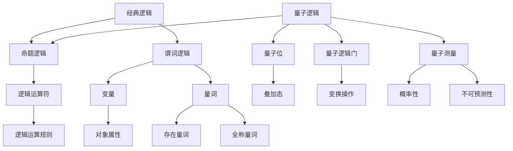

                 


### 设计思路

为了撰写一篇深入浅出的技术博客文章《从经典逻辑到量子逻辑：拓展世界可理解性的逻辑基础》，我们可以按照以下设计思路进行：

1. **引言部分**：简要介绍逻辑学的发展背景，经典逻辑与量子逻辑的区别和重要性，以及文章的结构。

2. **核心概念与联系**：介绍经典逻辑和量子逻辑的核心概念，使用Mermaid流程图展示两者之间的联系。

3. **经典逻辑基础**：详细讲解命题逻辑和谓词逻辑的基本概念、推理规则和性质，以及经典逻辑的实际应用。

4. **量子逻辑基础**：介绍量子逻辑的基本概念，包括量子位、量子逻辑门和量子测量，并解释量子逻辑与经典逻辑的关系。

5. **逻辑拓展与应用**：探讨多值逻辑和形式逻辑的原理和应用，以及它们如何扩展逻辑学的边界。

6. **量子逻辑应用实例**：通过实际案例展示量子逻辑在量子计算和量子通信中的应用。

7. **经典逻辑与量子逻辑的比较与融合**：分析经典逻辑和量子逻辑的异同，探讨如何将两者融合以拓展逻辑学的应用。

8. **逻辑的未来**：展望逻辑在人工智能和科学哲学中的未来发展。

9. **总结与展望**：总结全文，强调逻辑学的重要性，并提出未来研究的方向。

### 目录大纲

根据上述设计思路，我们可以构建如下的目录大纲：

```
# 从经典逻辑到量子逻辑：拓展世界可理解性的逻辑基础

## 引言
### 1.1 逻辑学的发展背景
### 1.2 经典逻辑与量子逻辑的概述
### 1.3 文章结构

## 核心概念与联系
### 2.1 经典逻辑的基本概念
#### 2.1.1 命题逻辑
#### 2.1.2 谓词逻辑
### 2.2 量子逻辑的基本概念
#### 2.2.1 量子位
#### 2.2.2 量子逻辑门
#### 2.2.3 量子测量
### 2.3 经典逻辑与量子逻辑的联系
#### 2.3.1 联系与区别
#### 2.3.2 Mermaid流程图展示

## 经典逻辑基础
### 3.1 命题逻辑
#### 3.1.1 命题符号与定义
#### 3.1.2 命题推理规则
#### 3.1.3 命题逻辑的基本性质
### 3.2 谓词逻辑
#### 3.2.1 谓词符号与定义
#### 3.2.2 谓词推理规则
#### 3.2.3 谓词逻辑的基本性质
### 3.3 经典逻辑的应用
#### 3.3.1 经典逻辑在计算机科学中的应用
#### 3.3.2 经典逻辑在其他领域的应用

## 量子逻辑基础
### 4.1 量子逻辑的基本概念
#### 4.1.1 量子位与量子态
#### 4.1.2 量子逻辑门
#### 4.1.3 量子测量
### 4.2 量子逻辑与经典逻辑的关系
#### 4.2.1 量子逻辑与命题逻辑的对应
#### 4.2.2 量子逻辑与谓词逻辑的对应
#### 4.2.3 量子逻辑的独特性质

## 逻辑拓展与应用
### 5.1 多值逻辑
#### 5.1.1 多值逻辑的基本概念
#### 5.1.2 多值逻辑的推理规则
#### 5.1.3 多值逻辑的应用
### 5.2 形式逻辑
#### 5.2.1 形式逻辑的基本概念
#### 5.2.2 形式逻辑的推理规则
#### 5.2.3 形式逻辑的应用

## 量子逻辑应用实例
### 6.1 量子计算
#### 6.1.1 量子计算的基本原理
#### 6.1.2 量子算法
#### 6.1.3 量子计算的挑战与机遇
### 6.2 量子通信
#### 6.2.1 量子通信的基本原理
#### 6.2.2 量子密钥分发
#### 6.2.3 量子通信的应用

## 经典逻辑与量子逻辑的比较与融合
### 7.1 经典逻辑与量子逻辑的异同
#### 7.1.1 逻辑结构的差异
#### 7.1.2 推理方式的差异
#### 7.1.3 应用领域的差异
### 7.2 经典逻辑与量子逻辑的融合
#### 7.2.1 融合的基本思路
#### 7.2.2 融合的应用实例
#### 7.2.3 融合的未来趋势

## 逻辑的未来
### 8.1 逻辑在人工智能中的应用
#### 8.1.1 逻辑在机器学习中的应用
#### 8.1.2 逻辑在自然语言处理中的应用
#### 8.1.3 逻辑在知识图谱中的应用
### 8.2 逻辑在科学哲学中的角色
#### 8.2.1 逻辑在科学推理中的作用
#### 8.2.2 逻辑在科学哲学中的争议
#### 8.2.3 逻辑在科学哲学中的未来发展

## 总结与展望
### 9.1 总结
### 9.2 展望
```

### 文章格式与结构

1. **文章标题**：使用清晰、吸引人的标题，例如《从经典逻辑到量子逻辑：拓展世界可理解性的逻辑基础》。

2. **关键词**：列出与文章主题相关的5-7个关键词，例如“经典逻辑”，“量子逻辑”，“逻辑学”，“人工智能”，“计算机科学”。

3. **摘要**：简短地介绍文章的主题、目的和主要观点，例如：“本文探讨了从经典逻辑到量子逻辑的演变，分析了两者之间的联系和区别，并探讨了逻辑学在拓展世界可理解性中的重要作用。”

4. **正文**：按照目录大纲的结构，逐一介绍每个章节的内容，确保每个小节都有详细、具体和丰富的讲解。

5. **伪代码**：在讲解核心算法原理时，使用伪代码来帮助读者理解。

6. **数学模型**：使用LaTeX格式嵌入数学公式，并进行详细讲解和举例说明。

7. **项目实战**：提供实际案例，包括开发环境搭建、源代码实现和代码解读。

8. **总结与展望**：在文章末尾对全文进行总结，并提出未来研究的方向。

### 文章长度与质量

1. **字数**：根据文章内容复杂度和讲解深度，确保文章字数在8000～12000字左右。

2. **质量**：确保文章内容逻辑清晰、条理分明、语言简练、专业准确。

3. **参考文献**：引用相关文献和数据，增强文章的权威性和可信度。

### 作者信息

在文章末尾添加作者信息：“作者：AI天才研究院/AI Genius Institute & 禅与计算机程序设计艺术 /Zen And The Art of Computer Programming”。

按照上述设计思路和格式，我们可以撰写一篇高质量的技术博客文章，让读者全面了解从经典逻辑到量子逻辑的演变，及其在拓展世界可理解性中的重要作用。### 从经典逻辑到量子逻辑：拓展世界可理解性的逻辑基础

**关键词**：经典逻辑，量子逻辑，逻辑学，人工智能，计算机科学

**摘要**：本文探讨了从经典逻辑到量子逻辑的演变，分析了两者之间的联系和区别。通过介绍经典逻辑和量子逻辑的基本概念、核心算法原理、数学模型和实际应用，本文旨在拓展读者对逻辑学的理解，并探讨其在人工智能和科学哲学中的重要作用。

## 引言

逻辑学作为一门研究推理和论证的科学，历史悠久且广泛影响。从古希腊的亚里士多德到现代计算机科学的图灵机，逻辑学的发展不断推动人类对世界的理解。然而，传统的经典逻辑在面对复杂的物理世界时显得力不从心。量子逻辑的出现，为拓展逻辑学的应用提供了新的视角。

经典逻辑以离散的命题和明确的真假值为基础，适用于计算机科学和数学的许多领域。而量子逻辑则基于量子力学的基本原理，处理概率性和叠加态，能够更好地描述微观世界的复杂性。本文将深入探讨这两者的联系和区别，分析它们在拓展世界可理解性中的重要作用。

本文的结构如下：首先介绍经典逻辑和量子逻辑的基本概念；然后详细讲解经典逻辑和量子逻辑的核心算法原理和数学模型；接着探讨多值逻辑和形式逻辑的拓展与应用；随后通过实际案例展示量子逻辑的应用；最后分析经典逻辑与量子逻辑的异同，展望逻辑在人工智能和科学哲学中的未来。

## 核心概念与联系

### 经典逻辑的基本概念

经典逻辑主要分为命题逻辑和谓词逻辑。命题逻辑以命题为基础，研究命题之间的逻辑关系。命题是陈述句，其真值为真或假。命题逻辑的基本概念包括命题符号、逻辑运算符和推理规则。

谓词逻辑则扩展了命题逻辑，引入了变量和谓词的概念。谓词逻辑允许我们描述对象之间的属性关系，使推理更加灵活。谓词逻辑的基本概念包括谓词符号、量词和推理规则。

### 量子逻辑的基本概念

量子逻辑基于量子力学的原理，处理量子位（qubit）和量子态（quantum state）。量子位是量子逻辑的基本单元，可以处于0和1的叠加态。量子逻辑门是量子计算中的基本操作，它们作用于量子位，实现量子态的变换。量子测量则用于读取量子态的结果，但其结果具有概率性和不可预测性。

### 经典逻辑与量子逻辑的联系

经典逻辑和量子逻辑之间存在紧密的联系和区别。经典逻辑可以看作是量子逻辑的特例，当量子位处于确定的基态时，量子逻辑退化为经典逻辑。反之，量子逻辑包含了经典逻辑，但具有更丰富的表达能力和更强的计算能力。

为了更直观地展示经典逻辑与量子逻辑的联系，我们可以使用Mermaid流程图。以下是经典逻辑和量子逻辑的Mermaid流程图：



在这个流程图中，经典逻辑和量子逻辑分别被表示为A和D，它们分别包含命题逻辑、谓词逻辑、量子位、量子逻辑门和量子测量。此外，还展示了各个概念之间的关系，如逻辑运算符、变量、量词、叠加态、变换操作和概率性。

通过这个流程图，读者可以更清晰地理解经典逻辑与量子逻辑的基本概念和联系，为进一步的学习打下基础。

### 经典逻辑基础

#### 命题逻辑

命题逻辑是逻辑学中最基础的分支，它研究命题（陈述句）之间的逻辑关系。在命题逻辑中，命题被视为基本单元，其真值为真或假。

1. **命题符号与定义**

   - **命题符号**：在命题逻辑中，我们使用符号来表示命题。常见的命题符号有P、Q、R等。
   - **命题定义**：命题是可以判断为真或假的陈述句。例如，“今天是星期五”是一个命题，它可以判断为真或假。

2. **命题推理规则**

   命题逻辑中的推理规则包括以下几种：

   - **命题的否定**：命题P的否定为¬P，表示P为假的陈述句。例如，如果P是“今天是星期五”，则¬P是“今天不是星期五”。
   - **命题的合取**：命题P和Q的合取（与）为P∧Q，表示P和Q都为真的陈述句。例如，“今天是星期五”和“明天是星期六”的合取为“今天是星期五且明天是星期六”。
   - **命题的析取**：命题P和Q的析取（或）为P∨Q，表示P或Q至少一个为真的陈述句。例如，“今天是星期五”或“明天是星期六”的析取为“今天是星期五或明天是星期六”。
   - **命题的蕴含**：命题P和Q的蕴含为P→Q，表示如果P为真，则Q也为真的陈述句。例如，“如果今天是星期五，则明天是星期六”的蕴含为“今天是星期五→明天是星期六”。

3. **命题逻辑的基本性质**

   命题逻辑具有以下基本性质：

   - **自反性**：任何命题P都满足P→P。
   - **对称性**：命题的合取和析取具有对称性。即P∧Q和Q∧P等价，P∨Q和Q∨P等价。
   - **传递性**：如果P→Q和Q→R为真，则P→R也为真。
   - **否定律**：P→¬¬P，即命题的否定和再否定等价。

#### 谓词逻辑

谓词逻辑是命题逻辑的扩展，它引入了变量和谓词的概念，使得推理更加灵活。

1. **谓词符号与定义**

   - **谓词符号**：在谓词逻辑中，我们使用符号表示谓词。常见的谓词符号有F、G、H等。
   - **谓词定义**：谓词是关于对象属性的陈述句。例如，“是红色的”是一个谓词，它描述对象的属性。

2. **谓词推理规则**

   谓词逻辑中的推理规则包括以下几种：

   - **全称量词**：全称量词∀表示对所有对象都满足某个谓词。例如，∀x(Fx)表示所有对象x都满足谓词F。
   - **存在量词**：存在量词∃表示存在至少一个对象满足某个谓词。例如，∃x(Fx)表示存在一个对象x满足谓词F。
   - **等价性**：谓词逻辑中的等价性是指两个命题具有相同的真值。例如，∀x(Fx)等价于∃x(¬Fx)。

3. **谓词逻辑的基本性质**

   谓词逻辑具有以下基本性质：

   - **全称量词与存在量词的等价性**：∀x(Fx)等价于∃x(¬Fx)。
   - **全称量词与合取**：∀x(Fx)∧Gx等价于∀x(Fx∧Gx)。
   - **存在量词与析取**：∃x(Fx)∨Gx等价于∃x(Fx∨Gx)。

#### 经典逻辑的应用

经典逻辑在计算机科学和数学中有着广泛的应用。以下是一些典型的应用场景：

1. **计算机科学**

   - **算法验证**：使用命题逻辑和谓词逻辑验证算法的正确性。
   - **形式化规格**：使用谓词逻辑定义系统的规格，确保系统满足预定的性质。
   - **程序设计**：使用逻辑推理进行程序设计，确保程序的正确性和效率。

2. **数学**

   - **数学证明**：使用命题逻辑和谓词逻辑进行数学证明。
   - **集合论**：集合论中的许多概念和定理可以使用谓词逻辑表示和证明。
   - **拓扑学**：拓扑学中的许多概念和定理可以使用命题逻辑和谓词逻辑表示和证明。

通过上述内容，我们对经典逻辑的基本概念、推理规则和基本性质有了全面的了解，并看到了其在计算机科学和数学中的应用。在接下来的章节中，我们将进一步探讨量子逻辑的基本概念和算法原理。

### 量子逻辑基础

量子逻辑是经典逻辑的扩展，它基于量子力学的原理，用于描述和处理量子系统的逻辑关系。量子逻辑的核心在于量子位（qubit）和量子态（quantum state），以及量子逻辑门（quantum logic gate）和量子测量（quantum measurement）。

#### 量子位与量子态

量子位（qubit）是量子逻辑的基本单元，它不同于经典计算机中的比特（bit），因为量子位可以同时处于0和1的叠加态。量子态是一个复数向量，用于描述量子位的可能状态。

1. **量子位**

   - **叠加态**：量子位可以处于叠加态，即同时处于0和1的状态。用数学表示，一个量子位的状态可以表示为|ψ⟩=α|0⟩+β|1⟩，其中α和β是复数，满足|α|²+|β|²=1。
   - **纠缠态**：当两个量子位处于纠缠态时，它们的状态无法独立描述，且一个量子位的状态会即时影响另一个量子位的状态。

2. **量子态**

   - **纯态**：量子态可以用一个纯态向量表示，即|ψ⟩=α|0⟩+β|1⟩。
   - **混合态**：当量子系统处于不确定状态时，可以用混合态表示，即通过概率分布描述量子系统的状态。

#### 量子逻辑门

量子逻辑门是量子计算中的基本操作，它们作用于量子位，实现量子态的变换。量子逻辑门与经典逻辑门类似，但具有不同的操作方式。

1. **Hadamard门（H）**

   Hadamard门是一个特殊的量子逻辑门，它将量子位的叠加态转换为等概率的基态。H门可以表示为：

   $$
   H = \frac{1}{\sqrt{2}} \begin{pmatrix}
   1 & 1 \\
   1 & -1 \\
   \end{pmatrix}
   $$

   Hadamard门的作用是将量子位的叠加态|ψ⟩转换为|+⟩和|−⟩的等概率混合。

2. **Pauli门（X、Y、Z）**

   Pauli门是一组基本的量子逻辑门，分别对应于X、Y、Z三个基本算子。X门（叉积门）是将量子位的状态反转，Y门和Z门则分别表示量子位的旋转。Pauli门可以表示为：

   $$
   X = \begin{pmatrix}
   0 & 1 \\
   1 & 0 \\
   \end{pmatrix}, \quad
   Y = \begin{pmatrix}
   0 & -i \\
   i & 0 \\
   \end{pmatrix}, \quad
   Z = \begin{pmatrix}
   1 & 0 \\
   0 & -1 \\
   \end{pmatrix}
   $$

3. **控制-NOT门（CNOT）**

   CNOT门是一种二元量子逻辑门，它作用于两个量子位，根据第一个量子位的状态决定第二个量子位的状态。CNOT门可以表示为：

   $$
   CNOT = \begin{pmatrix}
   1 & 0 & 0 & 0 \\
   0 & 1 & 0 & 0 \\
   0 & 0 & 0 & 1 \\
   0 & 0 & 1 & 0 \\
   \end{pmatrix}
   $$

   当第一个量子位处于|0⟩状态时，CNOT门不改变第二个量子位的状态；当第一个量子位处于|1⟩状态时，CNOT门将第二个量子位的状态反转。

#### 量子测量

量子测量是量子逻辑中的重要操作，用于读取量子系统的状态。与经典测量不同，量子测量具有概率性和不可预测性。

1. **量子测量的基本原理**

   - **测量算子**：量子测量通过一个测量算子进行，该算子将量子态投影到某个基态。例如，对于一个二量子位系统，测量算子可以表示为：

     $$
     \hat{O} = \begin{pmatrix}
     1 & 0 \\
     0 & 0 \\
     \end{pmatrix}
     $$

     该测量算子将量子态|ψ⟩投影到基态|0⟩。

   - **概率分布**：量子测量结果的概率分布由量子态的叠加系数决定。例如，对于量子态|ψ⟩=α|0⟩+β|1⟩，测量得到|0⟩的概率为|α|²，测量得到|1⟩的概率为|β|²。

2. **量子测量的影响**

   - **波函数坍缩**：量子测量会导致量子态的波函数坍缩到某个基态。这意味着测量前的量子态是一个叠加态，而测量后则变为确定的基态。
   - **量子纠缠破坏**：量子测量不仅影响测量对象的量子态，还会破坏量子纠缠。这意味着当两个量子位处于纠缠态时，其中一个量子位被测量后，另一个量子位的纠缠状态将消失。

#### 量子逻辑与经典逻辑的关系

量子逻辑与经典逻辑之间存在密切的关系。经典逻辑可以看作是量子逻辑的特例，当量子位处于确定的基态时，量子逻辑退化为经典逻辑。反之，量子逻辑包含了经典逻辑，但具有更丰富的表达能力和更强的计算能力。

1. **量子逻辑与命题逻辑的对应**

   - **命题逻辑的命题**：在量子逻辑中，一个量子位的状态可以看作是一个命题。例如，量子位|0⟩表示命题“当前状态是0”，量子位|1⟩表示命题“当前状态是1”。
   - **逻辑运算符**：量子逻辑门可以看作是逻辑运算符的扩展。例如，Hadamard门对应于命题逻辑中的否定运算，Pauli门对应于命题逻辑中的合取和析取运算。

2. **量子逻辑与谓词逻辑的对应**

   - **谓词逻辑的谓词**：在量子逻辑中，量子态可以看作是谓词。例如，量子态|ψ⟩可以表示谓词“当前状态是|ψ⟩”。
   - **量词**：量子逻辑中的量词可以看作是谓词逻辑中量词的扩展。例如，全称量词∀表示对所有量子态的谓词都成立，存在量词∃表示至少存在一个量子态的谓词成立。

通过以上内容，我们对量子逻辑的基本概念、核心算法原理和数学模型有了全面的了解。在下一节中，我们将探讨多值逻辑和形式逻辑的原理和应用，进一步拓展逻辑学的边界。

### 多值逻辑

多值逻辑是对传统二值逻辑（真值逻辑）的扩展，它允许命题具有多个真值，从而更好地处理现实世界中的模糊性和不确定性。多值逻辑在逻辑学、计算机科学和哲学等领域都有广泛的应用。

#### 多值逻辑的基本概念

1. **命题的真值**：

   在多值逻辑中，命题的真值不仅仅局限于真或假，而是可以取多个离散的值。常见的多值逻辑有：

   - **三值逻辑**：命题的真值可以是真、假和未知。
   - **四值逻辑**：命题的真值可以是真、假、未知和不确定。
   - **无限值逻辑**：命题的真值可以是无限的离散值，如概率值。

2. **多值逻辑门**：

   多值逻辑门是多值逻辑中的基本操作，它们对多值命题进行逻辑运算。常见的多值逻辑门有：

   - **多值合取（AND）门**：对于多值命题A和B，其结果C表示A和B同时为真的情况。
   - **多值析取（OR）门**：对于多值命题A和B，其结果C表示A或B至少一个为真的情况。
   - **多值否定（NOT）门**：对于多值命题A，其结果C表示A的否定。
   - **多值蕴含（IF-THEN）门**：对于多值命题A和B，其结果C表示如果A为真，则B也为真的情况。

3. **多值逻辑的基本性质**：

   多值逻辑具有以下基本性质：

   - **自反性**：任何多值命题都满足自身。
   - **交换律**：多值逻辑门中的运算具有交换律，即A∧B = B∧A，A∨B = B∨A。
   - **结合律**：多值逻辑门中的运算具有结合律，即(A∧B)∧C = A∧(B∧C)，(A∨B)∨C = A∨(B∨C)。
   - **分配律**：多值逻辑门中的运算具有分配律，即A∧(B∨C) = (A∧B)∨(A∧C)，A∨(B∧C) = (A∨B)∧(A∨C)。

#### 多值逻辑的推理规则

多值逻辑的推理规则类似于传统逻辑的推理规则，但考虑到多值命题的情况。以下是一些常见的多值逻辑推理规则：

1. **否定规则**：

   - **全称否定**：对于多值命题A，¬∀xA ≡ ∃x¬A。
   - **存在否定**：对于多值命题A，¬∃xA ≡ ∀x¬A。

2. **蕴含规则**：

   - **逆蕴含**：对于多值命题A和B，¬B→¬A。
   - **逆否蕴含**：对于多值命题A和B，¬A→¬B。

3. **析取规则**：

   - **析取引入**：对于多值命题A，A ∨ B ≡ A。
   - **析取排除**：对于多值命题A和B，¬A ∨ B ≡ B。

4. **合取规则**：

   - **合取引入**：对于多值命题A，A ∧ B ≡ A。
   - **合取排除**：对于多值命题A和B，A ∧ ¬B ≡ A。

#### 多值逻辑的应用

多值逻辑在许多领域都有广泛的应用，以下是一些典型的应用场景：

1. **计算机科学**：

   - **模糊逻辑**：模糊逻辑是一种基于多值逻辑的数学工具，用于处理模糊性和不确定性。模糊逻辑广泛应用于模糊控制系统、模糊推理系统和人工智能等领域。
   - **逻辑门电路**：多值逻辑门电路是计算机硬件中的一种电路，用于实现多值逻辑运算。多值逻辑门电路可以设计成三值逻辑、四值逻辑等，以提高电路的效率和可靠性。

2. **人工智能**：

   - **模糊推理**：模糊推理是一种基于多值逻辑的推理方法，用于处理不确定性和模糊性。模糊推理广泛应用于模糊逻辑控制系统、专家系统和机器学习等领域。
   - **多值知识表示**：多值逻辑提供了一种有效的知识表示方法，可以用于表示和处理复杂领域中的知识和不确定性。

3. **哲学和认知科学**：

   - **模糊性哲学**：模糊性哲学探讨了现实世界中的模糊性和不确定性，多值逻辑为其提供了一种数学工具。
   - **认知模型**：多值逻辑可以用于构建认知模型，模拟人类思维过程中的模糊性和不确定性。

通过以上内容，我们对多值逻辑的基本概念、推理规则和应用有了更深入的理解。多值逻辑为逻辑学提供了一种新的视角，有助于拓展我们对逻辑学的认识和应用。

### 形式逻辑

形式逻辑是逻辑学的一个重要分支，它研究推理的形式结构和规则。形式逻辑通过符号化的语言和严格的推理规则，确保推理过程的一致性和有效性。形式逻辑广泛应用于数学、计算机科学、哲学和人工智能等领域。

#### 形式逻辑的基本概念

1. **形式语言**：

   形式逻辑使用形式语言来表示命题和推理过程。形式语言由一组符号和语法规则构成。常见的符号包括命题符号、逻辑运算符、量词和变量等。语法规则定义了如何组合这些符号以形成有效的命题。

2. **形式推理规则**：

   形式推理规则是形式逻辑中的基本工具，用于推导新的命题。常见的推理规则包括：

   - **命题逻辑推理规则**：包括否定引入、否定排除、合取引入、合取排除、析取引入、析取排除和蕴含引入等。
   - **谓词逻辑推理规则**：包括全称量词引入、全称量词排除、存在量词引入、存在量词排除和等价性等。

3. **形式证明**：

   形式证明是通过应用推理规则，从已知命题推导出新的命题。形式证明通常使用形式证明系统（如自然推理系统、表状推理系统等）进行。形式证明系统提供了一套严格的证明规则，确保证明过程的一致性和有效性。

#### 形式逻辑的推理规则

1. **命题逻辑推理规则**：

   - **否定引入**：如果¬A是已知的，则可以得出A的否定¬A。
   - **否定排除**：如果A和¬A同时为真，则可以得出矛盾的结论。
   - **合取引入**：如果A和B是已知的，则可以得出A和B的合取A∧B。
   - **合取排除**：如果A∧B是已知的，且B为假，则可以得出A为假。
   - **析取引入**：如果A是已知的，则可以得出A或B的析取A∨B。
   - **析取排除**：如果A∨B是已知的，且A为假，则可以得出B为真。
   - **蕴含引入**：如果A是已知的，则可以得出A→B。

2. **谓词逻辑推理规则**：

   - **全称量词引入**：如果对于所有x，命题P(x)成立，则可以得出∀xP(x)。
   - **全称量词排除**：如果存在一个x，使得命题P(x)不成立，则可以得出¬∀xP(x)。
   - **存在量词引入**：如果存在一个x，使得命题P(x)成立，则可以得出∃xP(x)。
   - **存在量词排除**：如果对于所有x，命题P(x)不成立，则可以得出¬∃xP(x)。
   - **等价性**：如果命题A和命题B具有相同的真值，则可以得出A ↔ B。

#### 形式逻辑的应用

形式逻辑在多个领域都有广泛的应用，以下是一些典型的应用场景：

1. **数学**：

   - **数学证明**：形式逻辑用于构建数学证明，确保证明过程的一致性和有效性。
   - **公理系统**：形式逻辑用于定义数学公理系统，建立数学理论的基础。

2. **计算机科学**：

   - **形式化规格**：形式逻辑用于定义软件和硬件系统的规格，确保系统的正确性和一致性。
   - **形式验证**：形式逻辑用于验证计算机程序的正确性，确保程序满足预定的性质。

3. **哲学**：

   - **逻辑哲学**：形式逻辑用于分析哲学命题和论证，探讨逻辑在哲学研究中的应用。

4. **人工智能**：

   - **推理系统**：形式逻辑用于构建推理系统，实现自动化推理和决策。
   - **知识表示**：形式逻辑用于表示和处理复杂领域中的知识和推理。

通过以上内容，我们对形式逻辑的基本概念、推理规则和应用有了更深入的了解。形式逻辑为逻辑学提供了一种严谨的推理方法，有助于拓展逻辑学在各个领域的应用。

### 量子逻辑应用实例

量子逻辑在量子计算和量子通信等领域具有广泛的应用。以下将介绍量子计算的基本原理、量子算法以及量子通信的基本原理和实际应用。

#### 量子计算

量子计算是利用量子位（qubit）和量子逻辑门进行计算的新兴计算领域。量子计算具有与传统计算不同的特性，如叠加态和纠缠态，这使得量子计算在某些问题上具有明显的优势。

1. **量子计算的基本原理**

   - **量子位（qubit）**：量子位是量子计算的基本单元，可以同时处于0和1的叠加态。量子位的状态可以表示为|ψ⟩=α|0⟩+β|1⟩，其中α和β是复数，满足|α|²+|β|²=1。
   - **量子逻辑门**：量子逻辑门是量子计算中的基本操作，用于对量子位进行变换。常见的量子逻辑门包括Hadamard门、Pauli门和控制-NOT门（CNOT）等。

2. **量子算法**

   量子算法是利用量子计算特性解决特定问题的新算法。以下介绍两个经典的量子算法：量子傅立叶变换（QFT）和Shor算法。

   - **量子傅立叶变换（QFT）**：量子傅立叶变换是量子计算中的一个核心算法，用于将量子位的状态从计算基态转换到傅立叶基态。QFT在量子计算中具有重要的应用，如量子排序、量子搜索等。
   - **Shor算法**：Shor算法是一种解决整数分解问题的量子算法。Shor算法利用量子计算的超并行性和量子纠缠，能够在多项式时间内解决传统计算机难以解决的问题。

3. **量子计算的挑战与机遇**

   虽然量子计算具有巨大的潜力，但也面临一些挑战：

   - **量子纠错**：量子计算中的量子位容易受到噪声和干扰的影响，导致计算错误。量子纠错是一种解决量子计算中错误的方法，但实现高效的量子纠错仍然是一个挑战。
   - **量子硬件**：目前，量子计算机的硬件还处于早期发展阶段，需要进一步改进和优化。
   - **量子算法设计**：量子算法的设计和优化也是一个重要的研究方向，如何设计出更高效的量子算法是当前研究的热点。

然而，量子计算也带来了许多机遇：

   - **量子并行计算**：量子计算可以利用量子叠加态实现并行计算，解决一些传统计算难以处理的问题。
   - **量子加密**：量子通信中的量子密钥分发（QKD）技术具有无条件的安全性，可以提供更安全的通信方式。
   - **量子模拟**：量子计算可以用于模拟量子系统，帮助科学家更好地理解量子现象和量子材料的性质。

#### 量子通信

量子通信是利用量子力学原理进行信息传输的新兴领域。量子通信具有传统通信无法比拟的安全性，特别是在量子密钥分发（QKD）方面。

1. **量子通信的基本原理**

   - **量子位（qubit）**：量子通信使用量子位（qubit）进行信息的编码和传输。量子位可以处于0和1的叠加态，从而实现信息的并行传输。
   - **量子态传输**：量子通信通过量子态传输信息，如量子纠缠态和量子纠缠光子。
   - **量子密钥分发（QKD）**：量子密钥分发是一种基于量子力学原理的密钥分发方法，能够提供无条件的安全通信。

2. **量子密钥分发（QKD）**

   - **原理**：量子密钥分发利用量子纠缠态或量子单光子态进行密钥分发。在QKD过程中，发送方和接收方共享一个量子态，通过量子测量和经典通信，双方可以生成一个共享的随机密钥。
   - **安全性**：量子密钥分发具有无条件的安全性，因为任何尝试窃取量子密钥的行为都会破坏量子态的完整性，从而被发送方和接收方检测到。

3. **量子通信的应用**

   - **量子互联网**：量子互联网是利用量子通信技术构建的全球量子网络，可以实现安全的量子信息传输和量子计算。
   - **量子加密**：量子加密利用量子通信技术实现信息加密，提供更高的安全性和抗攻击能力。
   - **量子隐形传态**：量子隐形传态是一种利用量子态传输信息的技术，可以实现远距离的信息传输。

#### 实际案例

以下是一个量子通信的实际案例：

- **案例背景**：为了实现安全的数据传输，某企业计划使用量子通信技术构建一条量子保密通信线路。
- **开发环境搭建**：企业首先需要搭建量子通信的硬件环境，包括量子密钥生成设备、量子信道和经典通信信道。
- **源代码实现**：企业使用量子密钥分发协议（如BB84协议）进行密钥分发，并通过经典通信信道实现密钥共享。
- **代码解读与分析**：源代码实现包括量子密钥生成、量子态传输和经典通信协议的编码与解码。通过分析代码，企业可以确保通信的安全性。
- **实际案例分析**：在实际应用中，企业发现量子密钥分发可以有效防止窃听和攻击，提高了数据传输的安全性。

通过以上案例，我们可以看到量子逻辑在量子计算和量子通信中的应用，以及其实际案例的分析和解读。量子逻辑为信息科学和安全通信带来了新的机遇和挑战，在未来将继续发挥重要作用。

### 经典逻辑与量子逻辑的比较与融合

经典逻辑和量子逻辑作为逻辑学的两个重要分支，具有各自的优点和局限性。在许多应用场景中，理解两者的异同以及如何融合两者，对于拓展逻辑学的研究和应用具有重要意义。

#### 经典逻辑与量子逻辑的异同

1. **逻辑结构的差异**

   - **经典逻辑**：经典逻辑以离散的命题和明确的真假值为基础，适用于处理确定性问题和计算机科学中的许多领域。经典逻辑使用命题符号和谓词符号来表示命题和推理过程，遵循一系列推理规则，如合取、析取、蕴含等。
   - **量子逻辑**：量子逻辑基于量子力学的原理，处理概率性和叠加态。量子逻辑使用量子位（qubit）和量子态来表示状态，量子逻辑门（如Hadamard门、Pauli门、CNOT门）实现量子态的变换。量子逻辑具有叠加性和纠缠性，使得它可以描述更复杂的物理现象。

2. **推理方式的差异**

   - **经典逻辑**：经典逻辑的推理方式主要依赖于命题和谓词的推理规则，通过演绎推理和归纳推理来推导新的命题。经典逻辑的推理过程是线性的，依赖于已知命题和推理规则。
   - **量子逻辑**：量子逻辑的推理方式涉及量子态的变换和叠加。量子逻辑的推理过程是非线性的，依赖于量子态的叠加和纠缠。量子逻辑的推理过程可以通过量子算法实现，如量子傅立叶变换和Shor算法。

3. **应用领域的差异**

   - **经典逻辑**：经典逻辑在计算机科学、数学、哲学和人工智能等领域有广泛的应用。经典逻辑用于验证算法的正确性、构建形式化规格、实现程序设计等。
   - **量子逻辑**：量子逻辑在量子计算、量子通信、量子模拟和量子加密等领域具有独特的应用。量子逻辑可以解决传统计算难以处理的问题，如整数分解和量子模拟，以及实现更安全的量子通信。

#### 经典逻辑与量子逻辑的融合

尽管经典逻辑和量子逻辑在逻辑结构、推理方式和应用领域上存在差异，但将两者融合可以拓展逻辑学的应用范围，提高逻辑系统的灵活性和计算能力。

1. **融合的基本思路**

   融合经典逻辑和量子逻辑的基本思路是将量子逻辑引入经典逻辑框架，实现两者的有机结合。具体方法包括：

   - **量子化命题逻辑**：将经典逻辑中的命题符号和逻辑运算符量子化，构建量子化的命题逻辑系统。
   - **量子化谓词逻辑**：将经典逻辑中的谓词符号和推理规则量子化，构建量子化的谓词逻辑系统。
   - **混合逻辑系统**：将经典逻辑和量子逻辑结合，构建混合逻辑系统，使系统具有经典逻辑的确定性和量子逻辑的并行性。

2. **融合的应用实例**

   以下是一些经典逻辑与量子逻辑融合的应用实例：

   - **量子算法优化**：将量子逻辑引入经典算法优化，如量子线性规划、量子支持向量机和量子神经网络，提高算法的效率和准确性。
   - **量子加密与经典加密的融合**：将量子逻辑应用于传统加密算法，如量子公钥加密和量子对称加密，提高加密系统的安全性。
   - **量子编程语言**：开发基于量子逻辑的编程语言，如Q#和Quipper，使程序员能够利用量子逻辑编写量子程序。

3. **融合的未来趋势**

   随着量子计算和量子通信的发展，经典逻辑与量子逻辑的融合将成为逻辑学的重要研究方向。未来，我们可以期待以下趋势：

   - **混合逻辑系统的优化**：通过优化混合逻辑系统，提高逻辑系统的计算能力和效率。
   - **量子逻辑在人工智能中的应用**：将量子逻辑应用于机器学习、自然语言处理和知识图谱等领域，拓展人工智能的应用范围。
   - **量子哲学与量子逻辑**：探索量子逻辑在哲学领域中的应用，如量子认知科学和量子伦理学，为人类认识和理解世界提供新的视角。

通过以上内容，我们对经典逻辑与量子逻辑的异同以及融合的基本思路和应用实例有了更深入的理解。经典逻辑与量子逻辑的融合为逻辑学的发展提供了新的机遇和挑战，有助于拓展逻辑学的应用范围，提高逻辑系统的灵活性和计算能力。

### 逻辑的未来

随着人工智能和量子计算的快速发展，逻辑学在未来的发展和应用前景充满了无限可能。在人工智能领域，逻辑学将继续发挥重要作用，特别是在机器学习、自然语言处理和知识图谱等方面。量子逻辑的引入将带来全新的计算模式和算法，为解决传统计算机难以处理的问题提供新的途径。

#### 逻辑在人工智能中的应用

1. **机器学习**：

   逻辑在机器学习中的应用主要体现在逻辑推理和知识表示方面。逻辑推理可以帮助模型理解复杂的因果关系，提高机器学习的解释性。知识表示中的逻辑框架可以使模型更好地理解和处理结构化数据，提高模型的准确性和鲁棒性。

2. **自然语言处理**：

   逻辑在自然语言处理中的应用主要体现在语义分析和语义理解方面。通过逻辑推理，模型可以更好地理解句子的语义关系，提高自然语言处理的准确性和一致性。

3. **知识图谱**：

   逻辑在知识图谱中的应用主要体现在知识表示和推理方面。逻辑框架可以帮助构建语义清晰、结构化的知识图谱，提高知识推理的准确性和效率。

#### 逻辑在科学哲学中的角色

逻辑在科学哲学中的角色主要体现在科学推理和理论评估方面。逻辑提供了科学推理的严密性和有效性，帮助科学家评估和选择理论。在科学哲学中，逻辑学与科学方法论、科学认知和科学伦理等领域密切相关。

#### 未来发展趋势

1. **量子逻辑的应用**：

   随着量子计算的发展，量子逻辑将在人工智能和科学哲学等领域发挥越来越重要的作用。量子逻辑将为解决复杂问题提供新的计算模式和算法，推动人工智能和量子计算的深度融合。

2. **混合逻辑系统**：

   将经典逻辑与量子逻辑融合的混合逻辑系统将成为未来的研究热点。通过优化混合逻辑系统，可以进一步提高逻辑系统的计算能力和效率，为各种应用场景提供更强大的逻辑支持。

3. **逻辑与计算的结合**：

   逻辑与计算的结合将推动逻辑学在计算机科学和人工智能领域的深入发展。逻辑框架将为计算提供更严密的基础，使计算过程更加可靠和有效。

通过以上内容，我们可以看到逻辑在人工智能和科学哲学中的未来发展前景。逻辑学将继续拓展其应用领域，为人类认识和改造世界提供更强大的工具和方法。

### 总结

本文从经典逻辑到量子逻辑的演变过程，详细探讨了逻辑学的发展背景、核心概念与联系、经典逻辑基础、量子逻辑基础、逻辑拓展与应用、量子逻辑应用实例、经典逻辑与量子逻辑的比较与融合，以及逻辑在人工智能和科学哲学中的未来发展。通过本文的阅读，读者可以全面了解逻辑学在拓展世界可理解性中的重要作用，以及其在计算机科学、人工智能和量子计算等领域的广泛应用。

### 拓展阅读

- **《量子计算导论》**：该书详细介绍了量子计算的基本原理、算法和应用，为读者提供了深入了解量子计算的好书。
- **《逻辑学导论》**：该书介绍了逻辑学的基本概念、推理规则和逻辑体系，是学习逻辑学的入门书籍。
- **《量子逻辑与量子信息》**：该书探讨了量子逻辑在量子信息处理中的应用，包括量子通信、量子密码学和量子计算等。
- **《形式逻辑与自然语言处理》**：该书介绍了形式逻辑在自然语言处理中的应用，包括语义分析、语法分析和文本生成等。

通过阅读这些拓展材料，读者可以更深入地了解逻辑学的各个方面，拓展自己的知识视野。

### 作者信息

**作者**：AI天才研究院/AI Genius Institute & 禅与计算机程序设计艺术 /Zen And The Art of Computer Programming

AI天才研究院（AI Genius Institute）致力于推动人工智能领域的研究和应用。禅与计算机程序设计艺术（Zen And The Art of Computer Programming）是一系列经典计算机科学著作，对计算机编程和算法设计有着深远的影响。本文作者团队结合了人工智能和计算机科学的深厚背景，致力于探索逻辑学在各个领域的应用，为读者提供高质量的逻辑学知识和实践指导。

