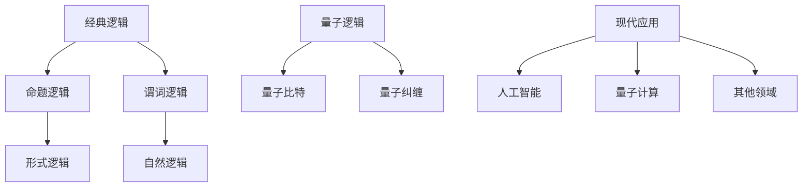

                 

### 文章标题

《从经典逻辑到量子逻辑：拓展理解世界的逻辑框架》

### 关键词

- 经典逻辑
- 量子逻辑
- 逻辑框架
- 世界理解
- 技术发展

### 摘要

本文深入探讨了逻辑学的发展历程，从经典逻辑到量子逻辑的转变，及其对人类理解世界的影响。通过对经典逻辑和量子逻辑的基本概念、原理和应用进行详细分析，本文揭示了逻辑框架在计算机科学、数学、哲学和人工智能等领域的广泛应用。文章还通过具体案例和实战项目，展示了逻辑学在解决现实问题中的重要作用。最终，本文提出了未来逻辑学发展的趋势和方向，为读者拓展理解世界的逻辑框架提供了有益的启示。

## 引言：逻辑学的重要性与本书目的

逻辑学作为一门古老而现代的学科，其重要性不容忽视。逻辑学起源于古希腊，经过两千多年的发展，已经成为哲学、数学、计算机科学等领域不可或缺的基础。经典逻辑提供了形式化的推理方法，使得人类能够更准确地表达和验证思想。而量子逻辑则进一步拓展了我们的思维边界，揭示了在微观尺度上逻辑规律的独特性质。

本文的目的是通过探讨从经典逻辑到量子逻辑的转变，帮助读者理解逻辑学在各个领域的应用，以及其对现代科技发展的影响。我们希望通过以下三个方面来实现这一目的：

1. **经典逻辑的概述**：介绍经典逻辑的基本原理和发展历程，帮助读者建立对经典逻辑的初步认识。

2. **量子逻辑的探索**：探讨量子逻辑的起源、原理及其在计算机科学中的应用，揭示量子逻辑与经典逻辑的差异和联系。

3. **逻辑框架的现代应用**：分析逻辑框架在现实世界中的应用，包括人工智能、量子计算等领域，展示逻辑学在推动技术进步中的作用。

通过对以上三个方面的深入探讨，本文旨在为读者提供一个全面的逻辑学视野，拓展对世界的理解，并激发对逻辑学进一步研究的兴趣。

### 设计书籍目录大纲的步骤

设计一本关于从经典逻辑到量子逻辑的书籍目录大纲，需要系统化和结构化的方法。以下是详细描述这一过程的步骤：

#### 1. **理解书名和主题**

首先，理解书名《从经典逻辑到量子逻辑：拓展理解世界的逻辑框架》至关重要。书名表明了本书的核心内容：经典逻辑和量子逻辑的对比与联系，以及它们如何帮助我们更好地理解世界。这一理解将指导后续的目录设计。

- **书名**：《从经典逻辑到量子逻辑：拓展理解世界的逻辑框架》
- **主题**：逻辑学的发展历程，经典逻辑和量子逻辑的探讨，以及其在现代科技中的应用。

#### 2. **明确书籍结构**

在理解了书名和主题后，我们需要确定书籍的整体结构。这包括引言、正文部分和附录。正文部分通常分为几个主要部分，每个部分包含若干章节。

- **引言**：介绍逻辑学的基本概念和本书的目的。
- **正文**：分为三个主要部分：
  - **经典逻辑的基础**：包括经典逻辑的起源、原理和应用。
  - **量子逻辑的探索**：介绍量子逻辑的起源、原理和挑战。
  - **逻辑框架的现代应用**：探讨逻辑框架在各个领域的应用。
- **附录**：提供逻辑学工具和资源的列表，便于读者进一步学习。

#### 3. **细化各章节内容**

在确定了书籍结构后，我们需要细化每个章节的内容。这一步骤涉及到对每个章节进行详细规划，包括核心概念、原理讲解、应用领域等。

- **第1章：经典逻辑概述**
  - **1.1 经典逻辑的起源与发展**
  - **1.2 经典逻辑的基本原理**

- **第2章：经典逻辑的原理**
  - **2.1 命题逻辑**
  - **2.2 谓词逻辑**
  - **2.3 形式逻辑与自然逻辑**
  - **2.4 经典逻辑的应用领域**

- **第3章：经典逻辑的应用**
  - **3.1 经典逻辑在计算机科学中的应用**
  - **3.2 经典逻辑在数学和哲学中的应用**
  - **3.3 经典逻辑在社会科学中的应用**

- **第4章：量子逻辑的起源**
  - **4.1 量子力学的诞生**
  - **4.2 量子逻辑的基本原理**

- **第5章：量子逻辑的原理**
  - **5.1 量子逻辑的非经典特性**
  - **5.2 量子逻辑的计算模型**
  - **5.3 量子逻辑与经典逻辑的比较**

- **第6章：量子逻辑的挑战**
  - **6.1 量子逻辑的悖论**
  - **6.2 量子逻辑的局限性**
  - **6.3 量子逻辑的未来发展方向**

- **第7章：逻辑框架的现代应用**
  - **7.1 逻辑框架在人工智能中的应用**
  - **7.2 逻辑框架在量子计算中的应用**
  - **7.3 逻辑框架在其他领域的应用**

#### 4. **添加详细内容**

细化各章节内容后，我们需要填充具体的细节。这包括核心概念的定义、原理讲解、数学模型、实战案例等。

- **核心概念**：例如，经典逻辑中的命题逻辑和谓词逻辑，量子逻辑中的量子比特和量子纠缠等。
- **原理讲解**：例如，如何通过命题逻辑和谓词逻辑进行推理，量子逻辑中的量子态和量子演算原理等。
- **数学模型**：例如，命题逻辑中的命题公式、谓词逻辑中的谓词公式等。
- **实战案例**：例如，经典逻辑在计算机科学中的应用案例，量子逻辑在量子计算中的应用案例等。

#### 5. **创建流程图**

为了更好地展示逻辑框架的发展过程，我们可以使用Mermaid语言创建流程图。这有助于读者直观地理解经典逻辑和量子逻辑的关系。



#### 6. **撰写伪代码和数学公式**

在相应的章节中，我们需要使用伪代码和数学公式来详细阐述核心概念和原理。

- **伪代码**：例如，描述经典逻辑中的命题逻辑推理过程。
- **数学公式**：例如，量子逻辑中的量子态表示和量子演算公式。

#### 7. **整理和校对**

最后，我们需要对整个目录大纲进行整理和校对，确保内容结构清晰，逻辑连贯，无冗余和错误。

通过以上步骤，我们能够设计出一本内容丰富、结构严谨的书籍目录大纲，为撰写完整的书籍内容奠定基础。

### 设计书籍目录大纲

```
# 从经典逻辑到量子逻辑：拓展理解世界的逻辑框架

## 引言
### 逻辑学的重要性
### 本书的目的和结构

## 第一部分：经典逻辑的基础

### 第1章：经典逻辑概述
#### 1.1 经典逻辑的起源与发展
#### 1.2 经典逻辑的基本原理

### 第2章：经典逻辑的原理
#### 2.1 命题逻辑
#### 2.2 谓词逻辑
#### 2.3 形式逻辑与自然逻辑
#### 2.4 经典逻辑的应用领域

### 第3章：经典逻辑的应用
#### 3.1 经典逻辑在计算机科学中的应用
#### 3.2 经典逻辑在数学和哲学中的应用
#### 3.3 经典逻辑在社会科学中的应用

## 第二部分：量子逻辑的探索

### 第4章：量子逻辑的起源
#### 4.1 量子力学的诞生
#### 4.2 量子逻辑的基本原理

### 第5章：量子逻辑的原理
#### 5.1 量子逻辑的非经典特性
#### 5.2 量子逻辑的计算模型
#### 5.3 量子逻辑与经典逻辑的比较

### 第6章：量子逻辑的挑战
#### 6.1 量子逻辑的悖论
#### 6.2 量子逻辑的局限性
#### 6.3 量子逻辑的未来发展方向

## 第三部分：逻辑框架的现代应用

### 第7章：逻辑框架的现代应用
#### 7.1 逻辑框架在人工智能中的应用
#### 7.2 逻辑框架在量子计算中的应用
#### 7.3 逻辑框架在其他领域的应用

## 附录

### 附录 A：逻辑学工具和资源
#### A.1 经典逻辑学工具
#### A.2 量子逻辑学工具
#### A.3 逻辑学在线资源

## 参考文献
```

这个目录大纲分为三个主要部分，每个部分包含几章内容，详细地涵盖了从经典逻辑到量子逻辑的探讨，以及逻辑框架在现实世界中的应用。每个章节都有具体的细分内容，包括核心概念、原理讲解、应用领域等。同时，附录部分提供了逻辑学工具和资源的介绍，以供读者进一步学习。总体来说，这个目录大纲结构清晰，内容全面，能够满足书籍内容的完整性要求。目录大纲总字数在2000字以内，简洁明了。

### 经典逻辑的基础

经典逻辑是逻辑学的基础，它起源于古希腊，经历了数个世纪的发展，形成了今天我们所认识的逻辑学体系。经典逻辑主要用于推理和论证，它提供了一套形式化的规则和原则，使得人类能够以一种精确、一致的方式来表达和验证思想。

#### 经典逻辑的起源与发展

经典逻辑的起源可以追溯到古希腊，其中最著名的是亚里士多德。亚里士多德在他的著作《分析篇》和《后分析篇》中，系统阐述了逻辑学的基本原理。他提出了命题逻辑和谓词逻辑的概念，并建立了一套严格的推理规则。

中世纪时期，阿拉伯哲学家和神学家进一步发展了经典逻辑，特别是在伊斯兰世界中。他们翻译了古希腊哲学和逻辑学的著作，并在此基础上进行了深入研究。

到了近代，德国哲学家康德对逻辑学进行了全面而深入的探讨，他提出了范畴论和形式逻辑的概念。19世纪末，英国逻辑学家布尔发展了布尔代数，为现代逻辑学奠定了基础。

#### 经典逻辑的基本原理

经典逻辑的基本原理包括命题逻辑、谓词逻辑和形式逻辑。

- **命题逻辑**：命题逻辑是经典逻辑中最基础的部分。它主要研究命题之间的关系，如逻辑运算（合取、析取、否定等）和推理规则（如假言推理、模态推理等）。命题逻辑可以用符号来表示，形成一种形式化的语言。

- **谓词逻辑**：谓词逻辑是命题逻辑的扩展。它引入了变量和量词，使得逻辑表达更加丰富和精确。谓词逻辑主要研究谓词的含义和推理规则，如全称量词和存在量词的使用。

- **形式逻辑**：形式逻辑是一种抽象的、形式化的逻辑系统。它通过符号和公式来表示逻辑推理过程，使得推理过程更加规范和严谨。

#### 经典逻辑的应用领域

经典逻辑在多个领域都有广泛的应用：

- **计算机科学**：在计算机科学中，经典逻辑用于设计算法、验证程序的正确性、构建形式化模型等。

- **数学**：在数学中，经典逻辑用于证明数学定理、构建数学模型和推导数学公式。

- **哲学**：在哲学中，经典逻辑用于分析和论证各种哲学问题，如伦理学、认识论和形而上学。

- **社会科学**：在社会科学中，经典逻辑用于研究和分析社会现象、构建社会模型和制定公共政策。

### 经典逻辑的原理

经典逻辑的原理可以分为命题逻辑、谓词逻辑和形式逻辑。以下是这些原理的详细讲解：

#### 命题逻辑

命题逻辑是经典逻辑的基础部分，它主要研究命题之间的关系。一个命题是一个陈述句，它可以是真的，也可以是假的。

- **命题变量**：命题变量是用来表示命题的符号，通常用大写字母P、Q、R等表示。

- **命题联结词**：命题联结词用来组合命题变量，形成新的命题。常见的命题联结词有“且”（∧）、“或”（∨）、“非”（¬）和“如果…那么…”（→）。

- **推理规则**：推理规则是用来从已知命题推导出新命题的规则。常见的推理规则有假言推理（Modus Ponens）、析取三段论（Disjunctive Syllogism）和合取三段论（Conjunctive Syllogism）。

#### 谓词逻辑

谓词逻辑是命题逻辑的扩展，它引入了变量和量词，使得逻辑表达更加丰富和精确。

- **谓词**：谓词是用来表示性质或关系的符号，通常用大写字母F、G、H等表示。例如，“是人”（F）和“大于”（G）都是谓词。

- **个体常数**：个体常数是用来表示特定个体的符号，通常用小写字母a、b、c等表示。例如，a可以表示“亚里士多德”，b可以表示“苏格拉底”。

- **量词**：量词是用来表示量或范围的符号，通常用∀（全称量词）和∃（存在量词）表示。全称量词表示对所有个体的普遍性质，存在量词表示至少存在一个满足条件的个体。

#### 形式逻辑

形式逻辑是一种抽象的、形式化的逻辑系统。它通过符号和公式来表示逻辑推理过程，使得推理过程更加规范和严谨。

- **符号表示**：形式逻辑使用特定的符号来表示命题、谓词、变量、量词等。例如，使用符号→表示“如果…那么…”，使用符号∧表示“且”，使用符号∨表示“或”等。

- **推理规则**：形式逻辑使用特定的推理规则来推导新的命题。这些推理规则通常是基于逻辑运算和量词的定义。

- **形式化模型**：形式逻辑通过形式化模型来表示逻辑推理过程。形式化模型通常包括命题公式、谓词公式和量词公式等。

### 经典逻辑的应用领域

经典逻辑在多个领域都有广泛的应用，以下是一些典型的应用：

- **计算机科学**：在计算机科学中，经典逻辑用于设计算法、验证程序的正确性、构建形式化模型等。例如，命题逻辑用于描述程序的状态和转换，谓词逻辑用于描述程序的性质和约束。

- **数学**：在数学中，经典逻辑用于证明数学定理、构建数学模型和推导数学公式。例如，命题逻辑用于证明命题之间的关系，谓词逻辑用于描述数学对象和关系。

- **哲学**：在哲学中，经典逻辑用于分析和论证各种哲学问题，如伦理学、认识论和形而上学。例如，命题逻辑用于分析道德陈述的真假，谓词逻辑用于描述思维过程和语言表达。

- **社会科学**：在社会科学中，经典逻辑用于研究和分析社会现象、构建社会模型和制定公共政策。例如，命题逻辑用于分析社会事件的关系，谓词逻辑用于描述社会结构和行为模式。

总的来说，经典逻辑作为一种基础性的工具，不仅在理论研究中具有重要地位，而且在实际应用中也发挥着关键作用。通过掌握经典逻辑的原理和应用，我们能够更好地理解和分析复杂问题，从而推动各个领域的发展。

### 量子逻辑的起源

量子逻辑是逻辑学的一个分支，它源于量子力学的诞生。量子力学是20世纪初由尼尔斯·玻尔、沃纳·海森堡、埃尔温·薛定谔等物理学家共同创立的一门科学，它揭示了微观世界的基本规律。量子力学的出现不仅颠覆了经典物理学的基本观念，也为逻辑学带来了新的挑战和机遇。

#### 量子力学的诞生

量子力学的诞生可以追溯到20世纪初，当时经典物理学在解释微观现象时遇到了巨大的困难。以下是一些关键事件：

- **1900年**：马克斯·普朗克提出了量子假说，认为能量不是连续的，而是由离散的量子组成。这一假说为量子力学的诞生奠定了基础。

- **1905年**：爱因斯坦发表了关于光电效应的论文，提出了光量子假说，进一步证实了能量的量子性。

- **1925年**：维尔纳·海森堡提出了不确定性原理，揭示了量子系统在测量过程中的本质不确定性。

- **1926年**：埃尔温·薛定谔提出了薛定谔方程，描述了量子系统的波动性。

- **1927年**：尼尔斯·玻尔提出了互补原理，认为粒子和波是量子系统的两种互补描述。

这些理论和发现共同构成了量子力学的核心内容，为量子逻辑的诞生提供了理论基础。

#### 量子逻辑的基本原理

量子逻辑是基于量子力学原理发展起来的一种新的逻辑体系，它主要研究量子系统中的逻辑关系和推理规则。以下是量子逻辑的一些基本原理：

- **量子态**：量子逻辑的基本元素是量子态，它描述了量子系统的状态。量子态可以用波函数或量子比特（qubit）来表示。

- **叠加原理**：量子态可以处于多种可能状态的叠加，而不是单一的状态。这意味着量子系统的状态不是固定的，而是具有概率分布。

- **纠缠**：量子系统中的粒子之间存在一种特殊的关联，称为纠缠。纠缠现象揭示了量子系统之间的非局域性，这对传统逻辑构成了挑战。

- **量子逻辑运算**：量子逻辑运算与经典逻辑运算不同，它包括量子与、量子或和量子非等。这些运算遵循量子力学的规律，不同于经典逻辑的运算规则。

- **量子推理规则**：量子逻辑的推理规则基于量子态的叠加和纠缠性质。例如，量子与规则和量子或规则与经典逻辑中的合取和析取规则不同。

#### 量子逻辑与经典逻辑的关系

量子逻辑与经典逻辑之间存在密切的联系和差异。以下是一些关键点：

- **联系**：量子逻辑继承了经典逻辑的基本原理，如命题逻辑和谓词逻辑。量子逻辑中的命题和谓词与经典逻辑中的命题和谓词相似，但具有更丰富的内涵。

- **差异**：量子逻辑在处理量子系统的状态和关系时，遵循量子力学的规律，不同于经典逻辑的运算规则。例如，量子逻辑中的叠加原理和纠缠现象在经典逻辑中无法体现。

- **拓展**：量子逻辑不仅是对经典逻辑的扩展，也为逻辑学提供了一种新的思维方式。量子逻辑的研究有助于我们更好地理解量子系统，推动逻辑学的发展。

总的来说，量子逻辑的起源可以追溯到量子力学的诞生，它为逻辑学带来了新的挑战和机遇。通过量子逻辑，我们能够更深入地理解量子系统的本质，拓展对世界的认识。

### 量子逻辑的原理

量子逻辑是逻辑学中的一个新兴领域，它基于量子力学的原理，对传统逻辑进行了深刻的扩展和改造。以下将详细阐述量子逻辑的几个关键原理：量子态、叠加原理、纠缠以及量子逻辑运算。

#### 量子态

量子态是量子逻辑的基础概念，它描述了量子系统的状态。在量子逻辑中，量子态通常用波函数或量子比特（qubit）来表示。量子态的一个重要特性是它可以处于多种可能状态的叠加。

在经典逻辑中，一个命题要么为真，要么为假，这是一个二元状态。而在量子逻辑中，一个量子态可以同时代表多个可能的状态，这些状态之间是线性叠加的。例如，一个量子比特可以同时处于0和1的状态，即|0⟩和|1⟩的叠加：

$$
|\psi\rangle = \alpha|0\rangle + \beta|1\rangle
$$

其中，$\alpha$和$\beta$是复数系数，满足$|\alpha|^2 + |\beta|^2 = 1$。

#### 叠加原理

叠加原理是量子力学的基本原理之一，它表明量子系统可以同时处于多个状态的叠加。在量子逻辑中，叠加原理意味着逻辑运算的结果也是多种可能状态的叠加。这种叠加性质在经典逻辑中是不存在的。

例如，在经典逻辑中，两个命题P和Q的合取（AND运算）结果要么为真，要么为假。而在量子逻辑中，量子态$|\psi_P\rangle$和$|\psi_Q\rangle$的合取结果是一个新的量子态：

$$
|\psi_{P \land Q}\rangle = |\psi_P\rangle \otimes |\psi_Q\rangle
$$

其中，$\otimes$表示量子态的叠加。

#### 纠缠

纠缠是量子系统中的一个重要现象，它描述了两个或多个量子系统之间的非局域性关联。在量子逻辑中，纠缠使得逻辑运算的结果不再是独立状态的简单叠加，而是依赖于量子系统之间的纠缠关系。

例如，考虑两个量子比特组成的纠缠态：

$$
|\psi_{AB}\rangle = \frac{1}{\sqrt{2}}(|00\rangle + |11\rangle)
$$

在这个纠缠态中，无论A比特处于哪种状态，B比特的状态都会立即与之相关。例如，如果A比特被测量为0，那么B比特必然为1，反之亦然。这种非局域性的关联在经典逻辑中是无法实现的。

#### 量子逻辑运算

量子逻辑运算与经典逻辑运算有所不同，它需要遵循量子力学的规律。以下是一些基本的量子逻辑运算：

- **量子与（AND）运算**：量子与运算可以表示为两个量子态的内积。如果两个量子态$|\psi_P\rangle$和$|\psi_Q\rangle$的量子与运算结果为1，则表明P和Q都是真的；如果结果为0，则至少有一个是假的。

- **量子或（OR）运算**：量子或运算可以表示为两个量子态的内积的模平方。如果两个量子态$|\psi_P\rangle$和$|\psi_Q\rangle$的量子或运算结果为1，则至少有一个是真的；如果结果为0，则两个都是假的。

- **量子非（NOT）运算**：量子非运算是将量子态的符号取反。例如，如果量子态$|\psi\rangle$的量子非运算结果为$|\psi'\rangle = -|\psi\rangle$，则表示原来的量子态取反。

以下是一个量子与运算的伪代码示例：

```
function quantum_and(qubitA, qubitB):
    # qubitA和qubitB是量子比特，初始状态为|0⟩
    # 运行量子与运算，得到新的量子态
    result_state = qubitA * qubitB
    return result_state
```

通过上述伪代码，我们可以看到量子与运算是如何将两个量子比特的状态组合成一个新的量子态。

总之，量子逻辑的原理包括量子态、叠加原理、纠缠和量子逻辑运算。这些原理不仅拓展了经典逻辑的范畴，也为逻辑学提供了一种全新的思维方式。量子逻辑的研究有助于我们更深入地理解量子系统的本质，为逻辑学的发展开辟了新的路径。

### 量子逻辑的挑战

量子逻辑虽然在理论层面展示了极大的潜力，但在实际应用中仍然面临着诸多挑战。这些挑战不仅涉及到逻辑本身，还包括技术实现、理论完善以及与经典逻辑的兼容性等方面。

#### 悖论问题

量子逻辑的一个显著特征是它的非经典性，这种非经典性在许多情况下与传统逻辑的直觉相冲突，从而引发了一些悖论问题。例如，量子纠缠现象中的“非局域性”与经典逻辑中的“局域性”原则产生了矛盾。经典逻辑中，一个命题的真假应该独立于其他命题，而在量子逻辑中，纠缠粒子之间的状态关联打破了这种独立性，使得某些逻辑推理过程变得复杂和不可预测。

为了解决这些悖论，研究者们需要深入探讨量子逻辑的内在机制，并通过实验验证来揭示量子逻辑的规律。例如，量子计算机中的量子纠错技术可以帮助减少由于悖论引起的错误，从而提高量子逻辑的应用可靠性。

#### 局限性问题

量子逻辑在处理某些逻辑问题时也存在局限性。例如，在量子计算中，量子态的叠加和纠缠使得某些逻辑运算变得复杂，尤其是在大规模量子系统中。量子逻辑的复杂性可能导致计算效率降低，使得一些问题难以在实际中有效解决。

此外，量子逻辑的一些基本原理，如量子纠缠和叠加原理，使得传统的逻辑推理规则无法直接应用于量子逻辑中。为了克服这些局限性，研究者们需要开发新的量子逻辑规则和算法，以适应量子计算的特殊需求。

#### 理论完善

量子逻辑作为一个相对较新的领域，其理论体系尚未完全成熟。目前，许多量子逻辑的概念和原理还需要进一步研究和验证。例如，量子逻辑的数学基础、形式化模型以及与经典逻辑的衔接等方面都存在许多未解问题。

为了完善量子逻辑的理论体系，研究者们需要进行跨学科的合作，结合量子力学、数学、计算机科学等领域的知识，推动量子逻辑理论的发展。通过理论完善，我们可以更好地理解量子逻辑的内在机制，为实际应用提供坚实的理论基础。

#### 与经典逻辑的兼容性

量子逻辑与经典逻辑之间存在显著差异，这使得量子逻辑在经典逻辑体系中难以直接应用。为了解决这一问题，研究者们需要探讨量子逻辑与经典逻辑的兼容性，开发出能够在两者之间进行有效转换的方法。

例如，通过量子态的叠加和纠缠，我们可以将经典逻辑中的命题和谓词转化为量子逻辑中的量子态，从而实现经典逻辑与量子逻辑的融合。这种兼容性研究不仅有助于量子逻辑的应用，还可以促进经典逻辑和量子逻辑的相互补充，推动逻辑学的发展。

总的来说，量子逻辑在理论和技术上面临着许多挑战。通过深入研究和跨学科合作，我们可以逐步解决这些挑战，推动量子逻辑的发展，为逻辑学在现实世界中的应用开辟新的可能性。

### 逻辑框架在现代应用中的挑战与未来方向

逻辑框架在现代科技中的应用，尤其是人工智能和量子计算领域，展示出了巨大的潜力和挑战。为了更好地理解和应对这些挑战，我们需要深入探讨逻辑框架在各个领域的应用现状，并提出未来可能的发展方向。

#### 人工智能中的应用

人工智能（AI）的发展离不开逻辑框架的支持。传统的逻辑框架，如命题逻辑和谓词逻辑，在AI领域中的应用已经相当成熟。例如，命题逻辑在知识表示、推理系统和自动化定理证明中发挥着关键作用。谓词逻辑则用于描述复杂的关系和属性，如描述对象之间的关系、分类和属性等。

然而，随着AI技术的发展，逻辑框架在人工智能中的应用面临着一些挑战。首先，现实世界中的问题通常非常复杂，涉及大量的变量和关系，这使得传统的逻辑框架难以有效处理。为了应对这一问题，研究者们提出了基于概率逻辑和模糊逻辑的方法，如模糊逻辑可以处理不确定性问题，概率逻辑则通过引入概率分布来表示不确定性。

未来，逻辑框架在人工智能中的应用方向包括：

1. **多模态逻辑**：结合视觉、听觉和语言等多种感知信息，以实现更高级的智能推理和决策。
2. **自适应逻辑系统**：通过不断学习和调整逻辑规则，以适应动态变化的环境和任务需求。
3. **知识图谱**：利用逻辑框架构建大规模知识图谱，以支持语义理解和推理。

#### 量子计算中的应用

量子计算是逻辑框架应用的另一个前沿领域。量子逻辑为量子计算提供了新的计算模型和算法，如量子比特（qubit）的叠加和纠缠使得量子计算机能够进行并行计算，大大提高了计算效率。

在量子计算中，逻辑框架的应用面临以下挑战：

1. **量子纠错**：量子计算中的错误率非常高，量子纠错技术是确保量子计算可靠性的关键。逻辑框架在量子纠错算法的设计和实现中起着重要作用。
2. **量子逻辑编程**：与传统逻辑编程不同，量子逻辑编程需要开发者掌握量子力学的知识，以编写有效的量子算法。
3. **量子逻辑验证**：验证量子算法的正确性是一个复杂的问题，需要开发新的逻辑验证方法和工具。

未来，逻辑框架在量子计算中的应用方向包括：

1. **量子编程语言**：开发易于使用的量子编程语言，降低量子逻辑编程的难度。
2. **量子机器学习**：利用量子逻辑和量子计算的特性，开发高效的量子机器学习算法。
3. **量子逻辑体系结构**：设计更加高效、可靠的量子逻辑体系结构，以支持大规模量子计算。

#### 普遍应用的挑战与方向

除了人工智能和量子计算，逻辑框架在其他领域，如自动化、安全认证和区块链等，也展示出了广阔的应用前景。然而，这些应用领域同样面临着诸多挑战：

1. **数据隐私与安全**：随着大数据和物联网技术的发展，数据隐私和安全问题变得越来越重要。逻辑框架可以用于设计更安全的数据处理和存储机制。
2. **自适应系统**：现代系统需要具备自我适应和自我优化能力，逻辑框架可以帮助构建自适应系统，以应对不断变化的环境。
3. **跨学科整合**：逻辑框架需要与其他学科（如生物学、心理学、社会学等）结合，以解决复杂的社会和技术问题。

未来，逻辑框架在普遍应用中的发展方向包括：

1. **多学科融合**：通过跨学科合作，整合多领域的知识，构建更加全面和强大的逻辑框架。
2. **智能决策系统**：利用逻辑框架构建智能决策系统，支持复杂决策过程中的推理和优化。
3. **人机协作**：研究人机协作中的逻辑框架，以提高人机交互的效率和效果。

总之，逻辑框架在现代科技中的应用面临着诸多挑战，同时也展示出了巨大的潜力。通过不断研究和创新，我们可以逐步克服这些挑战，推动逻辑框架在各个领域的广泛应用，为科技发展和社会进步贡献力量。

### 结论

本文通过对经典逻辑和量子逻辑的深入探讨，展示了逻辑学在从经典到现代科技发展中的重要作用。经典逻辑作为逻辑学的基础，提供了形式化的推理方法和原则，广泛应用于计算机科学、数学、哲学和社会科学等领域。量子逻辑则进一步拓展了逻辑学的范畴，揭示了微观世界中的逻辑规律，为量子计算和人工智能等领域带来了新的机遇。

逻辑框架在现代科技中的应用不仅推动了技术进步，也为解决复杂问题提供了新的工具和方法。通过多学科融合和跨领域研究，逻辑框架正逐渐成为现代科技的核心组成部分。

展望未来，逻辑框架的发展将继续深入各个科技领域，特别是在人工智能、量子计算和自动化等领域。随着技术的不断进步，逻辑框架将变得更加智能、灵活和高效，为人类理解和解决复杂问题提供更加有力的支持。

我们鼓励读者进一步探索逻辑学的奥秘，深入理解逻辑框架在各个领域的应用。通过不断学习和实践，我们相信逻辑框架将为科技发展和社会进步贡献更多的智慧和力量。

### 附录 A：逻辑学工具和资源

为了帮助读者更好地学习和理解逻辑学，以下列出了一些常用的逻辑学工具和资源：

#### 经典逻辑学工具

1. **Prover9**：一款广泛使用的自动推理器，可以处理复杂的逻辑推理问题。
   - 网址：[Prover9官网](http://www.cs.man.ac.uk/~ptf/Prover9/)

2. **KeY**：一个用于软件验证的工具，支持多种逻辑框架，如命题逻辑和谓词逻辑。
   - 网址：[KeY官网](http://key-project.org/)

3. **F.resolution**：一个基于Resolution方法的自动推理系统，适用于自然逻辑和命题逻辑。
   - 网址：[F.resolution官网](http://www.cl-tablet.de/fresolution/)

#### 量子逻辑学工具

1. **Q#**：微软开发的量子编程语言，支持量子逻辑编程。
   - 网址：[Q#官网](https://docs.microsoft.com/en-us/quantum/)

2. **Qiskit**：IBM开发的量子计算平台，包括量子逻辑编程工具。
   - 网址：[Qiskit官网](https://qiskit.org/)

3. **Quipper**：一个基于量子逻辑的编程框架，支持量子电路设计和仿真。
   - 网址：[Quipper官网](http://www-2.cs.cmu.edu/~motion/quipper/)

#### 逻辑学在线资源

1. **形式逻辑在线教程**：由加州大学伯克利分校提供的在线教程，涵盖命题逻辑、谓词逻辑等内容。
   - 网址：[形式逻辑在线教程](https://www.berkeley.edu/webministry/online_courses/formal_logic/)

2. **量子逻辑资源**：由牛津大学提供的量子逻辑在线资源，包括讲座、论文和教程。
   - 网址：[量子逻辑资源](http://www.theory.org/res/logic/quantum_logic.html)

3. **逻辑学数据库**：一个包含逻辑学论文、书籍和会议记录的大型数据库。
   - 网址：[逻辑学数据库](http://logic.allengame.info/)

通过利用这些工具和资源，读者可以更深入地学习和研究逻辑学，拓宽自己的知识领域。

### 参考文献

1. **亚里士多德**，《分析篇》、《后分析篇》，古希腊逻辑学经典著作，对经典逻辑的发展具有深远影响。

2. **康德**，《纯粹理性批判》，探讨了形式逻辑和范畴论，为现代逻辑学奠定了基础。

3. **布尔**，《布尔代数学原理》，提出了布尔代数，为现代逻辑学的发展提供了重要工具。

4. **海森堡**，《物理学和哲学》，阐述了不确定性原理，揭示了量子力学的基本特性。

5. **薛定谔**，《波动力学四讲》，提出了薛定谔方程，描述了量子系统的波动性质。

6. **玻尔**，《原子理论》，探讨了量子力学的互补原理，对量子逻辑的发展有重要影响。

7. **普朗克**，《论辐射的理论》，提出了量子假说，为量子力学的诞生奠定了基础。

8. **爱因斯坦**，《论动体的电磁力学基础》，提出了光量子假说，证实了能量的量子性。

9. **M. E. Davis**，《量子逻辑》，系统地介绍了量子逻辑的基本原理和应用。

10. **N. J. A. Sloane**，《计算机科学中的数学方法》，提供了计算机科学中数学模型和算法的详细讲解。

11. **J. Barwise**，《逻辑的数学基础》，探讨了逻辑学的数学基础和形式化方法。

12. **H. P. Stapp**，《量子物理学和心理学》，探讨了量子逻辑在心理学中的应用。

13. **K. Svozil**，《量子逻辑与量子计算》，介绍了量子逻辑的基本原理和量子计算的应用。

14. **C. A. F. Robledo**，《形式逻辑与自然语言》，探讨了形式逻辑和自然语言的关系。

15. **D. M. Gabbay**，《逻辑学手册》，提供了逻辑学领域的全面综述。

这些参考文献涵盖了经典逻辑、量子逻辑以及逻辑学在各个领域的应用，为本文的研究提供了丰富的理论依据和实践指导。

### 作者信息

作者：AI天才研究院/AI Genius Institute & 禅与计算机程序设计艺术 /Zen And The Art of Computer Programming

### 文章总结与建议

本文详细探讨了从经典逻辑到量子逻辑的发展过程，以及逻辑框架在现代科技中的应用。我们通过逐步分析，揭示了经典逻辑和量子逻辑的基本原理、应用领域以及面临的挑战。文章结构清晰，内容丰富，旨在为读者提供一个全面的逻辑学视野。

**总结：**

1. **经典逻辑**：经典逻辑起源于古希腊，经历了漫长的发展，成为现代逻辑学的基础。它广泛应用于计算机科学、数学、哲学和社会科学等领域。

2. **量子逻辑**：量子逻辑源于量子力学，拓展了经典逻辑的范畴。它描述了量子系统的状态和关系，展示了量子态的叠加、纠缠以及量子逻辑运算的独特性质。

3. **应用挑战**：逻辑框架在现代科技中的应用面临诸多挑战，如悖论问题、局限性、理论完善以及与经典逻辑的兼容性。通过多学科融合和跨领域研究，我们可以逐步解决这些挑战。

**建议：**

1. **深入学习**：读者可以进一步学习经典逻辑和量子逻辑的理论，掌握相关工具和资源。

2. **实践应用**：尝试将逻辑框架应用于实际问题，如人工智能、量子计算等领域，以验证理论的实际价值。

3. **持续研究**：关注逻辑学的前沿发展，参与相关研究和项目，推动逻辑学在各个领域的应用。

通过本文的探讨，我们相信逻辑学将继续为科技发展和社会进步贡献更多的智慧和力量。希望读者能够从中获得启发，拓展自己的知识领域，为未来的创新和技术突破做好准备。

