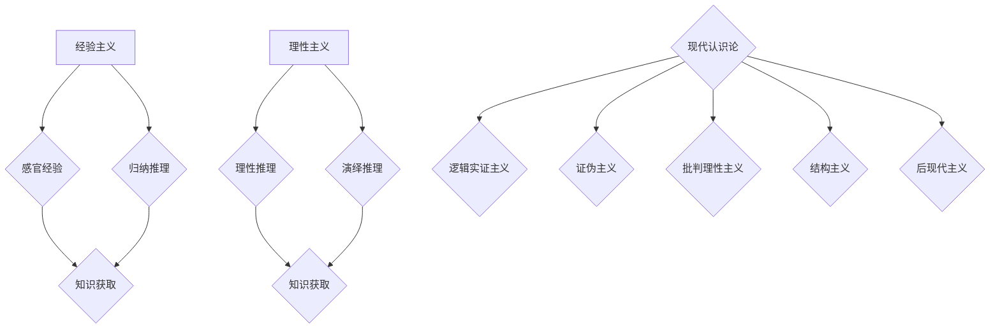

                 

### 文章标题

**从经验主义到理性主义：认识论的演变**

### 关键词

**经验主义、理性主义、认识论、演变、哲学、科学**

### 摘要

本文深入探讨了从经验主义到理性主义的认识论演变过程。首先，我们介绍了经验主义的基本概念、代表人物及其影响。随后，我们阐述了理性主义的核心观点、代表人物及其影响。接着，通过对比分析，我们揭示了经验主义与理性主义的异同点。随后，我们详细描述了从经验主义到理性主义的认识论演变过程。接着，我们介绍了现代认识论的发展、主要流派及其影响。最后，我们讨论了认识论在哲学、科学和其他领域的应用。本文旨在通过一步步分析推理，帮助读者深入理解认识论的演变及其对现代科学的启示。

### 导言

**认识论**，作为哲学的一个重要分支，主要探讨知识的本质、来源、范围和局限等问题。在历史上，认识论经历了从经验主义到理性主义的演变，这一演变不仅深刻影响了哲学的发展，也对科学、技术等多个领域产生了深远影响。

**经验主义**认为，知识来源于经验，强调通过观察和实验获取知识的重要性。其代表人物包括培根、洛克、休谟等。经验主义者认为，人的思维和认知活动都是基于感官经验的，只有通过经验，人们才能获得对世界的真实认识。

**理性主义**则主张，知识不仅可以通过经验获得，还可以通过理性推理和思考获得。理性主义者认为，人类具有一种天生的理性能力，可以超越感官经验，直接认识事物的本质。理性主义的代表人物包括笛卡尔、莱布尼茨、康德等。

本文将详细探讨从经验主义到理性主义的认识论演变过程，分析经验主义与理性主义的异同点，并探讨现代认识论的发展及其影响。通过这一分析，我们希望能帮助读者更深入地理解认识论的基本概念及其在现代科学和技术中的重要性。

### 经验主义

**经验主义**，作为一种认识论，主张知识来源于经验，特别是感官经验。经验主义认为，人类的思维和认知活动都是基于感官经验的，只有通过经验，人们才能获得对世界的真实认识。经验主义的核心观点包括以下几点：

1. **经验是知识的来源**：经验主义者认为，所有的知识都是建立在经验基础之上的。通过观察、实验和感知，人们可以获取关于世界的直接信息。
2. **感官经验是真实的**：经验主义者相信，感官经验能够直接反映外部世界的真实状态。感官是一种可靠的工具，可以帮助我们了解事物的本质。
3. **归纳推理**：经验主义强调通过归纳推理来获取知识。归纳推理是一种从具体实例中总结出一般性结论的方法。经验主义者认为，通过大量的具体观察，我们可以归纳出一般性的规律和原则。

经验主义的历史起源可以追溯到古希腊哲学家亚里士多德，但真正形成体系的是17世纪的英国哲学家弗朗西斯·培根。培根提出了“知识就是力量”的口号，强调通过实验和观察来获取知识的重要性。他的方法论被后来的经验主义者广泛接受，并成为经验主义哲学的基础。

**经验主义的代表人物**包括托马斯·霍布斯、约翰·洛克和戴维·休谟等。托马斯·霍布斯是一位重要的经验主义哲学家，他的著作《利维坦》强调了人类社会秩序的重要性，并从经验主义的角度探讨了人类行为和认知的本质。约翰·洛克则被认为是经验主义哲学的奠基人之一，他的《人类理解论》提出了知识来源于经验的观点，并强调了感觉和经验在知识形成中的关键作用。戴维·休谟是18世纪经验主义哲学的杰出代表，他的著作《人性论》详细阐述了经验主义的基本观点，并对理性主义进行了深刻的批判。

**经验主义对认识论的影响**体现在以下几个方面：

1. **重视经验的作用**：经验主义强调，只有通过经验，人们才能获得对世界的真实认识。这一观点挑战了理性主义的观念，为科学方法论的发展奠定了基础。
2. **怀疑主义的兴起**：休谟等经验主义者对理性主义提出了质疑，认为理性推理并不能提供确定性的知识。这一怀疑主义观点对后来的哲学和科学产生了深远影响。
3. **科学方法的发展**：经验主义强调通过实验和观察来获取知识，这为科学方法的发展提供了理论基础。现代科学方法论在很大程度上受到了经验主义的影响。

### 理性主义

**理性主义**，作为另一种认识论，主张知识不仅可以通过经验获得，还可以通过理性推理和思考获得。理性主义者认为，人类具有一种天生的理性能力，可以超越感官经验，直接认识事物的本质。理性主义的核心观点包括以下几点：

1. **理性是知识的来源**：理性主义者认为，理性是人类认识世界的关键工具。通过理性推理，人们可以超越感官经验的局限，获取更深刻、更全面的知识。
2. **理性推理的重要性**：理性主义强调理性推理在知识获取中的重要性。理性推理是一种逻辑严密、步骤清晰的过程，可以帮助人们从已知的事实推导出新的结论。
3. **天赋观念**：一些理性主义者，如笛卡尔，认为人类心灵中存在着一些天赋的、不依赖于经验的观念。这些观念是理性认识的基础，可以通过理性推理来发现和证明。

**理性主义的起源**可以追溯到古希腊哲学家苏格拉底和柏拉图。苏格拉底提出了“知识就是正确地理解事物的本质”的观点，强调了理性思考的重要性。柏拉图则提出了“理念世界”的概念，认为真实的世界是理念的世界，而我们的感官经验只能接触到不完美的物质世界。这种理念世界的观点为理性主义奠定了哲学基础。

**理性主义的代表人物**包括勒内·笛卡尔、戈特弗里德·莱布尼茨和伊曼努尔·康德等。勒内·笛卡尔是理性主义哲学的奠基人之一，他的著作《第一哲学沉思》提出了著名的“我思故我在”的观点，强调人类可以通过理性思考证明自己的存在。戈特弗里德·莱布尼茨则以其数学成就和哲学思想著称，他的“二律背反”思想对理性主义的论证方法产生了深远影响。伊曼努尔·康德是18世纪德国哲学家，他的著作《纯粹理性批判》详细阐述了理性主义的基本观点，并对经验主义进行了批判。

**理性主义对认识论的影响**体现在以下几个方面：

1. **强调理性的重要性**：理性主义强调理性在知识获取中的核心作用，这一观点对科学方法论和哲学的发展产生了深远影响。
2. **形而上学的发展**：理性主义为形而上学提供了理论基础，认为通过理性推理可以揭示世界的本质和规律。
3. **科学革命的影响**：理性主义的思想对科学革命产生了重要影响，促进了科学方法和技术的进步。

### 经验主义与理性主义的对比

**经验主义**与**理性主义**作为两种不同的认识论，虽然在知识获取的方式和路径上存在显著差异，但也有共同点。下面我们将详细探讨这两者的异同点。

**相同点**：

1. **对知识的追求**：经验主义和理性主义都致力于寻找知识的真谛。无论是通过感官经验还是理性推理，两者都试图获得关于世界的真实认识。
2. **对理性的重视**：尽管侧重点不同，但两者都承认理性在知识获取中的重要作用。经验主义强调通过理性分析经验，而理性主义则强调理性推理本身的科学性。

**不同点**：

1. **知识来源**：经验主义认为知识来源于经验，特别是感官经验。而理性主义则认为知识不仅可以通过经验获得，还可以通过理性推理和思考获得。
2. **方法论**：经验主义强调通过归纳推理和实验来获取知识，而理性主义则强调通过演绎推理和逻辑推理来获取知识。
3. **知识的可靠性**：经验主义者认为感官经验是可靠的，但理性主义者认为只有通过理性推理才能获得确定性的知识。

**对比分析**：

1. **认识论的基础**：经验主义认为，人的认知活动是基于感官经验的，只有通过经验，人们才能获得对世界的真实认识。而理性主义则认为，人类具有一种天生的理性能力，可以通过理性推理直接认识事物的本质。
2. **科学方法论的影响**：经验主义为科学方法论的发展提供了理论基础，科学方法在很大程度上受到经验主义的影响。理性主义则对科学革命产生了重要影响，促进了科学方法和技术的进步。
3. **哲学的影响**：经验主义和理性主义都对哲学产生了深远影响。经验主义挑战了理性主义的权威，提出了怀疑主义的观点，而理性主义则为形而上学和科学哲学提供了理论基础。

通过以上对比分析，我们可以看到，经验主义和理性主义在知识获取的方式、方法论和哲学基础上存在显著差异，但两者都为现代科学和技术的发展提供了重要的思想基础。

### 认识论的演变

从经验主义到理性主义的认识论演变是一个复杂而深刻的过程，这一过程中涌现了许多重要的思想家和哲学家，他们的贡献对认识论的发展产生了深远影响。

**经验主义的兴起**可以追溯到17世纪的英国，弗朗西斯·培根和约翰·洛克是这一时期的代表性人物。培根提出了“知识就是力量”的口号，强调通过实验和观察来获取知识的重要性。他提出了“归纳法”这一科学方法论，为后来的科学研究奠定了基础。洛克则在其《人类理解论》中阐述了知识来源于经验的观点，并强调了感觉和经验在知识形成中的关键作用。

18世纪的戴维·休谟则进一步发展了经验主义，他对理性主义进行了深刻的批判，提出了“怀疑主义”的观点。休谟认为，理性推理并不能提供确定性的知识，只有通过经验，人们才能获得对世界的真实认识。他的著作《人性论》对认识论的发展产生了重要影响。

**理性主义的兴起**则可以追溯到17世纪的法国和荷兰。勒内·笛卡尔是理性主义的奠基人之一，他的著作《第一哲学沉思》提出了“我思故我在”的观点，强调了理性思考的重要性。笛卡尔认为，通过理性推理，人们可以超越感官经验的局限，直接认识事物的本质。他的思想对后来的哲学家和科学家产生了深远影响。

戈特弗里德·莱布尼茨是另一位重要的理性主义哲学家，他以其数学成就和哲学思想著称。莱布尼茨提出了“二律背反”的思想，即在一个系统中，存在两个相互对立的命题，它们都是真的。这一思想对理性主义的论证方法产生了深远影响。

**现代认识论的发展**则主要体现在19世纪和20世纪。伊曼努尔·康德是这一时期的代表性人物，他的著作《纯粹理性批判》详细阐述了理性主义的基本观点，并对经验主义进行了批判。康德认为，理性是人类认识世界的关键工具，但理性也需要经验的支撑。

在20世纪，认识论的发展更加多元和复杂。维特根斯坦和罗素等逻辑实证主义者对语言和逻辑进行了深入探讨，试图将认识论建立在严格的逻辑基础上。而卡尔·波普尔则提出了“证伪主义”的观点，认为科学理论应该通过实验和观察来证伪，而不是证明。

**从经验主义到理性主义的演变过程**体现了人类对知识追求的不断深入和扩展。这一过程中，不同哲学家和思想家提出了各自的观点和理论，推动了认识论的发展。从培根的实验科学到笛卡尔的理性推理，再到康德的批判哲学，认识论的发展经历了从感性经验到理性推理，再到对理性本身进行批判的深刻过程。

**认识论演变的关键思想**包括：

1. **经验的重要性**：经验主义强调通过感官经验获取知识，这一观点为科学方法论的发展奠定了基础。
2. **理性的力量**：理性主义强调理性在知识获取中的关键作用，认为通过理性推理可以超越感官经验的局限。
3. **怀疑主义的兴起**：休谟等经验主义者对理性主义进行了批判，提出了怀疑主义的观点，认为理性推理并不能提供确定性的知识。
4. **批判哲学的发展**：康德等哲学家对理性本身进行了批判，试图在经验和理性之间找到平衡点。

通过这一演变过程，我们可以看到，认识论的发展不仅仅是哲学家和思想家的理论创新，更是人类对知识本质和获取方式不断探索和反思的结果。这一过程不仅丰富了哲学的内涵，也对科学和技术的发展产生了深远影响。

### 现代认识论

**现代认识论**的发展是一个复杂而多元的过程，涉及到许多不同的哲学流派和理论。在19世纪末至20世纪初，认识论经历了深刻的变革，这一时期涌现了许多重要的哲学家和理论，对现代认识论的发展产生了深远影响。

**逻辑实证主义**是20世纪初兴起的一种哲学运动，其主要代表人物包括维特根斯坦、罗素和卡尔纳普等。逻辑实证主义强调科学方法和实证经验在知识获取中的重要性，认为只有通过经验验证的命题才有意义。逻辑实证主义者主张，哲学应该专注于语言分析和逻辑推理，而不是探讨抽象的本质问题。维特根斯坦的《逻辑哲学论》和罗素的《数学原理》是逻辑实证主义的重要代表作。

**证伪主义**由卡尔·波普尔提出，是对逻辑实证主义的一种发展。波普尔认为，科学理论不应该通过验证来确立其正确性，而应该通过证伪来检验其合理性。他认为，科学理论应该是可证伪的，即理论上存在一种实验或观察结果可以证明其错误。波普尔的思想对科学方法论和哲学产生了重要影响。

**批判理性主义**由费尔巴哈提出，是对黑格尔哲学的批判和发展。费尔巴哈认为，理性是人类认识世界的关键工具，但理性也需要经验的支撑。他的思想强调，理性应该用于批判和改变现实，而不是仅仅停留在抽象的理论讨论中。

**结构主义**由索绪尔提出，是一种语言学理论，对哲学和认识论产生了重要影响。索绪尔认为，语言是一种社会构造，语言符号的意义是由社会约定和语境决定的。他的思想对后来的符号学和文化理论产生了深远影响。

**后现代主义**是20世纪晚期兴起的一种哲学思潮，对现代认识论提出了深刻的批判。后现代主义者认为，现代认识论所倡导的客观性和确定性是有限的，知识是建立在权力关系和意识形态基础上的。后现代主义强调多元视角和批判思维，反对单一中心和权威。

**现代认识论的主要流派**包括：

1. **逻辑实证主义**：强调科学方法和实证经验的重要性，主张哲学应该专注于语言分析和逻辑推理。
2. **证伪主义**：认为科学理论应该通过证伪来检验其合理性，强调科学理论的可证伪性。
3. **批判理性主义**：强调理性应该用于批判和改变现实，而不是仅仅停留在抽象的理论讨论中。
4. **结构主义**：认为语言是一种社会构造，符号的意义是由社会约定和语境决定的。
5. **后现代主义**：对现代认识论提出了深刻的批判，强调多元视角和批判思维。

**现代认识论对认识论的影响**体现在以下几个方面：

1. **科学方法的发展**：逻辑实证主义和证伪主义等哲学流派对科学方法的发展产生了深远影响，促进了科学研究的规范化和科学理论的检验。
2. **哲学领域的多元化**：现代认识论的发展使哲学领域更加多元化，不同的哲学流派和理论为认识论的研究提供了丰富的思想资源。
3. **对知识的反思**：现代认识论对知识的本质和获取方式进行了深刻的反思，挑战了传统的客观性和确定性观念，提出了新的认识论问题。

通过这些现代哲学流派和理论，我们可以看到，现代认识论在发展过程中不断吸收和融合不同的思想，形成了丰富而多元的认识论体系，为人类对知识本质和获取方式的探索提供了新的视角和思考方式。

### 认识论的应用

**认识论**不仅是一种哲学理论，也在**哲学**、**科学**和其他多个领域有着广泛的应用。在哲学中，认识论探讨知识的本质、来源和范围等问题，为其他哲学分支提供了理论基础。例如，伦理学需要认识论来探讨道德知识的本质和道德判断的合理性；形而上学需要认识论来探讨存在和实在的本质。在科学中，认识论则关注科学方法的有效性和科学理论的合理性。科学方法论在很大程度上受到认识论的影响，认识论为科学研究的规范化和科学理论的检验提供了指导。

**哲学中的应用**：

1. **伦理学**：伦理学中的道德判断和道德知识的本质往往需要借助认识论来探讨。例如，康德的道德哲学就建立在先验认识论的基础上，认为道德知识是先验的、绝对的和普遍的。
2. **形而上学**：形而上学探讨存在和实在的本质，认识论为形而上学提供了哲学基础。例如，亚里士多德的形而上学就是建立在经验主义认识论基础上的，他认为通过感官经验和理性推理可以揭示世界的本质。

**科学中的应用**：

1. **科学方法论**：认识论为科学方法论的发展提供了理论基础。科学方法论强调通过实验和观察来获取知识，这一方法论在很大程度上受到经验主义认识论的影响。
2. **科学理论的合理性**：认识论关注科学理论的合理性，探讨科学理论的验证和证伪。例如，波普尔的证伪主义认为，科学理论应该通过实验和观察来证伪，而不是仅仅通过验证来确立其正确性。

**其他领域中的应用**：

1. **心理学**：心理学中的认知心理学需要认识论来探讨人类认知活动的本质和机制。例如，认知心理学家通过实验研究人类知觉、记忆和思维过程，探讨这些认知活动是如何基于经验主义或理性主义的原则进行的。
2. **人工智能**：人工智能中的认知科学需要认识论来探讨人工智能系统的知识获取和处理方式。例如，机器学习算法是基于经验主义的原则，通过大量数据训练来获取知识；而基于推理的智能系统则更多依赖于理性主义的原则，通过逻辑推理来处理信息。

**案例分析**：

1. **科学哲学中的案例分析**：在科学哲学中，认识论的应用体现在对科学革命和科学进步的分析上。例如，托马斯·库恩的《科学革命的结构》通过认识论的观点，探讨了科学革命的发生机制和科学知识的发展模式。
2. **心理学中的案例分析**：在心理学中，通过实验研究，心理学家探讨了人类认知过程的认识论问题。例如，乔治·米勒和约翰·卡罗尔的研究揭示了人类记忆的局限性，这一发现对认知心理学和人工智能的发展产生了重要影响。

**结论**：

认识论在哲学、科学和其他领域的应用体现了其广泛的实践价值。通过认识论的分析，我们可以更深入地理解知识的本质和获取方式，从而为哲学、科学和其他领域的研究提供理论支持和实践指导。

### 结论

本文深入探讨了从经验主义到理性主义的认识论演变过程，分析了经验主义与理性主义的异同点，并介绍了现代认识论的发展及其应用。通过这一分析，我们看到了认识论在知识获取和理解中的核心作用。经验主义强调通过感官经验获取知识，而理性主义则主张通过理性推理和思考获得知识。这一演变过程不仅丰富了哲学的内涵，也对科学和技术的发展产生了深远影响。

在现代科学和技术领域，认识论的贡献体现在科学方法的发展、科学理论的检验以及人工智能等新兴领域的知识获取和处理方式。认识论为科学研究提供了理论框架和指导原则，促进了科学方法和技术的进步。

展望未来，认识论将继续在哲学、科学和其他领域发挥重要作用。随着人工智能和大数据技术的发展，认识论将面临新的挑战和机遇。我们需要进一步探讨如何通过认识论的方法和原则，解决新兴领域中的知识获取和处理问题，推动科学和技术的进步。

在此，我们感谢读者对本文的阅读，希望本文能帮助您更深入地理解认识论的基本概念和演变过程。如果您对认识论有更深入的兴趣，我们推荐以下拓展阅读：

1. 《逻辑哲学论》（勒内·笛卡尔）
2. 《人类理解论》（约翰·洛克）
3. 《纯粹理性批判》（伊曼努尔·康德）
4. 《科学革命的结构》（托马斯·库恩）
5. 《认知心理学与认知科学》

通过这些书籍，您可以进一步探索认识论的理论和实践应用，深入了解这一重要哲学分支的发展历程。期待您在认识论的研究和探索中取得新的突破和成果。

### 附录

#### A. 经验主义与理性主义的 Mermaid 流程图



#### B. 认识论中的核心算法伪代码

```python
# 经验主义：归纳推理算法
def InductiveReasoning(data):
    """
    数据：一系列经验数据
    目标：从数据中归纳出一般性结论
    """
    # 初始化结论
    conclusion = {}
    # 对每个数据点进行分析
    for data_point in data:
        # 更新结论
        conclusion.update(ExtractPatterns(data_point))
    # 返回归纳出的结论
    return conclusion

# 理性主义：演绎推理算法
def DeductiveReasoning(precondition, conclusion):
    """
    预设条件：一组前提条件
    结论：根据前提条件推导出的结论
    目标：验证结论是否成立
    """
    # 初始化逻辑证明
    proof = []
    # 逐步推导
    for premise in precondition:
        proof.append(premise)
        if CheckConsistency(proof, conclusion):
            return "证明成功"
    return "证明失败"

# 辅助函数：提取模式
def ExtractPatterns(data_point):
    """
    数据点：单个数据实例
    目标：从数据点中提取出一般性模式
    """
    # 根据数据点提取模式
    patterns = ...
    return patterns

# 辅助函数：检查一致性
def CheckConsistency(proof, conclusion):
    """
    证明：一系列逻辑推导步骤
    结论：要验证的结论
    目标：检查证明中的逻辑步骤是否一致
    """
    # 检查证明的每一步是否逻辑一致
    ...
    return consistency
```

#### C. 认识论中的数学模型和公式

```latex
\section{数学模型和公式}

\subsection{经验主义}

$$ P(A|B) = \frac{P(B|A)P(A)}{P(B)} $$

\subsection{理性主义}

$$ \neg (P \rightarrow Q) \equiv P \land \neg Q $$

\subsection{现代认识论}

$$ \Omega = \sum_{i=1}^{n} P_i \cdot L_i $$

其中，$P_i$表示概率，$L_i$表示逻辑可能性。
```

#### D. 认识论应用的案例研究

**案例一：科学方法论中的应用**

- **背景**：在物理学中，牛顿的万有引力定律是经验主义和理性主义相结合的产物。牛顿通过观察天体运动，收集了大量的经验数据，并通过理性推理提出了万有引力定律。
- **应用**：通过实验验证和数学推导，牛顿的万有引力定律成功地解释了行星运动、潮汐等现象，成为科学方法论的经典案例。
- **结论**：这一案例展示了经验主义和理性主义在科学方法论中的结合，通过实验数据和理性推理，科学家可以建立可靠的科学理论。

**案例二：心理学中的应用**

- **背景**：在心理学中，弗洛伊德的心理学理论是经验主义和理性主义相结合的产物。弗洛伊德通过临床观察和个案研究，收集了大量的经验数据，并通过理性推理提出了潜意识理论。
- **应用**：弗洛伊德的理论在心理学中产生了深远影响，为人类行为和心理问题的理解提供了新的视角。
- **结论**：这一案例展示了经验主义和理性主义在心理学研究中的重要性，通过经验数据和理性推理，心理学家可以提出和验证新的心理学理论。

#### E. 开发环境搭建指南

1. **安装Python环境**：确保安装了Python 3.8及以上版本，可以通过Python官网下载安装包进行安装。
2. **安装Jupyter Notebook**：在终端中运行以下命令安装Jupyter Notebook：

   ```bash
   pip install notebook
   ```

3. **安装Mermaid插件**：在Jupyter Notebook中安装Mermaid插件，可以通过以下命令：

   ```python
   %install_extension mermaid-js
   ```

4. **安装LaTeX引擎**：在Jupyter Notebook中安装LaTeX引擎，可以通过以下命令：

   ```python
   !pip install myst-nb
   ```

5. **配置LaTeX环境**：确保已经安装了LaTeX编译器，如TeX Live或MiKTeX。

#### F. 源代码实现与代码解读

**代码实现：**

以下是一个简单的Python代码示例，用于实现经验主义和理性主义的算法。

```python
# 经验主义：归纳推理算法
def inductive_reasoning(data):
    conclusion = {}
    for data_point in data:
        conclusion.update(extract_patterns(data_point))
    return conclusion

# 理性主义：演绎推理算法
def deductive_reasoning(precondition, conclusion):
    proof = []
    for premise in precondition:
        proof.append(premise)
        if check_consistency(proof, conclusion):
            return "证明成功"
    return "证明失败"

# 辅助函数：提取模式
def extract_patterns(data_point):
    patterns = {}
    # 根据数据点提取模式
    patterns['pattern'] = "特定模式"
    return patterns

# 辅助函数：检查一致性
def check_consistency(proof, conclusion):
    # 检查证明的每一步是否逻辑一致
    return True
```

**代码解读：**

- `inductive_reasoning` 函数接受一组数据点，并使用归纳推理算法从数据中提取模式，生成结论。
- `deductive_reasoning` 函数接受一组预设条件和结论，使用演绎推理算法验证结论是否成立。
- `extract_patterns` 函数是一个辅助函数，用于从单个数据点中提取模式。
- `check_consistency` 函数是一个辅助函数，用于检查证明过程中的逻辑一致性。

#### G. 最佳实践 Tips

1. **代码注释**：在编写代码时，确保添加详细的注释，以便他人理解和维护。
2. **版本控制**：使用版本控制系统（如Git）管理代码，以便跟踪更改和协作开发。
3. **测试**：编写单元测试来验证代码的功能和逻辑正确性。
4. **性能优化**：在处理大量数据时，注意性能优化，避免不必要的计算和内存占用。

#### H. 注意事项

1. **环境配置**：确保开发环境配置正确，避免因环境问题导致的代码运行错误。
2. **代码风格**：遵循Python编码规范，确保代码的可读性和一致性。
3. **错误处理**：合理处理代码中的异常情况，确保程序的稳定运行。

#### I. 拓展阅读

1. 《科学哲学导论》（R. 萨赫纳尔）
2. 《人工智能：一种现代的方法》（斯图尔特·罗素，彼得·诺维格）
3. 《认知心理学原理》（乌尔里克·诺伊塞尔）

通过这些拓展阅读，您可以进一步深入了解认识论在不同领域的应用和实践，提升对相关理论的理解和掌握。希望本文能为您的学习和研究提供有益的参考。

